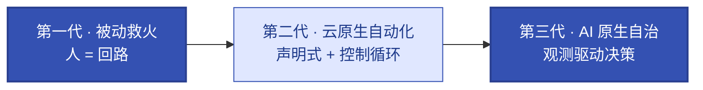

# 第1章 云原生与AI原生运维架构演进
<!-- 第一篇 现代运维范式 ｜ 常规章（全书开篇·伏笔三层自治） ｜ 状态：终审中 -->

> 本章立论：聚焦架构痛点迭代（零基础科普），讲清运维三代范式跃迁，并在结尾伏笔全书三层自治模型，铺垫理论递进逻辑。

> **边界声明**：本章只做架构演进立论与全书模型伏笔，不展开具体技术实现；具体机制由后续各章承接。**1↔3 分工**：本章只回答 Why（为什么从云原生走向 AI 原生）；"云原生底座 + AI 原生治理层"的正式范式定义、边界划分与 AI 负载生命周期归第 3 章（What）。超出部分归 V2。

---

本章核心图——运维三代范式跃迁（控制权从人向系统转移）：

## 1.1 运维三代范式核心跃迁：被动救火运维 → 云原生自动化运维 → AI原生智能自治运维

### 生产问题

一个 200+ 服务的在线业务团队，人均运维服务数从早期的 5 个涨到 30 个。故障恢复时间（MTTR）不降反升，值班工程师平均每晚被叫醒 1.3 次。核心矛盾很清楚：**系统复杂度的增长是指数级的，而人力是线性的，单纯加人补不过来**。更隐蔽的问题是——很多故障根本不该靠人来恢复：Pod 崩了该自动拉起、磁盘满了该自动扩容、流量洪峰该自动弹性。这些"本该自动"的事压在人身上，是因为运维的控制模式还停留在第一代。

### 传统方案失效原因

第一代「被动救火」运维有四个结构性缺陷，叠加起来让系统无法自我收敛：

- **告警驱动、出事才动**：没有"期望状态"的概念，靠人记忆和脚本能维持当下，无法向稳态收敛。系统稳不稳，取决于最近一次人工干预。
- **命令式、SSH + 脚本**：变更靠登机执行，没有声明、没有版本、不可重入、不可审计。"改了 48 台漏了 2 台"是常态，而这 2 台就是下一次故障的引信。
- **人肉扩缩容**：靠经验判断何时扩容，要么扩早了烧钱，要么扩晚了雪崩。判断质量随值班疲劳度下降。
- **知识在个人脑中**：资深工程师的排障经验没有沉淀为系统能力，离职即流失，新人接手周期以月计。

根本失效点：**被动 + 命令式 + 人驱动**，三者叠加，控制回路长在"人"身上。规模越大，回路越长越脆，最终崩于自身的复杂度。

### 架构约束与权衡

三代演进不是工具替换，是**控制权的转移**——从人向系统转移，每一代都用新的代价换取新的能力：

| 代际 | 控制权 | 换来的能力 | 付出的代价 |
|---|---|---|---|
| 第一代 被动救火 | 人作为回路 | 零基础设施投入 | 不可扩展、不可靠、依赖个人 |
| 第二代 云原生自动化 | 声明式 + 控制循环 | 稳态自愈、可扩展、可审计 | 接受声明式抽象、K8s 学习曲线、控制面复杂度 |
| 第三代 AI 原生智能自治 | 观测驱动的决策闭环 | 动态自适应、复杂负载治理 | 接受决策可解释性下降、需要治理护栏 |

关键认知：每一代都不是"更好"那么简单。把控制权交给系统，换来规模化的稳态维持，代价是抽象层变厚、治理成本上升。**跳过第二代直接上第三代是危险的**——没有机械自治打底的"智能自治"，等于把决策权交给一个连基础稳态都维持不住的系统。这也是本书坚持三层递进、不可跳级的原因。

### 最小可行方案

三代演进不是非此即彼，而是分层叠加。落地的最小可行路径：

1. **先把稳态维持交出去**：选定一个声明式平台（Kubernetes），让它负责 Pod 的重启、调度、基础扩缩。人不再当"重启按钮"。
2. **把变更从 SSH 迁到声明式 + 版本控制**：IaC（第 9 章）+ GitOps（第 10 章），让变更可追溯、可回滚、可审计。
3. **在自动化之上叠加观测**：先看见，再谈决策（第 12 章）。
4. **最后，对高频、有明确指标的决策引入闭环**：扩缩、限流、回滚自动化（第 16 章），直至 AI 负载的动态自治（第 18 章）。

这四步对应三层自治的成型过程：机械自治（L1）→ 运维自治（L2）→ 智能自治（L3），分别由第 5、16、18 章锚定。

### 生产落地实现

三代范式在实际栈里的映射是连续的台阶：

- **被动 → 自动化**：`Deployment` + `liveness/readiness` 探针替代人盯重启；`HPA` 替代人肉扩容；`PDB` 保护 voluntary disruption（第 7 章）。
- **自动化 → 可观测**：接入统一可观测栈 VictoriaMetrics/Loki/Tempo/OTel/Grafana（第 12 章），让稳态从"感觉还行"变成"指标说话"。
- **可观测 → 自治**：KEDA 按队列深度驱动弹性（第 16 章）；推理服务按 Token 吞吐与 KV 缓存命中率动态调度（第 18 章）。

这些不是可并行挑选的菜单项，而是同一条演进路径上必须依次踩实的台阶。

### 典型故障案例

凌晨某支付网关 Pod 内存泄漏触发 OOM，K8s 自动重启了容器（`restartPolicy: Always` 生效），值班看到告警、确认"已恢复"就收工。但**没人抓 heap dump、没人分析泄漏点、也没按内存增长趋势调 limit**——根因始终未明。两周后内存再次涨满 OOM，同一故障循环再来。

这是典型第一代范式——**只救火、不查因**：把"已重启"当"已解决"，靠 OOM→自动重启被动兜底。正确做法应是：可观测先看见内存增长趋势、在 OOM 前预警；OOM 时自动抓 heap dump、（AI 辅助）定位泄漏代码；运维侧按趋势调高 limit 兜底；业务侧按 dump 分析修掉泄漏。从"被动重启、两周一爆"到"观测 + 分析 + 自治、根治复发"，才是三代范式的真实差距。

### 根因定位

故障反复的根因不在内存泄漏本身（那是代码问题），而在**运维体系只做"事件响应"、不做"根因分析"**：OOM→自动重启被视为处置完成，却没有可观测看趋势、没有 dump 抓现场、没有分析找泄漏、没有按趋势调容量。恢复是事件驱动的被动兜底，而非持续观测 + 分析 + 收敛。每多一个服务，这类"只救火不查因"的盲点就多一个，体系脆弱性随规模线性放大。这不是某次值班没做好，是体系结构决定的必然。

### 长效治理方案

把控制回路从人转移到系统，人是回路的设计者而非执行者：

- **恢复从事件变常态**：声明式平台持续调谐，偏离期望自动纠正（机械自治，第 5 章）。
- **判断从人脑变指标**：SLO 驱动，决策有据可查（运维自治，第 16 章）。
- **复杂负载治理从经验变闭环**：AI 负载自适应（智能自治，第 18 章）。

### 自动化/自治闭环

演进的终态是三层闭环叠加成型，这正是全书结构主线。三层看着都像"观测 → 决策 → 校验"，真正的分水岭在**决策的智能度**——从"不决策"到"按固定规则决策"再到"推理 + 自适应决策"：

1. **机械自治（控制理论的"闭环控制"）**：期望状态 → 调谐循环 → 实际状态，秒级自愈。
   - 本质：最基础的硬编码自动化，系统不关心"为什么"，只关心"数字对不对"——把实际状态强制拉回你声明的期望状态，确定性、无判断。
   - 比喻：恒温空调。设 26℃，传感器发现 28℃ 立刻制冷，降回 26℃——全程基于物理指标的秒级响应。
2. **运维自治（传统可观测性 + 自动化运维）**：观测风险 → 决策处置 → 结果校验，分钟级治理。
   - 本质：基于专家经验和固定预案（Playbook）的数字化，引入"处置"、能跨模块复杂联动；决策逻辑是人预先写死的规则。
   - 比喻：汽车自动防撞（AEB）。雷达发现前方障碍且车速过快 → 执行预设代码切断油门、抱死刹车 → 校验车速是否降为 0、是否避免碰撞。
3. **智能自治（基于 AI Agent 的认知智能）**：观测 → 推理 → 决策 → 执行 → 校验 → 反馈，动态自适应。
   - 本质：真正的意图驱动（Intent-Driven），拥有"推理"和"自我修正"能力，不仅解决问题，还通过反馈丰富知识库、越用越聪明。
   - 比喻：全自动驾驶（L4/L5）。遇暴雨 / 修路 / 突发——观测路况、推理他车意图、决策是否变道绕行、执行、校验安全，再把这次经验反馈给全局大脑。

### 生产检查清单

- [ ] 是否还有"必须人盯才能恢复"的工作负载？
- [ ] 变更是否全部声明式 + 版本化（无 SSH 直改生产）？
- [ ] 是否有稳态指标（SLO）在持续度量系统健康度？
- [ ] 高频决策（扩缩/回滚/限流）是否已自动化？
- [ ] 是否已识别哪些负载适合进入第三层（AI 自治）治理？

---

## 1.2 传统分布式运维核心困境与云原生标准化根治思路

### 生产问题

同一个团队，迁移一套微服务到新环境，耗时三周还踩了一堆坑：配置项散落在 6 个地方（机器上的 conf 文件、CI 变量、运维 Wiki、启动脚本、Consul、人脑），依赖包版本靠"祖传镜像"，端口和磁盘挂载点全靠人肉核对。新环境跑起来后行为和生产不完全一致，因为"一致"这件事从来没有人能定义清楚。**环境的不可复现性，是传统分布式运维最贵的隐性成本**——它让每一次变更都带着不确定性。

### 传统方案失效原因

传统分布式运维的困境，根子在于"标准"的缺位：

- **配置离散、无单一真相源**：同一份配置在不同环境有不同形态，没人说得清"正确的值"是什么。
- **环境靠手工堆叠**：装系统、装依赖、改内核参数、挂盘，每台机器都是一个手工艺品，不可复制、不可追溯。
- **变更无原子性、无回滚**：改 50 台机器中途失败，留下一个半新半旧的环境，回滚比变更还危险。
- **故障不可复现**：出问题的环境一旦被动过，现场就毁了，事后复盘只能靠日志猜。

这四点共同指向一个事实：**没有标准化的"期望状态"表达，系统就无法被可靠地治理**。

### 架构约束与权衡

云原生的根治思路是用"标准化"换"可控性"，但标准化本身有代价：

- **用不可变基础设施换可复现**：代价是放弃运行时直接改环境的便利。换来的是任何环境的形成过程都可追溯、可重建（第 2 章）。
- **用声明式 API 换单一真相源**：代价是接受抽象、学习曲线。换来的是配置只有一份真相，环境差异变成 values 差异（第 5、9 章）。
- **用容器换运行时一致性**：代价是接受隔离边界、资源开销。换来的是"我这能跑、你那不能跑"彻底消失。
- **用控制循环换自愈**：代价是放弃"精确控制每一步"。换来的是系统持续向期望状态收敛。

权衡的核心：**标准化牺牲了灵活性，但买回了规模化下的可控性**。对 10 个服务的小团队，手工运维可能更顺手；对 200+ 服务，标准化不是选项，是生存前提。

### 最小可行方案

把"根治"拆成可落地的三步，每一步都有明确产出：

1. **环境镜像化**：所有运行时打包成 OCI 镜像，消灭"祖传镜像"和"机器上的隐藏配置"（第 2 章）。
2. **配置声明化**：用 Helm chart + values 表达部署形态，环境差异 = values 差异（第 9 章）。
3. **交付 GitOps 化**：Git 作为唯一真相源，ArgoCD 持续同步，变更天然可追溯可回滚（第 10 章）。

三步做完，"环境不一致"从一个靠人保证的口号，变成一个由系统保证的事实。

### 生产落地实现

- 配置治理：基础 chart 沉淀最佳实践，业务 chart 只填 values，公共变更一处生效（第 9 章）。
- 环境对齐：dev/qa/staging/prod 用同一份 chart、不同 values，差异显式且可审计。
- 变更可逆：GitOps 的每次同步都是一个 commit，回滚 = revert，原子且安全（第 10 章）。
- 故障可复现：从 Git + 镜像可重建任意历史环境，复盘有了客观现场。

### 典型故障案例

某次生产事故后复盘，发现根因是某台机器上的 `ulimit -n` 被前序运维临时改过但没记录，文件句柄耗尽导致服务异常。这台机器已经被动过多次，谁也说不清它当前的真实状态。复盘耗时一周，因为"重建问题环境"本身就成了难题。

点评：这是传统困境的典型放大——**环境的不可复现性让故障诊断成本爆炸**。如果环境是声明式 + 不可变的，这台机器的完整状态可以从 Git 重建，根因在小时内定位。

### 根因定位

根因不在某个配置改错，而在**治理范式的缺失**：没有单一真相源、没有不可变基线、没有可复现现场。单点配置错误是表象，体系性不可治理才是病根。每多一次手工干预，环境就离"可复现"更远一步。

### 长效治理方案

- **不可变基线**：运行时禁改，任何变更走重建流程（第 2 章）。
- **单一真相源**：Git 是唯一可信源，生产状态 = Git 状态（第 10 章）。
- **可复现闭环**：任意环境 = Git commit + 镜像 tag，可精确重建。

### 自动化/自治闭环

标准化是后续一切自动化的前提：没有期望状态的标准化表达，就没有可自动调谐的对象；没有可复现的环境，就没有可自动化的变更。本节建立的"标准化基线"，是第 5 章机械自治闭环能够运转的地基——控制循环要调谐，首先得有一个明确的"期望状态"可对比。

### 生产检查清单

- [ ] 是否还存在"只能在某台机器上跑"的服务？
- [ ] 配置是否有单一真相源（无散落在机器/脚本/人脑的影子配置）？
- [ ] 任意生产环境能否从 Git + 镜像在 30 分钟内重建？
- [ ] 变更是否全部原子化、可回滚？
- [ ] 故障现场是否能精确复现用于复盘？

---

## 1.3 AI原生时代运维重构本质：异构算力、动态模型服务、长任务场景对传统运维体系的颠覆

### 生产问题

团队上线了一个大模型推理服务，按云原生的成熟打法部署：Deployment + HPA（按 CPU 扩缩）+ liveness 探针。上线第一周就翻车：**CPU 利用率只有 40%，HPA 不触发扩容，但用户请求排队越来越长，首 Token 延迟从 0.8 秒飙到 6 秒**。更糟的是，某次批量推理任务跑了 40 分钟，被探针当成卡死杀掉重启，整个任务白跑。运维同学一脸懵：探针、HPA、滚动更新都是教科书配置，为什么对 AI 负载完全失效？

### 传统方案失效原因

云原生那套成熟范式，是为"短生命周期、无状态、CPU 密集"的传统微服务设计的。AI 负载的三个特性，恰好把它们逐个击穿：

- **异构算力**：AI 负载靠 GPU，而 K8s 默认只懂 CPU/内存。HPA 按 CPU 扩缩，对 GPU 利用率、显存、KV 缓存视而不见——于是出现"CPU 不高但服务已经过载"的诡异现象。
- **动态模型服务**：推理延迟不是常数，受 batch 大小、上下文长度、KV 缓存命中率剧烈影响。固定阈值的探针和告警无法刻画这种动态性，误杀和漏报并存。
- **长任务场景**：训练、长上下文推理、Agent 多步调用是分钟到小时级的长任务。传统滚动更新假设 Pod 可随时替换，对长任务等于"中途杀进程"，进度全丢。

失效的统一根因：**传统运维以"资源利用率"和"存活"为核心信号，而 AI 负载的真实健康信号是"推理性能"和"任务可完成性"**。信号错配，所有自动化决策都失准。

### 架构约束与权衡

AI 原生运维重构的本质，是承认 AI 负载与传统负载的运维信号不同，并为之建立专门的治理层：

- **算力治理**：从 CPU/内存配额，扩展到 GPU 设备插件、显存配额、算力池化（第 17 章）。代价：调度复杂度上升、需要专门的设备调度能力。
- **性能信号治理**：从 CPU/内存指标，扩展到 TTFT、TPOT、KV 缓存命中率、Token 吞吐（第 18 章）。代价：可观测栈要支持推理语义。
- **长任务治理**：从"可随时替换"，扩展到"原地升级、优雅终止、检查点续跑"。代价：工作负载模型变复杂。

权衡的核心：**AI 原生不是推翻云原生，而是在云原生底座上叠加一层专门治理 AI 负载特性的能力**。底座（K8s）不变，治理层（信号、调度、弹性）重构。这也是"双原生融合"的由来——云原生打地基，AI 原生盖楼。

### 最小可行方案

重构分三步，对应三个被击穿的特性：

1. **算力可见**：让 K8s 认得 GPU（设备插件），让指标体系采得到 GPU 利用率和显存（第 17 章）。
2. **信号正确**：把扩缩和告警的驱动指标，从 CPU 换成推理语义指标（队列深度、Token 吞吐、KV 命中率）（第 16、18 章）。
3. **长任务友好**：对推理/训练任务用原地升级和优雅终止，避免无谓重启（第 5、17 章）。

### 生产落地实现

- 算力：GPU 设备插件 + 节点标签 + 算力专有调度（第 17 章）。
- 弹性：KEDA 接推理队列深度驱动扩缩，补齐 HPA 只看 CPU 的短板（第 16 章）。
- 性能：vLLM/SGLang 暴露的推理指标接入统一可观测栈（第 18 章）。
- 长任务：推理服务配置 `terminationGracePeriodSeconds` + 优雅退出钩子；训练任务用支持检查点的负载类型。

### 典型故障案例

开篇那个推理服务，根因有三：(1) HPA 按 CPU 扩缩，但瓶颈在 GPU 显存和 KV 缓存，CPU 40% 是假象；(2) 探针用固定延迟阈值，prefill 阶段的长延迟被误判为卡死；(3) 滚动更新没有等待在途请求完成，导致推理中断。换成 GPU 感知调度 + KEDA 队列驱动 + 优雅终止后，排队消失，误杀归零。

### 根因定位

根因不在配置写错，而在**运维信号体系与负载特性错配**。把为短任务无状态服务设计的信号（CPU/存活/可替换），套用到异构算力 + 动态性能 + 长任务的 AI 负载上，必然失准。这是范式级别的错配，不是参数调优能解决的。

### 长效治理方案

- 建立 AI 负载专属的信号体系：算力（GPU/显存）、性能（TTFT/TPOT/缓存命中）、可完成性（队列/在途请求）。
- 建立 AI 负载专属的治理能力：GPU 调度、推理感知弹性、长任务生命周期（第 17、18 章）。
- 把这些能力固化进平台，让 AI 负载像普通服务一样可被标准化运维（第 16 章）。

### 自动化/自治闭环

本节定义的"AI 负载信号体系"，是第 18 章智能自治闭环的输入。没有正确的观测信号，就没有可靠的智能决策——这正是为什么智能自治（L3）必须建立在可观测（第 12 章）和运维自治（第 16 章）之上。三层不可跳级，根源在此。

### 生产检查清单

- [ ] AI 负载的扩缩是否基于推理语义指标（而非 CPU）？
- [ ] 探针阈值是否考虑了 prefill 阶段的长延迟？
- [ ] 长任务是否有优雅终止和检查点机制？
- [ ] GPU 利用率和显存是否纳入可观测与告警？
- [ ] 滚动更新是否会中断在途推理请求？

---

## 1.4 双原生融合架构核心设计目标：标准化、可观测、可治理、高韧性、可自治

### 生产问题

一个团队同时跑着 200 个传统微服务和 20 个 AI 推理服务，结果维护了两套互不相通的运维体系：传统服务用一套 DevOps 流水线，AI 服务另一套手工脚本 + 独立监控。**两套体系的割裂导致成本翻倍、人才无法复用、故障跨界传导无治理**。最痛的是，AI 服务出问题时，传统运维同学看不懂 GPU 指标；传统服务出问题时，AI 运维同学不熟 GitOps。团队在"双体系"的内耗里疲于奔命。

### 传统方案失效原因

"各搞各的"看起来是务实选择，实则三个结构性问题：

- **割裂即重复**：两套交付、两套监控、两套弹性，每一套都要人维护，成本不是 1+1，是乘法。
- **割裂即盲区**：传统服务调用 AI 服务时，链路跨了两套体系，可观测断链，故障定位要在两套系统间手工拼接。
- **割裂即失控**：没有统一的治理平面，变更、容量、成本各成孤岛，无法形成全书追求的"生产控制系统"。

根本失效点：**双原生不是两套系统的物理并存，而是要在同一套控制范式下统一治理两种负载**。割裂方案违背了这个本质。

### 架构约束与权衡

双原生融合架构的设计目标，是让"云原生底座"与"AI 原生治理层"在同一范式下协作。五个核心目标各有权衡：

| 目标 | 含义 | 代价 |
|---|---|---|
| **标准化** | 同一套交付/观测/治理标准适用两种负载 | 前期抽象成本高，需兼容两种负载特性 |
| **可观测** | 全域信号统一采集，跨负载链路贯通 | 可观测栈要支持推理语义，复杂度上升 |
| **可治理** | 变更、容量、成本有统一平面 | 需要平台层封装，组织协同成本 |
| **高韧性** | 故障跨界传导有隔离与自愈 | 隔离边界（namespace/集群）增加运维负担 |
| **可自治** | 稳态维持与决策从人转移到系统 | 需要治理护栏，接受部分决策不可解释 |

权衡的核心：**融合的收益是规模化的统一治理，代价是更高的前期抽象复杂度**。对只跑单一负载的团队，融合过度设计；对同时跑传统 + AI 负载的团队，融合是唯一可持续路径。

### 最小可行方案

融合不要求一步到位，按五个目标分层落地：

1. **标准化底座**：两种负载都跑在同一个 K8s 上，用同一套交付（GitOps）和可观测栈（第 9–12 章）。
2. **分层治理**：传统负载用云原生原生能力（HPA/Service），AI 负载用专门治理层（GPU 调度/KEDA/推理指标）（第 16–18 章）。
3. **统一平面**：平台工程把两种负载的共性能力（交付/观测/稳定性）封装成统一接口（第 15 章）。

### 生产落地实现

- 统一底座：所有负载（传统 + AI）部署在同一集群或同构多集群，共享 K8s 控制平面。
- 统一可观测：VictoriaMetrics/Loki/Tempo 同时采集传统指标与 AI 推理指标，Grafana 统一面板（第 12 章）。
- 分层弹性：传统负载用 HPA，AI 负载用 KEDA + GPU 感知调度（第 16、17 章）。
- 统一交付：Helm + ArgoCD 同时承载两种负载的 chart（第 9、10 章）。

### 典型故障案例

某次 AI 推理服务过载，雪崩传导到调用它的传统网关，但两套监控互不关联，值班先看到网关 5xx 飙升，花了 20 分钟才定位到上游 AI 服务。复盘结论：**链路跨负载断裂，导致故障定位时间 = 两个子系统定位时间之和**。融合后，Tempo 全链路追踪贯通两种负载，定位时间压到 2 分钟。

### 根因定位

根因不在某次响应慢，而在**治理范式的割裂**：没有统一的可观测与治理平面，跨负载故障天然成为盲区。割裂不是工程效率问题，是体系架构问题。

### 长效治理方案

- 统一可观测：一套栈贯通所有负载信号（第 12 章）。
- 统一治理：变更/容量/成本有统一平面，不再各搞各的（第 15、16 章）。
- 统一自治：三层自治模型同时覆盖传统与 AI 负载（第 5、16、18 章）。

### 自动化/自治闭环

双原生融合是三层自治模型得以贯通两种负载的前提：**机械自治**统一维持两种负载的基础稳态；**运维自治**用 SLO 统一治理两种负载的业务稳定性；**智能自治**专门处理 AI 负载的复杂动态性。融合不是目的，贯通三层自治才是。

### 生产检查清单

- [ ] 传统负载与 AI 负载是否共享同一 K8s 底座？
- [ ] 可观测是否一套栈贯通两种负载（含跨负载链路）？
- [ ] 弹性是否按负载特性分层（HPA / KEDA + GPU 感知）？
- [ ] 变更与成本是否有统一治理平面？
- [ ] 故障跨负载传导是否有隔离与快速定位能力？

---

## 1.5 全书核心模型伏笔：现代运维三层自治体系概述（机械自治 → 运维自治 → 智能自治）
<!-- 全书三层自治模型伏笔小节，铺垫第5/16/18章理论递进逻辑 ｜ 概念立论小节，10 步模板从简（重在模型伏笔，非生产工程步骤） -->

### 生产问题

一个经过云原生改造的团队，K8s 跑得很稳，Pod 崩了能自愈，变更走了 GitOps。但他们发现一个新瓶颈：**稳态维持自动化了，但"要不要扩容、要不要回滚、要不要限流"这些决策还是人在做**。值班工程师每天处理几十条告警，绝大多数是重复判断（队列涨了→扩容、错误率升了→回滚）。人变成了自动化的瓶颈——系统能自愈，但不能自治。再往后，AI 负载上线，决策的复杂度（KV 缓存命中率影响延迟、并发影响吞吐）又超出人脑实时判断的能力。**自愈解决不了自治，自治解决不了智能自治**，这是三层必须递进的现实根源。

### 传统方案失效原因

把"自治"当成一个开关、想一步到位，是常见误区：

- **跳过机械自治谈自治**：基础稳态都维持不住（Pod 频繁异常重启），却在上面叠加"智能决策"，决策依据的信号本身就是脏的，自治必然误判。
- **跳过运维自治谈智能自治**：没有 SLO 和结果校验机制，AI 决策的对错无人验证，等于放任一个黑盒改生产。
- **把三层混为一谈**：用一套规则同时处理稳态维持、业务治理、AI 动态优化，粒度错配，每一层都做不好。

失效根因：**三层自治各有不同的信号、不同的决策频率、不同的校验方式，混在一起必然互相干扰**。

### 架构约束与权衡

三层自治是严格递进的，每一层建立在前一层稳定可信赖的基础上：

| 层级 | 锚定章 | 信号 | 决策频率 | 校验方式 |
|---|---|---|---|---|
| **L1 机械自治** | 第 5 章 | 期望状态 vs 实际状态 | 秒级 | 资源是否收敛到期望 |
| **L2 运维自治** | 第 16 章 | SLO / 错误预算 / 业务指标 | 分钟级 | 处置后 SLO 是否恢复 |
| **L3 智能自治** | 第 18 章 | 推理性能 / KV 缓存 / 算力动态 | 动态自适应 | 决策后性能是否改善 |

权衡的核心：**每升一层，决策的复杂度和风险都上升一层，因此必须用更严格的结果校验来对冲**。L1 靠调谐闭环（确定性），L2 靠 SLO 校验（可量化），L3 靠性能反馈迭代（自适应）。这也是为什么不能跳级——上层校验依赖下层提供的可信基础。

### 最小可行方案

三层不是同时建，而是依次建：

1. **先建 L1**：让 K8s 调谐闭环可靠运转，所有负载有明确的期望状态，稳态自愈成为事实（第 5 章）。
2. **再建 L2**：在 L1 稳态之上叠加 SLO 体系，把"处置决策"从人变成闭环（监控→识别→处置→校验）（第 16 章）。
3. **最后建 L3**：在 L2 治理之上，对 AI 负载的复杂动态引入推理驱动的自适应闭环（第 18 章）。

每建完一层，验证它可靠后再建下一层。本书六篇的结构，正是这三层依次展开的路径。

### 生产落地实现

- L1 落地：声明式工作负载 + 探针 + 控制器，全覆盖（第 5 章）。
- L2 落地：SLO 定义 + 告警收敛 + KEDA 弹性 + 自动回滚（第 16 章）。
- L3 落地：推理指标采集 + 性能/容量模型 + 动态调度 + 反馈迭代（第 18 章）。

三层共享同一套可观测底座（第 12 章），但各自消费不同层级的信号。

### 典型故障案例

某团队跳过 L2 直接给推理服务上"智能弹性"，结果某次 KV 缓存命中率下降导致延迟上升，智能模块判定为"负载过高"疯狂扩容，但根因其实是缓存配置问题——扩容不解决根因，反而把 GPU 成本推高 3 倍。因为没有 L2 的 SLO 校验，决策对错无人发现，直到账单报警。

点评：**没有校验机制的智能自治，是昂贵的盲目**。这正是三层不可跳级的实证。

### 根因定位

根因不在智能模块算法差，而在**缺少 L2 的结果校验层**：决策没有"是否真的改善了 SLO"的闭环验证，错误决策被放大而非被纠正。三层递进的本质，是用逐层校验对冲逐层上升的决策风险。

### 长效治理方案

- 严格执行 L1→L2→L3 递进，每层有独立的信号与校验。
- 每层的决策都配套结果校验：L1 看收敛、L2 看 SLO、L3 看性能反馈。
- 上层决策依赖下层提供可信基础，下层不稳不开上层。

### 自动化/自治闭环

本节是全书结构的总纲。后续五章理论核心按此展开：

- **第 5 章（L1 机械自治）**：讲清调谐闭环如何维持基础设施稳态。
- **第 16 章（L2 运维自治）**：讲清 SLO 驱动的业务稳定性自治闭环。
- **第 18 章（L3 智能自治）**：讲清 AI 负载的推理驱动自适应闭环。

读完这三章，三层模型从伏笔变成可落地的工程体系。

### 生产检查清单

- [ ] L1 是否可靠（所有负载有期望状态且持续调谐）？
- [ ] L2 是否建立（处置决策有 SLO 校验闭环）？
- [ ] 是否避免了"跳级上智能自治"的诱惑？
- [ ] 每一层是否有独立、可信的结果校验机制？
- [ ] 上层决策是否建立在下层可信基础之上？
