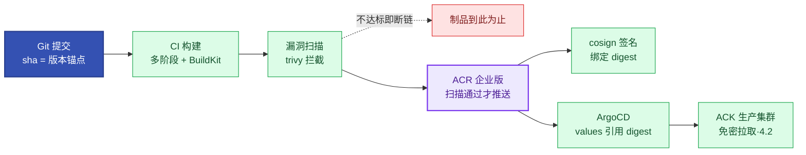

# 第2章 不可变基础设施与容器软件供应链治理
<!-- 第一篇 现代运维范式 ｜ 常规章（边界纯净·无 AI 内容） ｜ 状态：终审中 -->

> 本章定位：建立全书第一块地基——不可变基础设施与容器软件供应链。边界纯净，不涉及智能层内容（分诊器制品的供应链纪律复用本章，15.5）。
> **主线定位**：本章为制品不可变是声明式期望状态可信的前提——L1 机械自治的制品地基（三层自治见 1.5；L3 = 运维 Agent 引擎，15.4⑤/15.5）。 **主旨绑定**：AI 原生运维的制品地基——分诊器的 prompt/评测集同样走这条不可变供应链（进 Git、走 PR，15.5），制品不可变是 Agent 引擎可回放运行的物理前提。 **承上启下**：承第 1 章演进判断（制品可信是一切的物理起点）；启第 3 章立论宪法——地基就绪即可定纲 AI 原生运维范式；镜像在此交付，底座自第 4 章起运行。

---

## 2.1 不可变基础设施核心思想与生产约束：杜绝配置漂移、运行时禁改、版本可追溯、故障可复现

### 生产问题

100 节点的集群里，同一个服务 A 节点正常、B 节点偶发超时。排查三天，发现 B 节点半年前某次应急改过 `sysctl net.core.somaxconn`，无人记录，从此与 A 漂移。**配置漂移让故障不可预测、不可复现**——每次排障都要先回答一个无解的问题：这台机器现在到底是什么状态？

### 传统方案失效原因

不可变优于可变是业界定论，不再论证"为什么"，只算可变运维的账单（见下表）：

- 运行时可改 = 漂移必然发生：每次"登机临时调一下"都是一颗漂移种子。
- 无版本 = 不可追溯：回滚到"上一个已知良好状态"无从谈起，因为从没记录过。
- 不可复现 = 不可诊断：故障现场一旦被动过就毁了，复盘只能靠日志推测。

失效根因：**可变基础设施把"状态"和"过程"耦合在一起，且不记录过程**——状态成了无数手工操作的累积，复杂度必然失控。

### 架构约束与权衡

不可变用四条生产约束根治漂移，每条都有代价：

| 约束 | 含义 | 代价 |
|---|---|---|
| **杜绝配置漂移** | 配置来自声明式定义，不来自手工修改 | 放弃"快速登机改一下"的便利 |
| **运行时禁改** | 变更=重建实例，不就地修改 | 单次变更走构建-发布流程，更慢 |
| **版本可追溯** | 每个运行态对应一个不可变制品版本 | 需要版本与制品管理纪律 |
| **故障可复现** | 任意版本可从制品精确重建 | 状态外置（有状态部分外迁） |

权衡的核心：**不可变牺牲"单次快速修改"，买回"规模化下的可预测性"**——改配置走 Git→ArgoCD→重建、扩容靠节点池同镜像开机即入池（6 章）、回滚即回上一 digest、审计问 Git 与 ACR 不问机器；100 个节点各改各的复杂度指数爆炸，状态完全一致则线性可控。

### 最小可行方案

落地的最小约束集，逐条可执行：

1. **镜像即运行态**：所有运行依赖打包进 OCI 镜像，节点上不再装运行时依赖。
2. **配置外置 + 版本化**：配置走 ConfigMap/Helm values（声明式），不写进镜像、不落机器本地。
3. **状态外置**：有状态部分（数据）外置到 PV/对象存储/数据库，实例可随时销毁重建（7 章）。
4. **变更 = 换镜像/换配置，不就地改**：任何修改都通过重建 Pod 完成。

### 生产落地实现

不可变运维的标准动作——对照上表逐行执行，全程无 SSH、无 `kubectl edit`：

```bash
# 改配置：改 Git → ArgoCD 同步 → Pod 重建（8/9 章），漂移在源头消失
git commit -am "tune: gateway timeout 3s -> 5s" && git push

# 回滚：回 Git/镜像上一版本（应急白名单内，12.3），重建即回
argocd app rollback demo-api

# 审计：问 Git 与 ACR，不问任何一台机器
git log --oneline -5 -- charts/demo-api
crane digest acrbook-registry.cn-hangzhou.cr.aliyuncs.com/prod/demo-api:1.4.2   # 生产制品精确到 digest
```

- **节点本身不可变**：托管生态的落地 = ACK 节点池**自动升级 + 自动修复**（对照 EKS 托管节点组自动升级）——节点配置漂移不靠"修"，靠滚动替换消除；升级窗口与批次见 4.4。
- 云服务映射：镜像不可变 = ACR digest/tag 锁定（2.4）；配置不可变 = Git 真相源 + Helm/ArgoCD（8/9 章）；节点不可变 = ACK/EKS 节点池托管替换。
- 数字：同类"幽灵差异"故障，可变环境逐台比对 3 天；不可变环境直接 `kubectl -n prod delete pod` 让其从镜像重建，10 分钟收敛——**重建比修复便宜，是不可变的经济学基础**。

### 典型故障案例

某次扩容，新节点上的服务批量超时，老节点正常。根因是新节点镜像与老节点不一致（构建时基础镜像用了 `latest`，拉到不同版本）。事后 `latest` 全部换成 digest 锁定，漂移消失。

点评：**不可变的"不可变"必须端到端**——tag 用 `latest` 等于把可变性从"机器"挪到了"镜像"，漂移没消除只是换了个地方。

### 根因定位

根因不在某次构建失误，而在**不可变约束没有被端到端执行**：供应链任何一环允许可变（`latest` tag、运行时 patch、手工 hotfix），漂移就会从那一环渗入。不可变是系统属性，不是局部属性。

### 长效治理方案

 digest 锁定 + `latest` 禁令（2.4）、配置全声明式禁 SSH、节点池滚动替换、状态外置——与本节检查清单一一对应，逐项落为 CI/准入校验而非靠人记。

### 自动化/自治闭环

不可变是第 5 章机械自治的前提：**控制循环要调谐"期望状态 vs 实际状态"，前提是期望状态确定且不可变**——运行时可随意改动，期望状态就是移动靶，闭环无从收敛。本节为 L1 自治凝固"期望状态"。

### 生产检查清单

- [ ] 生产镜像全部 digest/不可变 tag 锁定（无 `latest`）？
- [ ] 还有 SSH 直改生产的路径吗（跳板机是否已收权）？
- [ ] 配置全部声明式外置（无机器本地影子配置）？
- [ ] 有状态部分全部外置（实例可随时销毁重建）？
- [ ] 节点池开启自动升级/自动修复（漂移靠替换消除）？

---

## 2.2 容器生产交付供应链极简链路：镜像构建 → 漏洞扫描 → 制品仓库 → 版本追踪 → 生产发布

### 生产问题

CI 直接把构建好的镜像 push 到生产仓库，跳过扫描和版本管控，理由是"赶发布"。一个含已知高危 CVE 的镜像进了生产，三天后被安全扫描发现，全量回滚耗时一整天；更糟的是没人能立刻说清"生产现在跑的是哪个版本、谁推的、什么时候推的"。**没有受控供应链的交付，等于把任意未经校验的制品直接送进生产——这不是快，是裸奔**。

### 传统方案失效原因

- **构建即发布**：build 完直接 push，中间没有闸门，任何构建错误直达生产。
- **无版本追踪**：tag 混乱（`v1`/`test`/时间戳混用），答不出"生产现在是什么"。
- **无安全校验**：漏洞扫描缺席，CVE 带病上线。

失效根因：**把"供应链"简化成了"一个 push"**——供应链的价值在于每个环节都是一道校验，砍掉环节等于砍掉防线。

### 架构约束与权衡

受控供应链五个环节串联（构建→扫描→仓库→版本→发布），每环节一道闸门：



权衡的核心：**每个环节增加交付时间，但成倍降低生产事故概率**——极简链路不是砍环节，是让每个环节最小化、自动化、不阻塞。

### 最小可行方案

最小受控链路（五环节都保留，各做最轻）：

1. **构建**：多阶段 Dockerfile + BuildKit 缓存，构建可追溯、版本可锚定（2.3）——tag=git sha 保证的是可追溯与版本锚定，不是 bit-for-bit 可复现（层时间戳/外部依赖所致，真复现需锁依赖版本 + SOURCE_DATE_EPOCH 等专门工程）。
2. **扫描**：CI 内嵌 trivy，HIGH/CRITICAL 阻断发布——先扫后推，不达标制品不进仓库。
3. **仓库**：ACR 企业版统一仓库，扫描通过才推送，生产只从此拉取（免密链路见 4.2）。
4. **版本**：tag = git commit sha，digest 锁定，禁 `latest`。
5. **发布**：ArgoCD 从 Git 同步（9 章），发布动作留痕可审计。

### 生产落地实现

**① 制品从提交到生产的完整旅程**（工具与拦截点逐环节落位）：

| 环节 | 工具/云服务 | 产出 | 拦截点（不达标即断链） |
|---|---|---|---|
| 1. 提交 | Git（GitHub） | commit sha | 分支保护 + 评审 |
| 2. CI 构建 | GitHub Actions + BuildKit | OCI 镜像（tag=sha，load 到本地） | 构建失败即止（2.3④） |
| 3. 扫描 | trivy（CI 内置，扫本地镜像） | 扫描报告 | HIGH,CRITICAL 命中 → exit 1，不推送 |
| 4. 仓库 | ACR 企业版（对照 ECR），扫描通过才推送 | 制品唯一可信源 | tag 不可变 + 保留策略（2.4） |
| 5. 签名 | cosign（key 模式） | 绑定 digest 的签名 | 未签名制品不进生产清单 |
| 6. 引用 | Git values 引 digest + ArgoCD | 部署清单 | 来源/验签准入（附录 A） |
| 7. 部署 | ACK 免密拉取（4.2） | 运行 Pod | 拉取失败即回滚（10 章） |

**② 生产引用 digest**（GitOps 真相源里的"生产现在是什么"）：

```yaml
# charts/demo-api/values-prod.yaml——生产引用一律 digest 或不可变 tag（9 章承接）
image:
  repository: acrbook-registry.cn-hangzhou.cr.aliyuncs.com/prod/demo-api
  digest: sha256:1f2e3d4f5a6b...      # 生产禁改：由 CI 流水线自动回写，人工只评审
  # tag: "1.4.2"                      # 可调：不可变版本 tag 替代 digest（可读性优先时，禁 latest）
```

- 云服务映射：仓库环节 = ACR 企业版（对照 ECR）；部署环节 = ACK 免密拉取（4.2）；ArgoCD 为自建交付栈，跑在托管底座上。
- 数字：trivy 扫一个 ~180MB 镜像 <1 分钟；高危 CVE"带病上线三天后发现"的全量回滚成本 ≈ 1 人天，闸门拦截成本 ≈ 0——**拦截点越靠前，事故成本越低三个数量级**。

### 典型故障案例

某次 CI 配置错误，把测试镜像打上生产 tag 直接发布，线上行为异常。因为 tag 无规范、发布无门禁，错误制品 10 分钟推全量。引入"tag=git-sha + 扫描门禁 + GitOps 审批"后，这类误推被结构上杜绝。

点评：**供应链事故几乎都不是技术问题，是流程缺位**。没有门禁的发布，失误必然直达生产。

### 根因定位

根因不在某次 CI 写错，而在**供应链没有受控环节**——每个事故都能映射到某个缺失或被绕过的环节。供应链的可靠性 = 最弱环节的可靠性。

### 长效治理方案

五环节全部自动化、留痕、不可绕过；高危自动阻断、来源单一（ACR）、发布只走 GitOps——逐项落为 CI 与仓库策略，不靠人工检查。

### 自动化/自治闭环

受控供应链是第 9 章 GitOps 的前置：GitOps 的"唯一可信源"必须建立在"制品可信"之上，而制品可信由供应链保证。本节为 L1/L2 自治提供"变更可控"的制品基座——从代码到生产每步可追溯、可校验、可回滚。

### 生产检查清单

- [ ] 镜像构建可追溯、版本可锚定（tag=git sha）？
- [ ] 统一企业仓库（ACR 企业版/ECR），生产只从此拉取？
- [ ] 自动化漏洞扫描且 HIGH,CRITICAL 阻断发布？
- [ ] 制品签名（cosign）+ 生产引用 digest（无 `latest`）？
- [ ] 发布全部走 GitOps（无 kubectl 直推）？

---

## 2.3 OCI规范、多阶段精简镜像、生产安全构建最小可行实践

### 生产问题

一个服务的镜像 2.3GB，构建一次 12 分钟，每次发布节点拉取耗时显著、磁盘被巨型镜像塞满。安全审计还发现镜像里带着完整编译工具链、SSH 客户端甚至源码——生产运行时完全用不到，却全是攻击面。**臃肿镜像是安全债 + 存储债 + 性能债的三重负担**。

### 传统方案失效原因

- **单阶段构建**：编译环境、源码、运行时全打进一个镜像。
- **重型基础镜像**：完整版起步，带一堆用不到的系统工具。
- **镜像内藏密钥/源码**：`COPY .` 把 `.env` 一起带进层里。
- **不可复现构建**：依赖外网拉包，不同时间构建结果不同。

失效根因：**把镜像当"环境快照"而非"最小运行制品"**——快照思维什么都往里塞，镜像既不安全也不高效。

### 架构约束与权衡

| 实践 | 作用 | 代价 |
|---|---|---|
| **OCI 规范** | 镜像跨仓库/运行时可移植 | 需符合规范的构建工具 |
| **多阶段构建** | 编译产物与运行时分离 | Dockerfile 稍复杂 |
| **精简基础镜像** | distroless/slim/alpine 砍攻击面 | 调试不便（无 shell） |
| **构建可追溯** | 同一 commit 的产物可锚定、可溯源 | 需锁依赖版本 |
| **secrets 不入镜像** | 构建期注入，不 COPY 进层 | 需构建期 secret 机制 |

体积账（Python 服务实例，VPC 内网拉取量级，以实测为准）：

| 构建方式 | 镜像体积 | 单节点拉取 | 50 节点扩容分发总量 |
|---|---|---|---|
| 单阶段（完整基础镜像+gcc+源码） | ~1.2GB | 30–90 秒 | ~60GB |
| 多阶段 slim（下①制品） | ~180MB | 3–10 秒 | ~9GB |
| 重型依赖分层（基础层+依赖+代码，按变更频率分层） | 2–4GB | 20–60 秒 | ~100–200GB，须 ACR 企业版 P2P 分发 |

体感换算：~180MB vs ~1.2GB = 内网拉取 3–10 秒 vs 30–90 秒（秒级 vs 分钟级）——大促紧急扩容 50 节点时，这就是"扩容速度"本身：精简镜像的新 Pod 在洪峰抵达前就已就绪，巨型镜像的节点还在等磁盘被逐层填满（分发总量 9GB vs 60GB）。

权衡的核心：**镜像越精简越安全高效，但调试越不便**——生产用精简镜像，调试用临时工具镜像或 ephemeral container，职责分离。

### 最小可行方案

1. **多阶段**：builder 阶段编译，runtime 只 `COPY --from=builder` 产物。
2. **精简基础镜像选型**：优先 distroless（无 shell，攻击面最小）→ 兼容受阻退 alpine（musl 注意）→ 依赖复杂时 slim 兜底——越精简越好，但不牺牲兼容性（下例用 slim，因 venv 依赖 glibc）。
3. **版本锁定**：基础镜像和依赖用明确版本/digest，构建可追溯、版本可锚定。
4. **secrets 外置**：构建期由 CI secret 注入，绝不 COPY 进镜像层。

### 生产落地实现

**① 通用服务多阶段 Dockerfile（完整制品）**：

```dockerfile
# syntax=docker/dockerfile:1.7
########## 阶段 1：builder——编译依赖；gcc/源码/缓存都不进最终镜像
FROM python:3.12-slim-bookworm AS builder
WORKDIR /build
COPY requirements.txt ./
# BuildKit 缓存挂载：pip 缓存落缓存卷，不进镜像层（见③）
RUN --mount=type=cache,target=/root/.cache/pip \
    python -m venv /opt/venv \
    && /opt/venv/bin/pip install -r requirements.txt

########## 阶段 2：runtime——只带虚拟环境 + 业务代码
FROM python:3.12-slim-bookworm
RUN useradd --create-home --uid 10001 app     # 非 root 运行账号（最小权限，附录 A）
WORKDIR /app
COPY --from=builder /opt/venv /opt/venv       # 单阶段 ~1.2GB → 多阶段 ~180MB 的关键一步
COPY src/ ./src/
ENV PATH="/opt/venv/bin:${PATH}" \
    PYTHONDONTWRITEBYTECODE=1
USER app                                      # 生产禁改：非 root 运行
EXPOSE 8080                                   # 可调：与服务监听端口一致
ENTRYPOINT ["python", "-m", "src.app"]
```

效果：单阶段（完整镜像+gcc+源码）~1.2GB → 多阶段 slim ~180MB，体积降约 85%；攻击面同步收敛（无编译器、无源码、无 shell 历史）。

**② 重型依赖分层 Dockerfile**（内嵌重型依赖的服务——如报表引擎、音视频处理；变更频率决定层序，最常变的放最上层）：

```dockerfile
# syntax=docker/dockerfile:1.7
########## 层 1：重型基础层——重而不常变：系统库 + 重型运行时，全公司共享
FROM debian:bookworm-slim
RUN apt-get update && apt-get install -y --no-install-recommends \
    ffmpeg libgeos-c1v5 fonts-noto-cjk \
    && rm -rf /var/lib/apt/lists/*
# 基础层 digest 锁定（2.2），升版本=换 digest 走完整供应链

########## 层 2：依赖层——业务侧 Python 包，变更频率中
WORKDIR /workspace
COPY requirements.txt ./
RUN --mount=type=cache,target=/root/.cache/pip \
    pip install -r requirements.txt

########## 层 3：代码层——最常变，改代码只重建这几 MB
COPY src/ ./src/
ENV PYTHONPATH=/workspace
RUN useradd --create-home --uid 10001 app && chown -R app /workspace
USER app                           # 生产禁改：非 root 运行
ENTRYPOINT ["python", "-m", "src.app"]
# 大体积数据文件不进镜像：字体包/资源包等由部署侧 PVC 只读挂载注入（7.3 OSS 只读分发承接）
```

大文件是数据制品不是镜像层：GB 级资源进镜像=每次发布全节点全量重拉，OSS 外置 + 只读挂载是正解（7.3）。

**③ BuildKit 缓存挂载**：`--mount=type=cache` 让依赖缓存落在缓存卷而非镜像层，CI 侧再加 registry 级缓存：

```bash
# 本地/ACR 场景：缓存随仓库走（GitHub Actions 用 type=gha，见④）
docker buildx build \
  --cache-from type=registry,ref=acrbook-registry.cn-hangzhou.cr.aliyuncs.com/prod/demo-api:buildcache \
  --cache-to type=registry,ref=acrbook-registry.cn-hangzhou.cr.aliyuncs.com/prod/demo-api:buildcache,mode=max \
  -t acrbook-registry.cn-hangzhou.cr.aliyuncs.com/prod/demo-api:${SHA} .
# 效果量级：依赖安装冷构建 6–8 分钟 → 缓存命中 <1 分钟；整链路 12 分钟 → 约 3 分钟
```

**④ CI 制品：GitHub Actions 构建→扫描拦截→推送 ACR→签名**（每步一条注释）：

```yaml
name: build-scan-sign
on:
  push:
    branches: [main]

env:
  REGISTRY: acrbook-registry.cn-hangzhou.cr.aliyuncs.com   # ACR 企业版专属域名，以实例详情页为准
  NS: prod

jobs:
  build:
    runs-on: ubuntu-latest
    permissions: { contents: read }
    steps:
      - uses: actions/checkout@v4                   # ① 取代码：tag 用 commit sha，版本锚点

      - uses: docker/setup-buildx-action@v3         # ② BuildKit 构建器：缓存挂载依赖它

      - uses: docker/login-action@v3                # ③ 登录 ACR：RAM 子账号，最小权限（仅该命名空间推送）
        with:
          registry: ${{ env.REGISTRY }}
          username: ${{ secrets.ACR_USERNAME }}
          password: ${{ secrets.ACR_PASSWORD }}

      - name: Build (load)                            # ④ 多阶段构建（tag=sha，可追溯）：load 到本地待扫，不直接 push
        id: build
        uses: docker/build-push-action@v6
        with:
          context: .
          load: true                                   # 生产禁改：先扫后推——扫描通过才推送（2.2 断链语义）
          tags: ${{ env.REGISTRY }}/${{ env.NS }}/demo-api:${{ github.sha }}
          cache-from: type=gha                         # 可调：CI 缓存策略（ACR 自动构建则用其内置缓存）
          cache-to: type=gha,mode=max

      - name: Scan gate                                # ⑤ 扫描闸门：扫本地 daemon 内镜像，HIGH/CRITICAL 命中即失败
        uses: aquasecurity/trivy-action@0.28.0
        with:
          image-ref: ${{ env.REGISTRY }}/${{ env.NS }}/demo-api:${{ github.sha }}
          severity: HIGH,CRITICAL
          exit-code: 1                                 # 生产禁改：门禁语义，阻断即流水线失败、制品不推送
          format: table

      - name: Push                                     # ⑥ 扫描通过才推送 ACR：不达标制品到此为止，永不进生产仓库
        run: docker push "${REGISTRY}/${NS}/demo-api:${{ github.sha }}"

      - uses: sigstore/cosign-installer@v3             # ⑦ 安装 cosign

      - name: Sign                                     # ⑧ 对 digest 签名（key 模式；验签见 2.4）
        env:
          COSIGN_PRIVATE_KEY: ${{ secrets.COSIGN_PRIVATE_KEY }}
          COSIGN_PASSWORD: ${{ secrets.COSIGN_PASSWORD }}
        run: |
          cosign sign --yes --key env://COSIGN_PRIVATE_KEY \
            "${REGISTRY}/${NS}/demo-api@${{ steps.build.outputs.digest }}"
```

- 云服务映射：推送目标 = ACR 企业版（对照 ECR：registry 换 `<acct>.dkr.ecr.<region>.amazonaws.com` + aws-actions/amazon-ecr-login）。若暂无 CI，ACR 自动构建绑定代码源亦可触发构建（产品能力，字段以官方文档为准）；本书主例 GitHub Actions——扫描/签名闸门更好挂。
- 数字：~180MB 镜像 ACR 内网拉取 3–10 秒 vs 单阶段 ~1.2GB 的 30–90 秒；重型分层镜像 2–4GB 拉取 20–60 秒（大文件外置 OSS 是正解，7.3）。

### 典型故障案例

某镜像内残留编译期用的 `.env` 文件（含数据库密码），推到仓库后被扫描出泄露。根因是单阶段构建 `COPY .` 把整个项目目录带进镜像。改多阶段 + secrets 不入镜像后，泄露面归零。

点评：**镜像层是不可变的，secrets 一旦入层就永久驻留**——即使后续删除也能从历史层恢复。这是镜像安全的硬约束。

### 根因定位

根因不在"忘了删 .env"，而在**构建范式没有分离"构建环境"与"运行制品"**——单阶段让运行镜像继承构建期全部内容，secrets、源码、工具链全部成为运行时攻击面。

### 长效治理方案

多阶段 + 精简基础镜像 + secrets 构建期注入为强制基线（CI 校验）；镜像体积/层数设上限自动告警（如通用服务 >500MB）。

### 自动化/自治闭环

精简安全镜像是供应链自动化的质量基线：**自动扫描（2.2）能高效拦截的前提，是攻击面已被多阶段构建收敛**——镜像精简，扫描才快、误报才少、门禁才可靠。本节为 L2 自治的"风险识别"提供低噪声输入。

### 生产检查清单

- [ ] 镜像多阶段构建（运行镜像无编译工具/源码）？
- [ ] 基础镜像精简（distroless/alpine/slim）且 digest/版本锁定？
- [ ] 以非 root（USER 指令）运行？
- [ ] secrets 绝不入镜像层（构建期注入）？
- [ ] BuildKit 缓存挂载生效（构建时间有量级改善）？
- [ ] CI 含扫描闸门（HIGH,CRITICAL 阻断）与 cosign 签名？
- [ ] 大体积数据文件不进镜像（OSS 外置 + 只读挂载，7.3）？

---

## 2.4 企业镜像仓库权限、版本管控、安全拦截生产规范

### 生产问题

先做一个思想实验（先自己想答案，再往下读）：

> 周三凌晨回滚，你拉取 `demo-api:20260814-1`——与周二部署时同名、同 tag、同一仓库。先猜：此刻拿到的镜像，和周二部署进生产的是同一个吗？

想十秒再往下读。答案是：**不一定，而且你无法证明**。只要仓库允许覆盖推送，这个 tag 就可能是周二之后任何人（或另一条流水线）重推的同名 tag——拉到的内容可能早已换过一轮，"回滚"因此变成一次盲抽。**tag 承诺的是"名字"，从不承诺"内容"**；能对内容作出承诺的只有 digest（sha256）：内容全局唯一、不可变，改动一个字节 digest 就换。所以"周二那个版本"的唯一可靠写法是 `demo-api@sha256:1f2e3d4f5a6b...`，tag 至多是人读的别名——这正是 9.6 Release Identity 把发布身份钉在 digest 上的原因，也是 2.1"latest 禁令"背后更一般的事实：**未开不可变保护的 tag 都是漂移入口**。

——tag 之外，仓库失控还有更日常的姿势：

公司用同一个镜像仓库账号给所有团队，权限是"全仓库读写"。某次实习生误删一个公共基础镜像 tag，十几个服务的 CI 集体构建失败，排查两小时；另一个团队把内部镜像 push 到公开项目，差点外泄。**仓库权限失控，等于把供应链的"唯一可信源"变成"唯一单点故障源"**——一个误操作就能瘫痪整个交付。

### 传统方案失效原因

- **单一账号 + 全权限**：人人能删能改能推，无角色区分。
- **无项目隔离**：所有镜像堆一起，误操作跨团队传导。
- **无删除保护**：tag 可被覆盖可被删，不可变原则失守。
- **无安全拦截**：CVE/策略不达标也能入库上线。

失效根因：**把仓库当成"存储"而非"治理对象"**——仓库是供应链中枢，没有治理的仓库是放大的风险。

### 架构约束与权衡

| 规范 | 作用 | 代价 |
|---|---|---|
| **权限最小化 + 项目隔离** | 按团队/环境分命名空间，最小权限 | 权限矩阵维护成本 |
| **版本不可变（tag 锁定）** | 制品发布后不可篡改 | 改制品须换 tag |
| **拉取来源管控** | 生产只从指定仓库拉取 | 需来源准入策略 |
| **安全拦截策略** | 不合规制品拒入库/上线 | 策略调优、误报治理 |

**制品四件套的保证等级表（你到底买到了什么）**：

| 能力 | 承诺 | 不承诺 |
|---|---|---|
| **tag** | 可读寻址——给人看的版本名 | 内容不变——未开不可变保护时可被任何人覆盖重推（上面思想实验里"背叛"的那一环） |
| **digest** | 内容全局唯一、不可变（sha256 变即内容变） | 可读性（人记不住），也不承诺该镜像无漏洞 |
| **扫描** | 扫描时刻的已知漏洞清单 | 零漏洞——新 CVE 随时披露，昨天全绿的镜像今天可能标红，所以扫描要周期重跑（CI 拦增量、仓库拦存量） |
| **签名** | 签名后未被篡改（验签=完整性校验） | 内容正确——签错的代码验签照样通过，正确性归测试与评审 |

一句话读法：**tag 给人读，digest 给机器锚定，扫描管"已知"，签名管"未篡改"——四者互不可替代，组合起来才是"制品可信"**。

主栈选型：**ACR 企业版**（对照 ECR）——跨地域同步、漏洞扫描、多副本高可用均已产品化。权衡的核心：仓库治理增加流程摩擦，但消除"误操作瘫痪全局"的系统性风险。

### 最小可行方案

1. **命名空间 + RBAC**：按团队/环境分命名空间，push/pull 权限分离，CI 用专用 RAM 子账号（只推特定命名空间）。
2. **tag 不可变**：开启 tag 不可变/删除保护，制品发布后不可篡改。
3. **生产来源单一**：ACK 集群只从 ACR 拉取（免密组件，见③），禁止公网随意拉取。
4. **入库/上线拦截**：扫描不通过阻断上线，签名校验纳入准入。

### 生产落地实现

**① ACR 企业版能力锚点**（实例规格/同步/保留策略均为产品能力，字段细节以官方文档为准）：

| 能力 | ACR 企业版（主参考） | AWS ECR（对照） | 生产参数锚点 |
|---|---|---|---|
| 同步/复制 | 实例间自动同步、跨地域复制 | 跨 Region 复制规则 | 多地域部署的镜像分发主干 |
| 保留策略 | 按仓库保留最近 N 个 tag | 生命周期策略 | 保留最近 N 个 Tag，N=30 `# 可调:`（高频服务可放宽至 60） |
| 安全扫描 | 内置漏洞扫描 | 基础扫描 | 与 CI trivy 互补：CI 拦增量、仓库拦存量 |

保留 30 tag 的存储账：通用服务 ~180MB × 30 ≈ 5.4GB/仓库，100 个服务 ≈ 540GB；重型镜像若 3GB × 30 tag = 90GB/仓库——又一个"大文件不进镜像"的理由（7.3 OSS 外置）。存储单价以官网当期价为准。体感：540GB 已装不下一块 512GB 的笔记本硬盘——100 个"小"服务静默吃掉一块盘。

N=30 不是常数，是三个变量的函数（按仓库分级取值）：

| 决策变量 | 倾向收紧 N（15–30） | 倾向放宽 N（60–120） |
|---|---|---|
| 发布频率 | 低频（周级发布，30 个 tag 已可回溯半年） | 高频（日多次发布，30 个 tag 只够回溯一两周） |
| 回滚窗口需求 | 短（问题当日暴露，回滚目标 ≤5 版） | 长（合规审计/长周期缺陷需回数月前版本） |
| 存储成本 | 敏感（AI 镜像 10GB 级，N=60 即 600GB/仓库） | 不敏感（通用服务 180MB 级，N 翻倍无感） |

**② 漏洞扫描策略表**（CI 与仓库双闸门统一口径）：

| 严重级别 | 动作 | 生效点 |
|---|---|---|
| **CRITICAL / HIGH** | 阻断（exit 1，不进生产清单） | CI trivy 闸门 + ACR 扫描策略 |
| **MEDIUM** | 告知（工单跟踪，7 天修复窗口） | 扫描报告/仓库页面 |
| **LOW** | 记录归档 | 扫描报告 |

**③ 拉取免密**：生产集群不用 imagePullSecret 长期凭据。ACK 安装免密组件 `aliyun-acr-credential`（组件中心一键安装，配置项以官方文档为准），组件用节点云身份/RRSA 换取 ACR 临时凭据并自动注入——凭据链与 4.2 的 RRSA 同源，AK/SK 零进集群。对照 ECR + EKS：同账号节点 IAM 角色授予 ECR 拉取权限后，kubelet 凭据插件用节点身份自动刷新 12 小时有效的 ECR token，同样零 Secret。

**④ cosign 签名 + 验签命令对**（key 模式保守写法，公私钥由密钥管理服务保管）：

```bash
# 签名在 CI 完成（2.3④ 第⑧步，对 digest 签——tag 可能被覆盖，digest 永不）
# 验签：发布前/部署侧校验，无有效签名即非零退出（生产禁改：必须验通过才放行）
cosign verify --key cosign.pub \
  acrbook-registry.cn-hangzhou.cr.aliyuncs.com/prod/demo-api@sha256:1f2e3d4f5a6b...

# 生产进阶：验签接 K8s 准入控制器（集群内只放行已签名镜像），配置细节归附录 A，深度归 V2
# keyless 是免密钥管理的主流路径：OIDC identity 绑定 commit（GHA 需 permissions: id-token: write）；key 模式多用于演示，深度归 V2
```

**⑤ latest 禁令与镜像引用规范**：

| | 写法 | 说明 |
|---|---|---|
| **Do** | `demo-api@sha256:1f2e…` 或 `demo-api:1.4.2`（不可变 tag） | digest 锁定最强；版本 tag 可读，两者都合规 |
| **Don't** | `demo-api:latest`、`demo-api:v1`（可变/语义模糊 tag） | 可变 tag = 漂移入口（2.1 案例） |

- 云服务映射：仓库治理全量落在 ACR 企业版（保留策略/同步/扫描/tag 不可变）；对照 ECR 用生命周期策略 + 跨 Region 复制 + IAM 仓库策略组合实现同等能力。
- 数字：保留 30 tag 后仓库扫描面收敛 ~70%（对比无策略时 tag 无限累积）；误删 tag 的故障恢复从 2 小时（人工回补）变为 0（删除保护直接拒绝）。

### 典型故障案例

实习生误删公共基础镜像 tag 导致 CI 集体失败的事故，在开启"生产命名空间 tag 不可变 + 删除需审批"后彻底消失——即便误操作，仓库也会拒绝执行。

点评：**仓库治理的价值在"让误操作执行不了"**。靠人小心不如靠系统拒绝，这是治理的本质。

### 根因定位

根因不在实习生粗心，而在**仓库缺少不可变与权限治理**——治理缺位时，任何人的任何操作都可能成为全局故障；治理到位时，错误操作被结构上拒绝。

### 长效治理方案

权限矩阵季度审计（附录 A.1）、tag 不可变 + 删除保护、来源单一 + 验签准入、扫描策略季度更新。

### 自动化/自治闭环

仓库治理是供应链自治的门禁层：**自动扫描（2.2）的拦截决策，要落到仓库的入库/上线策略上才有效**——不合规制品在仓库环节被拒绝，无需人工介入。本节为 L2 自治提供"自筛"执行点。

### 生产检查清单

- [ ] 仓库按团队/环境命名空间隔离 + RBAC 最小权限（CI 专用子账号）？
- [ ] 生产制品开启 tag 不可变/删除保护？
- [ ] 保留策略生效（保留最近 30 tag）且存储账可预测？
- [ ] 扫描策略统一：HIGH,CRITICAL 阻断 / MEDIUM 告知？
- [ ] ACK 免密组件（RRSA/节点云身份）拉取，无长期 imagePullSecret？
- [ ] cosign 签名+验签在链路中生效（准入验签指向附录 A）？
- [ ] 生产镜像引用一律 digest 或不可变 tag（无 `latest`）？
- [ ] 能复述保证等级表（tag 不承诺内容、扫描不承诺零漏洞、签名不承诺正确）？

> **下一章预告**：地基有了第一块，纲要即可立——第 3 章给出全书立论宪法：AI 原生运维的正式定义（用大模型与智能体重构运维）、底座与智能治理层的边界、六支柱与目标体系。
