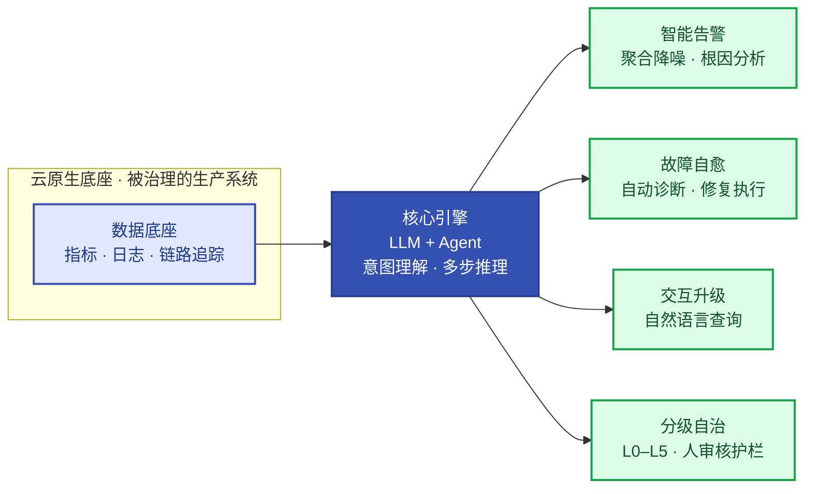

# 第3章 AI原生运维统一范式
<!-- 第一篇 现代运维范式 ｜ 全书立论宪法（永久不变） ｜ 状态：终审中 -->

> 本章定位：全书立论宪法。**以 AI 原生运维为全书主旨（V1.4）**——用大模型与智能体（AI Agent）作为核心引擎重构 IT 运维：将运维从"人驱动、规则执行"转变为"AI 驱动、人审核"的主动自治模式，实现从底层数据可观测到故障自愈的全链路智能化。本章按行业定义的支柱立论：**数据底座**（3.2）、**核心引擎**（3.3）、**分级自治**（3.4）、**三大应用场景**——智能告警、故障自愈、交互升级（3.5）。**V1.11 钉死：本书不讲"AI 训练/推理负载运维"——AI 只作为运维主体（引擎）出现，不作为运维对象。**
> **主线定位**：本章为定义 AI 原生运维的范式与主旨——L3 的对象是运维域本身（用 Agent 引擎重构运维），三层自治主线在此完成范式扩展（三层自治总览见 1.5，理论核心为第 5/16 章——L3 智能自治承载于 16.4⑤/16.5 运维 Agent 引擎）。 **承上启下**：承第 1 章 Why 与第 2 章制品地基（立论有了物理起点）；启第 4–16 章全部（范式定纲：主旨、数据底座、核心引擎、落地路线——What 既定，第 4 章起进入 How）。

> **边界声明**：本章只立范式与主线锚点，不展开具体制品实现——分诊器制品在 16.4⑤、落地路线在 16.5、数据栈工程在第 12 章；AI 训练/推理负载运维（GPU 调度、推理性能等）V1.11 移出本书范围。**1↔3 分工**：第 1 章已回答 Why（演进动机），本章回答 What——"云原生底座 + AI 原生运维层"的正式定义、六支柱与目标体系只在此章定一次，后续不再重复定义。超出部分归 V2。

---

本章核心图——AI 原生运维总纲（大模型与智能体作为核心引擎重构运维）：

## 3.1 云原生与AI原生运维的边界划分与协同关系

### 生产问题

一个团队有两套困惑：一半人认为"我们上了 K8s、写了自动化脚本，已经是智能运维了"；另一半人主张"买个大模型平台，让 AI 直接管生产"。前者把自动化当智能化，止步于规则；后者把引擎当系统，绕开底座与护栏。两次尝试都失败后团队困惑：**明明两头都在做，为什么"AI 重构运维"就是落不了地？** 答案在于没有厘清"云原生"与"AI 原生运维"的边界——两者不是对立，是分层：底座提供被治理的生产系统，智能层重构治理决策本身。错把一层的实践当成另一层，必然失配。

### 传统方案失效原因

两种常见的边界误判都会出事：

- **把 AI 原生运维等同于云原生自动化**：认为"跑在 K8s 上 + 脚本自动扩缩"就够了，忽视信号到处置之间缺一段"推理"。结果告警风暴、多维上下文关联仍全靠人，自动化只覆盖了可穷举的少数模式。
- **把 AI 原生运维与云原生对立**：认为智能引擎需要一套完全独立的体系，另起炉灶。结果引擎拿不到底座的数据与执行通道，空转在旁路系统里，重复建设、盲区横生（见 1.4 节）。

失效根因：**没认清两者的分层关系——云原生是底座（被治理的系统），AI 原生运维是治理层（用 LLM+Agent 重构治理决策）**。底座提供标准化运行环境与全域数据，治理层提供意图理解与多步推理。混淆层级，要么治理缺位，要么重复造轮子。

### 架构约束与权衡

正确的边界划分与协同关系：

| 层级 | 职责 | 提供的能力 |
|---|---|---|
| **云原生底座** | 被治理的生产系统 | 托管 K8s（ACK/EKS）调度、声明式 API、控制循环、不可变制品（ACR）、GitOps 交付、统一可观测 |
| **AI 原生运维层** | 重构治理决策本身 | LLM 意图理解、Agent 多步推理、建议式分诊、白名单自动执行、自然语言交互 |

协同关系：**AI 原生运维层建立在云原生底座之上，消费底座的全域数据，输出落在底座的执行通道内**。落到云生态，底座就是**托管 K8s（ACK 主参考、EKS 对照）+ 云服务（SLB/云盘/NAS/OSS、ACR）**，智能层的引擎与制品（分诊器、规则表、白名单）同样作为普通工作负载跑在底座上，通过只读 API 取数、通过 Git 与白名单通道生效——**不另起底座**（统一底座的完整论证见 4.1）。这就是主从分工的工程含义：**主旨是 AI 原生运维，云原生是它的底座**——底座为治理而生，治理跑得稳不稳，就是底座的验收标准。

权衡的核心：**底座要够通用（承载所有负载与治理件），智能层要够专精（吃透运维推理）**。底座过早特化会牺牲通用性，智能层不受边界约束又回到"AI 直接改生产"的失控陷阱。

还有一组必须钉死的区分——**AI 在本书中的唯一位置：运维主体**。AI 作为运维主体（运维 Agent——闭环中"推理分析"环节的载体，**本书主旨所在**）是全书组织视角；**本书不设"AI 负载"运维对象**（AI 训练/推理系统的运维 V1.11 移出本书范围）。主体视角不另起体系：运维 Agent 的工程形态就是既有闭环制品本身（决策规则表、白名单、护栏、影子模式，见 16.4②⑤/16.5），托管产品（阿里云 STAROps / AWS DevOps Agent，2026 年起相继商业化）是这套闭环的商业产品化。

**行业叙事对照（热词 → 书内落点）**：行业定义 AI 原生运维为"大模型与智能体重构运维、AI 驱动人审核的主动自治"（定义总纲与六支柱地图见 docs/README「全书主旨」及第 1 章章首），其叙事提法——主动洞察、AI 工作流、多智能体协作、运维 Skills、人机协同、智能告警、自然语言交互——方向与三层自治大体同向，但措辞普遍越过工程承诺边界。逐一钉死，防止读者拿行业话术套书内制品：

| 行业提法 | 书内落点 | 边界修正 |
|---|---|---|
| 主动洞察（故障前预测自愈） | burn-rate 双窗口预警（13.2）+ 容量与预算前置（13.2/14 章） | 书的"主动"= 预算烧穿前预警 + 容量前置；**不承诺预测式自愈**——保证等级表明示"忠实响应信号、不判断信号真伪"（16.4） |
| 审批流 → AI 工作流 | L2 闭环五步 + 处置映射表 + 处置契约三字段（16.4①③） | 自动化止步白名单内（可校验、可回滚、影响单服务）；跨服务/不可逆操作**永远人工审批**（13.3）——审批是风险控制，不是待消灭的负担 |
| 多智能体（Agent）协作 | 无 V1 落点 | **归 V2**（多 Agent 编排不进第一版）；"跨系统、跨团队联合处置"与白名单铁律直接冲突（16.4②） |
| 运维 Skills（可版本化原子技能） | 决策规则表 + 白名单 + 护栏 ConfigMap + 影子模式 + 评测集（16.4①②⑤/16.5②③，全进 Git、走 PR 评审） | **术语认领**：行业所称 Agent Skills 即书内"进 Git、PR 评审、可版本化"的闭环制品——同一件事，书用制品语言表达 |
| 统一数据资产 | 统一可观测（12 章）+ 故障台账（13.4）+ 服务注册表（16.2） | 不另立"数据资产"概念——底座落点已有，缺的是采集与口径统一，不是新概念 |
| 人机协同（训练师/策略管控者） | 白名单 PR 评审 + 影子模式灰度 + 闭环三数字（16.4④）+ 复盘迭代（14.4） | 角色叙事的实质是治理责任：规则表/白名单有人评审迭代，托管也不豁免（16.4 托管对照） |
| 智能告警（聚合降噪、根因分析） | 告警口径治理：分级/收敛/降噪/静默（13.1）+ 根因五问（13.3）+ LLM 建议式分诊（16.4⑤） | 语义聚合与自动 RCA 引擎归 V2——"终结告警爆炸"的 V1 答案是口径与分级，LLM 出建议、不出动作 |
| 自然语言交互（NL 查询健康/指标） | 只读值班问答（16.5④） | 托管已产品化（STAROps 自然语言诊断，16.4 托管对照）；自建全面 NL 查询/值班 copilot 归 V2 |

一句话收拢：**行业叙事讲"AI 能做什么"，本书写"治理件保什么"**——热词进书先过三问：落在哪个制品、承诺边界在哪、超界的归 V2。

### 最小可行方案

边界落地的最小划分：

1. **底座统一**：所有业务负载与治理件（含分诊器）跑在同一个 K8s，共享交付（GitOps）与可观测栈。
2. **治理分层**：可穷举的高频决策用规则自动化（16.4 白名单）；规则覆盖不了的推理决策叠加 LLM 建议式分诊（16.4⑤）。
3. **接口清晰**：智能层通过只读 API 取数、通过 Git 与白名单通道生效，不另起独立控制平面。

### 生产落地实现

- 底座共享：分诊器作为普通 Deployment 部署，与业务服务同构交付（第 4–10 章全套纪律适用）。
- 数据只读：引擎经云身份（RRSA/IRSA，附录 A 最小权限）只读监控/变更/工单 API。
- 通道复用：建议的执行仍走 16.4 白名单通道（KEDA 扩缩/Rollouts 回退），引擎不直接改生产。
- 扩展机制：治理规则用 ConfigMap/CR 表达，进 Git 走 PR（第 5/9 章声明式机制）。

### 典型故障案例

某团队把"智能告警平台"独立部署在可观测体系之外：平台收到的告警缺少 trace 与变更上下文，给出的根因建议泛泛而谈，值班宁可信自己的排查。融合后——引擎从统一栈取数、建议附证据链（关联变更 + 相似工单）——采纳率从三成升到七成。

点评：**边界划分不是物理隔离**。引擎必须长在底座的数据与执行通道上，旁路系统给不出可信建议。

### 根因定位

根因不在引擎选型，而在**边界划分失当导致引擎旁路化**。正确的边界是"底座统一、治理分层"，违背它就会出现空转、盲区、内耗。

### 长效治理方案

- 坚守"底座统一、治理分层"的边界原则。
- 智能层只做推理与建议，共性执行能力复用底座通道。
- 引擎制品（prompt/规则/白名单）与基础设施同一条声明式供应链（第 2/9/10 章）。

### 自动化/自治闭环

边界划分是三层自治模型贯通全域的前提：**L1 机械自治由统一底座提供，维持基础稳态；L2 运维自治的 SLO 体系治理业务稳定性；L3 智能自治用 Agent 引擎承载复杂故障的推理决策**。边界清晰，三层才能各司其职、协同递进。

### 生产检查清单

- [ ] 治理件（分诊器/规则/白名单）是否与业务负载共享同一 K8s 底座与交付纪律？
- [ ] 引擎取数是否只读（云身份最小权限）、生效是否走 Git 与白名单通道？
- [ ] 智能层是否只做推理与建议（无直接改生产路径）？
- [ ] 可观测是否一套栈贯通业务信号与治理上下文？
- [ ] 是否避免了对立（旁路系统）和混淆（把自动化当智能化）两种误判？

---

## 3.2 数据底座：全域可观测数据（指标、日志、链路追踪）是核心引擎的供给线

### 生产问题

团队先买了"智能运维"能力——告警分诊、根因分析，然后发现：指标在云监控里、日志散在 ECS 本地、链路根本没采。告警触发时引擎拿不到上下文，只能对着单条告警文本"猜"根因，建议笼统到不可用；换个团队，数据倒是全的，但同名指标三种口径、变更事实不在数据面里，引擎把一次发布回归误诊为容量不足。**没有数据底座，核心引擎就是无米之炊——garbage in, garbage out，这不是引擎问题，是供给线问题。**

### 传统方案失效原因

- **数据孤岛**：指标/日志/链路三套系统互不关联，trace ID 串不过服务边界。
- **口径不一**：同名指标多义、单位混乱，聚合降噪与跨服务比对无从做起。
- **上下文缺失**：变更事实、故障台账不在数据面内——而变更恰是根因的第一嫌疑。
- **供给无契约**：引擎需要什么数据、多久给到、以什么格式，从未被定义。

失效根因：**可观测是按"给人看"建的，不是按"给引擎用"建的**。人能容忍翻五个控制台，引擎的推理质量上限由数据完备度直接决定。

### 架构约束与权衡

数据底座 = 三支柱 + 两事实，五路数据一个检索面：

| 数据 | 作用 | 承载（锁死栈） |
|---|---|---|
| 指标 | 发现异常——量化的系统健康 | VictoriaMetrics（第 12 章） |
| 日志 | 定位现场——事件与错误细节 | Loki（第 12 章） |
| 链路追踪 | 跨服务归因——问题在哪一段 | Tempo（第 12 章） |
| 变更事实 | 根因第一嫌疑——最近改了什么 | ArgoCD Release Identity（10.6） |
| 故障台账 | 历史经验——相似故障怎么好的 | 13.4 台账 |

供给线契约（引擎视角的 SLA）：**告警触发 → 上下文四件套（关联告警/最近变更/SLO 状态/相似工单）60 秒内可装配**（16.5①）。

权衡的核心：**底座先行还是引擎先行**。引擎先行必空转（无米之炊）；底座先行即使暂无引擎，SLO 监控与应急也直接受益（13 章全部价值）——**底座先行是一张免费期权**，引擎随时可以接上。

### 最小可行方案

1. **三支柱统一栈**：VictoriaMetrics + Loki + Tempo + OTel 一套栈落地（第 12 章）。
2. **两事实接入**：变更事实（10.6）与故障台账（13.4）进同一检索面。
3. **定义装配契约**：四件套、60 秒、只读——写进平台验收标准。

### 生产落地实现

- 上下文装配器制品（把五路数据接成引擎进料口）见 16.5①——本章只立供给线契约，制品归 16 章。
- 采集标准固化进基础 chart：新服务接入即默认带指标/日志/trace（15.3/16.2）。
- 云服务映射：自建栈跑在 ACK（对照 EKS）；<50 节点小团队可用 ARMS/CloudWatch 托管监控过渡（12.1 决策表）。
- 数字：MTTD ≤5 分钟（12 章承诺）；四件套装配 ≤60 秒（16.5 口径）；日志检索 p95 <10 秒。

### 典型故障案例

某次大促压测夜，错误率告警触发，但日志与 trace 未关联，值班人工翻五个系统拼时间线，40 分钟才定位到一次发布回归。统一栈 + trace 贯通后，同类故障从告警到定位 2 分钟——快出来的 38 分钟，正是数据底座的价值。

点评：**引擎（无论人还是 LLM）的推理上限由数据完备度决定**。供给线断在哪，定位就卡在哪。

### 根因定位

根因不在告警太多，而在**数据供给线断裂**。三支柱各自为政 + 变更/台账缺席，任何推理者（人或引擎）都只能瞎子摸象。

### 长效治理方案

- 三支柱 + 变更 + 台账五位一体，唯一检索面。
- 采集与口径标准进基础 chart，新服务默认继承。
- 装配契约（四件套/60 秒/只读）纳入平台验收与季度审计。

### 自动化/自治闭环

数据底座是六支柱第一支柱：**L2 的输入、L3 的供给线——没有全域可观测，智能自治就是瞎子**。本节立契约，工程全貌在第 12 章，装配制品在 16.5①。

### 生产检查清单

- [ ] 指标/日志/链路是否一套栈、一个检索面（trace ID 可跨服务贯穿）？
- [ ] 变更事实与故障台账是否可被引擎检索？
- [ ] 四件套装配是否达到 60 秒契约？
- [ ] 新服务是否默认继承采集标准（不靠人工配置）？
- [ ] 指标口径是否全局唯一（同名同义同单位）？

---

## 3.3 核心引擎：基于大语言模型与AI Agent的意图理解与多步推理

### 生产问题

告警收敛与口径分级都做了（13 章纪律），值班仍疲于奔命：一条 P1 告警的研判要交叉五路信息——近 1 小时关联告警、最近 2 小时变更、SLO 错误预算余量、依赖拓扑、历史相似工单。人工做完一轮交叉推理，10 分钟起步；告警风暴时并发五条 P1，人脑直接过载，只能按"最像上次的那个"处置。**规则引擎穷举不了故障模式（组合爆炸），人脑撑不住并发推理（疲劳即误判）——信号到处置之间，缺一段"推理"。这正是行业定义里"核心引擎（LLM + Agent 意图理解与多步推理）"要补的位置。**

### 传统方案失效原因

- **规则引擎天花板**：if-else 穷举故障组合，规则数随维度指数增长，维护成本失控，最终只覆盖三成高频场景。
- **人工推理不可持续**：7×24、多上下文并发，判断质量随疲劳度下降（1.1 的第一代困境在决策层重演）。
- **关键词匹配脆弱**：告警文本稍变即失配，"扩容消费者"匹配不上"消费积压"。
- **知识沉没**：资深工程师的排障经验留在脑中与聊天记录里，不进系统、不可复用。

失效根因：**运维知识是自然语言形态的（Runbook、复盘、工单），而传统自动化只能消费结构化规则**——形态错配，知识无法激活。

### 架构约束与权衡

核心引擎 = LLM（意图理解）+ Agent（多步推理）：

| 能力 | LLM 贡献 | Agent 形态贡献 |
|---|---|---|
| 意图理解 | 读懂告警/工单的自然语言语义（"消费积压"≈"扩容消费者"） | — |
| 多步推理 | 根因假设-证据链推理（变更？容量？依赖？） | 装配上下文 → 推理 → 建议 → 落台账的执行骨架与工具调用（只读 API） |
| 知识激活 | 把 Runbook/历史工单读进推理过程 | 检索相似工单（13.4 台账向量化） |

**V1 形态铁律：建议式引擎——LLM 在环、人在回路、执行在白名单**。LLM 读告警与上下文，输出结构化建议（根因假设 + 建议动作 + 置信度）；建议只进工单与台账，执行仍走白名单通道。一句话：**LLM 可以建议，不可以执行**（16.4⑤）。执行式引擎（直接改生产）归 V2。

保证等级（承诺/不承诺，完整表见 16.4⑤）：承诺——P0/P1 告警 60 秒内附结构化建议、只读数据访问、全量可审计；不承诺——建议正确性（幻觉风险由人审采纳对冲）、自我进化（prompt 改动一律 PR 评审）。

权衡的核心：**要不要上引擎、上到什么程度，取决于四个变量**——告警量（日 <50 条且维度单一，规则可撑）、上下文维度（变更/依赖/预算交叉越多，推理溢价越高）、人力成本（值班人力是否已成主要开支）、风险偏好（建议式零执行风险，可先行试）。

### 最小可行方案

1. **挑 3 条最高频 P1 告警**接入建议式分诊，影子运行（建议只写工单）。
2. **上下文四件套接通**（3.2 供给线契约达成）。
3. **建评测集门禁**：≥50 条标注、≥20% 负例、准确率 ≥80% 才许变更上线（16.5②）。

### 生产落地实现

- 分诊器制品（输入只读四件套、输出三字段：`cause_hypothesis`/`suggested_action`/`confidence`）完整实现见 16.4⑤。
- prompt 与 few-shot 模板进 Git、走 PR，与白名单同仓库同评审（第 9/10 章供应链纪律原样适用）。
- 云服务映射：模型 API = 阿里云百炼 DashScope（对照 AWS Bedrock，云身份 RRSA/IRSA 按附录 A 收窄）；托管对照 = STAROps / AWS DevOps Agent（"自主分诊 + 处置建议"的产品化形态）。
- 数字：建议延迟 ≤60 秒（异步不阻塞路由）；采纳率 ≥50% 起步、6 个月 ≥70%；token 日预算封顶（超限降级为纯规则分诊）。

### 典型故障案例

某团队分诊器上线两个月，采纳率 85%——远超目标，评审会准备扩大白名单。复盘发现评测集全是正例，模型学会了"无脑建议扩容"；一次 DB 慢查询导致的预算燃烧也被建议"扩容消费者"，值班顺手采纳，浪费 40 分钟在无效处置上。补负例、门禁加"负例零放过"后，采纳率回落到 62%——这才是健康值（16.5 案例）。

点评：**采纳率虚高不是引擎变强，是评测集变弱**。"知道什么时候不动手"比"建议动手"难得多，也重要得多。

### 根因定位

根因不在模型能力，而在**评测缺位**：无负例、无门禁、无拒绝归因——"人审核"没有度量，就退化成"人凭感觉"。引擎是"数据 + 评测 + 护栏"养出来的，不是买来的。

### 长效治理方案

- 评测集进 Git，与白名单/prompt 同仓库同 PR；模型/prompt 变更跑回归过 80% 门禁。
- 月度四数字运营：采纳率、负例误触发（必须为 0）、自动执行占比、误处置率（16.5）。
- 拒绝原因 Top3 每月归因进评测集——引擎随故障谱演进，不腐化。

### 自动化/自治闭环

核心引擎是六支柱第二支柱、L3 的本体：**"观测 → 推理 → 决策 → 执行 → 校验 → 反馈"中"推理"环节的载体**。它把 L2 闭环装上认知引擎——三层自治由此完成最后一级；其工程形态与护栏全貌在 16.4⑤/16.5。

### 生产检查清单

- [ ] 引擎是否建议式（无生产写路径、执行走白名单）？
- [ ] prompt/评测集/白名单是否同仓库、PR 评审、版本化？
- [ ] 评测集是否 ≥20% 负例且门禁"负例零放过"？
- [ ] 建议是否全量落台账（含 prompt 版本与采纳结果）？
- [ ] 月度四数字是否在出（采纳率/负例误触发/自动执行占比/误处置率）？

---

## 3.4 分级自治：参考L0–L5自智标准，逐步迈向高阶自主判断与执行

### 生产问题

管理层提出"明年实现无人值守运维"，团队无从下手：说不清现在到底站在哪一级、升一级要补什么、每级要配什么护栏。有的团队把"重启自愈"当成已实现智能运维，有的团队跳过一切直接让大模型执行生产操作——一次误处置全线回退。**自治不是一个开关，是一架阶梯——不知道自己站在哪一级、每级的准入条件是什么，要么原地踏步，要么坠落。**

### 传统方案失效原因

- **跳级**：L2 白名单与结果校验未建，直接上执行式引擎——决策无校验，等于放任黑盒改生产（1.5 案例）。
- **混级**：用一套机制同时处理稳态维持与推理决策——粒度错配，每层都做不好（1.5）。
- **无护栏升级**：只升权限不升校验——自治等级越高，一次错误的爆炸半径越大。
- **对标失焦**：拿"L5 全自治"的行业远景当明年 KPI，承诺了工程上无法保证的东西。

失效根因：**把"自治程度"当成一维开关，没有建立"分级 + 每级准入 + 逐级护栏"的阶梯模型**。

### 架构约束与权衡

两把尺，正交使用：**行业 L0–L5 量"自治程度"**（人保留多少决策权），**本书 L1–L3 分"治理对象"**（基础设施稳态/业务稳定性/复杂故障推理）。对照如下：

| 行业自智等级 | 含义 | 本书落点 |
|---|---|---|
| L0 全人工 | 人做一切决策 | 第一代运维（1.1） |
| L1 辅助决策 | 工具辅助人（Runbook/脚本） | 第一代向第二代过渡 |
| L2 部分自愈 | 规则驱动的局部自愈 | **L1 机械自治（第 5 章）** |
| L3 有条件自治 | 白名单内自动、异常转人工 | **L2 运维自治（第 16 章）+ 16.5 步 5"AI 驱动、人审核"** |
| L4 高度自治 | 推理决策、自主执行 | V2 执行式引擎方向（影子 → 灰度推进） |
| L5 全自治 | 无人值守 | 行业远景——工程上**不作承诺**（保证等级纪律，3.3） |

**V1 站位：16.5 步 5 完成 ≈ L3 有条件自治**——"AI 驱动止于白名单，人审核落在采纳与抽检"。每升一级的准入条件：下一级的校验与护栏全部稳定运行（误处置率 ≤5%、负例零误触发），且组织信任经月度数字积累。

权衡的核心：**升级速度取决于四个变量**——故障重复度（越高越值得自动）、信号可信度（双窗口口径是否稳定）、处置可逆性（可逆才配自动）、校验自动化程度（SLO 回归是否无人值守）。四条不齐，停在当前级是正确决策。

### 最小可行方案

1. **定位当前级**：用上表对号入座——多数"自以为 L3"的团队实际在 L1–L2。
2. **补齐当前级护栏**：上限/开关/人工阻断三件套（16.1 R10）。
3. **按 16.5 七步路线爬梯**：数据供给线 → 口径分级 → 自愈通道 → 建议式引擎 → 评测门禁 → 白名单自动执行 → 持续运营。

### 生产落地实现

- 七步施工路线（每步锚定章节与验收标志）完整见 16.5——本章只立阶梯模型。
- 90 天节奏：第 1–30 天建议式引擎影子运行 → 第 31–60 天评测门禁 → 第 61–90 天首条白名单自动执行（16.5）。
- 数字：自动处置占比 ≥60%（长期 ≥80%）、误处置率 ≤5%、人工升级率 20%–40%（16.4④ 三数字）。

### 典型故障案例

某团队跳过评测门禁，直接让分诊引擎自动执行建议：一次 DB 慢查询导致的预算燃烧被建议为"扩容消费者"，自动执行后 40 分钟无效处置——扩容不解决慢查询。因为没有评测负例与 SLO 校验，错误建议被自动放大（1.5/16.5 同源案例）。

点评：**没有校验机制的自治，是昂贵的盲目**——自治等级越高，护栏必须越严（No Verification, No Autonomy）。

### 根因定位

根因不在引擎或工具，而在**阶梯模型缺位**：不知道站位、没有准入、缺护栏的"升级"，本质是拿生产做赌注。

### 长效治理方案

- 每季度用 L0–L5 × L1–L3 双尺盘点站位，写入稳定性复盘（14.4）。
- 每级护栏（上限/开关/人工阻断）随级上线，不后补。
- 升级决策用四变量 + 三数字驱动，不用愿景驱动。

### 自动化/自治闭环

分级自治是六支柱第三支柱：**它给其余支柱定了推进的节奏与安全边界**——数据底座（3.2）与核心引擎（3.3）在哪个等级被消费、自动执行开到多大，都由分级模型裁决。行业 L0–L5 与本书 L1–L3 的完整对照在 1.5/16.1。

### 生产检查清单

- [ ] 能用双尺说清团队当前站位（L0–L5 哪级、L1–L3 哪层）？
- [ ] 当前级的三类护栏（上限/开关/人工阻断）是否齐备？
- [ ] 升级是否走"校验先行"（下一级校验稳了才升）？
- [ ] 是否避免向业务承诺 L4/L5（保证等级纪律）？
- [ ] 爬梯是否按 16.5 七步推进（不跳步）？

---

## 3.5 三大应用场景与核心目标：智能告警、故障自愈、交互升级

### 生产问题

三个场景各有一个顽固痛点：**告警爆炸**——夜班 300 条告警里 280 条无需处置，真正的故障被淹没在噪音里，"狼来了"效应让 P0 也被拖延；**故障恢复依赖人到场**——凌晨的扩容、回滚、重启，本可自动完成，却要等人在被叫醒后登录操作，MTTR 的下限是"人的反应时间"；**查询效率低**——值班想确认"order-api 现在健康吗"，要开五个控制台拼答案。三个痛点共同指向：**治理动作的每一个环节都长在人身上——这正是"全链路智能化"要逐环拆掉的东西。**

### 传统方案失效原因

- **智能告警缺口径**：分级/收敛/静默没做，就直接谈 AI 聚合——AI 只是把噪音换了个包装，告警数没降，可信度先崩。
- **故障自愈缺校验**：把"自动重启"当万能药，不问根因、不验恢复——自愈了表象，疾病还在（1.1 案例：两周一爆的内存泄漏）。
- **交互升级缺治理**：自然语言查询若无只读边界与权限收窄，就是把生产数据面开给一个不受控的入口。

失效根因：**场景被当成工具采购清单，而不是"口径 → 通道 → 引擎 → 护栏"的递进工程**——每一环缺失，下一环就是空中楼阁（16.5 的三死：买平台死、跳级死、盲飞死）。

### 架构约束与权衡

三大应用场景的行业愿景与 V1 落地路径：

| 场景 | 行业愿景 | V1 落地（现有章节） | V2 演进 |
|---|---|---|---|
| **智能告警** | 聚合降噪、根因分析，终结告警爆炸 | 口径治理：分级/收敛/降噪/静默（13.1）+ 根因五问（13.3）+ LLM 建议式分诊（16.4⑤）——日告警 ≤20 条、P0 ≤1 条/周 | 语义聚合、自动 RCA 引擎 |
| **故障自愈** | 自动诊断并执行修复，减少人工干预 | L1 探针自愈（第 5 章）→ L2 白名单处置 + 校验窗/升级线（16.4）→ 高置信建议自动执行（16.5 步 5）——自动处置占比 ≥60%、误处置率 ≤5% | 执行式引擎、跨服务编排 |
| **交互升级** | 自然语言查询健康状态与集群指标 | 只读值班问答（16.5④，与分诊器共用上下文装配器，查询由人工执行） | 全面 NL 查询、值班 copilot |

目标体系与优先级（目标之间不是并列，是递进约束）：

| 目标 | 含义 | 量化口径 | 优先级 |
|---|---|---|---|
| **告警可信** | 每条告警值得人看 | 日告警 ≤20 条、写不出处置动作的不保留（13.1 铁律） | 第一（一切智能化的前提） |
| **止损提速** | MTTR 下限从"人的反应"降到"闭环的反应" | P0 止损 ≤30 分钟（13.3）；自动处置 10 分钟校验窗（16.4） | 第二 |
| **人力释放** | 值班被叫醒次数下降 | 自动处置占比 ≥60%；人工升级率 20%–40%（16.4④） | 第三 |
| **全链路智能化** | 从数据可观测到故障自愈逐环智能 | 16.5 七步走完 = 全书章节走完 | 终局（16 章收束） |

权衡的核心：**智能化是手段，稳定是目的**——任何智能化改造先过 SLO 影响评估（14 章纪律）；"AI 驱动、人审核"不是过渡形态，而是 V1 的工程完成形态。

### 最小可行方案

1. **先治理告警口径**（13.1）：分级、收敛、静默——不花钱的智能化，先做。
2. **再打通自愈通道**（16.4①–④）：白名单 + 校验窗 + 升级线。
3. **最后接引擎与交互**（16.4⑤/16.5④）：建议式分诊 + 只读问答。

### 生产落地实现

- 智能告警：vmalert 规则仓库化 + 收敛口径见 13.1；LLM 分诊建议附证据链（16.4⑤）。
- 故障自愈：处置动作映射表 + 白名单 + 处置契约三字段（16.4①②③）。
- 交互升级：值班问答只读部署（16.5④），共用 3.2 供给线。
- 数字：三场景合计的核心验收 = 日告警 ≤20 条、P0 止损 ≤30 分钟、自动处置占比 ≥60%、建议采纳率 ≥50%。

### 典型故障案例

告警爆炸的典型夜：一次节点故障引发 200 条级联告警，真凶（节点异常驱逐）的 1 条被淹没。治理后——依赖维度收敛 + 按服务聚合 + 分级路由，同一夜 6 条告警、1 条 P1 直达责任人，10 分钟闭环。

点评：**终结告警爆炸的第一功臣是口径治理，不是模型**——先把 280 条噪音在规则层消掉，引擎才处理得了剩下的 20 条真问题。

### 根因定位

根因不在工具落后，而在**场景工程的环节缺失**：口径未立就上聚合、校验未建就上自愈、边界未定就上交互——每一步都在没有地基的楼层上加盖。

### 长效治理方案

- 三场景目标进月度稳定性复盘（14.4），与三数字/四数字同看板。
- 场景推进严格按 16.5 七步顺序，每步过验收标志。
- V2 演进项（语义聚合/执行式引擎/全面 NL）挂在路线图上，不混入 V1 承诺。

### 自动化/自治闭环

三场景即主旨的应用面：**数据底座（3.2）+ 核心引擎（3.3）+ 分级自治（3.4）托起智能告警、故障自愈、交互升级**——"从底层数据可观测到故障自愈的全链路智能化"，在本书里就是章节地图本身：第 12 章供数、13 章立口径、16 章成闭环，16.5 把它们串成施工路线。读完第 16 章，三场景从行业叙事变成可度量、可验收的运维能力。

### 生产检查清单

- [ ] 告警口径是否先于智能化治理（分级/收敛/静默在线）？
- [ ] 自愈是否带校验窗与升级线（不盲自动重启）？
- [ ] 交互是否只读、权限收窄（附录 A）？
- [ ] 三场景验收数字是否月度在出（告警数/止损时长/自动占比/采纳率）？
- [ ] 是否把 V2 项（语义聚合/执行式/全面 NL）与 V1 承诺分开管理？

> **下一章预告**：范式既定，进入 How——第 4 章开始底座施工：K8s 分布式架构与生产治理（托管 ACK 主参考），制品在这里运行，调谐闭环在这里生长。
