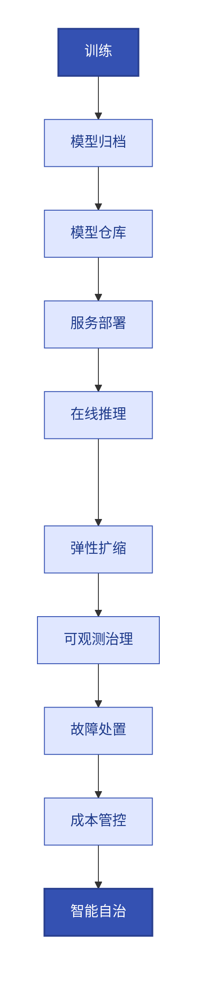

# 第3章 AI原生运维统一范式
<!-- 第一篇 现代运维范式 ｜ 全书立论宪法（永久不变） ｜ 状态：终审中 -->

> 本章定位：全书立论宪法。统一云原生与 AI 原生运维范式，定义 AI 负载完整生命周期（全书 AI 章节统一锚点），聚焦运维痛点，不展开 AI 算法。

> **边界声明**：本章只立范式与生命周期锚点，不展开具体算力调度（第 17 章）、推理性能（第 18 章）与 AI 算法。**1↔3 分工**：第 1 章已回答 Why（演进动机），本章回答 What——"云原生底座 + AI 原生治理层"的正式定义、边界划分与 AI 负载生命周期只在此章定一次，后续不再重复定义。**V1 聚焦**：AI 推理与在线 AI 工作负载运维为主；训练集群 / 离线计算的深度平台能力（分布式训练调度、checkpoint 管理）归 V2。超出部分归 V2。

---

本章核心图——AI 负载完整生命周期（全书 AI 章节统一锚点）：



## 3.1 云原生与AI原生运维的边界划分与协同关系

### 生产问题

一个团队把推理服务当普通微服务运维：用 HPA 按 CPU 扩缩、用标准滚动更新、用通用监控。结果 GPU 利用率和实际负载脱节、扩缩总是慢半拍、推理延迟波动无人感知。团队困惑：**明明跑在 K8s 上、用了成熟的云原生实践，为什么对 AI 负载处处失效？** 答案在于没有厘清"云原生"与"AI 原生"的边界——两者不是对立，是分层，错把一层的实践套到另一层的负载上，必然失配。

### 传统方案失效原因

两种常见的边界误判都会出事：

- **把 AI 原生等同于云原生**：认为"跑在 K8s 上就够了"，忽视 AI 负载的算力、性能、长任务特性。结果所有云原生自动化决策（扩缩、重启、更新）都按错误的信号运转。
- **把 AI 原生与云原生对立**：认为 AI 负载需要一套完全独立的运维体系，另起炉灶。结果两套体系割裂，重复建设、盲区横生（见 1.4 节）。

失效根因：**没认清两者的分层关系——云原生是底座，AI 原生是治理层**。底座提供标准化运行环境，治理层提供针对 AI 负载特性的专门能力。混淆层级，要么治理缺位，要么重复造轮子。

### 架构约束与权衡

正确的边界划分与协同关系：

| 层级 | 职责 | 提供的能力 |
|---|---|---|
| **云原生底座** | 标准化运行环境 | 托管 K8s（ACK/EKS）调度、声明式 API、控制循环、不可变制品（ACR）、GitOps 交付、统一可观测 |
| **AI 原生治理层** | 针对 AI 负载特性的专门治理 | GPU/显存调度、推理性能指标、长任务生命周期、KV 缓存治理、算力成本治理 |

协同关系：**AI 原生治理层建立在云原生底座之上，复用底座的标准化能力，叠加 AI 专属信号与调度**。落到云生态，这个底座就是**托管 K8s（ACK 主参考、EKS 对照）+ 云服务（GPU 节点池、OSS/NAS、ACR）**——AI 原生的算力、模型存储、镜像全部由云服务承载，治理层通过设备插件/CRD/Operator 长**在**底座上，**不另起底座**（统一底座的完整论证见 4.1）。这就是"双原生融合"的工程含义——不是两套系统，是一套系统两层职责。

权衡的核心：**底座要够通用（承载所有负载），治理层要够专精（吃透 AI 特性）**。底座过早特化会牺牲通用性，治理层不够专精又回到"把 AI 当普通服务"的陷阱。

### 最小可行方案

边界落地的最小划分：

1. **底座统一**：所有负载（传统 + AI）跑在同一个 K8s，共享交付（GitOps）与可观测栈。
2. **治理分层**：传统负载用云原生原生能力；AI 负载在原生能力之上叠加 GPU 调度、推理指标、长任务治理。
3. **接口清晰**：治理层通过 CRD/Operator/设备插件等云原生扩展机制接入底座，不另起独立控制平面。

### 生产落地实现

- 底座共享：AI 推理服务的 Deployment、Service、Ingress 与传统服务同构（第 4–8 章）。
- 底座即云：算力 = ACK GPU 节点池、模型存储 = OSS/NAS、镜像 = ACR——AI 原生的承载全部落在这几个云服务上，不引入底座之外的新系统（第 17 章）。
- 算力接入：GPU 设备插件让底座认得 GPU（第 17 章）。
- 治理叠加：推理性能指标接入统一可观测栈（第 12、18 章）；弹性用 KEDA 推理队列驱动（第 16 章）。
- 扩展机制：用 CRD + Operator 表达 AI 负载的专门生命周期（第 5 章）。

### 典型故障案例

某团队为 AI 服务单独搭了一套监控（只看 GPU），传统服务另一套（只看 CPU/内存）。当传统网关调用推理服务超时，两套监控无法关联，定位耗时 20 分钟。融合后统一可观测栈贯通两者，链路追踪一眼定位。

点评：**边界划分不是物理隔离**。底座必须共享，治理层才协同；底座割裂，治理层必然盲区。

### 根因定位

根因不在监控工具选错，而在**边界划分失当导致底座割裂**。正确的边界是"底座统一、治理分层"，违背它就会出现重复、盲区、内耗。

### 长效治理方案

- 坚守"底座统一、治理分层"的边界原则。
- AI 治理层只做差异化（信号、调度、生命周期），共性能力复用底座。
- 通过云原生扩展机制（CRD/Operator/设备插件）接入，不另立控制平面。

### 自动化/自治闭环

边界划分是三层自治模型贯通两种负载的基础：**L1 机械自治由统一底座提供，覆盖所有负载的基础稳态；L2 运维自治的 SLO 体系同时治理两种负载；L3 智能自治专门处理 AI 负载的复杂动态**。边界清晰，三层才能各司其职、协同递进。

### 生产检查清单

- [ ] AI 负载与传统负载是否共享同一 K8s 底座？
- [ ] AI 原生的承载是否全部落在托管底座与云服务上（GPU 节点池/OSS/ACR），未另起底座？
- [ ] AI 治理层是否只做差异化（不重复底座的共性能力）？
- [ ] AI 治理层是否通过云原生扩展机制接入（无独立控制平面）？
- [ ] 可观测是否一套栈贯通两种负载？
- [ ] 是否避免了对立（两套体系）和混淆（把 AI 当普通服务）两种误判？

---

## 3.2 三类AI负载运维差异：离线训练任务、在线推理服务、智能Agent服务（聚焦运维痛点，不展开AI算法）

### 生产问题

团队用同一套方式运维三类 AI 负载：训练任务、推理服务、Agent 服务，全用 Deployment、全落同一个节点池。结果训练任务被滚动更新打断进度、推理服务扩缩跟不上突发流量、Agent 服务的长会话状态在 Pod 重建时丢失，甚至一次抢占式实例回收把误调度到同池的线上推理一起带走。**三类负载的运维特性与云上资源形态差异巨大，用同一种工作负载模型硬套，每一类都出问题**。

### 传统方案失效原因

- **训练任务当无状态服务跑**：训练是长任务、有检查点、对中断敏感，用 Deployment 等于允许中途换 Pod，进度尽失。
- **推理服务按 CPU 扩缩**：推理瓶颈在 GPU/KV 缓存，CPU 信号失真，扩缩永远慢半拍（1.3 节）。
- **Agent 服务忽略状态依赖**：Agent 多步调用有上下文和会话状态，Pod 随意重建导致会话中断、状态丢失。
- **三类负载弹性策略一刀切**：用同一种 HPA 策略，对训练（无需弹性）、推理（需快速弹性）、Agent（需按会话弹性）全都不适配。

失效根因：**没有按负载特性区分工作负载模型与治理策略**。三类负载的"长任务/状态/弹性"特性完全不同，一刀切必然每类都失配。

### 架构约束与权衡

三类 AI 负载的运维特性对比（聚焦运维，不展开算法；云上资源形态以阿里云主栈表述，AWS 对照：EKS 托管节点组/Spot、S3/FSx、ECR）：

| 负载类型 | 生命周期 | 状态 | 弹性驱动 | 云上资源形态 | 关键运维风险 |
|---|---|---|---|---|---|
| **离线训练任务** | 长（小时~天） | 有检查点 | 一般不弹性（固定算力） | 抢占式 GPU 节点池 + 定时伸缩，checkpoint 定期落 OSS（17 章） | 中断丢进度、算力闲置浪费 |
| **在线推理服务** | 常驻 | 无状态（请求级） | 强弹性（队列/吞吐） | 常驻 GPU 节点池 + cGPU 显存共享，KEDA 驱动扩缩（16.3/18.7） | 延迟劣化、扩缩滞后 |
| **智能 Agent 服务** | 长（会话级） | 有会话状态 | 中弹性（会话数） | 通用 CPU 节点池 + 长连接网关，会话状态外置（18 章） | 状态丢失、重试风暴 |

容量估算第一直觉的三个量级数字（第一轮估算够用，细化口径见第 17、18 章）：

- **权重即显存门槛**：FP16 下 7B 模型权重 ≈14 GB、32B ≈65 GB——单卡 24 GB（A10 量级）放不下 32B 权重，必须多卡分片或量化；权重通常吃掉单卡显存的 50%–90%，剩下的才轮到 KV 缓存与激活。
- **加载是分钟级**：冷启动 = 从 OSS/ACR 拉取制品 + 权重装进显存，7B 量级约 2–5 分钟，比普通服务秒级拉起慢两个数量级——推理扩容必须预热，不能等流量到了再扩。
- **形态即成本**：训练用抢占式实例换常见 50%+ 折扣，代价是被回收时全靠 checkpoint 续跑；推理用常驻 GPU 换稳定 TTFT；Agent 对算力最不敏感，落通用节点池即可。

权衡的核心：**工作负载模型必须匹配负载特性——训练要可重入可续跑、推理要快弹性、Agent 要保状态**。用错模型，自动化越强破坏越大（比如对训练开自动滚动更新）。

### 最小可行方案

按负载类型选工作负载模型：

1. **训练任务**：用支持失败重试与检查点的 Job/任务负载，固定算力，禁用中途替换。
2. **推理服务**：用 Deployment + 探针 + KEDA 推理队列驱动弹性 + 优雅终止。
3. **Agent 服务**：用支持会话亲和 / 状态外置的工作负载，配长优雅终止 + 重试限流。

### 生产落地实现

- 训练：Job/MPIJob 等，配检查点续跑与失败重试；跑抢占式 GPU 节点池 + 定时伸缩，checkpoint 定期写 OSS（第 17 章）。
- 推理：Deployment + readiness 探针 + KEDA（队列深度/Token 吞吐驱动扩缩）+ `preStop` 优雅退出；落常驻 GPU 节点池 + cGPU 共享调度（第 16、18 章）。
- Agent：会话状态外置（Redis/向量库），Pod 无状态化，落通用节点池 + 长连接网关；重试风暴用限流与退避治理（第 18 章）。

### 典型故障案例

某训练任务跑了一夜，第二天被一次集群滚动升级打断，进度归零，损失一夜算力。根因是训练任务被当成可随时替换的负载。改用带检查点的 Job + 标记为不可中断（污点容忍/优先级）后，再无中断丢进度。

点评：**自动化对错配的负载是灾难**。滚动更新对无状态服务是福利，对长任务是谋杀。

### 根因定位

根因不在滚动更新配置，而在**工作负载模型与负载特性错配**。三类负载的特性差异是客观的，治理必须区分对待，一刀切是体系性错误。

### 长效治理方案

- 建立三类负载的标准工作负载模型与治理策略模板。
- 三类负载的云上资源形态写入平台目录：训练 = 抢占式池、推理 = 常驻池、Agent = 通用池——节点池即成本边界（17.5）。
- 训练任务强制检查点 + 不可中断保护。
- 推理服务强制推理信号驱动弹性 + 优雅终止。
- Agent 服务强制状态外置 + 重试治理。

### 自动化/自治闭环

三类负载的差异化治理，是第 17、18 章细化的基础。**L3 智能自治主要针对推理与 Agent 的动态性**，而训练任务更偏向算力调度与成本治理（第 17 章）。区分负载类型，才能让自治策略精准作用。

### 生产检查清单

- [ ] 训练任务是否用支持检查点/重试的负载模型，且受中断保护？
- [ ] 推理服务是否用推理信号驱动弹性，且配优雅终止？
- [ ] Agent 服务是否会话状态外置，且配重试限流？
- [ ] 三类负载是否各有标准的工作负载与治理模板？
- [ ] 是否避免了对三类负载一刀切？
- [ ] 三类负载的云上资源形态（抢占式/常驻/通用节点池）是否各就其位、互不混池？

---

## 3.3 AI负载专属运维难点：长任务、上下文依赖、不可预测算力、动态KV缓存、推理波动问题

### 生产问题

AI 推理服务上线后，运维遇到一连串传统服务没有的怪现象：同一个请求延迟从 0.5 秒到 5 秒剧烈波动；GPU 利用率时高时低但没有明显负载变化；长上下文请求比短请求慢一个数量级；并发一上来首 Token 延迟雪崩。**这些波动没有规律、难以复现、传统指标解释不了**，运维陷入"看得到问题、找不到规律、定不了根因"的困境。

### 传统方案失效原因

范式层面的击穿（CPU 信号失真、探针误杀、滚动更新杀长任务）1.3 已论证，此处不重复；本节按运维操作面把五个专属难点逐个配上量级锚点与治理约束：

- **长任务**：训练/长推理耗时久，传统"可随时替换"假设失效，打断即丢进度。
- **上下文依赖**：长上下文请求耗用更多算力和缓存，请求间资源消耗差异巨大，无法用"每请求成本"线性估算。
- **不可预测算力**：同一段输入，因 batch 组合不同，算力消耗差异大，容量规划困难。
- **动态 KV 缓存**：KV 缓存命中率直接影响延迟和吞吐，命中率高时飞快、满了驱逐时骤降，形成延迟波动。
- **推理波动**：prefill（首 Token）与 decode（后续 Token）阶段算力特征不同，固定阈值探针和告警无法刻画。

失效根因：**传统运维假设负载"可预测、可平均、可线性估算"，而 AI 负载本质上是"动态、非线性、状态相关"的**。假设错配，所有基于平均值的决策（容量、扩缩、告警）都失准。

### 架构约束与权衡

针对五个难点，治理的约束与权衡（量级锚点用于告警阈值与容量估算的第一直觉，细化见 17/18 章）：

| 难点 | 量级锚点 | 治理约束 | 代价 |
|---|---|---|---|
| 长任务 | 训练小时~天级；无 checkpoint 时一次中断 = 进度清零；抢占式回收预告仅约 5 分钟（EKS Spot 为 2 分钟），续跑全靠 checkpoint（17 章） | 支持检查点 + 不可中断 + 优雅终止 | 工作负载复杂度上升 |
| 上下文依赖 | KV 缓存随上下文长度线性增长，32K 单请求 KV 可达 GB 级——请求间显存占用可差一个数量级（18 章） | 按上下文长度分桶治理，区别定价/调度 | 调度逻辑复杂 |
| 不可预测算力 | 长上下文 prefill 计算量随长度近平方级增长，同并发下单请求算力消耗可差数倍——平均值容量规划必然失准（18 章） | 用百分位而非平均值做容量与告警 | 指标体系更复杂 |
| 动态 KV 缓存 | 命中率从 90% 掉到 50%，吞吐可近腰斩、TTFT 数倍劣化——命中率是延迟劣化的先行指标（18 章） | 监控命中率，缓存治理（驱逐策略/容量） | 需推理框架深度配合 |
| 推理波动 | 同一服务 TTFT 可在 0.5 s 与 5 s 之间波动（10 倍），prefill 与 decode 必须分开度量（TTFT/TPOT，18 章） | 区分 prefill/decode 指标，分阶段治理 | 可观测语义更细 |

权衡的核心：**AI 负载治理必须放弃"平均值思维"，转向"分布与状态思维"**。代价是指标体系和调度逻辑显著复杂化，但这是刻画 AI 负载真实行为的唯一方式。

### 最小可行方案

最小治理集，逐个击破：

1. **长任务**：检查点 + 优雅终止（第 17 章）。
2. **上下文/算力**：按请求特征分桶，用百分位（p50/p95/p99）而非平均评估容量与延迟（第 18 章）。
3. **KV 缓存**：监控命中率，配置合理缓存容量与驱逐策略（第 18 章）。
4. **推理波动**：分别采集 TTFT（首 Token）与 TPOT（每 Token），分阶段告警（第 18 章）。

### 生产落地实现

- 长任务：训练/推理负载配 `terminationGracePeriodSeconds` + 检查点 + 优先级保护。
- 分桶治理：按上下文长度路由到不同推理实例组，分别配额。
- 指标采集：DCGM 采 GPU 利用率/显存/温度，VictoriaMetrics 存 p95/p99 延迟与算力消耗，替代平均（第 12、18 章）。
- KV 缓存：vLLM/SGLang 暴露缓存命中率指标，接入告警（第 18 章）。
- 分阶段指标：TTFT 与 TPOT 分开告警，阈值分别设定。

### 典型故障案例

某推理服务用平均延迟告警，阈值 2 秒。某时段 p99 延迟飙到 8 秒，但被高峰流量稀释后平均仍是 1.8 秒，告警未触发，用户体验已经崩坏。改用 p95/p99 告警后，长尾劣化被即时捕获。

点评：**平均值掩盖长尾，是 AI 负载运维最隐蔽的坑**。用户感知的是 p99，不是平均。

### 根因定位

根因不在告警阈值设错，而在**用"平均值思维"治理"分布型负载"**。AI 负载的劣化往往体现在长尾，平均值指标结构性看不见长尾，必然漏报。

### 长效治理方案

- 全面转向百分位指标（p95/p99）评估性能与容量。
- KV 缓存命中率作为一等指标纳入告警与扩缩决策。
- 请求按特征分桶，差异治理。
- 长任务统一检查点 + 中断保护。
- 五个难点的量级锚点纳入告警阈值评审与新人第一课，杜绝"拍脑袋阈值"。

### 自动化/自治闭环

这五个难点正是 L3 智能自治要解决的核心问题：**机械自治和运维自治基于确定性与 SLO，而 AI 负载的动态性需要推理驱动的自适应闭环**。第 18 章的性能/容量模型与智能自治闭环，本质就是为这五个难点量身设计的治理体系。

### 生产检查清单

- [ ] 长任务是否有检查点 + 中断保护 + 优雅终止？
- [ ] 性能与容量是否用百分位（p95/p99）而非平均值？
- [ ] KV 缓存命中率是否纳入监控与告警？
- [ ] TTFT 与 TPOT 是否分开采集与告警？
- [ ] 请求是否按上下文/算力特征分桶治理？
- [ ] 五个难点的量级锚点是否已成为阈值评审的基准输入？

---

## 3.4 AI负载完整生命周期（全书AI章节统一锚点）：训练 → 模型归档 → 模型仓库 → 服务部署 → 在线推理 → 弹性扩缩容 → 可观测治理 → 故障处置 → 成本管控 → 智能自治
<!-- 全书 AI 章节统一锚点，后续第 17/18 章按此生命周期展开 -->

### 生产问题

团队运维 AI 负载时，各环节各自为政：训练团队训完把模型文件往共享存储一丢，推理团队手动拉取部署，监控只盯着服务存活，成本没人管，出了故障各自甩锅。**没有统一的生命周期视角，AI 负载的每个环节都成了孤岛，环节间的衔接全是手工与盲区**。一次模型更新涉及训练、归档、部署、验证多个团队，协调成本巨大，且任意一环出错都可能带到线上。

### 传统方案失效原因

- **无统一生命周期模型**：各团队只认自己那一段，环节衔接无标准。
- **模型交付靠手工拷贝**：训练产物 → 推理部署靠人传文件，无版本、无校验、不可追溯。
- **运维只覆盖"部署后"**：训练、归档、成本等环节不在运维视野，治理断层。
- **无生命周期级可观测**：看不到模型从训练到下线的全貌，问题难以溯源。

失效根因：**把 AI 负载运维窄化为"部署推理服务"，割裂了完整生命周期**。AI 负载的运维对象是"模型及其服务化形态"，生命周期跨越训练到自治，任一环节失治都会传导到线上。

### 架构约束与权衡

本书将 AI 负载生命周期锚定为十个环节，作为全书 AI 章节的统一坐标：

```text
训练 → 模型归档 → 模型仓库 → 服务部署 → 在线推理 → 弹性扩缩容
     → 可观测治理 → 故障处置 → 成本管控 → 智能自治
```

每个环节落到具体形态——用什么云服务与组件承载、在哪一小节展开，一表定死（后续 AI 章节按此锚点对号入座）：

| 环节 | 运维关切 | 承载云服务与组件 | 落点章节 |
|---|---|---|---|
| 训练 | 算力调度、检查点、失败重试 | ACK GPU 节点池（抢占式 + 定时伸缩，checkpoint 落 OSS） | 17.1 |
| 模型归档 | 制品化、版本化、可追溯 | OSS 版本目录（对象存储 + 生命周期规则） | 17.3 |
| 模型仓库 | 统一存放、权限、版本管控 | OSS/NAS（模型权重）+ ACR（推理镜像） | 17.3 |
| 服务部署 | 大镜像分发、部署规范、保活 | vLLM on ACK（GPU 调度 + Helm/ArgoCD 交付） | 17.4、18 |
| 在线推理 | 性能与 SLO 口径（TTFT/TPOT/吞吐） | vLLM/SGLang 常驻 GPU 节点池 + cGPU 共享 | 18.6 |
| 弹性扩缩容 | 推理信号驱动弹性 | KEDA（推理队列深度/Token 吞吐驱动） | 18.7 |
| 可观测治理 | GPU/推理指标、瓶颈定位 | VictoriaMetrics + DCGM（GPU 指标）+ OTel 链路 | 18.5 |
| 故障处置 | 自愈、重启、容错 | 自愈链（探针 → 重启/驱逐恢复 → 自动回滚） | 18.7 |
| 成本管控 | 算力 FinOps、单 Token 成本 | 单 Token 成本公式（GPU 成本 ÷ 有效 Token 吞吐） | 17.5 |
| 智能自治 | 自适应闭环、动态优化 | L3 智能自治闭环（观测 → 决策 → 执行 → 校验） | 18.9 |

> AWS 对照一一映射：EKS 托管节点组、S3 版本桶、ECR、AMP/CloudWatch——形态等价、组件名互换，全书 AI 章节按此对照阅读。

十环节按运维视角分两段：**前五环（训练 → 在线推理）是"形态供给"**——模型如何被生产、制品化、部署成在线服务；**后五环（弹性 → 自治）是"运行治理"**——服务跑起来之后如何弹性、可观测、处置、算账、自治。两段的所有承载都落在托管 K8s + 云服务上，没有任何一环需要独立于底座的新系统——这正是 3.1"不另起底座"在生命周期上的投影。

权衡的核心：**生命周期越长越完整，治理越连贯，但组织协同成本越高**。统一生命周期的价值在于让每个环节有标准衔接，把跨团队协作从"人协调"变成"流程驱动"。

### 最小可行方案

最小生命周期落地（先贯通，再优化）：

1. **模型交付流水线化**：训练产物 → 归档 → 仓库 → 部署，全程自动、版本化、可追溯（第 17 章）。
2. **运维覆盖全环节**：不只盯部署，训练调度、成本、自治都纳入运维视野。
3. **生命周期级可观测**：从模型版本到推理性能到成本，端到端可见。

### 生产落地实现

- 模型即制品：训练产物按版本目录归档 OSS，模型权重走 OSS/NAS、推理镜像走 ACR，双仓各司其职（第 17 章）。
- 交付 GitOps 化：模型版本与镜像 tag 写入部署清单，ArgoCD 同步（第 10 章）。
- 全环节可观测：模型版本、TTFT/TPOT、DCGM GPU 指标、单 Token 成本统一面板（第 12、18 章）。
- 分段验收：前五环以"模型可追溯上线"验收，后五环以"SLO 与成本口径在线"验收。
- 端到端闭环：性能问题 → 回溯模型版本 → 训练/部署环节定位。

### 典型故障案例

线上推理质量突然下降，排查发现是部署了一个未经验证的模型版本。根因是模型交付靠手工拷贝，无版本校验、无发布门禁。建立"模型仓库 + 版本管控 + GitOps 发布 + 上线前校验"的生命周期后，未经校验的模型无法上线。

点评：**生命周期的每个环节都是一道门**。手工衔接等于把门拆了，任意环节的错误直达线上。

### 根因定位

根因不在某次模型拷错，而在**没有统一的生命周期治理**。AI 负载运维的对象是完整生命周期，割裂它就必然在衔接处出问题。生命周期统一，是 AI 运维体系化的前提。

### 长效治理方案

- 十环节全部纳入运维视野，各有标准。
- 模型交付全自动、全版本化、全可追溯。
- 生命周期级可观测，端到端可溯源。
- 各环节衔接由流程驱动，不靠人协调。

### 自动化/自治闭环

这个十环节生命周期是后续 AI 章节（第 17、18 章）展开的坐标轴：**前五环（训练到在线推理）偏交付与运行，第 17 章为主承接；后五环（弹性到自治）偏治理与优化，第 18 章为主承接（弹性基础 KEDA 见 16.3）**。L3 智能自治闭环（18.9）正是作用于这个生命周期的后段，把性能、弹性、故障、成本、自治串成一个动态优化的整体。

### 生产检查清单

- [ ] 模型交付是否全自动、全版本化、全可追溯？
- [ ] 模型权重（OSS/NAS）与推理镜像（ACR）是否分仓治理、版本一一对应？
- [ ] 运维是否覆盖训练/归档/成本等环节（不止部署）？
- [ ] 是否有生命周期级端到端可观测？
- [ ] 模型版本与推理性能是否可回溯关联？
- [ ] 各环节衔接是否由流程驱动（非人工协调）？
- [ ] 前五环/后五环是否分段验收（形态供给 / 运行治理）？

---

## 3.5 AI原生运维核心目标：算力可控、推理稳定、成本可控、故障自愈、服务自治
<!-- 概念立论小节，10 步模板从简（重在目标体系，非生产工程步骤） -->

### 生产问题

团队上 AI 负载后，目标模糊：一会儿追性能、一会儿压成本、一会儿保稳定，彼此冲突时不知道让谁。结果 GPU 成本失控时砍容量导致延迟劣化，追延迟时过度扩容导致成本爆炸，故障时手忙脚乱不知优先保什么。**没有清晰的运维目标体系，AI 负载的治理在性能/成本/稳定之间反复拉扯，永远顾此失彼**。

### 传统方案失效原因

- **目标未体系化**：性能、稳定、成本、自治各说各话，无优先级、无约束关系。
- **只盯单一目标**：只追延迟不管成本，或只压成本不管稳定。
- **目标与负载特性脱节**：用传统服务的目标（CPU 稳定）套 AI 负载（推理稳定），定义错位。
- **自治目标缺位**：只想到"稳"，没想到"自治"，停留在被动维护。

失效根因：**没有把 AI 运维目标组织成一个有优先级、有约束的体系**。目标是散的，治理必然是乱的。

### 架构约束与权衡

本书将 AI 原生运维的核心目标锚定为五个，并明确其优先级与约束关系：

| 目标 | 含义 | 量化口径（V1 承诺线） | 优先级关系 |
|---|---|---|---|
| **算力可控** | GPU/显存可调度、可配额、可隔离 | GPU 平均利用率 ≥ 60%，跌破告警线即排查闲置（17 章） | 基础（其他目标的前提） |
| **推理稳定** | 延迟、吞吐、可用性达标 | TTFT p99 < 1 s 起步，TPOT/吞吐口径在 18.6 定义 | 核心（用户体验的直接保证） |
| **成本可控** | 算力利用率高、单 Token 成本合理 | 单 Token 成本可算、可按业务归集（公式见 17.5） | 约束（在稳定前提下优化） |
| **故障自愈** | 异常自动恢复，不依赖人 | 常见故障（OOM/探针失败/节点驱逐）自愈占比可度量、持续提升（18.7） | 进阶（稳定性的自动化延伸） |
| **服务自治** | 动态自适应，复杂负载自优化 | 18.9 的 L3 闭环在生产上线运行，决策可审计、可回滚 | 终极（L3 智能自治） |

口径对齐：这五个目标是 1.4 双原生五目标（标准化、可观测、可治理、高韧性、可自治）在 AI 负载上的量化投影——算力可控承接标准化、推理稳定承接高韧性（以可观测的 SLO 为口径）、成本可控承接可治理、故障自愈与服务自治承接可自治。承诺只在 1.4 立一次，此处只做量化收口，两处口径一一对应、不另立标准。

权衡的核心：**稳定优先于成本，自治建立在稳定之上**。降本不能以牺牲稳定为代价；上自治必须先有可靠的自愈与校验。这五目标是递进+约束关系，不是并列可随意取舍。

### 最小可行方案

目标体系的最小落地：

1. **先算力可控**：GPU 调度、配额、隔离就位，利用率 ≥60% 告警线先跑起来（第 17 章）——其他目标的地基。
2. **再推理稳定**：定义推理 SLO（TTFT p99 < 1 s 起步），配好看板与告警（第 18 章）。
3. **稳定前提下成本可控**：单 Token 成本公式上线，按业务归集（第 17 章）。
4. **进而故障自愈**：OOM 重启、驱逐恢复、自动回滚落地，自愈占比可度量（第 18 章）。
5. **最终服务自治**：18.9 的 L3 闭环小流量上线，决策全程可审计（第 18 章）。

### 生产落地实现

- 算力可控：GPU 设备插件 + 配额 + cGPU 池化调度，利用率告警线 60%（第 17 章）。
- 推理稳定：TTFT/TPOT/吞吐 SLO + 告警，TTFT p99 < 1 s 为起步线（第 18 章）。
- 成本可控：GPU 利用率监控 + 单 Token 成本指标 + 抢占式/闲时复用（第 17 章）。
- 故障自愈：探针 + 自动重启 + 限流 + 自动回滚，自愈占比纳入月度复盘（第 18 章）。
- 服务自治：性能反馈驱动的动态调度闭环，从 18.9 小流量起步（第 18 章）。
- 目标看板：五个量化口径做成单块看板（利用率/TTFT/单 Token 成本/自愈占比/自治状态），月度对账（第 12、18 章）。

### 典型故障案例

某团队为压成本砍了一半 GPU，推理延迟 p99 从 3 秒飙到 12 秒，用户流失反而造成更大损失。复盘确立原则："成本优化不得突破稳定 SLO"。此后所有降本决策都先校验 SLO 影响。

点评：**目标冲突时，优先级必须明确**。没有"稳定优先于成本"的纪律，降本动作会反复伤害稳定性。

### 根因定位

根因不在某次砍容量决策，而在**目标体系无优先级**。当稳定与成本冲突时没有裁决规则，决策必然摇摆，结果两边都不达标。

### 长效治理方案

- 五目标体系化，明确优先级（稳定 > 成本，自治建立在稳定上）。
- 每个目标有可度量指标（SLO/利用率/成本/恢复时间）。
- 决策冲突时按优先级裁决，并用指标校验决策影响。
- 把目标层层对应到三层自治：算力可控/推理稳定偏 L1/L2，故障自愈/服务自治偏 L2/L3。

### 自动化/自治闭环

这五目标是全书 AI 运维的总纲，也是三层自治的目标投影：**算力可控与推理稳定由 L1/L2 保证，故障自愈由 L2 实现，服务自治由 L3 达成**。本书后续所有 AI 章节，都在为这五个目标提供具体的工程化落地。读完第 17、18 章，这五目标从抽象口号变成可度量的运维能力。

### 生产检查清单

- [ ] 是否有体系化的五目标，且明确了优先级（稳定 > 成本）？
- [ ] 每个目标是否有可度量指标（利用率/TTFT/单 Token 成本/自愈占比）？
- [ ] 算力是否可控（可调度、可配额、可隔离，利用率 ≥60% 告警线在线）？
- [ ] 推理是否有明确的 SLO（TTFT p99 < 1 s 起步）？
- [ ] 降本决策是否受稳定 SLO 的硬约束？
- [ ] 是否已规划从自愈走向自治的路径（18.9 闭环）？
