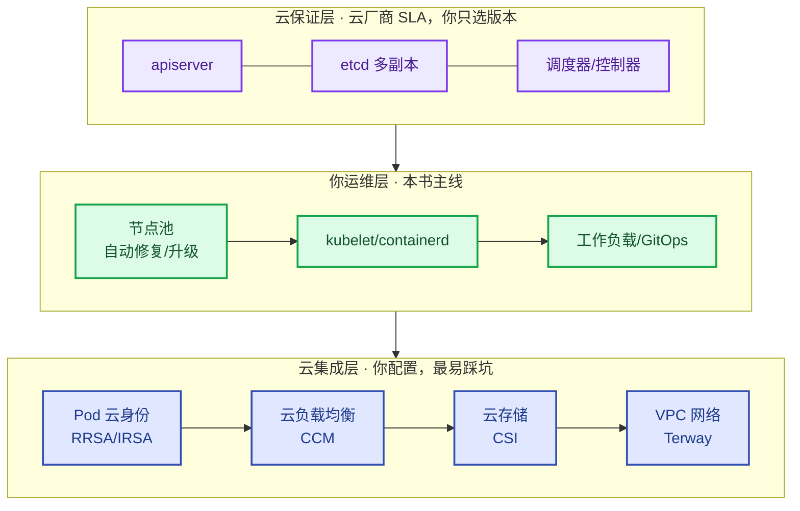

# 第4章【L1 基座】Kubernetes分布式架构与生产治理
<!-- 第二篇 Kubernetes 底座 ｜ 常规章（与第5章严格分层） ｜ 状态：终审中 -->

> 🧭 **本篇路标 · 第二篇「Kubernetes 生产级核心底座」（第 4–7 章）**：本篇为 L1 机械自治完整底座工程实现，是第 15 章 L2/L3 AI 运维 Agent 引擎的唯一运行载体。若无托管 K8s 声明式调谐闭环，LLM Agent 无标准化数据、执行、校验通道，无法落地可信智能自治。读完本篇，再进入第五篇方可完整实现 AI 原生运维终局。

> 本章定位：讲 K8s 作为云原生统一操作系统与生产负载统一运行底座的架构与生产治理。全书锁定托管 K8s（阿里云 ACK 主参考、AWS EKS 对照）——控制面由云厂商 SLA 保证（4.2 一图划界），笔墨在节点面、云集成（RRSA/IRSA、CCM、CSI）、版本治理与原生短板。
> **主线定位**：托管底座是 L1 机械自治的地基——控制器与调谐闭环运行其上；AIOps 不绕开 K8s 另起系统，而是长在底座上。**承上启下**：承第 3 章范式定纲（进入 How：底座施工；制品由第 2 章供给）；启第 5 章调谐闭环（控制器跑在底座上）。

---

## 4.1 K8s核心定位：云原生统一操作系统、生产负载统一运行底座

### 生产问题

三套运行底座（虚拟机编排 + 容器编排 + 裸机调度）= 三套监控、三套交付、三倍成本，且故障跨底座无法关联、人才无法复用。**每多一种底座，运维复杂度不是相加，是相乘**。

### 传统方案失效原因

- 一负载一底座：Web 服务用虚拟机、容器服务用容器编排、大数据直跑裸机，底座随负载 proliferate。
- 底座间无统一抽象：调度、网络、存储、可观测各搞各的，跨底座治理不可能。
- 负载游离于底座之外，脱离声明式与可观测体系，回到第一代运维（第 1 章）。

失效根因：**没有把 K8s 当作统一操作系统来用**——它的核心价值不是"跑容器"，而是让所有负载（含治理件与运维 Agent）共享同一套治理范式。

### 架构约束与权衡

K8s 作为统一操作系统的两层定位：

| 定位 | 含义 | 代价 |
|---|---|---|
| **云原生统一操作系统** | 为所有负载提供调度、网络、存储、可观测的统一抽象 | 接受抽象层、学习曲线 |
| **生产负载与治理件统一底座** | 业务负载与运维 Agent（治理件）跑在同一底座上，共享治理范式 | 需扩展机制（CRD/Operator，第 5 章） |

统一底座之上，第一个落地决策是**集群形态选型**。全书锁定托管形态：

| 形态 | 控制面成本（量级，以官网当期价为准） | 节点 | 适用 |
|---|---|---|---|
| ACK 基础版（托管） | 免费 | ECS 节点池 | 测试/起步 |
| **ACK Pro（生产标配）** | ≈ ¥0.64/时 ≈ ¥460/月 | ECS 节点池 | 控制面独享资源 + SLA 承诺 |
| ACK Serverless（ASK） | 控制面免费 + 按 Pod 计费 | 无节点（ECI 承载） | 突发流量、离线任务、小团队 |
| AWS EKS（对照） | $0.10/时 ≈ $73/月 | 托管节点组 / Fargate | AWS 生态团队 |

形态没有唯一答案，只有决策变量（DDIA 式"取决于什么"注解）：

| 决策变量 | 倾向基础版 | 倾向 Pro 升级 | 倾向 ASK/ECI 混部 |
|---|---|---|---|
| 团队规模 | 1–2 人、测试/预发 | 有值班制度、专人负责集群 | 无节点运维人力 |
| 集群数/节点数 | 单集群、个位数节点 | 生产首日即升，多集群必升 | 突发/离线 Pod 占比高（CI、批处理） |
| 合规要求 | 无对外 SLA 承诺 | 需控制面 SLA、独享 etcd、过审计 | 扩容按量付费、不进固定资产 |

经验量级：生产集群第一天就上 Pro；ASK 通常不做整簇替代而做混部——常驻负载占 ECS 节点池，CI/突发/离线走虚拟节点（ECI）按 Pod 计费。

权衡的核心：**统一底座牺牲"为每种负载特调最优"的灵活性，买回"一套治理范式覆盖所有负载"的可扩展性**。规模化下后者完胜。

### 最小可行方案

1. **选托管形态**：生产选 ACK Pro（对照 EKS），测试可用基础版。
2. **所有负载上 K8s**：业务服务容器化上 K8s，治理件（分诊器/规则/白名单）同样作为工作负载上 K8s。
3. **扩展而非另起**：K8s 不够用的能力（业务弹性等）通过 CRD/Operator 扩展，不另立底座。

### 生产落地实现

集群选型验收的最小命令集（新建集群后第一件事）：

```bash
# 集群版本与形态确认（版本必须在支持矩阵内，见 4.4）
kubectl version --output=yaml | grep -E 'gitVersion|platform'

# 节点池与节点分布确认（多可用区、规格是否如选型）
kubectl get nodes -L topology.kubernetes.io/zone,node.kubernetes.io/instance-type

# 云厂商侧确认（阿里云 CLI；对照：aws eks describe-cluster --name <name>）
aliyun cs GET /clusters/<cluster-id> | jq '.cluster_type, .state, .version'
```

- 集群本身的创建走声明式（Terraform `cs_kubernetes` / `aws_eks_cluster`），归第 8 章"集群之下 Terraform、集群之上 GitOps"。
- 统一交付：Helm + ArgoCD 承载所有负载（第 8、9 章）；统一可观测：VM/Loki/Tempo 采集所有负载（第 11 章）。

> **思想实验：控制台手建集群的漂移黑洞**（先猜答案再往下读）。一年前赶上线，demo-prod 是控制台点出来的——VSwitch、节点池、安全组全是手工。现在要 Terraform 收编。先猜：`terraform import` 之后 plan 会显示几个差异？
>
> 揭晓：**几十上百个**——控制台默认值与 provider 声明默认值在大量字段上不一致，逐字段核对要数天。更深一层：这一年里每次控制台应急调整（改个安全组、调个节点数）都没有记录，**没人能说清集群的"当前状态"是怎么来的**——这正是 8.1 Drift 因果链在云资源层的重演。结论：收编要趁早（新集群第一天就用 Terraform 创建），漂移黑洞随时间单调变深。

### 典型故障案例

某团队把消息队列与批处理服务跑在裸机 ECS，核心服务跑在 ACK，两者调用链路跨底座断裂。一次批处理服务 OOM 导致上游网关报错，因日志/链路两套体系，定位耗时 25 分钟。批处理迁上 ACK、共享可观测后，同类故障定位压到 3 分钟（trace 直接贯通网关→批处理 Pod）。

点评：**底座统一 = 治理可视**。跨底座的故障天然是盲区。

### 根因定位

问题的真正发源地是**底座碎片化导致治理割裂**——底座是治理的载体，载体不统一，治理必然碎片化。

### 长效治理方案

- 坚守"所有负载上托管 K8s"的统一底座原则。
- 能力不足用扩展机制补（CRD/Operator/设备插件），不另立底座。
- 治理平面（调度/交付/观测/稳定性）全负载共享。

### 自动化/自治闭环

统一底座是三层自治的承载平台：L1 机械自治、L2 运维自治的控制循环都跑在托管 K8s 上；L3 的决策也通过 K8s 扩展机制执行。底座统一，三层自治才能统一作用于所有负载。分诊器与治理件自身也是这套底座上的普通负载（15.2）——引擎不另起系统，AIOps 长在 K8s 上，这是 3.1 边界划分的运行面事实。

### 生产检查清单

- [ ] 生产集群为托管形态（ACK Pro / EKS）？
- [ ] 所有负载（含 AI）都跑在 K8s 上？
- [ ] 集群版本在云厂商支持矩阵内（4.4）？
- [ ] 节点多可用区分布、规格统一（`kubectl get nodes -L topology.kubernetes.io/zone` 验证过）？
- [ ] K8s 不够用的能力是否通过扩展机制补齐（而非另立底座）？
- [ ] 集群与 VSwitch/节点池/安全组第一天即 Terraform 声明式创建（无控制台手建漂移黑洞）？

---

## 4.2 控制平面、节点核心组件架构与高可用生产容错逻辑
<!-- 托管 K8s（ACK/EKS）视角：控制面由云厂商 SLA 保证，运维不碰 etcd。一张图划清"云保证什么 / 你运维什么"，笔墨全在节点面与云集成（RRSA/IRSA 等）。 -->

### 生产问题

用托管 K8s 的团队，真正会翻车的地方却没人管：节点池没开自动修复（坏节点靠人肉）、Pod 访问云资源还在把 AK/SK 塞进 Secret（泄露即全挂）、云负载均衡被误删没人知道——**控制面有云厂商兜底，节点面与云集成是自己的责任田**。

### 传统方案失效原因

- **职责边界没划清**：云厂商兜底的控制面不用操心，自己该管的节点池/云身份/云集成反而没学。
- **节点面裸奔**：非托管节点池、无自动修复/自动升级，节点故障靠人肉。
- **云身份缺位**：AK/SK 长期凭据塞 ConfigMap/Secret，泄露面巨大（附录 A.3）。
- **云集成不熟**：不知道 LB 是 CCM 自动建的、存储走 CSI、身份走 RRSA/IRSA——误删/误配无从排查。

失效根因：**托管 K8s 的可靠性边界没划清**——控制面是云厂商的 SLA，节点面与云集成才是运维的责任田。

### 架构约束与权衡

托管 K8s 三层职责（一张图说清边界）：



| 层 | 内容 | 谁负责 |
|---|---|---|
| **云保证层** | apiserver / etcd 多副本 / 调度器 / 控制器——多副本、备份、升级全由云厂商 SLA 兜底 | 云厂商（你只选版本，4.4） |
| **你运维层** | 节点池、kubelet/containerd、工作负载、GitOps | 你（本书主线） |
| **云集成层** | Pod 云身份（RRSA/IRSA）、云 LB（CCM）、云存储（CSI）、VPC 网络（Terway） | 你配置（最易踩坑） |

三层职责对应三层不同的可用性合同——**托管 SLA 的承诺/不承诺**（保证等级表，契约视角与 5.3 一脉相承）：

| 层 | 承诺 | 不承诺 |
|---|---|---|
| **控制面可用性** | apiserver 可用性（如 99.95% 量级，体感 ≈ 每月 22 分钟不可用预算；以当期 SLA 条款为准） | 节点可用——节点池是你的责任田 |
| **节点可用性** | 托管节点池能力（自动修复/升级/替换，你开启才生效） | Pod 可用——重调度是你的 PDB/探针的事（5.3） |
| **声明正确性** | 声明被忠实执行的通道可靠 | 你声明的内容正确——错误声明被执行得同样忠实（5.3） |

一句话：**三层可用性是三个不同的合同**——控制面 SLA 买的是"apiserver 应答"，节点可用性靠节点池托管能力，Pod 可用性靠你的探针与 PDB；apiserver 的 99.95% 从来不是你业务的 99.95%。

### 最小可行方案

1. **控制面**：选托管 + 选对版本（4.4 节），控制面 HA 交给云 SLA。
2. **节点池**：托管节点池 + 自动修复 + 自动升级 + 多可用区分布。
3. **Pod 云身份**：配 RRSA（阿里云）/ IRSA（AWS）——ServiceAccount 经 OIDC 联邦换云 RAM/IAM 临时凭据，**AK/SK 永不进集群**。
4. **云集成摸底**：LB（CCM 自动建）/ 存储（CSI）/ 网络（Terway）逐项过配置。

### 生产落地实现

**① RRSA 完整落地（阿里云主参考）**——四步，一次配好后业务零密钥：

```bash
# 步骤 1：集群开启 RRSA（部署 OIDC 签发能力，一次性）
ack-ram-tool rrsa -c <cluster-id> enable

# 步骤 2：创建 RAM 角色并绑定到目标 ServiceAccount
#   信任策略 JSON 见下（角色权限按最小化授予，如只读 OSS 某前缀）
ack-ram-tool rrsa -c <cluster-id> associate-role \
  -r acs:ram::<account-id>:role/demo-app-role \
  -n default -N demo-sa
```

```json
// RAM 角色信任策略：只允许"该集群 + 该 namespace + 该 SA"换取临时凭据
{
  "Statement": [{
    "Action": "sts:AssumeRole",
    "Effect": "Allow",
    "Principal": { "Service": ["<account-id>@oidc.ack.aliyuncs.com"] },
    "Condition": {
      "StringEquals": {
        "oidc:sub": "system:serviceaccount:default:demo-sa",   // 生产禁改：锁死 ns+sa，防越权
        "oidc:aud": "sts.aliyuncs.com"
      }
    }
  }],
  "Version": "1"
}
```

```yaml
# 业务侧唯一要做的：给 ServiceAccount 打注解（Pod 经 RRSA 凭据链自动拿 STS 临时凭据，自动轮转）
apiVersion: v1
kind: ServiceAccount
metadata:
  name: demo-sa
  namespace: default
  annotations:
    alibabacloud.com/role-arn: acs:ram::<account-id>:role/demo-app-role
```

AWS 对照（IRSA，等价三步）：`eksctl utils associate-iam-oidc-provider --cluster <name> --approve` 创建 OIDC Provider → 创建 IAM Role（信任策略同样按 sub 锁 SA）→ SA 打注解 `eks.amazonaws.com/role-arn: arn:aws:iam::<account-id>:role/demo-app-role`。

数字体感：RRSA 临时凭据以小时级有效期自动轮转——**你永远不需要"季度换密钥"的运维日**，密钥轮转这项例行任务从值班日历里彻底消失。

**② 节点池生产参数**（ACK 控制台/Terraform 同名参数）：

| 参数 | 生产建议 | 说明 |
|---|---|---|
| 多可用区 | ≥3 个 VSwitch | 单 AZ 故障不整池瘫痪 |
| 自动修复 | 开启 | 坏节点自动 cordon→drain→替换，无需人肉 |
| 自动升级 | 开 + 维护窗口（如周三 02:00–06:00） | 跟随集群版本节奏（4.4） |
| 抢占式实例 | 无状态/可重算负载开启 | 折扣常见按量价 50%–90% off，须配驱逐容忍（13.3） |
| 规格 | 通用 ecs.u1 / g8i 系列，单池同规格 | 同规格容量估算才线性；专用负载单独建池（6.3） |
| 弹性伸缩 | 开启节点池弹性（按负载） | 与 Pod 层 HPA/KEDA 分层（6.5/15.3） |

**③ SLB 防误删三件套**（云 LB 由 CCM 按 Service 自动创建，误删=入口全断）：

```yaml
# Service 暴露入口时的最小注解（完整流量治理见第 7 章）
apiVersion: v1
kind: Service
metadata:
  name: demo-api
  annotations:
    service.beta.kubernetes.io/alibaba-cloud-loadbalancer-spec: "slb.s2.small"   # 可调：按 QPS 选规格
    service.beta.kubernetes.io/alibaba-cloud-loadbalancer-delete-protection: "true"  # 生产禁改：防误删
spec:
  type: LoadBalancer
```

误删/建不出来先查 CCM（它管 SLB 生命周期）：

```bash
kubectl -n kube-system get pods | grep -E 'ccm|alb'        # 找到云控制器
kubectl -n kube-system logs deploy/cloud-controller-manager --tail=50   # 看 SLB 创建/绑定失败原因（配额/权限/证书）
kubectl describe svc demo-api                              # Events 里有 CCM 回写信息
```

### 典型故障案例

某团队把云 AK/SK 写进 ConfigMap 供 Pod 访问 OSS，仓库泄露后攻击者直接清桶（从泄露到清桶 17 分钟）。换 RRSA：SA 绑 RAM Role、临时凭据自动轮转、AK/SK 从集群里彻底消失——同样的泄露不再有云凭据可偷。

点评：**托管 K8s 时代，凭据安全的答案是云身份联邦（RRSA/IRSA），不是把钥匙藏得更深**。

### 根因定位

拆到底是**可靠性边界没划清**：该云厂商管的瞎操心，该自己管的（节点池/云身份/云集成）在裸奔。

### 长效治理方案

- 三层职责表（云保证/你运维/云集成）作为团队共识，新人第一课。
- 云集成项（RRSA/IRSA、CCM、CSI、Terway）逐项纳入检查清单。
- AK/SK 零容忍进集群（附录 A.3），全走云身份联邦。

### 自动化/自治闭环

云保证层是 L1 机械自治的地基——云厂商替你兜底控制面，你才能把自治建在节点面与工作负载上。RRSA/IRSA 同时是自治的安全边界：L2/L3 自治系统访问云资源同样走云身份临时凭据——权限可控、可审计、可撤销。15.4⑤ 分诊器的云身份（只读监控/变更/工单 API）就是按这套最小权限模型发放的（附录 A.1 治理件行）——引擎的权限底座在此浇筑，而非事后补丁。

### 生产检查清单

- [ ] 集群托管（ACK Pro / EKS），控制面 SLA 归云厂商？
- [ ] 节点池：多可用区 + 自动修复 + 自动升级 + 维护窗口？
- [ ] Pod 云身份已配 RRSA/IRSA，信任策略 `oidc:sub` 锁到 ns+sa，AK/SK 零进集群？
- [ ] SLB 开删除保护注解，纳入变更管理（防误删）？
- [ ] CSI 存储 / Terway 网络 / 镜像免密拉取逐项过配置？
- [ ] CCM 排障路径（kube-system 日志 + svc Events）团队都知道？

---

## 4.3 调度器、API、控制器架构定位与生产权衡（不展开内部调谐机制，与第5章严格分层）

### 生产问题

团队不理解 K8s 内部"谁干什么"，出问题不知该查哪个组件：Pod 卡 Pending 不知是调度器问题还是资源不足；声明了副本数却没生效，不知是控制器问题还是 API 问题。**每个组件都被怀疑一遍，耗时翻倍**。

### 传统方案失效原因

- **把 K8s 当黑盒**：只会 `kubectl`，不懂背后哪个组件负责什么，排障无方向。
- **职责混淆**：以为调度器和控制器是一回事，出了问题乱猜。
- **不知道生产权衡点**：API server 能撑多少 QPS、调度器吞吐够不够，全凭感觉。

### 架构约束与权衡

三大核心组件的职责分层（调谐机制细节归第 5 章）：

| 组件 | 职责定位 | 生产权衡点 | 托管下的差异 |
|---|---|---|---|
| **API server** | 唯一入口，所有读写经它，无状态 | 请求速率、列表请求效率 | 云厂商管扩缩容；你只管客户端侧效率 |
| **调度器** | 决定 Pod 跑哪个节点（资源/亲和/污点） | 调度延迟、大集群吞吐 | ACK/EKS 自动多副本；你只管 Pod 排队观测 |
| **控制器** | 驱动实际状态收敛（第 5 章） | 调谐延迟、升级连续性 | 控制面内组件，云厂商升级 |

权衡的核心：**三者分工是声明式模型能 scale 的关键**——托管时代你不需要运维它们，但必须能从外部观测和定位它们。

### 最小可行方案

生产认知与排障的最小框架：

1. **入口认知**：所有 `kubectl`/CI/ArgoCD 操作都经 API server，API server 慢 = 全局慢。
2. **调度认知**：Pod Pending 先查调度器决策（`describe` 的 Events）。
3. **收敛认知**：声明不生效查对应控制器（`status.conditions`）。
4. **权衡点监控**：API 延迟、调度排队纳入观测（第 11 章）。

### 生产落地实现

**① Pod Pending 三步定位法**（最高频的组件定位场景）：

```bash
kubectl get pod <pod> -o wide                                  # 卡在哪个阶段
kubectl describe pod <pod> | sed -n '/Events:/,$p'             # FailedScheduling 的 reason 定方向
kubectl get events --field-selector involvedObject.name=<pod>  # 事件流（describe 不够时）
```

Events 关键字 → 判定表（这是"定位到组件"的核心制品）：

| Events 关键字 | 责任组件 | 去向 |
|---|---|---|
| `insufficient cpu/mem` | 调度器（资源不足） | 6 章 requests 校准 / 节点池扩容 |
| `untolerated taint` | 调度器（污点拦截） | 6 章容忍 / 节点池标签匹配 |
| `volume node affinity conflict` | 调度器+CSI（存储拓扑） | 7 章 StorageClass 可用区 |
| `no nodes available` | 调度器（选择器空集） | 节点池 label/selector 核对 |
| 事件空白但副本不涨 | 控制器 | 下查 conditions |

**② 控制器卡住**：`kubectl get deploy <d> -o yaml | grep -A15 conditions`——`ProgressDeadlineExceeded` = 滚动卡死（探针失败/资源不足），进入 6 章探针排障。

**③ 控制面指标托管下怎么拿**（不自采 etcd 指标——控制面碰不到也不该碰）：

| 指标 | 含义 | 告警参考 |
|---|---|---|
| `apiserver_request_duration_seconds`（p99，verb=LIST） | API 读延迟 | > 1s 持续 10m 告警 |
| `scheduler_pending_pods` | 调度排队数 | > 100 持续 10m 告警 |
| `workqueue_queue_duration_seconds`（controller） | 控制器排队 | 突增 5× 告警 |

获取路径：ACK 控制台"集群监控"/ SLS 审计日志索引这些指标；对照 EKS 用 CloudWatch Control Plane Metrics。客户端侧优化：ArgoCD/监控 Agent 的 LIST 请求必须带 `fieldSelector`/`limit` 分页——不带分页的全量 LIST 是托管集群 API 限流的头号来源。

### 典型故障案例

某集群大规模扩容时 Pod 大量 Pending，团队以为是资源不足，加节点无效（浪费 6 台 ECS 两小时）。实际 `describe` 早就写着 `untolerated taint`：新节点池默认打了专用污点，通用负载进不去。按判定表走，2 分钟定位。

点评：**Events 判定表比经验直觉快一个数量级**——黑盒穷举是排障最贵的方式。

### 根因定位

问题的真正发源地是**对组件职责与权衡的认知缺失**，不是某次调度器配置——黑盒思维让排障变成穷举猜测。

### 长效治理方案

- 团队掌握三大组件职责边界与 Events 判定表（纳入新人第一周考核）。
- 控制面指标（API 延迟/调度排队/工作队列）持续观测（第 11 章）。
- 所有集群客户端（ArgoCD/监控/CI）LIST 请求强制分页。

### 自动化/自治闭环

三大组件是 L1 机械自治的执行机构：API server 接收期望状态，控制器驱动收敛，调度器分配资源（第 5 章详述闭环）。本章的判定表与指标，是 L2 运维自治"风险识别"环节对这些组件的观测输入。底座自身异常（apiserver/etcd/调度器）是 15.4⑤ 根因假设必须先排除的第一层——这些判定表，就是引擎（和人）排除底座嫌疑的依据。

### 生产检查清单

- [ ] 团队掌握 API/调度器/控制器职责边界与 Pending 三步定位法？
- [ ] Events 判定表可用（调度问题不靠猜）？
- [ ] 控制面指标（API p99/调度排队/工作队列）有采集与告警？
- [ ] 集群客户端（ArgoCD/监控/CI）LIST 请求都带分页？
- [ ] 容量规划基于组件权衡点（而非感觉）？

---

## 4.4 K8s版本生命周期、跨版本滚动升级、兼容性风险治理规范

### 生产问题

一个集群停留在已 EOL（停止维护）的 K8s 版本两年没升级，某次控制面高危 CVE 无官方补丁，被迫在压力下紧急跨多个大版本升级，API 弃用和废弃集中爆发，升级过程业务多次抖动。**版本欠债是 K8s 运维的技术债利息——越拖越贵**。

### 传统方案失效原因

- **不升级**：怕升级出事能拖就拖，欠债越积越多。
- **跨大版本硬升**：平时不升，一升跳级，弃用 API 集中爆发。
- **无兼容性预检**：升级时才发现 Helm chart/Operator 不兼容，中途卡死。
- **无滚动策略**：控制面与节点同时变，出事无法隔离。

失效根因：**把版本升级当一次性大工程，而非常态化纪律**。K8s 一年发三个小版本、每个小版本社区支持约 14 个月，不跟随 = 必然欠债。

### 架构约束与权衡

版本治理的关键数字与节奏：

| 约束 | 数值/规则 | 说明 |
|---|---|---|
| 社区支持窗口 | 每小版本约 14 个月 | 过期无补丁，裸奔 |
| 云厂商支持范围 | 一般 N−2（当前版往下两个小版本） | ACK/EKS 升级路径只给相邻版本 |
| 升级节奏 | **每年 ≥2 次小版本升级** | 保证始终在支持矩阵内 |
| 落后红线 | 落后社区最新 >2 个小版本 = 高危 | 触发强制排期 |
| 节点滚动 | 每批 ≤20% 节点，批间观察 ≥30 min | 配 PDB 保护业务 |

权衡的核心：**常态化小步升级的累计成本，远低于欠债后硬升级的一次性风险**。

### 最小可行方案

1. **不碰 EOL**：集群版本始终在云厂商支持矩阵内。
2. **小步快跑**：一次升一个小版本，不跳级。
3. **升级前预检**：扫描弃用 API、组件版本兼容。
4. **分阶段滚动**：先控制面（托管自动），再分批节点，业务 PDB 保护。

### 生产落地实现

**① 升级前预检（提前 2 周执行）**：

```bash
# 弃用 API 扫描：kubent（Kube No Trouble）扫集群在用资源 vs 目标版本
kubent --target 1.31          # 输出 EOL 的 API 清单，逐条改造 Helm chart/manifest

# 或用 kubectl 插件（等效）：
kubectl deprecations --all

# PDB 覆盖检查：没有 PDB 的有状态服务，节点滚动时会被打穿
kubectl get pdb --all-namespaces -o custom-columns='NS:.metadata.namespace,PDB:.metadata.name,MIN:.spec.minAvailable'

# 组件兼容核对：ArgoCD/Rollouts/CSI/CCM 版本 vs 目标 K8s 版本兼容矩阵（各自官网）
```

**② 升级执行（托管路径）**：

- ACK：控制台/`aliyun cs UpgradeCluster`——控制面由云厂商滚动（对你表现为 5–10 分钟的 API 短暂超时重试窗口），随后**节点池逐池升级**（自动升级窗口生效，或手动分批 drain）。
- EKS 对照：`eksctl upgrade cluster --name <name> --version 1.31 --approve`，节点组 `eksctl upgrade nodegroup`。
- **替换式升级（双节点池蓝绿）——跨大版本或节点 OS 同升时的更稳路径**：新建同规格新版本节点池（标签/污点就绪，容量 = 旧池 +1 批）→ 分批 drain 旧池，Pod 经 PDB 保护自然重调度到新池 → 旧池清空后**保留到最后一批验证通过才删**。回退 = 把调度倒回旧池，分钟级；代价是数小时级的双倍节点成本。取舍：常规小版本用云侧逐池升级即可（省这份双倍账），高风险窗口（跨版本积欠、OS 大改、Spot 占比高）值得买这条回退路径——PDB 取值在此同样是双刃（6.3⑤ 警示二：过紧会让 drain 无限等待）。
- 禁止：跳版本升级、业务高峰窗口升级、无预检升级。

**③ 升级期保护与回退**：

- 节点分批：每批 ≤20%，批间看核心 SLO（12.2）无异常再继续。体感：**≤20% = 每次只敢让五分之一的节点冒险**——10 台节点的集群每批只动 2 台，爆炸半径锁死在两成容量。
- 资源级备份先行：ACK 备份中心（或 Velero，7.4）做升级前快照——托管下没有 etcd 快照可回滚，**控制面升级不可回退**，回退手段=资源级重建，所以预检比回滚重要。

### 典型故障案例

某团队跨两个大版本硬升级，中途发现核心 Operator 依赖的 API 已被移除，Operator 全挂，业务受影响 40 分钟。事后复盘：kubent 预检 10 分钟就能提前发现该 API 弃用。常态化小步升级下，弃用项会在第一次升级即被预检暴露，不会集中爆发。

点评：**版本欠债的利息，总是在最不想付的时候被强制收取**。

### 根因定位

拆到底是**缺乏常态化版本治理纪律**——不跟随社区节奏，欠债必然积累，最终高风险硬升级。

### 长效治理方案

- 集群版本始终在支持矩阵内（不碰 EOL），落后 >2 小版本触发强制排期。
- 每年 ≥2 次小版本升级，提前 2 周预检（kubent + PDB + 组件矩阵）。
- 节点分批滚动（≤20%/批）+ PDB 保护 + 资源级备份先行。
- 版本状态纳入第 13 章技术债巡检（EOL 集群 = 最高优先级技术债）。

### 自动化/自治闭环

版本治理是底座持续可靠的保障：控制面与节点持续跟随社区，L1 机械自治才运行在受支持的、有补丁的基础上。版本欠债的集群连安全补丁都拿不到——自治体系建立在沙地上。EOL 预警可自动化：定期比对集群版本与云厂商支持矩阵，落后即开工单（L2 运维自治的"风险预判"输入之一）。升级与 API 弃用事件同时进变更事实供给线（9.6）——"上周刚升过集群"能被引擎对上时间窗，靠的是版本治理留下的记录。

### 生产检查清单

- [ ] 集群版本在云厂商支持矩阵内（非 EOL）？
- [ ] 升级节奏每年 ≥2 次小版本（不跨大版本跳级）？
- [ ] 升级前 kubent 弃用扫描 + PDB 覆盖 + 组件兼容矩阵三项预检？
- [ ] 节点分批 ≤20%/批，批间观察 SLO？
- [ ] 升级前完成资源级备份（ACK 备份中心/Velero）？

---

## 4.5 K8s原生架构短板与生产适配边界（进阶架构思维）

### 生产问题

团队把所有运维期望寄托在 K8s 原生能力上，结果撞上原生短板：HPA 只懂 CPU 不懂业务指标、网络默认无租户强隔离、AI 算力调度原生支持弱。**把 K8s 当万能药，遇到短板就硬塞方案或手工打补丁**，治理越来越乱。

### 传统方案失效原因

- **迷信原生**：认为"原生的就是对的"，忽视能力边界。
- **硬塞方案**：用 HPA（CPU 驱动）硬套业务弹性需求（6.5）。
- **手工补丁**：原生不够用就写脚本绕过，破坏声明式一致性。

失效根因：**没有建立"原生能力边界"的认知**——K8s 是强大但有限的操作系统，把边界当无穷，必然在边界处翻车。

### 架构约束与权衡

K8s 主要原生短板与适配策略（托管生态下先分清"云厂商已补"与"仍需自己补"）：

| 短板 | 原生现状 | 适配策略 | 承接 |
|---|---|---|---|
| **业务驱动弹性** | HPA 只懂 CPU/内存 | KEDA 扩展补齐 | 第 15 章 |
| **网络强隔离** | namespace 是软边界 | NetworkPolicy + 资源配额 | 附录 A |
| **多集群舰队** | 无原生舰队管理 | 单集群治理为主，多集群归 V2 | 边界外 |
| **状态存储深度 DR** | PV/PVC 基础能力 | 云盘快照/NAS 备份到 RPO/RTO 级 | 第 7 章 |

> 云托管已替你补掉的短板不用再操心：LB 集成（CCM）、云存储接入（CSI）、Pod 直通 VPC（Terway）——都是开箱项。

权衡的核心：**原生不够的地方，用云原生扩展机制（CRD/Operator/设备插件）补，而不是手工绕过或另立体系**。

### 最小可行方案

1. **摸清原生边界**：对每个运维诉求，先判断原生/云托管是否够用。
2. **够用用原生**：标准负载用原生 Deployment/HPA/Service。
3. **不够用用扩展**：业务弹性 KEDA、治理件 CRD 化，都走声明式扩展。
4. **超出归 V2**：多集群舰队等明确划边界，不在 V1 硬做。

### 生产落地实现

- 弹性：标准负载 HPA（6.5），业务信号负载 KEDA（15.3）。
- 隔离：NetworkPolicy + ResourceQuota + LimitRange（附录 A）。
- 多集群/深度 DR：明确归 V2，V1 只做单集群治理 + 云快照级容灾（7.4）。

### 典型故障案例

某团队用 HPA（CPU）给消息队列消费者扩缩，CPU 不高但队列积压严重，HPA 不扩容，消费延迟涨 8 倍。改 KEDA（队列深度驱动）后，扩缩精准匹配积压。

点评：**识别"HPA 只懂 CPU"这个原生边界，用 KEDA 补齐，是典型的边界适配**。

### 根因定位

问题的真正发源地是**没识别原生能力边界**——把原生当无穷，必然在边界处失配。

### 长效治理方案

- 建立"原生 / 云托管已补 / 需扩展 / V2 边界外"四层边界认知。
- 杜绝手工绕过原生（破坏声明式一致性）。
- 边界认知随 K8s 版本与云产品演进每季度更新。

### 自动化/自治闭环

边界识别是三层自治分层的基础：L1 用 K8s 原生（调谐闭环）；L2 用扩展（KEDA/SLO）；L3 针对 AI 短板（推理调度）。每一层都是"原生不够→扩展补齐"的体现，本章边界思维贯穿全书后续所有"用扩展补原生"的决策。这条决策链的终点在第 15 章兑现：KEDA 补弹性（15.3）、平台补固化（15.2）、Agent 补推理（15.4⑤）——本章的边界思维是它们共同的母版。

### 生产检查清单

- [ ] 是否摸清 K8s 在弹性/隔离/AI 调度方面的原生边界？
- [ ] 云托管已补的能力（CCM/CSI/Terway）没有重复造轮子？
- [ ] 原生不够处用声明式扩展补齐（而非手工绕过）？
- [ ] 多集群舰队、深度 DR 明确划归 V2？
- [ ] 边界认知随版本/云产品演进定期更新？

> **下一章预告**：底座就位，第一层理论核心登场——第 5 章讲声明式 API 与控制循环：期望状态 → 调谐循环 → 实际状态的机械自治闭环（L1）。
