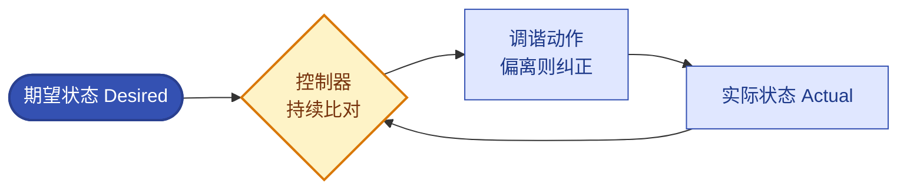

# 第5章 声明式API与控制循环核心机制
<!-- 第二篇 Kubernetes 底座 ｜ ★理论核心·机械自治（全书第一层理论核心） ｜ 状态：终审中 -->

> 本章定位：全书三层自治模型**第一层 · 机械自治**。讲清 K8s 声明式调谐闭环（期望状态 → 调谐循环 → 实际状态），实现基础设施层稳态自愈。本章是全书理论支点之一，后续运维自治（第 16 章）与智能自治（第 18 章）都建立在此基础之上。本章全部实验与制品跑在托管 K8s 上（阿里云 ACK 主参考、AWS EKS 对照）——控制面这套"声明式 API + 调谐循环"本身就是云厂商的托管服务（4.2）。

> **边界声明**：本章只讲声明式机制与机械自治闭环；业务层观测自治归第 16 章，AI 智能自治归第 18 章。超出部分归 V2。

---

## 5.1 命令式运维与声明式运维的思维本质差异（极简导入）

### 生产问题

命令式运维（扩容 `kubectl scale`、改配置 `kubectl edit`、修故障 `kubectl delete pod`）只记录"做过什么动作"，不记录"系统应该是什么样"。系统偏离正轨时没有任何机制把它拉回来，只能靠人再次发命令——配置漂移、操作不可复现、故障反复是必然结果。声明式优于命令式是业界定论，不再论证。

### 传统方案失效原因

命令式把"状态"与"动作"绑死：动作执行完即结束、同一条命令重复执行有副作用、期望状态只存在于操作者脑中、偏离只能靠人发现并修复。失效根因一句话：**系统无法自我维持稳态，全部复杂度压在人的记忆力与纪律上**。

### 架构约束与权衡

| 维度 | 命令式 | 声明式 |
|---|---|---|
| 操作方式 | 逐条下命令（scale/set/edit），做完即忘 | 提交一份 YAML（spec），控制器持续执行 |
| 故障恢复 | 人发现、人修复，动作不重放 | 控制器检测偏离，自动拉回期望状态 |
| Git 可审计性 | 只留审计日志里的动作流水，无"应然状态" | 期望状态全量入库，`git diff` 即变更评审 |

托管视角一句话：**ACK/EKS 的控制面就是"声明式 API 的托管实例"**（呼应 4.2）——托管费买的就是这套持续调谐的控制器矩阵；你的职责是把期望状态喂给它（Git + ArgoCD，第 10 章），而不是替它发动作。

权衡的核心：**声明式放弃"逐步动作的精确控制"，换来"状态持续自维持"**。规模化运维下后者是唯一可持续模式（定论）。

### 最小可行方案

1. **改写运维心智**：从"我要执行什么动作"转为"我要系统达到什么状态"。
2. **声明写入 Git**：期望状态以 YAML（Helm chart，9.4）形式存 Git，而非临时命令。
3. **让系统去达成**：交给控制器调谐，由 ArgoCD 同步（第 10 章），不手敲每一步。
4. **验证收敛**：检查实际状态是否等于期望状态，而非检查命令是否执行成功。

### 生产落地实现

**命令式三连 → 一份声明**的最小改写（贴进集群即可跑）：

```yaml
# demo-api.yaml —— 期望状态入库，替代"扩容/换镜像/删 Pod"三条命令
apiVersion: apps/v1
kind: Deployment
metadata:
  name: demo-api
  namespace: prod
spec:
  replicas: 5                       # 可调：容量目标；HPA 接管后此行删除（见 5.2 ③）
  selector:
    matchLabels: { app: demo-api }
  template:
    metadata:
      labels: { app: demo-api }
    spec:
      containers:
      - name: api
        image: registry.cn-hangzhou.aliyuncs.com/demo/api:1.4.2   # ACR；对照 AWS ECR
        ports: [{ containerPort: 8080 }]
```

```bash
# 退役清单：三条命令式习惯动作，全部由上面这份 YAML + 控制器接管
# kubectl scale deploy/demo-api --replicas=5     → 改 YAML 的 replicas 再同步
# kubectl set image deploy/demo-api api=…:1.4.2  → 改 YAML 的 image 再同步
# kubectl delete pod -l app=demo-api             → 控制器自动重建（5.3 实验 1）
git add demo-api.yaml && git commit -m "api: replicas 3->5"
# ArgoCD 默认每 180s 轮询 Git 刷新期望状态（webhook 可即时触发，第 10 章）
```

云服务映射：期望状态沿 Git → ArgoCD → 托管控制面（ACK/EKS apiserver）链路执行；镜像来自 ACR/ECR。数字：**3 类高频命令操作收敛为 1 份 YAML；ArgoCD 默认 180s 同步周期**。

### 典型故障案例

某次值班用 `kubectl edit` 直接改生产配置应急，未记录。两周后 Pod 重建，配置回退旧值，故障复发——命令式改动没进声明，重建即丢。改为声明式 + ArgoCD 后，任何变更先落 Git，重建后自动应用正确状态。

点评：**命令式应急改的，必然在下次重建时丢失**；声明式让"正确状态"成为唯一事实。

### 根因定位

根因不在某次没记录，而在**命令式运维不持久化期望状态**——状态只在动作发生的那一刻正确，过后无人维护必然漂移。

### 长效治理方案

- 期望状态全部进 Git，禁止命令式直改生产（应急白名单除外，13.3）。
- 运维心智从"动作"转向"状态"；验证"收敛"而非验证"命令执行成功"。
- 控制器维持稳态，人只负责定义期望状态。

### 自动化/自治闭环

声明式思维是 L1 机械自治的认知前提：**只有先接受"声明期望、让系统调谐"，5.2 的闭环与 5.3 的自愈才有用武之地**。本节心智转换是本章地基，也是 L2（16 章）/L3（18 章）把"决策"交给系统执行的第一步。

### 生产检查清单

- [ ] 运维心智从"执行动作"转向"声明状态"？
- [ ] 期望状态全部进 Git（无命令式直改生产）？
- [ ] 由控制器维持稳态（而非手动维持）？
- [ ] 验证方式是"实际状态 == 期望状态"（而非命令执行成功）？
- [ ] 杜绝"应急手改、重建丢失"的循环？

---

## 5.2 核心闭环逻辑：期望状态(Desired) → 调谐循环(Reconciliation) → 实际状态(Actual)
<!-- 【机械自治】三层自治第一层核心闭环 -->

### 生产问题

想象没有控制器持续调谐的世界：把副本扩到 5 之后某节点故障带走 2 个 Pod，**没人盯、没东西补**，实际停在 3 个，业务降级半天直到用户投诉。"扩到过 5"只是历史动作，不是当前保证。声明式的价值不在"写下来"，而在**有控制循环持续让实际趋近期望**——这个持续动作就是调谐。

> 注：一旦把 `replicas: 5` 写进 Deployment，期望状态就持久化进 API 存储（托管集群里这层由云厂商运维，4.2），Deployment controller 持续比对并自动补足——这正是本节要亲手观察的闭环。

### 传统方案失效原因

- 用了**无控制器的资源**（裸 Pod）或把期望只写进文档：没有控制器比对，偏离无人纠正。
- **一次性脚本当调谐**：不持续、不可重入、覆盖不全。
- **调谐与声明割裂**：声明在 Git、调谐靠人，没形成自动闭环。

失效根因：**声明式 + 调谐循环是一个整体，缺了调谐，声明就是死文档**。

### 架构约束与权衡



| 要素 | 作用 | 权衡 |
|---|---|---|
| **期望状态 Desired** | 目标：系统应该是什么样 | 必须显式、可版本化（Git） |
| **实际状态 Actual** | 现实：系统现在是什么样 | 必须可观测（kubectl / 监控） |
| **调谐循环 Reconciliation** | 动作：比对差异并纠正 | 频率越高收敛越快，控制面负载越大 |

闭环逻辑：**控制器持续 watch 资源 → 比对 Desired vs Actual → 有差异则执行动作消除差异 → 循环往复**，最终 Actual 收敛到 Desired。托管下控制面吞吐与多副本由云厂商保障（4.3），你的责任在客户端侧效率（LIST 分页）与观测收敛结果。

### 最小可行方案

1. **显式声明期望状态**：YAML/Helm 写清副本、镜像、配置。
2. **信任控制器调谐**：Deployment controller 持续比对并纠正。
3. **观测实际状态**：用 `kubectl get -w` 确认 Actual 收敛到 Desired。
4. **改期望即改状态**：更新声明，控制器自动把 Actual 调到新 Desired。

### 生产落地实现

**① 闭环观察实验：apply → 看收敛 → 改期望 → 再收敛**（本节核心制品，任何 ACK/EKS 集群可直接复现；前置：namespace `prod` 已存在）：

```bash
# 步骤 1：提交期望状态（spec.replicas: 5）
kubectl apply -f demo-api.yaml             # 输出：deployment.apps/demo-api created

# 步骤 2：观察收敛——READY 列 0/5 → 5/5，这就是 Actual 向 Desired 收敛
kubectl get deploy demo-api -n prod -w
# NAME      READY   UP-TO-DATE   AVAILABLE   AGE
# demo-api  0/5     5            0           2s
# demo-api  3/5     5            3           7s
# demo-api  5/5     5            5           14s     ← 收敛完成

# 步骤 3：改期望（5 → 3），控制器自动把 Actual 调下去
sed -i.bak 's/replicas: 5/replicas: 3/' demo-api.yaml   # macOS/Linux 通用
kubectl apply -f demo-api.yaml             # 输出：deployment.apps/demo-api configured
kubectl get deploy demo-api -n prod -w     # 5/5 → 3/3，再次收敛
```

观察要点（数字）：副本补足在镜像已缓存时为**秒级到十秒级**（含调度与就绪探针）；收敛卡住看 `kubectl rollout status deploy/demo-api -n prod` 与 Events（4.3 判定表）。

**② 变更预检：先看差异再动集群**（把声明式的评审优势落成命令）：

```bash
# 预览"即将 apply 的变更"与线上实际状态的差异（不落盘）
kubectl diff -n prod -f demo-api.yaml
# 退出码：0=无差异，1=有差异，>1=出错 —— CI 里用退出码卡"未经评审的变更"门禁

# 服务端试运行：请求真走 apiserver（过准入/校验/配额检查），但不持久化
kubectl apply -n prod -f demo-api.yaml --dry-run=server
# 与 --dry-run=client 的区别：client 只本地渲染 YAML，server 才能暴露准入拒绝与字段校验失败
```

**③ 三向合并与 --server-side 字段所有权**（多方写同一对象时必须理解）：

- 默认客户端 apply 是**三向合并**：拿「上次 apply 的快照（last-applied-configuration 注解）+ 本次配置 + 线上实际」算补丁，只回放"配置相对上次的变化"。
- `--server-side`（SSA）改为**字段所有权**模型：每个字段记录写入方（manager），apply 冲突会直接报错并列出抢字段的 manager，加 `--force-conflicts` 才强制接管。

```bash
# 多写入方场景：GitOps 工具与手工 kubectl 并写同一对象时，统一走 SSA 并显式命名 manager
kubectl apply --server-side --field-manager=argocd -f demo-api.yaml
# 可调：field-manager 名称与写入方对齐（argocd/kubectl/helm），冲突报错时才认得出谁在抢
kubectl apply --server-side --force-conflicts -f demo-api.yaml   # 日常禁用：仅排障时强制接管
```

| | 客户端 apply（默认） | --server-side（SSA） |
|---|---|---|
| 合并依据 | last-applied 注解三向合并 | managedFields 字段所有权 |
| 冲突表现 | 后写者静默覆盖 | 报冲突并列出各 manager |
| 什么时候必须 SSA | 单一写入方够用 | **多控制器/多工具管同一对象**：ArgoCD 与 kubectl 并写、HPA 管 replicas 而 Git 里也声明 replicas、云控制器回写 spec 子字段 |

配套纪律：HPA（7.5）接管 `replicas` 后，必须从 Git 的 YAML 里删掉该字段——两个写入方抢同一字段是经典故障源；大对象也建议 SSA（省去 last-applied 注解的读写开销）。

云服务映射：这套 apply/diff/watch 打的 apiserver 就是 ACK/EKS 的托管控制面——云厂商把声明式 API 当服务提供（4.2）；EKS 对照侧 `aws eks update-kubeconfig --name <cluster>` 后同一套 kubectl 通用。数字：**diff 退出码 1=有差异；0/5→5/5 收敛秒级；ArgoCD 180s 轮询兜底**。

### 典型故障案例

节点故障后 Pod 没自动补足，根因是负载用的是裸 Pod——没有控制器，丢了就丢了。改为 Deployment 后节点故障自动重调度，副本秒级恢复。

点评：**闭环覆盖到的资源能自愈，覆盖不到的靠人**。裸 Pod、无控制器资源不在闭环内。

### 根因定位

根因不在节点故障，而在**资源未纳入控制器的调谐闭环**。

### 长效治理方案

- 所有负载纳入控制器（Deployment/StatefulSet/Job），禁用裸 Pod。
- 变更必走 diff 预检 + server dry-run（CI 门禁化）。
- 多写入方对象统一 SSA + field-manager 命名规范；HPA 管的字段从 Git 删除。
- 实际状态持续可观测（第 12 章）。

### 自动化/自治闭环

本节定义的调谐闭环就是 L1 机械自治的核心引擎：**期望状态 → 调谐循环 → 实际状态收敛**。它的可靠运转是基础设施稳态自愈的保证；L2（16 章）与 L3（18 章）的一切决策，最终都翻译成"改期望状态"交给这个闭环执行——闭环不可信，上层自治就是空中楼阁。

### 生产检查清单

- [ ] 所有负载纳入控制器（无裸 Pod）？
- [ ] 用 `get -w` 亲眼观察过一次收敛（而非只看 apply 成功）？
- [ ] 变更流程含 `kubectl diff` + `--dry-run=server` 预检？
- [ ] 多写入方对象走 SSA，field-manager 命名规范明确？
- [ ] HPA 管理的 replicas 已从 Git 声明中删除？

---

## 5.3 K8s机械自治核心：系统稳态自愈、资源收敛逻辑与生产容错机制
<!-- 【机械自治】基础设施层稳态自愈 -->

### 生产问题

理解了闭环，生产里还是出事：节点 NotReady 没人处理、滚动更新打穿可用性、以为有闭环就不再观测。**知道"有闭环"和"闭环在生产可靠运转"是两回事**——机械自治要真正稳，必须掌握它的收敛语义与容错边界。

### 传统方案失效原因

- 不理解收敛语义：不知道控制器是 level-triggered、调谐幂等，重放会不会出事心里没底。
- 容错配置缺失：探针/PDB/优雅终止没配，自愈动作本身造成中断。
- 误把机械自治当万能：闭环只忠于"期望状态"，不判断期望对错。

失效根因：**只用了闭环的"形"，没掌握闭环的"理"**。

### 架构约束与权衡

先补本层核心语义：**K8s 控制器是 level-triggered（电平触发）——调谐依据是"当前全量状态"，不是"变更事件"**。因此 watch 断连、事件丢失、控制器重启后的重放都安全：重放一次幂等调谐（比对→必要时动作）不产生额外副作用。对照 edge-triggered（边沿触发）系统：错过一个事件就永久错过，必须自己补事件去重与重放。这就是托管控制面敢滚动升级控制器（4.4）的原因，也是 5.4 自研 Operator 必须遵守的调谐语义。

| 机制 | 作用 | 权衡 |
|---|---|---|
| **最终一致性** | 持续调谐，最终收敛（不保证瞬时一致） | 收敛期短暂偏离需观测容忍 |
| **幂等调谐** | 调谐可重复执行，结果一致 | 控制器必须正确处理并发（见 5.4 status 写回） |
| **健康探针** | 判定 Pod 健康，触发自愈 | 配置不当会误杀（7.1） |
| **PDB** | 自愿中断时保最少可用副本 | 与滚动更新/驱逐协调 |
| **优雅终止** | preStop + grace period 处理在途请求 | AI 负载要给足清理时间（17/18 章） |

权衡的核心：**机械自治用"最终一致 + 持续调谐"换稳态自愈，容错机制让自愈动作本身不制造二次故障**。

### 最小可行方案

1. **三探针齐全**：liveness（崩溃自愈）/readiness（流量就绪）/startup（慢启动保护），细节见 7.1。
2. **PDB 保底**：关键服务设 PDB，保证滚动/驱逐时最少可用副本。
3. **优雅终止**：preStop 钩子 + 合理 `terminationGracePeriodSeconds`。
4. **闭环可观测**：重启次数、NotReady 节点、调谐延迟进 VictoriaMetrics、Grafana 看板（第 12 章）。

### 生产落地实现

**① 自愈三连实验**（用 5.2 的 demo-api，逐项验证闭环真实生效）：

```bash
# 实验 1：Pod 消失自动重建（计时）
kubectl -n prod delete pod -l app=demo-api --wait=false    # 模拟实例故障
kubectl -n prod get pods -l app=demo-api -w                # 新 Pod（全新名字）被拉起
# 数字：镜像已缓存时，delete → 新 Pod Ready 典型 5–30s

# 实验 2：节点故障重调度（drain 模拟节点下线）
kubectl get pods -n prod -o wide | grep <node>             # 记录该节点上的 Pod
kubectl drain <node> --ignore-daemonsets --delete-emptydir-data
kubectl get pods -n prod -o wide                           # Pod 换节点重生（受 PDB 节流）
kubectl uncordon <node>

# 实验 3：坏进程自动重启（探针兜底，探针细节见 7.1）
kubectl -n prod exec deploy/demo-api -c api -- sh -c 'kill 1'   # 杀掉容器主进程
kubectl -n prod get pods -l app=demo-api -w                     # RESTARTS +1
# 数字：liveness 默认 failureThreshold=3 × periodSeconds=10s → 约 30s 检测窗
```

**② PDB 护栏**（让实验 2 的驱逐不打破可用性底线）：

```yaml
apiVersion: policy/v1
kind: PodDisruptionBudget
metadata:
  name: demo-api
  namespace: prod
spec:
  minAvailable: 4                 # 可调：5 副本保底 4；drain 将低于 4 则阻塞等待
  selector:
    matchLabels: { app: demo-api }
```

**③ 自愈边界表**（哪些能自愈、哪些必须人或上层介入——机械自治不是万能的）：

| 故障类型 | 能否自愈 | 机制与去向 |
|---|---|---|
| Pod 崩溃/被误删 | 能，秒级 | Deployment 重建（实验 1） |
| 节点 NotReady/下线 | 能，分钟级 | 驱逐+重调度（实验 2）；节点本体由节点池自动修复替换（4.2） |
| 进程假死 | 能 | liveness 探针重启（实验 3，7.1） |
| **配置写错（YAML 本身错）** | **不能** | 闭环忠实执行错误声明，还会把正确现场"自愈"回错误状态；靠 diff 预检（5.2 ②）+ 灰度回滚（11.3） |
| 镜像 tag 不存在 | 不能 | ImagePullBackOff 无限重试不收敛；靠发布前校验（第 11 章） |
| 资源不足 Pending | 不能 | 调度不出副本；靠容量治理（7.4/14 章） |
| 上游依赖/数据库故障 | 不能 | 超出 L1 范围，归 L2 运维自治（第 16 章） |

云服务映射：节点故障自愈在托管下是**双保险**——K8s 闭环负责 Pod 重调度，云侧 ACK 节点池自动修复（cordon→drain→替换坏节点）/ EKS 托管节点组自动替换不健康节点；控制面自身故障由云 SLA 兜底（4.2）。数字：**Pod 重建 5–30s、liveness 检测窗 ≈30s、minAvailable 4/5**。

### 典型故障案例

某服务滚动更新时全部副本同时被替换，中断 30 秒。根因：无 PDB + `maxUnavailable: 100%`。配 PDB（minAvailable 4）+ `maxUnavailable: 1` 后滚动更新零中断。

点评：**自愈动作若不容错，本身就是故障源**。PDB 与滚动策略让自愈安全。

### 根因定位

根因不在控制器逻辑，而在**容错机制缺失**——闭环会自愈，但自愈需要探针/PDB/优雅终止护航，否则自愈变自伤。

### 长效治理方案

- 所有负载三探针 + PDB + 优雅终止；滚动参数（maxUnavailable/maxSurge）保守取值。
- 每月一轮自愈三连实验（并入 13.5 极简注入，台账记录实测耗时）。
- 闭环本身纳入观测：重启次数/NotReady/调谐延迟（VM + Grafana，第 12 章）。
- 对自愈边界有共识：配置/镜像类错误不自愈，走预检与回滚（第 11 章）。

### 自动化/自治闭环

本节容错机制让 L1 机械自治在生产里**可靠**运转：稳态自愈 + 容错保护 = 可信赖的基础设施层自治。这个"可信赖"是 L2/L3 的前提——上层自治的决策要交给下层闭环执行，下层必须可靠；level-triggered + 幂等语义则保证闭环在故障与重放下的确定性。

### 生产检查清单

- [ ] 所有负载三探针齐全（liveness/readiness/startup）？
- [ ] 关键服务 PDB 保底（minAvailable/maxUnavailable 明确）？
- [ ] 优雅终止（preStop + grace period）已配？
- [ ] 自愈三连实验至少跑过一轮并有实测耗时记录？
- [ ] 团队对自愈边界表有共识（配置错误不自愈，走第 11 章回滚）？
- [ ] 闭环本身纳入观测（重启次数/NotReady/调谐延迟）？

---

## 5.4 CRD+Operator扩展思想与企业定制化运维落地范式

### 生产问题

领域特定运维诉求（复杂中间件的部署+扩缩+备份+故障恢复）原生资源表达不了，只能外部脚本拼凑——又回到命令式运维。**当原生资源不够表达领域逻辑，需要一个能把领域知识编码进集群的扩展机制**——这就是 CRD + Operator。

### 传统方案失效原因

- 原生资源表达力不足：Deployment 只懂副本维持，不懂备份、故障转移、版本兼容迁移。
- 领域逻辑留在集群外（CI/脚本），不进控制平面，不享受调谐闭环。
- 专家知识无法沉淀复用，各团队重复造轮子。

失效根因：**不进调谐闭环的逻辑，必然随时间失效**。

### 架构约束与权衡

| 概念 | 作用 | 权衡 |
|---|---|---|
| **CRD（自定义资源）** | 定义新的期望状态类型（spec）+ 观察面（status） | schema 要设计合理、版本化演进 |
| **Operator（自定义控制器）** | 用代码实现该资源的调谐逻辑 | 开发/维护/值班成本自担 |
| **领域知识编码** | 专家的部署/扩缩/备份/恢复逻辑常驻集群 | 知识沉淀，可复用可标准化 |

核心思想：**Operator = 领域专家的运维知识，以控制器形式常驻集群**，让复杂中间件/数据库/AI 服务也享受声明式 + 调谐闭环。调谐必须幂等、level-triggered（5.3）——这是自研 Operator 的硬约束，不是风格建议。

权衡的核心：**运维知识从"人/脚本"转移到"集群内控制器"，换声明式治理与自洽运转；代价是开发维护成本，只对高价值、重复性强的领域逻辑值得**。

### 最小可行方案

云生态立场下先按优先级选型（**默认用现成，自研是例外**）：

| 优先级 | 方式 | 什么时候用 | 代价 |
|---|---|---|---|
| 1 | **云托管服务**（RDS/Redis/MongoDB 等云产品） | 有对应云产品、无强定制需求 | 与 K8s 两套账（内网/身份已可打通：RRSA/IRSA + SLB，4.2） |
| 2 | **现成成熟 Operator**（社区稳定项目 / ACK 组件市场） | 必须跑在集群内、生命周期复杂 | 升级兼容自管（跟随 4.4 版本节奏） |
| 3 | **自研 Operator** | 业务强需求且无现成（如自研调度系统的专属备份语义） | 开发/维护/值班全自担，先算清 ROI |

判定值得自研后四步落地：识别高价值领域 → 设计 CRD schema → kubebuilder 实现调谐 → 沉淀为团队标准。

### 生产落地实现

以运维最贴近的 **ScheduledBackup（定时备份）** 为例，走完"CRD → 实例 → 脚手架 → 调谐代码"全链：

**① CRD：定义新的期望状态类型**（等价于下方 ③ `make manifests` 生成物的手写精简版，实际开发中由脚手架生成、禁手改）：

```yaml
apiVersion: apiextensions.k8s.io/v1
kind: CustomResourceDefinition
metadata:
  name: scheduledbackups.backup.ops.example.com   # 生产禁改：必须是 <plural>.<group>
spec:
  group: backup.ops.example.com
  scope: Namespaced
  names:
    plural: scheduledbackups
    singular: scheduledbackup
    kind: ScheduledBackup
    shortNames: [sbk]
  versions:
  - name: v1
    served: true
    storage: true
    subresources:
      status: {}                 # 生产禁改：spec/status 分离，控制器只写 status
    schema:
      openAPIV3Schema:
        type: object
        properties:
          spec:
            type: object
            required: [schedule, retentionDays, pvcName]
            properties:
              schedule: { type: string }            # cron 表达式
              retentionDays: { type: integer, minimum: 1 }
              pvcName: { type: string }
          status:
            type: object
            properties:
              lastBackupTime: { type: string, format: date-time }
              lastJobName: { type: string }
```

**② 像用原生资源一样声明一个实例**：

```yaml
apiVersion: backup.ops.example.com/v1
kind: ScheduledBackup
metadata:
  name: pg-main-daily
  namespace: prod
spec:
  schedule: "0 2 * * *"         # 可调：每天 02:00，避开业务高峰
  retentionDays: 7              # 可调：保留 7 天；OSS 生命周期规则可再叠 30 天归档
  pvcName: pg-main-data
```

**③ kubebuilder 脚手架命令序列**（生成 ① 的 CRD 与控制器骨架）：

```bash
mkdir backup-operator && cd backup-operator
kubebuilder init --domain ops.example.com --repo github.com/myorg/backup-operator
kubebuilder create api --group backup --version v1 --kind ScheduledBackup
make manifests generate      # 由 Go 类型标注生成 CRD/deepcopy（生成的 CRD 禁手改）
make install                 # 安装 CRD 到当前集群
make run                     # 本地运行 controller 调试（观察调谐日志，Ctrl+C 退出）
make docker-build docker-push IMG=registry.cn-hangzhou.aliyuncs.com/demo/backup-operator:v0.1.0
make deploy IMG=registry.cn-hangzhou.aliyuncs.com/demo/backup-operator:v0.1.0
```

**④ reconcile 核心代码（Go，节选）**——"读期望→对比实际→执行→写 status"的幂等结构：

```go
// internal/controller/scheduledbackup_controller.go（节选：省略 import 与 Job 构造细节）
func (r *ScheduledBackupReconciler) Reconcile(ctx context.Context, req ctrl.Request) (ctrl.Result, error) {
	var bk backupv1.ScheduledBackup
	if err := r.Get(ctx, req.NamespacedName, &bk); err != nil {
		return ctrl.Result{}, client.IgnoreNotFound(err) // 读期望：已删除则幂等退出
	}
	if bk.Status.LastBackupTime != nil &&
		time.Since(bk.Status.LastBackupTime.Time) < 24*time.Hour {
		return ctrl.Result{RequeueAfter: 10 * time.Minute}, nil // 对比实际：未到期空转重排
	}
	job := buildJob(&bk) // 执行：构造备份 Job（挂 PVC 快照并上传 OSS）
	if err := r.Create(ctx, job); err != nil && !apierrors.IsAlreadyExists(err) {
		return ctrl.Result{}, err // 已存在视为成功——幂等关键
	}
	bk.Status.LastBackupTime = &metav1.Time{Time: time.Now()} // 写 status（不碰 spec）
	bk.Status.LastJobName = job.Name
	if err := r.Status().Update(ctx, &bk); err != nil {
		return ctrl.Result{}, err // 乐观并发冲突：返回错误，触发下一轮重试
	}
	return ctrl.Result{RequeueAfter: 10 * time.Minute}, nil
}
```

云服务映射：备份制品上传 OSS（阿里云）/ S3（AWS），Pod 凭据走 RRSA/IRSA 临时凭据（4.2）；决策表优先级 1 的场景（标准数据库）直接用云数据库 RDS 自带备份与按时间点恢复，只有"数据必须以 PV 形态自管在集群里"才轮到本 Operator。数字：**每日 02:00 一跑、保留 7 天、RequeueAfter 10 分钟空转重排——一个 Operator 替代散在 N 台机器的 cron 脚本，且备份状态可 `kubectl get sbk -o yaml` 直接审计**。

### 典型故障案例

某数据库用 StatefulSet + 外部脚本运维，备份/恢复脚本散落；恢复演练时发现脚本已因依赖变更失效，差点无法恢复。改用成熟数据库 Operator（内置备份/恢复调谐）后，备份恢复成为声明式自洽能力，定期演练零负担。

点评：**Operator 让领域运维从"脚本拼凑"变成"系统能力"**，常驻调谐保证能力始终有效。

### 根因定位

根因不在脚本失效，而在**领域逻辑游离于控制平面之外**——不在调谐闭环里的逻辑，必然随时间失效。

### 长效治理方案

- 选型守优先级：云托管 → 成熟 Operator → 自研（强需求才自研）。
- 自研 Operator 纳入版本管理、可观测与值班（它自己也是一个工作负载）。
- 领域资源进 Git + GitOps；CRD 版本化演进（storage 版本唯一）。

### 自动化/自治闭环

CRD + Operator 是 L1 机械自治的**扩展机制**：原生资源不够用时，用自定义资源 + 自定义控制器把新的"期望→调谐→实际"闭环纳入系统，让机械自治覆盖任意领域逻辑（含 AI 负载生命周期，17/18 章）。它同时为 L2/L3 提供更丰富的治理载体——上层决策可以落成"改某个 CR 的 spec"，交回闭环执行。

### 生产检查清单

- [ ] 选型按"云托管 → 成熟 Operator → 自研"优先级执行？
- [ ] CRD schema 含 spec/status 分离（status 子资源开启）？
- [ ] 调谐代码幂等且 level-triggered（重放安全）？
- [ ] CRD 由 kubebuilder 生成而非手写，版本化演进？
- [ ] 领域资源进 Git + GitOps，Operator 自身有观测与值班归属？

---

## 5.5 增强工作负载：原地升级、Pod打散、Sidecar无感注入生产实践

### 生产问题

AI 推理（大镜像、模型加载慢）、有状态服务（重启代价高）、多副本需严格打散（避免单节点/单可用区扎堆）——原生工作负载为通用场景设计，处理这些场景吃力：滚动更新=重建 Pod，大镜像重新加载分钟级；副本可能扎堆单点。特殊负载需要增强能力。

### 传统方案失效原因

- 重建式更新代价高：大镜像 Pod 重建要重新拉镜像+加载模型（vLLM 类推理冷启分钟级）。
- 原生 Deployment 无原地升级：改镜像必重建，网络/存储身份全换。
- 打散靠手配、Sidecar 与业务容器同生共死：默认调度可能扎堆，治理组件升级连累业务。

失效根因：**原生"重建式"模型与大镜像/有状态/强打散场景不适配**。

### 架构约束与权衡

| 能力 | 作用 | 权衡/边界 |
|---|---|---|
| **原地升级**（Kruise CloneSet） | 只换镜像不重建 Pod，保留网络/存储身份，秒级生效 | 仅镜像等少数字段可原地；改资源配额依赖原生 InPlacePodVerticalScaling（alpha，特性状态以官方文档为准） |
| **Pod 打散**（topologySpread） | 副本跨节点/可用区均匀分布 | 约束增多、资源碎片风险（原理详见 7.3） |
| **原生 Sidecar** | Sidecar 独立生命周期、保证启停顺序 | 需 K8s ≥1.28；1.29 起默认可用，1.28 需开 SidecarContainers 门控（特性状态以官方文档为准） |

权衡的核心：**增强能力用复杂度换场景适配，按场景选用，不全开**。

### 最小可行方案

1. **大镜像/AI 推理**：CloneSet（InPlaceIfPossible）避免重建重加载（17/18 章）。
2. **关键多副本**：`topologySpreadConstraints` 跨 zone/hostname 打散（7.3）。
3. **日志/监控 Sidecar**：原生 Sidecar（init 容器 + `restartPolicy: Always`）。
4. **有状态服务**：StatefulSet 有序滚动 + PV 保持（第 8 章）。

### 生产落地实现

**① 原地升级：Kruise CloneSet 最小可运行 YAML**：

```yaml
apiVersion: apps.kruise.io/v1beta1
kind: CloneSet
metadata:
  name: llm-gateway
  namespace: prod
spec:
  replicas: 3
  selector:
    matchLabels: { app: llm-gateway }
  template:
    metadata:
      labels: { app: llm-gateway }
    spec:
      containers:
      - name: gw
        image: registry.cn-hangzhou.aliyuncs.com/demo/llm-gateway:v1.8.0
        ports: [{ containerPort: 8080 }]
  updateStrategy:
    type: InPlaceIfPossible      # 可调：能原地则原地，否则退回重建
    inPlaceUpdateStrategy:
      gracePeriodSeconds: 10     # 可调：原地重启前给探针/LB 摘流缓冲
```

限制说明：原地升级仅覆盖镜像等少数字段，**Pod 名/IP/PVC 全部保留**；镜像需已在节点缓存（配合 ACR 企业版 P2P 分发/ECR 拉取缓存预热，否则仍要拉镜像）；改 resources 走原生 InPlacePodVerticalScaling——alpha 特性，特性状态以官方文档为准。

**② Pod 打散**（原理与完整策略见 7.3，此处为关键服务最小配置）：

```yaml
spec:
  topologySpreadConstraints:
  - maxSkew: 1                          # 生产禁改：不均衡上限 1
    topologyKey: topology.kubernetes.io/zone
    whenUnsatisfiable: DoNotSchedule    # 可用区级硬约束：不满足就调度失败
    labelSelector:
      matchLabels: { app: llm-gateway }
  - maxSkew: 1
    topologyKey: kubernetes.io/hostname
    whenUnsatisfiable: ScheduleAnyway   # 节点级软约束：尽量打散
    labelSelector:
      matchLabels: { app: llm-gateway }
```

**③ 原生 Sidecar 注入**（日志/采集 agent 与业务解耦）：

```yaml
spec:
  containers:
  - name: gw
    image: registry.cn-hangzhou.aliyuncs.com/demo/llm-gateway:v1.8.0
  initContainers:
  - name: otel-agent                     # 原生 Sidecar = init 容器 + restartPolicy: Always
    image: registry.cn-hangzhou.aliyuncs.com/demo/otel-collector:0.104.0
    restartPolicy: Always                # 生产禁改：缺此字段就是普通 init，跑完即退出
    ports: [{ containerPort: 4317 }]
```

原生 Sidecar 保证：**先于主容器启动、晚于主容器终止，独立崩溃自动重启**；若需"存量 Pod 注入/独立热升级"，升级到 Kruise SidecarSet（与 CloneSet 同在 ack-kruise 组件里）。

云服务映射：CloneSet/SidecarSet 来自 **OpenKruise，ACK 组件市场一键安装 ack-kruise**（EKS 对照：Helm 装 openkruise chart）；镜像分发用 ACR P2P/ECR 缓存预热。数字：**大镜像推理更新从重建的 ≈3 分钟（拉镜像+加载模型）降到原地秒级（镜像已缓存时容器重启典型 5–15s）；maxSkew=1 保证 3 副本跨 ≥2 可用区**。

### 典型故障案例

某 vLLM 推理服务每次更新重建 Pod，重新加载模型耗时 3 分钟，更新窗口容量下降。改 CloneSet 原地升级后只换镜像不重建，模型加载利用既有缓存，中断从分钟级降到秒级。

点评：**重建式更新对大镜像/AI 负载是奢侈品**，原地升级是这类场景的生产刚需。

### 根因定位

根因不在更新策略参数，而在**原生重建式模型与特殊负载特性不适配**——场景错配靠调参解决不了，要换对负载类型。

### 长效治理方案

- 大镜像/AI 负载统一 CloneSet + 镜像预热；关键服务强制打散（zone 硬约束）。
- Sidecar 一律原生 Sidecar（或 Kruise SidecarSet），禁与业务容器混编。
- 增强负载纳入 4.4 版本兼容矩阵（Kruise 版本跟随 K8s 版本）。

### 自动化/自治闭环

增强工作负载让 L1 机械自治在特殊场景下**依然高效**：原地升级让大镜像负载的更新不破坏稳态；打散让自愈重建后的分布依然高可用；Sidecar 独立重启让治理组件故障不连累业务。它们拓宽了 L1 的适用边界，是 AI 负载（17/18 章）能高效自愈的支撑。

### 生产检查清单

- [ ] 大镜像/AI 负载用 CloneSet 原地升级（镜像预热就位）？
- [ ] 关键服务 topologySpread（zone 硬约束 + hostname 软约束）？
- [ ] Sidecar 用原生 Sidecar（restartPolicy: Always）或 SidecarSet？
- [ ] 有状态服务有序滚动 + PV 保持？
- [ ] Kruise 版本在 4.4 兼容矩阵内、增强能力按场景选用？
