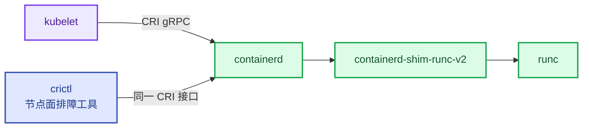

# 第6章 Containerd容器运行时生产运维
<!-- 第二篇 Kubernetes 底座 ｜ 常规章（精简锁版） ｜ 状态：终审中 -->

> 本章定位：讲清 CRI 运行时标准演进与 Containerd/runc 生产运维，聚焦容器生命周期与高频故障闭环。精简锁版，不展开深度内核隔离。全书生态锁定托管 K8s：ACK/EKS 的工作节点运行时同样是 containerd——节点面是运维的责任田（4.2），本章即以「托管节点的运行时排障」视角深化。
> **主线定位**：本章为运行时是 L1 调谐闭环的执行末端——期望状态的最终落点在节点面（三层自治总览见 1.5，理论核心为第 5/16/18 章）。

> **边界声明**：本章只讲运行时生产运维，不展开深度内核隔离与安全沙箱（gVisor/Kata 等）、不展开 AI 容器化（第 17 章）。超出部分归 V2。

---

## 6.1 CRI运行时标准演进、Docker淘汰的生产底层逻辑
<!-- 业界定论（containerd 一统、构建/运行分离）不再论证；本节聚焦运行时的"运维动作" -->

### 生产问题

老集群升 K8s 1.24+ 必须迁离 dockershim（v1.24 起已从 kubelet 移除）——**选型早有定论，真正的痛点是：装了 containerd 但没人"运维"它**：GC 没配、磁盘被废弃镜像层悄悄塞满；节点间版本不一、同类故障不同表现；`config.toml` 全默认、大镜像拉取慢。托管集群同样如此：ACK/EKS 的工作节点运行时就是 containerd（EKS Bottlerocket 更是内置 containerd 的不可变 OS），运行时排障就是节点面责任田（4.2）。运行时运维缺位，是 6.4 节那些"莫名故障"的温床。

### 传统方案失效原因

- **把运行时当黑盒**：装完不管，GC/快照/仓库配置全默认，磁盘与拉取性能埋雷。
- **构建/运行不分离**：构建工具塞进运行镜像，镜像肥、攻击面大（2.3 节）。
- **版本漂移**：节点间 containerd 版本不一，排查被误导。

失效点不在"Docker vs containerd"（定论），而在**有 containerd、没有运行时运维**。

### 架构约束与权衡

| 维度 | 运维要点 | 权衡 |
|---|---|---|
| 链路 | kubelet → containerd 直连（CRI 标准、可替换） | 接受抽象，换故障面小 |
| 构建/运行 | CI 用 Docker/Buildah 构建，集群只跑 containerd | 两套工具，换职责纯净 |
| 配置 | `config.toml` 管仓库 mirror / 并发下载（镜像 GC 主旋钮在 kubelet，6.3） | 多一份配置，换磁盘与拉取性能可控 |
| 托管节点 | ACK 节点池自动升级随 K8s 小版本滚动 containerd（4.4）；EKS 换 AMI / Bottlerocket 整机替换 | 交出逐台改的自由，换版本统一 |

### 最小可行方案

1. **containerd 为准**：托管集群开箱即是，无需选型动作。
2. **版本全集群统一**：随节点池升级对齐（4.4），不逐台手工升级。
3. **GC 必配**：kubelet 镜像 GC 阈值显式化（6.3 配置段），磁盘不靠运气。
4. **config.toml 进 Git**（第 9 章配置即代码）。

### 生产落地实现

版本统一是运行时运维的第一项摸底，一条命令扫全池：

```bash
# 控制面视角：全集群运行时名称与版本（必须全池一致）
kubectl get nodes -o custom-columns='NODE:.metadata.name,RUNTIME:.status.nodeInfo.containerRuntimeVersion'
# 示例输出：containerd://1.6.32 —— 出现两种版本即漂移节点，随节点池升级对齐（4.4）

# 节点视角：单节点深查（ACK 用云助手下发，EKS 用 SSM Session Manager，见 6.4）
crictl version    # Server 行 = containerd 实际版本
```

- GC：镜像清理的主旋钮是 kubelet 的 `imageGCHighThresholdPercent/LowThresholdPercent`（默认 85/80，完整配置段见 6.3）；containerd 侧废弃快照由其内部 GC 调度器回收（containerd 2.x 起可在 `config.toml` 配置触发参数，字段随版本演进，以官方文档为准）。
- 拉取加速：私有仓库 mirror + `max_concurrent_downloads`（配置节选见 6.2 ③；AI 大镜像尤其重要，第 17 章）。
- 云映射：ACK 节点池自动升级在维护窗口滚动节点，containerd 随节点系统升级统一版本（4.4）；EKS 对照：托管节点组滚动更换 AMI，Bottlerocket 以不可变 OS 整机替换实现升级，containerd 由发行版统一管理。
- 运行时配置版本化，变更走 Git（第 9 章）。

### 典型故障案例

某节点磁盘 100% 告警，Pod 纷纷 Evicted。根因：**kubelet** 镜像 GC 未显式配置且长期未触发，废弃镜像堆积。显式配置 kubelet 镜像 GC 阈值 + 磁盘水位告警后，磁盘稳定在安全水位。

点评：**运行时不是装完就完的组件——GC / 版本 / 配置三件套不运维，磁盘和排查都会还债**。

### 根因定位

根因不在选型（定论），在**运行时运维缺位**——GC / 版本 / 配置没纳入日常治理。

### 长效治理方案

- config.toml 进 Git、变更有审。
- GC / 磁盘水位 / 拉取性能纳入观测（第 12 章）。
- 版本随节点池升级协同管理（4.4 节），不逐台手工。

### 自动化/自治闭环

containerd 是 L1 机械自治的**执行底座**：控制循环（第 5 章）决策的"起 / 停 / 重建 Pod"最终由它执行。GC 失效 → 磁盘爆 → 节点驱逐，正是 L1 自愈被运行时层拖垮的典型路径——运行时可运维，L1 才站得住。

### 生产检查清单

- [ ] GC 已显式配置（85/80，见 6.3）+ 磁盘水位告警？
- [ ] 全集群 containerd 版本统一、随节点池升级对齐（4.4）？
- [ ] 构建工具不进运行镜像（构建/运行分离）？
- [ ] config.toml 进 Git？
- [ ] 仓库 mirror + 并发下载已配？

---

## 6.2 Containerd、runc核心工作机制、镜像管理、快照、cgroup资源管控

### 生产问题

kubectl 只能看到 Pod 边界，节点内的容器、镜像、磁盘是"暗区"：磁盘被镜像层塞满不知从哪查（快照未清理）、容器资源超标没人发现（cgroup 视角没工具）、镜像拉取慢不知配置在哪（仓库 mirror 全默认）。**不掌握 crictl 与运行时三机制（镜像/快照/cgroup），节点面运维就是黑盒**——而节点面恰恰是托管集群下运维自己的责任田（4.2）。

### 传统方案失效原因

- **镜像管理无知**：不知道镜像层怎么存、谁来清，磁盘悄悄被填满。
- **快照机制不清**：每容器一套 rootfs 快照，不理解快照链与清理逻辑。
- **cgroup 未配/配错**：没设资源 limit，容器间互相挤占（noisy neighbor）。
- **工具缺位**：只会 kubectl、不会 crictl，进了节点也查不了运行时。

失效根因：**只把运行时当"跑容器的黑盒"**，镜像/快照/cgroup 三个机制与 crictl 一套工具都没掌握，磁盘、资源、拉取性能的运维全靠猜。

### 架构约束与权衡

运行时链路（crictl 与 kubelet 走的是同一个 CRI 接口，所以它看到的就是运行时真相）：



三大核心机制与权衡：

| 机制 | 作用 | 生产权衡 |
|---|---|---|
| **镜像管理** | 拉取/存储/复用镜像层（content 存层，snapshotter 组装） | 磁盘占用、GC 策略、仓库加速 |
| **快照（snapshotter）** | 为容器构造 rootfs（镜像层只读 + 可写层，默认 overlayfs） | 驱动选型、磁盘/inode 占用 |
| **cgroup** | 限制/隔离容器 CPU/内存/IO（K8s limit 最终落到这里） | limit 配置、避免误杀（第 7 章） |

**containerd 数据模型速览**（理解 `/var/lib/containerd` 为什么长那样的三块知识）：

| 部件 | 职责 | 磁盘落点 |
|---|---|---|
| **content store** | 镜像层的实际内容，按内容 sha256 寻址（同层全局唯一，天然去重） | `io.containerd.content.v1.content/` |
| **snapshotter** | 快照树：只读层按序叠加 + 可写层，组装出容器 rootfs（overlayfs） | `io.containerd.snapshotter.v1.overlayfs/` |
| **metadata** | 元数据库（bolt 引擎）：绑定"镜像→层→快照→容器"的关系账本 | `io.containerd.metadata.v1.boltdb/`（containerd 1.x；2.x 为 `...v1.bolt/`——以节点实际 `ls /var/lib/containerd` 为准） |

先做一个思想实验（先自己想答案，再往下读）：

> 节点磁盘使用 91%（一块 500GB 盘只剩 45GB）告警，你删掉 3 个大镜像的容器想腾空间，`df -h` 一看——纹丝不动。先猜：空间去哪了？

揭晓：删容器删掉的只是**快照与元数据记录**；镜像层的实际内容（content store）要等 **GC 引用计数归零**才释放——这批层还被别的容器引用着，**已退出（Exited）的容器同样算引用**，计数不归零，一个字节都不还你。真正回收要走 `crictl rmi --prune`：它清的是"未被任何容器使用的镜像"，只有这种镜像的层引用才归零、被 GC 收走。这一猜把上面三块数据模型变成排障直觉：**crictl 删的是"账"（快照/元数据），GC 收的才是"货"（content）**。

三者关系一句话：**content 存"内容"、snapshotter 存"组装结果"、metadata 记"谁是谁"**——拉镜像先写 content 再按层建快照；删容器删的是快照与元数据记录，层内容要等 GC（引用计数归零）才真正释放。这就是"删了容器磁盘没降"的原理，6.4 ③ 的磁盘排障直接建立在这个模型上。

权衡的核心：**镜像复用省磁盘但层依赖复杂；overlayfs 快但占 inode；cgroup 严限隔离强但可能误杀**。生产按负载特性调这三者。

### 最小可行方案

1. **工具面**：crictl 是节点面第一工具，先落 `/etc/crictl.yaml`（免每次敲 endpoint）。
2. **镜像 GC**：kubelet 阈值显式化（6.3 ①），防磁盘爆满。
3. **快照驱动**：用 overlayfs（默认，性能好），监控磁盘与 inode。
4. **cgroup 限制**：所有容器设 CPU/memory limit + request（第 7 章），LimitRange 兜底（7.4）。
5. **仓库加速**：mirror + 并发下载，大镜像拉取提速（AI 镜像单镜像 10GB 级，第 17 章）。

### 生产落地实现

**① crictl 接入配置**（不配它，每条命令都要带 `--runtime-endpoint`）：

```yaml
# /etc/crictl.yaml —— crictl 默认配置（ACK/EKS 标准节点已预置；自管节点手工放置）
runtime-endpoint: unix:///run/containerd/containerd.sock   # 生产禁改：与 containerd 监听地址一致
image-endpoint: unix:///run/containerd/containerd.sock     # 生产禁改：镜像操作走同一 socket
timeout: 2m     # 默认 2m0s、勿调小：GB 级镜像拉取（6.4 ② 基线 2min 内）需要完整预算，避免中途被掐断
debug: false
```

**② crictl 全家桶**（节点面排障最常用七连，输出解读见表）：

```bash
sudo crictl ps          # 运行中容器：kubectl 看不到的节点内视图
sudo crictl ps -a       # 含已退出容器 —— CrashLoop/OOMKilled 排障第一步（6.4 ①）
sudo crictl stats       # 实时 CPU/内存占用（cgroup 口径，对照 limit 看水位）
sudo crictl images      # 本地镜像清单与大小 —— 磁盘占用第一来源（6.4 ③）
sudo crictl info        # 运行时全景：版本/snapshotter/sandbox 镜像/仓库配置
sudo crictl pull registry-vpc.cn-hangzhou.aliyuncs.com/acs/pause:3.9   # 预热/验证拉取链路（地址以节点 config 为准）
sudo crictl logs <container-id>      # 容器 stdout（kubectl logs 拿不到时的节点侧兜底）
sudo crictl inspect <container-id>   # 退出原因/挂载/cgroup 细节（配 6.4 ① 使用）
```

| 命令 | 看什么 | 异常信号与去向 |
|---|---|---|
| `crictl ps` | STATE=Running、容器与 Pod 对应关系 | 本该有容器却缺席 → 查 events（6.4 ①） |
| `crictl ps -a` | STATE=Exited + EXIT CODE | 137=被 SIGKILL（OOM/驱逐）、143=SIGTERM、1=应用错误（6.4 ①） |
| `crictl stats` | 内存/CPU 贴不贴 limit | 内存 >90% limit → OOM 前兆（第 7 章） |
| `crictl images` | 镜像个数与总大小 | 废弃镜像 >20 个或总占用 >30GB → 清理（6.4 ③） |
| `crictl info` | runtimeVersion / snapshotter | 版本漂移（6.1）、snapshotter 非 overlayfs |
| `crictl inspect` | status.reason / exitCode / mounts | reason=OOMKilled、mount 缺失（第 8 章） |

> crictl 还有 `inspectp`（Pod 沙箱详情）、`inspecti`（镜像详情）、`imagefsinfo`（imagefs 已用/可用字节，6.4 ③ 用到）、`statsp`（Pod 级资源统计）等子命令，参数用法以 crictl 官方文档为准。

**③ config.toml 生产只盯 3 项**（其余保持托管默认，全文结构与 2.x 版本调整以 containerd 官方文档为准）：

```toml
# /etc/containerd/config.toml（节选：生产最常调的 3 项）
version = 2
[plugins."io.containerd.grpc.v1.cri"]
  sandbox_image = "registry-vpc.cn-hangzhou.aliyuncs.com/acs/pause:3.9"  # sandbox(pause) 镜像：ACK 已预配内网地址，生产禁改（EKS 由 AMI 预配，以 AMI 默认值为准）
  max_concurrent_downloads = 3   # 可调：默认 3（逐层并发下载）；AI 大镜像可调 6–10，过高打满磁盘 IO
  [plugins."io.containerd.grpc.v1.cri".registry]
    config_path = "/etc/containerd/certs.d"   # 镜像加速入口：按仓库在此目录放 hosts.toml 配 mirror 端点（写法以官方文档为准）
```

**④ 磁盘构成：`/var/lib/containerd` 里到底是什么**：

```bash
sudo df -h /var/lib/containerd                                        # imagefs 水位（kubelet 镜像 GC 阈值作用于此，6.3）
sudo du -sh /var/lib/containerd/* 2>/dev/null | sort -rh | head -5    # 占用构成排序
```

| 目录（/var/lib/containerd/ 下） | 内容 | 典型占比 |
|---|---|---|
| `io.containerd.content.v1.content/` | 镜像层原始 blob | 大头，常见 50% 以上 |
| `io.containerd.snapshotter.v1.overlayfs/` | 镜像层组装 + 容器可写层 | 大头，常见 30% 以上 |
| `io.containerd.metadata.v1.boltdb/`（1.x；2.x 为 `...v1.bolt/`） | 元数据库 | MB 级，可忽略 |
| （不在 containerd 内）`/var/log/pods/` | 容器日志，kubelet 轮转 | 磁盘满第二来源（6.4 ③） |

数字参考：通用负载节点两周常堆积 20–60GB 镜像层；vLLM/CUDA 类 AI 镜像单镜像 10–20GB（第 17 章）——GPU 节点池不配 mirror + 并发下载，一次冷启动拉取就能拖垮发布窗口。数字体感：20–60GB 折算下来是**每天静悄悄净增 1.5–4GB**，一个多月吃掉一块 100GB 盘的大半；10–20GB 约等于**一次系统大版本更新包的体量**——节点磁盘按 GB 记的账，到 GPU 池这里直接翻倍。

云映射：ACK 节点已预配内网 pause 镜像地址，ACR 企业版实例提供 VPC 内网访问链路加速拉取（以 ACR 官方文档为准）；运行时配置变更走节点池自定义配置/自定义镜像统一下发，不逐台改文件（4.4）。EKS 对照：标准 AMI 的 containerd 可经托管节点组 launch template 的 user data 调整；Bottlerocket 为不可变 OS，不开放逐台改配置，mirror 等需求经其设置 API 统一下发（以 Bottlerocket 官方文档为准）。

### 典型故障案例

某节点磁盘水位 85% 告警持续一周无人处理，最终 100% 触发成片驱逐。复盘用 `du -sh /var/lib/containerd/*` 排序：content + snapshotter 共占 72GB，`crictl images` 列出 43 个镜像、大半是历史版本。清理废弃镜像 + kubelet GC 阈值显式化（85/80，6.3）+ 磁盘告警线提前到 75% 后，水位长期稳定在 45%–60%。

点评：**运行时磁盘管理是被动运维的高发区**。GC 不配、构成不清，磁盘迟早爆。

### 根因定位

拆到底是**运行时三大机制未运维到位**——镜像/快照/cgroup 是运行时运维的基本盘，缺一不可；再叠加节点面工具（crictl）缺位，故障只能靠猜。

### 长效治理方案

- crictl.yaml 与 config.toml 变更进 Git（第 9 章），经节点池统一下发。
- 镜像 GC 阈值显式化 + 磁盘/inode 水位告警（第 12 章）。
- 快照驱动统一 overlayfs；所有容器强制 limit（第 7 章）+ LimitRange 兜底（7.4）。
- mirror + 并发下载随节点池标准化配置。

### 自动化/自治闭环

运行时机制是机械自治执行层的**资源治理基础**：**cgroup 让每个 Pod 的资源占用可控，机械自治的调度（第 7 章）才有依据**；镜像/快照管理保障节点可持续承载 Pod。运行时机制不到位，机械自治的资源决策就是空中楼阁。

### 生产检查清单

- [ ] `/etc/crictl.yaml` 已配置，crictl 在所有节点直接可用？
- [ ] 团队掌握 crictl 七连与输出解读表？
- [ ] `/var/lib/containerd` 占用构成摸底过（du 排序）、知道大头是 content + snapshotter？
- [ ] mirror + `max_concurrent_downloads` 已按镜像规模配置（GPU 池重点）？
- [ ] config.toml 进 Git、变更走节点池而非逐台改？

---

## 6.3 容器全生命周期运维规范与资源隔离机制

### 生产问题

两件事同时失控：一是生命周期——启动竞态（依赖没起、业务先崩）、优雅终止缺失（在途请求被掐）；二是节点资源——驱逐参数从没人看过，某天节点突然 `HasDiskPressure`/`HasMemoryPressure`，Pod 成片 Evicted，才发现 kubelet 的保护阈值一直是"看不见的默认值"。**生命周期与隔离没规范、驱逐参数没显式化，容器在"起、停、扩、缩"每个环节都可能出问题**，AI 长任务负载受伤最重（第 17 章）。

### 传统方案失效原因

- **无启动顺序管理**：不处理容器间依赖，启动竞态导致间歇性失败。
- **无优雅终止**：SIGTERM 直接杀，在途请求/未刷盘数据丢失。
- **驱逐参数隐形**：evictionHard 与镜像 GC 阈值全默认，节点压力行为不可预期。
- **隔离不彻底**：特权容器、hostPath 滥用，安全与稳定性双失（附录 A）。

失效根因：**把容器生命周期当"起停"、把资源隔离当"K8s 自动管"**——起停之间的事件处理与节点压力参数才是生产可靠性的关键。

### 架构约束与权衡

| 维度 | 规范 | 权衡 |
|---|---|---|
| **启动** | init 容器处理依赖/前置 | 启动稍慢但有序 |
| **就绪** | readiness 探针控制流量接入时机（7.1） | 探针配置成本 |
| **终止** | `preStop` + grace period 处理在途请求 | 终止延迟换安全 |
| **节点压力** | evictionHard 硬阈值 + 镜像 GC 阈值显式化 | 早驱逐丢副本 vs 晚驱逐坏节点 |
| **隔离** | 非特权、最小 capabilities、不用 hostPath | 调试不便但安全 |

**镜像 GC 与驱逐的保证等级**（kubelet 到底承诺什么——拿到确切契约，而非模糊安全感）：

| 机制 | 承诺 | 不承诺 |
|---|---|---|
| **镜像 GC（High 85 / Low 80）** | 磁盘越过 High 阈值后**最终**清理到 Low 以下——收敛性有保证 | 清理时点：周期 + 条件触发，可能滞后于你的告警与预期；镜像去留：按最后使用时间（LRU）淘汰、使用中的除外——**不承诺保住"你最喜欢的镜像"** |
| **节点驱逐（evictionHard）** | 越过硬阈值**必然**驱逐（imagefs 15% 驱逐线 = **磁盘只剩约六分之一时系统开始自保**） | 驱逐顺序符合业务优先级：按 QoS/优先级排——**配错的先死**，BestEffort 的关键业务会先于配好 limit 的边缘任务被清场 |

驱逐顺序与 QoS（BestEffort → Burstable → Guaranteed）、优先级的影响展开归第 7 章；namespace 级默认值兜底用 LimitRange（7.4）。

### 最小可行方案

1. **启动有序**：init 容器处理依赖（如等数据库可用）。
2. **就绪可控**：readiness 探针决定何时接流量。
3. **优雅终止**：`preStop` + 按负载特性的 grace period。
4. **驱逐显式化**：evictionHard 三项 + 镜像 GC 85/80 写进 kubelet 配置基线。
5. **最小隔离**：非 root、最小 capabilities、禁用 hostPath/特权（附录 A）。

### 生产落地实现

**① kubelet 驱逐与镜像 GC 配置段**（KubeletConfiguration 生产基线）：

```yaml
# kubelet 配置节选（ACK 经节点池自定义 kubelet 配置/启动脚本统一下发；
# EKS 经托管节点组 launch template 传 --kubelet-extra-args，Bottlerocket 经其设置 API 下发，均以各云官方文档为准）
apiVersion: kubelet.config.k8s.io/v1beta1
kind: KubeletConfiguration
evictionHard:                 # 硬阈值：触达即立刻驱逐（软阈值 evictionSoft 本书不展开）
  imagefs.available: "15%"    # 可调：默认 15%——镜像盘可用 <15% 触发驱逐；GPU 大镜像池建议 20%
  nodefs.available: "10%"     # 可调：默认 10%——节点根盘可用 <10% 触发驱逐
  memory.available: "100Mi"   # 可调：默认 100Mi——大内存机型（≥64GiB）建议 500Mi–1Gi
imageGCHighThresholdPercent: 85  # 可调：默认 85——镜像盘已用 >85% 开始删除未使用镜像
imageGCLowThresholdPercent: 80   # 可调：默认 80——清理到已用 80% 停止（必须 < High）
```

三个配套事实：镜像 GC 删除的是"未被任何容器使用的镜像"（与 6.4 ③ 的手动清理同口径）；imagefs 默认与 nodefs 同盘（containerd 数据在 /var/lib/containerd，云上可挂数据盘分离）；GC 生效的前提是水位可观测——告警线建议 75%，先于 85% 的 GC 线（第 12 章）。

85/80 不是普适常数，能不能照抄默认值取决于三个变量（每类节点池过一遍）：

| 决策变量 | 可贴近默认 85/80 | 应下调阈值（如 80/75，更早触发） |
|---|---|---|
| **磁盘总量** | 大盘（≥200GB）：用到 85% 仍剩 30GB 余量 | 小盘（<100GB）：到 85% 只剩十几 GB，一两个大镜像就见顶 |
| **镜像更新频率** | 镜像集稳定、发布稀疏 | 高频发布、多版本并存——层堆积快，越晚清越被动 |
| **可用性敏感度** | 容忍 GC 后首批 Pod 冷拉取的延迟 | imagefs 越线 = 成片 Evicted——敏感池宁可早清，让 GC 线远离 15% 驱逐线 |

数字体感：High 与 Low 之间这 5 个百分点是 GC 的"缓冲带"——200GB 盘上约 10GB，恰是一个 AI 镜像的体量；带太窄 GC 频繁起停，带太宽一次清理抖掉的镜像太多。

**② 生命周期规范制品**（Pod spec 节选，最小权限模板见附录 A）：

```yaml
# Pod spec 节选：优雅终止 + 就绪控制 + 资源双限的最小组合
spec:
  terminationGracePeriodSeconds: 45     # 可调：Web 服务 30–60s；vLLM 推理负载建议 ≥120s（第 18 章）
  containers:
  - name: api
    image: registry.cn-hangzhou.aliyuncs.com/<ns>/api:1.8.2
    lifecycle:
      preStop:
        exec: {command: ["sh", "-c", "sleep 10"]}   # 等 LB 摘流（第 8 章）/注册中心下线再退出
    readinessProbe:
      httpGet: {path: /healthz, port: 8080}
      initialDelaySeconds: 5   # 可调：启动慢的服务调大，防探针过早判死进 CrashLoop（7.1）
    resources:
      requests: {cpu: 500m, memory: 512Mi}   # 可调：requests 决定调度与驱逐顺序（第 7 章）
      limits:   {cpu: "2",  memory: 2Gi}     # 可调：limits 落到 cgroup（6.2），防 noisy neighbor
```

> 深度提示：**preStop 执行时间与进程退出共享 terminationGracePeriodSeconds 预算**，超时即 SIGKILL——配长 preStop sleep 必须同步调大 grace period。

云映射：ACK 节点池支持自定义 kubelet 配置，随节点池滚动升级统一下发（4.4，不逐台改）；EKS 对照：托管节点组经 launch template user data 传 `--kubelet-extra-args`，Bottlerocket 经设置 API 管理 kubelet 参数（以官方文档为准）。数字基线：驱逐三项 15%/10%/100Mi、镜像 GC 85/80、Web 服务 grace 45s、推理负载 grace ≥120s。

### 典型故障案例

某服务更新时在途请求被 SIGTERM 中断，用户报错。根因是无 `preStop` + grace period 太短。加 `preStop`（等待在途请求完成）+ 延长 grace period 后，更新零中断。

点评：**优雅终止是容器生命周期最常被忽视的一环**，对有状态/AI 负载是刚需。

### 根因定位

问题的真正发源地不在某次更新中断，而在**生命周期与隔离规范缺失、节点压力参数隐形**——起停之间的事件处理不到位，每个生命周期环节都是风险点。

### 长效治理方案

- 启动用 init 容器处理依赖；就绪用 readiness 探针控制流量。
- 终止用 `preStop` + 按负载差异化的 grace period（AI/有状态加长）。
- evictionHard 三项 + 镜像 GC 85/80 显式化进节点池基线（本节 ①）。
- 隔离遵循最小权限（非 root/最小 capabilities/禁 hostPath，附录 A）。

### 自动化/自治闭环

规范的生命周期让机械自治的**起停扩缩安全可靠**：**init 容器保证启动有序，优雅终止保证扩缩不丢请求，资源隔离保证并存 Pod 不互扰**。机械自治越是频繁起停 Pod（如 KEDA 弹性），生命周期规范越重要——否则自愈/弹性动作本身制造故障。

### 生产检查清单

- [ ] 启动是否用 init 容器处理依赖？
- [ ] 就绪是否用 readiness 探针控制流量接入？
- [ ] 终止是否配 preStop + 按负载差异化的 grace period（AI/有状态加长）？
- [ ] evictionHard 三项与镜像 GC 85/80 已显式化进 kubelet 基线（非默认隐形）？
- [ ] 能复述镜像 GC 与驱逐的"承诺/不承诺"（越过 High 最终清到 Low、越线必逐，但不保时点、不保镜像、不按业务优先级）？
- [ ] 是否遵循最小权限隔离（非 root/最小 capabilities/禁 hostPath）？

---

## 6.4 运行时高频故障：启动异常、镜像损坏、资源卡死、挂载异常闭环排查

### 生产问题

运行时层故障频发但排查难：Pod 一直 `ContainerCreating` 起不来、镜像拉取失败、节点磁盘打满成片驱逐、GPU 容器报 nvidia-smi 错误。**这些故障现象相似但根因各异，且大多发生在 kubectl 视线之下的节点内**——没有"控制面 → 节点 → 运行时"的分层排查路径，每次都从头猜，MTTR 居高不下。

### 传统方案失效原因

- **无分类排查路径**：所有运行时故障一套乱猜，不按现象分类定位。
- **不进节点**：只看 Pod events（控制面线索）不看容器现场（节点线索），缺了 crictl 这一环。
- **不区分故障层**：启动异常可能在镜像/网络/存储/运行时任何一层，混淆层导致误判。
- **无闭环**：处理完不沉淀，同类故障反复重新排查。

失效根因：**没有建立"分层定位 + 命令制品化"的排查闭环**。

### 架构约束与权衡

四类高频故障的排查入口（资源卡死/挂载异常深挖分归 7/8 章，此处留路径）：

| 故障类 | 典型现象 | 第一线索 | 制品 |
|---|---|---|---|
| **启动异常** | ContainerCreating 卡住 / CrashLoopBackOff | Pod events → 节点 crictl | ① |
| **镜像拉取失败** | ErrImagePull / ImagePullBackOff | events 报错原文 | ② |
| **节点磁盘满** | Evicted 成片 / HasDiskPressure | df + crictl images | ③ |
| **GPU 运行时异常** | Pod Running 但 nvidia-smi 失败 | kubectl exec 验证链 | ④ |
| **资源卡死** | OOMKilled / CPU throttle | crictl stats / inspect | 第 7 章 |
| **挂载异常** | ContainerCreating 卡在 Mount | kubelet 日志 + PVC 事件 | 第 8 章 |

进节点方式（云映射）：ACK 用云助手（ECS RunCommand）下发命令，不开公网 SSH；EKS 对照 SSM Session Manager（`aws ssm start-session --target <instance-id>`，免 SSH 白名单）。

权衡的核心：**制品化的排查路径用"先抄原文再分诊"换掉穷举猜测**——前期把路径写死，后期每次故障 MTTR 数量级下降。

### 最小可行方案

1. **先控制面后节点**：`kubectl describe` 抄下 events 原文，再决定要不要进节点。
2. **节点内用 crictl**：`ps -a` → `logs` → `inspect` 三连（6.2 ② 工具箱）。
3. **按现象归类**：四类故障对应四个制品，不跳步。
4. **沉淀闭环**：处理完更新本节制品进值班手册（13.4）。

### 生产落地实现

**① 启动异常：三段式定位链**

```bash
# 第 1 段：控制面——Pod 卡在哪一步
kubectl -n <ns> describe pod <pod> | sed -n '/Events:/,$p'
#   ContainerCreating 卡住 → 镜像拉取（②）或挂载（第 8 章）；CrashLoopBackOff → 进第 2 段

# 第 2 段：节点——容器建出来没有、退出码是多少
NODE=$(kubectl -n <ns> get pod <pod> -o jsonpath='{.spec.nodeName}')
# 经云助手（ACK）/SSM（EKS）进节点后：
sudo crictl ps -a --name <容器名关键字>     # 找 CONTAINER ID、STATE、EXIT CODE

# 第 3 段：运行时——为什么退
sudo crictl logs <cid> --tail=100                            # stdout 最后输出（应用报错第一现场）
sudo crictl inspect <cid> | grep -E '"reason"|"exitCode"'    # reason=OOMKilled/Error 等
```

退出码速查：`137` = 128+9 被 SIGKILL（OOM 或 liveness 失败被杀，7.1）；`143` = 128+15 收到 SIGTERM（正常终止路径）；`1` = 应用自身错误（直接看 logs）；`139` = 段错误（应用缺陷）。

> 深度补充：CrashLoopBackOff 的指数退避在容器**稳定运行一段时间后会重置回 10s**（非永久递增）；与 ImagePullBackOff 的区分看 Events 消息原文——拉取失败走 ② 分诊，启动/退出失败走本段三连。

**② 镜像拉取失败：三层分诊（DNS / 凭据 / 带宽超时）**

```bash
# 第 0 步：抄下 events 报错原文，按关键词分诊
kubectl -n <ns> describe pod <pod> | grep -A5 'Events:'
#   "not found" → 仓库名/标签写错；"unauthorized" → 层 2；"context deadline exceeded"/超时 → 层 3

# 层 1：DNS——节点解析不了仓库域名
nslookup registry.cn-hangzhou.aliyuncs.com    # 失败 → 查节点 VSwitch DNS（VPC DNS 配置）

# 层 2：凭据——私仓认证失败
kubectl -n <ns> get secret <pull-secret> -o jsonpath='{.data.\.dockerconfigjson}' | base64 -d   # 确认 secret 存在且地址匹配
#   ACK：节点池绑定 ACR 实例后由免密组件自动注入凭据（4.2 云集成摸底项）
#   EKS 对照：同账号 ECR 由节点 IAM 角色自动获取凭据，跨账号才需要显式 secret

# 层 3：带宽/超时——大镜像拉取超时（AI 镜像高发）
sudo crictl pull <image>    # 节点直拉复现并计时：内网 mirror 生效时 GB 级镜像应在 2min 内；超时先查 mirror 配置（6.2 ③）
```

**③ 节点磁盘满：定位 + 两档清理**

```bash
# 第 1 步：水位与构成（磁盘满三来源：镜像层 / 容器日志 / emptyDir）
df -h /var/lib/containerd /var/log/pods                        # imagefs 与日志分区各看一眼
sudo du -sh /var/lib/containerd/* 2>/dev/null | sort -rh | head -3   # content/snapshotter 占用排序（6.2 ④）
sudo crictl imagefsinfo                                        # imagefs 已用/可用字节数（与 kubelet GC 同口径）
sudo crictl images | head -20                                  # 嫌疑镜像清单

# 第 2 步：清理（从安全档开始）
sudo crictl rmi <image-id>     # 安全档：定向删除指定的废弃镜像
# 危险: crictl rmi --prune 会删除节点上所有未被容器使用的镜像——下次调度需全量重拉，
#       GPU 大镜像池会引发拉取风暴挤占带宽；优先靠 kubelet GC（85/80，6.3 ①）自动收敛：
# sudo crictl rmi --prune      # 生产执行前必须报备（13.4 授权白名单之外的操作）

# 第 3 步：防复发——容器日志也要有上限（不设上限的日志写 nodefs 是磁盘满第二来源）
# kubelet 基线：containerLogMaxSize: 10Mi、containerLogMaxFiles: 5（默认值即此，随 6.3 ① 配置统一下发）
```

**④ GPU 容器验证链**（驱动安装与调度深水区归第 17 章，此处是节点面验证动作）

```bash
# 验证 1：Pod 内能不能看到卡（最终判据）
kubectl -n <ns> exec <gpu-pod> -- nvidia-smi
#   正常：列出 GPU 型号/显存/利用率，卡数应与 requests 的 nvidia.com/gpu 一致
#   报错特征（保守描述，深挖见第 17 章）：
#   "couldn't communicate with the NVIDIA driver" → 设备没挂进容器或驱动不匹配

# 验证 2：设备有没有挂进容器（区分"没分配"与"运行时没接手"）
kubectl -n <ns> exec <gpu-pod> -- ls /dev/nvidia*    # 输出为空 = 设备未挂载 → 查 device plugin 分配与 nvidia 运行时注册

# 验证 3：节点侧（云助手/SSM 进节点）
sudo crictl info | grep -i runtime    # 确认 nvidia 运行时已注册（安装矩阵见第 17 章）
nvidia-smi                            # 宿主机驱动本身是否健康
```

云映射：ACK GPU 节点池（gn7i 等）支持预装 NVIDIA 驱动与 device plugin（ACK GPU Operator，第 17 章），节点池扩容即得一致驱动；EKS 对照：EKS GPU AMI 自带驱动，Bottlerocket 提供 NVIDIA 变体镜像（不可变 OS，驱动随发行版管理）。驱动与 CUDA 兼容矩阵以 NVIDIA 及各云官方文档为准。

### 典型故障案例

某 Pod 反复 CrashLoopBackOff，团队猜了配置、镜像、依赖都排查无效。最后看 events 发现是 readiness 探针配错（端口写错），探针失败被误判为不健康。修正探针后恢复。点评：**第一手 events 往往直接给出答案，跳过它就是绕远路**。

### 根因定位

拆到底是**没有分类排查闭环 + 忽略第一手线索**——运行时故障大多 events/日志/crictl 三步就能定位，方法论缺失才显得难。

### 长效治理方案

- 四类故障 SOP（本节 ①–④ 制品）进值班手册（13.4），排查第一步永远是抄 events 原文。
- 磁盘水位告警线 75%，先于 kubelet GC 线 85%（6.3 ①）。
- 高频根因（探针配错、limit 不足、镜像地址漂移）反哺为准入校验与告警（第 16 章、第 12 章）。
- 故障处理完沉淀闭环（13.4 台账），同类故障不再重复排查。

### 自动化/自治闭环

故障排查闭环是机械自治的**可观测补充**：**机械自治负责自愈，但自愈失败或根因复杂时，需要人按排查闭环介入**。同时，高频故障的根因模式可反哺自治——把常见根因（探针配错、limit 不足）做成准入校验和告警，减少故障发生。这连接了 L1（自愈）与 L2（治理）。

### 生产检查清单

- [ ] 四类故障排查制品（①–④）已进值班手册、可直达？
- [ ] 进节点通道已建（ACK 云助手 / EKS SSM），不依赖公网 SSH？
- [ ] `crictl rmi --prune` 等危险命令在授权白名单之外（13.4）？
- [ ] 磁盘水位告警线（75%）先于 GC 线（85%）？
- [ ] GPU 节点池的就绪验收含验证链（exec nvidia-smi + ls /dev/nvidia*）？
- [ ] 高频根因是否反哺为准入校验/告警？
