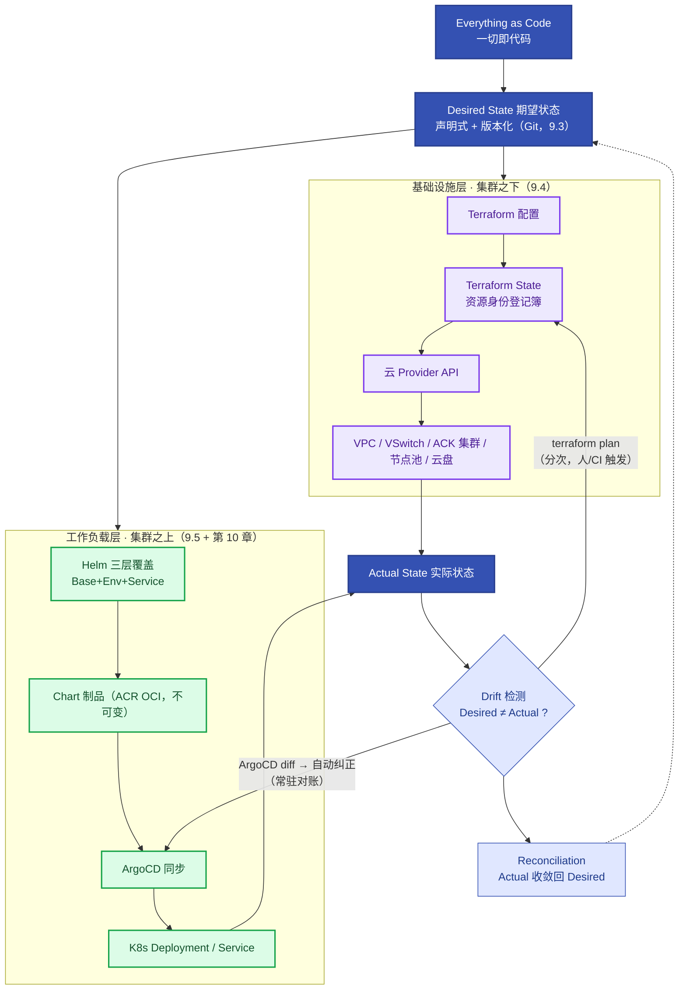

# 第9章 一切即代码：声明式治理全域架构
<!-- 第三篇 声明式交付体系 ｜ 知识型工程章节（V1.2 重构试点） ｜ 状态：终审中 -->

> 本章定位：第三篇开篇，**用知识递进的方式建立"声明式系统"的完整心智模型**——先讲清 Drift 为什么必然发生（9.1）、声明式的本质是什么（9.2）、Git 为什么能当真相源（9.3），再进入两大工程载体：Terraform 管集群之下（9.4）、Helm 管集群之上（9.5），最后合成全域知识地图与双层 Drift 治理（9.6）。
>
> **分层边界一句话**：**集群之下 Terraform、集群之上 GitOps**——ACK/EKS 集群、节点池、VSwitch、云盘等云资源用 Terraform 声明（alicloud provider 主参考、AWS 对照，9.4）；集群内工作负载用 Helm 标准化打包（9.5），由 ArgoCD 同步（第 10 章）。为什么这样分，是 9.4 要推导的核心知识，不是规定。
> **主线定位**：本章为定义 Desired State——L1/L2 全部控制循环的期望状态从此而来（目标源）（三层自治总览见 1.5，理论核心为第 5/16/18 章）。

> **技术栈锁死**：本章涉及组件 = Terraform（alicloud provider，声明集群之下的云资源）+ Helm（集群之上工作负载的标准化打包）。不引入同类替代（Kustomize 等价思想，原理与工具无关，详见 CONVENTIONS 三）。
> **术语澄清（易混点）**：经典 **IaC（Infrastructure as Code）= Terraform/Pulumi，管的是云基础设施**（VPC/集群/节点池）；**配置即代码 = Helm chart + values，管的是 K8s 清单**（工作负载/服务/ConfigMap）。两者共享"声明式 + Git 真相源 + 可复现"的*思想*，但对象与分层不同——**Helm 不是 IaC，Terraform 也不进集群管 Pod**（为什么，见 9.4 生命周期边界）。
> **边界声明**：Terraform 本章只展开"集群之下云资源声明"的生产深度（集群/节点池/VSwitch/远端状态/存量收编），模块工程与 CI 底层机制归 V2；集群内同步的 ArgoCD Application YAML 归第 10 章，本章不重复。**2↔9 分工**：第 2 章管"制品不可变"（拿什么运行），本章管"状态声明式"（系统该运行成什么样）。

---

## 9.1 配置为什么一定会散：多修改入口、多事实来源与 Drift 的必然性

### 生产问题

凌晨两点，生产网关副本数异常，值班的第一反应是问群里："现在这个状态是谁改的？"——没人答得上来。配置散落在镜像默认值、Helm values、ConfigMap、CI 变量、Wiki、启动脚本、某台机器的本地文件；再往下，集群本身（节点池/VSwitch/云盘）还是控制台手工点出来的。**"现在线上到底是什么状态"成了无人能完整回答的问题**。

### 传统方案失效原因

- 配置多处存放、变更路径多（改镜像/values/CM/脚本皆可）：路径多则失控（定论，不再展开）。
- 环境靠人对齐、变更不留版本：漂移与不可追溯是必然结果，不是概率问题。

失效根因：**系统存在多个"修改入口"，同一个资源就有多个"事实来源"**——这是结构性缺陷，靠流程自觉无法弥补。

### 架构约束与权衡

把失效过程拆成一条可推导的因果链（这一段是本章的知识地基）：

```text
系统存在多个修改入口（控制台 / kubectl / Helm / CI / 脚本）
        ↓
同一个资源存在多个"事实来源"（Git 说一套、集群说一套、Wiki 说一套）
        ↓
A 修改了资源，B 不知道（变更不广播）
        ↓
声明（Git）与实际（线上）发生分叉
        ↓
Drift（漂移）：Desired State ≠ Actual State
        ↓
三件事同时失效：
  · 审计失效——"这个状态是谁改的？"无法回答
  · 回滚失效——不知道回滚到哪（没有已知的"上一个好状态"）
  · 复现失效——无法重建同等环境（好状态从未被完整记录）
        ↓
所以需要的不是"更严格的变更审批"，而是：
  唯一声明源（Desired State 只写在一处）
  + 唯一变更入口（所有修改收敛到一条路径）
  + 可计算的期望状态（机器能 diff）
  + 可观测的实际状态（线上真实是什么）
  + 调谐机制（Actual 持续收敛到 Desired）
```

由此给出全章第一个正式定义——**Drift（漂移）：期望状态与实际状态的不一致**。它分两类，分别由不同层的工具检测（9.6 统一治理）：

| 类型 | 含义 | 检测工具 |
|---|---|---|
| **Terraform Drift** | Terraform 配置 ≠ 云上真实资源 | `terraform plan`（9.4） |
| **GitOps Drift** | Git 声明 ≠ 集群内实际清单 | ArgoCD diff（第 10 章） |

权衡的核心：**Drift 不是"纪律问题"而是"结构问题"**——只要多入口存在，漂移就是概率 1 的事件；治理 Drift 的唯一解是结构性地消灭多入口，而不是事后比对补救。

### 最小可行方案

1. **确立唯一声明源**：云资源归 infra 仓库（Terraform），集群内归 chart 仓库群（Helm），每域一个真相源。
2. **收敛修改入口**：控制台只读、kubectl 应急白名单（13.3）、生产变更只走 Git MR。
3. **先体检**：扫出游离于声明式管理之外的资源，得到改造基线。

### 生产落地实现

声明式化的第一步是**体检：扫出游离于声明式管理之外的资源**：

```bash
# ① 集群内：列出不受 Helm 管理的 Deployment（无 release 注解 = 手工 apply 的游离负载）
kubectl get deploy -A -o json | jq -r '.items[] \
  | select(.metadata.annotations["meta.helm.sh/release-name"] == null) \
  | "\(.metadata.namespace)/\(.metadata.name)"'

# ② 云资源：生产集群是否已被 Terraform 纳管（输出 0 = 集群是控制台手工建的）
terraform state list | grep -c alicloud_cs_kubernetes
```

- 体检基线与目标数字：**游离 Deployment = 0 个、生产集群 100% 在 Terraform state 内**；存量资源收编走 `terraform import`（9.4 ③）。
- 云服务映射：体检对象落在 ACK/EKS 集群与 ECS 节点池；控制台只读通过 RAM/IAM 权限收敛实现（附录 A），而非口头约定。
- 一个最小的 Drift 现场还原：`kubectl edit deployment order-api` 把副本从 3 改成 5——Git 里 `replicas: 3`，集群里 `replicas: 5`，Desired ≠ Actual 即刻成立。若 ArgoCD 开着 auto-sync，下一次对账会把它改回 3（这既是治理、也是"手改无效"的由来，10.5 详述）；若没开，Drift 静默存在直到某次故障复盘才被发现。

### 典型故障案例

某参数在生产生效但没人知道来源，排查两天发现是某次应急手改的 ConfigMap，未记录。配置全面进 Git + 禁止手改 CM 后，任何参数的来源都可从 Git 追溯。

点评：**配置不可追溯 = 故障不可诊断**。追查两天的成本，就是多年放任多入口累积的"Drift 利息"。

### 根因定位

根因不在某次手改，而在**系统结构性存在多个事实来源**——多入口必然产生 Drift，Drift 必然摧毁审计、回滚、复现三能力。

### 长效治理方案

- 每域唯一真相源 + 唯一变更入口，作为团队第一结构规则。
- 游离资源体检纳入周巡检（第 14 章）：游离 Deployment 与不在 state 内的集群清零。
- 禁止手改 ConfigMap / 控制台手改云资源，例外走应急白名单 + 事后回写（13.3）。

### 自动化/自治闭环

本节为 L1 机械自治的"期望状态来源"环节：唯一声明源让期望状态精确、版本化、可复现，第 5 章的调谐循环才有可靠目标——留一个手工域，就是自治的一个盲区。

### 生产检查清单

- [ ] 是否理解 Drift 是多入口的结构性必然（而非纪律问题）？
- [ ] 每个资源域是否都有唯一声明源与唯一变更入口？
- [ ] 游离 Deployment 体检是否清零？
- [ ] 生产集群是否 100% 在 Terraform state 内？
- [ ] 手工入口是否已收敛（控制台只读、kubectl 白名单）？

---

## 9.2 声明式的本质：期望状态、实际状态与调谐闭环

### 生产问题

"声明式优于命令式"是全行业定论，但多数人只背了结论。问三个穿透性问题就会露馅：声明式到底声明了什么？系统靠什么把声明变成现实？为什么声明式天然可重放、命令式不行？**答不出这三问，后面 Terraform/Helm/GitOps 的所有结论都只是背诵**。

### 传统方案失效原因

- 命令式运维：每一步是一个动作（scale/restart/edit），动作执行完就消失，不留"应该是什么"的记录。
- 动作序列不可重放：环境重置后无法从零复现（没人记得过去执行过哪 47 条命令）。
- 失效根因：**系统从未拥有过"期望状态"这个东西**——只有一串发生过的事实。

### 架构约束与权衡

**① 命令式 vs 声明式：动作与状态的本质区别**：

```bash
# 命令式：告诉系统"现在执行一个动作"
kubectl scale deployment order-api --replicas=5
# 动作执行完即消失——系统不知道"你想要 5 个"，只知道"发生过一次 scale"
```

```yaml
# 声明式：告诉系统"最终应该是什么状态"
replicas: 5
# 期望状态被持久记录——任何时候都能回答"系统应该长什么样"
```

**② 声明式靠什么兑现：调谐闭环（Reconciliation）**：

```text
Desired State（期望状态，来自声明）
      ↓
Controller 持续观察 Actual State（实际状态）
      ↓
Diff：期望与实际的差值
      ↓
Reconcile：执行动作消除差值（创建/删除/修正）
      ↓
Actual State → Desired State
      ↺ （循环往复，永不停歇）
```

这就是第 5 章讲透的 K8s 调谐闭环——本章从工程视角补上它在"一切即代码"里的位置：**声明只是写下了 Desired，真正让声明值钱的是背后持续运行的调谐器**。没有调谐器的"声明式"只是一份没人执行的文档。

**③ 一个关键推论——可重放性**：调谐是 level-triggered（看当前状态）而非 edge-triggered（看事件）——无论从什么乱七八糟的初始状态出发，只要 Desired 不变，系统最终收敛到同一个结果。**这就是声明式可复现的原理根源**：重放一份声明，得到同一个系统；命令式重放一串动作，得到一团未知。

**④ 两种调谐形态（为 9.4 的分层边界埋下伏笔）**：

| | K8s Controller | Terraform |
|---|---|---|
| 调谐方式 | 持续循环：observe→compare→reconcile→observe→…（内置、常驻） | 分次执行：plan→apply→结束（由人/CI 决定何时再跑） |
| 驱动者 | 系统自己 | 外部触发 |
| 适用对象 | 高频变化的运行时状态（Pod/副本/探针） | 低频高危的基础设施（VPC/集群/节点池） |
| 详见 | 第 5 章 | 9.4 |

权衡的核心：**声明式的本质 = 持久化期望状态 + 一个让实际状态收敛到它的机制**；两种形态（常驻调谐 vs 分次编排）没有高下，只有对象适配——这个适配问题正是 9.4 要推导的"Terraform 为什么不该管 Pod"。

### 最小可行方案

1. **接受一个统一心智模型**：Desired State →（调谐）→ Actual State，全书所有工具都是这个模型的实例化。
2. **用实验建立直觉**：在集群上亲手观察一次"声明→收敛"。
3. **区分两种调谐形态**：常驻调谐（K8s）与分次编排（Terraform），记住各自的适配对象。

### 生产落地实现

最小验证实验（任何 ACK/EKS 集群 3 分钟，细节见 5.2）：

```bash
kubectl apply -f - <<EOF
apiVersion: apps/v1
kind: Deployment
metadata: { name: demo-api, namespace: default }
spec:
  replicas: 3                      # 声明期望：3 个副本
  selector: { matchLabels: { app: demo-api } }
  template:
    metadata: { labels: { app: demo-api } }
    spec: { containers: [{ name: api, image: registry.example.com/demo/api:1.0 }] }
EOF

kubectl get deploy demo-api -w     # 观察 0/3 → 3/3：Controller 在消除 Diff
kubectl delete pod -l app=demo-api # 随便杀一个 Pod
# 再次观察：Actual 掉到 2，Controller 检测到 Diff，重建回 3——这就是声明在"兑现自己"
```

- 期望状态的载体：集群内是 Helm 渲染出的清单（9.5），集群之下是 Terraform HCL（9.4）。
- 云服务映射：本实验跑在 ACK/EKS 上，调谐器由云厂商托管的控制面运行（4.2 职责分层）——你不运维 Controller，但必须理解它在替你调谐。

### 典型故障案例

某团队把声明式当"一次性初始化脚本"用：apply 完就不管，集群内被手工改得面目全非，声明与实际早已无关。一次灾难恢复想"按声明重建"，才发现声明从未被维护——**没有持续对账的声明式只是摆设**。引入 ArgoCD 持续对账（第 10 章）后，声明才真正成为"活着的期望状态"。

点评：**声明 + 调谐缺一不可**——只声明不调谐是文档，只调谐无声明是黑盒。

### 根因定位

问题的真正发源地是对声明式的理解只停在"写 YAML 而不是敲命令"——**没理解 Desired/Actual 分离与调谐闭环，就永远无法理解 Drift 检测、GitOps 对账、Terraform plan 这些机制的共同本质**。

### 长效治理方案

- "Desired → 调谐 → Actual"作为团队通用语言：所有配置类工具的讨论都用这三词对齐。
- 任何引入的管控工具先问：它的 Desired 是什么？谁在调谐？Drift 怎么检测？
- 两种调谐形态（常驻/分次）的对象适配原则进架构评审 checklist。

### 自动化/自治闭环

本节是 L1 机械自治的理论入口：第 5 章的闭环是"系统内建的自愈"，本章后续是把同一个模型推广到全域——云资源（Terraform）与集群负载（Helm+ArgoCD）都纳入"声明 + 调谐"的统一范式。

### 生产检查清单

- [ ] 团队能说清命令式与声明的本质区别（动作 vs 状态）？
- [ ] 能画出 Desired→Diff→Reconcile 闭环并指出 K8s 里谁在做？
- [ ] 理解 level-triggered 是可复现性的原理根源？
- [ ] 能区分常驻调谐（K8s）与分次编排（Terraform）及其适配对象？
- [ ] 引入任何管控工具时都会先问三问（Desired/谁调谐/怎么检测 Drift）？

---

## 9.3 Git 为什么能成为真相源：版本、评审、Diff、回滚与因果链

### 生产问题

"一切进 Git""Git 单一路径""唯一真相源"——这些话在全书反复出现。但如果读者只把它当团队规定，就永远不会真正执行它（规定可以被特殊情况打破，原理不能）。**Git 凭什么是真相源？这不是管理学的选择，是工程能力的选择**。

### 传统方案失效原因

- 配置变更走工单 + 控制台 + 群里喊话：变更完成后，"改了什么"只存在于人的记忆和聊天记录里。
- 想审计要翻工单系统，想回滚没人记得改前是什么，想 diff 两个环境的差异没有工具。
- 失效根因：**变更记录与变更本身是两个系统**——记录永远滞后且不完整。

### 架构约束与权衡

**① Git 提供的不是一个存放处，而是六种工程能力的合体**：

```text
Git = Version（任意历史版本可取）
    + History（谁、何时、为何改的，永久可查）
    + Review（变更先被人看见再生效，MR/PR）
    + Diff（任意两版本、两环境的差异可计算）
    + Rollback（revert 一个 commit = 精确撤销一次变更）
    + Audit（不可抵赖的变更日志）
```

**② 关键推论——Git 把"变更"变成"因果链上的一环"**。用一个真实节奏的例子（这是本节最重要的知识）：

```text
08:10  commit A 上线：replicas = 3
09:20  commit B 上线：replicas = 8
10:15  生产故障：网关资源争抢
10:20  git diff A..B          ← 30 秒锁定"两小时内的变更 = replicas 3→8"
10:25  git revert B           ← 精确撤销 B，系统回到 A 的已知好状态
```

于是配置、变更、部署、故障四者形成完整因果链：**配置 →（变更=commit）→ 部署 → 故障 ←（diff/revert）← Git**。故障可追溯（13.3 SOP 第一步"查最近变更"之所以成立）的前提，就是变更全部以 commit 形式存在。

**③ 反例：看起来合理，实际有毒的替代方案**——"用配置中心 + 工单系统管理变更，不强制进 Git"：

```text
工单系统记录"想改什么"（人写的，可能与实际不符）
        +
配置中心记录"现在是什么"（当前值，无历史因果）
        +
控制台操作不留痕（第三个入口）
        ↓
故障时：工单 ↔ 配置中心 ↔ 实际状态 三者对不上
        ↓
"变更与故障的因果链"彻底断裂
```

权衡的核心：**Git 真相源的价值不在"存了配置"，而在把 Version/History/Review/Diff/Rollback/Audit 六能力注入每一次变更**——任何替代方案都只能覆盖其中一两种能力。

### 最小可行方案

1. **变更单一 Git 路径**：所有环境变更经 MR 评审后同步 / apply，无第二条生产变更通道。
2. **两层评审强度分级**：集群之上（Helm values）变更多、生效快，轻量 MR；集群之下（Terraform）低频高危，plan 输出必读 + 评审制（9.4 ④）。
3. **故障先查 Git 时间线**：出故障对照提交历史定位可疑变更（13.3 SOP 固化）。
4. **应急例外有回写纪律**：白名单内先斩后奏，2 小时内回写 Git（13.3）——例外不破坏真相源。

### 生产落地实现

**① 赋能三维对照表**（声明式 + Git 真相源兑现的三个能力）：

| 维度 | 传统（工单+控制台） | 声明式 + Git |
|---|---|---|
| **变更可控** | 手工、多路径、易错 | 单一路径，MR 评审，原子提交 |
| **环境一致** | 逐环境手工，漂移 | 同一声明 + 差异文件（9.5 Overlay），基线统一 |
| **故障可追溯** | 无关联记录 | 变更即 commit，故障与变更可时间线关联 |

**② 故障排查的 Git 三连**（值班手册级制品）：

```bash
# ① 最近 24h 谁动了 prod 相关声明（时间线对齐故障发生时刻）
git log --since="24 hours ago" --oneline -- envs/prod/

# ② 两个版本间到底改了什么（锁定可疑变更）
git diff <正常时的commit>..<最新commit> -- envs/prod/

# ③ 精确撤销（回到已知好状态，比"再改一版"可靠）
git revert <可疑commit>    # MR 合入后 ArgoCD 自动同步回滚（第 10 章）
```

- 云服务映射：代码托管落在云效 Codeup / GitHub（对照 AWS CodeCommit 已限制新用户，GitHub 常用）；MR 评审 + 分支保护是平台能力，配置一次全员受约束。
- 数字：应急回写 ≤2h、MR 评审 ≤1 天、git diff 定位可疑变更 ≤30 秒——三个数字写进值班手册。

### 典型故障案例

某 prod 故障，团队对照 Git 提交时间线，发现 2 小时前一次 values 变更（调高副本数引发资源争抢），`git revert` 后故障消失，全程定位 < 30 分钟。同一团队在"工单时代"的同类故障平均排查 4 小时——差距全在"变更是否天然带因果链"。

点评：**Git commit 时间线是最强的故障追溯工具**——前提是所有变更都经 Git。

### 根因定位

先给结论：Git 之所以是真相源，不是因为它流行，而是**六能力合体让"变更即 commit、因果可计算"**——任何单能力替代品都会在某次故障里掉链子。

### 长效治理方案

- 变更单一路径 + 分级评审 + 应急回写纪律，三者配套（缺一即破）。
- 故障处置第一步固定为"查 Git 时间线"（13.3 SOP）。
- 环境同源 + 差异文件（tfvars / values），禁止逐环境手工对齐。

### 自动化/自治闭环

本节为 L1 机械自治的"期望状态收敛"环节：Git 单一路径让第 5 章调谐循环的输入可控、第 10 章同步与第 11 章灰度有明确操控对象——变更工程化是后续一切自动化的前提。

### 生产检查清单

- [ ] 团队理解 Git 真相源是六能力合体（而非"存配置的地方"）？
- [ ] 生产变更是否单一路径（MR → 同步/apply）？
- [ ] 评审是否按层分级（values 轻量 / Terraform plan 必读）？
- [ ] 故障排查是否先跑 Git 三连（log/diff/revert）？
- [ ] 应急白名单外无任何绕过 Git 的变更、白名单内 2h 回写？

---

## 9.4 Terraform 与集群之下的世界：State 三方模型、Plan 的本质与生命周期边界

### 生产问题

两个高频困惑：一是"state 文件到底是什么，凭什么说是命根"；二是"Terraform 为什么不能管 Pod"被当口号执行，说不清原理——于是总有人想在 Terraform 里 `helm_install` 一把梭，最后状态烂账。**不理解 State 与生命周期边界，Terraform 永远用不安全**。

### 传统方案失效原因

- 控制台手建集群：不可复现、不可审计（定论，不再展开）。
- 拿 Terraform 管一切（含 Pod/Helm release）：三个状态系统搅在一起，互相看不懂对方的变更。
- 失效根因：**没理解 Terraform 的工作原理是一个"三方比较"模型，也没区分基础设施与运行时是两种生命周期**。

### 架构约束与权衡

**① State 三方模型——Terraform 实际上在比较三个东西**：

```text
Configuration（main.tf）        State（tfstate）
   "我要什么"          ↔        "Terraform 认为现在是什么"
          ↘                       ↙
              Plan = Diff 计算
                    ↓
        Provider 读云 API："实际是什么"
                    ↓
   add / change / destroy 的最小动作集
```

`terraform plan` 的本质公式：**Plan = f(Configuration, State, Provider Read) → Diff**。State 就是"资源身份登记簿"——记录"这个 VPC/集群是我建的，它的云资源 ID 是 xxx"。由此可以推导出丢 State 为什么是灾难（比背一句"命根"有用得多）：

```text
State 丢失
   ↓
Terraform 不知道"这个集群是不是我创建的"（身份关系丢失）
   ↓
下次 plan：Configuration 里声明的集群，State 里查无此资源
   ↓
Plan 判定："集群不存在" → 输出 Create（甚至 Replace/Destroy）
   ↓
实际云上集群好好运行着——apply 会试图重建/销毁生产资源
```

**② 生命周期边界——Terraform 与 K8s Controller 管的是两种东西**：

```text
Terraform（基础设施生命周期编排）          K8s Controller（运行时持续调谐）
      ↓ Cloud API                                ↓ K8s API
 VPC / VSwitch / ACK / EKS / 节点池 / 云盘      Deployment → ReplicaSet → Pod
 核心问题："基础设施应该存在什么状态？"          核心问题："运行时应该维持什么状态？"
 执行模式：plan → apply → 结束                  执行模式：observe → compare → reconcile → 循环
 变更频率：低频、高危、分钟级生效               变更频率：持续、自动、秒级
```

**③ 反例：看起来合理，实际有毒——"Terraform 一把梭管到 Pod"**（`terraform → helm → kubernetes` 全链）：

```text
Terraform State + Helm Release State + K8s Live State 三个状态系统串联
   ↓
Terraform 不知道 Helm 为什么改了资源（Helm 的变更在 TF 视野外）
Helm 不知道 Terraform 为什么改了资源（TF 的变更在 Helm 视野外）
K8s Controller 还在持续 reconcile（把两者的变更又改回去/改过来）
   ↓
状态边界被污染：一次 diff 三方各说各话，谁也不敢 apply
   ↓
正确分层：Terraform --Cloud API--> 云基础设施
          Helm/GitOps --K8s API--> 集群内负载   （两层互不越界）
```

由此自然得出本章分层规则：**云 API 资源归 Terraform，进集群的清单归 Helm + ArgoCD**。一个边界裁决示例：Service 在 Helm 层声明，其注解触发的 SLB 由 CCM 自动创建——**SLB 不进 Terraform**（生命周期跟着 Service 走，4.2）；集群、节点池、VSwitch 则只在 Terraform。

**④ 核心技术六问速答**（本章工程知识收拢）：

| 问 | 答 |
|---|---|
| ①解决什么 | 云资源可复现、可审计、可版本化 |
| ②不用为什么失败 | 控制台手建 = 不可复现 + 漂移无从检测（9.1 因果链） |
| ③内部原理 | 三方比较：Configuration + State + Provider Read → Plan Diff |
| ④相邻边界 | 管基础设施生命周期，不进运行时（Pod 归 K8s 生态） |
| ⑤为什么这么选 | 低频高危变更适配"分次编排 + 人工评审"，与 K8s 常驻调谐互补 |
| ⑥生产怎么落 | 远端 State + import 收编 + plan 评审制（下文四制品） |

权衡的核心：**Terraform 是基础设施生命周期编排工具，K8s Controller 是持续运行的调谐系统**——认清两种生命周期的差异，边界自然清晰，"一把梭"的诱惑自然消失。

### 最小可行方案

1. **集群之下全声明**：集群/节点池/VSwitch/云盘只用 Terraform 建（禁控制台手建，存量 import 收编）。
2. **State 三原则**：远端（OSS/S3）、版本化、加密——State 是资源身份登记簿，丢=失明。
3. **变更走 plan 评审制**：plan 必读、apply 的必须是评审过的那份 plan。
4. **守住边界**：Terraform 不进集群管负载（那是 9.5 + 第 10 章的领地）。

### 生产落地实现

**① Terraform 最小可用 main.tf**（envs/prod/，alicloud provider 主参考；对照 AWS：`aws_eks_cluster` + `aws_eks_node_group` + 子网，等价映射）：

```hcl
provider "alicloud" {
  region = "cn-hangzhou"                 # 可调：资源所在地域
}

# 多 AZ：两个 VSwitch 是节点池跨可用区的前提（4.2）
resource "alicloud_vswitch" "zone_a" {
  vpc_id     = var.vpc_id                # 复用已有 VPC，经变量传入
  cidr_block = "10.10.0.0/20"            # 可调：按网段规划
  zone_id    = "cn-hangzhou-h"
}
resource "alicloud_vswitch" "zone_b" {
  vpc_id     = var.vpc_id
  cidr_block = "10.10.16.0/20"
  zone_id    = "cn-hangzhou-i"
}

resource "alicloud_cs_kubernetes" "prod" {
  name_prefix                  = "demo-prod-"
  cluster_spec                 = "ack.pro.small"     # 生产禁改：Pro 规格才有控制面 SLA（≈¥0.64/时，4.1）
  kubernetes_version           = "1.30.1-aliyun.1"   # 可调：必须在 ACK 支持矩阵内（4.4）
  worker_vswitch_ids           = [alicloud_vswitch.zone_a.id,
                                  alicloud_vswitch.zone_b.id]   # 多 AZ 节点分布
  new_nat_gateway              = true                # 生产禁改：集群出口
  service_cidr                 = "172.21.0.0/20"
  is_enterprise_security_group = true

  node_pools {                          # 块内字段以 alicloud provider 官方文档为准
    name                 = "general"
    instance_types       = ["ecs.u1.xlarge"]   # 可调：通用 4C16G
    desired_size         = 3                  # 可调：≥2 起，才配得上 PDB 滚动（4.4）
    min_size             = 2
    max_size             = 10                 # 可调：节点池弹性上限
    auto_scaling_enable  = true
    system_disk_size     = 120
    system_disk_category = "cloud_essd"       # 生产禁改：ESSD 才有性能保障
  }

  tags = {                               # 成本标签：FinOps 分账口径（14.3）
    team        = "platform"
    env         = "prod"
    cost-center = "cc-ops-01"            # 可调：按财务口径
  }
}
```

**② 远端状态 backend**（backend.tf）——State 是资源身份登记簿，必须远端 + 版本化：

```hcl
terraform {
  backend "oss" {
    bucket  = "demo-tfstate"       # 预先创建：开启版本控制 + 私有读写
    prefix  = "ack/prod"           # 每环境一个 prefix，状态隔离
    region  = "cn-hangzhou"
    encrypt = true                 # 生产禁改：state 内含敏感值（集群凭据等）
    acl     = "private"
  }
}
```

- state lock 一句：并发写保护由 OSS backend 的锁机制承担（新版支持配置 TableStore 表加锁，字段以官方文档为准）；对照 AWS：S3 backend（版本化 + 加密）+ DynamoDB 锁表，机制等价。
- 状态恢复：bucket 开版本化后，state 误删/写坏可从 OSS 历史版本找回——版本化买到的正是 9.3 的 Version 能力。

**③ 存量收编**（不重建，先纳管再治理）：

```bash
terraform import alicloud_cs_kubernetes.prod <cluster-id>
terraform plan    # import 后首次 plan 应接近 0 add/0 destroy；若出现大量 diff，
                  # 多为字段默认值与控制台实际值不一致——逐字段核对进 tfvars，不要急着 apply
```

**④ 变更纪律：plan 必读 → apply 评审制**：

```bash
terraform plan -out=tfplan    # plan 输出全文贴进 MR，如 "Plan: 2 to add, 1 to change, 0 to destroy"
terraform apply tfplan        # 评审通过后执行；apply 的必须就是评审过的那份 plan 文件
```

- `to destroy > 0`：双人评审 + 资源级备份先行（4.4），维护窗口执行。
- plan 与 apply 之间不允许他人改动（`-out` 产物一次性），杜绝"评审的是 A、执行的是 B"。

两层变更路径对照（谁在什么层怎么变更、多久生效）：

| 变更 | 层 | 路径 | 生效时延 |
|---|---|---|---|
| 扩节点池上限 | 集群之下 | infra-repo MR → plan 评审 → apply | 集群级变更 ≈15–25 分钟出 Ready |
| 换镜像/改副本 | 集群之上 | chart-root MR → ArgoCD 同步 | 秒–分钟级 |

云服务映射：本节制品落在 ACK Pro（控制面 ≈¥460/月）+ ECS 节点池（ecs.u1.xlarge，2–10 节点弹性）+ OSS（state）；对照 EKS（$0.10/时）+ 托管节点组 + S3/DynamoDB。数字：集群级重建从控制台手工"半天起步且不可复现"压缩到 **terraform apply ≈15–25 分钟（含节点池扩容，以实测为准）**，全流程可重放。

### 典型故障案例

某团队 state 损坏后强行 apply：Configuration 声明的集群在 State 里"不存在"，plan 输出一整页 Create/Replace——幸好 apply 前的 destroy 双人评审拦住了。从 OSS 历史版本找回 state 后，plan 恢复为 0 差异。事后该团队把"state 桶版本化 + 定期演练找回"写进基线。

点评：**State 事故的形态永远是"看起来要重建一切"**——看懂三方模型的人一眼识别，看不懂的人直接把生产 apply 没了。

### 根因定位

问题的真正发源地是**把 Terraform 当"建资源的脚本"而非"三方比较的状态系统"**——不理解 State 的身份登记职能与两种生命周期的边界，越界与事故都是时间问题。

### 长效治理方案

- State 三原则（远端/版本化/加密）+ 定期"找回演练"（半年一次）。
- plan 评审制 + destroy 双人评审 + `-out` 一次性产物。
- "云 API 归 Terraform、清单归 Helm"边界进架构评审 checklist，杜绝一把梭。
- 游离集群 import 收编清零（周巡检，第 14 章）。

### 自动化/自治闭环

本节为 L1 机械自治的"基础设施期望状态"环节：Terraform 让集群本身的 Desired 可版本化——第 5 章的调谐闭环跑在"被声明的底座"上，而不是跑在"某人某天点出来的底座"上。同时 `terraform plan` 的定期执行就是云资源层的 Drift 检测（9.6 统一）。

### 生产检查清单

- [ ] 理解 Plan = Configuration + State + Provider Read → Diff 的三方模型？
- [ ] 能推导丢 State 为什么导致"试图重建一切"？
- [ ] State 是否远端 OSS/S3 + 版本化 + 加密，且做过找回演练？
- [ ] 存量集群是否已 import 收编（plan 无大 diff）？
- [ ] Terraform 变更是否执行 plan 必读 + destroy 双人评审？
- [ ] 是否守住"云 API 归 Terraform、清单归 Helm"边界（无一把梭）？

---

## 9.5 Helm 与集群之上的标准化：Base / Environment / Service 三层覆盖模型

### 生产问题

200 个服务写了 200 套 Helm chart：探针、资源、网络策略、监控配置每份重写一遍。更隐蔽的问题是**环境差异的管理方式**：多数团队靠"每个环境复制一份 values 再各自修改"，一次安全补丁要在四份文件里各打一遍，漏掉一份就是环境漂移。**读者需要的是覆盖模型的心智，而不只是三仓库目录**。

### 传统方案失效原因

- 每服务独立 chart、无公共沉淀：重复造轮子，公共实践各写各的。
- 环境配置靠复制粘贴：改一处漏三处，漂移从这里发生。
- 失效根因：**没有建立"默认值 + 差异覆盖"的分层代数**——把所有配置当成平铺的个体管理。

### 架构约束与权衡

**① 三仓库是抽象的物理载体，抽象本身是三层覆盖模型**：

```text
Base（基础 chart）      → 定义组织标准（探针/资源/PDB/网络策略的默认值）
        ↓ 被继承
Environment（chart-root 的 values-{env}.yaml） → 定义环境差异（只有偏离默认的部分）
        ↓ 被覆写
Service（业务 chart 的 values.yaml）           → 定义业务差异（只有业务独有的部分）

最终配置 = Base Defaults + Environment Overlay + Service Override
```

**② 用一个具体数字例把覆盖代数走一遍**：

```text
Base（平台组定的组织标准）
  replicas = 2, resources = 250m/512Mi, probes = enabled, networkPolicy = enabled
        +
Environment: Production（环境只写偏离项）
  replicas = 4
        +
Service: Order API（业务只写业务项）
  image = order-api:1.8.3, port = 8080
        ↓ 合并
最终配置：
  order-api: replicas=4, resources=250m/512Mi, probes=enabled,
             networkPolicy=enabled, image=order-api:1.8.3, port=8080
```

**③ 为什么 Overlay 治环境漂移**（这是本节的知识内核）：环境差异从"每环境一份全量配置"收敛为"每环境一个 diff 文件"——

- 未写进 overlay 的项自动继承 Base：**Base 升级（如补丁探针参数）对所有环境同时生效**，不存在"漏改某个环境"；
- 环境之间的差异变得**显式且可计算**（`diff values-prod.yaml values-staging.yaml` 即环境差异全貌）；
- 新增环境 = 新增一个 overlay 文件，而非复制维护一整套配置。

**④ 核心技术六问速答**：

| 问 | 答 |
|---|---|
| ①解决什么 | 集群内清单的标准化打包与多环境复用 |
| ②不用为什么失败 | 200 套 chart 各自为政，公共变更 N 次落地、环境靠复制对齐必漂移 |
| ③内部原理 | 模板（Go template）+ values 按三层优先级合并成最终清单 |
| ④相邻边界 | 管集群内配置（不是 IaC）；同步节奏归 ArgoCD（第 10 章） |
| ⑤为什么这么选 | 继承+覆盖把"组织标准/环境差异/业务差异"三个变化方向解耦 |
| ⑥生产怎么落 | 三仓库 + 版本不可变 + 校验三连（下文制品） |

权衡的核心：**三层模型把三个变化方向（组织标准演进、环境差异、业务演进）解耦到三个文件层**——任何一个方向的变化都不需要碰另外两个方向的文件。

### 最小可行方案

1. **建基础 chart**：公共最佳实践唯一沉淀处（探针/资源/PDB/网络策略模板）。
2. **业务薄壳化**：业务 chart dependencies 引基础 chart，只写业务覆写。
3. **环境差异 overlay 化**：chart-root 每环境一个 values 文件，只写偏离项。
4. **版本纪律 + 校验三连**：chart 版本不可变；lint/template/diff 过了才准入。

### 生产落地实现

**① 三仓库完整目录树**：

```text
base-chart/                       # 基础 chart（base-chart 仓库）：公共最佳实践唯一沉淀处
├── Chart.yaml                    # version: 2.4.1（模板变更必升版，见③）
├── values.yaml                   # 第一层：全局默认值（见②）
└── templates/
    ├── deployment.yaml           # 探针/资源/反亲和/优雅退出
    ├── service.yaml
    ├── hpa.yaml
    ├── pdb.yaml                  # minAvailable: 2（4.4 节点滚动保护）
    ├── networkpolicy.yaml        # 默认 enabled: true（附录 A）
    └── _helpers.tpl

service-chart/                    # 业务 chart（service-chart 仓库）：只覆写，不写模板
├── Chart.yaml                    # dependencies 引 base（见③）
└── values.yaml                   # 第三层：业务覆写（见②）

chart-root/                       # chart-root（编排仓库）：环境编排
├── Chart.yaml                    # dependencies 汇总所有业务 chart
├── values-dev.yaml               # 第二层：环境 overlay（见②）
├── values-staging.yaml
└── values-prod.yaml
```

**② values 三层分层**（与上文覆盖代数一一对应的真实片段）：

```yaml
# 第一层：base-chart/values.yaml —— 平台组定的生产级默认值
replicaCount: 2                            # 单副本无法滚动，默认 2
image:
  repository: ""                           # 业务必填
  tag: ""
  pullPolicy: IfNotPresent
resources:
  requests: { cpu: 250m, memory: 512Mi }   # 可调：7 章按实测校准
  limits:   { cpu: "1",   memory: 1Gi }
probes:
  liveness:  { path: /healthz, initialDelaySeconds: 10 }
  readiness: { path: /readyz,  initialDelaySeconds: 5 }
networkPolicy: { enabled: true }           # 生产禁改：默认拒绝横向流量（附录 A）
pdb: { enabled: false, minAvailable: 2 }   # 环境层按需开启
```

```yaml
# 第二层：chart-root/values-prod.yaml —— 环境 overlay（依赖链前缀：业务 chart → base）
order-api:
  base:
    replicaCount: 4                         # 可调：按压测容量定
    resources:
      requests: { cpu: 500m, memory: 1Gi }  # 生产上调默认资源
    pdb: { enabled: true, minAvailable: 2 } # 生产禁改：节点滚动保护（4.4）
    hpa: { enabled: true, minReplicas: 4, maxReplicas: 12 }
payment-api:
  base: { replicaCount: 6 }
```

```yaml
# 第三层：service-chart（order-api）/values.yaml —— 业务覆写（业务组唯一要写的）
base:                                       # 直接覆写基础 chart 默认值
  image:
    repository: registry.cn-hangzhou.aliyuncs.com/demo/order-api   # ACR
    tag: "1.8.3"                            # 与 appVersion 对齐（见③）
  service: { port: 8080 }
  env:
    LOG_LEVEL: info                         # 可调：debug 仅排障临时开
```

**③ Chart.yaml 版本语义与版本纪律**（业务 chart 为例）：

```yaml
apiVersion: v2
name: order-api
description: 订单服务（薄壳：模板全在基础 chart）
type: application
version: 1.8.3            # chart 版本（SemVer）：模板/覆写变更必升版
appVersion: "1.8.3"       # 应用版本：默认镜像 tag，跟应用发布走
dependencies:
  - name: base             # 基础 chart
    version: "2.4.1"       # 锁定基础 chart 版本，升级走 MR 评审
    repository: "oci://registry.cn-hangzhou.aliyuncs.com/demo-charts"   # ACR OCI
```

- 语义区别：`version` 是 chart 包自身版本（改默认值也要升），`appVersion` 是应用版本（镜像 tag）。只换镜像时两者都动——否则同一 chart 版本对应多个 appVersion，不可复现。
- **版本纪律：同一 version 的 chart 包发布后不可变（禁止覆盖推送）**；基础 chart 发包：`helm package base-chart && helm push base-chart-2.4.1.tgz oci://registry.cn-hangzhou.aliyuncs.com/demo-charts`（对照 ECR 同为 OCI）。
- 基础 chart 升级 = 各业务改 `dependencies.version` 提 MR——可评审、可分批灰度、可回退。

**④ 本地校验三连**（CI 卡点同款）：

```bash
helm plugin install https://github.com/databus23/helm-diff   # 一次性安装 helm-diff 插件
helm lint base-chart/ service-chart/                         # ① 语法与规范检查
helm template order-api chart-root/ -f chart-root/values-prod.yaml > /dev/null \
  && echo render-ok                                           # ② 渲染自检：能出清单
helm diff upgrade order-api chart-root/ -f chart-root/values-prod.yaml -n prod \
                                                               # ③ 变更预览：与线上 release 逐行 diff，必贴 MR
```

**⑤ 业务接入最小示例**（业务方在 chart-root 提交的全部内容，≤10 行）：

```yaml
# 接入新服务 = chart-root 加一个条目 + 一个 MR（同步与灰度由第 10/11 章接手）
order-api:
  enabled: true                     # 条件开关：需在 chart-root 的 dependencies.condition 声明
  base:
    image: { tag: "1.8.3" }         # 日常发布 = 只改 tag，走 MR
    env: { LOG_LEVEL: info }
```

**⑥ 环境差异显式化**（覆盖模型的直接红利）：

```bash
diff chart-root/values-prod.yaml chart-root/values-staging.yaml
# 输出即"两个环境的全部差异"——评审环境差异从翻配置变成读一个 diff
```

云服务映射：chart 包分发落 ACR（OCI 制品，对照 ECR）；镜像同在 ACR。数字：200 套 chart → **1 个基础 chart + 6 个模板**；公共变更从"改 200 处、约 5 人日"到"基础 chart 升 1 个版本 + MR 评审、半天内完成"。

### 典型故障案例

某次安全整改要求所有服务统一加网络策略（附录 A）。"每服务独立 chart"时代要改几百个 chart、耗时一周；三层模型下改基础 chart 一处（NetworkPolicy 默认 enabled: true）+ 各业务分批升 dependencies.version，半天完成且可逐批验证——**因为四个环境没写 networkPolicy 覆盖项，全部自动继承新默认值，零漏改**。

点评：**Overlay 的价值在"没写的就是继承的"**——公共变更一次落地、环境漂移无处发生。

### 根因定位

拆到底，是**缺"默认值 + 差异覆盖"的分层代数**——配置被当成平铺个体管理时，重复、不一致、漏改都是结构必然。

### 长效治理方案

- 三仓库职责表进团队规范：基础 chart 平台组独占写权限，业务组只写 values。
- chart 版本不可变纪律 + ACR OCI 留历史，回滚即指回旧版本。
- 校验三连做成 CI 卡点（lint/template/diff 不过不准合）。
- 环境差异评审 = 评审 overlay diff（⑥ 制品化）。

### 自动化/自治闭环

本节为 L1 的"标准化期望状态"环节：GitOps（第 10 章）同步的对象是标准化的 Helm release——没有三层模型，ArgoCD 同步的只是一堆参差不齐的部署物，治理无从谈起。

### 生产检查清单

- [ ] 理解最终配置 = Base + Environment Overlay + Service Override 的覆盖代数？
- [ ] 三仓库职责与写权限是否收口（平台写 Base、业务只写 values）？
- [ ] 环境差异是否全部显式化为 overlay（未写项 = 继承默认）？
- [ ] version / appVersion 语义是否被正确使用（换镜像也升 chart 版本）？
- [ ] 同一 chart 版本是否不可变（无覆盖推送）？
- [ ] 校验三连（lint/template/diff）是否 CI 卡点化？

---

## 9.6 全域统一：双层 Drift 检测、调谐分工与"一切即代码"的完整定义

### 生产问题

学完 Terraform 与 Helm，读者手里有了两套工具，但缺一张总图：它们和 Git、云、集群怎么拼成一个系统？Drift 在哪两层发生、谁来检测、谁来纠正？**拼不出总图，知识就还是散的**。

### 传统方案失效原因

- 每层工具各学各的：说不清 Terraform 和 ArgoCD 是什么关系、分工在哪。
- Drift 治理只做了集群内（或只做了云资源）：另一层静默漂移。
- 失效根因：**没有把全域理解成"同一个声明式模型的两层实例化"**。

### 架构约束与权衡

**① 全域知识地图**（本章终图，把 9.1–9.5 全部知识挂上来）：



读图三问：期望状态在哪？（Git，两层共用）谁在调谐？（Terraform 分次编排 / ArgoCD 常驻对账，两种形态 9.2）Drift 谁检测？（下表）。

**② 双层 Drift 检测与纠正分工**：

| | 云资源层（Terraform Drift） | 集群内层（GitOps Drift） |
|---|---|---|
| 比较双方 | Configuration + State ↔ 云 API 实际 | Git 中的 chart/values ↔ 集群内实际清单 |
| 检测方式 | `terraform plan`（CI 定期跑，非破坏性） | ArgoCD 常驻对账（OutOfSync 状态，10.5） |
| 纠正方式 | 人审后 `apply`（高危层不自动纠正） | auto-sync 自动纠正 / 手动 sync |
| 典型来源 | 控制台手改云资源、Console 临时扩容 | kubectl edit、应急手改未回写 |

**③ 本章的完整定义（全章知识收拢成一句）**：

> **一切即代码，不是"把 YAML 放进 Git"，而是把系统的 Desired State 变成可版本化、可审计、可计算、可复现的状态，并通过不同层级的控制器（Terraform 的分次编排、ArgoCD 的常驻对账、K8s 的内置调谐），持续让 Actual State 收敛到 Desired State。**

**④ 声明式覆盖域总表**（该定义在全域的落点，各域细节指向对应章）：

| 声明域 | 声明式载体 | 真相源 | 承接 |
|---|---|---|---|
| **云资源**（集群/节点池/VSwitch/云盘——集群之下） | Terraform HCL（alicloud 主参考、AWS 对照） | infra 仓库（state 入 OSS/S3） | 本章 9.4 |
| **集群内负载**（工作负载/服务/配置——集群之上） | Helm：基础 chart + 业务 chart + chart-root | chart 仓库群 | 本章 9.5；同步归第 10 章 |
| **观测规则**（指标/Recording/告警规则） | vmalert 规则 YAML 入 Git | observability 仓库 | 第 12 章 |
| **告警路由**（分级/收敛/静默） | Alertmanager 配置入 Git | observability 仓库 | 第 13 章 |
| **发布策略**（灰度/金丝雀/回退） | Argo Rollouts YAML | chart-root | 第 11 章 |

权衡的核心：**全域 = 同一个声明式模型、两段调谐形态、五处落点**——分层不是增加复杂度，而是让每层工具用在生命周期匹配的地方（9.4 推导）。

### 最小可行方案

1. **两张图进团队共识**：知识地图（上图）+ 覆盖域总表——新人第一课。
2. **双层 Drift 巡检常开**：`terraform plan` 定期跑（CI 周任务）+ ArgoCD 常驻对账 + OutOfSync 告警接 13.1。
3. **两个真相源仓库就位**（全域声明的物理形态）：

```text
infra-repo/                      # 集群之下：Terraform
├── envs/
│   ├── prod/                    # 每环境一个目录，backend prefix 隔离（9.4 ②）
│   │   ├── main.tf              # 集群与节点池声明（9.4 ①）
│   │   ├── backend.tf           # OSS 远端状态（9.4 ②）
│   │   └── terraform.tfvars     # 环境差异值
│   └── staging/
└── modules/                     # 集群模块沉淀（跨环境复用）

chart-root/                      # 集群之上：Helm 编排（9.5 ①，ArgoCD 挂载点）
├── Chart.yaml                   # dependencies 汇总所有业务 chart
├── values-dev.yaml              # 环境差异文件
├── values-staging.yaml
└── values-prod.yaml
```

### 生产落地实现

**双层 Drift 巡检的最小落地**：

```bash
# 云资源层：CI 周任务跑 plan，任何输出 = 存在 Terraform Drift（非破坏性，只检测）
terraform plan -detailed-exitcode; echo "exit=$?"
# exit=0 无漂移；exit=2 有漂移（触发告警，人工评审后 apply）；exit=1 错误
```

- 集群内层：ArgoCD 对账周期内自动 diff，OutOfSync 持续超阈值 → 告警接 13.1 通道（10.9 诊断状态机）。
- 云服务映射：CI 周任务跑在云效/GitHub Actions；state 桶 OSS 版本化兜底误操作；ArgoCD on ACK。
- 数字：云层巡检 ≥1 次/周（低频层）、集群层对账默认分钟级（10 章）；Drift 从发生到发现的窗口：云层 ≤7 天、集群层 ≤3 分钟。

### 典型故障案例

同一个手改事件的双层对照：运维 A 在控制台把节点池 max_size 从 10 改到 20（云层 Drift）——下次 `terraform plan` 输出 `~ max_size: 20 → 10`，评审确认意图后把 20 写回 Configuration；另一人 `kubectl edit` 改副本（集群层 Drift）——ArgoCD 3 分钟内标 OutOfSync 并纠正回 3。**两层 Drift 各自被对应层的机制捕获，谁也逃不过**——这就是"全域声明式"的实际含义。

点评：**Drift 治理不是一门工具的事，是每层配一套"检测 + 纠正"**。

### 根因定位

问题的真正发源地是把工具当孤岛学习——**全域是同一个声明式模型的两层实例化**，理解了模型，每个工具的位置与边界不言自明。

### 长效治理方案

- 知识地图 + 覆盖域总表进新人第一课与架构评审 checklist。
- 双层 Drift 巡检常开：terraform plan 周任务 + ArgoCD 常驻对账，告警接 13.1。
- 新增任何管控对象先问归哪域（表④），不允许出现"第六种管法"。
- 游离资源体检（9.1）与 Drift 巡检合并进第 14 章技术债周巡检。

### 自动化/自治闭环

本节是 L1 机械自治的全域收拢：云资源、集群负载、观测、告警、发布五域全部纳入"声明 + 调谐"模型后，三层自治（L1/L2/L3）才拥有完整的操控面与观测面——**留一个手工域，就是自治的一个盲区**（第 16 章运维自治在此地基上展开）。

### 生产检查清单

- [ ] 团队能对照知识地图说清：Desired 在哪、两层各谁调谐、Drift 谁检测？
- [ ] `terraform plan -detailed-exitcode` 周任务是否常开（exit=2 告警）？
- [ ] ArgoCD 常驻对账 + OutOfSync 告警是否接通 13.1？
- [ ] 两个真相源仓库（infra-repo / chart-root）结构是否就位？
- [ ] 新增管控对象是否都按覆盖域总表归域（无第六种管法）？
- [ ] 团队是否接受并会复述本章的"一切即代码"完整定义？
