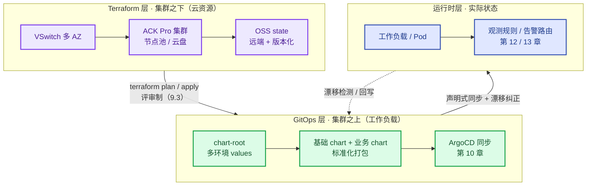

# 第9章 一切即代码：声明式治理全域架构
<!-- 第三篇 声明式交付体系 ｜ 常规章（定思想、定基础） ｜ 状态：终审中 -->

> 本章定位：第三篇开篇，定思想、定分层。确立全书声明式分层边界——**集群之下 Terraform、集群之上 GitOps**：ACK/EKS 集群、节点池、VSwitch、云盘等云资源用 Terraform 声明（alicloud provider 主参考、AWS 对照，9.3）；集群内工作负载用 Helm 标准化打包（9.4），由 ArgoCD 同步（第 10 章）。为第 10 章 GitOps 落地与第 11 章灰度治理铺底。

> **技术栈锁死**：本章涉及组件 = Terraform（alicloud provider，声明集群之下的云资源）+ Helm（集群之上工作负载的标准化打包）。不引入同类替代（Kustomize 等价思想，原理与工具无关，详见 CONVENTIONS 三）。
> **术语澄清（易混点）**：经典 **IaC（Infrastructure as Code）= Terraform/Pulumi，管的是云基础设施**（VPC/集群/节点池）；**配置即代码 = Helm chart + values，管的是 K8s 清单**（工作负载/服务/ConfigMap）。两者共享"声明式 + Git 真相源 + 可复现"的*思想*，但对象与分层不同，不能混为一谈——**Helm 不是 IaC，Terraform 也不进集群管 Pod**。
> **边界声明**：Terraform 本章只展开"集群之下云资源声明"的生产深度（集群/节点池/VSwitch/远端状态/存量收编），模块工程与 CI 底层机制归 V2；集群内同步的 ArgoCD Application YAML 归第 10 章，本章不重复。**2↔9 分工**：第 2 章管"制品不可变"（拿什么运行），本章管"状态声明式"（系统该运行成什么样）。

---

## 9.1 现代生产运维核心痛点：配置离散、变更失控、环境不一致

### 生产问题

团队的配置散落在 7 个地方：镜像里的默认值、Helm values、ConfigMap、CI 变量、运维 Wiki、启动脚本、某台机器的本地文件；再往下，集群本身（节点池/VSwitch/云盘）还是控制台手工点出来的。同一个参数在不同环境有不同值，一次故障复盘花了两天才确认生产某参数的真实来源。**配置离散是变更失控与环境不一致的总病根**——真相分散在多处，"一致性"就无从谈起。

### 传统方案失效原因

- 配置多处存放、变更路径多（改镜像/values/CM/脚本皆可）：路径多则失控（定论，不再展开）。
- 环境靠人对齐、变更不留版本：漂移与不可追溯是必然结果，不是概率问题。

失效根因：**没有"一切即代码"的思想——云资源与集群内配置都没有统一为版本化代码**。

### 架构约束与权衡

治离散不是把所有东西塞进一个仓库，而是先划清声明式分层边界——**集群之下 Terraform、集群之上 GitOps**——再把每个域声明式化。本章立起"全域皆声明式"的覆盖框架，各域细节指向对应章：

| 声明域 | 声明式载体 | 真相源 | 承接 |
|---|---|---|---|
| **云资源**（集群/节点池/VSwitch/云盘——集群之下） | Terraform HCL（alicloud provider 主参考、AWS 对照） | infra 仓库（state 入 OSS/S3） | 本章 9.3 |
| **集群内负载**（工作负载/服务/配置——集群之上） | Helm：基础 chart + 业务 chart + chart-root | chart 仓库群 | 本章 9.4；同步归第 10 章 |
| **观测规则**（指标/Recording/告警规则） | vmalert 规则 YAML 入 Git | observability 仓库 | 第 12 章 |
| **告警路由**（分级/收敛/静默） | Alertmanager 配置入 Git | observability 仓库 | 第 13 章 |
| **发布策略**（灰度/金丝雀/回退） | Argo Rollouts YAML | chart-root | 第 11 章 |

权衡的核心：**用"分层 + 每域唯一真相源"换全域一致性**——单次变更必须走 Git 变慢了，换来可追溯、可回滚、可复现。规模化下一致性远比单次速度重要。

### 最小可行方案

1. **确立覆盖域**：按上表把五个域逐个声明式化，不留手工管理域。
2. **两层真相源**：infra 仓库（Terraform，集群之下）+ chart 仓库群（Helm，集群之上）。
3. **环境 = 差异文件**：同一份声明，每环境一份 values / tfvars 差异。
4. **一切进 Git**：任何变更经 MR/PR，留痕可审计。

### 生产落地实现

声明式化的第一步是**体检：扫出游离于声明式管理之外的资源**，得到改造基线：

```bash
# ① 集群内：列出不受 Helm 管理的 Deployment（无 release 注解 = 手工 apply 的游离负载）
kubectl get deploy -A -o json | jq -r '.items[] \
  | select(.metadata.annotations["meta.helm.sh/release-name"] == null) \
  | "\(.metadata.namespace)/\(.metadata.name)"'

# ② 云资源：生产集群是否已被 Terraform 纳管（输出 0 = 集群是控制台手工建的）
terraform state list | grep -c alicloud_cs_kubernetes
```

- 体检基线与目标数字：**游离 Deployment = 0 个、生产集群 100% 在 Terraform state 内**；存量资源收编走 `terraform import`（9.3 ③）。
- 云服务映射：云资源域落在 ACK/EKS + VSwitch + 云盘（EBS 对照），由 Terraform alicloud/aws provider 声明；远端状态落 OSS bucket（S3 对照，9.3 ②）。
- 配置代码化：基础 chart + 业务 values（9.4）；生产状态 = Git 状态，由 ArgoCD 同步（第 10 章）。

### 典型故障案例

某参数在生产生效但没人知道来源，排查两天发现是某次应急手改的 ConfigMap，未记录。配置全面进 Git + 禁止手改 CM 后，任何参数的来源都可从 Git 追溯。

点评：**配置不可追溯 = 故障不可诊断**。配置即代码让每个参数都有据可查。

### 根因定位

根因不在某次手改，而在**云资源与配置都未统一为版本化代码**。离散配置必然漂移、必然失控。

### 长效治理方案

- 覆盖域表作为团队共识：五域各有唯一真相源，新增对象先问"归哪域"。
- 游离资源体检纳入周巡检（第 14 章）：游离 Deployment 与不在 state 内的集群清零。
- 禁止手改 ConfigMap / 控制台手改云资源，例外走应急白名单 + 事后回写（13.3）。

### 自动化/自治闭环

本节为 L1 机械自治的"期望状态来源"环节：全域声明式让期望状态精确、版本化、可复现，第 5 章的调谐循环才有可靠目标——留一个手工域，就是自治的一个盲区。

### 生产检查清单

- [ ] 五个声明域是否都有唯一真相源（无手工管理域）？
- [ ] 游离 Deployment 体检是否清零？
- [ ] 生产集群是否 100% 在 Terraform state 内？
- [ ] 环境差异是否 = values / tfvars 差异文件？
- [ ] 是否禁止手改 ConfigMap 与控制台手改云资源？

---

## 9.2 一切即代码核心价值：以声明式统一基础设施、配置、策略、观测、交付标准

### 生产问题

反问一个认知问题：基础设施（云资源）、配置（工作负载）、策略（网络/安全）、观测（监控告警）、交付（发布流程）——这五类对象，你的团队有几种管理方式？常见答案是五种：控制台点、Helm 装、文档写、散处配、脚本跑。**五类对象五种管法，声明式的价值没有贯通，治理横向拉不通**。

### 传统方案失效原因

- 控制台点云资源：不可复现、不可审计、不可追溯（定论，不再展开）。
- 各域各搞一套：没有"期望状态 + 版本化"的统一范式，策略和观测配置永远散着。

失效根因：**没有把"声明式 + 版本化"作为全域统一标准**——也没有分层，结果 IaC 工具与配置工具互相越界（拿 Terraform 管 Pod、拿 Helm 建集群）。

### 架构约束与权衡

全域声明式的分层视图（本章核心图）：



| 层 | 管什么 | 工具 | 真相源 | 状态存放 |
|---|---|---|---|---|
| **Terraform 层**（集群之下） | 集群/节点池/VSwitch/云盘 | Terraform（alicloud 主、AWS 对照） | infra 仓库 | OSS/S3 远端 state |
| **GitOps 层**（集群之上） | 工作负载打包与环境差异 | Helm 三仓库 + ArgoCD | chart-root 等 | Git 即状态 |
| **运行时层** | 实际状态 + 观测/告警规则 | K8s + vmalert/Alertmanager | 规则入 Git | 集群实际状态 |

边界裁决示例：Service 在 Helm 层声明，其注解触发的 SLB 由 CCM 自动创建，**SLB 不进 Terraform**（生命周期跟着 Service 走，4.2）；集群、节点池、VSwitch 则只在 Terraform。一句话规则：**云 API 资源归 Terraform，进集群的清单归 Helm + ArgoCD**。

权衡的核心：分层付出"两条评审流水线"的复杂度，换回每层工具用在最强处、每层真相源唯一——不分层，迟早出现"Terraform 里嵌 helm install"这种把两层状态搅在一起的烂账。

### 最小可行方案

1. **基础设施声明化**：云资源只用 Terraform 建（禁控制台手建，存量 import 收编）。
2. **配置声明化**：Helm 三仓库（9.4），集群内一切负载经 chart。
3. **策略/观测声明化**：NetworkPolicy 进基础 chart（附录 A），观测/告警规则入 Git（12/13 章）。
4. **交付声明化**：GitOps 同步（第 10 章）+ 灰度策略 YAML（第 11 章）。

### 生产落地实现

分层的物理形态 = 两个真相源仓库的最小骨架：

```text
infra-repo/                      # 集群之下：Terraform
├── envs/
│   ├── prod/                    # 每环境一个目录，backend prefix 隔离（9.3 ②）
│   │   ├── main.tf              # 集群与节点池声明（9.3 ①）
│   │   ├── backend.tf           # OSS 远端状态（9.3 ②）
│   │   └── terraform.tfvars     # 环境差异值
│   └── staging/
└── modules/                     # 集群模块沉淀（跨环境复用）

chart-root/                      # 集群之上：Helm 编排（9.4 ①，ArgoCD 挂载点）
├── Chart.yaml                   # dependencies 汇总所有业务 chart
├── values-dev.yaml              # 环境差异文件
├── values-staging.yaml
└── values-prod.yaml
```

两层变更路径对照（谁在什么层怎么变更、多久生效）：

| 变更 | 层 | 路径 | 生效时延 |
|---|---|---|---|
| 扩节点池上限 | 集群之下 | infra-repo MR → plan 评审 → apply | 集群级变更 ≈15–25 分钟出 Ready |
| 换镜像/改副本 | 集群之上 | chart-root MR → ArgoCD 同步 | 秒–分钟级 |

- 数字：集群级重建从控制台手工"半天起步且不可复现"压缩到 **terraform apply ≈15–25 分钟（含节点池扩容，以实测为准）**，全流程可重放。
- 云服务映射：Terraform state 落 OSS（开版本化，误删可恢复历史版本；对照 AWS S3 + DynamoDB 锁表）；chart 包分发走 ACR OCI（9.4 ③，对照 ECR）。

### 典型故障案例

某云资源被人在控制台手动改过（未记录），与 Terraform 声明漂移；某次 apply 后资源被"纠正"回声明值，意外中断了一个依赖该手改的服务。全面禁用控制台手改 + Terraform 唯一入口后，漂移消失。

点评：**声明式统一要求"唯一入口"**，控制台手改会破坏 IaC 的单一真相。

### 根因定位

问题的真正发源地是**全域未统一"声明式 + 分层 + 唯一入口"标准**——五类对象五种管法，每一处例外都在腐蚀单一真相。

### 长效治理方案

- "集群之下 Terraform、集群之上 GitOps"作为团队第一规则，边界裁决示例进新人第一课。
- 云资源控制台只读（RAM/IAM 权限收敛），生产变更仅 Terraform 流水线可执行。
- 五域全进 Git + 各自唯一入口；横向变更（如"新增一个服务"）从两个仓库协同提 MR。

### 自动化/自治闭环

本节是三层自治的全域覆盖基础：五个域全部声明式，L1/L2 的控制循环才有完整的操控面与观测面——留一个手工域，自治就有一个盲区。

### 生产检查清单

- [ ] 云资源是否只用 Terraform 建（控制台只读）？
- [ ] 是否守住"集群之下 Terraform、集群之上 GitOps"的边界（无越界工具）？
- [ ] 两层真相源仓库（infra / chart-root）是否各自唯一？
- [ ] 策略/观测/告警/发布是否全部声明式入 Git？
- [ ] Terraform state 是否远端 + 版本化（OSS/S3）？

---

## 9.3 声明式架构对变更可控、环境一致、故障可追溯的生产赋能

### 生产问题

改一个参数要在 dev/qa/staging/prod 四个环境分别手动操作，每次都有细微差异，prod 经常和 dev 行为不一致导致"测了没用"；出故障后无法快速确定"是哪个变更引起的"。**变更不可控、环境不一致、故障不可追溯，三者互为因果**，把团队拖进低效循环。

### 传统方案失效原因

- 变更逐环境手工、变更记录散在各处：不一致与无法关联是必然（定论，不再展开）。
- 环境基线只靠记忆维护：每次手工操作都在制造新的漂移。

失效根因：**没有把"变更"变成可控、可复现、可追溯的工程过程**。

### 架构约束与权衡

| 维度 | 传统 | 声明式赋能 |
|---|---|---|
| **变更可控** | 手工、多路径、易错 | Git 单一路径，MR 评审，原子提交 |
| **环境一致** | 逐环境手工，漂移 | 同一声明 + 差异文件，基线统一 |
| **故障可追溯** | 无关联记录 | 变更即 commit，故障与变更可时间线关联 |

两层纪律强度不同：集群之上（Helm/values）变更多、生效快，评审走轻量 MR；**集群之下（Terraform）变更低频高危，plan 输出必读、apply 走评审制**（本节 ④）。权衡的核心：用"单一路径 + 分级评审"换三维赋能——所有变更收敛到 Git，可控（评审）、一致（同源）、可追溯（commit 历史）自然成立。

### 最小可行方案

1. **两层仓库就位**：infra-repo + chart-root（9.2 落地实现）。
2. **变更单一 Git 路径**：所有环境变更经 MR 评审后同步 / apply。
3. **环境同源差异**：四环境同一份声明，仅 values / tfvars 不同。
4. **故障先查变更**：出故障对照 Git 提交时间线定位可疑变更。

### 生产落地实现

**① Terraform 最小可用 main.tf**（envs/prod/，alicloud provider 主参考；对照 AWS：`aws_eks_cluster` + `aws_eks_node_group` + 子网，等价映射）：

```hcl
provider "alicloud" {
  region = "cn-hangzhou"                 # 可调：资源所在地域
}

# 多 AZ：两个 VSwitch 是节点池跨可用区的前提（4.2）
resource "alicloud_vswitch" "zone_a" {
  vpc_id     = var.vpc_id                # 复用已有 VPC，经变量传入
  cidr_block = "10.10.0.0/20"            # 可调：按网段规划
  zone_id    = "cn-hangzhou-h"
}
resource "alicloud_vswitch" "zone_b" {
  vpc_id     = var.vpc_id
  cidr_block = "10.10.16.0/20"
  zone_id    = "cn-hangzhou-i"
}

resource "alicloud_cs_kubernetes" "prod" {
  name_prefix                  = "demo-prod-"
  cluster_spec                 = "ack.pro.small"     # 生产禁改：Pro 规格才有控制面 SLA（≈¥0.64/时，4.1）
  kubernetes_version           = "1.30.1-aliyun.1"   # 可调：必须在 ACK 支持矩阵内（4.4）
  worker_vswitch_ids           = [alicloud_vswitch.zone_a.id,
                                  alicloud_vswitch.zone_b.id]   # 多 AZ 节点分布
  new_nat_gateway              = true                # 生产禁改：集群出口
  service_cidr                 = "172.21.0.0/20"
  is_enterprise_security_group = true

  node_pools {                          # 块内字段以 alicloud provider 官方文档为准
    name                 = "general"
    instance_types       = ["ecs.u1.xlarge"]   # 可调：通用 4C16G
    desired_size         = 3                  # 可调：≥2 起，才配得上 PDB 滚动（4.4）
    min_size             = 2
    max_size             = 10                 # 可调：节点池弹性上限
    auto_scaling_enable  = true
    system_disk_size     = 120
    system_disk_category = "cloud_essd"       # 生产禁改：ESSD 才有性能保障
  }

  tags = {                               # 成本标签：FinOps 分账口径（14.3）
    team        = "platform"
    env         = "prod"
    cost-center = "cc-ops-01"            # 可调：按财务口径
  }
}
```

**② 远端状态 backend**（backend.tf）——**状态即命根**：丢状态 = 对存量资源失明（下次 plan 会试图重建一切），backend 必须远端 + 版本化：

```hcl
terraform {
  backend "oss" {
    bucket  = "demo-tfstate"       # 预先创建：开启版本控制 + 私有读写
    prefix  = "ack/prod"           # 每环境一个 prefix，状态隔离
    region  = "cn-hangzhou"
    encrypt = true                 # 生产禁改：state 内含敏感值（集群凭据等）
    acl     = "private"
  }
}
```

- state lock 一句：并发写保护由 OSS backend 的锁机制承担（新版支持配置 TableStore 表加锁，字段以官方文档为准）；对照 AWS：S3 backend（版本化 + 加密）+ DynamoDB 锁表，机制等价。
- 状态恢复：bucket 开版本化后，state 误删/写坏可从 OSS 历史版本找回——这是"版本化"买到的保险。

**③ 存量收编**（不重建，先纳管再治理）：

```bash
terraform import alicloud_cs_kubernetes.prod <cluster-id>
terraform plan    # import 后首次 plan 应接近 0 add/0 destroy；若出现大量 diff，
                  # 多为字段默认值与控制台实际值不一致——逐字段核对进 tfvars，不要急着 apply
```

**④ 变更纪律：plan 必读 → apply 评审制**：

```bash
terraform plan -out=tfplan    # plan 输出全文贴进 MR，如 "Plan: 2 to add, 1 to change, 0 to destroy"
terraform apply tfplan        # 评审通过后执行；apply 的必须就是评审过的那份 plan 文件
```

- `to destroy > 0`：双人评审 + 资源级备份先行（4.4），维护窗口执行。
- plan 与 apply 之间不允许他人改动（`-out` 产物一次性），杜绝"评审的是 A、执行的是 B"。

云服务映射：本节制品落在 ACK Pro（控制面 ≈¥460/月）+ ECS 节点池（ecs.u1.xlarge，2–10 节点弹性）+ OSS（state）；对照 EKS（$0.10/时）+ 托管节点组 + S3/DynamoDB。

### 典型故障案例

某 prod 故障，团队对照 Git 提交时间线，发现 2 小时前一次 values 变更（调高副本数引发资源争抢），revert 该 commit 后故障消失，全程定位 < 30 分钟。

点评：**Git commit 时间线是最强的故障追溯工具**——前提是所有变更都经 Git。

### 根因定位

先给结论：变更失控不是执行态度问题，是**变更未收敛到声明式单一路径**的架构问题。多路径手工变更必然失控、不一致、不可追溯。

### 长效治理方案

- 两层变更全部 Git 单一路径：Terraform 走 plan 评审制，values 走 MR + ArgoCD 同步。
- 环境同源 + 差异文件（tfvars / values），禁止逐环境手工对齐。
- 故障处置第一步固定为"查 Git 时间线"（13.3 SOP），禁止绕过 Git 的生产变更。

### 自动化/自治闭环

本节为 L1 机械自治的"期望状态收敛"环节：Git 单一路径让第 5 章调谐循环的输入可控、第 10 章同步与第 11 章灰度有明确操控对象——变更工程化是后续一切自动化的前提。

### 生产检查清单

- [ ] 集群/节点池/VSwitch 是否全部 Terraform 声明（无控制台手建）？
- [ ] state 是否远端 OSS/S3 + 版本化 + 加密？
- [ ] 存量集群是否已 import 收编（plan 无大 diff）？
- [ ] Terraform 变更是否执行 plan 必读 + destroy 双人评审？
- [ ] 故障定位是否先对照 Git 提交时间线？

---

## 9.4 Helm标准化打包、多环境隔离、版本管控的最小可行生产规范

### 生产问题

200 个服务写了 200 套 Helm chart：探针、资源、网络策略、监控配置每份重写一遍，风格不一、质量参差。一次"全服务统一加网络策略"的安全整改，改了几百个 chart、耗时一周。**chart 无标准化复用，重复劳动 + 不一致 + 公共变更难落地**。

### 传统方案失效原因

- 每服务独立 chart、无公共沉淀：重复造轮子，公共实践各写各的。
- values 无规范、版本管控缺失：横向治理无从下手，回滚无据。

失效根因：**没有建立"基础 chart + 业务继承 + chart-root 编排"的三仓库复用范式**。

### 架构约束与权衡

| 仓库 | 职责 | 谁维护 |
|---|---|---|
| **基础 chart**（base-chart 仓库） | 沉淀探针/资源/PDB/网络策略/监控等公共最佳实践模板 | 平台组 |
| **业务 chart**（service-chart 仓库） | 薄壳：dependencies 引基础 chart，只写业务覆写 | 业务组 |
| **chart-root**（编排仓库） | 汇总编排 + 多环境 values，ArgoCD 挂载点（第 10 章） | 平台组 |

权衡的核心：**用"基础 chart + 继承"换复用与一致**——前期沉淀一次基础 chart，后期业务只写 values；公共变更改一处（基础 chart 升版本），全局生效且可评审。

### 最小可行方案

1. **建基础 chart**：`helm create` 生成骨架，替换为公共最佳实践模板（6 个起，见①）。
2. **业务薄壳化**：业务 chart dependencies 引基础 chart，只写 values。
3. **chart-root 编排**：多环境 values 分文件，环境隔离显式。
4. **版本纪律 + 校验三连**：chart 版本不可变；lint/template/diff 过了才准入。

### 生产落地实现

**① 三仓库完整目录树**：

```text
base-chart/                       # 基础 chart（base-chart 仓库）：公共最佳实践唯一沉淀处
├── Chart.yaml                    # version: 2.4.1（模板变更必升版，见③）
├── values.yaml                   # 第一层：全局默认值（见②）
└── templates/
    ├── deployment.yaml           # 探针/资源/反亲和/优雅退出
    ├── service.yaml
    ├── hpa.yaml
    ├── pdb.yaml                  # minAvailable: 2（4.4 节点滚动保护）
    ├── networkpolicy.yaml        # 默认 enabled: true（附录 A）
    └── _helpers.tpl

service-chart/                    # 业务 chart（service-chart 仓库）：只覆写，不写模板
├── Chart.yaml                    # dependencies 引 base（见③）
└── values.yaml                   # 第三层：业务覆写（见②）

chart-root/                       # chart-root（编排仓库）：环境编排
├── Chart.yaml                    # dependencies 汇总所有业务 chart
├── values-dev.yaml               # 第二层：环境 overlay（见②）
├── values-staging.yaml
└── values-prod.yaml
```

**② values 三层分层**（base 默认值 → 环境 overlay → 业务覆写，各层真实片段）：

```yaml
# 第一层：base-chart/values.yaml —— 平台组定的生产级默认值
replicaCount: 2                            # 单副本无法滚动，默认 2
image:
  repository: ""                           # 业务必填
  tag: ""
  pullPolicy: IfNotPresent
resources:
  requests: { cpu: 250m, memory: 512Mi }   # 可调：7 章按实测校准
  limits:   { cpu: "1",   memory: 1Gi }
probes:
  liveness:  { path: /healthz, initialDelaySeconds: 10 }
  readiness: { path: /readyz,  initialDelaySeconds: 5 }
networkPolicy: { enabled: true }           # 生产禁改：默认拒绝横向流量（附录 A）
pdb: { enabled: false, minAvailable: 2 }   # 环境层按需开启
```

```yaml
# 第二层：chart-root/values-prod.yaml —— 环境 overlay（依赖链前缀：业务 chart → base）
order-api:
  base:
    replicaCount: 4                         # 可调：按压测容量定
    resources:
      requests: { cpu: 500m, memory: 1Gi }  # 生产上调默认资源
    pdb: { enabled: true, minAvailable: 2 } # 生产禁改：节点滚动保护（4.4）
    hpa: { enabled: true, minReplicas: 4, maxReplicas: 12 }
payment-api:
  base: { replicaCount: 6 }
```

```yaml
# 第三层：service-chart（order-api）/values.yaml —— 业务覆写（业务组唯一要写的）
base:                                       # 直接覆写基础 chart 默认值
  image:
    repository: registry.cn-hangzhou.aliyuncs.com/demo/order-api   # ACR
    tag: "1.8.3"                            # 与 appVersion 对齐（见③）
  service: { port: 8080 }
  env:
    LOG_LEVEL: info                         # 可调：debug 仅排障临时开
```

**③ Chart.yaml 版本语义与版本纪律**（业务 chart 为例）：

```yaml
apiVersion: v2
name: order-api
description: 订单服务（薄壳：模板全在基础 chart）
type: application
version: 1.8.3            # chart 版本（SemVer）：模板/覆写变更必升版
appVersion: "1.8.3"       # 应用版本：默认镜像 tag，跟应用发布走
dependencies:
  - name: base             # 基础 chart
    version: "2.4.1"       # 锁定基础 chart 版本，升级走 MR 评审
    repository: "oci://registry.cn-hangzhou.aliyuncs.com/demo-charts"   # ACR OCI
```

- 语义区别：`version` 是 chart 包自身版本（改默认值也要升），`appVersion` 是应用版本（镜像 tag）。只换镜像时两者都动——否则同一 chart 版本对应多个 appVersion，不可复现。
- **版本纪律：同一 version 的 chart 包发布后不可变（禁止覆盖推送）**；基础 chart 发包：`helm package base-chart && helm push base-chart-2.4.1.tgz oci://registry.cn-hangzhou.aliyuncs.com/demo-charts`（对照 ECR 同为 OCI）。
- 基础 chart 升级 = 各业务改 `dependencies.version` 提 MR——可评审、可分批灰度、可回退。

**④ 本地校验三连**（CI 卡点同款）：

```bash
helm plugin install https://github.com/databus23/helm-diff   # 一次性安装 helm-diff 插件
helm lint base-chart/ service-chart/                         # ① 语法与规范检查
helm template order-api chart-root/ -f chart-root/values-prod.yaml > /dev/null \
  && echo render-ok                                           # ② 渲染自检：能出清单
helm diff upgrade order-api chart-root/ -f chart-root/values-prod.yaml -n prod \
                                                               # ③ 变更预览：与线上 release 逐行 diff，必贴 MR
```

**⑤ 业务接入最小示例**（业务方在 chart-root 提交的全部内容，≤10 行）：

```yaml
# 接入新服务 = chart-root 加一个条目 + 一个 MR（同步与灰度由第 10/11 章接手）
order-api:
  enabled: true                     # 条件开关：需在 chart-root 的 dependencies.condition 声明
  base:
    image: { tag: "1.8.3" }         # 日常发布 = 只改 tag，走 MR
    env: { LOG_LEVEL: info }
```

云服务映射：chart 包分发落 ACR（OCI 制品，对照 ECR）；镜像同在 ACR。数字：200 套 chart → **1 个基础 chart + 6 个模板**；公共变更从"改 200 处、约 5 人日"到"基础 chart 升 1 个版本 + MR 评审、半天内完成"。

### 典型故障案例

某次安全整改要求所有服务统一加网络策略（附录 A）。"每服务独立 chart"时代要改几百个 chart、耗时一周；三仓库范式下改基础 chart 一处（NetworkPolicy 默认 enabled: true）+ 各业务分批升 dependencies.version，半天完成且可逐批验证。

点评：**基础 chart + 继承是 chart 治理的杠杆点**，公共变更从 N 次降到 1 次。

### 根因定位

拆到底，是**缺"三仓库分层"的复用范式**——chart 是离散手工艺品时，重复、不一致、公共变更难落地都是必然。

### 长效治理方案

- 三仓库职责表进团队规范：基础 chart 平台组独占写权限，业务组只写 values。
- chart 版本不可变纪律 + ACR OCI 留历史，回滚即指回旧版本。
- 校验三连做成 CI 卡点（lint/template/diff 不过不准合）。
- 基础 chart 变更走"升版本 + 业务分批升级"，不搞静默全局生效。

### 自动化/自治闭环

本节为 L1 的"标准化期望状态"环节：GitOps（第 10 章）同步的对象是标准化的 Helm release——没有三仓库规范，ArgoCD 同步的只是一堆参差不齐的部署物，治理无从谈起。

### 生产检查清单

- [ ] 三仓库（基础 chart / 业务 chart / chart-root）职责是否清晰、写权限是否收口？
- [ ] values 是否三层分层（base 默认 → 环境 overlay → 业务覆写）？
- [ ] version / appVersion 语义是否被正确使用（换镜像也升 chart 版本）？
- [ ] 同一 chart 版本是否不可变（无覆盖推送）？
- [ ] 校验三连（lint/template/diff）是否 CI 卡点化？
- [ ] 业务接入是否只需 ≤10 行 values + 一个 MR？
