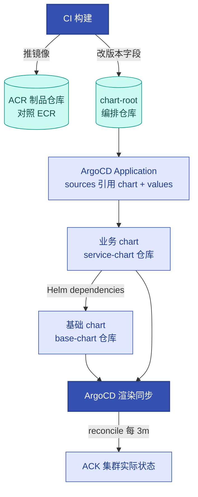

# 第10章 ArgoCD声明式GitOps生产交付体系
<!-- 第三篇 声明式交付体系 ｜ 常规章（讲落地、讲运行·技术栈锁死） ｜ 状态：终审中 -->

> 本章定位：讲落地、讲运行。基于 ArgoCD 讲清 GitOps 交付体系，承接第 9 章 IaC 思想，为第 11 章灰度治理奠基。ArgoCD 本体部署在 ACK 集群内（对照 EKS 同构）。与第 9 章分工：9 章 = Helm 打包与 IaC 边界，本章 = 从 chart 到集群的 GitOps 交付（chart 内部结构不重复，只引用）。

> **技术栈锁死**：本章交付栈涉及组件 = ArgoCD + Helm。不引入 Flux 等同类替代。
> **去工具化**：本章讲的是"声明式 + Git 真相源 + 持续同步（pull + reconcile）"的 GitOps 原理，ArgoCD 只是参考实例，换 Flux 等照样适用（详见 CONVENTIONS 三）。
> **边界声明**：本章只讲 GitOps 交付落地；灰度发布归第 11 章；CI 底层机制不展开，归 V2。

---

## 10.1 传统CI/CD交付痛点与GitOps核心解决方案

### 生产问题

团队的传统 CI/CD：CI 构建完直接 `kubectl apply` 到 ACK（push 模式）。算一笔账：CI 持有的是集群管理员 kubeconfig——CI 被攻破等于整个 ACK 集群被攻破，凭据爆炸半径 = 集群内全部业务；一次半成功部署平均要 30 分钟以上人肉比对才能确认真实状态。**push 模式 CD 把"部署能力"交给了 CI，既不安全（凭据爆炸半径 = 全集群）也不可靠（真实状态不可知）**。

### 传统方案失效原因

GitOps 优于 push 模式 CD 是业界定论，不再逐条论证，压缩为两点：

- **CI 持高权凭据 + 一次性推送**：泄露即全集群沦陷（附录 A.3）；无持续同步，偏离无人纠正、不可见。
- **脚本化多环境**：每环境一套部署脚本，脆弱、不可复现。失效根因：**push 把交付变成"一次性推送"，丢失了持续同步与状态一致性**。

### 架构约束与权衡

| 维度 | 传统 push CD | GitOps (pull) |
|---|---|---|
| 方向 | CI push 到集群 | 集群内 controller pull Git |
| 凭据 | CI 持集群高权凭据 | 集群持 Git 只读凭据 |
| 状态一致性 | 部署后不保证 | 持续对账，偏离自动纠正 |
| 真相源 | 模糊（脚本 + CI） | Git 唯一可信源 |

权衡的核心：**GitOps 把交付从"CI 推"改为"集群拉"，用 controller 持续对账保证状态一致**——把第 5 章声明式调谐闭环应用到交付领域。

### 最小可行方案

1. **Git 唯一真相源**：部署期望（chart 版本 + values）进 chart-root（编排仓库）。
2. **集群内 controller + 持续对账**：ArgoCD 部署在 ACK 集群内，默认每 3 分钟对账一次（可调，10.3），偏离自动纠正。
3. **CI 只产制品 + 改 Git**：CI 不持任何集群凭据，不部署。

### 生产落地实现

**① 三仓库分工链路（与第 9 章分工：chart 打包归 9 章，本章只管"从 chart 到集群"）**：



链路读法：**chart-root**（编排仓库）管版本——CI 只改它的 values 文件；**业务 chart**（service-chart 仓库）管形态——一个业务一个 chart；**基础 chart**（base-chart 仓库）管公共最佳实践——探针/资源/网络/监控模板（9.4）。Application 的 source 指向这两个仓库（完整 YAML 见 10.3）。

**② CI 的全部职责（命令级边界——CI 的"部署"动作只有改 Git）**：

```bash
# CI 流水线最后两步（构建、测试略）：
docker build -t registry.cn-hangzhou.aliyuncs.com/prod-team/demo-api:20260814-1 .   # tag 用日期+序号，禁用 latest
docker push registry.cn-hangzhou.aliyuncs.com/prod-team/demo-api:20260814-1          # 制品进 ACR 企业版实例（对照 ECR）

cd chart-root
yq -i '.image.tag = "20260814-1"' envs/dev/demo-api/values-overrides.yaml             # 唯一"部署动作" = 改 Git 字段
git commit -am "demo-api: bump 20260814-1" && git push                                # 经 MR 合并，ArgoCD 接管（审批见 10.4）
```

- CI 凭据面：只有 Git 写 token + ACR 推送凭据，**零 kubeconfig**——push 模式最大的攻击面就此消除。
- 数字：镜像推送后，CI 改 tag → ArgoCD 默认 3 分钟对账周期内检出 → dev 环境变更可见，端到端 ≤5 分钟（无人工环节）。

云服务映射：制品 = ACR 企业版（对照 ECR）；私有 Git = 云效 Codeup（凭据见 10.3）；ArgoCD 本体跑在 ACK 上（对照 EKS 同构）。规模判断：单环境 <10 应用时 push 脚本尚可维持；多环境/多团队起，GitOps 的审计与一致性收益即超过学习成本。

### 典型故障案例

某传统 push CD，CI 部署脚本失败但部分应用了，集群处于半更新状态，CI 日志已滚动丢失，无法确定真实状态。迁 GitOps 后，集群状态 = Git 状态，ArgoCD 面板显示精确的同步状态与差异资源清单，半更新状态一目了然并可一键重新同步。

点评：**push CD 的"状态不可知"是最危险的**，GitOps 的持续对账让状态始终清晰。

### 根因定位

根因不在某次脚本失败，而在 **push 模式丢失了状态一致性**。GitOps 用 pull + reconcile 把一致性找回来。

### 长效治理方案

- Git 唯一真相源 + ArgoCD 集群内 pull，CI 零集群凭据，部署期望全部进 chart-root。
- 持续对账（默认 3 分钟）+ 状态随时可查，脚本化部署下线。

### 自动化/自治闭环

本节是 L1 机械自治（第 5 章）在交付领域的延伸：ArgoCD 本质是 controller，把"Git 期望状态"调谐到"集群实际状态"，与 K8s 控制器调谐副本数是同一个模式。

### 生产检查清单

- [ ] CI 是否只推制品（ACR/ECR）+ 改 chart-root 字段（零 kubeconfig）？
- [ ] 是否持续对账（默认 3 分钟）、偏离自动纠正、状态随时可查？
- [ ] 是否摆脱了 push 模式（脚本化部署已下线）？

---

## 10.2 GitOps四大核心特性：唯一可信源、可追溯、可复现、可灰度回滚

### 生产问题

问三个问题就知道交付体系是否及格：生产现在跑的哪个版本？上上个呢？回滚一次要几分钟？push CD 团队三个都答不上来，GitOps 团队三个都是秒查（`argocd app history`）。**没有四特性的交付，回滚是赌博、复现是奢望**。

### 传统方案失效原因

版本散落在 CI/脚本/集群三处、变更无完整历史、回滚 = 反向手工操作、灰度靠手切流量——定论，不再逐条论证。失效根因一句话：**没有把交付建立在 GitOps 四特性之上**。

### 架构约束与权衡

| 特性 | 含义 | 价值 |
|---|---|---|
| **唯一可信源** | Git 是部署真相，集群状态 = Git 状态 | 单一来源，无歧义 |
| **可追溯** | 每次变更是 commit/MR，历史完整 | 谁何时改了什么，可查 |
| **可复现** | 版本 = chart 版本 + 镜像 tag，可精确重建 | 故障可复现，环境可重建 |
| **可灰度回滚** | 回滚 = revert commit 或 rollback revision；灰度归 Argo Rollouts（第 11 章） | 低风险变更与回滚 |

权衡的核心：**四特性都源于"Git 真相源 + controller 持续同步"**，机制建立一次，四个性质同时获得。

### 最小可行方案

1. **唯一可信源 + 可追溯**：部署清单进 chart-root，ArgoCD 同步（10.1）；变更全走 MR（审批见 10.4）。
2. **可复现**：chart `targetRevision` 锁版本 + 镜像 tag 用构建号（禁 latest，2 章）。
3. **可灰度回滚**：常规回滚用 revert；灰度用 Argo Rollouts（第 11 章）。

### 生产落地实现

**① 回滚双通道（命令级制品）**：

```bash
# 常规通道：revert 即回滚（dev/staging 自动同步，端到端 <2 分钟）
git log --oneline -5 -- envs/prod/demo-api/            # 定位引入变更的 commit（可追溯）
git revert <commit-hash> && git push                    # 走 MR：生产路径双审批（10.4）
argocd app get prod-demo-api --hard-refresh             # 立即拉 Git，不等 3 分钟对账周期
argocd app sync prod-demo-api                           # 生产手动同步（syncPolicy 边界见 10.3）

# 应急通道（P0/P1 止损，与 13.3 应急 SOP 同一命令）：
argocd app history prod-demo-api                        # 秒查：当前版本与历史版本清单
argocd app rollback prod-demo-api 12                    # 回到 revision 12；前提 auto-sync 已停（10.5 纪律）
```

- 可追溯的两条线：Git commit 历史（谁改的）+ ArgoCD operation 历史（同步/回滚执行记录），互为佐证。
- 可复现的锁法：Application 里 `targetRevision: 1.4.2`（禁 latest）+ 镜像 tag 构建号——任意历史版本 = 一个 commit + 一个仍存在的 tag。

**② 回滚速度的数字底座**：回滚零重建——镜像一直躺在 ACR。给 ACR 企业版实例（对照 ECR）配 tag 保留策略：保留最近 100 个、自动回收更旧的（# 可调: 生产建议 ≥50）。目标数字：**dev/staging 回滚端到端 <2 分钟；prod（双审批 + 手动 sync）≤5 分钟**（对齐 13.3 止损目标）。云服务映射：制品长存 ACR；回滚通道 = ACK 上的 ArgoCD；灰度由 Argo Rollouts 承接（第 11 章）。

### 典型故障案例

某次发布引入 bug，团队 `git revert` 对应 commit，ArgoCD 自动同步回滚，dev 环境全程 <2 分钟，且回滚动作本身可追溯（也是一次 commit + 一次 MR）。此前传统方式回滚靠反向部署脚本，平均 25 分钟且两次出错。

点评：**GitOps 让回滚变成一次普通的 commit**，安全、可追溯、可复现。

### 根因定位

先给结论：不是回滚操作慢，而是**四特性从未建立**——版本无处查、历史不完整、镜像可能被覆盖，回滚只剩"重建旧版本"这条最慢最险的路。

### 长效治理方案

- 四特性纳入交付门禁：变更全走 MR、版本双锁（chart 版本 + 构建 tag）。
- 回滚走 revert（常规）/ rollback（应急，13.3 白名单）；灰度走 Argo Rollouts（第 11 章）。

### 自动化/自治闭环

本节为 L2 运维自治（第 16 章）的"自动回滚"提供了原子操作：revert/rollback 是可被自动化系统安全调用的低风险动作——前提正是四特性提供的可追溯与可复现。

### 生产检查清单

- [ ] Git 唯一可信源 + 持续同步 + 变更全走 MR（可追溯）？
- [ ] chart targetRevision + 镜像 tag 双锁、禁 latest（可复现）？
- [ ] 回滚双通道可用，目标 dev <2 分钟、prod ≤5 分钟？
- [ ] ACR tag 保留策略 ≥50，回滚零重建？

---

## 10.3 ArgoCD核心架构、资源同步机制、生产高可用部署方案

### 生产问题

周四发布窗口，ArgoCD 单副本 controller 所在节点被 drain，controller 重启 12 分钟——这 12 分钟里 3 个紧急修复无法同步，其中一个正是 P1 故障的修复版本。**交付中枢自身成了单点：GitOps 的可靠性停在 ArgoCD 的可用性上**。

### 传统方案失效原因

- **单点部署 + 无 HA 设计**：api-server/repo-server/controller/Redis 单副本，故障即全集群交付停摆。
- **同步机制黑盒 + 异常无预案**：哪里会卡住、卡住怎么处理，都不清楚（10.5 展开）。失效根因：**把 ArgoCD 当"装上就用"的工具，不当需要高可用运维的交付中枢**。

### 架构约束与权衡

| 组件 | 职责 | 高可用 |
|---|---|---|
| **api-server** | UI/API/CLI 入口，无状态 | 多副本 |
| **repo-server** | clone Git、渲染 Helm manifest，同步吞吐瓶颈点 | 多副本 |
| **application-controller** | 对比 Git vs 集群、执行同步，核心中的核心 | 多副本（leader 选举） |
| **applicationSet** | 按生成器批量建 Application（10.4） | 多副本 |
| **Redis** | 缓存 | Redis HA |

托管视角：ArgoCD 是平台层自建栈，跑在 ACK 的"你运维层"（4.2 三层职责图）——ACK 保底控制面与节点，ArgoCD 自身的 HA 归平台组。权衡的核心：**用约 2 倍的 ArgoCD 资源，换掉全集群变更通道的单点**——这笔账稳赚。

### 最小可行方案

1. **核心组件多副本**：server/repoServer/controller/applicationSet 各 ≥2 副本 + Redis HA；chart 版本锁定安装（升级按 4.4 节奏）。
2. **状态可观测**：OutOfSync/Failed 接告警（第 12 章）+ 同步失败进值班群（10.4）。
3. **同步策略分级**：dev/staging 自动同步，生产手动 + CI 校验（下文边界）。

### 生产落地实现

**① ArgoCD 安装在 ACK 上（helm 官方 chart，对照 EKS 完全同构）**：

```bash
helm repo add argo https://argoproj.github.io/argo-helm
helm repo update
kubectl create namespace argocd
helm install argocd argo/argo-cd \
  --namespace argocd \
  --version <chart-version> \
  --values argocd-ha-values.yaml        # 可调: chart-version 锁定具体版本（禁 latest），以官方 argo-helm 发布为准

# 初始 admin 口令（首次登录即改，日常走 SSO，见 10.4）
kubectl -n argocd get secret argocd-initial-admin-secret -o jsonpath='{.data.password}' | base64 -d
```

**② HA 关键 values（argocd-ha-values.yaml 精简版，完整项以官方 chart values 为准）**：

```yaml
server:
  replicas: 2            # API/UI 入口，无状态
repoServer:
  replicas: 2            # 可调: Application >100 个时扩到 3（渲染瓶颈点）
controller:
  replicas: 2            # 风险: 多副本需 ArgoCD ≥2.11（active-active），且必须同时开下列 Redis HA
applicationSet:
  replicas: 2            # 可调: 规模小可 1
redis:
  ha:
    enabled: true        # 生产禁改: controller 多副本依赖 Redis HA，二者必须同开（3 副本）
configs:
  params:
    "timeout.reconciliation": 180s   # 应用对账周期，默认 3m；# 可调: 60s 压低变更可见时延，代价是 API 压力
```

**③ 完整 Application YAML（多源：values 在 chart-root、chart 在业务 chart 仓库；valueFiles 分层）**：

```yaml
apiVersion: argoproj.io/v1alpha1
kind: Application
metadata:
  name: demo-api-dev
  namespace: argocd                 # Application 必须建在 ArgoCD 所在 namespace
spec:
  project: default                  # 项目隔离与 RBAC 见 10.4
  sources:                          # ArgoCD ≥2.6 多源：第一源只作 values 引用
  - repoURL: https://codeup.aliyun.com/<org>/chart-root.git      # 编排仓库：只放 values，不放 chart
    targetRevision: main
    ref: values
  - repoURL: https://codeup.aliyun.com/<org>/service-chart.git   # 业务 chart（service-chart 仓库）
    targetRevision: 1.4.2           # 生产禁改: 禁用 latest/head，必须锁版本（可复现，10.2）
    chart: demo-api
    helm:
      valueFiles:                   # 分层引用：后者覆盖前者（chart 内默认值 → 环境基线 → 覆盖层）
      - $values/envs/dev/demo-api/values.yaml
      - $values/envs/dev/demo-api/values-overrides.yaml
  destination:
    server: https://kubernetes.default.svc   # ArgoCD 所在 ACK 集群；多集群舰队归 V2
    namespace: dev
  syncPolicy:
    automated:                      # 风险: automated 只用于 dev/staging——生产禁用，改"CI 校验 + 人工 sync"（见下）
      prune: true                   # 风险: Git 删除资源会连集群一起删；生产禁用（10.5 排障也依赖此边界）
      selfHeal: true                # 风险: kubectl 手改会被自动回滚——应急止血（改副本）须先停 auto-sync（13.3/10.5）
    syncOptions:
    - CreateNamespace=true
    - PruneLast=true                # 先建后删，降低 prune 的瞬时伤害
```

automated 的选择题：dev/staging 开 `automated + prune + selfHeal`（快速收敛、试错成本低）；**生产关 automated，CI 里用 `argocd app diff prod-demo-api --exit-code` 做门禁（非零退出 = 有未同步差异，人工 review 后手动 sync）**——用一次人工确认换生产的变更安全。

**④ 私有 Git 凭据（HTTPS token 主用；SSH 二选一）**：

```yaml
# 方式一：HTTPS + 访问令牌（只读账号，泄露面最小）
apiVersion: v1
kind: Secret
metadata:
  name: argocd-repo-chartroot       # 约定 argocd-repo-<name>
  namespace: argocd
  labels:
    argocd.argoproj.io/secret-type: repository   # 生产禁改: ArgoCD 靠它识别仓库凭据
type: Opaque
stringData:
  type: git
  url: https://codeup.aliyun.com/<org>/chart-root.git
  username: argocd-robot            # 只读账号
  password: <PAT>                   # 云效 Codeup 个人访问令牌；业务 chart 仓库同法再建一个
```

```bash
# 方式二：SSH——先把 host key 加入 known-hosts（防中间人），凭据 Secret 改用 sshPrivateKey 字段：
kubectl -n argocd edit configmap argocd-ssh-known-hosts-cm
# 追加：codeup.aliyun.com ssh-ed25519 AAAAC3NzaC1lZDI1NTE5AAAA...（host key 指纹以云效官方文档为准）
```

**⑤ ACR 镜像免密（一句）**：业务镜像来自 ACR 企业版（对照 ECR），ACK 的免密组件用节点 RAM 角色/RRSA 自动注入拉取凭据（4.2 云身份纪律在镜像侧的延伸）——ArgoCD 同步的清单里不出现 imagePullSecrets，交付链路全程无镜像凭据。

数字小结：HA 后单组件故障 leader 切换 <30 秒无感；交付通道可用性目标 99.9% = 月停摆预算 43 分钟（口径同 13.2）；对账周期默认 3 分钟。云服务映射：ArgoCD on ACK（对照 EKS）、Git 凭据 = Codeup PAT、镜像 = ACR 免密。

### 典型故障案例

ArgoCD 单副本 controller 故障，全集群交付停摆 30 分钟（含一次 P1 修复被卡）。迁 HA（controller 2 副本 + Redis HA）后，单组件故障切换 <30 秒，交付不再中断。

点评：**交付中枢必须高可用**，它是全集群变更的唯一通道。

### 根因定位

问题的真正发源地是把 ArgoCD 当"装上就用"的工具——中枢的 HA、同步机制的边界、异常的预案，一样都没做。

### 长效治理方案

- ArgoCD HA（四组件 ≥2 副本 + Redis HA）+ 版本锁定 + 同步状态告警（第 12 章）。
- 同步策略分级：dev/staging 自动、生产手动 + CI diff 门禁。

### 自动化/自治闭环

本节是交付层机械自治的**执行可靠性**：10.1 的调谐闭环依赖 controller 持续运转——中枢高可用是交付自治的底座。

### 生产检查清单

- [ ] ArgoCD HA（四组件 ≥2 + Redis HA），chart 版本锁定、对账周期调优？
- [ ] Application 多源分层（chart-root values + 业务 chart，targetRevision 锁版本）？
- [ ] 同步策略分级：dev/staging automated、生产手动 + `diff --exit-code` 门禁？
- [ ] 私有 Git 凭据只读最小权限（HTTPS PAT 或 SSH knownHosts）？
- [ ] 镜像拉取走 ACR 免密（清单零 imagePullSecrets）？

---

## 10.4 多环境分支策略、变更审批、权限管控企业规范

### 生产问题

GitOps 上线三个月，平台组收到两个相反的投诉：业务组说"接一个新服务要开 4 张工单、等两天"；安全组说"任何人都能改 prod 的 values 直接上生产"。两个投诉指向同一件事——**GitOps 只解决了"怎么同步"，没解决"谁能改、怎么批、怎么晋升"。便利没有治理对冲，就是风险放大器**。

### 传统方案失效原因

- 无目录策略 + 无审批：dev 改动可直达 prod，人人有 prod 写权限。
- 晋升无规则：dev→staging→prod 靠手动搬运。失效根因：**治理规范缺位，GitOps 的便利反成风险**。

### 架构约束与权衡

| 维度 | 规范 | 权衡 |
|---|---|---|
| **分支策略** | 单分支 main + 环境目录隔离（晋升 = 目录间 MR） | 安全 vs 流动性 |
| **变更审批** | PR 模板三字段 + CODEOWNERS 分级（prod 双审批） | 流程开销 vs 安全 |
| **权限管控** | ArgoCD RBAC：业务组只读、平台组 admin | 便利 vs 最小权限 |
| **晋升流水线** | dev→staging→prod 目录晋升，每段独立审批 | 严格 vs 速度 |

选择"环境目录"而非"环境分支"：分支策略会产生大量 merge 冲突，目录晋升的每次变更都是一次可见的 copy + diff。权衡的核心：**审批闸门建在 Git，不在 ArgoCD UI**。

### 最小可行方案

1. **目录即环境**：chart-root 单 main 分支，`envs/{dev,staging,prod}/` 目录隔离。
2. **prod 双审批**：CODEOWNERS 平台组 + SRE 组，缺一不可合并。
3. **RBAC 分级**：业务组 ArgoCD 只读 + dev 可 sync；平台组 admin。
4. **新服务自助接入**：ApplicationSet 目录生成器，提交目录即生成 Application。

### 生产落地实现

**① chart-root 目录树（多环境 overlay 的落地形态）**：

```text
chart-root/                             # 编排仓库：只放 values 与 Application/ApplicationSet 清单
├── bootstrap/
│   └── root.yaml                       # App-of-Apps 根应用（下 ②）
├── applicationsets/
│   └── services.yaml                   # git 目录生成器（下 ③）
└── envs/
    ├── dev/
    │   ├── demo-api/
    │   │   ├── values.yaml             # 环境基线：副本/资源/域名（业务组可改）
    │   │   └── values-overrides.yaml   # 覆盖层：镜像 tag——CI 只改这一个文件（10.1 ②）
    │   └── user-svc/
    ├── staging/                        # 与 dev 同构（每服务同两文件结构）
    └── prod/                           # CODEOWNERS 双审批目录（下 ④）
```

晋升即复制：dev 验证通过后，把目录值复制到 staging/prod 同路径提交 MR——晋升路径可见、可 diff、可审批。

**② App-of-Apps 根 Application（一个根管全部）**：

```yaml
apiVersion: argoproj.io/v1alpha1
kind: Application
metadata:
  name: root
  namespace: argocd
spec:
  project: default
  source:
    repoURL: https://codeup.aliyun.com/<org>/chart-root.git
    targetRevision: main
    path: applicationsets            # 根只管一件事：把 ApplicationSet 清单同步进集群
  destination:
    server: https://kubernetes.default.svc
    namespace: argocd
  syncPolicy:
    automated:
      prune: false                   # 风险: 根应用 prune 会级联删除全部子应用，禁用；删子应用走"删目录 + 审批"
      selfHeal: true
```

**③ ApplicationSet git 目录生成器（新业务 = 提交一个目录即自动接入）**：

```yaml
apiVersion: argoproj.io/v1alpha1
kind: ApplicationSet
metadata:
  name: services
  namespace: argocd
spec:
  generators:
  - git:
      repoURL: https://codeup.aliyun.com/<org>/chart-root.git
      revision: main
      directories:
      - path: envs/dev/*             # dev/staging 进自动生成器
      - path: envs/staging/*
      # prod 不进自动生成器：生产 Application 用 10.3 模板手动建档（去 automated），双审批入口在 Git MR
  template:
    metadata:
      name: '{{path[0]}}-{{path[1]}}'        # 如 dev-demo-api（label env 按需补充）
    spec:
      project: default
      sources:
      - repoURL: https://codeup.aliyun.com/<org>/chart-root.git
        targetRevision: main
        ref: values
      - repoURL: https://codeup.aliyun.com/<org>/service-chart.git
        targetRevision: 1.4.2                # 新服务接入时在此锁版本
        chart: '{{path.basename}}'
        helm:
          valueFiles:
          - '$values/{{path}}/values.yaml'
          - '$values/{{path}}/values-overrides.yaml'
      destination:
        server: https://kubernetes.default.svc
        namespace: '{{path[0]}}'
      syncPolicy:
        automated:                    # 风险: 仅 dev/staging 生成器适用；生产的自动化边界见 10.3
          prune: false
          selfHeal: true
```

**④ 变更审批：PR 模板（三字段）+ CODEOWNERS 分级（生产双审批）**：

```text
<!-- chart-root/.pull_request_template.md（云效 Codeup 用同字段的合并请求模板） -->
变更类型（勾选）: [ ] 镜像版本升级  [ ] 配置变更（副本/资源/域名/环境变量）  [ ] 新服务接入（新增 envs/<env>/<svc>/ 目录）
影响面: 环境 dev/staging/prod；服务与实例数（如 prod/demo-api ×6）；是否涉及不可逆操作（删资源/prune/降配）
回滚方案: revert 本 MR 即回滚（无 DB 变更）；或 argocd app rollback（13.3 应急通道，须先停 auto-sync）
```

```text
# chart-root/CODEOWNERS —— 一行多团队 = 每个团队都必须批准，缺一不可合并
/envs/prod/         @platform-team @sre-oncall    # 生产：平台组 + SRE 双审批（2 人）
/envs/staging/      @platform-team                # 预发：平台组单审批
/applicationsets/   @platform-team                # 生成器影响全局应用
/bootstrap/         @platform-team
# /envs/dev/ 不设 owner：业务组自助迭代，仍需仓库默认的 1 名评审
```

**⑤ ArgoCD RBAC policy.csv（业务组只读、平台组 admin）**：

```yaml
# ArgoCD RBAC——helm values 的 configs.rbac.policy.csv（或 argocd-rbac-cm 同内容）
# 行格式: p, <角色>, <资源>, <动作>, <对象 project/app>, <效果>；对象支持通配
p, role:service-team, applications, get, */*, allow        # 业务组：全部应用只读（看状态/diff/history）
p, role:service-team, applications, sync, dev-*, allow     # 仅 dev 应用允许手动重新同步
p, role:platform-admin, applications, *, */*, allow        # 平台组：应用全动作
p, role:platform-admin, projects, *, *, allow              # 平台组：项目管理
p, role:platform-admin, repositories, *, *, allow          # 平台组：仓库凭据管理（10.3 的 Secret）
g, service-team, role:service-team                         # 组名来自 SSO 组声明（下一句）
```

SSO 一句：登录走 OIDC/Dex 对接企业身份源（阿里云 IDaaS；对照 AWS IAM Identity Center），组声明映射上面 `g,` 行——多租户 project 体系深度归 V2。

**⑥ 同步失败通知通道（审批后的兜底观测）**：

```yaml
# argocd-notifications（helm 值 notifications.enabled: true 开启）
apiVersion: v1
kind: ConfigMap
metadata:
  name: argocd-notifications-cm
  namespace: argocd
data:
  service.webhook.dingtalk: |
    url: https://oapi.dingtalk.com/robot/send?access_token=<token>   # 值班群机器人；飞书 webhook 同构
  trigger.on-sync-failed: |
    - when: app.status.operationState.phase in ['Error', 'Failed']
      oncePer: app.status.operationState.syncResult.revision          # 同一版本只提醒一次
      send: [app-sync-failed]
  template.app-sync-failed: |
    webhook:
      dingtalk:
        method: POST
        body: '{"msgtype": "text", "text": {"content": "[ArgoCD] {{app.metadata.name}} 同步失败，处理见 10.5"}}'
  subscriptions: |
    - recipients: [dingtalk]
      triggers: [on-sync-failed, on-health-degraded]   # 内置触发器：同步失败 / 健康劣化
```

数字与云映射：新业务接入从"4 张工单 ≈2 天"压到"提交一个目录 ≤10 分钟"；生产变更固定 2 人审批、MR 响应目标 ≤2 小时；同步失败在 1 个对账周期（≤3 分钟）内进群。私有 Git = 云效 Codeup（对照：AWS CodeCommit 已对新客户关闭，新团队多用 GitHub/GitLab 托管 + IAM Identity Center SSO）。

### 典型故障案例

某工程师直推 prod values（无审批），误改副本数导致生产过载。开启 CODEOWNERS 双审批 + PR 模板后，同类误改在评审中被拦截两次——"影响面"字段逼着改动者写清实例数，评审人一眼看出异常。

点评：**GitOps 的便利必须配审批闸门**，否则"一键改生产"就是"一键出事"。

### 根因定位

两个投诉其实是同一个根因：**审批与权限规范缺位**——自助接入的效率与生产变更的安全，都要靠 Git 侧的治理结构（目录 + CODEOWNERS + RBAC）同时供给。

### 长效治理方案

- 目录即环境 + 晋升即复制 + prod 双审批（CODEOWNERS）+ PR 模板三字段。
- ArgoCD RBAC 分级（业务只读、平台 admin）+ SSO 组映射；可逆全自动、不可逆人工闸门。

### 自动化/自治闭环

本节是 GitOps 自治的**治理护栏**：自动同步负责"快"，审批与权限定义"什么能自动、什么要人工"——L1/L2 处理可逆变更，人工闸门守护不可逆变更。

### 生产检查清单

- [ ] 环境目录隔离，晋升走目录间 MR + PR 三字段强制？
- [ ] CODEOWNERS 生产双审批（@platform-team @sre-oncall）生效？
- [ ] RBAC 分级（业务只读、平台 admin）+ SSO 组映射？
- [ ] 新服务 = 提交目录即接入（ApplicationSet），≤10 分钟？
- [ ] 同步失败通知（钉钉/飞书）已接值班群？

---

## 10.5 GitOps+Helm流水线落地、同步异常排查与生产风险规避

### 生产问题

周一早上值班群被刷屏：某应用在 ArgoCD 里 OutOfSync → Synced → OutOfSync 反复横跳两小时，没人说得清是 ArgoCD 坏了还是集群坏了，不敢动也不敢不管。**GitOps 跑起来之后，一半的运维时间花在同步异常排查上——没有判定表，每次都从零猜**。

### 传统方案失效原因

- values 覆盖优先级不清：多 values 文件的渲染结果非预期。
- 集群侧字段被 HPA/准入控制器/secrets 渲染合法改写：与 Git 永久不一致（死循环之源）。
- secret 明文进 Git + 异常无排查路径：违反安全基线（附录 A.3），出错只能穷举猜。失效根因：**落地工程细节未规范——理论清楚但实操粗糙**。

### 架构约束与权衡

| 维度 | 规范 | 权衡 |
|---|---|---|
| **values 优先级** | chart 默认 → 环境基线 → 覆盖层，后者覆盖前者（10.3 valueFiles） | 灵活性 vs 可预测 |
| **字段漂移** | 集群侧合法改写（HPA 副本等）进 ignoreDifferences 白名单 | 自动纠正 vs 合法例外 |
| **secret** | 不进 Git，走 ESO/KMS（附录 A.3） | 安全 vs 便利 |
| **排查路径** | 状态 → diff → 渲染 → 权限，分层推进 | 建立路径 vs 凭经验 |

权衡的核心：**不是所有 OutOfSync 都该"纠正"**——先判定漂移来源，再决定回写 Git、加白名单还是开 selfHeal。

### 最小可行方案

1. **排查有序**：get（状态）→ diff（差异）→ --hard-refresh（排除缓存）→ sync --dry-run（渲染/权限验证）。
2. **漂移分类处置 + secret 外置**：手动改的回写 Git；控制器改的进白名单；helm 残留一次性 force 接管；secret 走 ESO/KMS。
3. **应急通道纪律**：rollback 前停 auto-sync，止损后 2 小时回写 Git（与 13.3 同一制度）。

### 生产落地实现

**① 排查命令序列（按序执行，每步回答一个问题）**：

```bash
argocd app get dev-demo-api                  # 1.第一眼：Sync/Health 状态、条件、上次同步结果
argocd app diff dev-demo-api                 # 2.精确 diff：Git 期望 vs 集群实际，差异在哪些字段
argocd app get dev-demo-api --hard-refresh   # 3.绕过缓存重拉 Git（对账周期 3m + 仓库缓存都会延迟真相）
argocd app diff dev-demo-api --refresh       # 4.刷新后再 diff：确认差异真实存在（排除缓存假象）
argocd app sync dev-demo-api --dry-run       # 5.只渲染不落集群：验证 Helm 渲染与 RBAC 权限，零变更
argocd app sync dev-demo-api --prune         # 6.确认后执行（生产在 CI 门禁后人工触发，10.3）
```

**② OutOfSync 死循环判定表（先判原因，再选处置）**：

| 原因 | 判定特征 | 处置 |
|---|---|---|
| **手动改了集群**（kubectl 直改） | diff 只有少量字段（副本/镜像），Git 侧无对应 commit | 规范化：回写 Git（13.3 应急后 2h 回写）；或开 selfHeal 让其纠正 |
| **helm 参数漂移**（从 helm release 迁移残留） | diff 成片集中在 metadata/labels/annotations | 一次性 `argocd app sync --force` 接管；迁移细节以官方文档"migrating from Helm"为准 |
| **控制器/webhook 合法改写**（HPA 改副本、准入注入字段） | diff 恒定在同一字段，改了又回来 | 进 ignoreDifferences 白名单（下） |
| **secret 渲染差异**（secret 不进 Git，由 ESO 渲染） | diff 只有 Secret 的 data | Secret 交 ESO/KMS 管（附录 A.3），Git 不追其 data |

```yaml
# Application 增补：忽略"集群侧合法改写"的字段——OutOfSync 死循环的治本项
spec:
  ignoreDifferences:
  - group: apps
    kind: Deployment
    jsonPointers:
    - /spec/replicas        # HPA 在管（7.5），Git 不追此字段
  - group: ""               # core API group；Secret 的 data 由 ESO 渲染
    kind: Secret
    jsonPointers:
    - /data
```

**③ 健康状态判定表（Health → 去向）**：

| Health | 含义 | 去向 |
|---|---|---|
| **Healthy** | 实际 = 期望且资源健康 | 正常，无需动作 |
| **Progressing** | 滚动/等待中 | 超 10 分钟未转 Healthy（# 可调: 按应用滚动时长定）→ 查探针与镜像拉取（下） |
| **Degraded** | 资源报告不健康 | events/logs 定位；业务受损直接走 13.3 SOP |
| **Suspended** | Rollout/分析暂停 | 查 AnalysisRun，第 11 章灰度 |
| **Missing** | 集群缺资源 | 同步未建出：查 CRD/配额/RBAC（下 ④） |
| **Unknown** | 该类资源无健康规则 | 为 CRD 配自定义 health check（Lua，以官方文档为准） |

镜像拉取卡 Progressing 的云侧排查（ACK + ACR 高频项）：

```bash
kubectl -n dev describe pod -l app=demo-api | grep -A5 Events
# ImagePullBackOff → 两问：tag 在 ACR 是否存在（10.1 推送是否成功）？免密组件是否正常（4.2，RRSA/节点角色）？
```

**④ 同步卡在 Init/Syncing（CRD 未就绪）**：operation 长时间 running、资源停在等待——常见于 app-of-apps 或新 Operator 接入：目标资源的 CRD 由前序应用安装，时序没保证。

```bash
kubectl get crd | grep <kind>            # CRD 建出了吗
argocd app get <app>                     # 看 operationState.phase 与 message
```

治本：给 CRD 清单加注解 `argocd.argoproj.io/sync-wave: "-1"`（数字越小越先同步，默认 0），或 CRD 独立先行安装；Operator 类应用建议在 Application 上加 `retry`（如 limit 5、backoff 30s 起步）。

**⑤ 应急 rollback 通道（与 13.3 SOP 完全一致的纪律）**：

```bash
argocd app set prod-demo-api --sync-policy none   # 回滚前先停 auto-sync，否则 Git 又把新版同步回来
argocd app history prod-demo-api                  # 秒查版本清单（10.2 的"三个问题"之一）
argocd app rollback prod-demo-api 12              # 回到 revision 12；目标端到端 ≤5 分钟（对齐 13.3 止损目标）
# 止损后 2h 内回写 Git（提交等价变更或 revert），再恢复同步策略——同一份制度，两章一致
```

数字小结：对账周期 3 分钟（可调 60s）；Progressing 超 10 分钟视为异常；回滚命令秒级、端到端目标 ≤5 分钟；应急回写窗口 2 小时。云服务映射：镜像失败查 ACR 免密（RRSA/节点 RAM 角色，4.2）；CRD 与集群事件在 ACK 上（`kubectl` 同构，对照 EKS）。

### 典型故障案例

某 secret 明文进 chart-root（图方便），仓库泄露后 43 个密钥被迫全量轮换，耗时 6 小时。改用 ESO（secret 在 KMS，Git 只存 ExternalSecret 引用）后，Git 里零 secret，同样的泄露无密钥可偷。

点评：**secret 进 Git 是 GitOps 最常见的安全坑**，ESO 是标准解法（附录 A.3）。

### 根因定位

拆到底，是**落地工程细节未规范**（values 优先级/漂移白名单/secret 外置/排查路径）——工具换了，纪律没跟上。

### 长效治理方案

- 排查序列（get→diff→refresh→dry-run）固化进值班手册，配合 10.4 失败通知。
- 漂移分类处置：回写 Git / ignoreDifferences / 一次性 force 接管；secret 走 ESO/KMS 禁进 Git。
- rollback 纪律（先停 auto-sync、2h 回写）与 13.3 同源维护。

### 自动化/自治闭环

本节让交付的机械自治**在生产可靠兑现**：selfHeal 持续生效，ignoreDifferences 划清自治边界，排查序列让自治异常可诊断——为第 11 章灰度治理提供可靠地基。

### 生产检查清单

- [ ] 排查序列（get/diff/--hard-refresh/--dry-run）团队熟知？
- [ ] OutOfSync 先判原因（手动改/helm 漂移/合法改写/secret）再处置？
- [ ] ignoreDifferences 覆盖 HPA 副本与 ESO Secret？
- [ ] 健康判定表可用（Progressing >10 分钟升级）、CRD 时序用 sync-wave？
- [ ] rollback 前停 auto-sync、2h 回写 Git（与 13.3 一致）？
