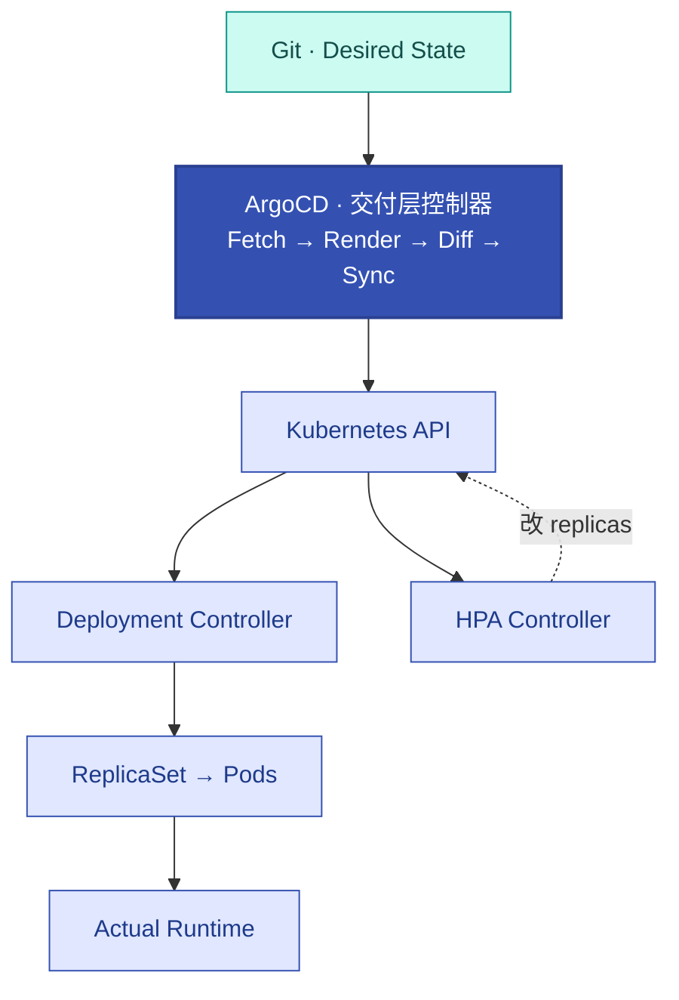
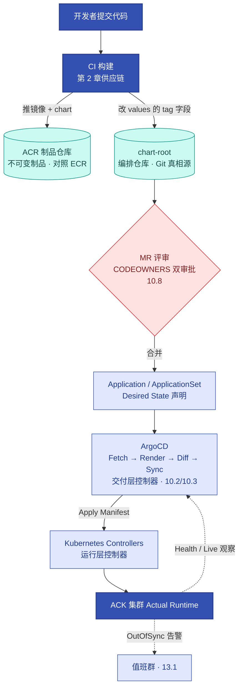

# 第10章 ArgoCD声明式GitOps生产交付体系
<!-- 第三篇 声明式交付体系 ｜ 知识型工程章节（V1.2 重构） ｜ 状态：终审中 -->

> 本章定位：以 ArgoCD 为实例，讲透 GitOps 的**系统原理**——它不是"部署工具"，而是一个运行在 Kubernetes 之外、以 Git 为 Desired State、通过 Kubernetes API 持续执行 Diff + Reconcile 的**控制器系统**。全章按知识递进组织：Push CD 丢掉了什么（10.1）→ OutOfSync 怎么算出来（10.2）→ ArgoCD 五段工作流与两层 Controller（10.3）→ Git/Chart/Values/Image 谁负责什么（10.4）→ Drift 分型与 Ownership Boundary（10.5）→ 可复现交付与 Release Identity（10.6）→ 高可用与瓶颈（10.7）→ 三层权限治理（10.8）→ 故障诊断状态机（10.9）→ 总架构与 SOP（10.10）。
>
> **第三篇知识链**：第 9 章讲"如何**定义** Desired State"（Terraform/Helm）；本章讲"如何让系统**持续收敛**到 Desired State"（ArgoCD）；第 11 章讲"如何让新旧 Desired State **安全迁移**"（Rollouts）。三章是一条知识链，不是三个工具。
> **主线定位**：本章为交付层持续收敛——L1 机械自治在交付域的延伸（Controller of Controllers）（三层自治总览见 1.5，理论核心为第 5/16 章——L3 智能自治承载于 16.4⑤/16.5 运维 Agent 引擎）。 **主旨绑定（V1.4）**：运维 Agent 制品变更走同一条 GitOps 纪律——分诊器 prompt/评测集变更（16.5②）、规则表/白名单变更（16.4②）不因"智能"而豁免变更治理。 **承上启下**：承第 9 章定义；启第 11 章灰度与 16.5 变更事实（收敛 → 安全迁移/变更供给线）。

> **技术栈锁死**：本章交付栈涉及组件 = ArgoCD + Helm。不引入 Flux 等同类替代。
> **去工具化**：本章讲的是"声明式 + Git 真相源 + 持续同步（pull + reconcile）"的 GitOps 原理，ArgoCD 只是参考实例，换 Flux 等照样适用（详见 CONVENTIONS 三）。
> **边界声明**：本章只讲 GitOps 交付；灰度发布归第 11 章；CI 底层机制不展开，归 V2。与第 9 章分工：9 章 = Helm 打包与 IaC 边界（chart 内部结构见 9.5，本章只引用）。

---

## 10.1 为什么传统 Push CD 无法保证状态一致性

### 生产问题

团队的传统 CI/CD：CI 构建完直接 `kubectl apply` 到 ACK（push 模式）。算一笔账：CI 持有的是集群管理员 kubeconfig——CI 被攻破等于整个 ACK 集群被攻破；一次半成功部署平均要 30 分钟人肉比对才能确认真实状态。**push 模式把"部署能力"交给了 CI，既不安全也不可靠，但要说清"为什么"，得先看清 Kubernetes 本身已经是什么**。

### 传统方案失效原因

GitOps 优于 push 模式 CD 是业界定论，不再逐条论证。但定论之下有一个多数人没想过的起点——**Kubernetes 本身已经是一个 Desired State 系统**：

```yaml
spec:
  replicas: 3        # 这句话不是"创建 3 个 Pod"这个动作，
                     # 而是"我期望这里永远有 3 个副本"这个状态
```

于是 Kubernetes 的控制器在持续工作：

```text
Desired = 3，Actual = 2（某 Pod 挂了）
        ↓
Deployment Controller 检测到 Diff
        ↓
创建 Pod → Actual = 3
        ↺  循环往复
```

**K8s 已经是 Declarative + Controller + Reconciliation**。那 Push CD 的问题就清楚了：它没有破坏这套机制，但它把"谁提供 Desired State"交给了 CI 里的一次性 `kubectl apply`——**Desired 的来源是个一次性动作，而不是一个持久、受治理的真相源**。

### 架构约束与权衡

**① Push 到底丢掉了什么（三样）**：

```text
1. 凭据安全：CI 必须持集群高权 kubeconfig
        → 凭据爆炸半径 = 全集群（CI 被攻破 = 集群被攻破）

2. 持续调谐：kubectl apply 是"一次性执行"，执行完就结束
        → 集群后来被人改了、漂移了，无人纠正、无人知晓
        → K8s 内层控制器还在调谐副本，但"该部署什么"这件事没人调谐

3. 真相源：部署结果 = 脚本执行的成功失败，而非一个可查的状态
        → "生产现在跑的什么？"只能翻 CI 日志
```

**② GitOps 增加了什么：Controller of Controllers**。K8s 内层控制器的 Desired 来自 API 里的 YAML；GitOps 把这个链条再延长一层——**在 K8s 之外再放一个控制器，它的 Desired 是 Git**：

```text
Git（Desired State 的持久真相源）
 ↓
ArgoCD Controller（外层：交付层调谐）
 ↓
Kubernetes API（写入 Desired Manifest）
 ↓
K8s Controllers（内层：运行层调谐）
 ↓
Actual Runtime（Pod 实际运行）
```

这就是 **Controller of Controllers**：外层控制器调谐"集群该部署什么"，内层控制器调谐"应用该运行成什么样"。**ArgoCD 不运行应用，K8s 才运行应用**——ArgoCD 只负责把 Desired 写进 K8s API。

**③ 为什么必须是 Pull**：控制器要持续 reconcile，就必须常驻集群内、主动拉取 Git——这带来凭据方向的反转：

| 维度 | 传统 push CD | GitOps (pull) |
|---|---|---|
| 方向 | CI push 到集群 | 集群内 controller pull Git |
| 凭据 | CI 持集群高权凭据 | **集群只持 Git 只读凭据** |
| 状态一致性 | 部署后不保证（一次性执行） | 持续对账，偏离自动纠正 |
| 真相源 | 模糊（脚本 + CI 日志） | Git 唯一可信源 |

权衡的核心：**Pull 不是为了"更时髦"，而是持续调谐的必然要求**——只有常驻控制器才能 Diff + Reconcile，只有集群拉 Git 才能把高权凭据从 CI 手里拿走。两者是同一枚硬币的两面。

### 最小可行方案

1. **Git 唯一真相源**：部署期望（chart 版本 + values）进 chart-root（编排仓库，9.6）。
2. **集群内 controller + 持续对账**：ArgoCD 部署在 ACK 集群内，默认每 3 分钟对账一次（可调，10.7），偏离自动纠正。
3. **CI 只产制品 + 改 Git**：CI 不持任何集群凭据，不部署。

### 生产落地实现

**CI 的全部职责（命令级边界——CI 的"部署"动作只有改 Git）**：

```bash
# CI 流水线最后两步（构建、测试略）：
docker build -t registry.cn-hangzhou.aliyuncs.com/prod-team/demo-api:20260814-1 .   # tag 用日期+序号，禁用 latest
docker push registry.cn-hangzhou.aliyuncs.com/prod-team/demo-api:20260814-1          # 制品进 ACR 企业版实例（对照 ECR）

cd chart-root
yq -i '.image.tag = "20260814-1"' envs/dev/demo-api/values-overrides.yaml             # 唯一"部署动作" = 改 Git 字段
git commit -am "demo-api: bump 20260814-1" && git push                                # 经 MR 合并，ArgoCD 接管（审批见 10.8）
```

- CI 凭据面：只有 Git 写 token + ACR 推送凭据，**零 kubeconfig**——push 模式最大的攻击面就此消除。
- 数字：镜像推送后，CI 改 tag → ArgoCD 默认 3 分钟对账周期内检出 → dev 环境变更可见，端到端 ≤5 分钟（无人工环节）。
- 云服务映射：制品 = ACR 企业版（对照 ECR）；私有 Git = 云效 Codeup（凭据见 10.7）；ArgoCD 本体跑在 ACK 上（对照 EKS 同构）。规模判断：单环境 <10 应用时 push 脚本尚可维持；多环境/多团队起，GitOps 的审计与一致性收益即超过学习成本。

### 典型故障案例

某传统 push CD，CI 部署脚本失败但部分应用了，集群处于半更新状态，CI 日志已滚动丢失，无法确定真实状态。迁 GitOps 后，集群状态 = Git 状态，ArgoCD 面板显示精确的同步状态与差异资源清单，半更新状态一目了然并可一键重新同步。

点评：**push CD 的"状态不可知"是一次性执行的必然结果**——GitOps 的常驻控制器让状态持续可见。

### 根因定位

根因不在某次脚本失败，而在 **push 模式让 Desired State 的来源是一次性动作**——丢掉了持续调谐、凭据安全与真相源三样东西。GitOps 用 Controller of Controllers 把它们一起找回来。

### 长效治理方案

- Git 唯一真相源 + ArgoCD 集群内 pull，CI 零集群凭据，部署期望全部进 chart-root。
- 持续对账（默认 3 分钟）+ 状态随时可查，脚本化部署下线。

### 自动化/自治闭环

本节是 L1 机械自治（第 5 章）在交付领域的延伸：ArgoCD 是外层 controller，把"Git 期望状态"调谐到"集群实际状态"——与 K8s 控制器调谐副本数是同一个模式的两次实例化（内外两层）。

### 生产检查清单

- [ ] 理解 K8s 本身已是 Desired State 系统、GitOps 加的是"外层控制器"？
- [ ] 能说出 Push 丢掉的三样东西（凭据安全/持续调谐/真相源）？
- [ ] CI 是否只推制品（ACR/ECR）+ 改 chart-root 字段（零 kubeconfig）？
- [ ] 是否持续对账（默认 3 分钟）、偏离自动纠正、状态随时可查？

---

## 10.2 GitOps核心原理：Desired State、Live State、Diff 与 Reconciliation

### 生产问题

每个用 ArgoCD 的人都会看到 `Synced / OutOfSync` 这两个状态，多数人的理解停留在"绿色正常、黄色异常"。但**OutOfSync 到底是怎么算出来的？比较的是什么和什么？多久比一次？**——答不出这三问，10.9 的排障就只能是背命令。

### 传统方案失效原因

- 把 ArgoCD 当黑盒状态灯：黄色就点 sync，不问差异从哪来。
- 失效根因：**不了解对账的计算模型**——它比较的不是"Git 文件"和"集群"，而是两个 Manifest。

### 架构约束与权衡

**① OutOfSync 的计算原理（本节核心知识）**：

```text
Git 里的声明（chart + values）
        ↓ ArgoCD Render（helm template，见 10.3）
Desired Manifest（期望清单：Deployment/Service/…的完整 YAML）
        ↓
        │              Diff（逐资源、逐字段比较）
        ↓
Live Manifest（K8s API 观察到的实际清单，
              剥离系统默认字段后）
```

判定规则：

```text
Desired replicas = 3，Live replicas = 5   → OutOfSync（有漂移）
Desired = Live（所有资源所有比较字段）     → Synced
```

两个容易忽略的细节：

- **Live 是"归一化"后的**：K8s 会给资源注入默认值（defaults）、系统字段（status/managedFields 等），ArgoCD 比较前会剥离这些——否则永远是"假 OutOfSync"。
- **Diff 的粒度是字段**：一个资源可以只在一个字段上 OutOfSync——`argocd app diff` 看到的就是这份字段级差异。

**② Reconciliation Loop（对账循环）**：上面的比较不是一次性的，而是常驻循环——默认每 3 分钟对每 个 Application 重复一遍（`timeout.reconciliation`，可调 60s，10.7）。循环每轮做三件事：观察（Fetch + Read Live）→ 比较（Diff）→ 必要时行动（Sync 或标记 OutOfSync）。

**③ Sync 的三个策略开关**（对账发现差异后怎么办，是策略选择）：

| 开关 | 行为 | 语义 |
|---|---|---|
| `automated` | 检出差异自动 Sync | 全自动收敛（dev/staging 用） |
| `selfHeal` | **集群侧**被手改也拉回 Git | 手改无效化（Drift 纠正，10.5） |
| `prune` | Git 里删的资源集群里也删 | 完整收敛（危险项，生产慎用） |

权衡的核心：**OutOfSync 不是"异常灯"，而是 Diff 的诚实报告**——它是 Drift 检测的输出（9.6 的集群内层），接下来怎么处置是策略问题（10.5 分型、10.9 诊断）。

### 最小可行方案

1. **接受对账模型**：Desired Manifest（渲染后）vs Live Manifest（归一化后），字段级 Diff。
2. **策略分级**：dev/staging 自动收敛（automated + selfHeal）；生产手动 + CI 门禁（10.7 边界）。
3. **把 OutOfSync 当信号**：接入告警（10.8 通知），而不是盯着面板看。

### 生产落地实现

亲手做一次对账实验（理解模型最快的方式）：

```bash
# 1. 观察正常状态
argocd app get dev-demo-api          # Sync Status: Synced，Health: Healthy

# 2. 制造一次 Drift：绕过 Git 直接改集群
kubectl -n dev scale deploy/demo-api --replicas=5

# 3. 等一个对账周期（或手动刷新），观察状态变化
argocd app get dev-demo-api --refresh
# Sync Status: OutOfSync
# diff 显示：spec.replicas  3 → 5（Git 3，Live 5）

# 4a. 若开了 selfHeal：ArgoCD 自动把副本改回 3（手改无效）
# 4b. 若未开：OutOfSync 常驻，直到有人处置（回写 Git 或 sync，见 10.5 分型）
```

- 数字：对账周期默认 3 分钟（可调 60s，代价是 API 与 Git 拉取压力，10.7）；`--refresh` 立即触发一次，不等周期。
- 云服务映射：对账发生在 ACK 集群内的 ArgoCD（对照 EKS 同构）；Git 在云效 Codeup / GitHub。

### 典型故障案例

某团队把"OutOfSync = 坏事"当信条，见到黄灯就 sync，从不看 diff——直到一次 HPA 引发的合法副本变化被他们反复手动"纠正"回 Git 的旧值，容量高峰时服务副本上不去造成过载（HPA 与 Git 的所有权冲突，10.5 详述）。

点评：**不理解 Diff 的来源，sync 就是蒙眼开枪**——先看差异是什么、从哪来，再决定动不动手。

### 根因定位

问题的真正发源地是把对账当黑盒——**OutOfSync 是"Desired ≠ Live"的诚实计算结果**，理解了比较模型，每个状态都有明确解释。

### 长效治理方案

- 对账模型（Desired/Live/Diff）进团队共同语言；排查一律从 `argocd app diff` 开始。
- 策略分级：自动化只给可逆环境；生产的手动边界与 CI 门禁见 10.7。

### 自动化/自治闭环

本节是交付层机械自治的**核心循环**：观察→比较→行动的 reconciliation loop 与第 5 章 K8s 内层闭环同构——这是"Controller of Controllers"里外层控制器的运转机理。

### 生产检查清单

- [ ] 能说清 OutOfSync 是 Desired Manifest vs Live Manifest 的字段级 Diff？
- [ ] 理解 Live 会做归一化（剥离系统默认字段）？
- [ ] 知道对账周期（默认 3m，可调）与 --refresh 的区别？
- [ ] automated / selfHeal / prune 三个开关的语义与适用边界清楚？
- [ ] 排查从 diff 开始，而不是见黄灯就 sync？

---

## 10.3 ArgoCD如何工作：Fetch → Render → Diff → Sync → Health 与两层控制器

### 生产问题

上一节讲了 Diff 的计算模型，但还有一个关键问题没回答：**Git 里放的是 Helm chart + values，K8s 认识 chart 吗？中间发生了什么？**——不理解 Render 环节，就理解不了 Repo Server 为什么存在、为什么会成为瓶颈（10.7），也理解不了"ArgoCD 到底管到哪一层"。

### 传统方案失效原因

- 以为"ArgoCD 把 chart 丢给 K8s"——K8s 根本没有 chart 这个概念。
- 以为 ArgoCD"运行应用"——它从不运行任何应用。
- 失效根因：**三个系统的职责边界没有建立**。

### 架构约束与权衡

**① 三个系统各干什么（本章最重要的边界表）**：

```text
Helm       = Template / Packaging（模板与打包：chart + values → 清单）
ArgoCD     = Fetch + Render + Diff + Sync + Health（拉取、渲染、比较、同步、健康观察）
Kubernetes = Runtime + Reconciliation（运行时与内层调谐）
```

**ArgoCD 的五段工作流**——Git 到集群之间发生的全部事情：

```text
Fetch：拉取 Git 仓库（chart-root、service-chart）与 chart 制品（ACR OCI）
   ↓
Render：调用 helm template，把 chart + values 渲染成 Kubernetes Manifest
   ↓        （K8s 只认识 Manifest——Deployment/Service/ConfigMap/Ingress）
Diff：Desired Manifest vs Live Manifest（10.2）
   ↓
Sync：把差异 apply 到 K8s API
   ↓
Health：观察同步后的资源健康（Healthy/Progressing/Degraded，10.9）
```

**② 两层 Controller 模型（本章核心图）**：



读图三句话：**ArgoCD 不直接运行应用，它只把 Desired 写进 K8s API；真正运行应用的是 K8s 自己的控制器群（Deployment/HPA/调度器/kubelet）；两层控制器各调谐各的**——外层管"部署什么"，内层管"运行成什么样"。这也解释了一个现象：ArgoCD 显示 Synced 的同时，Pod 可能正在被内层控制器重建——两层的"正常"互不干扰。

**③ 组件与五段的映射**（为什么需要这些组件，10.7 展开 HA）：

| 组件 | 承担的五段 | 一句话 |
|---|---|---|
| **repo-server** | Fetch + Render | 把 Git + Helm 变成 Manifest |
| **application-controller** | Diff + Sync + Health | 真正执行对账与同步 |
| **api-server** | （人机入口） | UI/CLI/API，读写 Application |
| **Redis** | （缓存） | 加速比较，**不是事实来源**（丢了缓存=重新渲染，不丢状态） |

权衡的核心：**Helm 管生成、ArgoCD 管对账与同步、K8s 管运行**——三个系统拼成一条链，任何一个的职责被误解，排障方向就会错（Render 问题查 chart/values，Sync 问题查 ArgoCD，运行问题查 K8s，10.9 状态机正是按这个链分叉的）。

### 最小可行方案

1. **建立五段心智**：Fetch→Render→Diff→Sync→Health，排障先定位段（10.9）。
2. **记住三层分工**：Helm=模板、ArgoCD=对账同步、K8s=运行。
3. **区分两层控制器**：交付层（ArgoCD）与运行层（K8s），各自调谐各自的 Desired。

### 生产落地实现

用 `helm template` 在本地复现 Render 段（ArgoCD 内部做的就是这件事）：

```bash
# ArgoCD repo-server 渲染等价物：chart + 分层 values → 最终 Manifest
helm template demo-api service-chart/demo-api \
  --version 1.4.2 \
  -f chart-root/envs/dev/demo-api/values.yaml \
  -f chart-root/envs/dev/demo-api/values-overrides.yaml
# 输出的就是 K8s 将收到的完整清单——Render 结果可本地验证，出问题不必上集群试

# Dry-run：让 ArgoCD 渲染并 diff，但不落集群（验证渲染与权限，零变更）
argocd app sync dev-demo-api --dry-run
```

- values 分层与覆盖优先级（chart 默认 → 环境基线 → 覆盖层，后者覆盖前者）承接 9.5 三层覆盖模型。
- 云服务映射：Fetch 的对象 = 云效 Codeup（chart-root/service-chart）+ ACR OCI（基础 chart 制品，9.5 ③）；Render 发生在 ACK 内的 repo-server。
- 数字：一次 Helm 渲染典型耗时百毫秒级，但 1000 个 Application × 每 3 分钟 = 持续的渲染负载——这是 10.7 瓶颈推导的起点。

### 典型故障案例

某服务升级后行为异常，团队怀疑 ArgoCD"没部署对"。按五段定位：`argocd app diff` 显示 Synced（Diff/Sync 段无异常）→ 本地 `helm template` 复现 Render 结果，与线上一致（Render 段无异常）→ 问题锁定在运行层：新镜像的启动参数错误。三层分工让三人排查小组没有走一步弯路。

点评：**先定位段，再动手**——五段模型把"ArgoCD 有问题"这句废话变成可执行的排查路径。

### 根因定位

问题的真正发源地是把 ArgoCD 当整体黑盒——**它是一条五段流水线，每段都可能出问题，且排障方法完全不同**。

### 长效治理方案

- 五段模型与两层控制器图进团队培训第一课。
- Render 可本地复现（helm template）进 CI 校验（渲染失败在 MR 阶段拦截）。

### 自动化/自治闭环

本节展开外层控制器的内部机理：Fetch/Render/Diff/Sync/Health 五段中，Diff 与 Health 是"观察"，Sync 是"行动"——正是第 5 章调谐闭环在交付层的逐段实例化。

### 生产检查清单

- [ ] 能复述 Helm/ArgoCD/K8s 三系统分工？
- [ ] 能按序说出 Fetch→Render→Diff→Sync→Health 五段？
- [ ] 理解 K8s 不认识 chart、Render 是必须环节？
- [ ] 知道 ArgoCD 不运行应用（两层控制器各管各的）？
- [ ] 本地 helm template 复现 Render 是否进 CI 校验？

---

## 10.4 Git、Chart、Values、Image：四类制品到底谁负责什么

### 生产问题

Application 的多源配置（values 在 chart-root、chart 在 service-chart）常被当成"ArgoCD 的高级用法"背下来。**但为什么要拆成两个仓库？放在一个仓库里有什么问题？**——不回答这个，三仓库就只是"团队规定"，遇到新场景就无法推导。

### 传统方案失效原因

- 单仓库大泥球：charts/、values/、prod/、dev/、staging/ 全在一个仓库。
- 失效根因（推导，不是规定）：**三类生命周期被耦合在一个仓库里**——

```text
200 个服务之后，一个仓库里同时装着：
  chart 的生命周期（模板演进，平台组改，月级）
  × environment 的生命周期（每环境版本差异，天天变，CI/业务改）
  × application 的接入生命周期（新服务来了走，业务组改）
        ↓
任何一方变化都触碰同一个仓库：
  权限没法分（业务要改 values 就得给整个仓库写权限）
  变更历史混在一起（chart 演进和版本发布无法分开审计）
  CI 冲突与 merge 冲突高发
```

### 架构约束与权衡

**① 四类制品的职责模型（本节心智模型）**：

```text
Chart（业务 chart + 基础 chart）= How：应用长什么样、怎么部署（模板与结构）
Values（chart-root 里的环境文件）= Configuration：在哪个环境、跑什么版本、几副本
Git（chart-root 仓库本身）      = Desired State：唯一真相源与变更入口（评审/历史/回滚）
Image（ACR 里的镜像制品）       = Artifact：不可变的运行时制品（第 2 章）
```

一句话：**Chart 定义"怎么部署"，Environment（values）定义"部署成什么样"**。两类生命周期不同的东西，物理上就该分仓库。

**② 多源 Application 的知识读法**（YAML 制品见下）：第一源是 chart-root（只取 values，`ref: values`），第二源是业务 chart 仓库（取 chart 并锁版本）——**两个源各取所需，职责物理隔离**。

**③ 反例：看起来合理，实际有毒——"全部塞 chart-root"**：把业务 chart 也复制进 chart-root，仓库短期简单了，但 chart 演进（平台组）与版本发布（业务组）的变更历史立刻混流，权限无法分级（10.8 的 CODEOWNERS 无从下手），基础 chart 的版本锁（dependencies.version）失去意义——回到单仓库耦合的老问题。

权衡的核心：**按生命周期拆仓库**：变化节奏相同的东西放一起（环境版本差异都在 chart-root），节奏不同的分开（模板演进在 chart 仓库）——这和 9.5 三层覆盖模型是同一思想在不同层的应用。

### 最小可行方案

1. **三仓库各归其位**：基础 chart（模板）/ 业务 chart（薄壳）/ chart-root（版本编排），术语与 9.5 一致。
2. **Application 多源引用**：values 取自 chart-root、chart 取自 service-chart 并锁版本。
3. **CI 只碰 values**：日常发布 = 改 chart-root 的一个 tag 字段（10.1 ②）。

### 生产落地实现

**完整 Application YAML（多源：values 在 chart-root、chart 在业务 chart 仓库；valueFiles 分层）**：

```yaml
apiVersion: argoproj.io/v1alpha1
kind: Application
metadata:
  name: demo-api-dev
  namespace: argocd                 # Application 必须建在 ArgoCD 所在 namespace
spec:
  project: default                  # 项目隔离与 RBAC 见 10.8
  sources:                          # ArgoCD ≥2.6 多源：第一源只作 values 引用
  - repoURL: https://codeup.aliyun.com/<org>/chart-root.git      # 编排仓库：只放 values，不放 chart
    targetRevision: main
    ref: values
  - repoURL: https://codeup.aliyun.com/<org>/service-chart.git   # 业务 chart（service-chart 仓库）
    targetRevision: 1.4.2           # 生产禁改: 禁用 latest/head，必须锁版本（可复现，10.6）
    chart: demo-api
    helm:
      valueFiles:                   # 分层引用：后者覆盖前者（chart 内默认值 → 环境基线 → 覆盖层，9.5）
      - $values/envs/dev/demo-api/values.yaml
      - $values/envs/dev/demo-api/values-overrides.yaml
  destination:
    server: https://kubernetes.default.svc   # ArgoCD 所在 ACK 集群；多集群舰队归 V2
    namespace: dev
  syncPolicy:
    automated:                      # 风险: automated 只用于 dev/staging——生产禁用，改"CI 校验 + 人工 sync"（10.7）
      prune: true                   # 风险: Git 删除资源会连集群一起删；生产禁用
      selfHeal: true                # 风险: kubectl 手改会被自动回滚——应急止血（改副本）须先停 auto-sync（13.3/10.9）
    syncOptions:
    - CreateNamespace=true
    - PruneLast=true                # 先建后删，降低 prune 的瞬时伤害
```

automated 的选择题：dev/staging 开 `automated + prune + selfHeal`（快速收敛、试错成本低）；**生产关 automated，CI 里用 `argocd app diff prod-demo-api --exit-code` 做门禁（非零退出 = 有未同步差异，人工 review 后手动 sync）**——用一次人工确认换生产的变更安全。

- 云服务映射：两个私有仓库 = 云效 Codeup（凭据配置见 10.7 ④）；chart 制品（基础 chart）分发走 ACR OCI（9.5 ③）。
- 数字：新业务接入 = 提交一个 values 目录 + 一个 MR，≤10 分钟（ApplicationSet 自动建档，10.8 ③）。

### 典型故障案例

某团队起步时把 chart 和 values 全放一个仓库，6 个月后：业务组要发版必须给全仓库写权限（包含模板目录），一次误改模板影响 30 个服务。拆三仓库 + 多源引用后，业务组只在 chart-root 有 values 目录权限——权限边界与职责边界对齐。

点评：**仓库边界就是权限边界与审计边界**——生命周期不同的东西放一起，迟早互相伤害。

### 根因定位

拆到底，是**三类生命周期（模板演进/环境版本/服务接入）的耦合**——多源 Application 只是让"物理分仓库、逻辑一个应用"成为可能。

### 长效治理方案

- 四类制品职责模型（Chart=How/Values=Config/Git=Desired/Image=Artifact）进团队语言。
- 多源引用 + targetRevision 锁版本为标准形态；禁止把业务 chart 复制进 chart-root。

### 自动化/自治闭环

本节为交付自治确立**操控对象的清晰边界**：自治系统（L2 的自动回滚、11 章的灰度晋升）改的永远是 chart-root 里的 values 字段，而不是集群—— Desired 的入口唯一，自动化才安全。

### 生产检查清单

- [ ] 能说清四类制品各自负责什么（How/Config/Desired/Artifact）？
- [ ] 三仓库按生命周期拆分，权限与审计边界对齐？
- [ ] Application 多源引用 + targetRevision 锁版本为标准形态？
- [ ] CI 日常发布只改 values 的 tag 字段？
- [ ] 没有把业务 chart 复制进 chart-root（反例已知）？

---

## 10.5 Drift分型与Ownership Boundary：为什么Desired ≠ Live不一定是故障

### 生产问题

OutOfSync 出现时，新手的第一反应是"出事了，赶紧 sync"；老手的第一反应是"先搞清楚谁改的"。**Desired ≠ Live 有六种来源，处置方式完全不同——把"纠正漂移"当条件反射，会把合法变更打回去，造成事故**。

### 传统方案失效原因

- 无分型的排障：见黄灯就 sync，或一律 ignoreDifferences 掩盖——两个极端都会出事。
- 失效根因：**没有"字段所有权"的概念**——不知道一个字段该由谁说了算。

### 架构约束与权衡

**① Drift 六类分型（本节核心知识）**：

```text
Desired ≠ Live
 ├── ① 人为修改（kubectl 直改/应急手改）        → 处置：回写 Git（13.3 的 2h 回写制度）
 ├── ② Git 配置错误（声明本身就是错的）          → 处置：修 Git，这是真故障
 ├── ③ K8s 控制器合法修改（HPA 改 replicas）    → 处置：Git 放弃该字段所有权（ignoreDifferences）
 ├── ④ 准入 Webhook 注入（mutating 注入字段）   → 处置：同 ③，忽略被注入字段
 ├── ⑤ 外部控制器管理（ESO 渲染 Secret.data）   → 处置：Git 管 ExternalSecret，不管 Secret.data
 └── ⑥ ArgoCD/Helm 渲染问题（values 优先级错）  → 处置：修 chart/values（Render 段问题，10.3）
```

**② Ownership Boundary（字段所有权边界）——六类分型背后的统一原则**：

> **每个字段只能有一个 owner。Git 想拥有一个字段，就必须真的管住它（selfHeal）；Git 不拥有的字段，就必须明确让渡（ignoreDifferences）——最怕的是"名义上归 Git、实际上别人在改"，那就是永久 OutOfSync 死循环。**

三个典型所有权裁决：

```text
HPA 在管 replicas（7.5）
   → Git 不应该管 Deployment.spec.replicas：ignoreDifferences 放行，HPA 全权接管

ESO 管理 Secret（附录 A.3）
   → Git 管 ExternalSecret（引用与规则），不管 Secret.data（运行时渲染结果）

人为应急手改（13.3）
   → 字段仍归 Git：手改只是临时态，2h 内回写 Git 恢复唯一真相
```

**③ OutOfSync 死循环判定表（分型的快速判定版）**：

| 原因 | 判定特征 | 处置 |
|---|---|---|
| **手动改了集群** | diff 只有少量字段（副本/镜像），Git 侧无对应 commit | 回写 Git（13.3 应急后 2h 回写）；或开 selfHeal 让其纠正 |
| **helm 参数漂移**（从 helm release 迁移残留） | diff 成片集中在 metadata/labels/annotations | 一次性 `argocd app sync --force` 接管；迁移细节以官方文档"migrating from Helm"为准 |
| **控制器/webhook 合法改写**（HPA/准入注入） | diff 恒定在同一字段，改了又回来 | 进 ignoreDifferences 白名单（下） |
| **secret 渲染差异**（secret 不进 Git，由 ESO 渲染） | diff 只有 Secret 的 data | Secret 交 ESO/KMS 管（附录 A.3），Git 不追其 data |

```yaml
# Application 增补：忽略"集群侧合法改写"的字段——所有权让渡的声明形式
spec:
  ignoreDifferences:
  - group: apps
    kind: Deployment
    jsonPointers:
    - /spec/replicas        # HPA 在管（7.5），Git 让渡此字段所有权
  - group: ""               # core API group；Secret 的 data 由 ESO 渲染
    kind: Secret
    jsonPointers:
    - /data
```

权衡的核心：**ignoreDifferences 是所有权让渡契约，不是"消音器"**——每加一行都要能回答"这个字段归谁"；答不出 owner 的 ignore 就是在埋雷。

### 最小可行方案

1. **处置前先分型**：`argocd app diff` 看差异字段 → 对照六类分型 → 选处置。
2. **所有权三裁决落地**：HPA 字段让渡、Secret 交 ESO、手改回写 Git。
3. **死循环即所有权冲突**：OutOfSync 反复横跳 = 名义归 Git 实际别人改——找到第二个 owner，裁决归属。

### 生产落地实现

Drift 处置的值班级流程（与 13.3 SOP 衔接）：

```bash
argocd app diff dev-demo-api          # 1.看差异：哪个资源、哪些字段
# 2.分型：
#   只有 spec.replicas 且配了 HPA      → 合法改写，确认已在 ignoreDifferences
#   只有 Secret.data                  → ESO 渲染，确认 Git 只管 ExternalSecret
#   镜像/配置类字段且 Git 无对应 commit → 人为修改：回写 Git 或开 selfHeal
#   差异成片 metadata/labels          → helm 迁移残留：一次性 --force 接管
# 3.处置后验证：
argocd app get dev-demo-api --refresh  # Sync Status 回到 Synced
```

- 数字：合法改写类（HPA/ESO）应在首次接入时就配好 ignoreDifferences——事后补配意味着中间所有对账都在误报；死循环判定目标 ≤10 分钟（对齐 13.3 P2 响应）。
- 云服务映射：Drift 现场在 ACK（对照 EKS）；Secret 的 owner 是 ESO + KMS/凭据管家（附录 A.3）。

### 典型故障案例

10.2 案例的后续：该团队理解所有权后，把 `Deployment.spec.replicas` 让渡给 HPA（ignoreDifferences），Git 里副本字段仅作初始值注释——从此 HPA 弹性不再与 Git 打架，OutOfSync 告警归零。同一时期另一团队用 ignoreDifferences 掩盖了一次真实的人为误改（字段无人认领），三天后事故复盘才发现——**让渡与掩盖的区别就在"有没有说清 owner"**。

点评：**Ownership Boundary 是声明式系统的成人礼**——从"Git 管一切"的幻想，到"Git 管它管得住的"的工程现实主义。

### 根因定位

问题的真正发源地不是漂移本身，而是**所有权未裁决**——六类 Drift 里只有两类需要"纠正"（人为修改回写、Git 配置错误修复），其余都是边界问题。

### 长效治理方案

- 六类分型表进值班手册；每个 ignoreDifferences 条目登记 owner 与理由（评审可见）。
- 新控制器/Operator 接入时必答："它会改哪些字段？这些字段 Git 让渡了吗？"
- 死循环（改了又回来）一律按所有权冲突处理，禁止靠反复 sync 硬压。

### 自动化/自治闭环

本节为交付自治划出**精确边界**：selfHeal 只在"Git 真拥有该字段"时才安全——所有权模型是自治系统不误伤合法变更的前提（16 章 L2 自动处置同样遵守此模型）。

### 生产检查清单

- [ ] 团队能对任意 OutOfSync 做六类分型再处置？
- [ ] HPA 副本与 ESO Secret 已让渡（ignoreDifferences）且登记 owner？
- [ ] 每个 ignoreDifferences 条目能回答"这个字段归谁"？
- [ ] 死循环按所有权冲突处理（不硬压 sync）？
- [ ] 新控制器接入必答"它改哪些字段、Git 让渡了吗"？

---

## 10.6 可复现交付：Release Identity、Immutable Artifact、回滚与晋升

### 生产问题

问三个问题就知道交付体系是否及格：生产现在跑的哪个版本？上上个呢？回滚一次要几分钟？多数团队答不齐——不是因为缺工具，而是因为**"一个版本"从未被精确定义过**。

### 传统方案失效原因

- 版本散落在 CI 变量、脚本参数、集群注解三处，互相说不清。
- 用可变 tag（`latest`、`20260814-1`）当版本——它们看起来是版本，实际上不是。
- 失效根因：**没有 Release Identity（发布身份）的完整定义**。

### 架构约束与权衡

**① Release Identity：一次发布 = 五元组的精确绑定**：

```text
Release = Git SHA（声明在哪个提交）
        + Chart Version（模板的哪个版本，如 1.4.2）
        + Image Digest/Tag（镜像的哪个制品）
        + Values（哪份环境配置）
        + Cluster Context（哪个集群/命名空间）

→ 任意历史版本 = 五元组的完整回放，缺一不可复现
```

**② 镜像引用的三级不可变阶梯（本节核心知识，承接第 2 章）**：

```text
latest
  ↓ 同一 tag 指向的镜像随时在变 —— 不可复现
构建号 tag（demo-api:20260814-1）
  ↓ 基本可复现，但仓库权限没锁死时仍可被覆盖推送 —— "基本"不可靠
digest（demo-api@sha256:abc123...）
  ↓ 内容寻址，全球唯一，物理上不可变 —— 真正的 Immutable Artifact
```

**与第 2 章的知识连接**：第 2 章讲的是 **Artifact Immutable**（制品本身不可变：ACR 不可变 tag/签名）；本章讲的是 **Deployment State Immutable Reference**（部署声明引用不可变制品）——两级锁合起来，"可复现"才从口号变成数学事实：**同一个 commit + 同一个 chart 版本 + 同一个 digest = 字节级相同的运行时**。

**③ `latest` 到底破坏了什么（推导）**：

```text
Git 说：image: demo-api:latest
        ↓
今天部署和明天部署，Git 零变更，镜像却可能不同
        ↓
Release Identity 缺了一元 → 历史版本无法回放
        ↓
回滚 = 重建旧镜像（最慢最险的路），复现 = 玄学
```

权衡的核心：**可复现不是"记性好"，是 Release Identity 五元组的结构性保证**——这也是 11 章灰度能"精确对比新旧版本"的前提。

### 最小可行方案

1. **版本双锁**：Application `targetRevision` 锁 chart 版本 + 镜像用构建号 tag（禁 latest）；关键服务进一步用 digest 引用。
2. **ACR 不可变保护**：tag 保留策略 + 禁止覆盖推送（2 章），保证 tag 不被重写。
3. **回滚走双通道**（下）+ 晋升走目录复制 MR。

### 生产落地实现

**① 回滚双通道（命令级制品）**：

```bash
# 常规通道：revert 即回滚（dev/staging 自动同步，端到端 <2 分钟）
git log --oneline -5 -- envs/prod/demo-api/            # 定位引入变更的 commit（可追溯）
git revert <commit-hash> && git push                    # 走 MR：生产路径双审批（10.8）
argocd app get prod-demo-api --hard-refresh             # 立即拉 Git，不等 3 分钟对账周期
argocd app sync prod-demo-api                           # 生产手动同步（syncPolicy 边界见 10.4）

# 应急通道（P0/P1 止损，与 13.3 应急 SOP 同一命令）：
argocd app history prod-demo-api                        # 秒查：当前版本与历史版本清单（Release Identity 的应用体现）
argocd app rollback prod-demo-api 12                    # 回到 revision 12；前提 auto-sync 已停（10.9 纪律）
```

- 回滚零重建的原理：镜像与 chart 制品都躺在 ACR（不可变）——回滚只是把引用指回去，不重新构建。
- 可追溯的两条线：Git commit 历史（谁改的）+ ArgoCD operation 历史（同步/回滚执行记录），互为佐证。

**② 晋升（Promotion）= 目录间复制 MR**：dev 验证通过后，把目录值复制到 staging/prod 同路径提交 MR——晋升路径可见、可 diff、可审批（完整目录结构与 CODEOWNERS 见 10.8）。晋升的不是"镜像"（制品已不可变），而是**"环境的引用"**（哪份 values 指向哪个版本）。

**③ 回滚速度的数字底座**：给 ACR 企业版实例（对照 ECR）配 tag 保留策略：保留最近 100 个、自动回收更旧的（`# 可调:` 生产建议 ≥50）。目标数字：**dev/staging 回滚端到端 <2 分钟；prod（双审批 + 手动 sync）≤5 分钟**（对齐 13.3 止损目标）。

云服务映射：制品长存 ACR（OCI：镜像 + chart 同库）；回滚通道 = ACK 上的 ArgoCD；灰度晋升由 Argo Rollouts 承接（第 11 章）。

### 典型故障案例

某团队镜像 tag 被误覆盖推送（同名 tag 指向了新镜像），生产"零变更"却行为突变，排查 4 小时才想到查 digest。事后全部生产引用改为 `tag@sha256:` 双写 + ACR 开启不可变 tag——同样的覆盖攻击直接失效（推送被仓库拒绝）。

点评：**可变 tag 是"看起来可控"的版本假象**——digest 才让 Release Identity 闭环。

### 根因定位

先给结论：不是回滚操作慢，而是**Release Identity 从未建立**——版本无处查、历史不完整、镜像可能被覆盖，回滚只剩"重建旧版本"这条最慢最险的路。

### 长效治理方案

- 版本双锁（chart targetRevision + 镜像构建号；关键服务 digest）纳入交付门禁。
- ACR 不可变 tag + 保留 ≥50；回滚双通道季度演练。
- 晋升 = 目录复制 MR（引用晋升，不是制品搬运）。

### 自动化/自治闭环

本节为 L2 运维自治（第 16 章）的"自动回滚"提供了原子操作：revert/rollback 是可被自动化系统安全调用的低风险动作——前提正是 Release Identity 提供的可追溯与可复现；11 章的灰度分析同样依赖"新旧版本身份精确可比"。

### 生产检查清单

- [ ] 能写出 Release Identity 五元组（Git SHA/Chart/镜像/Values/集群）？
- [ ] 理解 latest → 构建 tag → digest 三级不可变阶梯？
- [ ] chart targetRevision + 镜像 tag 双锁、关键服务 digest 引用？
- [ ] ACR 不可变 tag + 保留 ≥50，回滚零重建？
- [ ] 回滚双通道可用，目标 dev <2 分钟、prod ≤5 分钟？

---

## 10.7 ArgoCD高可用架构：组件职责、扩缩与渲染瓶颈

### 生产问题

周四发布窗口，ArgoCD 单副本 controller 所在节点被 drain，controller 重启 12 分钟——这 12 分钟里 3 个紧急修复无法同步，其中一个正是 P1 故障的修复版本。**交付中枢自身成了单点。但比"要 HA"更重要的是：先理解每个组件为什么存在、谁会成为瓶颈**。

### 传统方案失效原因

- **单点部署 + 无 HA 设计**：四组件单副本，故障即全集群交付停摆。
- **组件黑盒**：不知道 repo-server 是渲染瓶颈点，Application 多了只会给 controller 加 CPU——加错地方。
- 失效根因：**把 ArgoCD 当"装上就用"的工具，不当需要容量规划与 HA 运维的交付中枢**。

### 架构约束与权衡

**① 组件职责图（先懂为什么，再谈怎么配）**：

```text
User / CI
   │
   ▼
api-server（人机入口：UI/CLI/API，无状态）
   │
   ├────────────────────┐
   ▼                    ▼
repo-server          application-controller
（Fetch + Render：    （Diff + Sync + Health：
  Git→Manifest，       对账与同步，leader 选举）
  渲染瓶颈点）              │
   │                      ▼
   ▼               Kubernetes API → 集群
Git / Helm（ACR OCI）
   └── Redis：缓存（加速比较，不是事实来源——缓存丢失 = 重新渲染，不丢状态）
```

四个组件各自的存在理由：**api-server** 因为人和 CI 需要入口；**repo-server** 因为 Render 是 CPU 密集的独立工作（10.3）；**controller** 因为对账循环必须常驻；**Redis** 因为 Live Manifest 的缓存能让 Diff 不必每次都打 K8s API。

**② 渲染瓶颈的推导链（本节核心工程知识）**：

```text
Application 数量（如 1000 个）
   × 每 Application 每对账周期都要 Render（helm template）
   × 周期 3 分钟（默认）
        ↓
持续渲染 QPS = 1000 ÷ 180s ≈ 5.6 次/秒（Git 或 values 有变化时更高）
        ↓
全部落在 repo-server：Git Fetch + Helm Template + Manifest 生成
        ↓
repo-server CPU / 内存饱和 → 渲染排队
        ↓
Reconciliation 延迟上升（对账变慢 = 变更可见变慢 = 漂移发现变慢）
```

**结论**：Application 规模上去后，瓶颈在 repo-server 而非 controller——**加 controller 副本不解决渲染排队**，要扩 repo-server、开渲染缓存、或把对账周期从 60s 调回 180s。这是"组件职责 → 容量推导"的标准示范。

托管视角：ArgoCD 是平台层自建栈，跑在 ACK 的"你运维层"（4.2 三层职责图）——ACK 保底控制面与节点，ArgoCD 自身的 HA 归平台组。权衡的核心：**用约 2 倍的 ArgoCD 资源，换掉全集群变更通道的单点**——这笔账稳赚。

### 最小可行方案

1. **核心组件多副本**：server/repoServer/controller/applicationSet 各 ≥2 副本 + Redis HA；chart 版本锁定安装。
2. **容量跟着规模走**：Application >100 扩 repo-server；对账周期按"变更可见时延 vs API 压力"权衡。
3. **状态可观测**：OutOfSync/Failed 接告警（第 12 章）+ 同步失败进值班群（10.8）。

### 生产落地实现

**① ArgoCD 安装在 ACK 上（helm 官方 chart，对照 EKS 完全同构）**：

```bash
helm repo add argo https://argoproj.github.io/argo-helm
helm repo update
kubectl create namespace argocd
helm install argocd argo/argo-cd \
  --namespace argocd \
  --version <chart-version> \
  --values argocd-ha-values.yaml        # 可调: chart-version 锁定具体版本（禁 latest），以官方 argo-helm 发布为准

# 初始 admin 口令（首次登录即改，日常走 SSO，见 10.8）
kubectl -n argocd get secret argocd-initial-admin-secret -o jsonpath='{.data.password}' | base64 -d
```

**② HA 关键 values（argocd-ha-values.yaml 精简版，完整项以官方 chart values 为准）**：

```yaml
server:
  replicas: 2            # API/UI 入口，无状态
repoServer:
  replicas: 2            # 可调: Application >100 个时扩到 3（渲染瓶颈点，见上文推导）
controller:
  replicas: 2            # 风险: 多副本需 ArgoCD ≥2.11（active-active），且必须同时开下列 Redis HA
applicationSet:
  replicas: 2            # 可调: 规模小可 1
redis:
  ha:
    enabled: true        # 生产禁改: controller 多副本依赖 Redis HA，二者必须同开（3 副本）
configs:
  params:
    "timeout.reconciliation": 180s   # 应用对账周期，默认 3m；# 可调: 60s 压低变更可见时延，代价是渲染与 API 压力（瓶颈推导）
```

**③ 私有 Git 凭据（HTTPS token 主用；SSH 二选一）**：

```yaml
# 方式一：HTTPS + 访问令牌（只读账号，泄露面最小）
apiVersion: v1
kind: Secret
metadata:
  name: argocd-repo-chartroot       # 约定 argocd-repo-<name>
  namespace: argocd
  labels:
    argocd.argoproj.io/secret-type: repository   # 生产禁改: ArgoCD 靠它识别仓库凭据
type: Opaque
stringData:
  type: git
  url: https://codeup.aliyun.com/<org>/chart-root.git
  username: argocd-robot            # 只读账号
  password: <PAT>                   # 云效 Codeup 个人访问令牌；业务 chart 仓库同法再建一个
```

```bash
# 方式二：SSH——先把 host key 加入 known-hosts（防中间人），凭据 Secret 改用 sshPrivateKey 字段：
kubectl -n argocd edit configmap argocd-ssh-known-hosts-cm
# 追加：codeup.aliyun.com ssh-ed25519 AAAAC3NzaC1lZDI1NTE5AAAA...（host key 指纹以云效官方文档为准）
```

**④ ACR 镜像免密（一句）**：业务镜像来自 ACR 企业版（对照 ECR），ACK 的免密组件用节点 RAM 角色/RRSA 自动注入拉取凭据（4.2 云身份纪律在镜像侧的延伸）——ArgoCD 同步的清单里不出现 imagePullSecrets，交付链路全程无镜像凭据。

数字小结：HA 后单组件故障 leader 切换 <30 秒无感；交付通道可用性目标 99.9% = 月停摆预算 43 分钟（口径同 13.2）；对账周期默认 3 分钟，Application >100 时优先观察 repo-server CPU。云服务映射：ArgoCD on ACK（对照 EKS）、Git 凭据 = Codeup PAT、镜像 = ACR 免密。

### 典型故障案例

某团队 600 个 Application 时同步延迟涨到 15 分钟，第一反应给 controller 扩容翻倍——无效。按瓶颈推导链定位：repo-server CPU 长期 95%（渲染排队）。repo-server 扩到 4 副本 + 对账周期回调 180s，延迟回到 1 分钟内。

点评：**扩容要对准瓶颈组件**——理解职责图的人 10 分钟定位，不理解的人多花一倍资源还无效。

### 根因定位

问题的真正发源地是把 ArgoCD 当整体对待——**它是四个职责不同的组件，瓶颈永远在"工作量最大的一段"（大规模时是 Render）**。

### 长效治理方案

- ArgoCD HA（四组件 ≥2 副本 + Redis HA）+ 版本锁定 + 同步状态告警（第 12 章）。
- 规模巡检：Application 数 × 对账周期 → repo-server 容量预估，扩容先于饱和。
- 对账周期是"可见性 vs 压力"的权衡项，调整要有数据支撑。

### 自动化/自治闭环

本节是交付层机械自治的**执行可靠性**：10.2 的对账循环依赖 controller/repo-server 持续运转——中枢高可用与容量充足，是交付自治的底座。

### 生产检查清单

- [ ] 能画出组件职责图并说出每个组件的存在理由？
- [ ] 理解 Redis 是缓存而非事实来源？
- [ ] 理解渲染瓶颈推导链（Applications × 周期 → repo-server → 对账延迟）？
- [ ] ArgoCD HA（四组件 ≥2 + Redis HA），chart 版本锁定？
- [ ] Application >100 时 repo-server 容量有预估与巡检？
- [ ] 私有 Git 凭据只读最小权限（HTTPS PAT 或 SSH knownHosts）？

---

## 10.8 企业GitOps治理模型：Git、ArgoCD、Kubernetes三层权限与晋升治理

### 生产问题

GitOps 上线三个月，平台组收到两个相反的投诉：业务组说"接一个新服务要开 4 张工单、等两天"；安全组说"任何人都能改 prod 的 values 直接上生产"。两个投诉指向同一件事——**GitOps 只解决了"怎么同步"，没解决"谁能改、怎么批、怎么晋升"**。而"谁能改"在 GitOps 里是个三层问题，只配其中一层必然漏。

### 传统方案失效原因

- 无目录策略 + 无审批：dev 改动可直达 prod，人人有 prod 写权限。
- 晋升无规则：dev→staging→prod 靠手动搬运。
- 失效根因：**没有建立三层权限模型——不知道为什么既有 CODEOWNERS、又有 ArgoCD RBAC、还有 K8s RBAC**。

### 架构约束与权衡

**① 三层权限模型（本节心智模型，先于一切配置）**：

```text
实际变更权限 = Git 权限 + ArgoCD 权限 + Kubernetes 权限 的交集与联动

Git 权限（CODEOWNERS/分支保护）
   → 控制"谁可以改变 Desired State"（改了 Git，ArgoCD 迟早同步）

ArgoCD RBAC
   → 控制"谁可以触发/查看同步"（sync 按钮、rollback、refresh）

Kubernetes RBAC
   → 控制"谁可以直接操作 Actual State"（kubectl 直改集群）
```

为什么需要三层：只锁 Git 不锁 ArgoCD——有人直接在 UI 点 sync/rollback 绕过评审；只锁 Git+ArgoCD 不锁 K8s——有人 kubectl 直改（Drift 分型①，被 selfHeal 打回但已造成干扰）；三层各堵一条绕过路径，缺一即漏。**这也回答了"为什么既有 CODEOWNERS 又有 ArgoCD RBAC"——它们管的是不同层的不同动作**。

**② 治理四件套**：

| 维度 | 规范 | 权衡 |
|---|---|---|
| **分支策略** | 单分支 main + 环境目录隔离（晋升 = 目录间 MR） | 安全 vs 流动性 |
| **变更审批** | PR 模板三字段 + CODEOWNERS 分级（prod 双审批） | 流程开销 vs 安全 |
| **权限管控** | 三层模型：CODEOWNERS + ArgoCD RBAC + K8s 只读收敛 | 便利 vs 最小权限 |
| **晋升流水线** | dev→staging→prod 目录晋升，每段独立审批 | 严格 vs 速度 |

选择"环境目录"而非"环境分支"：分支策略会产生大量 merge 冲突，目录晋升的每次变更都是一次可见的 copy + diff。权衡的核心：**审批闸门建在 Git（改 Desired 的入口），不在 ArgoCD UI（只是执行器）**。

### 最小可行方案

1. **目录即环境**：chart-root 单 main 分支，`envs/{dev,staging,prod}/` 目录隔离。
2. **prod 双审批**：CODEOWNERS 平台组 + SRE 组，缺一不可合并。
3. **三层各归其位**：Git 定"谁能改声明"，ArgoCD RBAC 定"谁能触发同步"（业务只读 + dev 可 sync），K8s 收敛只读（应急走 13.3 白名单）。
4. **新服务自助接入**：ApplicationSet 目录生成器，提交目录即生成 Application。

### 生产落地实现

**① chart-root 目录树（多环境 overlay 的落地形态）**：

```text
chart-root/                             # 编排仓库：只放 values 与 Application/ApplicationSet 清单
├── bootstrap/
│   └── root.yaml                       # App-of-Apps 根应用（下 ②）
├── applicationsets/
│   └── services.yaml                   # git 目录生成器（下 ③）
└── envs/
    ├── dev/
    │   ├── demo-api/
    │   │   ├── values.yaml             # 环境基线：副本/资源/域名（业务组可改）
    │   │   └── values-overrides.yaml   # 覆盖层：镜像 tag——CI 只改这一个文件（10.1）
    │   └── user-svc/
    ├── staging/                        # 与 dev 同构（每服务同两文件结构）
    └── prod/                           # CODEOWNERS 双审批目录（下 ④）
```

晋升即复制：dev 验证通过后，把目录值复制到 staging/prod 同路径提交 MR——晋升路径可见、可 diff、可审批。

**② App-of-Apps 根 Application（一个根管全部）**：

```yaml
apiVersion: argoproj.io/v1alpha1
kind: Application
metadata:
  name: root
  namespace: argocd
spec:
  project: default
  source:
    repoURL: https://codeup.aliyun.com/<org>/chart-root.git
    targetRevision: main
    path: applicationsets            # 根只管一件事：把 ApplicationSet 清单同步进集群
  destination:
    server: https://kubernetes.default.svc
    namespace: argocd
  syncPolicy:
    automated:
      prune: false                   # 风险: 根应用 prune 会级联删除全部子应用，禁用；删子应用走"删目录 + 审批"
      selfHeal: true
```

**③ ApplicationSet git 目录生成器（新业务 = 提交一个目录即自动接入）**：

```yaml
apiVersion: argoproj.io/v1alpha1
kind: ApplicationSet
metadata:
  name: services
  namespace: argocd
spec:
  generators:
  - git:
      repoURL: https://codeup.aliyun.com/<org>/chart-root.git
      revision: main
      directories:
      - path: envs/dev/*             # dev/staging 进自动生成器
      - path: envs/staging/*
      # prod 不进自动生成器：生产 Application 用 10.4 模板手动建档（去 automated），双审批入口在 Git MR
  template:
    metadata:
      name: '{{path[0]}}-{{path[1]}}'        # 如 dev-demo-api（label env 按需补充）
    spec:
      project: default
      sources:
      - repoURL: https://codeup.aliyun.com/<org>/chart-root.git
        targetRevision: main
        ref: values
      - repoURL: https://codeup.aliyun.com/<org>/service-chart.git
        targetRevision: 1.4.2                # 新服务接入时在此锁版本
        chart: '{{path.basename}}'
        helm:
          valueFiles:
          - '$values/{{path}}/values.yaml'
          - '$values/{{path}}/values-overrides.yaml'
      destination:
        server: https://kubernetes.default.svc
        namespace: '{{path[0]}}'
      syncPolicy:
        automated:                    # 风险: 仅 dev/staging 生成器适用；生产的自动化边界见 10.4
          prune: false
          selfHeal: true
```

**④ 变更审批：PR 模板（三字段）+ CODEOWNERS 分级（生产双审批）**：

```text
<!-- chart-root/.pull_request_template.md（云效 Codeup 用同字段的合并请求模板） -->
变更类型（勾选）: [ ] 镜像版本升级  [ ] 配置变更（副本/资源/域名/环境变量）  [ ] 新服务接入（新增 envs/<env>/<svc>/ 目录）
影响面: 环境 dev/staging/prod；服务与实例数（如 prod/demo-api ×6）；是否涉及不可逆操作（删资源/prune/降配）
回滚方案: revert 本 MR 即回滚（无 DB 变更）；或 argocd app rollback（13.3 应急通道，须先停 auto-sync）
```

```text
# chart-root/CODEOWNERS —— 一行多团队 = 每个团队都必须批准，缺一不可合并
/envs/prod/         @platform-team @sre-oncall    # 生产：平台组 + SRE 双审批（2 人）
/envs/staging/      @platform-team                # 预发：平台组单审批
/applicationsets/   @platform-team                # 生成器影响全局应用
/bootstrap/         @platform-team
# /envs/dev/ 不设 owner：业务组自助迭代，仍需仓库默认的 1 名评审
```

**⑤ ArgoCD RBAC policy.csv（第二层：谁可以触发/查看同步）**：

```yaml
# ArgoCD RBAC——helm values 的 configs.rbac.policy.csv（或 argocd-rbac-cm 同内容）
# 行格式: p, <角色>, <资源>, <动作>, <对象 project/app>, <效果>；对象支持通配
p, role:service-team, applications, get, */*, allow        # 业务组：全部应用只读（看状态/diff/history）
p, role:service-team, applications, sync, dev-*, allow     # 仅 dev 应用允许手动重新同步
p, role:platform-admin, applications, *, */*, allow        # 平台组：应用全动作
p, role:platform-admin, projects, *, *, allow              # 平台组：项目管理
p, role:platform-admin, repositories, *, *, allow          # 平台组：仓库凭据管理（10.7 的 Secret）
g, service-team, role:service-team                         # 组名来自 SSO 组声明（下一句）
```

SSO 一句：登录走 OIDC/Dex 对接企业身份源（阿里云 IDaaS；对照 AWS IAM Identity Center），组声明映射上面 `g,` 行——多租户 project 体系深度归 V2。第三层（K8s RBAC）：业务组的 K8s 权限收敛为命名空间只读，直改集群只留 13.3 应急白名单——三层模型闭环。

**⑥ 同步失败通知通道（审批后的兜底观测）**：

```yaml
# argocd-notifications（helm 值 notifications.enabled: true 开启）
apiVersion: v1
kind: ConfigMap
metadata:
  name: argocd-notifications-cm
  namespace: argocd
data:
  service.webhook.dingtalk: |
    url: https://oapi.dingtalk.com/robot/send?access_token=<token>   # 值班群机器人；飞书 webhook 同构
  trigger.on-sync-failed: |
    - when: app.status.operationState.phase in ['Error', 'Failed']
      oncePer: app.status.operationState.syncResult.revision          # 同一版本只提醒一次
      send: [app-sync-failed]
  template.app-sync-failed: |
    webhook:
      dingtalk:
        method: POST
        body: '{"msgtype": "text", "text": {"content": "[ArgoCD] {{app.metadata.name}} 同步失败，处理见 10.9"}}'
  subscriptions: |
    - recipients: [dingtalk]
      triggers: [on-sync-failed, on-health-degraded]   # 内置触发器：同步失败 / 健康劣化
```

数字与云映射：新业务接入从"4 张工单 ≈2 天"压到"提交一个目录 ≤10 分钟"；生产变更固定 2 人审批、MR 响应目标 ≤2 小时；同步失败在 1 个对账周期（≤3 分钟）内进群。私有 Git = 云效 Codeup（对照：AWS CodeCommit 已对新客户关闭，新团队多用 GitHub/GitLab 托管 + IAM Identity Center SSO）。

### 典型故障案例

某工程师直推 prod values（无审批），误改副本数导致生产过载。开启 CODEOWNERS 双审批 + PR 模板后，同类误改在评审中被拦截两次——"影响面"字段逼着改动者写清实例数，评审人一眼看出异常。另一例：业务组同学在 ArgoCD UI 对 prod 应用点 sync 绕过了 Git 评审——补上第二层（RBAC 只读）后此路径封死。

点评：**GitOps 的便利必须配三层闸门**——Git 管声明、ArgoCD 管执行、K8s 管运行，每层堵一条绕过路径。

### 根因定位

两个投诉其实是同一个根因：**三层权限模型缺位**——自助接入的效率与生产变更的安全，都要靠 Git/ArgoCD/K8s 三层治理结构同时供给。

### 长效治理方案

- 三层权限模型（Git CODEOWNERS / ArgoCD RBAC / K8s 只读收敛）进安全评审清单。
- 目录即环境 + 晋升即复制 + prod 双审批 + PR 模板三字段。
- 可逆全自动、不可逆人工闸门（与 16 章自治护栏同哲学）。

### 自动化/自治闭环

本节是 GitOps 自治的**治理护栏**：自动同步负责"快"，三层权限定义"什么能自动、什么要人工"——L1/L2 处理可逆变更，人工闸门守护不可逆变更。

### 生产检查清单

- [ ] 理解三层权限模型（Git=改 Desired / ArgoCD=触发同步 / K8s=操作 Actual）？
- [ ] 环境目录隔离，晋升走目录间 MR + PR 三字段强制？
- [ ] CODEOWNERS 生产双审批（@platform-team @sre-oncall）生效？
- [ ] RBAC 分级（业务只读、平台 admin）+ SSO 组映射 + K8s 只读收敛？
- [ ] 新服务 = 提交目录即接入（ApplicationSet），≤10 分钟？
- [ ] 同步失败通知（钉钉/飞书）已接值班群？

---

## 10.9 生产故障诊断：ArgoCD状态模型与Reconciliation排障

### 生产问题

周一早上值班群被刷屏：某应用在 ArgoCD 里 OutOfSync → Synced → OutOfSync 反复横跳两小时，没人说得清是 ArgoCD 坏了还是集群坏了，不敢动也不敢不管。**没有状态模型，每次排障都从零猜；有了状态模型，排障变成沿着状态机走路径**。

### 传统方案失效原因

- 见黄灯就 sync（10.5 已治：先分型）。
- 无状态机：不知道 Sync Status 和 Health 是两个独立维度、不知道 Render 失败和 Live 漂移的排查方向完全不同。
- secret 明文进 Git + 异常无排查路径：违反安全基线（附录 A.3）。
- 失效根因：**把排障当命令记忆，不当状态机遍历**。

### 架构约束与权衡

**① ArgoCD 故障诊断状态机（本节核心制品——把 10.2/10.3/10.5 的知识合成一张诊断图）**：

```text
Application
     │
     ▼
Sync Status ── Synced ──────────────────┐（同步无差异）
     │                                  │
     OutOfSync                          │
     │                                  │
     ▼                                  │
   Diff（argocd app diff）              │
     │                                  │
     ├── 差异来自 Git 新变更 → 正常路径：sync（dev 自动/生产 CI 门禁 + 人工）
     │
     ├── Render 问题（渲染结果非预期）→ 查 chart/values 优先级与版本（10.3/10.4）
     │
     └── Live Drift（集群侧被改）→ 谁改的？（10.5 六类分型）
              ├── 人为修改        → 回写 Git
              ├── 控制器合法改写  → ignoreDifferences（所有权让渡）
              └── secret 渲染     → ESO 接管 Secret.data
                                        │
                                        ▼
                                     Sync
                                        │
                                        ▼
                                   Health
                              ┌─────┼──────┐
                              ▼     ▼      ▼
                          Healthy Progress Degraded
                                  （超时）  （资源不健康）
                                    │        │
                                    ▼        ▼
                              查探针/镜像  events/logs
                              （下文判定表）
```

状态机的价值：**任何一个 Application 异常，都能在这张图上定位到唯一分支**——Sync/Health 两个维度、Render/Drift 两个来源、六类 Drift 分型，全部来自前几节的原理，不是新命令。

**② 排查命令序列（按序执行，每步回答状态机上的一个问题）**：

```bash
argocd app get dev-demo-api                  # 1.第一眼：Sync/Health 状态、条件、上次同步结果
argocd app diff dev-demo-api                 # 2.精确 diff：Git 期望 vs 集群实际，差异在哪些字段
argocd app get dev-demo-api --hard-refresh   # 3.绕过缓存重拉 Git（对账周期 3m + 仓库缓存都会延迟真相）
argocd app diff dev-demo-api --refresh       # 4.刷新后再 diff：确认差异真实存在（排除缓存假象）
argocd app sync dev-demo-api --dry-run       # 5.只渲染不落集群：验证 Helm 渲染与 RBAC 权限，零变更
argocd app sync dev-demo-api --prune         # 6.确认后执行（生产在 CI 门禁后人工触发，10.4）
```

**③ 健康状态判定表（Health → 去向）**：

| Health | 含义 | 去向 |
|---|---|---|
| **Healthy** | 实际 = 期望且资源健康 | 正常，无需动作 |
| **Progressing** | 滚动/等待中 | 超 10 分钟未转 Healthy（`# 可调:` 按应用滚动时长定）→ 查探针与镜像拉取（下） |
| **Degraded** | 资源报告不健康 | events/logs 定位；业务受损直接走 13.3 SOP |
| **Suspended** | Rollout/分析暂停 | 查 AnalysisRun，第 11 章灰度 |
| **Missing** | 集群缺资源 | 同步未建出：查 CRD/配额/RBAC（下 ④） |
| **Unknown** | 该类资源无健康规则 | 为 CRD 配自定义 health check（Lua，以官方文档为准） |

镜像拉取卡 Progressing 的云侧排查（ACK + ACR 高频项）：

```bash
kubectl -n dev describe pod -l app=demo-api | grep -A5 Events
# ImagePullBackOff → 两问：tag 在 ACR 是否存在（10.1 推送是否成功）？免密组件是否正常（4.2，RRSA/节点角色）？
```

**④ 同步卡在 Init/Syncing（CRD 未就绪）**：operation 长时间 running、资源停在等待——常见于 app-of-apps 或新 Operator 接入：目标资源的 CRD 由前序应用安装，时序没保证。

```bash
kubectl get crd | grep <kind>            # CRD 建出了吗
argocd app get <app>                     # 看 operationState.phase 与 message
```

治本：给 CRD 清单加注解 `argocd.argoproj.io/sync-wave: "-1"`（数字越小越先同步，默认 0），或 CRD 独立先行安装；Operator 类应用建议在 Application 上加 `retry`（如 limit 5、backoff 30s 起步）。

**⑤ 应急 rollback 通道（与 13.3 SOP 完全一致的纪律）**：

```bash
argocd app set prod-demo-api --sync-policy none   # 回滚前先停 auto-sync，否则 Git 又把新版同步回来
argocd app history prod-demo-api                  # 秒查版本清单（10.6 Release Identity 的应用）
argocd app rollback prod-demo-api 12              # 回到 revision 12；目标端到端 ≤5 分钟（对齐 13.3 止损目标）
# 止损后 2h 内回写 Git（提交等价变更或 revert），再恢复同步策略——同一份制度，两章一致
```

权衡的核心：**排障不是记命令，是走状态机**——命令只是每个节点的查询动作；理解状态机的人，遇到没见过的异常也能推导出下一个查询点。

### 最小可行方案

1. **排查有序**：get（状态）→ diff（差异）→ --hard-refresh（排除缓存）→ sync --dry-run（渲染/权限验证）。
2. **状态机分叉**：Render 问题查 Git 侧（chart/values）；Live Drift 按 10.5 六类分型处置。
3. **应急通道纪律**：rollback 前停 auto-sync，止损后 2 小时回写 Git（与 13.3 同一制度）。

### 生产落地实现

数字小结：对账周期 3 分钟（可调 60s）；Progressing 超 10 分钟视为异常；回滚命令秒级、端到端目标 ≤5 分钟；应急回写窗口 2 小时。云服务映射：镜像失败查 ACR 免密（RRSA/节点 RAM 角色，4.2）；CRD 与集群事件在 ACK 上（`kubectl` 同构，对照 EKS）；同步失败自动通知进值班群（10.8 ⑥）。

### 典型故障案例

某 secret 明文进 chart-root（图方便），仓库泄露后 43 个密钥被迫全量轮换，耗时 6 小时。改用 ESO（secret 在 KMS，Git 只存 ExternalSecret 引用）后，Git 里零 secret，同样的泄露无密钥可偷。

点评：**secret 进 Git 是 GitOps 最常见的安全坑**，ESO 是标准解法（附录 A.3）——它同时消掉了 Drift 分型⑤的永久 OutOfSync。

### 根因定位

拆到底，是**排障没有状态模型**——把 10.2（对账原理）、10.3（五段流水线）、10.5（Drift 分型）的知识串成状态机后，任何异常都有唯一路径。

### 长效治理方案

- 状态机图进值班手册；排查序列固化为脚本（get→diff→refresh→dry-run）。
- 漂移分型处置与 ignoreDifferences 登记制度（10.5）；secret 走 ESO/KMS 禁进 Git。
- rollback 纪律（先停 auto-sync、2h 回写）与 13.3 同源维护。

### 自动化/自治闭环

本节让交付的机械自治**在生产可靠兑现**：selfHeal 持续生效，ignoreDifferences 划清自治边界，状态机让自治异常可诊断——为第 11 章灰度治理提供可靠地基。

### 生产检查清单

- [ ] 排障按状态机走（Sync/Health 两维 → Render vs Drift → 六类分型）？
- [ ] 排查序列（get/diff/--hard-refresh/--dry-run）团队熟知？
- [ ] 健康判定表可用（Progressing >10 分钟升级）、CRD 时序用 sync-wave？
- [ ] 镜像拉取失败的两问（ACR tag 存在？免密正常？）进值班手册？
- [ ] rollback 前停 auto-sync、2h 回写 Git（与 13.3 一致）？
- [ ] secret 零进 Git（ESO/KMS）？

---

## 10.10 最终架构与生产SOP：从Git Desired State到集群Runtime

### 生产问题

学完前九节，手里有了原理、模型、制品，但还缺一张总图把它们串起来：**从开发者提交代码到集群运行，完整链路长什么样？三套 SOP（发布/晋升/应急）各自走哪条路？**——拼不出总图，知识就还是散的。

### 传统方案失效原因

- 每节单独理解，链路拼不完整：说得出"ArgoCD 会渲染"，说不出"一次发布经过哪七个节点、每个节点谁负责"。
- 失效根因：**缺少端到端的收拢视图**。

### 架构约束与权衡

**① 端到端链路总图（本章终图）**：



链路读法：上半段（CI→ACR/chart-root）是**制品与声明的生产**；MR 是**治理闸门**；下半段（ArgoCD→K8s）是**两层控制器的持续收敛**；虚线是**观测回路**（Health 上报、Drift 告警）。

**② 三张 SOP 卡片（每张一句话路径 + 时限）**：

```text
发布 SOP：CI 改 tag → MR（dev 免 owner/staging 单审/prod 双审）→ ArgoCD 自动/手动 sync
         时限：dev ≤5 分钟端到端；prod ≤2 小时（含审批）

晋升 SOP：dev 目录验证通过 → 复制到 staging/prod 同路径 → 晋升 MR（引用晋升，10.6）
         时限：每段独立审批，禁止跨环境直改

应急 SOP（P0/P1）：argocd app set --sync-policy none → rollback <rev>（≤5 分钟）
         → 2h 内回写 Git → 恢复同步策略（与 13.3 同一制度）
```

**③ 第三篇知识链收拢（9→10→11 的完整推导）**：

```text
第 9 章：如何定义 Desired State —— Terraform（集群之下）+ Helm 三层覆盖（集群之上）+ Git 真相源
     ↓ 提供了"被调谐的目标"
第 10 章：如何持续收敛到 Desired State —— ArgoCD 对账循环 + 两层控制器 + Ownership Boundary
     ↓ 提供了"从声明到运行的可靠通道"
第 11 章：如何安全迁移到新 Desired State —— Rollouts 渐进发布 + Analysis 分析 + 自动回退
     ↓ 在可靠通道之上，解决"变更瞬间的风险"
```

**④ 全章知识收拢（换掉 ArgoCD 也成立的推导链）**——本章希望你带走的不是命令，而是面对任何新系统都能复用的模型：

```text
Desired State（声明期望）
→ State Store（持久化真相源：Git）
→ Controller（常驻调谐器）
→ Diff（期望 vs 实际的计算）
→ Reconcile（消除差异的行动）
→ Ownership Boundary（每个字段一个 owner）
→ Immutable Release（不可变发布身份）
→ Promotion（环境间引用晋升）
```

权衡的核心：**工具会换（ArgoCD→Flux、甚至未来的新系统），这八步推导链不会过时**——这正是"去工具化"写作的最终目的。

### 最小可行方案

1. **总图上墙**：链路总图 + 三张 SOP 卡片进值班室与新人第一课。
2. **知识链贯通**：9/10/11 按 Desired 的"定义→收敛→迁移"阅读，工具只是各段的参考实例。
3. **用推导链评估新工具**：任何交付工具（含云厂商托管交付类服务）用八步推导链过一遍，缺哪步就有哪步的风险。

### 生产落地实现

- 云服务映射（全链路）：代码与声明托管 = 云效 Codeup/GitHub；制品 = ACR 企业版（镜像 + chart OCI，对照 ECR）；运行底座 = ACK Pro（对照 EKS）；ArgoCD/GitOps 平面 = 自建锁死栈跑在 ACK 上。
- 数字（全链路）：dev 变更端到端 ≤5 分钟；对账周期默认 3 分钟；prod 变更 ≤2 小时（含双审批）；回滚 dev <2 分钟、prod ≤5 分钟；新服务接入 ≤10 分钟。
- 规模判断：单环境 <10 应用可暂缓 GitOps；多环境/多团队/要审计时，本章体系是最小完整解。

### 典型故障案例

用总图复盘一次完整事故：某次 prod 发布后服务 5xx 升高——按应急 SOP 3 分钟 rollback（10.9 通道）；复盘沿链路总图定位到 MR 闸门（评审未注意到镜像跨大版本）；整改在 10.8（PR 模板增加"跨大版本"必勾项）。**每个环节的问题都在它对应的知识节有解**——这是"链路完整"的真正含义。

点评：**总图的价值不是好看，是让每个故障都能映射到链路上的一个节点，而每个节点都有治理**。

### 根因定位

知识散的根本原因是**只学了工具的"点"，没连成系统的"线"**——总图 + 知识链 + 推导链就是这三条线。

### 长效治理方案

- 链路总图与 SOP 卡片每季度随架构演进更新（节点变了图就要变）。
- 新人考核：沿总图讲清一次发布的完整旅程（七节点 + 两个回路）。
- 八步推导链作为交付类新工具的评估框架。

### 自动化/自治闭环

本章实现了交付层的完整机械自治：**Git 变更 → 自动对账 → 自动同步 → 自动健康观察 → Drift 自动检测/纠正**，人工只保留治理闸门（审批）与应急通道——这是 L2 运维自治（16 章）在交付域的地基；第 11 章在此之上给"变更瞬间"加上风险护栏。

### 生产检查清单

- [ ] 能沿总图讲清一次发布的完整旅程（含观测回路）？
- [ ] 三张 SOP（发布/晋升/应急）时限明确且团队熟知？
- [ ] 理解第三篇知识链（定义 Desired → 持续收敛 → 安全迁移）？
- [ ] 能用八步推导链（Desired→State Store→Controller→Diff→Reconcile→Ownership→Immutable Release→Promotion）评估新交付工具？
- [ ] 总图随架构演进季度更新？

> **下一章预告**：持续收敛就绪，新版本如何安全上车——第 11 章讲灰度发布与变更风险治理：渐进发布、流量切分、观测-判断-回滚。
