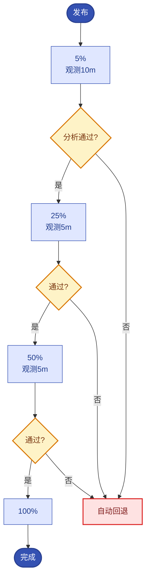

# 第10章【L1→L2 过渡】灰度发布与生产变更风险治理
<!-- 第三篇 声明式交付体系 ｜ 常规章（极简流量·单案例·严控边界） ｜ 状态：终审中 -->

> 本章定位：讲清灰度发布与变更风险治理——极简流量，仅用一种主流流量实现做单案例通透演示，聚焦「灰度观测 → 判断 → 回滚」核心链路，不罗列、不对比多网关 / Service Mesh 体系。
> **主线定位**：L1 → L2 过渡——灰度是受控的状态迁移，变更风险护栏与观测决策的雏形；Agent 引擎的 prompt/模型变更走评测门禁不直接上线（15.5② 护栏），其工程原型就是灰度。**承上启下**：承第 9 章交付；启第 11 章可观测（灰度判断靠观测校验）。

---

本章核心图——金丝雀"流量阶梯 + 观测-判断-回滚"闭环：



## 10.1 生产变更核心风险：版本冲突、流量波动、隐性故障、环境不一致

### 生产问题

团队每次发版都像赌博：全量切换新版本，要么成功要么出事，出事就全量回滚再赌。某次全量发布引入一个隐性 bug（低概率触发但影响严重），直到影响大面积用户才被发现，紧急全量回滚又引发流量波动。**没有灰度的全量发布，把变更风险一次性全部押上，事故影响面 = 100% 用户**；同样这个 bug 若在 5% 灰度段暴露，影响面 ≤5%（体感：5% 流量 ≈ 每 20 个用户里 1 个拿到新版），差 20 倍。

### 传统方案失效原因

- **全量发布**：新旧版本一刀切，无渐进过渡，风险全量暴露。
- **无流量切分**：没有按比例灰度，无法"小流量验证再扩大"。
- **无自动熔断**：灰度期发现异常靠人盯，反应慢，损失扩大。
- **环境不一致放大风险**：dev 验证过的 prod 行为不同，全量发布踩坑。

失效根因：**没有把变更从"全量赌"变成"渐进验证 + 随时回退"**。灰度发布的核心价值就是让变更可控、可观测、可回退。

### 架构约束与权衡

变更风险与灰度策略：

| 风险 | 全量发布 | 灰度发布 |
|---|---|---|
| **版本冲突** | 全量切换，冲突全暴露 | 渐进引入，冲突在小流量暴露 |
| **流量波动** | 回滚即波动 | 灰度回退，波动小 |
| **隐性故障** | 全量用户受影响 | 小流量先发现，影响面小 |
| **环境不一致** | prod 直接踩坑 | 灰度在 prod 真实环境小流量验证 |

数字对比（10 副本服务、SLO 99.9%）：全量发布出险影响 100% 用户、回滚需重新铺满全部副本（约 3–5 分钟）；5% 起步的金丝雀出险影响 ≤5%、abort 后流量秒级回 stable（10.3）。

权衡的核心：**灰度用"渐进 + 观测 + 回退"换"低风险变更"**。代价是发布流程更长（标准阶梯 20–50 分钟），但事故影响面从全量降到小比例。

### 最小可行方案

1. **不全量**：任何 prod 变更走灰度（金丝雀），不全量切换。
2. **小流量验证**：先 5% 流量到新版本，观测关键指标（窗口 ≥10 分钟）。
3. **自动熔断**：灰度期指标异常自动回退，不靠人盯。
4. **逐步扩大**：指标正常按 5%→25%→50%→100% 放大流量，直至全量。

### 生产落地实现

**① 存量 Deployment 零停机迁移为 Rollout**（灰度能力的第一步——不改工作负载类型，一切灰度都无从谈起）：

```bash
# 1) 导出现有 Deployment，改造为 Rollout：改 apiVersion/kind，删 spec.strategy.rollingUpdate，
#    换成 strategy.canary（完整制品见 10.2），selector/template 原样保留
kubectl -n prod get deploy demo-api -o yaml > demo-api-rollout.yaml

# 2) 孤儿化删除旧 Deployment（Pod 不删、流量不断），立刻 apply Rollout 接管
kubectl -n prod delete deploy demo-api --cascade=orphan   # kubectl <1.21 用 --cascade=false
kubectl -n prod apply -f demo-api-rollout.yaml

# 3) 验证接管成功（副本数、镜像、Pod 均不变，仅控制权转移）
kubectl argo rollouts get rollout demo-api -n prod
```

- **云服务映射**：Rollouts controller 以普通无状态工作负载安装在托管集群（ACK Pro 主参考 / EKS 对照）即可，无需特权与独占节点；镜像走 ACR 免密拉取（云身份 RRSA/IRSA，4.2）。灰度切分发生在 Ingress 层，云侧 NLB/SLB 全程无感知（7 章 CCM 自动建），**回滚永远打不到云资源层**——这是托管生态下灰度链路最省心的一段。规模取舍：自研等价灰度平台约 2 人月起步，Rollouts 开源零许可成本、一个 YAML 落地。

### 典型故障案例

某次全量发布引入低概率死锁 bug，上线 1 小时后才触发，影响 30% 用户才被发现。改金丝雀（先 5% 流量）后，同类 bug 在 5% 流量阶段就被错误率告警捕获，自动回退，影响面 < 5%。

点评：**灰度让"低概率 bug"在"小流量"阶段暴露**，而非等到全量爆发。

### 根因定位

根因不在某次 bug，而在**全量发布把风险一次性全暴露**。灰度把风险分阶段、小流量验证，是变更风险治理的基本手段。

### 长效治理方案

- 所有 prod 变更走灰度，禁全量切换。
- 小流量起步 + 指标观测 + 自动熔断。
- 逐步扩大，异常即退。
- 灰度期重点观测 SLO（第 11、12 章）。

### 自动化/自治闭环

灰度是 L2 运维自治（第 15 章）的**变更风险控制**：**灰度 + 自动熔断 + 回退，构成了变更的自治闭环——观测灰度指标 → 判断是否异常 → 自动处置（继续/暂停/回退）**。这让"变更"从人工全量赌，变成系统化的渐进验证闭环。

### 生产检查清单

- [ ] 所有 prod 变更是否走灰度（禁全量切换）？
- [ ] 存量服务是否已从 Deployment 迁移到 Rollout（`--cascade=orphan` 零停机路径）？
- [ ] 是否小流量起步（5%）+ 观测窗口 ≥10 分钟 + 自动熔断回退？
- [ ] 灰度期是否重点观测 SLO？

---

## 10.2 Argo Rollouts灰度、蓝绿、金丝雀核心发布模型与生产实操

### 生产问题

团队想做灰度，但不确定选哪种模型：蓝绿、金丝雀、还是滚动？各模型的代价和适用场景不清，选错模型要么浪费资源（蓝绿常备双倍），要么控制粒度不够（滚动无流量切分）。**发布模型选型不当，灰度的成本与效果都不理想**。

### 传统方案失效原因

- **模型混淆**：不理解蓝绿/金丝雀/滚动的差异，选错。
- **用滚动当灰度**：滚动更新无精确流量切分，不是真灰度。
- **蓝绿资源浪费**：常备双倍环境，成本高。
- **金丝雀不会配**：金丝雀需要流量切分 + 分析，配置复杂，不敢用。

失效根因：**没有理解各发布模型的权衡并选对模型**。

### 架构约束与权衡

三种发布模型的适用边界与切换耗时量级：

| 模型 | 机制 | 切换耗时量级 | 适合 | 代价/不适合 |
|---|---|---|---|---|
| **滚动更新** | 逐批替换 Pod，流量按副本比例近似分配 | 10 副本约 2–3 分钟（批数 × 就绪时间） | 低风险变更、无状态服务、资源紧张 | 无精确流量切分——首批新 Pod 上线即接约 1/N 流量，隐性 bug 直接可见 |
| **蓝绿** | 双环境并存，Service 指向一次性切换 | 秒级（Service selector 切换即生效） | 需瞬时切换、验收严格的场景（如强版本一致性要求） | 双倍资源；全有或全无，无渐进观察 |
| **金丝雀** | 按权重渐进切流 + 每级观测分析 | 阶梯总时长 ≈ 20–50 分钟（观测窗之和，可调） | 绝大多数 prod 变更 | 配置最复杂（流量切分 + 分析模板） |

权衡的核心：**金丝雀是变更风险治理的最佳平衡——精确流量控制 + 渐进验证 + 资源可控**。蓝绿适合需瞬时切换的场景，滚动只适合低风险变更。本书推荐金丝雀（Argo Rollouts）作为 prod 变更主力模型。注意——"必须瞬时切换"的强制蓝绿、"随便滚动"的偷懒滚动，都是反模式。

选定金丝雀后，**阶梯步长（5%→25%→50%）与每级停顿时长**同样不是拍脑袋，取决于（变量表）：

| 决策变量 | 倾向小步长 + 长停顿 | 倾向大步长 + 短停顿 |
|---|---|---|
| 变更风险等级 | 核心链路/接口契约变更（L1 级，观测窗 10m/10m/15m，10.4） | 低风险配置变更（L3：`promote --full` 快进 + 全量后观测） |
| 流量形态 | 低频/稀疏流量——样本攒得慢，停顿不够长则成功率无统计意义 | 平滑大流量——数分钟即可攒足判定样本 |
| 观测成熟度 | SLI 口径新上线、阈值无历史基线，拉长窗口防误判误退 | 指标久经考验、阈值有基线背书，可按标准窗走 |

一句话锚点：**停顿时长决定异常暴露窗口（影响面×时间）——"发现问题时已有多少用户×分钟暴露在新版下"；在变更域的作用类似 RPO（7.4 的定义是数据丢失窗口，此处借用其"窗口"语义）；步长是每级赌注的大小**。两者合起来回答同一个问题：出事时你愿意赔多少。

### 最小可行方案

落到金丝雀（本书默认实例）的最小实操五件套：

1. **装**：ACK/EKS 上安装 Argo Rollouts controller + kubectl 插件。
2. **换**：Deployment 换成 Rollout，加 `strategy.canary`（10.1 迁移路径）。
3. **阶梯**：定义流量阶梯 5%→25%→50%→100%，每级 pause 观测。
4. **双 Service**：stable/canary 两个 Service 承接切分（回滚预案的承接物）。
5. **分析**：后台挂 AnalysisTemplate，查 VictoriaMetrics，异常自动回退（10.3）。

### 生产落地实现

**① 安装 controller 与 kubectl 插件**（生产建议经 Helm chart 由 ArgoCD 托管安装，与 9 章实践一致；此处为快速起跑形式）：

```bash
# controller：部署在托管集群（ACK/EKS），普通 Deployment，无特权要求
kubectl create namespace argo-rollouts
kubectl apply -n argo-rollouts -f \
  https://github.com/argoproj/argo-rollouts/releases/latest/download/install.yaml

# kubectl 插件（linux-amd64 为例；macOS 换 darwin-amd64/arm64 包名）
curl -LO https://github.com/argoproj/argo-rollouts/releases/latest/download/kubectl-argo-rollouts-linux-amd64
chmod +x kubectl-argo-rollouts-linux-amd64
sudo mv kubectl-argo-rollouts-linux-amd64 /usr/local/bin/kubectl-argo-rollouts
kubectl argo rollouts version
```

**② 完整 Rollout 制品**（金丝雀阶梯 + NGINX 流量路由 + 后台分析，10 副本参考值）：

```yaml
apiVersion: argoproj.io/v1alpha1
kind: Rollout
metadata:
  name: demo-api
  namespace: prod
spec:
  replicas: 10
  revisionHistoryLimit: 3              # 可调: 保留历史版本数，决定 undo 能回几步
  selector:
    matchLabels: { app: demo-api }
  template:
    metadata:
      labels: { app: demo-api }
    spec:
      containers:
      - name: demo-api
        image: registry.cn-hangzhou.aliyuncs.com/demo/demo-api:v1.4.2   # ACR；EKS 对照 ECR 仓库地址
        ports: [ { containerPort: 8080 } ]
        readinessProbe:                 # 生产禁改: 无就绪探针的灰度会把流量打给未就绪 Pod
          httpGet: { path: /healthz, port: 8080 }
          initialDelaySeconds: 5
        resources:
          requests: { cpu: 250m, memory: 512Mi }
          limits: { cpu: "1", memory: 1Gi }
  strategy:
    canary:
      stableService: demo-api-stable    # 双 Service：稳定版入口（abort 时流量的回流点）
      canaryService: demo-api-canary    # 双 Service：灰度版入口
      trafficRouting:
        nginx:                          # 单案例流量实现：NGINX Ingress（10.5 通透演示）
          stableIngress: demo-api       # 引用下面的 stable Ingress 名
      maxSurge: 25%                     # 可调: 灰度期允许的额外容量上限
      maxUnavailable: 0                 # 生产禁改: 灰度期不接受计划内不可用副本
      analysis:                         # 后台分析：灰度全程每 1m 测一次，失败达限自动 abort（10.3）
        templates:
        - templateName: success-rate
      steps:                            # 阶梯：5% →10m→ 25% →5m→ 50% →5m→ 100%（时长均可调）
      - setWeight: 5
      - pause: { duration: 10m }        # 可调: 首窗必须最长——影响面最小、暴露率最高
      - setWeight: 25
      - pause: { duration: 5m }         # 可调: 核心服务建议 10m（10.4 L1 级）
      - setWeight: 50
      - pause: { duration: 5m }         # 可调: 核心服务建议 15m（10.4 L1 级）
      - setWeight: 100
```

要点：开启 `trafficRouting` 后，`setWeight` 驱动的是**真实流量权重**（NGINX canary 注解保证），canary 副本数仅按权重近似换算（10 副本下 5%≈1 个、25%≈3 个、50%=5 个）——流量精度不受副本取整影响，这正是"精确切分"区别于"滚动近似"的地方。

**③ 双 Service + stable Ingress**（灰度的流量骨架）：

```yaml
apiVersion: v1
kind: Service
metadata:
  name: demo-api-stable                 # 始终指向当前稳定版本
  namespace: prod
  labels: { app: demo-api }
spec:
  selector: { app: demo-api }           # Rollouts 自动注入 pod-template-hash 区分 stable/canary
  ports: [ { name: http, port: 8080, targetPort: 8080 } ]
---
apiVersion: v1
kind: Service
metadata:
  name: demo-api-canary                 # 灰度期指向新版本
  namespace: prod
  labels: { app: demo-api }
spec:
  selector: { app: demo-api }           # 同上，勿手工写死 hash——控制器负责改写
  ports: [ { name: http, port: 8080, targetPort: 8080 } ]
```

```yaml
apiVersion: networking.k8s.io/v1
kind: Ingress
metadata:
  name: demo-api                        # 与 stableIngress 同名，主入口
  namespace: prod
spec:
  ingressClassName: nginx
  rules:
  - host: api.example.com
    http:
      paths:
      - path: /
        pathType: Prefix
        backend:
          service:
            name: demo-api-stable       # 主入口指向 stable Service
            port: { number: 8080 }
```

控制器会在灰度期自动创建 `demo-api-canary` Ingress（打 `nginx.ingress.kubernetes.io/canary: "true"` 与 `canary-weight` 注解、指向 canary Service），权重随 `setWeight` 变化；**这个 canary Ingress 由控制器全权管理，手工改它会被覆盖**。

**④ AnalysisTemplate**（后台分析制品，指标源为 VictoriaMetrics）：

```yaml
apiVersion: argoproj.io/v1alpha1
kind: AnalysisTemplate
metadata:
  name: success-rate
  namespace: prod
spec:
  metrics:
  - name: success-rate
    interval: 1m                         # 可调: 测量间隔，后台分析全程每分钟测一次
    successCondition: result[0] >= 0.99  # 可调: 阈值取历史基线（12.2 SLI 口径），勿拍脑袋
    failureLimit: 3                      # 可调: 失败测量达到上限即判 Failed → 自动 abort（精确语义以官方文档为准）
    provider:
      prometheus:
        address: http://vmsingle-vmstack.observability.svc:8428   # VictoriaMetrics 查询入口（11 章）
        query: |
          sum(rate(http_requests_total{version="canary",code!~"5.."}[5m]))
          /
          sum(rate(http_requests_total{version="canary"}[5m]))
```

两个使用要点：业务指标必须带 `version` 标签（由网关或 OTel 采集器按后端 Pod 版本注入，11 章），否则 stable/canary 分不开；canary 未接流量时查询可能为空，空结果按 Inconclusive/Error 处理（版本行为有差异，以官方文档为准），因此首个观测窗必须放在 `setWeight: 5` 之后。若要做"逐级闸门"式判定，把 `analysis` 移入 `steps` 并加 `count`（如 `count: 5`，5 次 × 1m 出闸），字段语义相同。

**参数化复用（args）**：把写死的阈值（success-rate ≥ 0.99）改为 args 参数，多个 Rollout 复用同一模板、阈值统一演进——全局收紧阈值只改模板一处：

```yaml
# AnalysisTemplate spec 片段：阈值参数化（占位符必须用具名写法 {{args.threshold}}；
# {{args[0].value}} 是 Argo CD 的语法，Rollouts 不做替换）
spec:
  args:
  - name: threshold
    value: "0.99"              # 默认值，引用方可覆盖
  metrics:
  - successCondition: result[0] >= {{args.threshold}}
```

Rollout 引用处（`analysis` 块内、与 `templates:` 平级）传入覆盖值：

```yaml
        args:
        - name: threshold
          value: "0.98"
```

集群级模板用 ClusterAnalysisTemplate，跨命名空间全局复用（AnalysisRun 仍在 Rollout 所在命名空间执行）。

**⑤ 蓝绿对照制品**（仅此一段，供瞬时切换场景对照）：

```yaml
strategy:
  blueGreen:
    activeService: demo-api-active       # 现役版本入口
    previewService: demo-api-preview     # 预览版本入口（验收用，不接生产流量）
    autoPromotionEnabled: false          # 生产禁改: 必须人工验收后手动 promote，防"发了就全量"
    scaleUpDelaySeconds: 30              # 可调: preview 就绪后的预热观察
```

**⑥ 观测**：Grafana 建 canary vs stable 对比面板（成功率/p99/业务指标，11 章栈），发布全程一条曲线分两色，异常一眼可辨。**云服务映射**：以上全部跑在 ACK Pro（对照 EKS）；镜像 ACR/ECR；NGINX Ingress 的 Service 由 CCM 自动挂阿里云 NLB（对照 ELB）——灰度只动集群内 Ingress 注解，云 LB 不参与变更。**数字参考**：标准阶梯总时长 20 分钟（10m+5m+5m，体感：一顿工作餐的间隙）+ 收敛 2–3 分钟；核心服务拉长到 30 分钟（10m+10m+15m）；每次灰度新增资源 = maxSurge 25% ≈ 2–3 个 Pod，远低于蓝绿的 100% 双倍。

### 典型故障案例

团队用滚动更新当灰度，结果一次变更虽"逐步替换 Pod"但流量仍按副本比例近似分配，新版 Pod 一上线就接 50% 流量，隐性 bug 直接影响半数用户。改 Argo Rollouts 金丝雀（精确 5% 起步）后，风险面可控。

点评：**滚动 ≠ 灰度**。滚动按副本比例近似分流，无精确流量控制；金丝雀才是真灰度。

### 根因定位

根因不在某次变更失败，而在**发布模型选错（滚动当灰度）**。模型选型决定灰度的真实效果。

### 长效治理方案

- prod 变更主力用金丝雀（Argo Rollouts），阶梯与分析模板入 chart 标准化（10.4）。
- 蓝绿仅用于需瞬时切换的特殊场景。
- 滚动仅用于低风险变更。
- 金丝雀配流量切分 + SLO 分析 + 自动回退。

### 自动化/自治闭环

Argo Rollouts 把灰度变成**声明式的发布自治**：**Rollout 声明金丝雀步骤 + 分析，Argo Rollouts controller 按步骤推进、按分析决策**，与第 5 章声明式调谐一脉相承。发布过程从手工操作变成声明式自洽，是 L2 变更自治的核心载体。

### 生产检查清单

- [ ] prod 变更是否主力用金丝雀（Argo Rollouts）？
- [ ] Rollout 是否定义了流量阶梯步骤（5%→25%→50%→100%）且保持 `maxUnavailable: 0`？
- [ ] 双 Service（stable/canary）与 stable Ingress 是否就绪、selector 未手工写死 hash？
- [ ] 每次发布是否挂钩 AnalysisTemplate（查 VM，异常自动回退）？
- [ ] 是否避免用滚动当灰度？蓝绿是否仅用于瞬时切换场景？

---

## 10.3 流量切分、版本熔断、异常自动回滚的闭环机制

### 生产问题

先做一个思想实验（先猜答案，再往下读）：

> 墨丘里商城 order-api（demo-api）的 v1.5.0 已放出 5% 金丝雀，Grafana 面板上 canary 错误率开始缓涨——每分钟 +0.2%，从 0.1% 一路往上爬。值班工程师就坐在 dashboard 前。**先猜：人盯面板，多久能发现？**

认真想十秒。揭晓：**40 分钟后才有第一个人注意到**。人眼对缓变天然不敏感（煮青蛙效应）：面板每 30 秒刷新一帧，0.3%、0.5%、0.7%……每一帧单看都"还行"，没有哪一帧醒目到拉响心里的警报；等曲线爬到肉眼刺眼时，5% 的用户已经在坏版本上泡了 40 分钟。换 AnalysisTemplate 接管同一场景：每 1 分钟自动查一次、连续 3 次（failureLimit）不达标即熔断——**检出时延 = 轮询间隔 × 阈值 ≈ 3–4 分钟封顶，这是契约，不是运气**。这就是自动分析存在的理由：它不比人聪明，它只是不会走神、不会夜间犯困。

团队配了金丝雀，但流量切分不精确（按副本近似）、熔断靠人盯（值班盯着 dashboard 决定是否回退）、回滚靠手动（手动触发，慢且易错）。**灰度的三个关键环节（切分/熔断/回滚）不自动化，灰度就退化成"有形式无效果"**——看起来在灰度，实际风险控制全靠人。

### 传统方案失效原因

- **流量切分不精确**：按副本数近似分流，不是真实流量比例。
- **熔断靠人**：人盯指标决定回退，反应慢、夜间无人盯。
- **回滚手动**：手动触发回退，慢且可能操作失误。
- **三者不闭环**：切分/熔断/回滚各自独立，没形成自动闭环。

失效根因：**灰度三环节未自动化闭环**。灰度的价值在"自动快速反应"，靠人则反应慢、不可靠。

### 架构约束与权衡

灰度自动闭环三环节：

| 环节 | 自动化要求 | 权衡 |
|---|---|---|
| **流量切分** | 精确按比例（非副本近似） | 需流量实现支持（10.5 NGINX 单案例） |
| **版本熔断** | 指标阈值自动判定 | 阈值设定需历史基线 |
| **自动回滚** | 异常自动回退，无需人工 | 自动 vs 可控（设回退边界） |

灰度自动闭环的保证等级表（你到底买到了什么——读法同 5.3 调谐闭环契约表）：

| 保证维度 | 承诺 | 不承诺 |
|---|---|---|
| **异常检出时延** | 有上限：interval × failureLimit（1m × 3 ≈ 3–4 分钟封顶），规则驱动、夜间照常 | 捕捉规则外的异常形态——只能测声明进 AnalysisTemplate 的指标，没写的维度一律看不见 |
| **回滚触发** | 确定性：同样的测量结果必触发同样的动作（abort），无情绪、无疲劳 | 阈值本身的正确性——口径设错就误退/漏退，阈值必须来自历史基线（12.2） |
| **发布影响面** | 失败只赔当前权重（≤5%/25%/50%），赌注逐级递增 | 零影响发布——金丝雀承接的是真实流量，进入 5% 那一刻就有真实用户拿到新版 |

"不承诺"两行正是 10.4 流程存在的理由：规则外的形态靠标准观测项与人工研判兜底（业务指标先人工 abort，见下文判定表第三行）；"非零影响"靠小步长把每次赔注压到最小。

权衡的核心：**三环节自动化构成"切分→观测→熔断→回滚"的闭环**，代价是需精确流量实现 + 准确阈值 + 合理回退边界。但这是灰度真正有效的必要条件。

### 最小可行方案

1. **精确切分**：Rollout 开 `trafficRouting`（NGINX 实现，10.5）。
2. **自动熔断**：后台 Analysis 每 1m 查 VM 指标，失败测量达 failureLimit 判负。
3. **自动回滚**：分析判负 → Rollout 自动 abort，流量全回 stable。
4. **边界保护**：阈值基于历史基线（非随意设），避免正常波动触发误回退。

### 生产落地实现

**① 自动熔断→回滚机制**（10.2 制品的运行时行为，逐链路拆解）：

```text
后台 AnalysisRun（interval 1m 持续测量）
  └─ 某次测量 successCondition 不满足 → 记 1 次 Failed
      └─ Failed 次数达到 failureLimit(3) → AnalysisRun 判 Failed
          └─ Rollout 自动 abort：
             ① canary Ingress 权重归零/移除 → NGINX 全量回 stable Service（秒级）
             ② canary 副本缩 0（约 30s–1m）
             ③ Rollout 状态置 Degraded（ArgoCD 界面同步可见，9 章）
```

从首次指标劣化到流量回 stable：1m 测量间隔 × 失败上限 ≈ **3–4 分钟内全自动完成——一集短视频的时长，夜间无人值守同样生效**（failureLimit 达到/超过上限的精确语义以官方文档为准，按保守口径设计观察时长）。

语义补全（两类失败分开计数）：Measurement 失败分两类——**指标不达标**（successCondition 判负）累计计 `failureLimit`；**查询本身报错**（Prometheus 不可达、PromQL 语法错）连续计 `consecutiveErrorLimit`（默认 4），连续达限同样判负触发 abort。因此检出时延契约应按 max(interval×failureLimit, interval×consecutiveErrorLimit) 保守估算（1m 间隔、3/4 上限时两类均为 3–4 分钟封顶；精确语义以官方文档为准）。

**② 人工介入命令表**（自动兜底之上，人保留四个动作）：

| 命令 | 作用 | 典型场景 |
|---|---|---|
| `kubectl argo rollouts get rollout demo-api -n prod --watch` | 实时看阶梯/权重/副本 | 发布全程 |
| `kubectl argo rollouts abort demo-api -n prod` | 手动中止：流量立刻全回 stable | 人工判定异常（如业务指标跌） |
| `kubectl argo rollouts undo demo-api -n prod` | 回退到上一 revision | abort 后彻底回版本 |
| `kubectl argo rollouts promote demo-api -n prod` | 跳过当前观测窗进下一阶 | 观测提前达标 |
| `kubectl argo rollouts promote demo-api -n prod --full` | 跳过剩余全部 pause 直接全量 | 低风险变更快进 |
| `kubectl argo rollouts status demo-api -n prod` | 查状态/退出码 | CI 流水线判定发布成败 |
| `kubectl argo rollouts dashboard` | 本地起 UI（默认 localhost:3100） | 排障可视化 |

**③ 回滚实战序列**（夜间值班照抄即可）：

```bash
# 1) 人工判定异常 → 一键中止，流量秒级回 stable
kubectl argo rollouts abort demo-api -n prod
# 2) 验证回退生效：canary Ingress 应消失（权重归零）
kubectl -n prod get ingress demo-api-canary 2>/dev/null || echo "canary ingress 已移除，流量全在 stable"
# 3) abort 只切流量，坏版本仍在修订历史里 → 彻底回上一稳定版本
kubectl argo rollouts undo demo-api -n prod
# 4) Git 真相源回写（2h 内，12.3 应急白名单制度）：revert 坏 tag 提交，
#    否则 ArgoCD auto-sync 会把坏版本再拉回来（9 章）
```

**④ 回滚判定指标表**（什么指标、什么阈值、触发什么动作）：

| 判定指标 | 阈值（参考值，可调） | 动作 | 时效 |
|---|---|---|---|
| canary 成功率（AnalysisTemplate） | < 99% 且失败测量达 failureLimit=3 | 自动 abort，流量回 stable | ≤4 分钟全自动 |
| canary p99 延迟 | > stable 基线 × 1.5 持续 5 分钟 | 加一条同口径 metric 自动 abort，或人工 abort | 5–10 分钟 |
| 业务指标（下单率/转化率） | 同比跌 >10% 持续 10 分钟 | 人工 abort（口径复杂，先人工研判） | 10 分钟级 |
| 错误预算 burn（12.2） | 预算剩余 <25% | 新灰度比例减半；**预算耗尽 → 禁止一切新灰度**，只允许回滚/稳定性修复变更（12.2 四档联动） | 发布前置校验 |

- **云服务映射**：指标源是自建可观测栈（VictoriaMetrics/Grafana，11 章）跑在 ACK 上——每灰度仅 1 条/分钟的分析查询，vmsingle 小规格即可承载几十个并发灰度；错误预算联动复用 12.2 的 burn-rate 告警与 Grafana 预算看板，不新建系统。
- **数字参考**：自动回退影响面 = 当前权重（≤5%/25%/50%），恢复时长 ≈ 秒级切流 + 副本缩容 1 分钟；对照人工回退平均 15–30 分钟（叫醒、研判、操作——体感：够看完半集电视剧），快一个数量级。

### 典型故障案例

团队金丝雀靠人盯，凌晨发布值班睡着，灰度版错误率飙升 2 小时未回退，影响扩大。配自动熔断 + 回滚后，错误率超阈值 1 分钟内自动回退。

点评：**灰度不自动 = 形同虚设**，尤其夜间。自动闭环才是真灰度。

### 根因定位

根因不在值班失职，而在**灰度三环节未自动闭环**。靠人的灰度必然有反应延迟和盲区。

### 长效治理方案

- 精确流量切分（按权重，非副本近似）。
- 自动熔断（SLO 指标阈值，failureLimit 限次）。
- 自动回滚（分析失败即 abort）+ 人工四动作（abort/undo/promote/--full）。
- 阈值基于历史基线防误退；预算耗尽冻结新灰度（12.2）。

### 自动化/自治闭环

本节是 L2 运维自治（第 15 章）变更自治的**完整闭环**：**切分→观测→熔断→回滚，全是自动的，构成"观测→判断→处置→校验"的自治模式**。这正是第 15 章运维自治闭环在变更领域的体现——变更不再依赖人盯，而是系统自动感知异常、自动回退。

### 生产检查清单

- [ ] 流量切分是否精确按权重（trafficRouting 已开启，非副本近似）？
- [ ] 是否自动熔断（Analysis 查 VM、failureLimit 限次）→ 失败自动 abort 且流量秒级回 stable（演练验证过）？
- [ ] 人工四动作命令表是否进值班手册？
- [ ] 熔断阈值是否基于历史基线（防误退）？
- [ ] 预算耗尽时是否冻结新灰度（与 12.2 四档联动）？
- [ ] 团队对保证等级表有共识（检出时延上限 = interval×failureLimit；规则外异常形态与"零影响发布"不在承诺内）？

---

## 10.4 生产变更全流程管控：评审、灰度、观测、复盘标准化规范

### 生产问题

团队的变更流程松散：变更不评审（直推）、灰度无标准（每次不同）、观测不系统（靠看几个面板）、出事不复盘（或复盘流于形式）。**变更全流程无标准化，每次变更质量取决于执行人，事故反复发生**。

### 传统方案失效原因

- **无评审**：变更不经评审，设计缺陷直达 prod。
- **灰度无标准**：每次灰度步骤不同，质量不稳。
- **观测不系统**：灰度期看什么指标、看多久，无规范。
- **复盘形式化**：出事复盘不深挖根因、不落地整改。

失效根因：**变更全流程没有标准化规范**。变更质量靠个人，必然波动且事故反复。

### 架构约束与权衡

变更全流程标准化（分支保护、权限矩阵、晋升通道已在 9.8 定死，本章不重复，只管"风险分级 + 发布门槛"）：

| 阶段 | 规范 | 权衡 |
|---|---|---|
| **评审** | 变更 MR 评审（影响面/回退方案/观测项） | 流程开销 vs 质量 |
| **灰度** | 标准金丝雀阶梯（10.2 制品为模板） | 标准 vs 灵活 |
| **观测** | 标准观测项（SLO + 业务指标 + 观测窗时长） | 系统化 vs 随意 |
| **复盘** | 标准复盘（12.3 五字段模板） | 深度 vs 速度 |

权衡的核心：**标准化用流程纪律换变更质量稳定**。前期定规范有成本，后期每次变更质量稳定、事故递减。

### 最小可行方案

1. **评审**：变更 MR 必含影响面/回退方案/观测项，按变更级别走对应审批（见下表）。
2. **灰度**：标准金丝雀模板（10.2 Rollout 制品 + AnalysisTemplate）。
3. **观测**：标准观测清单（错误率/延迟/业务指标 + 观测窗 10m/5m/5m）。
4. **复盘**：事故复盘复用 12.3 五字段模板，整改跟踪到关闭。

### 生产落地实现

**① 发布前五道硬门槛**（可运行制品——CI 阶段 job 或发布流水线第一步，任一 FAIL 阻断发布）：

```bash
#!/usr/bin/env bash
# 发布前五道硬门槛：探针/PDB/回滚预案/观测面板/错误预算
set -euo pipefail
NS=prod; APP=demo-api; VM=http://vmsingle-vmstack.observability.svc:8428

# 门槛 1 探针就绪：readinessProbe 必须存在（无探针=未就绪 Pod 接流量）
kubectl -n $NS get rollout $APP \
  -o jsonpath='{.spec.template.spec.containers[*].readinessProbe}' \
  | grep -q '.' || { echo "FAIL-1 无就绪探针"; exit 1; }
# 注：只校验 readinessProbe 对象存在，探针类型不限（httpGet/tcpSocket/exec）——
# 若只查 httpGet.path 会误拦 tcpSocket/exec 型探针的服务

# 门槛 2 PDB：节点池自动修复/升级（4.2/4.4）不打穿服务
kubectl -n $NS get pdb $APP >/dev/null || { echo "FAIL-2 无 PDB"; exit 1; }

# 门槛 3 回滚预案：双 Service 就绪（abort 后流量的承接物，10.2）
kubectl -n $NS get svc ${APP}-stable ${APP}-canary >/dev/null \
  || { echo "FAIL-3 双 Service 缺失，回滚无承接"; exit 1; }

# 门槛 4 观测面板就绪：Analysis 查询通道可用（VM 返回 success 即指标链路通，11 章）
curl -sf "$VM/api/v1/query" --data-urlencode \
  'query=sum(rate(http_requests_total{version="stable"}[5m]))' \
  | jq -e '.status=="success"' >/dev/null || { echo "FAIL-4 指标通道异常"; exit 1; }

# 门槛 5 错误预算剩余 >25%：30 天累计错误率烧掉的预算必须 <75%（12.2 四档）
BURNED=$(curl -sf "$VM/api/v1/query" --data-urlencode \
  'query=sum(increase(http_requests_total{job="'$APP'",code=~"5.."}[30d]))/sum(increase(http_requests_total{job="'$APP'"}[30d]))/0.001' \
  | jq -r '.data.result[0].value[1] // "nan"')
awk -v b="$BURNED" 'BEGIN{ if (b=="nan" || b+0>=0.75) exit 1 }' \
  || { echo "FAIL-5 错误预算剩余不足 25%（已烧 $BURNED）——只允许稳定性修复变更（12.2）"; exit 1; }

echo "五门槛全部通过，允许进入灰度"
```

（`/0.001` 为 SLO 99.9% 的允许错误率，SLO 99.95% 换 `/0.0005`——与 12.2 口径一致。）

**② 变更分级审批表**（分级审批与 9.8 的分支保护/权限矩阵衔接：9.8 定"谁能合、走哪条分支"，本表定"合之前要几个审批、灰度怎么走"）：

| 级别 | 典型变更 | 审批 | 灰度策略（阶梯见 10.2 制品） |
|---|---|---|---|
| **L1 核心服务变更** | 核心链路镜像/依赖升级/接口契约变更 | **双审批**（服务 owner + SRE/平台） | 标准阶梯 5%→25%→50%→100%，观测窗 10m/10m/15m |
| **L2 常规变更** | 非核心服务镜像、常规迭代 | 单审批（服务 owner） | 快车道 5%→25%→50%→100%，观测窗 10m/5m/5m |
| **L3 低风险配置** | 副本数/资源配额/HPA 阈值微调 | 单审批（owner 或当值） | `promote --full` 快进 + 全量后观测 ≥10m |

- **云服务映射**：发布窗口避开 ACK 节点池自动升级维护窗（4.2 建议的凌晨窗口）与业务高峰——变更叠变更是最经典的事故放大器；审批流落在 Git 平台的 MR 评审（9.8 分支保护），门槛脚本落在 CI（8 章流水线），全部复用现有云上 GitOps 链路，无新增平台。
- **数字参考**：观测窗合计——L1 约 35 分钟（含收敛）、L2 约 23 分钟、L3 约 10 分钟；冻结期（大促/重保）全级别禁止发布；预算 <25% 时 L1/L2 自动降级为"仅稳定性修复"（门槛 5 拦截）。

**③ 数据库 Schema 变更的不可逆边界**（变更治理的缺角）：GitOps 回滚救不了已执行的 DDL——镜像 revert 秒级生效，`ALTER TABLE` 却没有 undo。数据库变更采用 **expand-contract** 三段式：先加新列不删旧列（expand）→ 双写迁移数据（migrate）→ 确认稳定后再删旧列（contract），每步独立发布、独立可回滚；PR 模板的"回滚方案"字段对含 DB 变更的 MR 强制标注**不可逆边界**（哪些 DDL 一旦执行无法回退、对应的前向修复方案）。一句话点题：**镜像回滚秒级、数据回滚不存在**——认清这条边界，是灰度治理的最后一块拼图。

### 典型故障案例

某团队变更无评审，一次配置错误直推 prod 引发事故，且无回退方案，恢复耗时数小时。引入 MR 评审 + 五门槛后，类似错误在评审阶段被拦截两次（回退方案缺失、预算不足 25%），从未再进灰度。

点评：**评审是变更的第一道闸**，门槛脚本是第二道，回退方案是安全网——三层缺一不可。

### 根因定位

根因不在某次配置错误，而在**变更全流程无标准化**。流程松散，变更质量靠人，事故必然反复。

### 长效治理方案

- 变更 MR 强制评审（影响面/回退/观测项）+ 分级审批表（L1 双审批）。
- 五门槛脚本进 CI，不过不放行。
- 金丝雀模板与观测清单标准化（10.2/10.5）。
- 事故复盘复用 12.3 五字段模板 + 整改闭环跟踪。

### 自动化/自治闭环

变更全流程标准化是自治的**质量基线**：**自治（灰度自动/回退自动）让变更高效，标准化（评审/门槛/复盘）让变更可靠**。两者结合，变更既有自动化的速度，又有标准化的质量保障。这连接 L2 变更自治与 L2 治理规范。

### 生产检查清单

- [ ] 变更 MR 是否强制评审（含回退方案/观测项/影响面），L1 核心变更双审批、观测窗 10m/10m/15m？
- [ ] 含 DB 变更的 MR 是否标注"不可逆边界"、Schema 变更按 expand-contract 分步执行？
- [ ] 发布前五门槛脚本是否进 CI（探针/PDB/双 Service/观测/预算）？
- [ ] 发布窗口是否避开节点池维护窗与业务高峰？
- [ ] 事故复盘是否复用 12.3 模板 + 整改闭环跟踪？

---

## 10.5 极简流量治理落地：仅选用一种主流流量实现做单案例通透演示，不罗列、不对比多网关/Service Mesh体系，聚焦「灰度观测-判断-回滚」核心链路

### 生产问题

团队想做精确流量切分（金丝雀的必要条件），但面对一堆选择（Nginx Ingress、各种网关、Service Mesh）无所适从，调研对比花了几周仍没落地。**流量实现的选择焦虑，让灰度的核心环节（精确切分）迟迟落不了地**。

### 传统方案失效原因

- **选择瘫痪**：罗列对比多种流量实现，反而无法决策。
- **过度设计**：为灰度引入完整 Service Mesh，重且超出需求。
- **忽视核心**：纠结工具选型，忽视灰度的核心是"观测-判断-回滚"链路。

失效根因：**把流量治理复杂化（罗列对比多体系），而非聚焦核心链路用一种实现通透落地**。

### 架构约束与权衡

极简流量治理原则：

| 原则 | 含义 | 权衡 |
|---|---|---|
| **一种实现通透** | 选一种主流流量实现（如 Ingress 控制器 + Rollouts 集成），单案例落地 | 简单 vs 功能全 |
| **聚焦核心链路** | 不罗列对比，聚焦"灰度观测-判断-回滚" | 核心性 vs 全面性 |
| **不做平台化** | 不为灰度引入完整 Service Mesh | 轻 vs 重 |

权衡的核心：**本书第一版坚持极简——一种实现、单案例、聚焦核心链路**。多网关/Service Mesh 全生态对比归 V2。这样读者能用最短路径落地灰度核心能力。

### 最小可行方案

本章选定的单案例实现（沿用原章选择，全书不再更换）：**NGINX Ingress（ingress-nginx）+ Argo Rollouts 的 `trafficRouting.nginx` 集成**——大多数集群第 7 章就已有这套入口，零新增组件。

1. **复用现有入口**：集群已有的 NGINX Ingress 控制器，不新装网关。
2. **配流量切分**：Rollout 声明 `trafficRouting.nginx.stableIngress`（10.2 制品）。
3. **跑通核心链路**：灰度发布 → 观测（VictoriaMetrics）→ 判断（Analysis）→ 回滚（自动）。
4. **不展开其他实现**：其他网关/Mesh 对比归 V2。

### 生产落地实现

**① 端到端 walkthrough**（10.2 制品的完整运行时间线：L2 常规变更、10 副本、快车道 10m/5m/5m）：

主角是墨丘里商城的订单服务 order-api（demo-api）——第 5 章里它还是一个 Deployment，本章起已是带金丝雀阶梯的 Rollout。大促在即，v1.5.0 要在午高峰前铺完，完整时间线如下：

| 时刻 | 动作（权重/副本/入口） | 看什么指标 | 失败在哪步、怎么回 |
|---|---|---|---|
| **T+0** | Git 合并新 tag → ArgoCD 同步 → Rollout 进 5%：canary 1 Pod、`canary-weight=5` | Pod Ready 爬升、canary 成功率起量 | Pod 起不来（镜像/探针/资源）：Rollout 卡在进度中，此时 canary 无流量，修 Git 重发即可，零用户影响 |
| **T+0–10m** | 观测窗 1（5%，影响面 ≤5%） | canary vs stable：成功率、p99、业务指标（Grafana 对比面板） | 成功率 <99% 连续劣化 → 后台分析 3–4 分钟内自动 abort，流量秒级回 stable；影响面锁定 ≤5% |
| **T+10m** | 自动进 25%：canary 3 Pod、weight=25 | 同上 + CPU/内存水位（25% 才见容量问题） | 同上（abort 影响面 ≤25%）；或人工 `abort` 一键回 |
| **T+15m** | 自动进 50%：canary 5 Pod、weight=50 | 同上 + 依赖容量（DB 连接、缓存命中率） | 同上（abort 影响面 ≤50%） |
| **T+20m** | 进 100%：stable 全部换新版本，canary Pod 归零、canary Ingress 移除 | 全量后 10 分钟持续看 burn-rate（12.2） | 已全量，abort 不再适用 → `kubectl argo rollouts undo` 回上一 revision（分钟级） |
| **T+23m** | 收敛完成：双 Service 同指新版本，发布关闭 | 面板全绿、错误预算无异常消耗 | 慢性劣化由 12.2 慢烧告警（6×）兜底 → 人工 undo |
| **T+25m** | 发布关闭，观测转常态（12.2 常驻告警） | — | — |

核心心法：**每一级都是"小赌注"——失败只赔当前权重，成功才进下一级**；全量后回退成本升一个量级，所以观测窗前置。

**② 全过程命令流**（跟着敲即可复现上表）：

```bash
# T+0 发布触发后，挂着看阶梯全程（权重/副本/分析状态一屏尽览）
kubectl argo rollouts get rollout demo-api -n prod --watch

# 任一时刻验证 NGINX canary 权重是否与 setWeight 一致（5/25/50）
# 注意：注解键中的点号需转义（nginx\.ingress\.kubernetes\.io/canary-weight）
kubectl -n prod get ingress demo-api-canary \
  -o jsonpath='{.metadata.annotations.nginx\.ingress\.kubernetes\.io/canary-weight}'; echo

# 观测：canary 成功率即时查询（也可直接看 Grafana 对比面板，11 章）
curl -s http://vmsingle-vmstack.observability.svc:8428/api/v1/query --data-urlencode \
  'query=sum(rate(http_requests_total{version="canary",code!~"5.."}[5m]))/sum(rate(http_requests_total{version="canary"}[5m]))' \
  | jq -r '.data.result[0].value[1]'

# 观测提前达标 → 人工快进一级；低风险 → 直接全量
kubectl argo rollouts promote demo-api -n prod
kubectl argo rollouts promote demo-api -n prod --full

# 任一时刻异常 → 一键回 stable（或等后台分析自动 abort）
kubectl argo rollouts abort demo-api -n prod
```

**③ 单案例边界与一句对照**：本章只通透演示 NGINX Ingress 这一种实现；阿里云 ALB Ingress 亦提供金丝雀注解（`alb.ingress.kubernetes.io/canary-*` 系列）且 Rollouts 内置对应的 ALB trafficRouting（AWS 侧为 ALB），支持细节以各官方文档为准——如需云托管流量层切分可自行平移，思路与本章完全同构，但第一版不展开。

- **云服务映射**：整套单案例跑在 ACK Pro（对照 EKS）；NGINX Ingress 的 Service 经 CCM 自动挂阿里云 NLB（对照 ELB）对外——**灰度切分全部发生在集群内 Ingress 注解层，云 LB 全程无感知**，这也是"灰度不出集群、回滚不碰云资源"的托管生态红利。
- **数字参考**：权重阶梯 5%→25%→50%→100%；观测窗 10m/5m/5m（核心服务 10m/10m/15m）；端到端 23–35 分钟；abort 切流秒级、副本缩容 ≤1 分钟。

### 典型故障案例

团队原本纠结选型，几周没落地。按极简原则用集群已有的 NGINX Ingress + Rollouts 集成，3 天跑通"灰度-观测-判断-回滚"核心链路，灰度能力即上线。后续若需更强流量能力，再评估 V2 的 Service Mesh。

点评：**先用一种实现把核心链路跑通，比纠结选型几周更有价值**。极简落地优先。

### 根因定位

根因不在选型难，而在**把流量治理复杂化**。聚焦核心链路、一种实现通透，是最短落地路径。

### 长效治理方案

- 一种主流流量实现（NGINX Ingress）+ Rollouts 集成，单案例落地，全书不换。
- 聚焦"灰度-观测-判断-回滚"核心链路。
- 不罗列对比多网关/Service Mesh（归 V2）。
- 核心能力先跑通，增强能力后续迭代。

### 自动化/自治闭环

极简流量落地让 L2 变更自治的**最后一块拼图到位**：**精确流量切分（本节）+ 自动熔断回滚（10.3 节）+ 标准化流程（10.4 节）= 完整的变更自治闭环**。从此 prod 变更从"人工全量赌"彻底演进为"声明式渐进验证 + 自动回退"，这正是核心业务闭环链路中"灰度变更治理"环节的落地。

### 生产检查清单

- [ ] 是否选定一种主流流量实现（NGINX Ingress）+ Rollouts 集成？
- [ ] 是否跑通"灰度-观测-判断-回滚"核心链路（walkthrough 时间线可复现）？
- [ ] canary 权重注解可实时验证，canary vs stable 指标可对比观测（Grafana + VM 查询）？
- [ ] 是否聚焦核心（不纠结多网关/Mesh 对比）？
- [ ] 是否明确其他流量实现归 V2？

> **下一章预告**：灰度判断依赖观测校验，第四篇由此开篇——第 11 章讲 OpenTelemetry 全域可观测：指标、日志、链路三支柱协同，数据底座在此建立。
