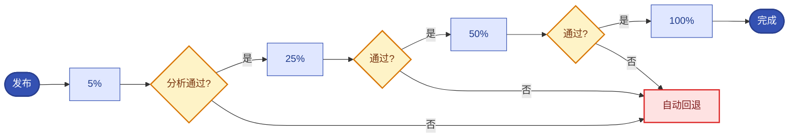

# 第11章 灰度发布与生产变更风险治理
<!-- 第三篇 声明式交付体系 ｜ 常规章（极简流量·单案例·严控边界） ｜ 状态：终审中 -->

> 本章定位：讲清灰度发布与变更风险治理。极简流量——仅选用一种主流流量实现做单案例通透演示，不罗列、不对比多网关 / Service Mesh 体系，聚焦「灰度观测-判断-回滚」核心链路。

> **技术栈锁死**：本章交付栈涉及组件 = Argo Rollouts（+ 一种主流流量实现做单案例）。不引入同类替代、不展开 Service Mesh 全生态。
> **去工具化**：本章讲的是"渐进发布 + 流量切分 + 观测-判断-回滚"的风险治理原理，Argo Rollouts 只是参考实例，换等价方案照样适用（详见 CONVENTIONS 三）。
> **边界声明**：多网关对比、Service Mesh 全生态、深度服务网格归 V2。

---

本章核心图——金丝雀"流量阶梯 + 观测-判断-回滚"闭环：



## 11.1 生产变更核心风险：版本冲突、流量波动、隐性故障、环境不一致

### 生产问题

团队每次发版都像赌博：全量切换新版本，要么成功要么出事，出事就全量回滚再赌。某次全量发布引入一个隐性 bug（低概率触发但影响严重），直到影响大面积用户才被发现，紧急全量回滚又引发流量波动。**没有灰度的全量发布，把变更风险一次性全部押上，事故影响面 = 全量用户**。

### 传统方案失效原因

- **全量发布**：新旧版本一刀切，无渐进过渡，风险全量暴露。
- **无流量切分**：没有按比例灰度，无法"小流量验证再扩大"。
- **无自动熔断**：灰度期发现异常靠人盯，反应慢，损失扩大。
- **环境不一致放大风险**：dev 验证过的 prod 行为不同，全量发布踩坑。

失效根因：**没有把变更从"全量赌"变成"渐进验证 + 随时回退"**。灰度发布的核心价值就是让变更可控、可观测、可回退。

### 架构约束与权衡

变更风险与灰度策略：

| 风险 | 全量发布 | 灰度发布 |
|---|---|---|
| **版本冲突** | 全量切换，冲突全暴露 | 渐进引入，冲突在小流量暴露 |
| **流量波动** | 回滚即波动 | 灰度回退，波动小 |
| **隐性故障** | 全量用户受影响 | 小流量先发现，影响面小 |
| **环境不一致** | prod 直接踩坑 | 灰度在 prod 真实环境小流量验证 |

权衡的核心：**灰度用"渐进 + 观测 + 回退"换"低风险变更"**。代价是发布流程更长（多步骤），但事故影响面从全量降到小比例。

### 最小可行方案

灰度变更的最小实践：

1. **不全量**：任何 prod 变更走灰度（金丝雀），不全量切换。
2. **小流量验证**：先小比例流量到新版本，观测关键指标。
3. **自动熔断**：灰度期指标异常自动暂停/回退。
4. **逐步扩大**：指标正常逐步放大流量，直至全量。

### 生产落地实现

- 灰度模型：金丝雀（Argo Rollouts，11.2 节）。
- 流量切分：按比例（如 5%→25%→50%→100%），11.5 节单案例。
- 自动熔断：分析（Analysis）挂钩关键 SLO，异常自动回退（11.3 节）。
- 观测：灰度期重点观测错误率/延迟/业务指标（第 12 章）。

### 典型故障案例

某次全量发布引入低概率死锁 bug，上线 1 小时后才触发，影响 30% 用户才被发现。改金丝雀（先 5% 流量）后，同类 bug 在 5% 流量阶段就被错误率告警捕获，自动回退，影响面 < 5%。

点评：**灰度让"低概率 bug"在"小流量"阶段暴露**，而非等到全量爆发。

### 根因定位

根因不在某次 bug，而在**全量发布把风险一次性全暴露**。灰度把风险分阶段、小流量验证，是变更风险治理的基本手段。

### 长效治理方案

- 所有 prod 变更走灰度，禁全量切换。
- 小流量起步 + 指标观测 + 自动熔断。
- 逐步扩大，异常即退。
- 灰度期重点观测 SLO（第 12、13 章）。

### 自动化/自治闭环

灰度是 L2 运维自治（第 16 章）的**变更风险控制**：**灰度 + 自动熔断 + 回退，构成了变更的自治闭环——观测灰度指标 → 判断是否异常 → 自动处置（继续/暂停/回退）**。这让"变更"从人工全量赌，变成系统化的渐进验证闭环。

### 生产检查清单

- [ ] 所有 prod 变更是否走灰度（禁全量切换）？
- [ ] 是否小流量起步 + 指标观测？
- [ ] 是否有自动熔断（异常自动回退）？
- [ ] 是否逐步扩大流量直至全量？
- [ ] 灰度期是否重点观测 SLO？

---

## 11.2 Argo Rollouts灰度、蓝绿、金丝雀核心发布模型与生产实操

### 生产问题

团队想做灰度，但不确定选哪种模型：蓝绿、金丝雀、还是滚动？各模型的代价和适用场景不清，选错模型要么浪费资源（蓝绿常备双倍），要么控制粒度不够（滚动无流量切分）。**发布模型选型不当，灰度的成本与效果都不理想**。

### 传统方案失效原因

- **模型混淆**：不理解蓝绿/金丝雀/滚动的差异，选错。
- **用滚动当灰度**：滚动更新无精确流量切分，不是真灰度。
- **蓝绿资源浪费**：常备双倍环境，成本高。
- **金丝雀不会配**：金丝雀需要流量切分 + 分析，配置复杂，不敢用。

失效根因：**没有理解各发布模型的权衡并选对模型**。

### 架构约束与权衡

三种发布模型对比：

| 模型 | 机制 | 优点 | 代价/适用 |
|---|---|---|---|
| **滚动** | 逐步替换 Pod | 资源省 | 无精确流量切分，非真灰度 |
| **蓝绿** | 两套环境切换 | 切换快、回退即换 | 双倍资源，成本高 |
| **金丝雀** | 按比例流量到新版 | 精确控制、渐进验证 | 需流量切分 + 分析，较复杂 |

权衡的核心：**金丝雀是变更风险治理的最佳平衡——精确流量控制 + 渐进验证 + 资源可控**。蓝绿适合需瞬时切换的场景，滚动只适合低风险变更。本书推荐金丝雀（配合 Argo Rollouts）作为 prod 变更主力模型。

### 最小可行方案

发布模型不是"选最强的"，是"按场景选对的"。三种模型各有适用边界，先做选型取舍（辩证，不推唯一）：

| 模型 | 机制 | 适合 | 不适合 / 代价 |
|---|---|---|---|
| **滚动更新** | 逐步替换 Pod | 低风险变更、无状态服务、资源紧张 | 无精确流量切分，隐性 bug 直接打部分流量 |
| **蓝绿** | 两套环境瞬时切换 | 需快速切/快速回退、验收严格 | 双倍资源成本，不渐进 |
| **金丝雀** | 按比例小流量渐进验证 | 绝大多数 prod 变更、需渐进观测 | 配置最复杂（流量切分 + 分析） |

**选型取舍**：资源极紧 + 低风险变更 → 滚动；变更可逆性要求极高、能付双倍资源 → 蓝绿；**其余 prod 变更默认金丝雀**（渐进 + 可熔断 + 资源可控，综合最优）。注意——"必须瞬时切换"的强制蓝绿、"随便滚动"的偷懒滚动，都是反模式。

落到金丝雀（本书默认实例）的最小实操：用 Rollout 替代 Deployment → 定义流量阶梯（5%→25%→50%→100%，每步观测）→ 每步挂 SLO 分析（异常自动回退）→ 配流量切分（11.5 节）。

### 生产落地实现

- Rollout：把 Deployment 换成 Rollout（字段兼容），加 `strategy.canary`。
- 步骤：`setWeight: 5` → `pause` 观测 → `setWeight: 25` → ... → 100%。
- 分析：`analysis` 模板挂钩 VictoriaMetrics 指标（错误率/延迟），超阈值自动回退（第 12 章指标源）。
- 流量切分：11.5 节单案例演示一种实现。

### 典型故障案例

团队用滚动更新当灰度，结果一次变更虽"逐步替换 Pod"但流量仍按副本比例近似分配，新版 Pod 一上线就接 50% 流量，隐性 bug 直接影响半数用户。改 Argo Rollouts 金丝雀（精确 5% 起步）后，风险面可控。

点评：**滚动 ≠ 灰度**。滚动按副本比例近似分流，无精确流量控制；金丝雀才是真灰度。

### 根因定位

根因不在某次变更失败，而在**发布模型选错（滚动当灰度）**。模型选型决定灰度的真实效果。

### 长效治理方案

- prod 变更主力用金丝雀（Argo Rollouts）。
- 蓝绿用于需瞬时切换的特殊场景。
- 滚动仅用于低风险变更。
- 金丝雀配流量切分 + SLO 分析 + 自动回退。

### 自动化/自治闭环

Argo Rollouts 把灰度变成**声明式的发布自治**：**Rollout 声明金丝雀步骤 + 分析，Argo Rollouts controller 按步骤推进、按分析决策**，与第 5 章声明式调谐一脉相承。发布过程从手工操作变成声明式自洽，是 L2 变更自治的核心载体。

### 生产检查清单

- [ ] prod 变更是否主力用金丝雀（Argo Rollouts）？
- [ ] Rollout 是否定义了流量阶梯步骤？
- [ ] 每步是否挂钩 SLO 分析（异常自动回退）？
- [ ] 是否避免用滚动当灰度？
- [ ] 蓝绿是否仅用于需瞬时切换的特殊场景？

---

## 11.3 流量切分、版本熔断、异常自动回滚的闭环机制

### 生产问题

团队配了金丝雀，但流量切分不精确（按副本近似）、熔断靠人盯（值班盯着 dashboard 决定是否回退）、回滚靠手动（手动触发，慢且易错）。**灰度的三个关键环节（切分/熔断/回滚）不自动化，灰度就退化成"有形式无效果"**——看起来在灰度，实际风险控制全靠人。

### 传统方案失效原因

- **流量切分不精确**：按副本数近似分流，不是真实流量比例。
- **熔断靠人**：人盯指标决定回退，反应慢、夜间无人盯。
- **回滚手动**：手动触发回退，慢且可能操作失误。
- **三者不闭环**：切分/熔断/回滚各自独立，没形成自动闭环。

失效根因：**灰度三环节未自动化闭环**。灰度的价值在"自动快速反应"，靠人则反应慢、不可靠。

### 架构约束与权衡

灰度自动闭环三环节：

| 环节 | 自动化要求 | 权衡 |
|---|---|---|
| **流量切分** | 精确按比例（非副本近似） | 需流量实现支持 |
| **版本熔断** | 指标阈值自动判定 | 阈值设定需准确 |
| **自动回滚** | 异常自动回退，无需人工 | 自动 vs 可控（设回退边界） |

权衡的核心：**三环节自动化构成"切分→观测→熔断→回滚"的闭环**，代价是需精确流量实现 + 准确阈值 + 合理回退边界。但这是灰度真正有效的必要条件。

### 最小可行方案

灰度闭环的最小配置：

1. **精确切分**：用支持按权重切分的流量实现（11.5 节）。
2. **自动熔断**：Analysis 挂 SLO 指标，超阈值自动判定失败。
3. **自动回滚**：分析失败自动回退到上一稳定版本。
4. **边界保护**：设回退条件（仅 SLO 恶化才退），避免误回退。

### 生产落地实现

- 切分：流量实现按权重（如 5% 到 canary），精确控制（11.5 节）。
- 熔断：AnalysisTemplate 查询 VictoriaMetrics（错误率/延迟，第 12 章），超阈值标记失败。
- 回滚：分析失败 → Rollout 自动回退到 stable，无需人工。
- 边界：阈值基于历史基线（非随意设），避免正常波动触发误回退。

可复制的 Rollout 金丝雀（流量阶梯 + 每步挂分析，超阈值自动回退）：

```yaml
strategy:
  canary:
    steps:
    - setWeight: 5              # 先 5% 流量到 canary
    - pause: { duration: 5m }   # 观测窗口
    - analysis:                 # 挂 SLO 分析，失败即回退，不进下一步
        templates: [ { templateName: success-rate } ]
    - setWeight: 25
    - pause: { duration: 5m }
    - analysis: { templates: [ { templateName: success-rate } ] }
    - setWeight: 50
    - pause: { duration: 10m }
    - setWeight: 100
```

配套的 AnalysisTemplate（查 VictoriaMetrics 成功率，< 99% 判失败）：

```yaml
apiVersion: argoproj.io/v1alpha1
kind: AnalysisTemplate
metadata: { name: success-rate }
spec:
  args: [ { name: service } ]
  metrics:
  - name: success-rate
    interval: 1m
    successCondition: result[0] >= 0.99   # 阈值用历史基线，勿拍脑袋
    provider:
      prometheus:
        address: http://vmsingle-vm:8429   # VictoriaMetrics 查询地址
        query: |
          sum(rate(http_requests_total{service="{{args.service}}",code!~"5.."}[2m]))
          / sum(rate(http_requests_total{service="{{args.service}}"}[2m]))
```

### 典型故障案例

团队金丝雀靠人盯，凌晨发布值班睡着，灰度版错误率飙升 2 小时未回退，影响扩大。配自动熔断 + 回滚后，错误率超阈值 1 分钟内自动回退。

点评：**灰度不自动 = 形同虚设**，尤其夜间。自动闭环才是真灰度。

### 根因定位

根因不在值班失职，而在**灰度三环节未自动闭环**。靠人的灰度必然有反应延迟和盲区。

### 长效治理方案

- 精确流量切分（按权重，非副本近似）。
- 自动熔断（SLO 指标阈值）。
- 自动回滚（分析失败即退）。
- 阈值基于历史基线，设回退边界防误退。

### 自动化/自治闭环

本节是 L2 运维自治（第 16 章）变更自治的**完整闭环**：**切分→观测→熔断→回滚，全是自动的，构成"观测→判断→处置→校验"的自治模式**。这正是第 16 章运维自治闭环在变更领域的体现——变更不再依赖人盯，而是系统自动感知异常、自动回退。

### 生产检查清单

- [ ] 流量切分是否精确按权重（非副本近似）？
- [ ] 是否有自动熔断（SLO 指标阈值）？
- [ ] 是否有自动回滚（分析失败即退）？
- [ ] 熔断阈值是否基于历史基线（防误退）？
- [ ] 三环节是否构成自动闭环（不依赖人盯）？

---

## 11.4 生产变更全流程管控：评审、灰度、观测、复盘标准化规范

### 生产问题

团队的变更流程松散：变更不评审（直推）、灰度无标准（每次不同）、观测不系统（靠看几个面板）、出事不复盘（或复盘流于形式）。**变更全流程无标准化，每次变更质量取决于执行人，事故反复发生**。

### 传统方案失效原因

- **无评审**：变更不经评审，设计缺陷直达 prod。
- **灰度无标准**：每次灰度步骤不同，质量不稳。
- **观测不系统**：灰度期看什么指标、看多久，无规范。
- **复盘形式化**：出事复盘不深挖根因、不落地整改。

失效根因：**变更全流程没有标准化规范**。变更质量靠个人，必然波动且事故反复。

### 架构约束与权衡

变更全流程标准化：

| 阶段 | 规范 | 权衡 |
|---|---|---|
| **评审** | 变更 MR 评审（影响面/回退方案/观测项） | 流程开销 vs 质量 |
| **灰度** | 标准金丝雀步骤（流量阶梯 + 分析） | 标准 vs 灵活 |
| **观测** | 标准观测项（SLO + 业务指标 + 时长） | 系统化 vs 随意 |
| **复盘** | 标准复盘（根因 + 整改 + 闭环跟踪） | 深度 vs 速度 |

权衡的核心：**标准化用流程纪律换变更质量稳定**。前期定规范有成本，后期每次变更质量稳定、事故递减。

### 最小可行方案

变更全流程最小规范：

1. **评审**：变更 MR 必含影响面/回退方案/观测项，评审通过才合并。
2. **灰度**：标准金丝雀模板（流量阶梯 + SLO 分析 + 自动回退）。
3. **观测**：标准观测清单（错误率/延迟/业务指标 + 观测时长）。
4. **复盘**：事故标准复盘（根因/整改/闭环），整改跟踪到关闭。

### 生产落地实现

- 评审：MR 模板含变更检查项（回退方案/观测项/影响面）。
- 灰度：Rollout 模板标准化（金丝雀步骤 + Analysis）。
- 观测：灰度观测清单（VictoriaMetrics/Grafana，第 12 章）。
- 复盘：事故复盘模板（第 13 章故障应急）+ 整改跟踪。

### 典型故障案例

某团队变更无评审，一次配置错误直推 prod 引发事故，且无回退方案，恢复耗时数小时。引入 MR 评审 + 回退方案要求后，类似错误在评审阶段被拦截。

点评：**评审是变更的第一道闸**，回退方案是变更的安全网，两者缺一不可。

### 根因定位

根因不在某次配置错误，而在**变更全流程无标准化**。流程松散，变更质量靠人，事故必然反复。

### 长效治理方案

- 变更 MR 强制评审（影响面/回退/观测项）。
- 金丝雀模板标准化。
- 灰度观测清单标准化。
- 事故复盘标准化 + 整改闭环跟踪。

### 自动化/自治闭环

变更全流程标准化是自治的**质量基线**：**自治（灰度自动/回退自动）让变更高效，标准化（评审/观测/复盘）让变更可靠**。两者结合，变更既有自动化的速度，又有标准化的质量保障。这连接 L2 变更自治与 L2 治理规范。

### 生产检查清单

- [ ] 变更 MR 是否强制评审（含回退方案/观测项/影响面）？
- [ ] 金丝雀是否用标准化模板？
- [ ] 灰度观测是否有标准清单？
- [ ] 事故复盘是否标准化 + 整改闭环跟踪？
- [ ] 变更全流程是否摆脱"靠个人质量"？

---

## 11.5 极简流量治理落地：仅选用一种主流流量实现做单案例通透演示，不罗列、不对比多网关/Service Mesh体系，聚焦「灰度观测-判断-回滚」核心链路

### 生产问题

团队想做精确流量切分（金丝雀的必要条件），但面对一堆选择（Nginx Ingress、各种网关、Service Mesh）无所适从，调研对比花了几周仍没落地。**流量实现的选择焦虑，让灰度的核心环节（精确切分）迟迟落不了地**。

### 传统方案失效原因

- **选择瘫痪**：罗列对比多种流量实现，反而无法决策。
- **过度设计**：为灰度引入完整 Service Mesh，重且超出需求。
- **忽视核心**：纠结工具选型，忽视灰度的核心是"观测-判断-回滚"链路。

失效根因：**把流量治理复杂化（罗列对比多体系），而非聚焦核心链路用一种实现通透落地**。

### 架构约束与权衡

极简流量治理原则：

| 原则 | 含义 | 权衡 |
|---|---|---|
| **一种实现通透** | 选一种主流流量实现（如 Ingress 控制器 + Rollouts 集成），单案例落地 | 简单 vs 功能全 |
| **聚焦核心链路** | 不罗列对比，聚焦"灰度观测-判断-回滚" | 核心性 vs 全面性 |
| **不做平台化** | 不为灰度引入完整 Service Mesh | 轻 vs 重 |

权衡的核心：**本书 V1.0 坚持极简——一种实现、单案例、聚焦核心链路**。多网关/Service Mesh 全生态对比归 V2。这样读者能用最短路径落地灰度核心能力。

### 最小可行方案

极简流量落地的单案例（通透演示）：

1. **选一种实现**：Ingress 控制器（如 Nginx 类）+ Argo Rollouts 的流量切分集成。
2. **配流量切分**：Rollout 用该实现的 trafficRouting，按权重切分 canary。
3. **跑通核心链路**：灰度发布 → 观测（VictoriaMetrics）→ 判断（Analysis）→ 回滚（自动）。
4. **不展开其他实现**：其他网关/Mesh 对比归 V2。

### 生产落地实现

- 实现：Ingress 控制器（集群已有，第 8 章）+ Rollouts trafficRouting 插件。
- 切分：Rollout `trafficRouting` 配置，按权重把 X% 流量导 canary Service。
- 观测：VictoriaMetrics 采集 canary vs stable 指标对比（第 12 章）。
- 判断/回滚：Analysis 比较 canary 错误率/延迟，超阈值回退（11.3 节）。
- 单案例：这一套跑通，灰度核心能力即落地，其他实现方式不在 V1.0 展开。

### 典型故障案例

团队原本纠结选型，几周没落地。按极简原则用集群已有的 Ingress 控制器 + Rollouts 集成，3 天跑通"灰度-观测-判断-回滚"核心链路，灰度能力即上线。后续若需更强流量能力，再评估 V2 的 Service Mesh。

点评：**先用一种实现把核心链路跑通，比纠结选型几周更有价值**。极简落地优先。

### 根因定位

根因不在选型难，而在**把流量治理复杂化**。聚焦核心链路、一种实现通透，是最短落地路径。

### 长效治理方案

- 一种主流流量实现 + Rollouts 集成，单案例落地。
- 聚焦"灰度-观测-判断-回滚"核心链路。
- 不罗列对比多网关/Service Mesh（归 V2）。
- 核心能力先跑通，增强能力后续迭代。

### 自动化/自治闭环

极简流量落地让 L2 变更自治的**最后一块拼图到位**：**精确流量切分（本节）+ 自动熔断回滚（11.3 节）+ 标准化流程（11.4 节）= 完整的变更自治闭环**。从此 prod 变更从"人工全量赌"彻底演进为"声明式渐进验证 + 自动回退"，这正是核心业务闭环链路中"灰度变更治理"环节的落地。

### 生产检查清单

- [ ] 是否选定一种主流流量实现 + Rollouts 集成？
- [ ] 是否跑通"灰度-观测-判断-回滚"核心链路？
- [ ] 是否聚焦核心（不纠结多网关/Mesh 对比）？
- [ ] canary vs stable 指标是否可对比观测？
- [ ] 是否明确其他流量实现归 V2？
