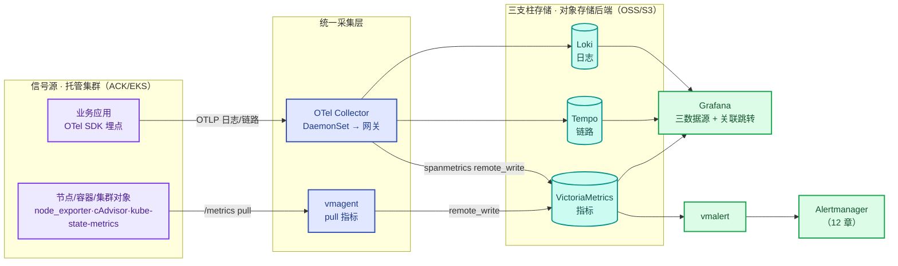

# 第11章 OpenTelemetry全域可观测体系
<!-- 第四篇 可观测与稳定性 ｜ 常规章（可观测参考栈） ｜ 状态：终审中 -->

> 本章定位：第四篇开篇，建立全域可观测体系，是全书可观测体系的技术栈锚点——后续所有观测环节与 15.5 上下文装配器均复用本章技术栈。全书生态为托管 K8s（阿里云 ACK 主参考、AWS EKS 对照），本栈作为全书自建参考栈跑在托管集群之上；「托管可观测 vs 自建」的取舍在 11.1 用决策表一次定调。
> **主线定位**：本章为L2 运维自治的输入——全域信号采集，风险识别的源头（三层自治见 1.5；L3 = 运维 Agent 引擎，15.4⑤/15.5）。 **主旨绑定**：AIOps 的信号底座——15.5 上下文装配器的四件套（告警/变更/SLO/相似工单）全部由此栈供给；没有统一可观测，L3 智能自治就是瞎子（15.5①）。 **承上启下**：承第 10 章灰度判断（观测校验的需求在此展开为全域体系——第四篇开篇）；启第 12 章告警（数据底座 → 智能告警的信号源）。

---

## 11.1 可观测三支柱协同逻辑与生产落地边界

### 生产问题

可观测割裂的团队：指标看一套、日志查另一套、链路又一套，出故障靠人脑拼三处信息。更隐蔽的是"串不上"的困惑："业务自己写的指标怎么串不上 trace？""被调服务没暴露指标怎么办？"——**三支柱不协同，可观测从"全局视野"退化成"三个孤岛"；协同机制没理清，落地必然卡在"串不上"**。

### 传统方案失效原因

- **三支柱各自为政**：三套系统无关联，定位靠人拼；把 OTel 当成"和 PodMonitor 并行的另一个数据源"，混淆了"造指标"与"拉指标"。
- **误把 exemplar 套业务计数器**：发现"串不上"就以为方案错了——是用错了对象。

失效根因：**没有把三支柱作为协同整体设计，也没理清协同的真实机制**。

### 架构约束与权衡

**先定调：云生态下「托管可观测 vs 自建栈」决策表**（本书锁自建栈跑在托管集群之上）：

| 维度 | 托管（阿里云 ARMS+SLS；AWS CloudWatch/AMP/AMG/X-Ray） | 自建参考栈（VM/Loki/Tempo/OTel/Grafana） | 取舍要点 |
|---|---|---|---|
| 数据留存 | ARMS Prometheus 常见默认 15 天（可购扩展）；CloudWatch 1 分钟粒度 15 天、1 小时粒度 455 天（以产品文档为准） | 自定：指标 30d、日志 30d、链路 14d 起步（均可调） | 长留存自建占优（扩留存只加存储） |
| 自定义分析 | 受产品查询能力约束，跨支柱关联取决于厂商实现 | PromQL/LogQL/TraceQL 全开放，trace↔log↔metric 自由打通 | 深度分析自建占优 |
| 成本量级 | 按量：CloudWatch 自定义指标 ≈$0.30/指标/月、AMP 摄入 ≈$0.30/百万样本、X-Ray ≈$5/百万条 trace（以官网当期价为准） | 计算资源 + 对象存储 + 人力；规模化后常见可降 50%+（以实测账单为准） | <50 节点托管省心；数百节点量级自建成本优势显现 |
| 免运维/跨云 | 厂商 SLA 兜底；ACK/EKS 两套体系 | 升级扩容自理（本章交付物服务于此）；跨云一套栈 | 无平台团队优先托管；多云演进自建占优 |

**再理清三支柱协同的四条底层事实**（决定"跳转"怎么做）：

**事实一：指标分"生产侧"和"采集侧"，不是两个并行数据源。** 生产侧（OTel SDK、exporter）把指标造出来放进 `/metrics` 并可盖 exemplar 戳；采集规则（PodMonitor/ServiceMonitor）+ 采集器（vmagent）只是按规则去拉；存储（VM）落盘供查询。但有一个**本参考栈的硬边界必须先讲：VictoriaMetrics（含企业版）不支持 exemplar 的存储与查询**（`query_exemplars` 接口只是返回空结果的兼容层，官方明确尚未实现）。所以本书的指标→trace 通道**不走 exemplar**，走"时间窗 + 服务 + 时长"的 TraceQL 检索与 Grafana 关联跳转（事实二与 11.5 ⑤）——Prometheus 原生栈才有 exemplar 星点，这是选型时要知道的取舍。

**事实二：trace 和 metric 是同一次调用的两个产物，"时间窗 + 维度"是桥。** 一次 A 调 B 被 OTel 自动埋点**同时**产出 span（进 Tempo）+ RED 指标（进 VM）；VM 无 exemplar 时，两侧靠**同一时间窗 + 同一维度（service/route）**关联：指标定位"checkout 在 10:03–10:07 错误率 8%、p99 3s"→ 去 Tempo 按 `service=checkout AND status=error AND duration>2s` 的时间窗检索，直接命中慢/错 trace（TraceQL，11.5 ⑤）。

**事实三：能"串到 trace"的只有 RED 层，业务计数器与基础设施指标先串 RED 再串 trace。**

| 指标类 | 例子 | 串到 trace 的通道 | 可否直串 |
|---|---|---|---|
| RED（每请求性能） | 延迟/错误率/QPS | 时间窗+维度 → Tempo TraceQL | ✓ 能（原生指标或 spanmetrics） |
| 业务（聚合计数） | 订单数/支付额 | 时间 + RED 桥 | ✗ 不该串 |
| 基础设施 | CPU/内存/磁盘/网络 | 时间 + RED 桥 | ✗ 不该串 |

业务指标报警（出事了）→ 同时刻 RED（哪类请求）→ 时间窗+维度检索命中 trace（为什么）。**业务计数器串不上 trace 是对的——它该串的是"同时刻的 RED"**。

**事实四：被调服务没暴露指标时，用 spanmetrics 从 trace 反推 RED。** 老服务/第三方只接了 trace、没暴露 metric → spanmetrics（Tempo metrics-generator，11.5 ③）把 span 聚合成 RED 指标 remote_write 进 VM——指标虽无 exemplar（VM 侧无此概念），但 service/route/status 维度与时间窗齐全，照样走事实二的 TraceQL 桥。RED 层推荐统一交给 spanmetrics 兜底。

权衡的核心：**协同不是一句"trace ID 关联 + 指标带 exemplar"，而是建立在这四条事实上**——理解四条，"串不上"自动消解。

### 最小可行方案

1. **统一采集 + 统一关联键**：OTel 统一采集层（三支柱同源，11.2）；全链路 trace ID、日志带 trace ID、RED 层靠时间窗+维度可下钻 trace（业务/基础设施指标先串 RED）。
2. **RED 层永远在线 + 统一可视化**：原生 HTTP 指标 + spanmetrics 兜底；Grafana 三数据源按 trace ID 跳转 + 面板数据链接（correlation）预置 TraceQL 下钻。

### 生产落地实现

**关联链路三前提自检**（新服务接入可观测的验收命令）：

```bash
kubectl -n observability get vmagent   # ① 采集在位（本章方案用 VmAgent 的 inlineScrapeConfig，不建 PodMonitor/ServiceMonitor CR）
kubectl -n prod exec deploy/checkout -- \
  curl -s http://localhost:8080/metrics | grep -m1 'http_server_request_duration'                      # ② RED 指标已暴露
curl -sG 'http://vmsingle-vmstack.observability.svc:8428/api/v1/query' \
  --data-urlencode 'query=http_server_request_duration_seconds_bucket{service="checkout"}' \
  --data-urlencode 'query=traces_spanmetrics_calls_total' | jq '.data.result | length'   # ③ spanmetrics 已回写 VM（VM 无 exemplar，指标→trace 走 TraceQL 时间窗检索）
```

- **关联排查标准路径**：业务指标报警（时间点）→ 同时刻 RED（定位服务与路由）→ Tempo 按 service+时间窗+时长检索命中 trace（11.5 ⑤）→ 按 trace ID 跳日志（查询三连见 11.5）；无指标服务由 spanmetrics 兜底。
- **云服务映射与数字**：托管对照 = 阿里云 ARMS（指标+应用监控+链路一体）、AWS AMP+AMG（PromQL+托管 Grafana），exemplar→Tempo 这类跨支柱打通需自建，取舍见本节决策表；自建栈默认留存 = 指标 30d / 日志 30d / 链路 14d（11.2/11.4/11.5 可调），而托管侧 CloudWatch 1 分钟粒度仅 15 天——长留存是选自建的第一个常见理由。

### 典型故障案例

某次排查订单成功率（业务计数器，挂不了 exemplar）下降，团队卡在"怎么跳 trace"。按 RED 桥：看同时刻 RED，发现 checkout 路由错误率飙 → 按异常时间窗在 Tempo 检出失败 trace → 支付网关超时。

点评：**三支柱协同的真实难点不在工具，而在搞清"关联走哪一层、哪些指标靠桥"**。

### 根因定位

根因不在某次定位慢，而在**三支柱未协同设计 + 协同机制没理清**——孤岛靠人脑拼；关联用错对象或没兜底无 metric 场景，仍会"串不上"。

### 长效治理方案

- OTel 统一采集；生产/采集角色分清；关联只走 RED 层（时间窗+维度），业务/基础设施指标靠时间 + RED 桥。
- RED 层永远在线（原生 + spanmetrics 兜底）；排查走"业务指标 → 同时刻 RED → 时间窗检索 → trace"标准路径。

### 自动化/自治闭环

本节为 L2 运维自治（15 章）与 L3 智能自治（15.4⑤/15.5）的"观测输入"环节：时间窗+维度串通的 RED 层是自治从"指标异常"跳到"具体请求 trace"定位根因的入口。

### 生产检查清单

- [ ] OTel 统一采集三支柱，生产侧与采集侧角色分清？
- [ ] 全链路注入 trace ID，日志带 trace ID？
- [ ] RED 层可经时间窗+维度下钻 trace、接入验收跑过三前提自检，无指标服务有 spanmetrics 兜底？
- [ ] Grafana 三数据源可跳转，托管 vs 自建决策表评审过？

---

## 11.2 全书统一可观测技术栈：VictoriaMetrics(指标)、Loki(日志)、Tempo(链路)、OTel(采集)、Grafana(可视化)（参考实现，等价组件同样适用）
<!-- 全书可观测技术栈锚点·参考实现 -->

### 生产问题

历史堆叠的可观测栈：Prometheus（指标）+ ELK（日志）+ Jaeger（链路）三套独立系统，各自运维、各自存储、关联靠人；Prometheus 单实例容量到顶、ELK 全量索引成本高昂。**异构堆叠 = 运维负担 ×3、成本 ×3、协同为零**，且每次替换组件都牵动全局。

### 传统方案失效原因

- **异构堆叠 + 容量瓶颈**：三套系统无原生关联，定位靠人拼；单实例 Prometheus 扩容路径窄（联邦/分片运维复杂）。
- **成本失控**：日志全量索引，存储与计算随日志量线性膨胀。

失效根因：**没有用一套统一、轻量、协同的栈替代异构堆叠**。定论，不再论证。

### 架构约束与权衡

全书统一可观测参考栈：

| 组件 | 角色 | 选型理由（权衡） |
|---|---|---|
| **VictoriaMetrics** | 指标存储 | 高性能、低成本（落盘 ≈0.4–1 字节/样本）、兼容 Prometheus 协议、单机到集群平滑扩展 |
| **Loki** | 日志存储 | 仅索引 label（非全文），成本远低于 ELK，与 Grafana 原生集成 |
| **Tempo** | 链路存储 | 对象存储后端、按 trace_id 查询，与 VM/Loki 通过 trace ID 关联 |
| **OpenTelemetry** | 采集 | 厂商中立标准，三支柱统一采集 |
| **Grafana** | 可视化 | 统一面板，三数据源原生关联 |

规模分界：**vmsingle 单副本扛 300–500 万活跃序列**（11.3 红线）；超限换 vmcluster（vminsert/vmselect/vmstorage 分离），写入端点变为 `http://vminsert:8480/insert/0/prometheus/api/v1/write`、查询走 `vmselect:8481/select/0/prometheus`（集群版必须带租户路径前缀，缺了 404，以官方文档为准）。权衡的核心：**这套栈以"低成本 + 高协同 + 标准化"为选型核心**，全书以这套栈为参考实现保持示例一致，等价组件同样适用。

### 最小可行方案

1. **指标**：`victoria-metrics-k8s-stack` 一条命令起栈（vmsingle + vmagent + vmalert + Alertmanager + grafana + kube-state-metrics + node_exporter 全套）。
2. **日志与链路**：Loki（11.4）+ Tempo（11.5）+ OTel 采集，对象存储后端。
3. **采集与可视化**：OTel 两级拓扑（DaemonSet → 网关）；Grafana 三数据源 provisioning（11.5）。

### 生产落地实现

**① 一条命令起栈**（Helm；values 入 Git、ArgoCD 交付——第 9 章）：

```bash
helm repo add vm https://victoriametrics.github.io/helm-charts/ && helm repo update
helm install vmstack vm/victoria-metrics-k8s-stack -n observability --create-namespace -f vmstack-values.yaml
kubectl -n observability get pods && kubectl -n observability get vmsingle,vmagent,vmalert   # 验收：全就绪
```

**② 关键 values**（精简版，完整参数以 chart 官方文档为准；12 章告警规则以 VMRule CR 交付、vmalert 自动加载，severity 与 12.1 同源）：

```yaml
# vmstack-values.yaml
vmsingle:
  spec:
    retentionPeriod: 30d                        # 可调: 指标保留期；更长期留存接对象存储归档
    storage:
      storageClassName: alicloud-disk-essd      # AWS 对照: gp3；生产禁改: 严禁 local/emptyDir
      resources:
        requests:
          storage: 300Gi                        # 可调: 按 11.3 容量公式估算（300 万序列×30d 上界 105–260GB，留余量取 300Gi）
vmagent: {}        # chart 默认已接 vmsingle 写入端点，并自动创建 kubelet/cAdvisor/kube-state-metrics/node-exporter 抓取
vmalert:
  spec:
    notifiers:
      - url: http://vmstack-alertmanager.observability.svc:9093   # 12 章 Alertmanager（Service 名以实际部署为准）
alertmanager:
  enabled: true    # 路由/收敛/抑制直接复用 12.1 配置，此处不重复
grafana:
  enabled: true    # 生产禁改: 全书唯一可视化入口
  sidecar:
    datasources:
      enabled: true    # 数据源走 ConfigMap provisioning（11.5）
```

**托管对照一行**：阿里云 ARMS Prometheus/SLS、AWS AMP+AMG/CloudWatch 可等价托管，<50 节点省心；规模化后自建常见可降 50%+（11.1 决策表，以实测账单为准）。**成本量级**：vmsingle 300Gi ESSD ≈¥150/月（≈¥0.5/GB/月；AWS gp3 ≈$0.08/GB/月，以官网当期价为准）；vmagent→vmsingle 走集群内网，零公网流量费。

### 典型故障案例

某团队从 Prometheus+ELK 迁到 VM+Loki：日志存储成本下降 80%（Loki 仅索引元数据、日志体进对象存储），且与 Tempo 原生 trace ID 关联；运维对象从三套降到一套协同栈。

点评：**统一栈不止省成本，更带来协同**——VM/Loki/Tempo 原生 trace ID 关联，是异构栈做不到的。

### 根因定位

根因不在某套系统差，而在**异构堆叠无协同**——统一栈用协同与标准化根治割裂与高成本。

### 长效治理方案

- 全书统一用这五件套保持示例一致（等价组件同样适用）；单机到集群只换拓扑不改栈（vmsingle → vmcluster，11.3 红线切换）。
- 告警规则统一以 VMRule 交付，vmalert+Alertmanager 承载（与 12 章一致）；栈自身用 Helm/ArgoCD 声明式交付。

### 自动化/自治闭环

统一栈是全书自治体系的**唯一信号底座**：L1 调谐观测、L2 的 SLO 决策、L3 的推理上下文全部来自这套栈（15 章 / 15.4⑤/15.5）。

### 生产检查清单

- [ ] 指标用 VictoriaMetrics（vmsingle/vmcluster，非裸 Prometheus）？日志用 Loki、链路用 Tempo？
- [ ] 采集用 OTel 统一标准（DaemonSet+网关两级）？Grafana 统一 + 三数据源关联？
- [ ] vmalert notifier 指向 12 章 Alertmanager、规则以 VMRule 交付？
- [ ] 栈自身用 Helm/ArgoCD 交付、values 入 Git、存储用云盘 StorageClass（非 local/emptyDir）？

---

## 11.3 集群、节点、容器、业务全维度指标标准化采集与治理

### 生产问题

先做一个思想实验（先自己想答案，再往下读）：

> 墨丘里商城的 Grafana 大盘上，demo-api 的平均延迟 40ms，全绿，一切正常。但客服转来用户投诉："**每 20 单就有 1 单卡 3 秒**才出结果。"先猜十秒：监控为什么没报？

揭晓：把这 1000 次调用摊开——990 次 10ms、10 次 3000ms。均值 =（990×10 + 10×3000）÷ 1000 ≈ 40ms，仪表盘没有骗你；但 p99 = 3000ms。**均值把尾部的痛苦平均掉了**：10 个"3 秒"摊到 1000 个请求头上，每个只分摊 30ms，而真正挨那 3 秒的用户正在打客服电话——3 秒，够用户怀疑断网、切去竞品再下一次单。均值是统计的真相，p99 才是用户的真相。

再深一层（DDIA 的"尾部放大"）：微服务下尾部延迟会沿调用链二次放大。用户下一次单，demo-api 在后台扇出约 20 次调用（user-svc 查用户、payment-api 预授信，再加库存/价格/优惠券/风控等）——**任何一次落入慢尾，整个请求就慢**。设单次调用落入慢尾的概率为 p，用户请求变慢的概率就是 1-(1-p)²⁰：p=1%（恰好是 p99=3000ms 的情形）→ ≈18%，每 5–6 单就有 1 单慢；哪怕 p 只有 0.25%，也有 ≈5%——正是客服说的"每 20 单 1 单"。**服务自评只慢 0.25%，到用户侧就是 5%，20 倍放大**——这就是为什么微服务必须看调用方视角的 p99，而不是各服务自评的均值：每一环都"均值正常"，串起来的链路却在崩溃。

均值掩盖尾部、自评掩盖链路，这是"指标度量错"；本节的另一半问题是"指标采集无标准"：暴露随意（有的服务有 `/metrics` 有的没有）、标签各写各的、基数失控（user_id 当 label 导致序列爆炸）、四层维度割裂。**无标准的指标难查询、难关联、成本失控——高基数 label 是指标成本的头号杀手**。

### 传统方案失效原因

- **暴露随意/标签无标准/维度割裂**：暴露什么、label 叫什么无规范，同一概念多种写法无法聚合查询；基础设施与业务指标两套。
- **高基数失控**：user_id/request_id 当 label，序列爆炸、存储成本飙升、查询变慢。

失效根因：**指标采集没有标准化治理（来源/命名/标签/基数）**。定论，不再论证。

### 架构约束与权衡

全维度指标来源职责表（生产侧——谁造指标；采集侧统一 vmagent pull）：

| 维度 | 来源（生产侧） | 代表指标 | 说明 |
|---|---|---|---|
| 节点 | node_exporter（DaemonSet） | node_cpu_seconds_total、node_memory_MemAvailable_bytes | stack 已内置 |
| 容器/Pod | kubelet 内置 cAdvisor | container_cpu_usage_seconds_total、container_memory_working_set_bytes | vmagent 抓 kubelet 端点 |
| K8s 对象 | kube-state-metrics | kube_pod_status_phase、kube_deployment_status_replicas | 重启/副本/探针状态的唯一权威 |
| 业务 | OTel SDK / prom client | RED + 业务计数器 | 无指标服务由 spanmetrics 兜底（11.1） |

基数治理规范（数字即红线，经验值）：

| 项 | 红线（经验值） | 动作 |
|---|---|---|
| 单指标活跃序列 | >1 万评审；>5 万强制下线改造 | 高基数维度迁日志/trace |
| 单 label 取值数 | ≤20（env/status 类） | user_id/request_id 禁入 label |
| 全局活跃序列 | vmsingle 单副本 ≤300–500 万 | 超限换 vmcluster（11.2） |
| 采集间隔 | 基础设施 30s；RED 15–30s | 禁 5s 以下（存储×6） |
| 落盘占用 | ≈0.4–1 字节/样本（官方口径≈0.4B） | 容量公式见落地实现 |

**百分位与采样的保证等级表**（p99 与采样各自承诺什么——本节开头思想实验的机制总结）：

| 机制 | 承诺 | 不承诺 |
|---|---|---|
| **百分位数（p50/p99）** | 刻画分布形态：单个窗口内尾部有多慢，一目了然 | 跨实例/跨窗口可直接平均——先算各实例 p99 再取均值 ≠ 全局 p99（"均值 40ms"的谎言在聚合层原样重演）。**聚合必须在原始直方图（histogram 的 le 桶）上重算分位数**，`histogram_quantile(sum by (le)(rate(..._bucket[5m])))` 正是为此设计（11.5 查询三连第 1 连） |
| **head 采样（11.5）** | 长期比例收敛：1% 采样在大样本下约 1% 的 trace 被记录 | 任何一条具体 trace 被捕获——1% 采样 = **99% 的 trace 未被记录**，"这次异常偏偏没 trace"是概率常态而非系统故障；异常 trace 的确定性捕获靠尾采样（错误/慢必留，11.5；深度策略归 V2） |

权衡的核心：**标准化用"来源/命名/标签/基数规范"换"可查询、可关联、成本可控"**——黄金信号（延迟/流量/错误/饱和度）全覆盖 + 统一 label + 严控基数。

**vmsingle → vmcluster 升级路径**（300–500 万序列红线触发时的预案，兑现 11.2"单机到集群只换拓扑不改栈"的承诺）：前兆信号——活跃序列连续两周逼近红线、查询延迟抬升。三步（组件与参数以官方文档为准）：① 部署 vmcluster（vminsert/vmselect/vmstorage 分离，vmstorage 按序列数水平扩展）；② 历史数据用 vmbackup/vmrestore 迁移，或按保留期自然滚动 + 双写过渡一个周期；③ vmagent 写入端点切 `vminsert:8480/insert/0/prometheus/api/v1/write`、Grafana 数据源切 `vmselect:8481`。切换是拓扑变更而非换栈——vmalert/Grafana/告警规则全部不动。

### 最小可行方案

1. **四层来源全采 + 黄金信号全覆盖**：上表五行全接入、每服务暴露延迟/流量/错误/饱和度四类，统一存 VM。
2. **标签标准**：`service`/`env`/`version`/`namespace` 跨服务一致。
3. **基数红线**：上表数字纳入发布评审与周期巡检。

### 生产落地实现

**① 注解驱动的业务指标抓取**（追加到 11.2 的 vmstack-values.yaml，替换 `vmagent: {}` 段；VmAgent CR 的 `inlineScrapeConfig`，语法同 Prometheus）：

```yaml
vmagent:
  spec:
    inlineScrapeConfig: |
      - job_name: kubernetes-pods
        kubernetes_sd_configs:
          - role: pod
        relabel_configs:
          - source_labels: [__meta_kubernetes_pod_annotation_prometheus_io_scrape]
            action: keep
            regex: "true"                       # 只抓注解声明的 Pod
          - source_labels: [__address__, __meta_kubernetes_pod_annotation_prometheus_io_port]
            action: replace
            regex: ([^:]+)(?::\d+)?;(\d+)
            replacement: $1:$2
            target_label: __address__           # 注解端口覆盖默认抓取地址
          - action: labelmap
            regex: __meta_kubernetes_pod_label_(.+)   # Pod label 提升为指标 label
          - source_labels: [__meta_kubernetes_namespace]
            target_label: namespace             # 生产禁改: namespace/service 是全书关联键
        metric_relabel_configs:
          - source_labels: [__name__]
            regex: '(go_|process_)'             # 可调: 丢弃语言运行时噪音指标（按需保留）
            action: drop
        scrape_interval: 30s                    # 可调: 基础设施 30s、RED 最快 15s
```

业务侧只需注解（零额外配置）：`prometheus.io/scrape: "true"`（生产禁改——接入即声明，未声明等于不可观测）+ `prometheus.io/port: "8080"`（可调，按服务 metrics 端口）。

**② 基数巡检**（低频执行——每周一次；勿做高频告警，全序列扫描本身有开销）：

```bash
curl -sG 'http://vmsingle-vmstack.observability.svc:8428/api/v1/query' \
  --data-urlencode 'query=count({__name__!=""})' | jq '.data.result[0].value[1]'   # 全局序列（对照 300–500 万红线）
curl -sG 'http://vmsingle-vmstack.observability.svc:8428/api/v1/query' \
  --data-urlencode 'query=topk(10, count by (__name__)({__name__!=""}))' \
  | jq -r '.data.result[] | "\(.value[1]) \(.metric.__name__)"'   # 基数 Top10（对照单指标 1 万红线）
```

**③ 容量估算**：样本量/天 = 活跃序列数 × 86400 ÷ 采集间隔；例：300 万序列 @30s → ≈86.4 亿样本/天（平均每秒 10 万个样本点持续落盘）→ 落盘 ≈3.5–7.6 GB/天 → 30 天 ≈105–260 GB → 云盘 300–500Gi 起步。规模参考：单节点（node_exporter+cAdvisor）≈0.5 万–1.5 万序列；kube-state-metrics 全集群 5 万–20 万（视对象数）。

**④ 云服务映射**：node_exporter 跑在 ACK 节点池/EKS 托管节点组（DaemonSet，节点自动修复保证采集自愈——4.2）；存储落阿里云 ESSD 云盘（对照 EBS gp3）；托管对照 = ARMS Prometheus/AMP 免自建抓取与存储、按量计费（取舍见 11.1 决策表）。

### 典型故障案例

某服务把 `user_id` 当指标 label，用户增长后序列基数爆炸，VM 存储成本飙升且查询变慢；去掉高基数 label（user_id 迁日志）后回归正常。若基数巡检常态化（Top10 周报），此问题在评审期即可拦截。

点评：**高基数 label 是指标成本的头号杀手**，红线前置比事后治理便宜一个量级。

### 根因定位

拆到底，是**指标采集无标准化（来源/标签/基数/维度）**——无标准的指标既难用又烧钱。

### 长效治理方案

- 四层来源表 + 黄金信号全覆盖纳入服务接入清单；标签命名标准（service/env/version/namespace）跨服务唯一。
- 基数红线纳入发布评审与每周巡检；高基数信息一律走日志/链路。

### 自动化/自治闭环

本节为 L2/L3 自治的"量化输入"环节：SLO（12 章）与智能分诊（15.4⑤）的决策都基于本节标准化的黄金信号；基数失控会让自治赖以决策的指标系统自身崩溃。

### 生产检查清单

- [ ] 四层来源全接入（node_exporter/cAdvisor/kube-state-metrics/业务）？
- [ ] 每服务黄金信号四类齐（延迟/流量/错误/饱和度）、标签跨服务一致、容量按公式估算留 30% 余量？
- [ ] 无 user_id 等高基数 label 且活跃序列在红线内（单指标 ≤1 万、全局 ≤300–500 万，巡检周执行）？
- [ ] 延迟类 SLI 与告警用 p99（调用方视角）而非均值，跨实例聚合分位数在原始直方图上重算？

---

## 11.4 全链路日志采集、检索、脱敏与故障快速定位方案

### 生产问题

日志散在各节点/Pod 内（Pod 销毁即丢）、检索靠 grep 一堆文件、敏感信息（密码/token）明文、故障时翻日志定位慢。**日志无统一采集、无高效检索、无脱敏，既是效率问题也是合规问题**。

### 传统方案失效原因

- **无统一采集**：日志留节点/Pod 内，Pod 销毁即丢失。
- **无结构化/无关联/无脱敏**：纯文本无法高效检索、不带 trace_id 无法与指标/链路联动、敏感信息明文进日志（合规地雷）。

失效根因：**日志没有作为"可检索、可关联、合规"的工程对象治理**。定论，不再论证。

### 架构约束与权衡

四维治理与权衡：**采集**（OTel filelog DaemonSet → Loki；采集开销 vs 不丢失）、**结构化**（JSON + 标准 label；结构化成本 vs 检索效率）、**脱敏**（采集侧 processor 打码；合规 vs 调试便利）、**关联**（日志带 trace_id ↔ Tempo；关联 vs 独立）。Loki 以"仅索引 label + 对象存储日志体"换低成本，代价是查询依赖 label（非任意全文检索），所以**结构化 + 标准 label 是检索效率的关键**。日志量量级（经验值）：单节点（30–60 Pod）日常 **2–10 GB/天**（未压缩——相当于一个人一整天不停手发约 1 万条图文微信的量），Loki 压缩常见 5–10×；100 节点 × 30 天 ≈ OSS 1.5–6 TB ≈ **¥180–720/月**（标准存储 ≈¥0.12/GB/月，以官网当期价为准）——这是"日志可以全采"的成本底气，但脱敏必须前置到采集侧。留存 30 天的体感：一个月前的间歇性故障，今天还能调出当天的日志复现排查——排障窗口就是这么买来的。

### 最小可行方案

1. **统一采集**：OTel filelog → Loki，Pod 销毁不丢日志；JSON 结构化，标准字段（timestamp/level/msg/trace_id）。
2. **脱敏**：采集侧 processor 打码，敏感字段不出节点。
3. **关联**：trace_id 必带，与 Tempo 双向跳转。

### 生产落地实现

**① OTel Collector filelog 完整采集配置**（chart `open-telemetry/opentelemetry-collector`，`mode: daemonset`；RBAC 由 chart presets 处理）：

```yaml
# otel-agent-values.yaml（关键配置完整，次要字段以 chart 文档为准）
mode: daemonset
config:
  receivers:
    filelog:
      include: [/var/log/pods/*/*/*.log]
      exclude: [/var/log/pods/observability_*/*/*.log]   # 可调: 排除可观测自身日志防自激
      start_at: end                                # 只决定首次读取位置；重启续读防丢重真正依赖 file_storage
      # checkpoint 持久化（DaemonSet 需挂 volume，否则 Pod 重建 offset 丢失，有重复/漏采窗口，以官方文档为准）
      include_file_path: true
      operators:
        # 1) 从路径提取 ns/pod/容器 → resource（/var/log/pods/<ns>_<pod>_<uid>/<container>/*.log）
        - type: regex_parser
          parse_from: attributes["log.file.path"]
          regex: '^/var/log/pods/(?P<namespace>[^/]+)_(?P<pod>[^/]+)_(?P<uid>[0-9a-f-]{36})/(?P<container>[^/]+)/'
        - type: move
          from: attributes.namespace
          to: resource["k8s.namespace.name"]
        - type: move
          from: attributes.pod
          to: resource["k8s.pod.name"]
        - type: move
          from: attributes.container
          to: resource["k8s.container.name"]
        # 2) 解析 containerd(CRI) 行格式（时间 流 标记 正文）后正文入 body
        - type: regex_parser
          regex: '^(?P<ts>\d{4}-\d{2}-\d{2}T[\d:.]+Z) (?P<stream>stdout|stderr) (?P<flag>[FP]) (?P<body>.*)$'
          timestamp:
            parse_from: attributes.ts
            layout_type: strptime
            layout: '%Y-%m-%dT%H:%M:%S.%fZ'
        - type: move
          from: attributes.body
          to: body
        # 3) 多行合并：时间戳开头视为新日志，堆栈行并入上一条
        - type: recombine
          combine_field: body
          is_first_entry: 'body matches "^\\d{4}-\\d{2}-\\d{2}[ T]"'   # 可调: 按应用日志格式调整
          max_log_size: 5mb                        # 可调: 超长合并上限
  processors:
    k8sattributes:                                 # 补节点/label 元数据（ns+pod 来自路径解析）
      extract:                                     # labels 提取必须在 extract 之下（顶层写法是旧版遗留，新版会报未知键）
        metadata: [k8s.node.name]
        labels:
        - tag_name: app
          key: app.kubernetes.io/name
          from: pod
      pod_association:
        - sources:
            - from: resource_attribute
              name: k8s.namespace.name
            - from: resource_attribute
              name: k8s.pod.name
    transform/mask:                                # 脱敏: 敏感字段不出节点
      error_mode: ignore
      log_statements:
        - context: log
          statements:
            # 正则用 [^"\s]* 收尾而非 \S+：贪婪 \S+ 会吞过 JSON 值的闭引号与后续字段，打码后 | json 直接断流
            - replace_pattern(body, '(?i)(password|token|secret|authorization)["=:\s]+[^"\s]*', '${1}=***')
            - replace_pattern(body, '\\b1[3-9]\\d{9}\\b', '[手机号]')   # 可调: 按合规清单增删
    memory_limiter:
      check_interval: 1s
      limit_mib: 512                               # 可调: 按节点规格（4C8G 节点起步值）
    batch:
      send_batch_size: 1024
      timeout: 1s
  exporters:
    otlphttp/loki:
      endpoint: http://loki.observability.svc:3100/otlp    # Loki 原生 OTLP 入口（Loki 3.x，以官方文档为准）
  service:
    pipelines:
      logs:
        receivers: [filelog]
        processors: [memory_limiter, k8sattributes, transform/mask, batch]
        exporters: [otlphttp/loki]
# 注: OTLP 资源属性（service.name、k8s.namespace.name 等）被 Loki 转为标签（"." 映射为 "_"，以官方文档为准）——标签集要小而稳，严禁塞高基数字段（user_id）
```

**② Loki 部署关键 values**（chart `grafana/loki`，单二进制模式；`helm install loki grafana/loki -n observability -f loki-values.yaml`）：

```yaml
# loki-values.yaml（SingleBinary 模式；字段以 chart 版本为准）
deploymentMode: SingleBinary
loki:
  commonConfig:
    replication_factor: 1           # 可调: 高可用升 3 副本（分布式模式）
  storage:
    type: s3                        # 生产禁改: 生产必须对象存储（OSS/S3），不用本地盘
    s3:
      endpoint: oss-cn-hangzhou-internal.aliyuncs.com   # AWS 对照: s3.<region>.amazonaws.com
      bucketnames: prod-loki-chunks
      region: cn-hangzhou
  limits_config:
    retention_period: 720h          # 可调: 30 天（保留期 = 排障窗口与合规下限取大者）
  compactor:
    retention_enabled: true         # 生产禁改: 不开则 retention 不生效，存储只增不减
singleBinary:
  replicas: 1
  persistence:
    storageClassName: alicloud-disk-essd
    size: 50Gi                      # 可调: 索引 + WAL 本地缓存
```

**③ 云服务映射与成本量级**：chunk 存阿里云 OSS（对照 AWS S3，内网 endpoint 免流量费）、索引/WAL 落 ESSD 云盘；托管对照 = SLS（免运维按量计费，深度自定义分析受限——11.1 决策表）。接入前估算：单节点（30–60 Pod）≈2–10 GB/天（未压缩）→ 压缩后 ≈0.2–2 GB/天；100 节点 × 30 天 ≈ ¥180–720/月；采集开销每节点 ≈0.2–0.5 vCPU、0.5–1 GiB 内存（collector 资源请求按此设）。

### 典型故障案例

某次排查，因日志留 Pod 内且 Pod 已重建，关键日志丢失无法定位；统一采集进 Loki 后 Pod 销毁日志仍在。另一次审计发现日志含明文 token，采集侧 transform/mask 打码后消除风险——脱敏在采集侧做，一处生效、全量覆盖。

点评：**日志不集中 = 关键时刻丢失；日志不脱敏 = 合规地雷**。

### 根因定位

问题的真正发源地是**日志未工程化治理**——采集、结构化、脱敏、关联四件事，缺谁都不行。

### 长效治理方案

- OTel 统一采集集中存 Loki；JSON 结构化 + 标准 label；脱敏前置到采集侧（一处生效，覆盖全部新旧服务）。
- trace_id 必带；保留期 = 排障窗口与合规下限取大者（默认 30d），compactor retention 必开。

### 自动化/自治闭环

本节为 L2 自治"根因定位"环节的上下文来源：指标告警 → 跳链路 → 跳日志看上下文，自治处置后的复盘才有据（12/13 章）。

### 生产检查清单

- [ ] 日志统一采集进 Loki（Pod 销毁不丢）？
- [ ] CRI 行解析 + 多行合并生效（堆栈不撕碎）？
- [ ] 脱敏 processor 生效（password/token/手机号打码）？
- [ ] 日志带 trace_id（与 Tempo 双向跳转）？
- [ ] 保留期显式配置且 compactor retention 已开、成本量级已估算？

---

## 11.5 分布式链路追踪、微服务瓶颈分析、异常根因溯源实战

### 生产问题

一个请求经过 8 个微服务，某次偶发慢，团队只看到入口服务延迟高，不知慢在链路哪一段；没有链路追踪，跨服务瓶颈只能"挨个查日志猜"，耗时且常猜错。**分布式系统没有链路追踪，跨服务瓶颈与异常根因几乎无法定位**。

### 传统方案失效原因

- **无追踪**：请求跨服务无关联，慢在哪段不可知；DB/缓存/外部调用断链（埋点不全）。
- **采样不当/不关联**：全采样成本高、低采样漏掉偶发问题；链路孤立，无法从指标异常跳到具体链路。

失效根因：**没有建立贯通的分布式链路追踪体系**。定论，不再论证。

### 架构约束与权衡

四维治理与权衡：**埋点**（OTel SDK 自动 HTTP/gRPC/DB + 关键跨度手动；侵入成本 vs 完整性）、**采样**（SDK 头采样 + 网关尾采样、错误/慢必留；采样率 vs 成本/捕获率）、**存储**（Tempo + 对象存储按 trace_id 查询；≈20–100 B/span，经验值）、**关联**（trace_id 贯穿链路与日志字段、RED 靠时间窗+维度；三支柱协同 11.1）。权衡的核心：**采样是链路成本的总闸门**——头采样省应用→网关带宽，尾采样保异常 trace；两者叠加会相乘（10%×1%=0.1%），常见做法是 SDK 端全量上报、网关统一尾采，流量极大时 SDK 才降头采样。

采样率定在多少，永远"取决于"（变量表）：

| 决策变量 | 倾向高采样（≥10%） | 倾向低采样（≤1%） |
|---|---|---|
| 流量大小 | 低流量内部服务，trace 总量本就有限 | demo-api 峰值 QPS 数千的核心链路，全采必先爆网关 |
| 异常频率 | 偶发难复现问题为主（低采样大概率漏掉唯一现场） | 异常模式已定位（错误/慢靠尾采必留兜底，头采只保基线） |
| 采集与存储成本 | 预算宽裕（OSS ≈¥0.12/GB/月，存储近乎免费，见 ⑥） | 采集/序列化 CPU 占主导（瓶颈在算力不在存储，见 ⑥） |

### 最小可行方案

1. **OTel 自动埋点**：主流框架（HTTP/RPC/DB 客户端）自动埋点，关键业务跨度手动补全。
2. **采样双层**：SDK `parentbased_traceidratio` 0.1 起步（可调）+ 网关尾采样（错误/慢必留）。
3. **存储与关联**：Tempo 对象存储后端，trace_id 贯穿三支柱；Grafana 三数据源 provisioning + 数据链接（correlation）/derivedFields 跳转。

### 生产落地实现

**① SDK 头采样**（应用 Deployment 注入 env 即生效）：

```yaml
env:
  - name: OTEL_TRACES_SAMPLER
    value: parentbased_traceidratio     # 父子一致采样，跨服务链路不断
  - name: OTEL_TRACES_SAMPLER_ARG
    value: "0.1"                        # 可调: 10% 起步，按流量与网关预算调
  - name: OTEL_PROPAGATORS
    value: tracecontext,baggage         # 生产禁改: W3C 传播器，换私有格式会断链
  - name: OTEL_EXPORTER_OTLP_ENDPOINT
    value: http://otel-gateway.observability:4317
```

**② 网关尾采样**（chart `open-telemetry/opentelemetry-collector`，`mode: deployment`，replicaCount: 2；节选采样段，receivers/otlp→exporters/otlp/tempo 管道组装同 11.4）：

```yaml
# otel-gateway-values.yaml
config:
  processors:
    tail_sampling:
      decision_wait: 10s                          # 可调: 尾部决策等待窗（=最晚 span 到达容忍；num_traces ≈峰值 QPS×decision_wait×1.5）
      policies:
        - name: errors-in
          type: status_code
          status_code: { status_codes: [ERROR] }  # 生产禁改: 错误 trace 必留
        - name: slow-traces
          type: latency
          latency: { threshold_ms: 800 }          # 可调: 与 p99 目标联动
        - name: baseline
          type: probabilistic
          probabilistic: { sampling_percentage: 1 }   # 可调: 尾部再抽 1%
```

**③ Tempo 一句话部署 + 关键 values**：`helm install tempo grafana/tempo -n observability -f tempo-values.yaml`

```yaml
# tempo-values.yaml（字段以 chart 版本为准）
tempo:
  retention: 336h                     # 可调: 链路价值集中近期，常见 7–14 天
storage:
  trace:
    backend: s3                       # 生产禁改: 对象存储后端
    s3:
      bucket: prod-tempo-traces
      endpoint: oss-cn-hangzhou-internal.aliyuncs.com   # AWS 对照: s3.<region>.amazonaws.com
      region: cn-hangzhou
metricsGenerator:
  enabled: true                       # 只部署组件还不够——processor 必须在租户 overrides 显式开启（否则一条 spanmetrics 不产）
overrides:
  defaults:
    metrics_generator:
      processors: [service-graphs, span-metrics]   # 开启处理器，字段以 chart 版本为准
metricsGenerator:
  config:
    storage:
      remote_write:
        - url: http://vmsingle-vmstack.observability.svc:8428/api/v1/write   # 指标回写 VM
```

**④ Grafana 三数据源 provisioning**（ConfigMap，sidecar 自动加载；关联跳转打通的关键段，接 11.2 的 grafana）：

```yaml
apiVersion: v1
kind: ConfigMap
metadata:
  name: grafana-datasources
  namespace: observability
  labels:
    grafana_datasource: "1"           # sidecar 识别标签（11.2 已开 sidecar）
data:
  datasources.yaml: |
    apiVersion: 1
    datasources:
    - name: VictoriaMetrics
      uid: victoriametrics
      type: prometheus
      url: http://vmsingle-vmstack.observability.svc:8428   # vmsingle 查询端点；集群版换 vmselect:8481（以官方文档为准）
      isDefault: true
      jsonData: {}                        # VM 无 exemplar（11.1 事实一）——指标→trace 不配星点跳转，
                                          # 在面板上配数据链接（correlation）：url 指向 /explore?orgId=1&left=
                                          # {"datasource":"tempo","queries":[{"expr":'{ resource.service.name="${service}" && duration>${__value}s }'}],"range":${__from}~${__to}}
                                          # 一键把指标点带到 Tempo 的时间窗+服务+时长检索（⑤ 查询三连第 2 连）
    - name: Loki
      uid: loki
      type: loki
      url: http://loki.observability.svc:3100
      jsonData:
        derivedFields:                    # 日志 → Tempo：提取 trace_id 生成跳转链接
          - name: TraceID
            matcherRegex: '"trace_id":"([0-9a-f]{32})"'
            datasourceUid: tempo
            url: '$${__value.raw}'
    - name: Tempo
      uid: tempo
      type: tempo
      url: http://tempo.observability.svc:3200
      jsonData:
        tracesToLogsV2:                   # trace → 日志：按 trace_id 过滤 Loki
          datasourceUid: loki
          filterByTraceID: true
          spanStartTimeShift: '-1h'       # 可调: 时间窗外扩 ±1h，容忍时钟偏移
          spanEndTimeShift: '1h'
```

**⑤ trace_id 关联查询三连**（metric → trace → log 的实际查询）：

```text
# 1) PromQL（VM 数据源）：定位异常时段与对象；用面板数据链接（correlation）带时间窗跳 Tempo
histogram_quantile(0.99, sum by (le) (rate(http_server_request_duration_seconds_bucket{service="checkout"}[5m])))
# 2) TraceQL（Tempo 数据源，Explore）：直接搜"慢且错"的调用
{ resource.service.name = "checkout" && status = error && duration > 500ms }
# 3) LogQL（Loki 数据源）：从 trace_id 反查日志上下文（trace 详情页可自动跳转）
{ k8s_namespace_name = "prod" } | json | trace_id = "5f8c...e21"
# 注: 指标名随 OTel 语义约定版本/exporter 后缀不同（http_server_request_duration_seconds vs http.server.request.duration），以实际 /metrics 输出为准
```

**⑥ 成本量级与云服务映射**：100 万请求/天、SDK 头采 10% + 错误/慢必留 → ≈10 万 trace/天；按 30 span/trace、压缩后 ≈20–100 B/span（经验值）→ ≈60–300 MB/天 → 14 天保留 ≈1–4 GB OSS ≈ **每月个位数元**（≈¥0.12/GB/月，以官网当期价为准）——一杯奶茶钱，买下全公司 14 天的完整链路现场；**链路存储近乎免费，真正的成本在采集与序列化 CPU，所以采样闸门设在网关**。trace 存 OSS（对照 S3，内网 endpoint 免流量费）；托管对照 = ARMS 链路追踪 / AWS X-Ray（按量计费、查询语言私有——11.1 决策表）。

### 典型故障案例

某偶发慢请求，入口延迟高但不知慢在哪。Tempo 链路显示卡在第 5 个服务的 DB 查询（未加索引的慢 SQL），根因一目了然；叠加 11.1 的 RED 桥，从 p99 面板数据链接进 trace，全程一键贯通。

点评：**链路追踪是分布式根因定位的"X 光"**——没有它，跨服务瓶颈只能靠猜。

### 根因定位

拆到底，是**无贯通链路追踪导致跨服务因果不可见**——微服务化后这是必答题，不是选答题。

### 长效治理方案

- OTel 自动埋点 + DB/缓存/外部调用跨度手动补全；采样双层（头采 0.1 起步可调 + 尾采错误/慢必留），理解叠加相乘。
- Tempo 对象存储 + 7–14 天保留；spanmetrics 回写 VM 保 RED 层在线；Grafana 三数据源双向跳转，查询三连纳入接入验收。

### 自动化/自治闭环

本节为 L2/L3 自治"根因定位"环节的因果工具：指标告诉自治系统"有问题"，链路告诉它"问题在哪段"（15 章 / 15.4⑤）。

### 生产检查清单

- [ ] 主流框架自动埋点 + DB/缓存/外部调用跨度补全？
- [ ] 采样双层生效（头采 0.1 起步 + 尾采错误/慢必留），叠加相乘已评估？
- [ ] Tempo 后端为对象存储（OSS/S3）、保留期显式？
- [ ] Grafana 三数据源 provisioning：指标数据链接→Tempo、日志 derivedFields→Tempo、trace→日志过滤？
- [ ] metric→trace→log 查询三连演练过、链路成本量级已估算？

**全章收束——可观测数据流全景图**（应用/基础设施 → 统一采集 → 三存储 → 消费端）：



> **下一章预告**：信号有了，消费它——第 12 章讲告警治理、SLO 与故障应急：口径、分级、止损优先，把信号变成可执行的稳定性纪律。
