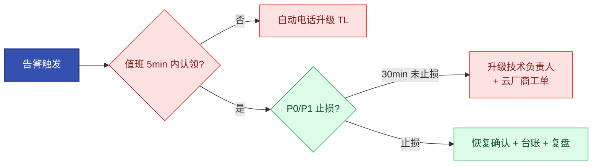

# 第12章【L2 运维自治】告警治理、SLO与故障应急体系
<!-- 第四篇 可观测与稳定性 ｜ 常规章（合并 OnCall·轻量化混沌） ｜ 状态：终审中 -->

> 本章定位：把告警标准化、SLO/错误预算、故障应急、OnCall 值班、混沌工程风险前置合并为一套稳定性应急体系——OnCall 完全并入应急，混沌仅极简注入 + SLO 校验，不做平台化展开。
> **主线定位**：SLO/应急/复盘是 L2 运维自治的人工侧——自治的人工兜底与反哺源；15.5 评测门禁复用同一套 SLO 口径，AIOps 不豁免应急纪律。**承上启下**：承第 11 章信号源；启第 13 章 SRE 稳定性与成本（口径既定，收束稳定性体系）——自治闭环在第 15 章接走这些口径。

---

本章核心图——生产故障全流程（止损优先于根因）：


## 12.1 企业级告警标准化：分级、收敛、降噪、静默、闭环制度

### 生产问题

凌晨 3 点，第 47 条告警亮起，值班扫了眼标题——"又是那个已知抖动"——划掉了。第 48 条是真实故障，也被一起划掉，直到用户投诉才暴露，延误 40 分钟。**告警越多、有效信号越少——"看见"退化成"看不见"**。给这 40 分钟一个体感：在墨丘里商城的支付链路上，一次 P0 全站故障烧光整月错误预算只要 43 分钟（12.2）——延误的这 40 分钟里，近一个月的预算已经烧完、投诉已经打进客服，而值班收到的第一个信号仍然是用户，不是告警。

### 传统方案失效原因

- 无分级：所有告警同等优先级；不收敛：同源告警刷屏；不降噪：瞬时抖动也告警。
- 无静默：维护期告警照发；无闭环：告警是否处理无跟踪。

失效根因：**告警没有标准化治理**，原始告警必然噪音化，最终告警疲劳与漏报。

### 架构约束与权衡

告警标准化五环节与权衡：

| 环节 | 规范 | 权衡 |
|---|---|---|
| **分级** | P0~P3 按影响分优先级 | 准确分级 vs 简单 |
| **收敛** | 同源告警聚合（多实例/时段） | 收敛 vs 及时性 |
| **降噪** | 持续时间/多条件确认 | 灵敏度 vs 噪音 |
| **静默** | 维护期/已知故障静默 | 静默 vs 漏报 |
| **闭环** | 告警→认领→处置→根因→关闭 | 流程开销 vs 可追溯 |

治理目标数字：**全员日告警 ≤20 条；单人值班日 ≤10 条；P0 ≤1 条/周**。每条告警的 annotation 必须写"收到后做什么"——写不出处置动作的告警不该存在。action 的成熟形态是**指向中央 Runbook 的链接**（如 `runbook: https://git.internal/ops-runbook/node-down.md`），Runbook 本身进 Git 仓库版本化管理——代码、配置、监控规则、Runbook 四者同源；告警规则改了 Runbook 没改的漂移，由同一 PR 评审兜住（12.3 SOP 卡片与 9.4 评审纪律同哲学）。

**智能告警的两层**：规则层（本节五环节：分级/收敛/降噪/静默/闭环）+ 建议层（LLM 语义分诊与处置建议，制品与护栏见 15.4⑤）——建议层给每条 P0/P1 附"根因假设 + 建议动作 + 置信度"，只进工单、不进执行通道；语义聚合（跨源告警自动归并）与自动 RCA 引擎归 V2（3.1 对照表）。

### 最小可行方案

1. **分级**：P0（全站故障）/P1（核心受损）/P2（部分受损）/P3（潜在风险），与 12.3 分级矩阵同一张表。
2. **收敛**：按 `alertname + cluster + namespace` 聚合。
3. **降噪**：`for` 持续时间 + 多条件确认。
4. **静默**：维护窗口主动静默。
5. **闭环**：告警工单化，认领→处置→根因→关闭全程跟踪。

### 生产落地实现

**① Alertmanager 生产路由配置**（完整可用，通道按团队实际替换）：

```yaml
global:
  resolve_timeout: 5m
route:
  receiver: im-default                    # 兜底进 IM 群
  group_by: ['alertname', 'cluster', 'namespace']   # 收敛键：同类告警聚一条
  group_wait: 30s                         # 可调：首条等 30s 收敛同伴
  group_interval: 5m                      # 同组新告警 5min 才补发
  repeat_interval: 4h                     # 未恢复重复提醒间隔
  routes:
  - receiver: phone-and-im                # P0：电话 + IM 同时打
    matchers: ['severity="P0"']
    group_wait: 0s                        # 生产禁改：P0 零等待
    repeat_interval: 30m                  # P0 未恢复每 30min 再打
    continue: false
  - receiver: phone-core                 # P1：page 级（电话+核心群）——burn-rate 快烧落此档（12.2）
    matchers: ['severity="P1"']
    group_wait: 0s                        # P1 同样零等待：page 语义就是叫醒值班
    repeat_interval: 1h
  - receiver: im-default                  # P2/P3：普通群
    matchers: ['severity=~"P2|P3"']
    repeat_interval: 6h
inhibit_rules:                            # 抑制：高等级触发时压制同对象低等级
- source_matchers: ['severity="P0"']
  target_matchers: ['severity=~"P1|P2|P3"']
  equal: ['cluster', 'namespace']
receivers:
- name: phone-and-im
  webhook_configs:                        # 生产禁改: 必须经适配器转发，勿直连 IM 机器人——Alertmanager 发
  - url: http://alert-webhook-adapter.observability.svc/dingtalk   # {"alerts":[...]}，钉钉/飞书机器人只收
                                          # {"msgtype":...}，直连推送全部失败且不易察觉。适配器用
                                          # prometheus-webhook-dingtalk 或自建转发；电话铃流由适配器回调
                                          # 云语音服务（阿里云语音服务/对照 AWS SNS→语音）触发
- name: phone-core
  webhook_configs:
  - url: http://alert-webhook-adapter.observability.svc/dingtalk?level=page   # 适配器判定电话+群（注见上）
- name: im-default
  webhook_configs:
  - url: https://oapi.dingtalk.com/robot/send?access_token=<token>
```

**② 告警规则降噪模板**（vmalert/Prometheus 规则，severity 全大写与路由对齐）：

```yaml
groups:
- name: node
  rules:
  - alert: NodeNotReady
    expr: kube_node_status_condition{condition="Ready",status="true"} == 0
    for: 3m                                # 降噪：持续 3min 才告警，过滤瞬时抖动
    labels: {severity: P1}
    annotations:
      summary: "节点 {{ $labels.node }} NotReady 超 3 分钟"
      action: "查节点池自动修复是否触发；kubectl describe node 看条件"   # 每条告警必写处置动作
  - alert: PodHighRestart
    expr: increase(kube_pod_container_status_restarts_total[15m]) > 3
    for: 0m
    labels: {severity: P2}
    annotations:
      summary: "{{ $labels.namespace }}/{{ $labels.pod }} 15 分钟重启 >3 次"
      action: "kubectl logs --previous 看崩溃原因；6.1 探针排障路径"
```

**③ 静默与闭环**：

- 维护窗口静默：`amtool silence add --duration=2h --comment="升级窗口 4.4" cluster=demo namespace=default`——duration/comment 是命令行 flag，写成 `key=value` 会被解析成两个额外 matcher，静默永不匹配（静默必须带原因与时长，永不超过 24h）。
- 闭环：告警 webhook 同步开工单（钉钉群接机器人或工单系统 API），未认领 5 分钟自动电话升级（P0/P1）。

云服务映射：电话通道用云语音（阿里云语音服务/钉钉电话；对照 AWS SNS→语音），告警系统本身用自建参考栈（vmalert+Alertmanager，11 章）——规模 <50 节点时托管监控（ARMS/CloudWatch）也可承接，但为保持全书栈一致与成本可控，生产走自建。

### 典型故障案例

某团队日告警 500+ 条，值班疲劳，真故障被忽略。按上述配置治理（group_by 收敛 + for 降噪 + 抑制规则）后日告警降到 20 条以内且每条带处置动作，P0 电话直达，真故障 5 分钟内认领。

点评：**告警数量不等于可观测能力，告警质量才是**。

### 根因定位

问题的真正发源地是**告警未标准化治理**——告警疲劳是体系问题，不是值班态度问题。

### 长效治理方案

- 五环节标准化 + 目标数字（日 ≤20 条）纳入团队 OKR。
- 每月评审告警有效性：零处置动作的告警直接删，高频误报复核阈值。
- 告警接工单闭环跟踪。

### 自动化/自治闭环

告警标准化是 L2 运维自治（15 章）的触发信号：自治的"风险识别"依赖高质量告警——噪音会触发误处置，漏报会错过处置。治理是自治可靠的前提。

### 生产检查清单

- [ ] 告警分级 P0–P3 与路由/通道对齐（P0 电话 0 等待）？
- [ ] 收敛键（alertname+cluster+ns）与 group_wait/interval 配置生效？
- [ ] 每条告警有 `for` 降噪且 annotation 写明处置动作？
- [ ] P0 抑制低等级告警（inhibit_rules）？
- [ ] 静默必带原因/时长（≤24h）？
- [ ] 日告警 ≤20 条目标在考核？

---

## 12.2 SLI/SLO/错误预算生产落地：指标口径、阈值设计、风险预警、预算消耗管控

### 生产问题

团队没有 SLO，"拍脑袋"定可用性目标（"99.9% 吧"），且不度量实际是否达成。出故障时不知是否"破目标"、该投入多少修复、该不该冻结发布。**没有 SLO 的稳定性治理是盲目的**。

### 传统方案失效原因

无 SLI 定义共识、SLO 不基于历史数据、定了不度量、无错误预算管控。定论，不再论证：**SLO 体系是稳定性从"感觉"到"可计算"的唯一路径**。

### 架构约束与权衡

| 概念 | 含义 | 落地 |
|---|---|---|
| **SLI** | 服务质量指标（成功率、延迟 p99） | 事件式口径，见下 |
| **SLO** | SLI 的目标值（如成功率 ≥99.9%） | 用户期望 + 历史数据（近 90 天 p50 水位上调） |
| **错误预算** | 允许的不可用量（1−SLO） | 发布冻结/优先级的决策货币 |

关键数字：**SLO 99.9%（30 天窗口）= 错误预算 43.2 分钟**；99.95% = 21.6 分钟；99.99% = 4.3 分钟。工程体感：43.2 分钟/月 ≈ 每月允许一次电梯停电的时长；4.3 分钟 ≈ 烧一壶开水的工夫——99.99% 的世界里，壶还没烧开，月预算已经烧完。预算数字必须先算出来再定目标——99.99% 意味着一个月只允许 4 分钟不可用，多数内部系统撑不起这个发布纪律。

权衡的核心：**SLO 越严预算越少、开发越受限；越松体验越差**。基准：面向用户的核心链路 99.9%~99.95%，内部服务 99.5%。

### 最小可行方案

1. **定义 SLI（事件式口径）**：availability = 好请求数 / 总请求数；latency = p99 < 500ms 的请求占比。事件式（比率）优于桶式（均值），可直接算预算消耗。
2. **定 SLO**：核心服务双指标（可用性 + 延迟），基于近 90 天历史数据定，不拍脑袋。
3. **算预算**：窗口 30 天，预算分钟数 = 43200 × (1−SLO)。
4. **管预算**：burn-rate 告警 + 四档预算策略（见落地实现）。

### 生产落地实现

**① SLI 口径与 recording rules**（vmalert 规则，指标来自第 11 章）：

```yaml
groups:
- name: slo-recording
  rules:
  - record: job:slo_errors:ratio_rate5m        # 5m 窗口错误率（by (job) 保住标签——丢了它下游按 job 过滤恒为空）
    expr: |
      sum by (job) (rate(http_requests_total{code=~"5.."}[5m]))
      / sum by (job) (rate(http_requests_total[5m]))
  - record: job:slo_errors:ratio_rate1h        # 1h 窗口（快烧用）
    expr: |
      sum by (job) (rate(http_requests_total{code=~"5.."}[1h]))
      / sum by (job) (rate(http_requests_total[1h]))
  - record: job:slo_errors:ratio_rate30m       # 30m 窗口（慢烧短腿）
    expr: |
      sum by (job) (rate(http_requests_total{code=~"5.."}[30m]))
      / sum by (job) (rate(http_requests_total[30m]))
  - record: job:slo_errors:ratio_rate6h        # 6h 窗口（慢烧长腿）
    expr: |
      sum by (job) (rate(http_requests_total{code=~"5.."}[6h]))
      / sum by (job) (rate(http_requests_total[6h]))
```

**② burn-rate 多窗口告警**（Google SRE 经典双窗口，治"慢烧不动声色"）：

预算消耗速率（burn rate）= 当前错误率 / 允许错误率。SLO 99.9% 时允许错误率 0.1%：

```yaml
- name: slo-burnrate
  rules:
  - alert: ErrorBudgetBurnFast                # 快烧：14.4× —— 1h 烧掉 2% 月预算 → page 值班
    expr: |
      job:slo_errors:ratio_rate1h > (14.4 * 0.001)
      and on(job) job:slo_errors:ratio_rate5m > (14.4 * 0.001)
    for: 2m
    labels: {severity: P1}      # 页级（page 单人电话）；组织级 P0 战争室留给 12.3 矩阵判定（全站不可用等）
    annotations:
      summary: "{{ $labels.job }} 错误预算快烧（1h/5m 双窗口 14.4×）"
      action: "按 12.3 应急 SOP 止损；查最近变更"
  - alert: ErrorBudgetBurnSlow                # 慢烧：6× —— 6h 烧掉 5% 月预算 → 工单
    expr: |                     # 慢烧两腿必须是 6h/30m（Google 配方）：6× 在 6h 窗才等于 5% 月预算
      job:slo_errors:ratio_rate6h > (6 * 0.001)
      and on(job) job:slo_errors:ratio_rate30m > (6 * 0.001)
    for: 15m
    labels: {severity: P2}
    annotations:
      action: "排查慢性劣化（容量/依赖）；不必止损但必须开工单"
```

**双窗口的意义——升格为一个思想实验（先猜后揭晓）**：给墨丘里商城的支付服务 payment-api 构造一条错误率曲线——周一 10:00–10:05，错误率冲到 3%（持续 4 分钟）后回落；周二 11:00 起，错误率爬到 0.35%，稳稳挂了 6 小时。先猜（认真想十秒再往下读）：如果告警只配单窗口 1h，这两天各会怎么反应？

揭晓：周一的 4 分钟尖峰，3% 落进 60 分钟的 1h 窗口被稀释成 3% × 4/60 ≈ 0.2%，够不着 14.4× 的门槛（1.44%）——**单看 1h，漏报**：短促剧烈的故障形态在长窗里永远隐身。（较真一下：这 4 分钟只烧掉约 0.3% 月预算，不打电话本是对的；但若 3% 不回落、烧满近半小时，1h 腿撞上 1.44% 线、5m 腿全程摆红，两只眼合握电话才响——恰好落在"1h 烧掉 2% 月预算才打电话"的设计线上。）

周二的慢性烧，单看 5m 也漏——0.35% 在 5m 窗口里还是 0.35%，低于快烧阈值，短窗里它与背景抖动无异；可它以 3.5 倍允许错误率的转速烧了 6 小时，无声吃掉近 3% 的月预算——慢性消耗的证据，只有长窗攒得出来。只有双窗口把两只手都张开——**长窗抓慢性（慢烧档 6h 攒证据）、短窗确认真实（30m 看此刻还在不在烧）**——剧烈尖峰与慢性消耗这两类故障形态才各有眼睛。这正是双窗口的本质：**不是降噪技巧，是两类故障形态各配一只眼睛**；AND 把两只眼合握：长窗证明"烧得够痛"，短窗证明"现在还在烧"。（再较真一句：0.35% 连慢烧档 6× 的线也没过，这次谁管它？单次 3% 不疼，但月内反复发生，③ 的剩余预算曲线就会跌破 50%/25% 档位——burn-rate 管"超速"，预算档位管"累计"，长窗短窗之外还有第三道网。）

生产经验值：**双窗口组合误报率可压到 5% 以内，单窗口通常在 15%–20% 量级**（因指标特征而异，以本单位实测校准）。

**SLO 与 burn-rate 的保证等级表**（承诺什么 / 不承诺什么——你买到的确切契约）：

| 机制 | 承诺 | 不承诺 |
|---|---|---|
| **SLO/错误预算** | 长窗口上的统计度量：30 天窗口 99.9% = 43.2 分钟错误预算，消耗可计算、可作发布决策的货币 | 小流量下的置信度：月请求 1 万次的服务，预算额度只够 10 个错误请求，99.9% 的"达标"可能只是运气——样本不足时预算消耗数字噪声很大；低流量服务应改用更长窗口或聚合多服务 SLO |
| **burn-rate 告警** | 检出时延有上限：约 = 窗口长度 ÷ 超阈倍数（错误率超阈 10 倍时，1h 档约 6 分钟撞线，另加 `for` 时长） | 定位根因：只度量"烧多快"，不回答"为什么烧"——根因定位走三支柱协同（11 章） |

置信度对照（墨丘里商城）：payment-api 日请求百万级、30 天样本数千万，43 分钟预算的消耗曲线平滑可信；同商城的内部对账 API 月请求仅万级，直接套 99.9% 等于在读噪声——要么把窗口拉长到 90 天，要么并入支付域聚合 SLO。

**③ 错误预算四档管控策略**（发布系统的硬规则，接第 10 章变更流程）：

| 预算剩余 | 状态 | 发布策略 |
|---|---|---|
| > 50% | 健康 | 正常发布，允许实验性变更 |
| 25%–50% | 观察 | 仅低风险变更（配置类），灰度比例减半 |
| < 25% | 告警 | 只允许稳定性修复 + 回滚类变更 |
| **耗尽** | **冻结** | 冻结功能发布，解冻需 SLO 负责人 + 技术负责人双签 |

预算消耗看板：Grafana 用 `1 - (实际可用性 / SLO)` 画剩余预算曲线，剩余 <25% 变红（11 章栈）。

### 典型故障案例

某团队无 SLO，频繁发布引发多次小故障，用户抱怨。引入上述体系后：某周慢烧告警触发（6× 持续 8h），排查发现是某依赖超时率缓涨；预算剩 18% 时发布自动冻结，团队被迫先修稳定性。季度故障时长下降 60%。

点评：**错误预算是稳定性与开发速度的客观平衡器**，不再靠吵架决定"能不能发"。

### 根因定位

拆到底是**无 SLO 量化体系，稳定性无客观度量与约束**——"感觉还行"是最大的风险来源。

### 长效治理方案

- 核心服务双 SLI（可用性 + 延迟）+ 30 天滚动窗口。
- burn-rate 双窗口告警常开（快烧 P0 / 慢烧 P2）。
- 四档预算策略接发布流程，耗尽冻结、双签解冻。
- SLO 每季度评审：连续超额完成 → 收紧；长期烧穿 → 与业务确认是否目标错位。

### 自动化/自治闭环

SLO 是 L2 运维自治（15 章）的决策标尺：自治处置（扩缩/限流/回退）的目标是"守住 SLO"，burn-rate 是自治触发与发布冻结的依据。没有 SLO，自治没有目标。

### 生产检查清单

- [ ] 核心服务定义事件式 SLI（成功率 + 延迟占比）？
- [ ] SLO 基于近 90 天历史数据，预算分钟数已算出并公示？
- [ ] burn-rate 双窗口告警（14.4× P0 / 6× P2）已上线？
- [ ] 预算四档策略接入发布流程（耗尽自动冻结 + 双签解冻）？
- [ ] 预算剩余看板可用且 <25% 变红？
- [ ] 低流量服务做过 SLO 置信度评估（更长窗口或聚合多服务 SLO）？

---

## 12.3 生产故障全流程：发现、定位、止损、恢复、复盘迭代标准化流程

### 生产问题

故障发生时团队手忙脚乱：发现慢（靠用户投诉）、定位乱（挨个猜）、止损犹豫（不敢回退）、恢复后不复盘（或流于形式），同类故障反复发生。**每次都从零开始，MTTR 高且无改进**。

### 传统方案失效原因

发现靠投诉、定位无路径、止损怕担责、复盘走过场。定论，不再论证。

### 架构约束与权衡

故障全流程五阶段（发现→定位→止损→恢复→复盘）的规范见章首核心图。两条铁律：

- **止损优先于根因**：先恢复服务，再查根因——不为查清楚而延误恢复。
- **分级决定资源**：P0 全员战争室，P3 工单慢慢来——分级错了，要么过度反应，要么救援不足。

**定位按黄金信号四查推进（顺序即优先级，别挨个猜）**：

1. **查变更**（What changed?）——最大嫌疑永远是变更：`argocd app history` 对时间窗（9.6 Release Identity）；
2. **查追踪**（Where is it slow/failing?）——哪个服务/哪次调用是根因：TraceQL 按时间窗 + status 过滤（11.5）；
3. **查指标**（What is overloaded?）——CPU/内存/副本/业务指标哪里越线（11.3）；
4. **查日志**（What is the error?）——错误堆栈与异常信息定性（11.4，日志带 trace ID 可从②直接跳入）。

P0–P3 分级矩阵（与 12.1 告警 severity 同一张表，全公司唯一）：

| 级别 | 判定标准（满足其一） | 响应时限 | 止损目标 | 处置组织 |
|---|---|---|---|---|
| **P0** | 全站不可用 / 核心交易成功率 <50% / 资损进行中 / 数据泄露 | 电话 5 min 内认领 | 30 min 内止损 | 战争室（全员）+ 云厂商工单升级 |
| **P1** | 核心功能部分受损 / 成功率 90–97% / p99 超 SLO 3 倍 | 10 min 内认领 | 2h 内止损 | 值班 + 模块 owner |
| **P2** | 次要功能受损，有绕行方案 | 30 min 内认领 | 当天 | 值班 |
| **P3** | 无用户影响的潜在风险 | 工单响应 | 排期 | 白班 |

响应时限的体感校准：P0 认领 5 分钟 = 泡一杯茶的时间；止损 30 分钟 = 一份外卖的配送时长——下面的升级链路就是给这两个数字装的闹钟。

升级链路（超时自动升级，不靠人判断）：**认领超时 → 升 TL；止损超时 → 升技术负责人；P0 30 min 未止损 → 升 CTO + 云厂商大客户通道**（ACK/EKS 严重故障走企业支持群，平时就应建好通道）。

### 最小可行方案

1. **发现**：告警驱动（12.1），先于用户感知。
2. **定位**：三支柱协同（11 章），按排查路径。
3. **止损**：优先恢复（回退/限流/扩容），不必等根因。
4. **恢复**：以 SLO 恢复为准（12.2），客观确认。
5. **复盘**：blameless + 根因 + 整改闭环。

### 生产落地实现

**① 应急 SOP 卡片**（每个核心服务一张，贴在值班手册；示例——API 网关 5xx 激增）：

```bash
# 止损菜单（按顺序执行，每步 ≤3 分钟）
# 1) 最近 1h 有无变更？有 → 先回退（最大嫌疑永远是变更）
argocd app history api-gateway                  # 看最近部署版本
argocd app rollback api-gateway <prev-rev>      # 回退到上一版本
#   注意：回退期间该 app 的 auto-sync 必须暂停，否则 Git 又同步回来（见②）

# 2) 无变更 → 看容量：副本是否打满 / 依赖是否拖垮
kubectl get hpa -n prod -w                      # 观察当前副本与上限
kubectl scale deploy/api-gateway --replicas=<当前×2> -n prod   # 手动扩容止血

# 3) 依赖故障 → 降级：开启预设的降级开关（配置中心），返回兜底数据
# 4) 以上无效 → 限流：入口网关切流（保核心用户，弃边缘流量）
```

**② GitOps 应急与真相源的冲突处理**（声明式体系的特有问题，必须有制度）：

应急时直接改线上（rollback/scale）违反"Git 唯一真相源"（9 章）。处置规范：
- **应急白名单**：`argocd rollback`、副本数 ≤2× 手动扩容、Pod 重启、降级开关——值班可直接执行，无需审批；
- **事后回写**：应急操作 2h 内必须回写 Git（提交等价变更或 revert），并标注"应急回写"；ArgoCD app 设置 auto-sync 短暂暂停的操作要记录在故障台账；
- **白名单外**（改数据库、改安全组、删资源）：一律升级审批。
- **回写守护的底线是"可重现"，不是"时刻一致"**：真相源的目标不是 Git 与集群每一刻都相同，而是**任何时刻集群状态都能从 Git 的某个 commit 完整重现**——应急动作只要最终作为一个 commit 归档（哪怕是故障后补的），历史档案就是完整的。2h 回写在高压故障里会被遗忘是人性，所以用系统加固：13.4 技术债巡检含 GitOps Drift 审计（argocd diff 定期扫，未回写漂移自动开工单）。

**③ 复盘模板**（blameless，P0/P1 必须出，5 个字段缺一不可）：

```text
1. 时间线：HH:MM 告警 / HH:MM 认领 / HH:MM 止损 / HH:MM 恢复（精确到分钟，来源=告警+操作审计）
2. 影响：持续时间 X 分钟、错误预算消耗 X%、受影响用户/订单量
3. 根因五问：为什么会坏？为什么没被拦截？为什么没早点发现？为什么恢复用了这么久？同类风险还有哪里？
4. 整改：每项分五类（技术/流程/监控/容量/演练），带 owner + deadline + 验证方式
5. 验收：deadline 后由 SLO 负责人核验整改生效（不是"已提交"）
```

LLM 分诊建议（15.4⑤）可作根因五问的第一稿草稿——复盘时把当时生成的 `cause_hypothesis` 与人工结论对照，差距本身就是分诊器的改进输入（建议采纳率度量的来源）。

### 典型故障案例

某次发布引入空指针，网关 5xx 飙升（P0）。值班按 SOP：发现告警到认领 4 分钟，`argocd app history` 确认 20 分钟前有部署，直接 rollback，8 分钟止损；2h 内回写 Git 并提复盘。此前同类故障平均 45 分钟——差距不在技术，在"先回退再查"的纪律和 SOP 的存在。

点评：**MTTR 是流程长度决定的，不是技术水平决定的**。

### 根因定位

问题的真正发源地是**无标准化故障流程**——每次故障都在重新发明处置方式。

### 长效治理方案

- 分级矩阵 + 升级链路（超时自动升级）全公司唯一，季度演练。
- 每个核心服务有应急 SOP 卡片，变更即更新。
- 应急白名单 + 事后回写制度，兼容 GitOps 真相源。
- 复盘根因反哺：高频故障模式做进自动处置/告警（15 章）。

### 自动化/自治闭环

故障流程是 L2 运维自治的人工兜底与反哺源：自治能处置的（扩缩/回退/限流）由闭环完成，覆盖不到的由人工按流程介入；每次复盘的根因模式反哺自治规则，逐步扩大自治覆盖、缩小人工介入范围。

### 生产检查清单

- [ ] P0–P3 分级矩阵唯一且与告警 severity 对齐？
- [ ] 升级链路超时自动升级（含云厂商大客户通道）？
- [ ] 每个核心服务有应急 SOP 卡片（止损菜单 ≤3 分钟/步）？
- [ ] GitOps 应急白名单 + 2h 事后回写制度已落地？
- [ ] 复盘五字段模板（时间线精确到分钟）在用？
- [ ] 整改项带 owner/deadline/验证方式并核验生效？

---

## 12.4 OnCall值班机制、故障台账、常态化复盘迭代制度（完全并入应急体系，无独立扩容）

### 生产问题

团队的 OnCall 形同虚设：排班混乱（故障无人响应）、值班无授权（发现问题层层上报延误）、无故障台账（同类故障反复发生无记录）、复盘不常态（出大事才复盘）。**应急能力全靠个人，无组织级沉淀**。

### 传统方案失效原因

排班乱、无授权、无台账、复盘不常态——制度缺位，定论不再论证。

### 架构约束与权衡

| 维度 | 规范 | 权衡 |
|---|---|---|
| **OnCall 值班** | 主备值班 + 止损授权 | 授权 vs 风险 |
| **故障台账** | 每次故障记录五字段 | 记录成本 vs 沉淀 |
| **常态化复盘** | 周复盘小故障、月复盘趋势 | 时间投入 vs 持续改进 |

权衡的核心：**授权值班"先处置再上报"大幅降 MTTR**，代价是授权边界必须白纸黑字。

### 最小可行方案

1. **OnCall**：主备排班（周轮换），值班有止损授权。
2. **台账**：每次 P1 及以上故障进台账。
3. **复盘**：周会过本周全部告警与 P2+，月会看趋势。

### 生产落地实现

**① 排班与升级链路**：



排班表字段：周期（周）、主值班、备值班、升级人（TL/技术负责人）、云厂商支持群入口。值班交接：周一 10 分钟站会，交"在途故障/静默中告警/未闭环整改"三件事。

**② 值班授权白名单**（与 12.3 应急白名单同一份，双份会漂移）：

| 可直接执行（先斩后奏，2h 内回写记录） | 必须升级审批 |
|---|---|
| 回退到上一版本（argocd rollback） | 数据库变更/删数据 |
| 副本扩容 ≤2× | 安全组/网络配置变更 |
| 重启 Pod / cordon 节点 | 存储扩缩容/切换 |
| 切预设降级开关 | 影响其他团队的变更 |

**③ 故障台账字段**（工单系统或结构化文档，支撑月度趋势复盘）：

```text
编号 / 日期 / 级别(P0–P3) / 发现方式(告警 or 投诉 or 演练) / 时间线(认领/止损/恢复分钟数) /
影响(时长、预算消耗) / 根因分类(变更/容量/依赖/硬件/代码) / 整改链接 / 复盘链接 / 状态
```

月度复盘从台账取三个数：MTTR 分布（P50/P90）、根因分类占比（变更类通常 >40%，是发布流程的改进输入）、重复故障数（>0 说明整改没闭环）。

### 典型故障案例

某故障值班发现问题但因"不敢处置"层层上报，延误 20 分钟。授权白名单落地后，同类故障值班第一时间 rollback 止血（4 分钟），事后回写。半年数据：MTTR P50 从 38 分钟降到 11 分钟，重复故障从 5 起/季降到 0。

点评：**值班无授权 = 应急失效**。授权白名单是把"敢不敢"变成"制度允许"。

### 根因定位

拆到底是 **OnCall/台账/复盘未制度化**——应急靠个人必然延误且无沉淀。

### 长效治理方案

- 主备值班 + 授权白名单（与应急 SOP 同源维护）。
- 台账五字段 + 月度三指标（MTTR 分布/根因占比/重复数）。
- 周复盘小故障、月复盘趋势，整改反哺自治与告警。

### 自动化/自治闭环

应急组织保障是 L2 自治的人工补位与演进驱动：自治覆盖稳定态处置，OnCall 补位复杂/未知故障；台账与复盘把人工经验转化为自治规则，逐步把人工处置做进自动闭环。

### 生产检查清单

- [ ] 主备排班 + 值班交接三件事（在途故障/静默/整改）？
- [ ] 授权白名单与应急 SOP 同源、值班熟知？
- [ ] 台账字段齐全且每次 P1+ 必录？
- [ ] 月度复盘出 MTTR 分布/根因占比/重复故障三指标？
- [ ] 台账/复盘反哺自治规则或告警？

---

## 12.5 稳定性风险前置：混沌工程核心思想、极简案例、常态化风险验证逻辑（仅极简注入，不做任何平台化展开）

### 生产问题

团队总是"出事才知道系统脆弱"：依赖挂了才发现无降级、节点故障才发现无反亲和、网络分区才发现超时配置错。**稳定性风险全靠真实故障暴露，代价高且被动**。

### 传统方案失效原因

被动等故障、韧性配置从未验证、以为"没出事=稳定"。定论，不再论证。

### 架构约束与权衡

| 维度 | 核心思想 | 边界 |
|---|---|---|
| **理念** | 主动注入故障，验证韧性与自治是否真实生效 | 概念为主 |
| **极简注入** | 杀 Pod / 节点下线 / 网络延迟，kubectl + tc 即可 | 不上混沌平台（归 V2） |
| **常态化** | 每月一次、小范围、有记录 | 与 SLO 体系联动校验 |

权衡的核心：V1 用最小手段建立"主动验证"习惯；注入必须有预期、有护栏、有记录——没有预期的注入只是自己制造故障。

### 最小可行方案

1. **有假设**：每次注入先写"预期系统行为"（如"PDB 保证剩余 2 副本，5xx 不升"）。
2. **有护栏**：非高峰窗口、一键停止条件（SLO 恶化即停）、范围锁定单服务。
3. **有记录**：假设/注入/预期/实测/结论五字段。

### 生产落地实现

**① 极简注入脚本**（kubectl 即可，先跑前置检查再注入）：

```bash
#!/usr/bin/env bash
# 实验前护栏检查：PDB 存在且副本 ≥2，否则中止
kubectl -n prod get pdb demo-api || { echo "无 PDB，禁止注入"; exit 1; }
REPLICAS=$(kubectl -n prod get deploy demo-api -o jsonpath='{.status.replicas}')
[ "$REPLICAS" -ge 2 ] || { echo "副本 <2，禁止注入"; exit 1; }

# 注入：杀掉一个 Pod（模拟实例故障）
START=$(date +%s)
kubectl -n prod delete pod -l app=demo-api --wait=false

# 校验：剩余副本是否持续服务、恢复耗时
watch -n1 "kubectl -n prod get pods -l app=demo-api"
# 另一终端打请求，统计注入期间 5xx：
# for i in $(seq 120); do curl -s -o /dev/null -w '%{http_code}\n' https://api.example.com/health; sleep 1; done | sort | uniq -c
echo "恢复耗时: $(( $(date +%s) - START ))s"
```

**② 网络延迟注入**（验证超时/重试配置，只在测试环境节点执行；生产只做只读演练）：

```bash
# 节点内注入 200ms±50ms 延迟（SSH/SMS 到测试节点执行；托管节点生产禁用）
sudo tc qdisc add dev eth0 root netem delay 200ms 50ms
# 验证：调用方超时配置（如 500ms）是否触发降级路径，观察 11 章链路追踪里的重试痕迹
sudo tc qdisc del dev eth0 root    # 恢复
```

**③ 注入记录表**（台账复用 12.4 格式）：

| 字段 | 示例 |
|---|---|
| 假设 | 杀 1 Pod，PDB 保底 2 副本，5xx 不升，恢复 <60s |
| 注入 | `delete pod -l app=demo-api`，周三 14:00 非高峰 |
| 实测 | 5xx 无变化；恢复 47s ✓（一次实测 210s ✗，发现探针太慢，已调 initialDelaySeconds） |
| 结论 | 自愈验证通过/失败；失败的转整改项 |

**④ 与 SLO 体系联动**（混沌的进阶价值）：注入期间观察 12.2 的 burn-rate 告警是否在预期窗口触发——告警没触发比自愈失败更危险（真故障时会漏报）。这就是"验证自治与告警声称的能力"的闭环。

### 典型故障案例

团队"杀 Pod"注入发现某服务副本全扎堆同节点（无反亲和），杀一个节点全挂。补 topologySpreadConstraints（6 章）后再注入，单节点故障不再全挂。另一次注入暴露探针 initialDelaySeconds 过长——自愈耗时 210s，调参后 47s。

点评：**混沌的价值在"提前暴露脆弱点"**，极简注入就能发现大量配置失效。

### 根因定位

问题的真正发源地是**稳定性风险未前置验证**——被动等故障 = 用真实事故做测试。

### 长效治理方案

- 每月一次极简注入（杀 Pod/节点/网络延迟），五字段记录进台账。
- 注入验证韧性配置（探针/反亲和/超时/降级）与告警（burn-rate 触发）真实有效。
- 混沌平台归 V2，V1 用 kubectl + tc 最小手段。

### 自动化/自治闭环

混沌是自治的韧性验证工具：L1 自愈（Pod 重建）、L2 处置（扩缩/回退）声称能扛故障，需主动注入验证；混沌暴露的自治失效，反哺改进自治规则与韧性配置。这让"自治能力"从"声称"变成"经验证"。

### 生产检查清单

- [ ] 每月极简注入已成制度（非临时活动）？
- [ ] 注入前有护栏检查（PDB/副本数/非高峰）？
- [ ] 每次注入有假设与五字段记录？
- [ ] 注入同时校验告警是否按预期触发（不只校验自愈）？
- [ ] 生产环境只做只读演练，tc 注入仅限测试节点？

> **下一章预告**：应急与口径既定，稳定性体系收束——第 13 章讲 SRE 稳定性与资源成本治理：MTTR 趋势、复盘反哺与 FinOps 极简模型。
