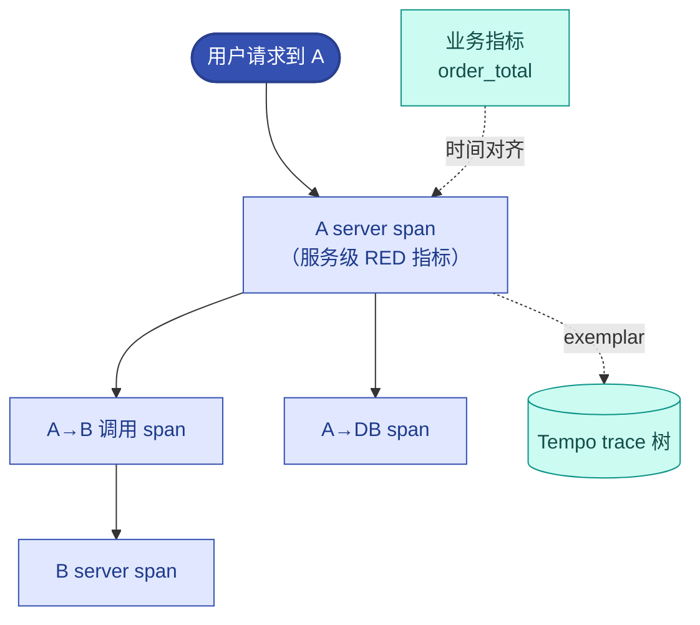

# 第12章 OpenTelemetry全域可观测体系
<!-- 第四篇 可观测与稳定性 ｜ 常规章（技术栈永久锁死） ｜ 状态：终审中 -->

> 本章定位：第四篇开篇，建立全域可观测体系。本章是全书可观测体系的技术栈锚点——后续所有观测章节与 AI 负载可观测（第 18 章）均复用本章技术栈。

> **技术栈锁死（永久不变）**：可观测栈 = VictoriaMetrics（指标）、Loki（日志）、Tempo（链路）、OpenTelemetry（采集）、Grafana（可视化）。不引入 Prometheus / ELK / Jaeger 等任何替代组件。
> **去工具化说明（原理优先）**：本章真正要讲的是**可观测的底层逻辑**——三支柱（指标/日志/链路）协同、trace ID 贯穿关联、低成本存储 + 统一可视化。这套逻辑**与具体组件无关**，换成任何等价栈（如 Prometheus + Loki + Jaeger 组合）同样适用。本书锁死 VM/Loki/Tempo 是**选一个参考实例**为保证全书落地一致，不是判定其他栈不可用；组件选型与对比不展开（归 V2）。读者应带走"可观测该怎么设计"的判断力，而非"必须用这五个组件"。
> **边界声明**：本章只讲统一可观测栈；AI 负载专属可观测（GPU/推理指标）归第 18 章；可观测平台化封装归第 16 章。**SLO/错误预算的定义与体系归第 13 章，本章只讲指标/日志/链路的采集与协同，不展开 SLO。**

---

## 12.1 可观测三支柱协同逻辑与生产落地边界

### 生产问题

团队的可观测是割裂的：监控看一套、日志查另一套、链路又一套，三者互不关联。出故障时，监控发现错误率升，要查日志得跳到另一个系统，查链路又跳第三个，靠人脑把三处信息拼起来定位根因，耗时长且易错。**三支柱（指标/日志/链路）不协同，可观测就从"全局视野"退化成"三个孤岛"**。

更隐蔽的痛点是：团队被告知"三支柱用 trace ID 关联、指标带 exemplar"就能一键跳转，但落地时一连串困惑——"指标是定时 scrape 的、trace 是按调用 push 的，exemplar 怎么挂上去？""业务自己写的指标怎么串不上 trace？""被调服务根本没暴露指标怎么办？"**这些困惑的根子是一个：没搞清"谁在造指标、谁在采指标、exemplar 到底挂在哪、哪些指标该串哪些不该串"**。本节把这些一次讲透。

### 传统方案失效原因

- **三支柱各自为政**：指标/日志/链路三套系统，无关联。
- **生产/采集角色混淆**：把 OTel 当成"和 PodMonitor 并行的另一个数据源"，其实一个是"造指标"的、一个是"拉指标"的（详见架构约束）。
- **误以为所有指标都能串 trace**：拿 exemplar 去套业务计数器，发现"串不上"就以为方案有问题——其实是用错了对象。
- **采集层不统一**：每支柱各装一套 agent，重复采集、配置割裂。
- **可视化割裂**：三支柱三个面板，无统一视图。

失效根因：**没有把三支柱作为协同整体设计，也没理清协同的真实机制**。可观测的价值在"关联定位"——从指标异常跳到日志、跳到链路；但这个"跳"有严格的适用边界，越界就会像上面那样"串不上"。

### 架构约束与权衡

三支柱协同有四条必须先理清的底层事实，它们决定了协同怎么做。

**事实一：指标要分清"生产侧"和"采集侧"，它们不是两个并行数据源。**

| 角色 | 职责 | 例子 |
|---|---|---|
| **生产侧（instrumentation）** | 把指标"造"出来，放进 `/metrics`，盖 exemplar 戳 | OTel SDK（业务自定义）、prom client、exporter（cadvisor / kube-state-metrics / node-exporter / DCGM） |
| **采集规则** | 告诉采集器"去哪拉、多久拉" | PodMonitor / ServiceMonitor |
| **采集器（拉侧）** | 按规则去 `/metrics` pull | vmagent |
| **存储** | 存下来供查询 | VictoriaMetrics |

`/metrics` 里那个 exemplar，是生产侧在造指标时盖的戳；vmagent 按 PodMonitor 去 `/metrics` 拉，把指标 + exemplar 一起拉回来。**PodMonitor 不增加，exemplar 也不增加采集链路**，采集只是把生产侧盖好的戳搬运回来。

> **前提条件（非无条件打通）**：exemplar 这条链路成立需要三处同时支持——① 应用侧客户端开 exemplar 注入（OTel SDK / 新版 prometheus client）；② vmagent 版本支持 exemplar 采集与 remote-write 透传（VictoriaMetrics 需较新版本）；③ Grafana 开 exemplar 渲染。任一环节版本过旧或未开启，exemplar 都拿不到——这是版本/实现前提，不是协议天然免费。

**事实二：trace 和 metric 是同一次调用的两个产物，exemplar 是把它们粘起来的桥。**

一次 A 调 B，被 OTel 自动埋点**同时**产出两样东西：一个 span（进 Tempo）和一组 RED 指标（进 VM，如 `http.client.request.duration`）。exemplar 就是 metric 数据点上的一个字段，指向同一次调用的那个 span。所以三者关系是：**同一次调用 → 产出一对（span + metric 点）→ exemplar 是 metric 点上指向 span 的指针**。exemplar 不创造新数据，它给"已存在的 metric 点"加一个 trace_id 指针。

**事实三：exemplar 只挂"每请求性能（RED）"这一层，业务计数器和基础设施指标不该挂、也挂不上。**

这是"自己写的指标串不上"的根因。exemplar 的本质是"这个数据点对应某一次具体请求"，而业务计数器（`order_success_total`）是千百次累加的累计值，没有"某一次"可言。三类指标各有正确的关联方式：

| 指标类 | 例子 | 和 trace 怎么关联 | 能否 exemplar 串 |
|---|---|---|---|
| **RED（每请求性能）** | 延迟、错误率、QPS | exemplar 直接挂，一键跳 trace | ✓ 能（原生或 spanmetrics） |
| **业务（聚合计数）** | 订单数、支付额、缓存命中率 | 不直接挂——靠**时间**关联 | ✗ 不该串 |
| **基础设施** | CPU、GPU、内存 | 不挂——靠**时间**关联 | ✗ 不该串 |

所以业务指标和 trace 不是断的，而是**靠"时间戳 + RED 桥"间接关联**：业务指标报警（出事了）→ 看同时刻 RED（哪条请求出问题）→ RED 的 exemplar 跳 trace（为什么）。三者各管一段，靠时间对齐 + exemplar 一座桥串起来。**写自己的业务指标完全没问题，它不串 exemplar 是对的——它该串的是"同时刻的 RED"。**

**事实四：被调服务没暴露指标时，用 spanmetrics 从 trace 反推指标，且反推出来的指标天然带 exemplar。**

很多服务（老服务、第三方服务）只接了 trace、没暴露 metric，导致"没 metric 点 → 没 exemplar 载体"。解法是 **spanmetrics**：让 trace 管线（OTel Collector 的 spanmetrics 连接器 / Tempo metrics-generator）顺手把 span 聚合成 RED 指标，remote_write 进 VM。因为指标是从 span 生成的，每个数据点天然知道自己对应哪条 trace，**exemplar 自动必然带**，不用操心 SDK 配置。RED 这一层推荐统一交给 spanmetrics（口径一致、只要有 trace 就有、exemplar 永远在线），原生 metric 只负责业务 + 基础设施。

权衡的核心：**三支柱协同不是一句"trace ID 关联 + 指标带 exemplar"那么简单**，而是建立在这四条事实上——生产/采集分离、同一次调用两产物、exemplar 只挂 RED 层、spanmetrics 兜底无 metric 场景。理解这四条，"串不上"的困惑自动消解。

### 最小可行方案

三支柱协同的最小落地（对应上面四条事实）：

1. **统一采集**：OpenTelemetry 作为统一采集层（metrics/logs/traces 同源，12.2 节）。
2. **统一关联键**：全链路注入 trace ID；日志带 trace ID；**RED 层指标带 exemplar**（业务/基础设施指标不挂，靠时间关联）。
3. **RED 层保证有**：服务能暴露 HTTP 指标的用原生；不暴露的用 spanmetrics 从 trace 衍生——任一方式保证 RED 这一层永远在线且带 exemplar。
4. **统一可视化**：Grafana 配三数据源（VM/Loki/Tempo），按 trace ID / exemplar 跳转。

### 生产落地实现

- **采集**：OTel SDK/Collector 统一采集三支柱（12.2 节）；基础设施指标由 exporter（cadvisor/DCGM/node-exporter）暴露，业务指标由业务 `/metrics` 暴露，都由 PodMonitor/vmagent pull 进 VM（12.3 节）。
- **exemplar 挂法**：服务被 trace（OTel SDK 起 span + 上下文传播）且 SDK 开 exemplar 注入后，记录 RED 直方图时自动把当前 span 的 trace_id 当 exemplar 盖到桶上；vmagent 拉 `/metrics` 时连 metric + exemplar 一起带出，存进 VM。
- **spanmetrics 兜底**：对不暴露 metric 的服务，Collector spanmetrics 连接器把 span 聚合成 RED 指标 remote_write 进 VM，且数据点天然带 exemplar。
- **关联排查路径**：业务指标报警（时间点）→ 同时刻 RED 指标（有 exemplar）→ 点 exemplar 跳 Tempo trace → trace 子 span 下沉到根因。
- **可视化**：Grafana 三数据源，RED 指标图带 exemplar 小圆点，点之跳 trace，trace 里按 trace ID 跳日志。

### 典型故障案例

某次排查，业务指标显示订单成功率下降，但订单成功率是计数器、挂不了 exemplar，团队卡在"怎么从订单指标跳到 trace"。按本节的 RED 桥思路：看同时刻 RED 指标，发现 checkout 请求错误率飙、且 checkout 是每请求指标、带 exemplar → 点 exemplar 跳到一条失败的 checkout trace → trace 显示支付网关超时。全程从"业务指标报警"到"trace 根因"，靠的是时间对齐 + RED 桥，而不是给业务计数器硬挂 exemplar。

另一类常见情况：被调服务 B 根本没暴露任何指标，团队以为"A→B 这条调用没 metric、exemplar 串不了"。实际用 spanmetrics 从 A→B 的 span 衍生出 RED 指标后，exemplar 天然带上，A→B 延迟异常照样能一键跳 trace。

点评：**三支柱协同的真实难点不在工具，而在搞清"exemplar 挂哪一层、哪些指标该串哪些靠桥"**。理解了 RED 层 + RED 桥，"串不上"基本是伪问题。

### 根因定位

根因不在某次定位慢，而在**三支柱未协同设计 + 协同机制没理清**。孤岛式可观测关联靠人脑拼接；就算拉了关联键，若把 exemplar 用错对象（套业务计数器）或没兜底无 metric 场景，仍会"串不上"。

### 长效治理方案

- OTel 统一采集三支柱；生产/采集角色分清（业务 + exporter 造，PodMonitor/vmagent 拉）。
- **exemplar 只挂 RED 层**；业务/基础设施指标靠时间 + RED 桥关联，不强挂。
- RED 层保证永远在线：原生 HTTP 指标 + spanmetrics 兜底，且 spanmetrics 保证 exemplar 必带。
- Grafana 三数据源统一面板，按 trace ID / exemplar 跳转。
- 排查走"业务指标 → 同时刻 RED → exemplar → trace"标准路径。

### 自动化/自治闭环

可观测是 L2 运维自治（第 16 章）与 L3 智能自治（第 18 章）的**信号基础**：**自治的决策依据来自可观测信号——L2 用 SLO（RED 层）指标决策处置，L3 用推理指标决策自适应**。exemplar 串通的 RED 层，正是 L2/L3 从"指标异常"跳到"具体请求 trace"做根因定位的入口；没有这层可靠的协同信号，自治的"观测→判断"就缺了精准定位能力。

### 生产检查清单

- [ ] 是否 OTel 统一采集三支柱，且生产侧（造）与采集侧（拉）角色分清？
- [ ] 全链路是否注入 trace ID，日志是否带 trace ID？
- [ ] **RED 层指标是否带 exemplar**（原生 HTTP 指标或 spanmetrics）？
- [ ] 不暴露 metric 的服务是否用 spanmetrics 兜底（保证 RED + exemplar 永远在线）？
- [ ] 是否避免给业务计数器/基础设施指标硬挂 exemplar（用时间 + RED 桥关联）？
- [ ] Grafana 是否三数据源关联可跳转（exemplar → trace → 日志）？
- [ ] 排查是否走"业务指标 → 同时刻 RED → exemplar → trace"标准路径？

---

## 12.2 全书统一可观测技术栈（永久不变）：VictoriaMetrics(指标)、Loki(日志)、Tempo(链路)、OTel(采集)、Grafana(可视化)，不引入任何替代组件
<!-- 全书可观测技术栈锚点·永久锁死 -->

### 生产问题

团队的可观测栈是历史堆叠：Prometheus（指标）+ ELK（日志）+ Jaeger（链路），三套独立系统，各自运维、各自存储、关联困难。Prometheus 单实例容量到顶、ELK 成本高昂、Jaeger 与其他系统割裂。**异构可观测栈运维负担重、成本高、关联弱**，且每次替换组件都牵动全局。

### 传统方案失效原因

- **异构堆叠**：Prometheus/ELK/Jaeger 三套，运维与成本翻倍。
- **Prometheus 单实例瓶颈**：大规模下单实例容量/高可用受限。
- **ELK 成本高**：日志全量索引，存储与计算成本高昂。
- **关联弱**：三套系统无原生关联，定位靠人拼。

失效根因：**没有用一套统一、轻量、协同的可观测栈替代异构堆叠**。

### 架构约束与权衡

全书统一可观测栈（永久锁死）：

| 组件 | 角色 | 选型理由（权衡） |
|---|---|---|
| **VictoriaMetrics** | 指标存储 | 高性能、低成本、兼容 Prometheus 协议、内置集群与长期存储 |
| **Loki** | 日志存储 | 仅索引元数据（非全文），成本远低于 ELK，与 Grafana 原生集成 |
| **Tempo** | 链路存储 | 与 Loki/VM 通过 trace ID 关联，对象存储后端成本低 |
| **OpenTelemetry** | 采集 | 厂商中立标准，三支柱统一采集 |
| **Grafana** | 可视化 | 统一面板，三数据源原生关联 |

权衡的核心：**这套栈以"低成本 + 高协同 + 标准化"为选型核心**——VM 比 Prometheus 更省更强、Loki 比 ELK 成本量级降低、Tempo 与前者通过 trace ID 原生关联、OTel 是中立标准、Grafana 统一可视化。本书永久锁死这套栈，不引入替代组件（不写 Prometheus/ELK/Jaeger 替代方案）。

### 最小可行方案

统一栈最小落地：

1. **指标**：VictoriaMetrics（集群版）替代 Prometheus，兼容既有 exporter。
2. **日志**：Loki + OTel Collector 采集，替代 ELK 全量索引。
3. **链路**：Tempo + OTel 采集，对象存储后端。
4. **采集**：OTel Collector 统一接收/转发三支柱。
5. **可视化**：Grafana 配 VM/Loki/Tempo 三数据源。

### 生产落地实现

- VM：集群版（vminsert/vmselect/vmstorage），兼容 Prometheus remote write，长期存储。
- Loki：元数据索引（label）+ 对象存储日志体，低成本检索。
- Tempo：链路存对象存储，按 trace ID 查询，与 Loki/VM 关联。
- OTel Collector：DaemonSet（节点采集）+ Gateway（聚合转发）两级拓扑。
- Grafana：统一面板，配三数据源，trace ID 关联跳转。

### 典型故障案例

团队从 Prometheus+ELK 迁到 VM+Loki，日志存储成本下降 80%（Loki 仅索引元数据），指标查询性能提升，且与 Tempo 链路原生关联。运维负担从三套系统降到一套协同栈。

点评：**统一栈不止省成本，更带来协同**——VM/Loki/Tempo 原生 trace ID 关联，是异构栈做不到的。

### 根因定位

根因不在某套系统差，而在**异构堆叠无协同**。统一栈用协同与标准化根治割裂与高成本。

### 长效治理方案

- 永久锁死 VM/Loki/Tempo/OTel/Grafana 五件套。
- 不引入替代组件（Prometheus/ELK/Jaeger 等）。
- 三支柱通过 trace ID 原生关联。
- 采集用 OTel 标准化，可视化用 Grafana 统一。

### 自动化/自治闭环

统一可观测栈是全书自治体系的**唯一信号底座**：**L1 机械自治的调谐、L2 运维自治的 SLO、L3 智能自治的推理指标，全部基于这套栈采集的信号**。锁死一套栈，让全书所有章节（含第 16、18 章）的自治决策有统一、可靠、协同的信号来源，避免多套栈导致的信号割裂。

### 生产检查清单

- [ ] 指标是否用 VictoriaMetrics（非裸 Prometheus）？
- [ ] 日志是否用 Loki（非 ELK 全量索引）？
- [ ] 链路是否用 Tempo（与 VM/Loki 关联）？
- [ ] 采集是否用 OTel 统一标准？
- [ ] 可视化是否 Grafana 统一 + 三数据源关联？
- [ ] 是否杜绝引入锁死栈外的替代组件？

---

## 12.3 集群、节点、容器、业务全维度指标标准化采集与治理

### 生产问题

团队的指标采集无标准：有的服务暴露指标、有的没暴露；标签（label）各写各的，同一概念多种标签名；基数失控（高基数标签导致指标爆炸）；节点/容器指标与业务指标割裂。**指标采集无标准化，导致查询难、关联难、成本失控（高基数）**。

### 传统方案失效原因

- **指标暴露随意**：服务是否暴露、暴露什么，无规范。
- **标签无标准**：同一概念多种 label，无法聚合查询。
- **高基数失控**：user_id/request_id 当 label，指标基数爆炸，存储成本飙升。
- **维度割裂**：基础设施指标与业务指标两套，无法关联。

失效根因：**指标采集没有标准化治理（命名/标签/基数/维度）**。指标是可观测的基石，无标准的指标无法支撑高效查询与自治决策。

### 架构约束与权衡

全维度指标标准化：

| 维度 | 采集内容 | 治理要点 |
|---|---|---|
| **集群** | 控制面健康、调度、节点数 | 控制面可观测（第 4 章） |
| **节点** | CPU/内存/磁盘/网络/容器运行时 | 资源水位（第 6、7 章） |
| **容器** | Pod 资源、重启、探针失败 | cgroup 指标（第 6 章） |
| **业务** | QPS/延迟/错误率/业务量 | 黄金信号 + 标签标准 |

权衡的核心：**标准化用"命名/标签/基数规范"换"可查询、可关联、成本可控"**。核心是黄金信号（延迟/流量/错误/饱和度）+ 统一标签规范 + 严控高基数。

### 最小可行方案

指标标准化最小集：

1. **黄金信号全覆盖**：每服务暴露延迟/流量/错误/饱和度四类。
2. **标签标准**：统一 label 命名（service/env/version 等），跨服务一致。
3. **基数严控**：禁止高基数 label（user_id 等），只保留低基数维度。
4. **全维度采集**：集群/节点/容器/业务四层指标都采，存 VictoriaMetrics。

### 生产落地实现

- 黄金信号：服务通过 OTel/SDK 暴露 RED+USE 指标。
- 标签标准：统一 `service`/`env`/`version`/`namespace` 等核心 label。
- 基数控制：label 仅用低基数维度，高基数信息走日志/链路（不进指标）。
- 采集：cAdvisor/kube-state-metrics/节点 exporter 采基础设施；OTel 采业务指标；统一存 VM。
- **spanmetrics 兜底**：不暴露指标的服务（老服务/第三方），用 OTel Collector spanmetrics 连接器从 trace 衍生 RED 指标进 VM——这样 RED 这一层对所有被 trace 的服务永远在线，且数据点天然带 exemplar（详见 12.1 事实四）。

### 典型故障案例

某服务把 `user_id` 当指标 label，用户增长后指标基数爆炸，VM 存储成本飙升且查询变慢。去掉高基数 label（user_id 走日志）后，存储回归正常。

点评：**高基数 label 是指标成本的头号杀手**，必须严控。

### 根因定位

根因不在某次成本飙升，而在**指标采集无标准化（标签/基数/维度）**。无标准的指标既难用又烧钱。

### 长效治理方案

- 黄金信号全覆盖（延迟/流量/错误/饱和度）。
- 标签命名标准化（跨服务一致）。
- 严控高基数 label（高基数走日志/链路）。
- 集群/节点/容器/业务四层全维度采集。

### 自动化/自治闭环

标准化指标是自治决策的**量化依据**：**L2 SLO（第 13 章）基于黄金信号定义，L3 推理自治（第 18 章）基于性能指标决策**。指标标准化，自治的"观测"与"校验"才有可靠量化输入；高基数失控则会让自治赖以决策的指标系统自身崩溃。

### 生产检查清单

- [ ] 每服务是否暴露黄金信号（延迟/流量/错误/饱和度）？
- [ ] 标签命名是否标准化（跨服务一致）？
- [ ] 是否严控高基数 label（无 user_id 等当 label）？
- [ ] 集群/节点/容器/业务四层指标是否全采？
- [ ] 指标是否统一存 VictoriaMetrics？

---

## 12.4 全链路日志采集、检索、脱敏与故障快速定位方案

### 生产问题

团队的日志：散在各节点/各 Pod，无统一采集；检索难（要 grep 一堆文件）；含敏感信息（密码/token 明文）；故障时翻日志定位根因耗时。**日志无统一采集、无高效检索、无脱敏，既是效率问题也是合规问题**。

### 传统方案失效原因

- **无统一采集**：日志留节点/Pod 内，Pod 销毁即丢失。
- **无结构化**：纯文本日志，无法高效检索/聚合。
- **无脱敏**：敏感信息明文进日志，合规风险。
- **无关联**：日志不带 trace ID，无法与指标/链路关联。

失效根因：**日志没有作为"可检索、可关联、合规"的工程对象治理**。

### 架构约束与权衡

日志治理（基于 Loki）：

| 维度 | 治理 | 权衡 |
|---|---|---|
| **采集** | OTel Collector 统一采集，集中存 Loki | 采集开销 vs 不丢失 |
| **结构化** | JSON 结构化日志，按 label 检索 | 结构化成本 vs 检索效率 |
| **脱敏** | 采集/输出侧脱敏（密码/token 打码） | 合规 vs 调试便利 |
| **关联** | 日志带 trace ID，与 Tempo 关联 | 关联 vs 独立 |

权衡的核心：**Loki 用"仅索引 label + 对象存储日志体"换低成本**，代价是查询依赖 label（非任意全文检索），所以结构化 + 标准 label 是高效检索的关键。

### 最小可行方案

日志治理最小集：

1. **统一采集**：OTel Collector 采集，集中存 Loki，Pod 销毁不丢日志。
2. **结构化**：JSON 结构化输出，标准 label（service/env/trace_id）。
3. **脱敏**：输出/采集侧脱敏，敏感字段打码。
4. **关联**：日志写 trace ID，与 Tempo 链路关联。

### 生产落地实现

- 采集：OTel Collector（DaemonSet 拓扑）采集节点/Pod 日志，转发 Loki。
- 结构化：服务输出 JSON 日志，含 trace_id/level/msg 等标准字段。
- 脱敏：日志库/Collector 侧对密码/token 等打码（附录 A 安全）。
- 关联：日志含 trace_id，Grafana 可从 trace 跳日志、从日志跳 trace。

### 典型故障案例

某次排查，因日志留 Pod 内且 Pod 已重建，关键日志丢失无法定位。统一采集到 Loki 后，Pod 销毁日志仍在，定位有据。另一次发现日志含明文 token，加脱敏后消除合规风险。

点评：**日志不集中 = 关键时刻丢失；日志不脱敏 = 合规地雷**。两者都是日志治理的底线。

### 根因定位

根因不在某次丢日志，而在**日志无工程化治理（采集/结构化/脱敏/关联）**。原始日志既低效又有风险。

### 长效治理方案

- OTel Collector 统一采集集中存 Loki。
- JSON 结构化 + 标准 label。
- 输出/采集侧脱敏。
- 日志带 trace ID，与 Tempo 关联。

### 自动化/自治闭环

日志治理是自治"根因定位"环节的**上下文来源**：**指标告警异常 → 跳链路 → 跳日志看上下文，三支柱协同定位根因**。日志集中、结构化、关联，让自治处置后的"根因定位"和"复盘"有据可查（第 13、14 章）。

### 生产检查清单

- [ ] 日志是否统一采集集中存 Loki（Pod 销毁不丢）？
- [ ] 日志是否 JSON 结构化 + 标准 label？
- [ ] 是否脱敏（敏感字段打码）？
- [ ] 日志是否带 trace ID 与 Tempo 关联？
- [ ] 是否摆脱了"翻文件 grep"的低效检索？

---

## 12.5 分布式链路追踪、微服务瓶颈分析、异常根因溯源实战

### 生产问题

一个请求经过 8 个微服务，某次偶发慢，团队只看到入口服务延迟高，但不知道慢在链路哪一段。没有链路追踪，定位分布式瓶颈靠"挨个服务查日志猜"，耗时且常猜错。**分布式系统没有链路追踪，跨服务瓶颈和异常根因几乎无法定位**。

### 传统方案失效原因

- **无链路追踪**：请求跨服务无关联，慢在哪段不可知。
- **采样不当**：全采样成本高，低采样漏掉偶发问题。
- **埋点不全**：关键跨度（DB/缓存/外部调用）没埋点，链路断裂。
- **不与指标/日志关联**：链路孤立，无法从指标异常跳到具体链路。

失效根因：**没有建立贯通的分布式链路追踪体系**。微服务化后，链路追踪是定位跨服务问题的唯一有效手段。

### 架构约束与权衡

链路追踪（基于 Tempo + OTel）：

| 维度 | 治理 | 权衡 |
|---|---|---|
| **埋点** | OTel SDK 自动 + 关键跨度手动（DB/外部） | 埋点成本 vs 完整性 |
| **采样** | 头采样/尾采样结合，平衡成本与捕获 | 采样率 vs 成本/捕获率 |
| **存储** | Tempo + 对象存储，按 trace ID 查询 | 成本低 |
| **关联** | trace ID 贯穿指标/日志 | 三支柱协同 |

权衡的核心：**链路追踪的价值在"跨服务因果可视化"**，代价是埋点与采样设计。尾采样（在出口决定是否保留）能在控成本的同时捕获异常 trace。

### 最小可行方案

链路追踪最小落地：

1. **OTel 自动埋点**：主流框架（HTTP/RPC/DB）自动埋点，低侵入。
2. **关键跨度补全**：手动补关键外部调用跨度，避免链路断裂。
3. **采样策略**：正常低采样 + 异常（高延迟/错误）尾采样必留。
4. **关联**：trace ID 贯穿，Grafana 三支柱跳转。

### 生产落地实现

- 埋点：OTel SDK 自动埋点（HTTP/gRPC/DB 客户端），关键业务跨度手动 span。
- 采样：Collector 尾采样（错误/慢 trace 必留，正常 trace 采样）。
- 存储：Tempo 存链路，对象存储后端，按 trace ID 查询。
- 关联：trace ID 注入日志/指标 exemplar，Grafana 从指标→trace→日志跳转。
- **A→B 分层 exemplar**：exemplar 挂在"有 metric 的那一层"（通常是服务级 RED 指标），跳的是这次请求的整棵 trace 树；A→B 即使自己没 metric，也是这棵树里的子 span，靠树状结构下沉定位即可。被调服务完全没暴露指标时，用 spanmetrics 从 trace 衍生 RED 指标 + exemplar（详见 12.1 事实三、事实四）。

### 典型故障案例

某偶发慢请求，入口延迟高但不知慢在哪。Tempo 链路显示卡在第 5 个服务的 DB 查询（一个未加索引的慢 SQL）。根因一目了然，修复后延迟正常。

点评：**链路追踪是分布式根因定位的"X 光"**，没有它，跨服务瓶颈只能靠猜。

### 根因定位

根因不在某次慢，而在**无链路追踪导致跨服务瓶颈不可见**。微服务化必然需要链路追踪，否则分布式问题无法定位。

### 长效治理方案

- OTel 自动埋点 + 关键跨度补全。
- 尾采样（异常必留 + 正常低采样）。
- Tempo 存链路，trace ID 贯穿三支柱。
- Grafana 三支柱关联跳转。

### 自动化/自治闭环

链路追踪是自治"根因定位"的**因果工具**：**自治（L2/L3）感知异常后，需要定位根因才能精准处置**——指标告诉你"有问题"，链路告诉你"问题在哪段"。链路追踪让自治的根因定位从"猜"变成"看"，大幅提升处置精准度。

### 生产检查清单

- [ ] 是否 OTel 自动埋点 + 关键跨度补全？
- [ ] 采样是否平衡成本与异常捕获（尾采样）？
- [ ] 链路是否存 Tempo + trace ID 贯穿？
- [ ] Grafana 是否三支柱关联跳转（指标→trace→日志）？
- [ ] 是否能从入口延迟快速定位到链路瓶颈段？
