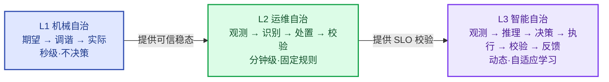

# 第16章 运维能力平台化与自治闭环
<!-- 第五篇 平台工程与自治 ｜ ★理论核心·运维自治（全书第二层理论核心） ｜ 状态：终审中 -->

> 本章定位：全书三层自治模型**第二层 · 运维自治**。逐层递进定义 L1/L2/L3 三层自治架构（终版定义），平台化固化为业务稳定性自治（SLO 监控 → 风险识别 → 自动化处置 → 结果校验），并用 KEDA 补齐第 7 章遗留的原生弹性短板。

> **边界声明**：本章只讲业务层运维自治与平台化固化；基础设施机械自治（L1 基座）承接第 5 章，AI 智能自治（L3 进化）承接第 18 章。**SLO 定义/错误预算见第 13 章，本章只讲其自动化闭环（观测→处置→校验）。15↔16 分工：第 15 章负责"能力封装"（黄金路径/开发者自助），本章负责"能力成环"（用封装好的能力跑 L2 自治闭环）。** 超出部分归 V2。

---

## 16.1 逐层递进三层自治架构（终版定义）
<!-- 【运维自治】全书三层自治终版定义：L1 机械自治 / L2 运维自治 / L3 智能自治 ｜ 概念立论小节，10 步模板从简（重在模型定义） -->

- **L1 基础设施自治（底层基座）**：K8s 资源调谐循环，完成基础资源稳态自愈（承接第 5 章）
- **L2 业务稳定性自治（中层治理）**：SLO 监控 → 风险识别 → 自动化处置 → 结果校验，实现业务稳定性可控（本章核心）
- **L3 AI 负载智能自治（上层进化）**：AI 运行观测 → 智能推理分析 → 动态决策 → 自适应执行 → 反馈迭代，适配复杂 AI 负载场景（承接第 18 章）

### 生产问题

团队的 K8s 已经能自愈（L1 到位），但仍有一类问题没解决：**业务稳定性出了状况（延迟飙升、错误率上升、容量过载），系统不会自动处置，全靠人发现、判断、操作**。L1 让基础设施"不死"，但没让业务"稳"。值班依旧被频繁叫醒处理本可自动化的处置（扩容、限流、回退）。**L1 解决不了业务稳定性自治，这是 L2 必须存在的理由**。而 AI 负载上线后，又出现 L2 也处理不了的复杂动态（KV 缓存、推理波动），那是 L3 的领域（第 18 章）。

### 传统方案失效原因

- **混为一谈**：把基础设施自愈（L1）当成"已经自治了"，忽视业务稳定性仍靠人。
- **跳级**：L2 没建好就上 L3 智能自治，决策无 SLO 校验，盲目自治（1.5 节案例）。
- **L2 无闭环**：有告警无处置、有处置无校验，处置对错不知。
- **不理解递进**：不知道三层各有信号/频率/校验差异，混用必然互相干扰。

失效根因：**没有把"自治"分层递进，每层各司其职、各有校验**。三层混做或跳级，都会导致自治失效甚至失控。

### 架构约束与权衡

三层自治终版定义（全书理论支点）：

| 层级 | 闭环 | 信号 | 决策频率 | 校验 | 承接 |
|---|---|---|---|---|---|
| **L1 机械自治（控制理论的"闭环控制"）** | 期望→调谐→实际 | 资源状态 | 秒级 | 资源收敛 | 第 5 章 |
| **L2 运维自治（传统可观测性 + 自动化运维）** | 监控感知→风险预判→自动处置→结果校验→复盘迭代 | SLO/错误预算/业务指标 | 分钟级 | SLO 恢复 | 本章 |
| **L3 智能自治（基于 AI Agent 的认知智能）** | 观测→推理→决策→执行→校验→反馈 | 推理性能/KV 缓存/算力动态 | 动态自适应 | 性能反馈 | 第 18 章 |

权衡的核心（与 1.5 节呼应）：**每升一层，决策复杂度与风险上升一层，必须用更严格的校验对冲**——L1 靠调谐（确定性），L2 靠 SLO 校验（可量化），L3 靠性能反馈（自适应）。校验之外还有护栏（评审 R10 共识）：**每层必须同时具备"上限/开关/人工阻断"三类护栏，缺一不允许上线**——L1 的 PDB 与节点池上限、L2 的 maxReplica 天花板与处置白名单、L3 的扩容日上限与影子模式（与 18.9 护栏同源）。上层依赖下层可信基础，不可跳级。

> **全书总图**：三层自治如何落在十三步业务闭环上、每步属 L1/L2/L3 哪一层，见 README「全书总图：业务闭环 × 三层自治」一表——两条主线在那张图里一图叠合。

三层自治闭环（决策智能度逐层递进：不决策 → 固定规则 → 推理自适应）：



> **关于 L2 闭环步数**：L2 闭环全书统一为 5 步（监控感知 → 风险预判 → 自动处置 → 结果校验 → 复盘迭代），本表定义与 16.4 落地一致；README/CONVENTIONS 的 3 步（观测风险 → 决策处置 → 结果校验）是概述层的压缩表达，非另一套闭环。

### 最小可行方案

三层自治的最小递进：

1. **L1 先稳**：K8s 调谐闭环可靠运转（第 5 章），基础稳态自愈成事实。
2. **L2 再建**：在 L1 之上建 SLO 体系 + 自动处置 + 结果校验（本章），把"业务稳定性处置"从人变闭环。
3. **L3 最后**：在 L2 之上对 AI 负载建推理驱动自适应闭环（第 18 章）。
4. **每层校验独立**：L1 看收敛、L2 看 SLO、L3 看性能，不混用。
5. **每层带护栏上线**：上限（maxReplica/日次数）、开关（一键停自动处置）、人工阻断（升级线）三件缺一不上线（评审 R10）。

### 生产落地实现

**① 三层落地映射表**（终版定义的"每层落地映射"——理论表格的每一行在这里找到真实信号、真实执行机构、真实护栏）：

| 层级 | 触发信号 | 执行机构 | 校验方式 | 人工兜底护栏（R10：上限/开关/人工阻断） |
|---|---|---|---|---|
| **L1** | 状态差/探针失败（期望≠实际） | 控制器/调度器（第 5 章） | 资源收敛（Ready、副本数达标） | PDB 容量底线（7 章）；节点池自动修复边界（ACK/EKS，4.2） |
| **L2** | SLO·burn-rate·告警（13.2 双窗口） | KEDA 扩缩/回滚（Rollouts）/重启 + 处置映射表 Runbook（16.3、16.4） | SLO 回归（5–10 min 校验窗） | maxReplica 天花板；自动处置白名单（与 13.3 同源）；P0 人工阻断线 |
| **L3** | 推理指标（18.5：TTFT/排队/KV 水位/抢占） | 参数调整/调度/缓存治理（18.7） | 推理 SLO 反馈（18.6） | 自动扩容 ≤2 次/日；影子模式先跑 1–2 周；触顶转人工（18.9） |

**② 三层就绪验收命令**（新集群/新服务接入后一次跑通三层，任何一层不绿就不算"L2 可开"）：

```bash
# L1 就绪：工作负载声明完整（探针/PDB/副本）——缺任一项，自愈是裸奔（5/7 章）
kubectl -n prod get deploy,pdb -o wide | grep -E 'NAME|order-api'
# L2 就绪：SLO burn-rate 规则已被 vmalert 加载（13.2 口径、VMRule 交付，12 章）
kubectl -n observability get vmrule | grep -E 'NAME|slo'
# L3 就绪：推理指标可查（18.5 采集链路通；无 AI 负载可跳过）
curl -s http://vmsingle-vm.observability.svc:8428/api/v1/query \
  --data-urlencode 'query=sum(vllm:num_requests_waiting{namespace="prod"})' | head -c 200
```

云服务映射：三层执行底座全部在托管 K8s 上——L1/L2 跑在 ACK（对照 EKS）ECS 节点池，L3 跑在 ACK GPU 节点池（gn7i/gn7e，对照 EKS g5/p4d，17.1）；节点级兜底用 ACK 节点池自动修复/自动伸缩（对照 EKS 托管节点组，4.2），不自建修复脚本。数字基线：L1 秒级调谐（控制器 15s 级同步）→ L2 分钟级处置（burn-rate 快烧 14.4× 双窗口、5 min 校验）→ L3 10 min 校验窗（18.9）——**决策越重，校验窗越长、护栏越硬**。

### 典型故障案例

某团队 L1 到位（K8s 自愈），但业务延迟飙升时无人自动扩容/限流，靠值班手动处置，MTTR 长。建 L2（SLO 监控 + KEDA 自动弹性 + 自动回退 + SLO 校验）后，业务稳定性异常自动处置，值班被叫醒次数大降。

点评：**L1 让系统不死，L2 让业务稳**。两层递进，才能从"基础设施自治"走向"业务稳定性自治"。

### 根因定位

根因不在 K8s 没配好，而在**只建了 L1、未建 L2**。业务稳定性治理仍靠人，是 L2 缺位。

### 长效治理方案

- 严格 L1→L2→L3 递进，不跳级。
- 每层独立信号与校验（L1 收敛/L2 SLO/L3 性能）。
- 每层护栏（上限/开关/人工阻断）随层上线，不后补（R10，与 18.9 呼应）。
- 上层依赖下层可信基础。
- L2 把业务稳定性处置自动化、闭环化。

### 自动化/自治闭环

本节是全书三层自治的**终版定义**：**L1（第 5 章）→ L2（本章）→ L3（第 18 章）逐层递进，构成现代运维从机械自愈到业务自治到智能自治的完整谱系**。本章 L2 是承上启下的中枢——它建立在 L1 之上，又为 L3 提供可信的 SLO 校验基础。理解三层递进，就读懂了全书的理论骨架。

### 生产检查清单

- [ ] L1 是否可靠（K8s 调谐闭环，基础稳态自愈）？
- [ ] L2 是否建立（SLO + 自动处置 + 结果校验）？
- [ ] 是否避免跳级（L2 没建好不上 L3）？
- [ ] 三层信号与校验是否独立（收敛/SLO/性能）？
- [ ] 每层是否具备上限/开关/人工阻断三类护栏（R10）？
- [ ] 业务稳定性异常是否能自动处置（不靠人）？

---

## 16.2 可观测、告警、SLO、发布能力的轻量化平台固化思路

### 生产问题

团队有了可观测（12 章）、告警与 SLO（13 章）、发布（10、11 章）能力，但这些能力各自独立、靠运维手工串联。每次新建服务都要重新配监控/告警/SLO/发布策略——一服务 6–10 处配置、约 2 人日，漏 1 处就是监控盲区。**L2 自治能力不固化进平台，就靠人逐个配，必然遗漏且不可扩展**。

### 传统方案失效原因

- **能力散装**：可观测/告警/SLO/发布各自独立，无统一固化。
- **逐服务手工配**：每个新服务重新配一遍，遗漏频发。
- **无标准模板**：每服务配置各异，质量参差。
- **平台化缺位**：L2 能力未固化为业务默认。

失效根因：**L2 能力没有轻量化平台固化**（与 15.3 节思路一致）。

### 架构约束与权衡

L2 四能力平台固化：

| 能力 | 固化方式 | 承接 |
|---|---|---|
| **可观测** | 基础 chart 注入 ServiceMonitor/日志采集 | 12、15 章 |
| **告警** | vmalert 规则仓库化（Git→ArgoCD 同步） | 13 章、本节 |
| **SLO** | 服务注册表 values 模板化生成默认规则 | 13 章、本节 |
| **发布** | 基础 chart 默认 Rollout（金丝雀） | 11 章 |

权衡的核心：**平台能力 = Git 里的模板，不是平台工程师的人肉**——能力以模板形态活在仓库里（PR 评审、版本化、可回滚），平台工程师维护模板，而不是替业务逐个配置。固化一次，全业务复用，遗漏归零。

### 最小可行方案

L2 能力固化最小集：

1. **可观测固化**：基础 chart 自动注入 ServiceMonitor（VM 采集）+ 日志采集（15.3 节）。
2. **告警固化**：vmalert 规则全部入 Git（rules/ 目录），ArgoCD 同步进集群（本节①）。
3. **SLO 固化**：服务注册表 values 一段，新服务接入即得默认 SLO 规则（本节②）。
4. **发布固化**：基础 chart 默认 Rollout（金丝雀步骤 + Analysis，11 章）。

### 生产落地实现

**① vmalert 规则仓库化**（规则文件放 Git，ArgoCD 同步进集群，vmalert 自动加载——与 12 章"VMRule CR 交付"一致）：

```text
platform-ops-repo/                    # 平台能力仓库（Git 唯一真相源，9/10 章）
├── charts/
│   ├── base-chart/                   # 基础 chart：探针/资源/PDB/ServiceMonitor（15.3）
│   └── service-chart/                # 业务 chart：服务注册表在 values（见②）
└── rules/                            # vmalert 规则仓库化：YAML 即制品，ArgoCD 同步
    ├── slo/                          # SLO burn-rate 规则（13.2 口径）
    ├── alerts/                       # 标准告警规则（13.1 口径）
    └── apps/                         # 服务专属规则（覆盖默认，命名 = <服务名>.yaml）
```

一个规则文件示例（变更链路：Git PR 双人评审 → merge → ArgoCD 同步 ≤5 min → vmalert 热加载；禁止 kubectl edit 线上规则——漂移会被 ArgoCD 回滚，10 章）：

```yaml
# rules/slo/order-api.yaml —— Git 里的一条规则，ArgoCD 同步进集群即生效
apiVersion: operator.victoriametrics.com/v1beta1
kind: VMRule
metadata:
  name: slo-order-api
  namespace: observability       # 生产禁改: 与 vmalert 同域；跨 ns 加载需改 ruleNamespaceSelector（12 章）
  labels: { role: alert-rules }  # 生产禁改: 必须匹配 vmalert 的 ruleSelector，不匹配规则不加载
spec:
  groups:
  - name: slo-burnrate
    rules:
    - alert: ErrorBudgetBurnFast      # 快烧口径与 13.2 完全同源（14.4×，1h/5m 双窗口）
      expr: |
        job:slo_errors:ratio_rate1h{job="order-api"} > (14.4 * 0.001)
        and on() job:slo_errors:ratio_rate5m{job="order-api"} > (14.4 * 0.001)
      for: 2m                         # 可调: 降噪窗口（13.1 铁律：写不出处置动作的告警不保留）
      labels: {severity: P0}
      annotations:
        summary: "order-api 错误预算快烧（1h/5m 双窗口 14.4×）"
        action: "按 13.3 SOP 止损；自动处置与升级线见 16.4 映射表"
```

**② SLO 模板化——服务注册表 values**（新服务接入只填这一段，默认规则即得）：

```yaml
# charts/service-chart/values.yaml —— 服务注册表（业务团队唯一要写的配置）
services:
  order-api:
    tier: core                      # 可调: core→默认 SLO 99.9%；internal→99.5%（13.2 基准）
    slo: { availability: 99.9, latencyP99Ms: 500 }  # 可调: 按近 90 天历史定，禁拍脑袋（13.2）
    alertDefaults: true             # 生产禁改: 关掉 = 放弃默认告警，必须 TL 审批
# chart 模板 range .Values.services 自动生成 6 条默认规则：
# burn-rate 快/慢、错误率、延迟 p99、预算剩余、探针存活——口径全部同 13.1/13.2
```

数字：新服务接入从手工配 6–10 处（约 2 人日，漏 1 处即监控盲区）→ 填一段 values（<30 分钟）；100 个服务 × 6 条规则 = 600 条规则由 1 份模板维护，规则口径升级（如 13.2 阈值修订）改 1 处、PR 合入后 ≤5 min 全局生效。云服务映射：平台仓库托管在云代码平台（阿里云云效 Codeup；对照 AWS CodeCommit/GitHub）；ArgoCD/vmalert 全跑在 ACK（对照 EKS）；<50 节点小团队可用 ARMS/CloudWatch 托管监控承接同等能力，但为与 12 章锁死栈一致，生产走自建栈（12.1 决策表）。

### 典型故障案例

某新服务忘配 SLO/告警，延迟劣化无人知，直到用户投诉。把 SLO/告警固化进基础 chart 与 rules/ 模板后，新服务继承即具备，劣化即时告警。

点评：**能力固化进 Git 模板 = 遗漏归零**。L2 自治能力必须平台化固化，不能靠人记。

### 根因定位

根因不在某次忘配，而在**L2 能力未平台固化**。散装能力靠人配，必然遗漏。

### 长效治理方案

- L2 四能力（可观测/告警/SLO/发布）固化进基础 chart 与 rules/ 仓库模板。
- 规则变更只走 Git PR（双人评审），线上直改零容忍。
- 业务继承即默认具备 L2 自治；能力演进随模板升级全局生效。

### 自动化/自治闭环

平台固化是 L2 自治**规模化的关键**：**L2 自治能力固化进 Git 模板，业务继承即默认具备"可观测+告警+SLO+金丝雀"自治**。这让 L2 从"运维逐个启用"变成"业务默认拥有"，是 L2 自治覆盖全业务的杠杆。

### 生产检查清单

- [ ] 可观测能力是否固化进基础 chart（ServiceMonitor/日志）？
- [ ] 告警/SLO 规则是否全部仓库化（rules/ 目录、PR 变更、无 kubectl edit）？
- [ ] 新服务接入是否只填服务注册表一段 values（默认规则自动生成）？
- [ ] 发布策略是否默认 Rollout（金丝雀）？
- [ ] 业务继承基础 chart 是否即具备 L2 自治？

---

## 16.3 KEDA分层弹性体系（与第7章HPA严格解耦）：聚焦业务层指标（队列积压、请求速率、Token吞吐），解答「如何通过平台能力补齐原生弹性短板，构建业务级自治弹性」
<!-- 【运维自治】补齐第 7 章原生 HPA 弹性短板 -->

### 生产问题

回顾第 7 章的核心痛点：HPA 只懂 CPU，对队列消费者/推理服务等"CPU 不高但负载过载"的场景失准（7.5 节）。这类负载需要按业务真实瓶颈（队列深度/请求数/Token 吞吐）弹性，但 HPA 做不到。**原生弹性短板（HPA 只懂 CPU）让大量真实负载弹性失准**，这就是 L2 要用平台能力补齐的地方——KEDA 分层弹性。

### 传统方案失效原因

- **HPA 信号错配**：CPU 不反映真实负载（7.5 节），弹性失准。
- **死磕 HPA**：在 HPA 上调参解决不了信号错配（根因是指标源限制）。
- **无业务指标弹性**：队列/请求/Token 等业务指标无法驱动弹性。
- **弹性与 L2 割裂**：弹性是 L2 自治的重要处置手段，但未纳入 L2 闭环。

失效根因：**没有用 KEDA 等业务指标弹性补齐 HPA 的原生短板**。本章与第 7 章严格分层：7.5 讲"HPA 不行"，本节讲"KEDA 怎么补"。

### 架构约束与权衡

KEDA 与 HPA 的关系表（治理分层 + 实现机制，一次说清）：

| 维度 | HPA（K8s 原生，L1） | KEDA（平台补齐，L2） |
|---|---|---|
| 指标源 | metrics-server 的 CPU/内存 | 任意业务指标（60+ scaler：Prometheus(VM)/Kafka/云队列/ cron 等） |
| 弹性语义 | 资源利用率目标（65% CPU） | 业务语义目标（积压/排队/在线连接数） |
| scale-to-zero | 不支持（min ≥1） | 支持（minReplicaCount: 0，仅批处理类允许） |
| 实现关系 | K8s 原生对象 | **KEDA 在背后创建并托管一个 HPA**，业务指标经 KEDA metrics server 转成外部指标驱动它——不是 HPA 之外并行的一套 |
| 分工（7.5 边界表） | CPU 反映负载的负载留在 HPA | 信号错配的负载迁 KEDA（7.5 迁移清单） |

权衡的核心：**KEDA 用"业务指标驱动"补齐 HPA 的"只懂 CPU"短板**（7.5 的四类痛点在此收口），让弹性信号匹配真实负载瓶颈。KEDA 与 HPA 分层解耦、各管一类负载，不是替代关系。

### 最小可行方案

KEDA 分层弹性最小落地：

1. **识别负载类型**：CPU 反映负载的用 HPA；业务瓶颈驱动的用 KEDA（7.5 边界表）。
2. **KEDA 接业务指标**：队列深度（队列消费者）、在线连接/请求速率（网关）、Token 吞吐（推理服务，18.7）。
3. **分层解耦**：HPA 与 KEDA 各管一类负载，不混用。
4. **纳入 L2 闭环**：KEDA 弹性作为 L2 自动处置手段，配 SLO 校验（16.4）。

### 生产落地实现

**① 安装**（Helm，chart 仓库 kedacore；CRD 随 chart 安装，与目标 K8s 版本的兼容矩阵以官方文档为准）：

```bash
helm repo add kedacore https://kedacore.github.io/charts && helm repo update
helm install keda kedacore/keda -n keda --create-namespace
# 生产纪律：部署时显式 --version 钉死当期版本，升级必须走 PR 评审（不裸 latest）
kubectl -n keda get pods   # 验收：keda-operator 与 keda-operator-metrics-apiserver 就绪
```

**② ScaledObject 制品一：通用业务指标驱动**（prometheus trigger 指向 VM 查询接口——长连接网关按在线用户数弹性，CPU 很低但连接打满的典型，7.5 边界表"IO/网络密集型"）：

```yaml
apiVersion: keda.sh/v1alpha1
kind: ScaledObject
metadata: { name: im-gateway-scaler, namespace: prod }
spec:
  scaleTargetRef: { name: im-gateway }      # 目标 Deployment（KEDA 背后为它建并托管一个 HPA）
  minReplicaCount: 3                        # 可调: 扩容下限 ≥ AZ 数（4.2 多 AZ）；在线服务禁设 0
  maxReplicaCount: 24                       # 生产禁改: 扩容天花板=预算护栏，触顶告警转人工（16.4）
  pollingInterval: 15                       # 可调: 信号轮询间隔（默认 30；长连接突变业务取 10–15）
  cooldownPeriod: 300                       # 可调: 缩容防抖（默认 300s；连接断开慢的业务调大）
  triggers:
  - type: prometheus                        # 指向 VictoriaMetrics 查询接口（Prometheus 兼容 API）
    metadata:
      serverAddress: http://vmsingle-vm.observability.svc:8428   # 12 章 vmsingle；Service 名以实际部署为准
      query: sum(im_gateway:online_connections{namespace="prod"})
      threshold: "6000"                     # 可调: 每副本目标连接数=实测单副本稳载 12000 × 50% 水位
      activationThreshold: "6000"           # 可调: 总连接低于单副本阈值即回到 min（防低位抖动）
  fallback:                                 # 护栏: 指标源失联安全值（防"VM 挂了 → 信号为 0 → 缩死"）
    failureThreshold: 3                     # 可调: 连续 3 次取数失败即进入 fallback
    replicas: 6                             # 可调: 失联兜底副本数=日常峰值均值，宁多勿少
```

**③ ScaledObject 制品二：消息队列积压驱动**（kafka trigger——7.5 队列消费者的解药；字段保守，字段语义以官方文档为准）：

```yaml
apiVersion: keda.sh/v1alpha1
kind: ScaledObject
metadata: { name: order-consumer-scaler, namespace: order }
spec:
  scaleTargetRef: { name: order-consumer }
  minReplicaCount: 2      # 可调: 兜底（只有批处理才允许 0，避免冷启动）
  maxReplicaCount: 20     # 生产禁改: 天花板=人工兜底线；触顶 → P1 升级（16.4 映射表）
  pollingInterval: 30     # 可调: 默认 30s
  cooldownPeriod: 300     # 可调: 缩容防抖，防副本数震荡
  triggers:
  - type: kafka
    metadata:
      bootstrapServers: kafka:9092   # 云映射: 可直接指向阿里云消息队列 Kafka 版接入点（对照 AWS MSK）
      consumerGroup: order-consumers
      topic: orders
      lagThreshold: "5000"   # 可调: 每副本目标积压（KEDA 按总积压 ÷ 该值折算期望副本）：
                             #   单副本消费 500 条/s × 10s 追平目标 = 5000；语义以官方文档为准
```

**④ 验证 KEDA 托管 HPA 的机制**（参数只改 ScaledObject，别碰它建的 HPA）：

```bash
kubectl -n order get hpa,scaledobjects.keda.sh -o wide
# 会看到 KEDA 创建并托管的 HPA（名字形如 keda-hpa-order-consumer-scaler）：
# 直接删改该 HPA 会被 KEDA 重建覆盖——一切参数只改 ScaledObject（Git→ArgoCD 交付）
```

**⑤ 护栏参数表**（每个参数一句护栏语义——R10 的"上限/开关/人工阻断"落在弹性参数上）：

| 参数 | 护栏语义 | 生产参考值 |
|---|---|---|
| `minReplicaCount` | 扩容下限=常驻容量护栏，防"信号归零缩死"（≥ AZ 数，7.3） | 在线服务 2–6；批处理可 0 |
| `maxReplicaCount` | **扩容天花板=人工兜底第一道**：触顶即告警转人工（16.4），改动须评审 | 常态峰值 ×1.3–2 |
| `cooldownPeriod` | 缩容防抖护栏：缩回前必须冷静多久，防副本震荡（默认 300s） | 300–600s |
| `fallback.replicas` | 指标源失联安全值：取不到信号时按此数兜底，宁多勿少 | 日常峰值均值 |
| `activationThreshold` | 低水位回收线：信号低于此值回到 min，防低位抖动扩缩 | ≈1 副本阈值 |

一句推理边界：**KEDA 的缩容与模型加载时长天然冲突**——副本缩下去再扩回来要重付 1–3 min 模型加载（17.4），推理服务的 cooldownPeriod 必须覆盖它，专属 ScaledObject 见 18.7（本节不重复其 YAML）。

云服务映射：KEDA 全部跑在 ACK（对照 EKS）；kafka trigger 的 bootstrapServers 可直接指向阿里云消息队列 Kafka 版（对照 AWS MSK）；副本扩容触达节点不足时由 ACK 节点池弹性/自动伸缩补节点（对照 EKS 托管节点组/Karpenter，与 18.7 同款分层，不越层）。数字：扩容链路 = KEDA 轮询 15–30s + 新 Pod 调度过探针 30–90s + 节点池补节点 3–5 min；threshold 反推示例见 ②③（每副本 6000 连接 / 5000 积压）。

> **技术澄清（HPA vs KEDA）**：HPA 原生就支持 custom/external metrics（经 metrics adapter，如 Prometheus Adapter），并非"只懂 CPU"；而 **KEDA 在 K8s 模式下，本身就是在背后创建并托管一个 HPA 对象**——KEDA 是"更好的指标适配器 + 触发器控制器"，不是 HPA 之外的另一套并行机制。本节"L1 HPA / L2 KEDA"是**治理层面的概念划分**（原生 CPU 弹性 vs 业务指标弹性），非组件实现上的物理隔离。

### 典型故障案例

回顾 7.5 节的队列消费者：HPA（CPU）失准、积压严重。改 KEDA（队列深度驱动）后，扩缩精准匹配积压，积压消除。这正是本节对 7.5 痛点的闭环解答。

点评：**KEDA 是 L2 用平台能力补齐 L1 原生短板的典型**——HPA（L1）做不到的，KEDA（L2）补上，分层清晰。

### 根因定位

根因不在 HPA 配置，而在**HPA 信号错配且未用 KEDA 补齐**。本节是 7.5 痛点的解法，构成"L1 短板→L2 补齐"的完整闭环。

### 长效治理方案

- 按负载类型分层弹性（HPA for CPU，KEDA for 业务指标，7.5 边界表）。
- KEDA 接业务真实瓶颈指标，threshold 用容量数字反推（不拍脑袋）。
- 护栏参数表随 ScaledObject 一起评审（max 是人工兜底线）。
- 弹性纳入 L2 闭环（配 SLO 校验，16.4）。

### 自动化/自治闭环

KEDA 是 L2 运维自治的**核心弹性处置手段**：**L2 闭环"观测（业务指标）→识别（过载）→处置（KEDA 扩缩）→校验（SLO 恢复）"中，KEDA 承担"处置"环节**。它补齐了 L1（HPA）覆盖不到的业务级弹性，让 L2 自治在弹性领域真正闭环。这也是"L1 短板由 L2 平台补齐"分层解耦的最佳例证。

### 生产检查清单

- [ ] 是否按负载类型分层弹性（HPA for CPU，KEDA for 业务指标）？
- [ ] KEDA 是否接业务真实瓶颈指标（队列/连接数/请求速率）？
- [ ] threshold 是否用容量数字反推（每副本承载量），而非拍脑袋？
- [ ] 指标源失联是否有 fallback 安全值（防缩死）？
- [ ] KEDA 弹性是否纳入 L2 闭环（配 SLO 校验）？
- [ ] 是否避免在 HPA 上死磕（信号错配用 KEDA）？

---

## 16.4 完整运维自治链路：监控感知 → 风险预判 → 自动处置 → 结果校验 → 复盘迭代
<!-- 【运维自治】业务稳定性自治闭环（L2） -->

### 生产问题

团队的 L2 各环节都有（监控/告警/弹性/回退），但没有串成闭环：监控发现问题→人判断→人处置→处置完不校验是否真恢复→不复盘。**L2 环节不闭环，自治就退化成"半自动"——前半段自动、后半段靠人，效果打折**。

### 传统方案失效原因

- **环节断裂**：监控/处置/校验各自独立，无闭环串联。
- **无结果校验**：处置后不验证 SLO 是否恢复，处置对错不知。
- **无复盘反哺**：处置完不复盘，经验不沉淀为自治规则。
- **靠人补位**：环节间的衔接靠人，不闭环。

失效根因：**没有把 L2 串成"感知→预判→处置→校验→复盘"的完整闭环**。

### 架构约束与权衡

L2 完整自治链路：

| 环节 | 作用 | 实现 |
|---|---|---|
| **监控感知** | 发现异常（可观测+告警） | 12、13 章 |
| **风险预判** | 判断是否需处置（SLO/错误预算） | 13 章 |
| **自动处置** | 执行处置（弹性/回退/限流） | KEDA/Rollouts |
| **结果校验** | 验证 SLO 是否恢复 | 13 章 SLO |
| **复盘迭代** | 沉淀根因为自治规则 | 14.4 节 |

权衡的核心：**闭环的价值在"自动 + 校验 + 反哺"，代价是处置必须圈死在白名单内**——白名单内的才允许自动执行，白名单外一律人工（13.3）。缺白名单的自治是失控，缺校验的自治是盲目。

### 最小可行方案

L2 完整闭环最小落地：

1. **监控感知**：告警驱动（13 章），异常即时感知。
2. **风险预判**：SLO/错误预算判断是否需处置（13.2 burn-rate 双窗口）。
3. **自动处置**：白名单内自动执行——KEDA 扩缩（16.3）/Rollouts 回退（11 章）/重启。
4. **结果校验**：处置后 5–10 min 校验 SLO 恢复（13.2），未恢复升级。
5. **复盘迭代**：复盘根因，沉淀为自治规则/告警（14.4 节）。

### 生产落地实现

**① 处置动作映射表**（L2 闭环核心制品：信号→预判→处置→校验→升级，一行一个场景，全链路无断点）：

| 观测信号（12/13 章） | 预判 | 自动处置（复用通道） | 结果校验 | 人工升级条件 |
|---|---|---|---|---|
| burn-rate 快烧 14.4×（13.2） | 容量不足/变更致过载 | 自动扩容 ≤2×（白名单上限；KEDA 通道，16.3） | 5 min 后 burn-rate 回落 <14.4× 且 SLO 回归 | 10 min 未回归 → P0 电话人工（13.3 SOP） |
| 金丝雀 5xx 超 Analysis 阈值（11 章） | 变更引入缺陷 | Argo Rollouts 自动 abort + 回退 | 回退后错误率 5 min 归零 | 同版本连续 2 次回退 → 冻结发布人工排查 |
| Pod 重启 >3 次/15min（13.1） | 实例级故障 | L1 探针自愈 + 重调度（5 章） | 重启后 Ready 且错误率不升 | 15 min 内再重启 → P2 工单 |
| 队列积压持续上涨（16.3） | 消费力不足 | KEDA 扩消费者（≤maxReplicaCount） | 积压 10 min 内回落 | 扩到天花板仍涨 → P1 + 节点池弹性确认 |
| 错误预算耗尽（13.2 四档） | 稳定性透支 | 发布自动冻结（11 章接四档管控） | 预算回升 >25% 出解冻候选 | 解冻须 SLO 负责人 + 技术负责人双签 |
| 下游依赖超时率突增 5× | 依赖故障 | 切预设降级开关/熔断（预设的才自动） | 降级后成功率 5 min 回升 | 无预设开关 → P1 人工 |

**② 自动处置白名单**（与 13.3 应急白名单同源维护——白名单双份必漂移：值班人肉版与自治系统版必须是同一份文档）：

| 自动处置允许（白名单内） | 一律人工（白名单外，走 13.3 审批） |
|---|---|
| 扩缩容：副本 ≤2× | 数据库变更/删数据 |
| 回退：argocd rollback、Rollouts abort | 安全组/网络配置变更 |
| 重启：Pod/实例级（探针自愈同源） | 存储扩缩容/切换 |
| 切预设降级开关 | 影响其他团队的任何变更 |

白名单铁律：**自治系统只执行"可校验、可回滚、影响单服务"的处置**；跨服务/不可逆操作永远人工。白名单变更走 Git PR + 稳定性负责人评审（与 13.3/13.4 同源）。

**③ 处置契约规则**（vmalert 规则片段，放 16.2 rules/ 仓库：可自动处置的告警，annotation 三字段=处置+校验+升级线，机器可读、值班可读）：

```yaml
- alert: ErrorBudgetBurnFast          # 完整 VMRule 见 16.2①；此处节选处置契约三字段
  expr: |
    job:slo_errors:ratio_rate1h{job="order-api"} > (14.4 * 0.001)
    and on() job:slo_errors:ratio_rate5m{job="order-api"} > (14.4 * 0.001)
  for: 2m
  labels: {severity: P0}
  annotations:
    summary: "order-api 错误预算快烧（14.4× 双窗口）"
    action: "自动扩容 ≤2×（白名单内）；无自动通道的场景按 13.3 SOP 手动"
    verify: "5 min 后 burn-rate <14.4× 且 SLO 回归"      # 结果校验窗口
    escalation: "10 min 未回归 → P0 电话人工（13.1 通道）" # 人工阻断线
```

**④ 闭环度量三数字**（月度从故障台账（13.4）取数，自治成熟度只看这三个）：

| 指标 | 口径 | 目标区间 |
|---|---|---|
| 自动处置占比 | 自动闭环事件 ÷ 处置事件总数 | 起步 <20% → 6 个月 ≥60%（长期 ≥80%，仅限白名单类） |
| 误处置率 | 处置后 10 min SLO 未回归或反升 ÷ 自动处置数 | ≤5%；超 5% 该规则强制回影子模式（只告警不执行，18.9 同款） |
| 人工升级率 | 升级人工 ÷ 自动处置数 | 20%–40%：过高=白名单过窄，过低=护栏过松须复核 |

云服务映射：处置通道全部落在云生态制品上——扩缩 = KEDA（16.3）+ ACK 节点池弹性（对照 EKS 托管节点组/Karpenter）；回退 = ACK 上 ArgoCD/Rollouts；P0 电话升级 = 云语音通道（13.1：阿里云语音服务/钉钉电话，对照 AWS SNS）。数字基线：校验窗 5–10 min、扩容 ≤2×、升级线 10 min——与 13.3 的 P0 30 min 止损目标衔接（自动处置 10 min 无效即转人工，仍留 20 min 人工窗口）。

### 典型故障案例

某服务过载，告警触发→KEDA 自动扩容→但扩容后未校验，实际 SLO 未恢复（根因是下游 DB），处置无效。补"结果校验"环节（扩容后校验 SLO，未恢复则升级告警人工介入）后，无效处置被即时发现并升级。

点评：**没有校验的自治是盲目的**。校验环节让 L2 自治"知道处置是否有效"，是闭环关键。

### 根因定位

根因不在某次处置无效，而在**L2 环节未闭环（无校验/无复盘）**。半自动的 L2 效果打折。

### 长效治理方案

- L2 五环节闭环串联（感知→预判→处置→校验→复盘），处置圈死白名单内。
- 处置必校验（SLO 恢复），未恢复升级；处置契约三字段（action/verify/escalation）随规则入库。
- 月度闭环三数字（自动处置占比/误处置率/人工升级率）纳入复盘看板。
- 复盘根因反哺自治规则。

### 自动化/自治闭环

本节是 L2 运维自治的**完整闭环定义**：**感知→预判→处置→校验→复盘，全闭环的 L2 实现了"业务稳定性自动化治理"**——这正是全书第二层自治的目标。L2 闭环的成熟度，决定了"值班被叫醒次数"能降多少。同时，L2 闭环（尤其校验与复盘）为 L3 智能自治（第 18 章）提供了可信基础与方法论模板——L3 的"观测→推理→决策→执行→校验→反馈"正是 L2 闭环在 AI 负载场景的进化版。

### 生产检查清单

- [ ] L2 是否五环节闭环（感知→预判→处置→校验→复盘）？
- [ ] 处置动作映射表是否覆盖高频场景（每行含校验与升级线）？
- [ ] 自动处置白名单是否与 13.3 同源维护（自治版=人肉版边界一致）？
- [ ] 处置后是否校验 SLO 恢复（未恢复 10 min 升级人工）？
- [ ] 月度是否出闭环三数字（占比/误处置率/人工升级率）？
- [ ] 复盘根因是否反哺自治规则？
