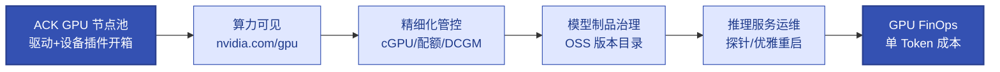

# 第17章 AI负载与异构算力生产运维
<!-- 第六篇 AI原生运维核心体系 ｜ 常规章（纯运维视角·全书差异化王牌） ｜ 状态：终审中 -->

> 本章定位：从纯运维视角讲 AI 异构算力与 AI 负载生产运维。**全书生态锁定云托管 GPU 节点池（阿里云 ACK 主参考、AWS EKS 对照），裸机自管 GPU 一律不讲**。不讲解 CUDA、SM、NVLink 等硬件底层原理；AI 模型大镜像运维完整承接第 2 章迁移内容，边界永久固定。
> **主线定位**：本章为L3 智能自治的算力基座——GPU 算力治理为第 18 章推理自治供弹药；Agent 服务的运维差异在第 18.8 节展开（边界锁死）（三层自治总览见 1.5，理论核心为第 5/16/18 章）。

> **技术栈锁死**：AI 推理栈 = vLLM、SGLang（完整性能参数归第 18 章）；算力底座 = ACK GPU 节点池 + cGPU 共享调度（对照 EKS 托管节点组 + NVIDIA GPU Operator）；GPU 指标 = DCGM exporter 进 VictoriaMetrics（12 章）。
> **边界声明**：本章不讲硬件原理（CUDA/SM/NVLink/TPU/MIG 深度）、不讲 GPU 池化深度方案（vGPU 平台/池化软件归 V2 一句带过）、不讲模型漂移、不展开新兴 AI 框架。推理性能与 KV Cache 归第 18 章。以上归 V2。

---

本章核心图——AI 异构算力生产链路（云托管 GPU 节点池：算力可见 → 可管控 → 可运营）：



## 17.1 AI异构算力生产体系：GPU设备插件、算力池化、调度核心运维逻辑（不讲解CUDA、SM、NVLink等硬件底层原理）

### 生产问题

一张 A10 节点按量 ¥8–15/时（整机 CPU 配比不同，gn7i-c32g1 偏上限，以官网当期价为准）、一台 8 卡 A100 节点月账单十万级量级——最贵的资源进了集群却用不上：Pod 申请 `nvidia.com/gpu` 直接 Pending、调度器不知道哪些节点有卡、AI Pod 与普通 Pod 混部互相拖垮。**异构算力对默认 K8s 是"看不见、调不动、管不住"，最贵的资源反而最难用**。

### 传统方案失效原因

- K8s 默认不认 GPU：无设备插件，GPU 对调度器不可见（定论，不再论证）。
- 裸机自管 GPU：**为什么不裸机**——驱动版本适配、坏卡替换、弹性伸缩全自担，且脱离统一交付/可观测底座（第 4 章），回到第一代运维，仅此一句对照，后文不再出现。
- 无共享能力：整卡独占分配，闲时利用率常见 <30%（17.5）。

失效根因：**没有建立"托管 K8s 认得 GPU + 可调度 + 可管控"的异构算力生产体系**。本章纯运维视角，CUDA/SM/NVLink 硬件原理归 V2。

### 架构约束与权衡

云托管 GPU 节点池开箱能力对照：

| 能力 | ACK GPU 节点池（主参考） | AWS EKS（对照） |
|---|---|---|
| GPU 驱动 | 建池时选驱动版本，自动安装 | GPU 优化 AMI 预装，或 GPU Operator 托管 |
| 设备插件 | 自动部署 NVIDIA device plugin，节点就绪即报 `nvidia.com/gpu` | 需自装 GPU Operator / device plugin |
| 共享调度 | cGPU 共享调度（显存隔离，17.2） | 无原生对应（时间分片自建，深度归 V2） |
| 节点运维 | 自动修复/自动升级/抢占式（4.2 参数表同适用） | 托管节点组同款能力 |

GPU 规格选型表（价格均为量级参考，**以官网当期价为准**）：

| 规格 | 卡/显存 | 定位 | 阿里云 | AWS | 按量价量级 |
|---|---|---|---|---|---|
| A10 | 24G | 推理主力（7B–14B） | gn7i 系列（如 ecs.gn7i-c32g1.8xlarge，1 卡） | g5（A10G 24G） | A10 单卡节点按量 ¥8–15/时（整机 CPU 配比不同，gn7i-c32g1 偏上限）；g5.xlarge ≈ $1/时 |
| A100/H800 | 80G | 大模型训练/大 batch 推理 | gn7e 系列（A100 80G）/H800 系列 | p4d/p4de（A100 40G/80G） | 单卡折算 ¥20–35/时（8 卡整机 ¥160–280/时）；p4de.24xlarge ≈ $41/时 |

折扣方向：包月 < 包周 < 按量；抢占式实例常见再低 40%–90%（4.2）。**常驻推理走包月/包周，突发训练走按量 + 抢占式组合**。

**典型 GPU 配置月成本速查**（按 730 小时/月折算，量级参考，**以官网当期价为准**）：

| 配置 | 按量 | 包月（常见约 6–7 折） | 抢占式（常见再低 40%–90%） |
|---|---|---|---|
| A10 单卡节点（gn7i，推理主力） | ≈¥5,800–11,000/月 | ≈¥3,500–7,700/月 | ≈¥600–6,600/月 |
| A100 80G 单卡折算（gn7e） | ≈¥14,600–25,600/月 | ≈¥8,800–17,900/月 | ≈¥1,500–15,400/月 |
| g5.xlarge（EKS 对照，A10G 24G） | ≈$730/月 | RI/Savings Plans 常见再降 30%–60% | ≈$220–440/月 |

读法：**价差杠杆最大的是"包月 vs 按量"（常驻推理必包月）与"抢占式 vs 按量"（可重算负载用 Spot）**——选错付费方式的成本差异常常大于选错型号。

给这笔钱一个体感：A10 单卡按量 ≈¥5,800–11,000/月——**相当于一名外包工程师的月薪，买一张 7×24 不休息的算力**；这份"工资"按量发还是包月发，一年差出数月卡钱（量级估算，以官网当期价为准）。

付费方式怎么选没有单答案，把读法段的结论展开成决策变量（DDIA 式"取决于什么"）：

| 决策变量 | 倾向包月/包周 | 倾向按量 + 抢占式组合 |
|---|---|---|
| 负载常驻性 | 常驻在线（7×24 推理底座） | 短时任务，用完即还 |
| 突发模式 | 平稳可预测，容量线性可算 | 峰谷差大的突发训练/批处理 |
| 中断容忍度 | 不可中断（在线服务，断即故障） | 可中断可重算（有 checkpoint、能重跑） |

权衡的核心：**推理默认 A10 打底、训练/大 batch 才上 A100/H800**——A10 单位算力成本约为 A100 的 1/3，小模型 serving 不占大卡。GPU 池化深度方案（vGPU 平台、池化软件）归 V2，一句带过不进正文。多卡张量并行（--tensor-parallel-size>1）、NCCL 拓扑约束与多 Pod 分布式推理的 gang 调度（Volcano/Kueue）同归 V2——32B+ 大模型多卡推理的运维深度不在 V1 范围，但选型时要预判：单卡量化优先于多卡 TP 的运维简单性。

### 最小可行方案

1. **建 GPU 节点池**：ACK 建池即选驱动版本，节点上线自动装驱动 + device plugin，直接可申请 `nvidia.com/gpu`（EKS 对照：建托管节点组 + 自装 GPU Operator）。
2. **专用调度**：节点池打标签 + 污点，GPU 只给 AI 负载（7 章）。
3. **单池同规格**：一个节点池一种 GPU 型号（4.2），容量估算线性可算。
4. **按需共享**：利用率敏感的轻负载用 cGPU 共享调度（17.2），性能敏感独占。

### 生产落地实现

**① ACK GPU 节点池创建（声明式，节点池 JSON 为合法可提交体，注释见下方标注）**：

```bash
cat > gpu-nodepool.json <<'EOF'
{
  "nodepool_info": {
    "name": "gpu-a10-inference",
    "type": "Node",
    "auto_scaling": { "enable": true, "min_instances": 1, "max_instances": 12 },
    "count": 2
  },
  "scaling_group": {
    "instance_types": ["ecs.gn7i-c32g1.8xlarge"],
    "vswitch_ids": ["vsw-xxx-a", "vsw-xxx-b"],
    "system_disk_category": "cloud_essd",
    "system_disk_size": 200,
    "platform": "AliyunLinux 3"
  },
  "kubernetes_config": {
    "labels": [{ "key": "gpu", "value": "a10" }],
    "taints": [{ "key": "dedicated", "value": "gpu", "effect": "NoSchedule" }]
  }
}
EOF
aliyun cs POST /clusters/<cluster-id>/nodepools --body "$(cat gpu-nodepool.json)"
```

- `# 可调:` `max_instances`（按峰值并发）、`instance_types`（上大卡换 gn7e）、`system_disk_size: 200`（模型缓存盘，17.3/17.4 依赖）。
- `# 生产禁改:` `vswitch_ids` 必须多可用区（单 AZ 故障不整池瘫痪，4.2）；标签/污点键值全平台统一。
- 字段名以 ACK OpenAPI/控制台为准（控制台建池时另有 GPU 驱动版本选项，等价生效）。

**② EKS 对照（等价三步）**：

```bash
eksctl create nodegroup --cluster demo --name gpu-a10g \
  --nodes 2 --node-type g5.xlarge \
  --node-labels "gpu=a10" --taints "dedicated=gpu:NoSchedule"   # 与 ACK 同名标签/污点，负载清单双云通用

# EKS 无 ACK 式开箱：需自装 GPU Operator 接管驱动 toolkit + device plugin + DCGM
helm repo add nvidia https://nvidia.github.io/gpu-operator && helm repo update
helm install gpu-operator nvidia/gpu-operator -n gpu-operator --create-namespace
# 若用 EKS GPU 优化 AMI（驱动已预装），加 --set driver.enabled=false 防重复装驱动
```

**③ 就绪验证（建池后第一件事——GPU 节点"在线"不等于"可调度"）**：

```bash
kubectl get nodes -L gpu,topology.kubernetes.io/zone              # 节点带标签、多可用区
kubectl describe node <gpu-node> | grep nvidia.com/gpu            # Capacity/Allocatable 应为 1（卡数）
```

云服务映射：算力底座落在 **ACK GPU 节点池（ECS gn7i/gn7e + 自动驱动 + device plugin）**，对照 **EKS 托管节点组（g5/p4d）+ GPU Operator**；<4 卡的起步规模可先按量单节点，常驻后转包月（价差常见 40%+，以官网当期价为准）。

数字体感：驱动自动安装 = **过去装机房手工装驱动、验 CUDA 兼容半天的事，缩到建池时一个选项、零操作**——节点上线即报 `nvidia.com/gpu`，这是托管节点池把"装机房工时"买断的最直接体感。

### 典型故障案例

某团队 ACK 新建 GPU 节点池后推理 Pod 仍 Pending，`describe pod` 显示 `no nodes available to schedule pods`——建池时自定义镜像跳过了 GPU 驱动安装，device plugin 起不来，节点 `nvidia.com/gpu` 可分配数为 0。重建节点池选默认驱动版本后 5 分钟内可调度。

点评：**GPU 节点的就绪判据是 `nvidia.com/gpu` 可分配数，不是节点 Ready**。

### 根因定位

拆到底，是**把"节点加入集群"当成了"算力可用"**——异构算力的就绪标准是设备插件上报的资源量，设备插件依赖驱动，这条链缺一环都不可调度。

### 长效治理方案

- GPU 供给走节点池声明式（Terraform/OpenAPI，第 9 章），不手工开机器。
- 单池同规格 + 多可用区 + 自动修复/自动升级（4.2 参数表对 GPU 池同样适用）。
- GPU 型号/驱动版本纳入配置基线，驱动升级先在测试池验证再滚动。

### 自动化/自治闭环

本节为 L3 智能自治（18 章）的算力供给环节：算力对 K8s 可见、可申请、可调度，是 17.2 精细管控与 18.7 智能弹性能够作用的前提。

### 生产检查清单

- [ ] GPU 节点池声明式创建（多可用区 + 自动修复 + 自动升级）？
- [ ] 节点 `nvidia.com/gpu` 可分配数 > 0（describe node 验证过）？
- [ ] 节点池打标签 + 污点，GPU 只给 AI 负载（7 章）？
- [ ] 单池同规格，容量估算线性可算？
- [ ] 常驻推理已转包月/包周（价差核对过，以官网当期价为准）？

---

## 17.2 GPU资源精细化管控：配额隔离、显存资源治理、算力负载均衡策略

### 生产问题

一张 A10 三方共用：白天推理、晚上训练、外加一个常驻小模型——一周之内两次互相 OOM；同时另一个 namespace 的批处理把整池 GPU 占满，推理排队。**GPU 不精细化管控，要么 OOM 互踩、要么整卡独占浪费**，¥8–15/时一张的卡利用率常年 <30%。

### 传统方案失效原因

- 无配额：namespace 无 GPU 配额，一个团队可占满全池（7 章配额缺位）。
- 显存不治理：K8s 原生只数卡、看不见显存，共享时超配互踩 OOM。
- 不度量：无 DCGM 指标，OOM 后靠猜（12 章观测盲区）。

失效根因：**GPU 资源没有"配额隔离 + 显存隔离 + 指标可见"的精细化管控**。

### 架构约束与权衡

GPU 分配策略按"隔离强度 vs 利用率"选型（三种机制不同，别混为一谈）：

| 策略 | 机制 | 隔离/性能 | 适合 | 落点 |
|---|---|---|---|---|
| **独占**（整卡一 Pod） | `nvidia.com/gpu: 1` | 最强隔离、性能可预测 | 性能敏感推理/训练 | K8s 原生 |
| **cGPU 共享调度** | 显存隔离 + 算力共享 | 显存硬隔离、算力共享 | 多个小模型共用一卡 | ACK cGPU |
| **时间分片**（MPS/time-slicing） | 时分共享 | 高密度、互相干扰 | 可容忍干扰的批量负载 | GPU Operator/EKS |
| MIG | 硬件空间分区 | 硬隔离、粒度固定 | 多负载强隔离 | 深度归 V2 |

权衡的核心：**ACK cGPU 用"显存隔离 + 算力共享"在隔离与利用率间取中**——容器只看得见自己申请的显存（防 OOM 互踩），算力仍共享（保利用率）。MIG/池化深度归 V2。

cGPU 保证等级表（共享一张卡，你到底买到了什么契约）：

| 保证维度 | 承诺 | 不承诺 |
|---|---|---|
| **显存** | 硬隔离：各容器配额互不侵占，超配在调度期即被拒绝（邻居 OOM 互踩被消除） | ——（显存隔离正是 cGPU 的立身之本） |
| **算力** | 共享可用（保利用率） | 隔离：SM 时间片轮转/抢占——共享容器仍互相影响吞吐，延迟敏感负载勿入 |
| **内核/驱动兼容** | ACK 官方支持矩阵内的组合 | 无条件支持：CUDA 版本敏感，升级前以 ACK 官方矩阵为准 |

适用判断一句话：**延迟敏感（独占）vs 利用率敏感（共享）**——p99 SLA 卡死的在线推理独占；内部小模型、可容忍吞吐波动的批量推理走 cGPU 共享。

### 最小可行方案

1. **配额**：ResourceQuota 限每 namespace 的 GPU 卡数与共享显存量（7 章）。
2. **显存隔离**：共享卡负载走 cGPU 显存隔离注解（ACK 主参考）；性能敏感负载独占。
3. **指标**：DCGM exporter 采利用率/显存/温度/ECC 进 VictoriaMetrics（12 章；与 18 章推理指标合并成 AI 负载观测全景）。
4. **负载均衡**：多副本用反亲和/topologySpread 打散（7 章），共享卡由 cGPU 调度按显存余量放置，避免冷热不均。

### 生产落地实现

**① cGPU 共享调度 Pod（ACK）**——前提：集群安装共享 GPU 调度组件（ACK 控制台组件管理启用 cGPU，节点侧启用方式与标签键以 ACK 官方文档为准）。示例：3 个 1.5B–3B 小模型（各约 3GB 权重 + KV Cache）共享一张 A10 24G：

```yaml
apiVersion: apps/v1
kind: Deployment
metadata:
  name: small-llm-shared
  namespace: llm-prod
spec:
  replicas: 3                      # 可调: 3 × 7GiB = 21GiB，恰好用满一张 A10 24G（预留系统显存）
  template:
    metadata:
      annotations:
        alibabacloud.com/gpu-mem: "7"   # 申请 7 GiB 显存（GiB 整数，默认最小粒度 1 GiB；注解键以 ACK 官方文档为准）
    spec:
      nodeSelector: { gpu: a10 }
      tolerations:
      - { key: dedicated, value: gpu, effect: NoSchedule }
      containers:
      - name: vllm
        image: vllm/vllm-openai:v0.8.3     # 生产禁改: 版本 tag/digest 锁定，禁 latest（第 2 章）
        resources:
          limits: { cpu: "4", memory: 8Gi }  # 显存由注解声明；部分 cGPU 版本还要求在 resources 中声明同名扩展资源，以官方文档为准
```

显存隔离语义：cGPU 在容器层做显存配额——**容器内 `nvidia-smi` 显示的显存总量即申请值，超出即分配失败，而不是挤占邻居**；默认 1 GiB 粒度（可调 `gpuMemoryUnit` 到 128 MiB，以官方文档为准）。EKS 对照：无 cGPU 等价物，轻负载共享只能用 GPU Operator 时间分片——显存不隔离、互相干扰，慎用于会互踩的组合。

**② 团队 GPU 配额（ResourceQuota，7 章机制）**：

```yaml
apiVersion: v1
kind: ResourceQuota
metadata:
  name: gpu-quota
  namespace: llm-prod
spec:
  hard:
    requests.nvidia.com/gpu: 8            # 可调: 该团队独占卡数上限（8 卡 A10 池满额）
    requests.alibabacloud.com/gpu-mem: 96 # 可调: 共享显存配额 GiB（扩展资源键以 ACK 官方文档为准）
    pods: 40
```

**③ DCGM exporter 部署**（NVIDIA 开源，Prometheus 协议兼容，vmagent 直接采，ACK/EKS 通用）：

```bash
helm repo add gpu-operator https://nvidia.github.io/gpu-operator && helm repo update
helm install dcgm-exporter gpu-operator/dcgm-exporter -n monitoring --create-namespace \
  --set nodeSelector.gpu=a10        # 可调: 只调度到 GPU 节点（复用 17.1 节点池标签）
```

关键指标表（完整采集链路见 12 章，推理性能指标见 18.5）：

| 指标 | 含义 | 用法 |
|---|---|---|
| `DCGM_FI_DEV_GPU_UTIL` | SM 利用率 % | 利用率目标/闲时识别（17.5） |
| `DCGM_FI_DEV_FB_USED` / `DCGM_FI_DEV_FB_FREE` | 显存已用/剩余（MiB） | OOM 预警（阈值见 18.5） |
| `DCGM_FI_DEV_GPU_TEMP` | GPU 温度 ℃ | >85 ℃ 持续告警（降频前兆） |
| `DCGM_FI_DEV_ECC_DBE_VOL_TOTAL` | 双比特 ECC 错误（不可纠正） | >0 即 P2 工单换卡（节点池自动修复兜底，4.2） |
| `DCGM_FI_DEV_XID_ERRORS` | XID 错误码 | 突增即查驱动/卡健康 |

指标要带 pod/namespace 标签需开启 exporter 的 K8s 映射（chart 参数以官方文档为准）。

**④ 隔离与共享验证**：

```bash
kubectl -n llm-prod exec deploy/small-llm-shared -- nvidia-smi
# 期望：显存总量显示 ~7GB（申请值）而非物理 24GB → 显存隔离生效
kubectl describe node <gpu-node> | grep alibabacloud.com/gpu-mem
# 期望：每副本所在节点的 cGPU 显存配额注解生效——节点已分配 gpu-mem 累加 ≤ 物理显存（24GB）
# 判据：共享调度按节点显存余量放卡，多卡池下副本分散在不同节点是合法的，不必强求同卡
```

云服务映射：精细管控落在 **ACK cGPU 组件 + ECS GPU 节点**（对照 **EKS：GPU Operator device plugin + 时间分片，无显存隔离对应物**）；DCGM exporter 双云同一套（NVIDIA 开源）。数字：一张 A10 ¥8–15/时（以官网当期价为准），cGPU 把 3 个小模型塞进一张卡，单模型算力成本降到约 1/3。

体感：**同样预算下能上线的模型数 ×3**——过去 3 个小模型各占一张 A10，现在一张卡全收，省下的两张卡（按量 ≈¥11,600–22,000/月）就是平台下两个新模型的预算。

### 典型故障案例

两个 7B 推理 Pod 以时间分片共享一张 A10，各按 20GiB 满配 KV Cache，晚高峰双双 OOM 重启、互相拖累 15 分钟。改 cGPU 显存隔离（各申 10GiB，超配在调度期就被拒绝）+ DCGM 显存告警后，三个月零 OOM。

点评：**共享 GPU 的头号互踩点是显存——隔离显存比"劝大家省着用"可靠**。

### 根因定位

问题的真正发源地是**K8s 原生只数卡、看不见显存**——时间分片共享不隔离显存，超配必然互踩；cGPU 恰好补上这个缺口。

### 长效治理方案

- 每个 AI namespace GPU 配额（卡数 + 共享显存），配额变更走 GitOps（第 10 章）。
- 共享卡负载强制 cGPU 显存隔离；性能敏感负载独占 + 专属节点池。
- DCGM 五类指标（利用率/显存/温度/ECC/XID）全量进 VM，OOM 预警常开（18.5）。

### 自动化/自治闭环

本节为 L2 运维自治（16 章）的观测输入环节：DCGM 指标既驱动 OOM/温度/ECC 告警，也是 L3 智能弹性（18.7）判断"扩卡还是缩卡"的数据面。

### 生产检查清单

- [ ] 每个 AI namespace 有 GPU 配额（ResourceQuota：卡数 + 共享显存）？
- [ ] 共享卡负载走 cGPU 显存隔离（容器内 nvidia-smi 验证过显示申请值）？
- [ ] DCGM exporter 装在 GPU 节点、指标进 VM（vmagent 采集）？
- [ ] 利用率/显存/温度/ECC/XID 五类指标有采集与告警？
- [ ] 独占与共享负载分池（至少分标签）管理，多副本反亲和打散？

---

## 17.3 AI模型专属运维：大体积镜像构建、高速分发、模型存储与版本溯源（完整承接第2章迁移内容，边界永久固定）

### 生产问题

先做一个思想实验（先自己想答案，再往下读）：

> 墨丘里商城第一次大促备战，工程师图省事，把 32B 模型（权重 ≈65GB）直接打包进 reco-llm 镜像，口号是"一次构建、处处运行"。**先猜：第一次大促扩容时会发生什么？**

认真想十秒。揭晓：拉起一个新副本 = 从 ACR 拉一个 75GB 镜像（模型层占 65GB）——内网千兆也要 ≈10 分钟，还没算解压与把 65GB 权重装进显存；扩容 10 副本、新节点无缓存时镜像层逐台重复拉取，**扩容窗口完全失控——流量洪峰过去了，副本还没 Ready**。指望镜像分层救你？救不了：**模型层是最大、且每次都要的那一层**。正解是把模型请出镜像——镜像只含框架层 ~8GB，模型放 OSS 只读挂载/节点缓存，新副本拉镜像秒级、读权重就地。这一猜，把"模型不进镜像"从一条纪律变成一种直觉。

一次模型升级的现场：32B 模型打包进镜像后镜像 75GB，8 个 GPU 节点逐台拉取 20–35 分钟，期间推理容量掉一半、节点系统盘告警。**模型进镜像 = 每次换模型都是一次全量镜像分发**——这是 AI 制品对第 2 章供应链的最大冲击。

### 传统方案失效原因

- 模型入镜像：7B 权重 ≈ 14GB、32B ≈ 65GB（bf16），vLLM 基础镜像本已 8–10GB，再翻数倍。
- 更新即重分发：换模型 = 重建镜像 = 全节点重拉全部层。
- 版本混乱：模型散落各节点本地缓存，答不出"线上跑的是哪个版本"。

失效根因：**模型与运行镜像耦合**。第 2 章供应链原则不变，AI 制品多一条固定边界：**模型不进镜像**（边界永久固定，完整承接第 2 章迁移内容）。

### 架构约束与权衡

模型分层数字对比（量级估算：VPC 内网拉取 1–3 GB/s、ossfs 内网顺序读 100–300 MB/s，以实测为准）：

| 方案 | 单节点首次获取 | 更新一次模型 | 分发总量 |
|---|---|---|---|
| 模型入镜像（7B） | 拉 ~24GB 镜像：3–6 分钟 | 全节点重拉 24GB | ×N 节点 |
| 模型入镜像（32B） | 拉 ~75GB 镜像：10–35 分钟 | 全节点重拉 75GB | ×N 节点 |
| 模型外挂 OSS（7B） | 拉镜像 1–3 分钟 + ossfs 冷读 14GB | 换挂载路径，0 镜像拉取 | 1 次 OSS 读 |

| 维度 | 方案 | 权衡 |
|---|---|---|
| 制品形态 | 运行镜像只含 vLLM/SGLang + 依赖（slim，2 章）+ 模型独立制品 | 解耦 vs 一体 |
| 模型存储 | OSS 版本目录 + 只读挂载（存储成本约为高性能 NAS 的 1/5–1/10 量级，以官网当期价为准） | 吞吐 vs 成本 |
| 高速分发 | NAS 多副本共享读：多副本同时冷启动同一模型时吞吐更高（成本更高） | 速度 vs 成本 |
| 版本溯源 | 目录规范 + 部署清单声明版本路径（GitOps，10 章） | 可追溯 vs 简单 |

权衡的核心：**镜像只管代码依赖，模型走"OSS 版本目录 + 只读挂载"**——换模型变成改一行挂载路径，不是 75GB 的全量分发；多副本高频冷启动场景用 NAS 一句对照，默认 OSS。

深度注脚：ossfs 的 100–300 MB/s 是顺序读口径——模型加载是 safetensors mmap 随机 page-in，FUSE 在随机读下显著劣于该口径；多副本同时冷启动还叠加 OSS 带宽争用，生产以节点本地缓存/预热兜底（见"生产落地实现"④）。

### 最小可行方案

1. **模型不进镜像**：运行镜像只含推理框架（第 2 章 slim 构建，8–10GB 量级）。
2. **OSS 版本目录**：`oss://<bucket>/models/<model>/<version>/`，版本一次写入不再改（不可变制品，平移第 2 章原则）。
3. **只读挂载**：OSS CSI PV/PVC 只读挂载（8.3 存储选型"模型 = 对象存储"的落地）。
4. **NAS 高速分发**：多副本共享读同一模型时用 NAS 极速型替代 OSS（吞吐更高），一句对照。
5. **版本声明**：Helm values 声明模型版本路径，GitOps 全链路可追溯（第 10 章）。

### 生产落地实现

**① 模型版本目录规范**（版本目录 = 一次写入、只读、永不修改）：

```text
oss://llm-models/models/qwen2.5-7b-instruct/
  ├── v20250101/                            # 版本号建议日期或训练批次，禁用 latest/master
  │   ├── config.json
  │   ├── model-00001-of-00004.safetensors  # 7B bf16 合计 ≈ 14GB
  │   └── tokenizer.json
  └── v20250315/
```

**② OSS 只读挂载 PV/PVC（OSS CSI 静态供给；StorageClass 体系交叉引用 8.3）**：

```yaml
apiVersion: v1
kind: PersistentVolume
metadata:
  name: models-qwen7b-v20250101
spec:
  capacity: { storage: 20Gi }               # 可调: 仅调度参考值（ossfs 挂载不占本地盘）
  accessModes: [ReadOnlyMany]               # 生产禁改: 模型库只读，防运行时篡改
  persistentVolumeReclaimPolicy: Retain     # 生产禁改: 防误删模型库
  csi:
    driver: ossplugin.csi.alibabacloud.com
    volumeHandle: models-qwen7b-v20250101
    nodeStageSecretRef:                     # RAM 只读子账号凭据（最小权限：仅该 bucket 只读）；新版支持 RRSA 免密挂载，键名以 OSS CSI 官方文档为准
      name: oss-models-ro
      namespace: kube-system
    volumeAttributes:
      bucket: llm-models
      url: oss-cn-beijing-internal.aliyuncs.com   # 生产禁改: 同地域走内网 endpoint，免流量费
      path: /models/qwen2.5-7b-instruct/v20250101
      otherOpts: "-o ro"                    # 只读挂载（FUSE ro 语义；吞吐调优项以 OSS CSI 官方文档为准）
---
apiVersion: v1
kind: PersistentVolumeClaim
metadata:
  name: model-qwen7b
  namespace: llm-prod
spec:
  accessModes: [ReadOnlyMany]
  resources: { requests: { storage: 20Gi } }
  volumeName: models-qwen7b-v20250101       # 静态绑定：换版本 = 换 PV 名（17.4 消费此 PVC）
```

**③ 镜像侧配套**：vLLM 基础镜像保持 8–10GB 量级、digest 锁定（2.2），经 **ACR 企业版**分发——ACK 装 `aliyun-acr-credential` 组件免密拉取（对照 **ECR** + EKS 节点角色免密/拉取缓存）；模型路径以 PVC 挂载注入（`--model /mnt/model`），换模型不碰镜像。

**④ 冷启动预热治理**：新节点用节点池自定义镜像"预烤"（17.1 建池可指定自定义镜像）——框架依赖打进镜像、
常用模型预热到节点本地盘（模型制品仍走 OSS 版本目录，不进运行镜像），或为 ossfs 启用本地缓存层，把随机读代价压缩到首次加载；
多副本同时冷启动的 OSS 带宽争用是"扩容窗口失控"的隐形主因，扩容步长与预热方案须在容量规划中一并核定（18.4）。

### 典型故障案例

某推理把 32B 模型打包进镜像（75GB），每次微调迭代全节点重拉，更新窗口 30 分钟起、节点系统盘两次被镜像+缓存（各 75GB）塞满触发告警。改"镜像 9GB + OSS 版本目录只读挂载"后：镜像更新只随框架迭代（月度级），模型迭代只改 PVC 路径，滚动重启 + ossfs 冷读加载约 2 分钟，分钟级完成切换。

点评：**"模型不进镜像"把模型迭代从小时级压到分钟级**，这是 AI 供应链最重要的一条边界。

### 根因定位

根因不在"镜像太大"，而在**把两种变更频率完全不同的制品（框架代码 vs 模型权重）打成一个制品**——更新节奏永远被频率低的那个拖死。

### 长效治理方案

- 模型即制品：OSS 版本目录一次写入不可变，等价于镜像 digest 锁定（第 2 章原则平移）。
- 运行镜像精简 + digest 锁定 + ACR/ECR 扫描门禁照旧（2.2）。
- 部署清单声明模型版本路径，GitOps 可追溯（第 10 章）；NAS 多副本高速分发按需替代 OSS。
- 边界永久固定：模型制品治理承接第 2 章迁移内容，不外扩（模型仓库平台类归 V2）。

### 自动化/自治闭环

本节为 AI 负载交付链路（3.4"模型归档→模型仓库→服务部署"环节）的落地：模型成为版本化制品后，AI 负载的发布/回滚与普通服务共享同一套 GitOps 护栏（第 10、11 章），也是 L3 自治可安全操作的交付基础。

### 生产检查清单

- [ ] 模型全部存 OSS 版本目录（不进镜像、目录一次写入不可变）？
- [ ] Pod 只读挂载模型 PVC（ReadOnlyMany + Retain）？
- [ ] 运行镜像 8–10GB 量级、digest 锁定、过 ACR/ECR 扫描门禁？
- [ ] OSS 走内网 endpoint（零公网流量费）？
- [ ] 部署清单能回答"线上是哪个模型版本"（GitOps 可追溯）？

---

## 17.4 AI推理服务基础运维：部署规范、保活机制、负载适配、故障快速重启

### 生产问题

探针沿用了 CPU 服务的 30 秒模板，而 vLLM 加载 14GB 模型要 2 分钟——副本永远 NotReady，滚动更新卡死；把探针删了，进程假死又无人重启。**推理服务的部署/保活/重启不能套普通服务模板，一切根子在"模型加载代价高 + GPU 副本昂贵"这两个特性**。

### 传统方案失效原因

- readiness 过早：模型加载分钟级，通用探针把加载期判死（7.1 探针机制）。
- liveness 误杀：推理空闲 ≠ 进程死亡，长空闲被重启（重启 = 再加载一次模型）。
- 无优雅终止：`terminationGracePeriodSeconds` 默认 30s，在途长上下文请求被腰斩。
- 盲目多副本：GPU 副本即卡（A10 ¥8–15/时/张），为"高可用"翻倍副本，成本直接翻倍。

失效根因：**没有为"模型加载分钟级、副本昂贵"的负载特性定专属规范**（3.2 负载分类差异）。

### 架构约束与权衡

| 维度 | 规范 | 权衡 |
|---|---|---|
| 探针 | startup 保护加载期 + readiness 控流 + liveness 判死 | 复杂 vs 误杀 |
| 重启代价 | 模型走 PVC 只读挂载（17.3），重启链路可预期 | 资源 vs 速度 |
| 副本与 PDB | 少副本 + 节点池自动修复 vs 多副本热备 | 成本 vs 可用性 |
| 升级 | 金丝雀小流量验证（11 章），不大面积重建 | 速度 vs 风险 |

**GPU 副本成本的权衡（与 7 章 PDB 呼应）**：CPU 服务加副本近乎免费，GPU 加副本 = 每副本一张卡。推理常态是**少副本 + 节点池自动修复快速拉起**（4.2），而非多副本热备；PDB 若配 `minAvailable: 1` 而副本数只有 1，节点 drain 会被永久阻塞——**单副本推理不配 PDB，多副本才配 PDB + 反亲和**。

### 最小可行方案

1. **startupProbe 给足加载期**：failureThreshold × periodSeconds ≥ 实测加载时间 × 2。
2. **readiness/liveness 都指 `/health`**：控流与判死分离，空闲不误杀、假死能拉起。
3. **优雅终止**：`terminationGracePeriodSeconds ≥ 120`，让在途请求收尾。
4. **副本按成本定**（默认 1–2），升级走 Argo Rollouts 金丝雀（11 章）；负载适配（并发参数与 GPU 资源匹配）用 18.4 容量模型定。

### 生产落地实现

**① vLLM Deployment 生产骨架**（nodeSelector 选 GPU 节点池 + 探针保活 + 优雅重启；完整性能 args 归第 18 章）：

```yaml
apiVersion: apps/v1
kind: Deployment
metadata:
  name: vllm-qwen7b
  namespace: llm-prod
  labels: { team: llm-platform, cost-center: "cc-007" }   # 成本分摊标签（14.3）
spec:
  replicas: 1                      # 可调: 独占部署默认 1；加副本 = 加卡（成本权衡见上）
  strategy:
    type: Recreate                 # 单副本 GPU 服务避免新旧 Pod 抢同一张卡；多副本改 RollingUpdate + PDB
  template:
    metadata:
      labels: { app: vllm-qwen7b }
    spec:
      nodeSelector: { gpu: a10 }   # 17.1 的 GPU 节点池标签
      tolerations:
      - { key: dedicated, value: gpu, effect: NoSchedule }
      terminationGracePeriodSeconds: 120        # 生产禁改: 在途长上下文请求必须能收尾
      containers:
      - name: vllm
        image: vllm/vllm-openai:v0.8.3          # 生产禁改: 版本 tag/digest 锁定（第 2 章）
        args:
        - --model=/mnt/model                    # 17.3 的 PVC 挂载路径
        - --served-model-name=qwen2.5-7b-instruct
        # 完整性能参数（--max-model-len/--gpu-memory-utilization/--max-num-seqs 等）归第 18 章
        ports: [ { containerPort: 8000 } ]
        volumeMounts:
        - { name: model, mountPath: /mnt/model, readOnly: true }
        resources:
          requests: { nvidia.com/gpu: 1, cpu: "8", memory: 24Gi }
          limits:   { nvidia.com/gpu: 1 }       # 生产禁改: 独占卡不与其他容器共享
        startupProbe:                           # 加载期保护：30×10s = 5 分钟（实测 2 分钟 ×2 余量）
          httpGet: { path: /health, port: 8000 }
          periodSeconds: 10
          failureThreshold: 30                  # 可调: = 实测模型加载时间 ×2 ÷ 10s
        readinessProbe:
          httpGet: { path: /health, port: 8000 }
          periodSeconds: 5
        livenessProbe:
          httpGet: { path: /health, port: 8000 }
          periodSeconds: 15
          failureThreshold: 4
      volumes:
      - name: model
        persistentVolumeClaim: { claimName: model-qwen7b, readOnly: true }
```

`/health` 为 vLLM 内置健康端点（健康判定口径以 vLLM 官方文档为准）。保活语义：startup 未通过前 liveness/readiness 不生效（7.1），加载 2 分钟零误杀；重启恢复链 = kubelet 重拉容器 → ossfs 重挂载（秒级）→ 模型冷读加载（7B ≈ 2 分钟）→ readiness 恢复接流。

**② 升级与可用性（成本约束下的选择）**：

- 换模型版本 = 换 PVC 版本（17.3）+ 滚动重启，走 Argo Rollouts 金丝雀先切 10% 流量（11 章）。
- 节点故障：节点池自动修复 cordon→drain→替换（4.2），Pod 在新节点重拉——**单副本推理 MTTR ≈ 节点替换 + 模型加载 ≈ 5–8 分钟**（量级估算）；业务不可接受才加第二副本（+¥8–15/时/卡，以官网当期价为准）。
- 多副本时必配 PDB（`minAvailable: 1`）与反亲和（7 章）；单副本不配 PDB（防 drain 死锁）。

云服务映射：负载跑在 **ACK GPU 节点池**之上（对照 **EKS + g5/p4d 托管节点组**），服务暴露经 **SLB/ALB**（对照 ELB，8 章）——云平台负责节点替换，K8s 负责重拉，探针体系决定"何时接流"。数字：单副本 A10 包月 ≈ ¥3,500–7,700/月（较按量省 40%+，以官网当期价为准）；盲目 3 副本热备每月多烧数千到上万元，多数内部场景用不上。

### 典型故障案例

某团队沿用 CPU 服务模板（readiness 5 秒起判、无 startup、grace 30s）：vLLM 加载 32B 模型要 8 分钟，副本永远 NotReady，ArgoCD 反复回退；强改探针后 liveness 又在长 GC 停顿时误杀、每次重启再加载 8 分钟。按①骨架重配（startup 容忍 15 分钟、grace 180s）后，更新窗口稳定在 12 分钟内、零误杀。

点评：**推理服务运维的一切参数都是"模型加载代价"的函数**——探针、grace、副本策略、升级方式全是。

### 根因定位

先给结论：这是**把普通无状态服务的运维参数套在"重启动、少副本"的推理负载上**——探针/grace/副本策略没一个对得上负载特性。

### 长效治理方案

- 推理 Deployment 走平台基础 chart 模板（15 章）：探针/grace/污点容忍固化，业务只填模型路径与规格。
- 升级一律 Argo Rollouts 金丝雀（11 章），禁止全量 force 重建。
- 副本数 = 成本决策（14.3）：默认 1–2 副本 + 自动修复兜底，多副本必须 PDB + 反亲和。
- 负载适配（并发参数/GPU 资源配比）按 18.4 容量模型校准，不拍脑袋。

### 自动化/自治闭环

本节为 L3 智能自治（18.7）的运行底座环节：自治的弹性/自愈动作（扩缩副本、重调度）能否落地，取决于本节定义的"重启代价可预期、探针语义正确、升级有护栏"。

### 生产检查清单

- [ ] startupProbe 容忍时间 ≥ 实测加载 ×2，加载期零误杀？
- [ ] readiness/liveness 指向 `/health`：空闲不误杀、假死能拉起？
- [ ] terminationGracePeriodSeconds ≥ 120，在途请求不腰斩？
- [ ] 单副本不配 PDB（防 drain 死锁），多副本 PDB + 反亲和齐全？
- [ ] 换模型 = 换 PVC 路径（不重建镜像），升级走金丝雀？

---

## 17.5 AI算力FinOps极简模型：GPU利用率优化、闲时算力复用、推理单Token成本管控（聚焦运维治理，不扩成本体系）

### 生产问题

平台 GPU 月账单数十万元，业务方问"一个 Token 多少钱"，没人答得出；利用率报表平均 28%，夜间推理几乎空转但机器照付钱，训练却白天排队抢卡。**成本不可度量（不知贵在哪）、利用率无目标（不知亏在哪），AI 经济性是笔糊涂账**——14.3 通用 FinOps 不覆盖 GPU 特性，需要专属极简模型。

### 传统方案失效原因

- 只看总账：无单 Token 成本口径，无法与 API 市价对照、无法定价结算。
- 利用率无目标线：多少算低没有判据，闲时无人处置。
- 无错峰：夜间推理低谷 GPU 空转，训练任务却挤在白天。

失效根因：**没有"单 Token 成本 + 利用率目标 + 闲时复用"三件事的 GPU 极简 FinOps**（复杂 FinOps 平台归 V2）。

### 架构约束与权衡

| 维度 | 极简实践 | 权衡 |
|---|---|---|
| **单 Token 成本** | GPU 时价 ÷（有效吞吐 × 3600 × 利用率） | 度量成本 vs 简单 |
| **利用率目标** | 在线时段 GPU_UTIL 目标 ≥60% | 利用率 vs 尾延迟 |
| **闲时复用** | 低峰 KEDA 缩容 + 训练错峰 | 复用 vs 调度复杂 |

权衡的核心：**三件事让 GPU 经济性可度量可优化**；利用率的顶不是越高越好——在线时段 ≥60% 即健康区间，盲目拉高会伤尾延迟（18 章 SLO 权衡）。

### 最小可行方案

1. **单 Token 成本**：每个推理服务每周出一列（公式三要素：GPU 时价、实测吞吐、利用率）。
2. **利用率目标**：在线时段 GPU_UTIL ≥60%，持续低于线触发容量优化工单。
3. **闲时复用**：推理低峰 KEDA 定时缩容（16.3）；训练错峰到夜间窗口跑（同一节点池分时复用）。
4. **成本分摊**：GPU 账单按 namespace/标签（`team`/`cost-center`）摊到业务（14.3 同一套）。

### 生产落地实现

**① 单 Token 成本公式与完整算例**（量级示例，数字自洽；价格以官网当期价为准）：

```text
单 Token 成本（元/Token） = GPU 时价 ÷（有效吞吐 tokens/s × 3600s × 利用率）

算例：A10 节点 ¥8/时 serving 7B（vLLM，独占部署）
  有效吞吐（并发聚合输出）= 2,000 tokens/s   ← 压测实测（容量模型见 18.4）
  在线时段利用率           = 70%             ← DCGM_GPU_UTIL 口径（17.2）
  每小时 Token 产出 = 2000 × 3600 × 0.7 = 504 万 Token
  单 Token 成本 = 8 ÷ 5,040,000 ≈ ¥1.6 / 百万 Token

对照：利用率掉到 30%（闲时不缩容）→ 同一节点 ¥3.7 / 百万 Token，成本 ×2.3
口径：吞吐用服务聚合输出吞吐（18 章指标）；时价用节点折算时价，含分摊的系统开销更真实
```

**② 利用率告警（vmalert 规则，指标来自 17.2 DCGM exporter）**：

```yaml
groups:
- name: gpu-finops
  rules:
  - alert: GpuUnderUtilizedOnline          # 在线时段持续低于目标线 → 容量优化工单
    expr: |
      avg by (namespace, pod) (DCGM_FI_DEV_GPU_UTIL{namespace="llm-prod"}) < 60
    for: 1h                                # 降噪: 持续 1h 才算真闲（13.1 治抖动）
    labels: {severity: P3}
    annotations:
      summary: "{{ $labels.namespace }}/{{ $labels.pod }} GPU_UTIL 持续 1h < 60%"
      action: "核对副本与并发配置（18.4）；低峰负载交 KEDA 定时缩容（16.3）"
```

注意：业务低峰的低利用是预期行为，不告警——由 KEDA 定时缩容把低峰副本主动压掉（见③），告警只盯"在线时段该忙不忙"。

**③ 闲时复用（两招，细节交叉引用）**：

- 推理低峰缩容：KEDA 按请求速率/Token 吞吐弹性 + cron 定时触发器，夜间把副本缩到保底（完整 ScaledObject 归 16.3）。
- 训练错峰一句：训练 Job 调度到夜间低谷窗口（CronJob/调度窗口），与推理同一节点池分时复用——白天 + 夜间两班把 GPU_UTIL 从 ~28% 抬到 55%+（量级示例）。

**④ 成本分摊标签（一行规范，指向 14.3）**：GPU 节点按节点池标签、Pod 按 `team`/`cost-center` 标签分摊，账单周报自动出"每业务单 Token 成本"列——标签规范与 14.3 全书统一。

云服务映射：时价与账单数据来自**阿里云费用中心（按节点池/实例族出账，ECS 标签同步账单维度）**，对照 **AWS Cost Explorer + Cost Allocation Tags（g5/p4d 按 instance family 聚合）**；FinOps 逻辑本身跑在自建栈（VM 指标 + 周报任务），云侧只供账单原始数据。

### 典型故障案例

某平台 8×A10 推理池利用率长期 28%，夜间空转照付 ¥2,700+/天（量级，以官网当期价为准）。落地三件套后：KEDA 夜间缩到 2 卡、错峰训练补齐夜间卡时、在线时段压到 60%+，单 Token 成本从约 ¥3.7 降到 ¥1.6/百万 Token（量级示例）——月账单降约四成，Token 产出反增。

点评：**GPU 闲时空转是 AI 成本最大单项浪费，"缩容 + 错峰 + 目标线"是最粗也最有效的一刀**。

### 根因定位

归根结底是**度量缺位**——利用率没有目标线、产出没有单 Token 口径，成本就只是月底的一串数字，任何优化都无从下手。

### 长效治理方案

- 单 Token 成本进周报（每服务一列），与外部 API 市价对照核定内部结算价。
- 利用率目标线（在线 ≥60%）+ 低峰缩容做成平台默认配置（16.3）。
- GPU 账单按 14.3 标签分摊到业务，季度对齐会复盘利用率与成本。
- 复杂 FinOps 平台归 V2，V1.0 用极简三件套。

### 自动化/自治闭环

本节为 L3 智能自治（18 章）的成本约束环节：L3 的弹性决策以单 Token 成本为约束指标，避免"为性能无限扩容烧钱"（1.5 案例）；利用率目标线同时是 KEDA/L3 缩容的触发输入（16.3/18.7）。

### 生产检查清单

- [ ] 每个推理服务能报出单 Token 成本（公式三要素齐全、周报出列）？
- [ ] 在线时段 GPU_UTIL ≥60% 目标线 + 持续低于线的告警/工单？
- [ ] 夜间低峰 KEDA 缩容生效（16.3），非预期空转有告警？
- [ ] 训练任务错峰到夜间窗口，与推理分时复用同池？
- [ ] GPU 账单按 team/cost-center 分摊（14.3），周报自动生成？
