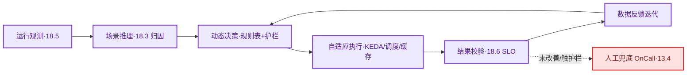

# 第18章 AI推理性能、KV Cache与智能自治运维
<!-- 第六篇 AI原生运维核心体系 ｜ ★理论核心·智能自治（全书第三层理论核心·终版模型） ｜ 状态：终审中 -->

> 本章定位：全书三层自治模型**第三层 · 智能自治**，全书差异化王牌终章。讲清 AI 推理性能与容量模型、KV Cache 治理，并以智能自治闭环（运行观测 → 推理分析 → 动态决策 → 自适应执行 → 结果校验 → 反馈迭代）收束全书。**本章分两个阅读单元：18.1–18.4 推理性能与容量模型；18.5–18.9 AI 负载可观测 / SLO / 智能自治。**

> **技术栈锁死（永久不变）**：AI 推理栈 = vLLM、SGLang。不新增任何其他推理引擎（不写 Triton / DeepSpeed / Ray Serve 等）。
> **去工具化**：本章讲的是"Continuous Batching + KV Cache + 推理性能/容量模型"的原理，vLLM/SGLang 只是参考实例，换 TensorRT-LLM/Triton 等推理引擎，这套模型照样适用（详见 CONVENTIONS 三）。
> **边界声明**：不拓展 Agent 框架 / RAG / MCP 等生态（仅 18.8 对比运维差异）；不写新兴 AI 框架与协议；不写 CUDA 硬件原理。以上归 V2。

---

## 18.1 推理框架锁死：仅聚焦vLLM、SGLang两大主流生产框架，不新增任何其他推理引擎
<!-- AI 推理栈锁死锚点 -->
<!-- 定位说明：本书锁死 vLLM/SGLang 是为"运维标准化举例"，不是判定其他框架不可用。TensorRT-LLM / Triton 等同样在生产广泛使用；本章的推理性能与容量模型（18.3）、KV Cache 治理（18.2）是**框架无关的方法论**，用其他框架的团队同样适用，只是框架专属调优不展开（归 V2）。 -->

### 生产问题

推理框架选择一堆（vLLM/SGLang/Triton/DeepSpeed/Ray Serve 等），指标暴露、参数体系、运维方式各异；多框架并存后容量模型、告警、弹性各搞一套。**推理框架不收敛，推理运维就无法标准化**。

### 传统方案失效原因

- **多框架并存**：不同业务各选框架，指标/参数/弹性三不统一，运维成本翻倍；反复调研的"选择瘫痪"同理（"两大开源引擎已覆盖绝大多数通用推理场景"是业界现状，不再论证）。

失效根因：**没有锁定少数主流推理框架，建立标准化运维**。

### 架构约束与权衡

| 框架 | 定位 | 适用 |
|---|---|---|
| **vLLM** | 主流高吞吐推理框架（PagedAttention/KV 缓存高效） | 通用大模型推理主力 |
| **SGLang** | 高性能推理 + 结构化生成 | 结构化/复杂解码场景 |

权衡的核心：**永久锁死 vLLM + SGLang，不新增其他推理引擎**（其余归 V2），换取指标/弹性/性能模型的标准化。

### 最小可行方案

1. **主力用 vLLM**；结构化/复杂解码场景用 SGLang；Triton/DeepSpeed/Ray Serve 等不进 V1.0。
2. **标准化运维**：两框架统一"OpenAI 兼容 API + Prometheus /metrics"接口，一套治理。

### 生产落地实现

框架收敛后的统一验收命令（SGLang 以 `--enable-metrics` 开启指标，指标集与 vLLM 不同名，以官方文档为准）：
```bash
# 上线验收三查（Deployment 骨架见 17.4；GPU 节点池见 17.1）
curl -s http://vllm-llm7b.prod.svc:8000/v1/models | jq '.data[].id'   # 1) 模型名与版本正确
curl -s http://vllm-llm7b.prod.svc:8000/metrics | grep -cE '^vllm:'   # 2) 官方指标可采（采集见 18.5）
curl -s http://vllm-llm7b.prod.svc:8000/v1/chat/completions -H 'Content-Type: application/json' \
  -d '{"model":"qwen-7b","messages":[{"role":"user","content":"ping"}],"max_tokens":16}' | jq '.usage'   # 3) 真推理 sanity check
```
- 云服务映射与成本量级：GPU 算力 = ACK GPU 节点池（gn7i A10 / gn7e A100；对照 EKS g5/p4d，见 17.1）；镜像 = ACR（对照 ECR）；模型制品 = OSS（对照 S3，见 17.3）。A10 按量约 ¥10–15/卡·时、A100 80G 约 ¥30–45/卡·时（以官网当期价为准；抢占式常见再降 50%–90%，见 4.2）。指标 → VM（12 章）、弹性 → KEDA（16.3）、容量 → 18.3 模型，两框架一套方法。

### 典型故障案例

某团队多框架并存（vLLM + 另两个），运维三套、指标各异、故障定位难；收敛到 vLLM + SGLang 统一 /metrics 接入后，同一套面板/告警/弹性覆盖全部推理服务。

### 根因定位

根因不在框架选错，而在**多框架并存导致运维无法标准化**。

### 长效治理方案

- 永久锁死 vLLM + SGLang（归 V2 不再扩）；两框架统一 API/指标接口，一套可观测/弹性/容量模型治理；新场景先问"两框架能否承载"。

### 自动化/自治闭环

推理框架锁死是 L3 智能自治的**标准化基础**：**L3 的性能模型/动态调度/弹性决策依赖统一的推理指标**。多框架指标各异，L3 无法建立统一决策模型；锁死两框架，L3 才能基于统一指标做智能自治。

### 生产检查清单

- [ ] 推理是否主力用 vLLM + SGLang，未引入其他推理引擎？
- [ ] 两框架指标是否统一接入可观测（验收三查通过）？

---

## 18.2 Continuous Batching、KV Cache核心机制与运维痛点根治方案

### 生产问题

先做一个思想实验（先自己想答案，再往下读）：

> 墨丘里商城的 AI 导购助手 reco-llm 上线，工程师沿用 vLLM 默认 `--max-num-seqs 256`，理由听上去无懈可击："并发上限开得越高，同时接的请求越多，吞吐自然越大。"第二天晚高峰，流量涨到设计容量的两倍。先猜：此刻 reco-llm 是吞吐更高、持平，还是崩了？

认真想十秒，逐步揭晓（对照落地②算例：Qwen2.5-7B @ A10，KV 显存拆账上限 ≈28 路、启动日志实测常 20–24 路）：

1. 请求涌入，256 的默认上限被当成"能扛 256 路"的承诺，排队一路堆高——而 KV 显存实际只够 ≈28 路同时持有上下文；
2. 28 路把 KV 打满（`gpu_cache_usage_perc` 钉在 0.95+），vLLM 开始**抢占重算**：把在途请求换出、腾显存给新请求，被抢占的请求下次轮到时**从头再算**已生成的部分；
3. 算力被"算了又扔"的重算吞噬——**吞吐不升反降，TPOT 从 30ms 劣化到 300ms 量级（十倍）**，用户看到的是逐字卡成幻灯片的回复（本节典型故障案例就是它的真实版本）。

结论反直觉但坚硬：**并发上限不是吞吐旋钮，是显存契约**——超过 KV 容量放行的并发全是负资产，不产出任何吞吐，只产出抢占与重算。推理服务"并发一上来延迟雪崩、长上下文请求拖慢全局、某些请求慢一个数量级"的机制根源皆在此；**不懂 Continuous Batching 和 KV Cache 机制，推理波动就是黑盒，无法根治**。

### 传统方案失效原因

- **不懂 Continuous Batching**：不知动态组批如何影响吞吐/延迟，无法调优。
- **不懂 KV Cache**：不知 KV 打满后"抢占换出→重算"如何造成延迟雪崩；把机制性问题当随机噪声，靠加 GPU 硬扛。

失效根因：**没有掌握两大机制及运维痛点根治方案**（纯运维视角讲机制，不展开算法）。

### 架构约束与权衡

| 机制 | 运维含义 | 痛点 |
|---|---|---|
| **Continuous Batching** | 请求动态进出批，提升吞吐 | 批内长请求拖慢全局（TPOT 抬升） |
| **KV Cache** | 缓存上下文避免重算 | 显存打满 → 抢占换出 → 重算 → 延迟雪崩 |

权衡的核心：**Continuous Batching 提吞吐但批内长尾影响全局；KV Cache 提速但容量有限，打满即抢占**。根治点不在加 GPU，而在"显存拆账 + 并发上限对齐 + 前缀缓存"三件事。

### 最小可行方案

1. **显存拆账**：按"权重 + 激活 + KV"拆显存，算出 KV 可用容量与单卡并发上限（落地①②）。
2. **并发上限对齐**：`--max-num-seqs` ≤ KV 并发上限，从源头杜绝抢占（落地③）。
3. **前缀缓存与波动归因**：共享前缀场景开 `--enable-prefix-caching`；延迟波动先查 KV 水位与抢占计数（落地④），而非当随机。

### 生产落地实现

**① 显存构成算例（7B FP16 @ A10 24G，每项可复算）**：
```text
A10 24G × --gpu-memory-utilization 0.90 = 21.6G   # vLLM 统筹预算（权重+KV+激活）
− 7B 权重 FP16：7 × 10⁹ 参数 × 2 字节 ≈ 14G
− 激活 / CUDA 上下文 / 算子工作区 ≈ 1G（量级，以实测为准）
= KV Cache 可用 ≈ 6.6G
```
`--gpu-memory-utilization`（默认 0.9）= vLLM 按"总显存 × 该比例"统筹预留权重 + KV + 激活。**风险在 OOM 边界**：调高（如 0.95）多出的只是 KV，但节点上任何额外显存占用（GPU Operator 组件、碎片化）都可能把进程打成 OOMKilled；调低则直接砍 KV 与并发。0.90 是社区常用值：GPU 独占节点可微调，**共享节点禁改**。

**② 单请求 KV 占用公式与量级**（决定单卡能装多少并发）：
```text
每 token KV = 2（K 与 V） × 层数 × KV 头数 × 头维 × 2 字节（FP16）
```

| 模型（7B 级） | 注意力结构 | 每 token KV | 4K 上下文单请求 | A10 并发上限（6.6G ÷ 单请求） |
|---|---|---|---|---|
| Llama-2-7B 类 | MHA（32 层 × 32 KV 头 × 128 维） | ≈512 KB | ≈2.0 G | ≈3 路（可运行但并发不可用，须量化/换卡） |
| Qwen2.5-7B 类 | GQA（28 层 × 4 KV 头 × 128 维） | ≈56 KB | ≈0.23 G | ≈28 路（理论拆账上限） |

结论：**单卡并发能力 ≈ KV 可用显存 ÷ 单请求 KV 占用**（18.3 公式一）。同为 7B，GQA 把并发抬了近一个数量级。**"28 路"要看双口径**：理论 28 路是显存拆账上限；vLLM 启动日志的 `GPU KV Cache Size` / `# CUDA blocks` 实测常 20–24 路（激活/碎片吃掉一块）——**容量规划以启动日志为准，理论值只做初筛**。14B FP16 权重 ≈28G 进不了 A10 24G，须量化或换 A100（见 17.1）；量化口径要拆开：INT8/W8 权重 ≈14–15G，AWQ/GPTQ 4-bit 权重 ≈8–9G——省出的显存全进 KV，同卡并发显著更高。硬件支持时可用 `--kv-cache-dtype fp8` 把 KV 容量约翻倍（以官方文档为准）。

数字体感：KV 可用 6.6G ≈ 12 万 token（56KB/tok）——按一条微信 5–10 个字折算约 2 万条聊天记录，这就是单卡能同时"记住"的全部上下文；所谓 28 路并发，就是把这份记忆切成 28 份分给 28 个用户。

**③ vLLM 启动参数基线**（Deployment 骨架见 17.4、模型 OSS 挂载见 17.3）：
```bash
python3 -m vllm.entrypoints.openai.api_server \
  --model /models/qwen2.5-7b-instruct --served-model-name qwen-7b \
  --host 0.0.0.0 --port 8000 \
  --gpu-memory-utilization 0.90 --max-model-len 4096 \
  --max-num-seqs 24 --enable-prefix-caching
# 可调: --max-num-seqs 24——按落地②理论上限 28 路（启动日志实测常 20–24）留余量，默认 256 会放行远超 KV 容量的并发、触发抢占（延迟雪崩头号人为根因）。
# 可调: --max-model-len 4096——按业务真实上下文设，越大单请求 KV 越大、并发越低。
# 生产禁改: GPU 独占（nvidia.com/gpu: 1，见 17.1）；共享节点不得上调 gpu-memory-utilization。
```
**④ KV 水位/命中/抢占观测指标表**（vLLM 官方 /metrics；前缀缓存命中率的指标名随版本有差异（新版本 `vllm:gpu_prefix_cache_hit_rate` 类），以所装版本 /metrics 输出为准；采集接线见 18.5）：

| 指标（官方名） | 含义 | 运维判读 |
|---|---|---|
| `vllm:gpu_cache_usage_perc` | KV 缓存使用率 | >0.85 关注，>0.90 立即处置（扩容/降并发） |
| `vllm:num_requests_running` / `waiting` | 运行中 / 排队请求数 | 逼近 max-num-seqs = 满载；排队持续 >0 = 容量不足（KEDA 依据，见 18.7） |
| `vllm:num_preemptions` | 抢占累计数 | **增量 >0 即异常**——KV 打满换出请求重算 |
| `vllm:time_to_first_token_seconds` / `time_per_output_token_seconds` | TTFT / TPOT 直方图 | 突升分别查排队/prefill 与批内长请求/缓存驱逐（18.3 归因） |
| 前缀缓存命中率 | 共享前缀命中比例 | 多轮对话场景应 ≥50%，低则查提示词模板是否收敛 |

抢占处置先辨模式：vLLM 抢占默认 **recompute**（被抢占请求从头重算），另有 **swap** 模式（`--swap-space`，KV 换出 CPU 内存、恢复不重算）——`num_preemptions` 上涨时先确认抢占模式，再决定"降并发"还是"给 swap 空间"。

TPOT 尖刺的主因常是**批内长 prefill 与 decode 互相干扰**（长输入的预填充独占算力，批内 decode 全体停等）——根治开关是 `--enable-chunked-prefill`（配 `--max-num-batched-tokens` 把 prefill 切片掺进批内），而非一味降并发。

前缀缓存命中率还依赖**同会话路由到同副本**：入口随机负载均衡会把多轮对话的前缀命中率打没（"开了 `--enable-prefix-caching` 命中率仍 <50%"的头号原因）；正解是推理网关按会话 ID 做一致性哈希，代价是负载轻微不均。

云服务映射：A10 = ACK gn7i 节点池、A100 = gn7e（对照 AWS g5.xlarge / p4d），按"权重是否进卡 + 单卡并发需求"选型（见 17.1）；模型权重与量化版本作为制品存 OSS（对照 S3，见 17.3）。

### 典型故障案例

某客服助手并发翻倍后 TPOT 从 30ms 涨到 300ms 量级：`vllm:num_preemptions` 5 分钟涨 400+、`gpu_cache_usage_perc` 钉在 0.95——`max_num_seqs` 用默认 256 而 KV 只够 28 路，调度器不停抢占重算。调 `--max-num-seqs 24` 并开前缀缓存（命中率 ≈60%）后回落 30ms 量级。

点评：**推理延迟雪崩大概率是 KV 打满抢占**，指标表比经验直觉快一个数量级。

### 根因定位

根因不在并发高，而在**并发上限未与 KV 容量对齐，机制黑盒导致无法根治波动**。

### 长效治理方案

- 显存拆账成为新模型上线必做算例，`--max-num-seqs` 由拆账反推（禁用默认值上线）；KV 水位/抢占指标常开（18.5），抢占 >0 一票否决发布；长尾请求隔离（3.3），波动归因到机制、非盲调加卡。

### 自动化/自治闭环

两大机制理解是 L3 智能自治的**决策依据**：**L3 的动态调度/缓存治理决策基于对机制的理解**（抢占与 KV 水位是 18.9 决策规则表的核心输入）。不懂机制，L3 决策无依据；懂机制，L3 能精准根治波动。

### 生产检查清单

- [ ] 是否做过显存拆账并算出单卡并发上限（`--max-num-seqs` 由拆账反推）？
- [ ] KV 水位/抢占指标是否监控（>0.90 / 增量>0 告警）？
- [ ] 长尾请求是否隔离（分桶/独立实例组，3.3）？

---

## 18.3 全书独家AI推理性能与容量模型（终版定型）
<!-- 全书独家推理性能与容量模型锚点 -->
<!-- 完整推理链路：AI Request → 队列排队 → Prefill 预填充 → KV Cache 缓存读写 → Decode 解码 → 响应返回 -->
<!-- 核心指标关联体系：TTFT、TPOT、端到端延迟、Token 吞吐、并发量、KV 缓存命中率、GPU 利用率、队列耗时 -->

### 生产问题

团队运维推理服务，但缺乏统一的性能与容量模型：指标孤立、瓶颈不知在哪、容量规划拍脑袋，常出现"GPU 利用率高但性能劣化""QPS 稳定但延迟飙升"等悖论。**没有性能与容量模型，推理运维就是凭感觉**。

### 传统方案失效原因

- **指标孤立**：TTFT/吞吐/利用率各看各的，不知关联；无链路视角（队列→prefill→KV→decode），瓶颈靠猜。
- **容量拍脑袋**：不知指标如何关联到容量需求。

失效根因：**没有建立推理性能与容量的统一模型**。本节给出全书独家终版模型。

### 架构约束与权衡

模型把"链路阶段"与"指标"一一对应（推理链路 = AI Request → 队列排队 → Prefill → KV Cache 读写 → Decode → 响应返回）：**队列耗时→队列排队、TTFT→Prefill、TPOT/Token 吞吐→Decode、KV 命中率→KV Cache**；端到端延迟 = TTFT + TPOT×Token 数（落地公式二）；并发量与 GPU 利用率横跨全链路。延迟飙升先定位是哪一段，再针对性治理；容量规划把指标串成公式（落地①），可复算、可校验。

### 最小可行方案

1. **链路视角 + 指标关联**：延迟异常先归因到对应阶段指标（TTFT/TPOT/命中率/队列耗时），不孤立看单指标。
2. **公式化容量**：四公式推算 GPU 数（落地①），替代拍脑袋。
3. **实测校准**：参考表只定量级，投产前在生产同构节点池用 vLLM 官方 `benchmarks/benchmark_serving.py` 逐档加压（2/4/8/16 req/s）实测替换。

### 生产落地实现

**① 容量模型四公式（全书独家核心，每步可复算）**：
```text
公式一（单卡并发上限）≈ KV 可用显存 ÷ 单请求 KV 占用         # 显存维度（18.2 落地②）
公式二（单请求时长）≈ TTFT + 输出 tokens × TPOT              # 延迟维度（= 端到端延迟）
公式三（稳态并发，Little 定律）= QPS × 单请求时长             # 业务维度
公式四（GPU 数）= 稳态并发 ÷ 单卡并发上限
交叉校验（吞吐维度）= QPS × 输出 tokens ÷ 单卡 tokens/s       # 与公式四同量级即可信，取大者
```
7B@4K 量级速算（Qwen2.5-7B GQA @ A10，代入 18.2 数字）：单请求 KV ≈0.23G → 单卡理论 ≈28 路（启动日志实测常 20–24，以日志为准，18.2 落地②）；输出 400 tok、TTFT 0.3s、TPOT 30ms → 时长 ≈12.3s → 单卡稳态 ≈ 28 ÷ 12.3 ≈ 2.3 req/s。**完整业务算例见 18.4。**

四公式回答"要多少卡"；**"主 SLO 守哪个指标"取决于产品形态**（决策变量表——同一个模型换种卖法，主指标就换）：

| 产品形态（决策变量） | 用户在等什么（体验主轴） | 主 SLO | 对公式的反压 |
|---|---|---|---|
| 对话式产品（reco-llm 导购/客服助手） | TPOT——逐字流出的节奏感 | TPOT p99 < 100ms（18.6） | 公式一：并发上限按 TPOT 劣化点反推 |
| 批处理（离线批量摘要/打标） | 吞吐——单位时间完成的 token 量 | 吞吐 / 单 Token 成本（17.5） | 交叉校验式：吞吐维度取大者 |
| API 单轮调用（搜索摘要/标题生成） | TTFT——调用方同步干等首字 | TTFT p99 < 1s（18.6） | 公式三：排队堆积即容量不足信号 |

**② 单卡输出吞吐参考表**（output tokens/s，高并发稳态；量级综合公开基准与实测，受版本/量化/输入分布影响大，**只用于规划，投产前必须实测替换**）：

| 模型/精度 | A10 24G | A100 80G | 备注 |
|---|---|---|---|
| 7B FP16 | ≈800–2500 | ≈2000–5000 | A10 上 KV 仅 ≈6.6G |
| 14B FP16 | 权重 28G 装不进 | ≈1000–3500 | A10 需量化：INT8/W8 权重 ≈14–15G、AWQ/GPTQ 4-bit ≈8–9G（省出显存全进 KV，见 18.2） |
| 32B FP16 | — | ≈300–1000 | 权重 64G，KV 仅剩 ≈7G，建议 TP×2 或量化 |

**③ TTFT/TPOT 参考区间**（7B，输入 ≈1000 tok 量级，以实测为准）：

| 指标 | A10 | A100 | 劣化信号 |
|---|---|---|---|
| TTFT | 数百 ms（≈200–800） | ≈100–400 ms | 排队/prefill 堆积时成倍上升 |
| TPOT | 20–50 ms | 15–35 ms | 批内长请求或 KV 抢占时抬升 |

数字体感（校准直觉）：TTFT 200ms = 用户感觉"立刻开始回答"，1s = 开始怀疑卡死、手指移向刷新；TPOT 30ms = 逐字流畅的打字机节奏（比常人打字略快），300ms = 肉眼可见的一卡一顿——18.2 思想实验里"卡成幻灯片"的就是这个量级。

云服务映射：基准环境与生产同构——ACK gn7i/gn7e 节点池（对照 EKS g5/p4d，见 17.1）；基准流量可用抢占式节点跑，省 50%+ 成本（见 14.3）。

### 典型故障案例

某推理"GPU 利用率高但延迟飙升"，用模型归因：利用率高且 TPOT 也高 → decode 瓶颈（批内长请求 + KV 抢占），`vllm:num_preemptions` 持续增长坐实缓存打满；降并发 + 开前缀缓存后延迟回落。点评：**模型把"GPU 高但性能差"这种悖论解释清楚**——利用率高 ≠ 性能好，要分阶段看指标。

### 根因定位

根因不在指标多，而在**无统一模型把链路/指标/瓶颈/容量关联**。模型缺失，运维只能凭感觉。

### 长效治理方案

- 统一模型（链路 + 指标关联 + 四公式）归因延迟异常；容量规划公式推算 + 双维校验；参考表每季度用实测刷新（18.5 展示）。

### 自动化/自治闭环

本模型是 L3 智能自治的**决策模型核心**：**L3 的动态决策（调度/缓存/弹性）基于这个性能与容量模型——观测各阶段指标 → 推理瓶颈 → 决策处置 → 校验指标改善**（18.9 决策规则表每行的"场景推理"列即来自本模型）。这是全书独家差异化的核心。

### 生产检查清单

- [ ] 是否用统一模型（链路 + 指标关联 + 四公式）归因延迟异常？
- [ ] 容量规划是否公式化推算 + 双维校验（18.4）？
- [ ] 吞吐/延迟参考数字是否来自自己节点池实测？

---

## 18.4 核心落地解答：AI推理场景下的容量规划方法论，解决「GPU高利用率但性能劣化、QPS稳定延迟飙升、缓存失效成本暴涨」等生产核心难题

### 生产问题

推理容量规划的核心难题：GPU 利用率高但性能反而劣化、QPS 稳定但延迟飙升、缓存失效导致成本暴涨。**这些推理特有的容量悖论，传统容量方法（CPU/内存）解释不了也解不了**。

### 传统方案失效原因

- **用 CPU 容量方法**：按 CPU/内存规划推理容量，完全失准（瓶颈在 GPU/KV 显存）。
- **只看单指标**：只看 QPS 或利用率，不见延迟/缓存关联，把悖论当异常（实为模型认知缺失，18.3）。

失效根因：**没有基于 18.3 性能与容量模型的推理容量规划方法论**。

### 架构约束与权衡

| 难题 | 模型归因 | 容量对策 |
|---|---|---|
| **GPU 高利用率但性能劣化** | 利用率高 ≠ 性能好，看 TPOT/抢占 | 降批/开前缀缓存/加 GPU |
| **QPS 稳定延迟飙升** | QPS 稳定但尾延迟升，看排队/命中率 | 扩并发容量/治缓存 |
| **缓存失效成本暴涨** | KV 命中率低 → 重算多 → 成本高 | 扩 KV 容量/开前缀缓存 |

权衡的核心：**容量规划基于"指标关联"而非"单指标"**——用四公式把业务 QPS 翻译成 GPU 数，双维校验，再按 SLO 反压（延迟超标 = 容量不足信号，见 18.6）。

### 最小可行方案

1. **基于模型**：用 18.3 四公式，按"业务输入 → KV → 并发 → GPU 数"推算；悖论先归因（TPOT/抢占、排队/命中率）再选对策。
2. **双维校验 + 迭代**：显存/吞吐两维各算一遍取大者；调整后用 18.3 指标 + 18.6 SLO 校验。

### 生产落地实现

**完整容量算例（每步可复算，数字全部来自 18.2/18.3）**：
```text
业务输入：峰值 QPS 20；平均输入 1000 tok；平均输出 400 tok；上下文上限 4K
部署假设：Qwen2.5-7B FP16（GQA，KV 56KB/tok）@ A10 24G，utilization 0.90 → KV 可用 6.6G；TTFT 0.3s、TPOT 30ms、单卡 24–28 路

第 1 步 单请求 KV 占用（按 4K 上限保守）= 4096 × 56KB ≈ 0.23G
第 2 步 单卡并发上限 = 6.6G ÷ 0.23G ≈ 28 路 → max-num-seqs 取 24（留余量，见 18.2）
第 3 步 单请求时长 = 0.3s + 400 × 30ms = 12.3s
第 4 步 稳态并发 = QPS 20 × 12.3s = 246 路（Little 定律）
第 5 步 GPU 数（显存维度）= 246 ÷ 24 ≈ 10.3 → 11 张
交叉校验（吞吐维度）= 20 × 400 ÷ 单卡 800–900 tok/s ≈ 9–10 张 → 两法同量级，取 11
冗余 = ×1.3（滚动更新/单 AZ 容忍，见 7 章 PDB 与 4.2 多可用区）→ 15 张
落地 = ACK gn7i 节点池（按每节点卡数取整，如 4 卡/节点 × 4 节点）
```
- 成本量级：15 × A10 × ¥10–15/卡·时 × 730h ≈ **¥11–16 万/月**（按量计费，以官网当期价为准）——体感：约等于 1–2 名资深工程师的月薪，量化/缓存/闲时缩容每省 30% 就等于"省出一个人"。优化路径：量化（权重减半 → 同卡更多 KV）、前缀缓存（少算 50%+ prefill）、闲时缩容（KEDA，18.7）——单 Token 成本视角见 17.5。
- 云服务映射：容量落地 ACK GPU 节点池（gn7i / gn7e；对照 EKS 托管节点组 g5/p4d），节点池弹性承接副本扩容（与 16.3 分层）；**在线推理主池不建议抢占式**（驱逐即 TTFT 尖刺），抢占式只给基准/离线批量推理（14.3）。敏感变量：输出 400 改 800 → 时长与 GPU 数近似翻倍——**长输出业务先谈"输出截断/流式分页"再谈买卡**。

### 典型故障案例

某推理"QPS 稳定但 p99 延迟飙升"，归因：排队（`vllm:num_requests_waiting` 持续 >0）+ KV 命中率下降；用算例复核并发已达稳态容量 1.4 倍，扩容 30% 后恢复。点评：**容量悖论用模型都能解释**——关键是看指标关联，而非单指标。

### 根因定位

根因不在容量不够，而在**无推理容量规划方法论，用错方法（CPU 思维）**。

### 长效治理方案

- 容量规划基于四公式（双维校验、×1.3 冗余、按 SLO 反推），禁拍脑袋；业务输入（QPS/输入输出长度）变更即重算——输出长度是最敏感变量。

### 自动化/自治闭环

容量规划方法论是 L3 智能自治的**容量决策框架**：**L3 的弹性/调度决策，基于这套方法论判断"何时扩容、扩什么（GPU/缓存）、扩多少"**（18.9 决策规则表的扩容行即本节公式）。没有方法论，L3 容量决策盲目（1.5 节跳级案例的成本爆炸）；有方法论，L3 决策精准且经济。

### 生产检查清单

- [ ] 容量规划是否基于四公式（显存/吞吐双维校验、×1.3 冗余、成本量级已算）？
- [ ] 能否解释三大容量悖论？
- [ ] 容量调整后是否用模型 + SLO 校验？

---

## 18.5 AI负载专属可观测体系：GPU指标、推理性能指标、异常监测与瓶颈定位

### 生产问题

团队的可观测（12 章）覆盖了通用指标，但 AI 负载专属指标（GPU 利用率/显存、TTFT/TPOT、KV 水位/抢占）缺失，推理出问题时无法定位是 GPU 问题还是推理性能问题。**通用可观测覆盖不到 AI 专属信号，AI 负载的瓶颈不可见**。

### 传统方案失效原因

- **无 GPU 指标**：GPU 利用率/显存未采集（部署见 17.2）。
- **无推理性能指标**：TTFT/TPOT/吞吐/排队未采集，瓶颈靠猜——12 章通用栈不覆盖 AI 专属语义。

失效根因：**没有在 12 章统一可观测栈之上，叠加 AI 负载专属可观测层**。

### 架构约束与权衡

| 指标类 | 内容 | 来源 |
|---|---|---|
| **GPU 指标** | 利用率/显存/XID | DCGM exporter（17.2） |
| **推理性能指标** | TTFT/TPOT/吞吐/并发 | vLLM/SGLang /metrics |
| **缓存指标** | KV 水位/抢占/前缀命中 | vLLM/SGLang /metrics |
| **异常监测** | 性能劣化/瓶颈 | 18.3 模型归因 |

权衡的核心：**AI 专属可观测建立在 12 章统一栈之上（复用 VM/Grafana），叠加 AI 语义指标**，不另起炉灶（与第 3 章"底座统一、治理分层"一致）。

### 最小可行方案

1. **GPU 指标**：DCGM exporter 采 GPU 利用率/显存进 VM（部署见 17.2）。
2. **推理性能 + 缓存指标**：vLLM/SGLang /metrics（TTFT/TPOT/排队/运行数/KV 水位/抢占/前缀命中）进 VM。
3. **瓶颈定位**：按 18.3 模型，用映射表（落地②）归因瓶颈。

### 生产落地实现

**① vLLM 指标接入 vmagent**（Prometheus 兼容抓取配置，追加到 12 章 `-promscrape.config`；VM Operator 部署时等价用 VMPodScrape CRD；GPU 指标 `DCGM_FI_DEV_GPU_UTIL`/`FB_USED`/`XID_ERRORS` 由 dcgm-exporter 暴露，采集见 17.2）：
```yaml
- job_name: vllm
  metrics_path: /metrics
  kubernetes_sd_configs:
    - role: pod
      namespaces: {names: [prod]}
  relabel_configs:
    - source_labels: [__meta_kubernetes_pod_annotation_vllm_scrape]
      action: keep
      regex: "true"
    - source_labels: [__meta_kubernetes_pod_container_port_number]
      action: keep
      regex: "8000"
    - source_labels: [__meta_kubernetes_pod_name]
      target_label: pod
    - source_labels: [__meta_kubernetes_namespace]
      target_label: namespace   # 必须映射：18.7 KEDA 查询 {namespace="prod"} 依赖此标签，缺失即查询静默返回空、扩容失效
# 推理 Deployment 的 Pod 模板加注解 vllm_scrape: "true"（与 keep 规则对应；骨架见 17.4）
```
**② 指标 → 面板/告警映射表**（Grafana 面板按 18.3 链路组织：队列段/prefill 段/Decode 段/KV 段/GPU 段；采集间隔 15s 可调，直方图基数 ≈ 每副本几百序列，千卡级再评估 VM 容量）：

| 指标（官方名） | PromQL 要点 | 面板位置 | 告警去向 |
|---|---|---|---|
| `vllm:time_to_first_token_seconds` | `histogram_quantile(0.99, sum by (le)(rate(…_bucket[5m])))` | Prefill 段 | TTFT 预算燃烧告警（18.6） |
| `vllm:time_per_output_token_seconds` | 同上取 p99 | Decode 段 | TPOT p99 告警（18.6） |
| `vllm:num_requests_waiting` | `sum by (pod)(…)` | 队列段 | 持续 >0 告警；KEDA 扩容信号（18.7） |
| `vllm:gpu_cache_usage_perc` | 原值 | KV 段 | >0.90 持续 5m（P1，18.2 判读） |
| `vllm:num_preemptions` | `increase(…[5m])` | KV 段 | 增量 >0 即 P1（雪崩前兆） |
| `DCGM_FI_DEV_GPU_UTIL` / `DCGM_FI_DEV_FB_USED` | 原值/按节点求和 | GPU 段 | 显存 >95%、XID >0（17.2） |

云服务映射：可观测栈复用 12 章自建锁死栈（VM + Grafana）；托管对照为阿里云 ARMS/云监控 与 AWS CloudWatch/AMP——为保持全书栈一致与跨负载关联（trace 贯通），生产走自建，托管仅作小规模过渡（CONVENTIONS 三）。

### 典型故障案例

某推理延迟波动，原无专属指标靠猜。接入 ①② 后一眼定位：`vllm:num_preemptions` 与 TTFT 同步尖刺、GPU 利用率并不满——KV 打满抢占（缓存问题），非算力不足，省了一次盲目加卡。点评：**AI 负载可观测是 L3 自治的眼睛**。

### 根因定位

问题的真正发源地是**未在统一栈上叠加 AI 专属可观测层**——通用指标再全，也回答不了"KV 打没打满、抢占有没有发生"。

### 长效治理方案

- GPU（DCGM，17.2）+ 推理性能 + 缓存指标全接入 VM，面板按 18.3 链路组织；三条基线告警常开（抢占>0 / KV>0.90 / 排队持续>0），瓶颈用模型归因。

### 自动化/自治闭环

AI 专属可观测是 L3 智能自治的**输入信号源**：**L3 决策依赖这些专属指标——TTFT/TPOT/排队/KV 水位/抢占是 L3 推理决策的输入**（18.9 决策规则表第一列全部来自本节指标）。无专属可观测，L3 就是瞎子。

### 生产检查清单

- [ ] GPU 与 vLLM 指标是否全接入 VM（抓取 job + 注解生效）？
- [ ] 三条基线告警是否常开（抢占/KV 水位/排队）？
- [ ] 是否有 AI 专属面板（按 18.3 链路 + SLO 线）且劣化可归因？

---

## 18.6 AI负载SLO体系：推理可用性、延迟稳定性、服务容错生产规范
<!-- 通用 SLO/错误预算体系见第 13 章，本节只讲 AI 负载专属 SLO（分阶段百分位 + 推理容错） -->

### 生产问题

团队给推理服务定的 SLO 套用普通服务（成功率/平均延迟），但推理特性（TTFT/TPOT 分阶段、尾延迟敏感、缓存影响）没体现。结果 SLO 设了等于没设——劣化体现不到 SLO，或 SLO 误报。**AI 负载 SLO 用普通服务标准，失准且无用**。

### 传统方案失效原因

- **套用普通 SLO**：用成功率/平均延迟；平均延迟掩盖 p99 劣化（3.3 节），不区分 TTFT（prefill）/TPOT（decode）定位不准。
- **无容错规范**：推理特有的降级/限流/重试无规范。

失效根因：**没有基于推理特性建立专属 SLO 体系**。

### 架构约束与权衡

| 维度 | SLO | 要点 |
|---|---|---|
| **推理可用性** | 成功率/可用率 | 服务级，网关口径（13.2） |
| **延迟稳定性** | TTFT p99 + TPOT p99 | 分阶段 + 百分位 |
| **服务容错** | 降级/限流/重试规范 | 推理特有 |

**保证等级表——这套 SLO 与容量体系承诺什么、不承诺什么**：

| 机制 | 承诺 | 不承诺 |
|---|---|---|
| **TTFT/TPOT p99 百分位 SLO** | 刻画长尾用户体验——TTFT p99 = 最慢 1% 用户的首字等待 | "均值正常 = 体验正常"——对话式产品体感由 TPOT 主导（逐字流出的节奏感），批处理由吞吐主导，均值把两者都掩盖（3.3） |
| **容量模型（18.3 四公式）** | 稳态估算——给定 QPS/上下文/输出长度可复算 GPU 数（18.4） | 突发尖峰——排队论边界之外的到达率波动不可算，靠 ×1.3 冗余系数兜底（18.4） |

权衡的核心：**推理 SLO 分阶段（TTFT/TPOT）+ 百分位（p99）+ 容错规范**，而非平均/成功率一刀切；目标值来自 18.3 实测基线上浮留发展空间。

### 最小可行方案

1. **可用性**：网关事件式口径（13.2），推理成功率 SLO；纳入 13.2 错误预算四档策略。
2. **延迟分阶段**：TTFT p99 < 1s + TPOT p99 < 100ms（非平均）。
3. **容错**：超时降级（返兜底）/限流（防过载抢占）/重试退避+上限（防风暴，18.8）。

### 生产落地实现

**① 推理 SLO 示例表**（30 天滚动窗口；SLI 事件式口径见 13.2；预算速算 43200 × (1−SLO)，延迟目标按 18.3 实测 p99 上浮一档定）：

| SLI | SLO 目标 | 口径（指标源） | 错误预算 |
|---|---|---|---|
| 可用性 | ≥99.9%（核心）/ ≥99.5%（内部） | 网关 5xx 事件占比（13.2；推理侧可用 `vllm:request_success_total` 对照） | **43.2 / 216 分钟/30 天** |
| TTFT | p99 < 1s（99% 请求 TTFT < 1s） | `vllm:time_to_first_token_seconds` | 坏请求额度 1% |
| TPOT | p99 < 100ms（流式体验下限） | `vllm:time_per_output_token_seconds` | 坏请求额度 1% |

**流式体感的链路硬前提**：TPOT 量的是引擎侧逐字产出，用户体感依赖逐字流到端上——中间代理会破坏它：NGINX 必须 `proxy_buffering off`（默认攒满缓冲再一次性吐出），ALB/网关要确认 SSE 支持且 `proxy_read_timeout` 大于最长生成时长（否则流被中途掐断）。"TPOT 指标正常但用户觉得卡死"的第一排查点就是网关缓冲，不是引擎。

**② TTFT SLI burn-rate 双窗口告警**（复用 13.2 公式与写法：快烧 14.4×→P0（1h/5m 窗）、慢烧 6×→P2（6h/30m 窗——6× 在 6h 窗才等于 5% 月预算，Google 配方），指标换成推理 SLI；两窗同超阈才告警，误报数量级下降，通道复用 13.1 路由）：
```yaml
groups:
- name: slo-inference-burnrate
  rules:
  - alert: InferenceTTFTBudgetBurnFast      # 快烧 14.4×：1h 烧掉 2% 月预算 → 电话
    expr: |
      (1 - sum(rate(vllm:time_to_first_token_seconds_bucket{le="1.0"}[1h]))
           / sum(rate(vllm:time_to_first_token_seconds_count[1h]))) > (14.4 * 0.01)
      and on()
      (1 - sum(rate(vllm:time_to_first_token_seconds_bucket{le="1.0"}[5m]))
           / sum(rate(vllm:time_to_first_token_seconds_count[5m]))) > (14.4 * 0.01)
    for: 2m
    labels: {severity: P0}
    annotations:
      action: "按 13.3 SOP 止损：查排队/KV 水位/抢占（18.5 面板）→ 扩容或降并发"
  - alert: InferenceTTFTBudgetBurnSlow      # 慢烧 6×：6h/30m 双窗（13.2 Google 配方）——慢性容量不足 → 工单
    expr: |
      (1 - sum(rate(vllm:time_to_first_token_seconds_bucket{le="1.0"}[6h]))
           / sum(rate(vllm:time_to_first_token_seconds_count[6h]))) > (6 * 0.01)
      and on()
      (1 - sum(rate(vllm:time_to_first_token_seconds_bucket{le="1.0"}[30m]))
           / sum(rate(vllm:time_to_first_token_seconds_count[30m]))) > (6 * 0.01)
    for: 15m
    labels: {severity: P2}
    annotations:
      action: "按 18.4 容量算例复核容量；开工单排期"
    # 可调: le="1.0" 桶边界须与所装版本 /metrics 实际直方图桶一致（curl 核对，以官方文档为准）；TPOT 规则同式，换 vllm:time_per_output_token_seconds_* 与 le="0.1"
```
**③ 容错规范与云映射**：超时降级（TTFT 超时返兜底话术/缓存答案）；入口限流（网关按 18.4 容量设并发上限，防过载引发 KV 抢占雪崩）；重试退避+上限（见 18.8）。告警通道与预算看板复用 13 章体系（云语音/钉钉见 13.1、Grafana 预算曲线见 13.2）——云托管监控（ARMS/CloudWatch）无推理专属 SLI 语义，这正是自建栈的价值。

### 典型故障案例

某推理用平均延迟 SLO，p99 劣化被平均掩盖，用户感知差但 SLO "达标"。改分阶段百分位 + burn-rate 后，一次 KV 抢占劣化持续个把小时（30m 短腿先红、6h 长腿随后坐实），慢烧告警（6×）触发，按 18.4 复核发现容量按平均负载而非峰值配，补足后恢复。点评：**推理 SLO 必须分阶段 + 百分位**，平均/成功率掩盖真实体验。

### 根因定位

根因不在 SLO 阈值，而在**SLO 未基于推理特性（分阶段/百分位/容错）**。

### 长效治理方案

- 推理 SLO = 可用性 + TTFT/TPOT p99（目标值实测上浮一档），burn-rate 双窗口常开、容错三件套配套，纳入 13.2 四档管控。

### 自动化/自治闭环

AI SLO 是 L3 智能自治的**目标标尺**：**L3 自治的目标是"守住推理 SLO"，SLO 消耗是 L3 决策触发与校验依据**（18.9 规则表的"结果校验"列即 SLO 阈值）。没有推理专属 SLO，L3 无目标；有了，L3 能基于 SLO 精准决策何时调度/弹性/降级。

### 生产检查清单

- [ ] 推理 SLO 是否分阶段（TTFT/TPOT p99）且预算分钟数已算（99.9% → 43.2 / 99.5% → 216）？
- [ ] burn-rate 双窗口告警（14.4× P0 / 6× P2）已上线？
- [ ] 容错三件套（降级/限流/重试退避）与 SLO 配套？

---

## 18.7 AI负载智能弹性、故障自愈、推理服务自治落地实战

### 生产问题

团队对 AI 负载的弹性/自愈仍用人工：负载涨手动扩 GPU、推理故障手动重启、性能劣化手动调。AI 负载的复杂动态（缓存/并发/性能）超出人实时判断。**AI 负载的弹性/自愈/自治不自动化，靠人撑不住复杂动态**。

### 传统方案失效原因

- **人工弹性**：负载涨靠人扩 GPU（扩容是分钟级动作，人是十分钟级响应）。
- **人工自愈/调优**：推理故障靠人重启（模型加载代价高，17.4），复杂动态人判断不了。

失效根因：**AI 负载的弹性/自愈/自治未自动化闭环**。

### 架构约束与权衡

| 维度 | 自动化 | 依据 |
|---|---|---|
| **智能弹性** | KEDA 接推理排队信号驱动扩缩 | 推理信号（16.3，HPA 只懂 CPU） |
| **故障自愈** | 探针自愈 + 自动重启/重调度 | 5 章 + 推理特性（17.4） |
| **推理服务自治** | 性能反馈驱动的动态调度/缓存治理 | 18.3 模型（18.9） |

权衡的核心：**AI 负载自治从 L2（KEDA 弹性/探针自愈）进化到 L3（性能反馈驱动的动态决策）**。推理弹性特有约束：扩容时延 = 节点拉起 + 模型加载（分钟级），所以**缩容要慢（防反复加载）、天花板要硬（预算护栏）**。

### 最小可行方案

1. **智能弹性**：KEDA 接 `vllm:num_requests_waiting`（排队信号）驱动扩缩（16.3 分层）。
2. **故障自愈**：探针（17.4）+ 自动重启 + 重调度，PDB 保容量底线。
3. **推理自治**：性能反馈（18.5 指标）驱动动态调度/缓存治理（18.9 闭环）。

### 生产落地实现

**① KEDA ScaledObject 完整制品**（排队信号驱动副本扩缩）：
```yaml
apiVersion: keda.sh/v1alpha1
kind: ScaledObject
metadata:
  name: vllm-llm7b
  namespace: prod
spec:
  scaleTargetRef:
    name: vllm-llm7b
  pollingInterval: 15            # 可调: 指标轮询间隔，与采集间隔（18.5）对齐
  cooldownPeriod: 600            # 可调: 缩容冷却 ≥ 模型加载时长（1–3min，见 17.4），防反复加载
  minReplicaCount: 2             # 可调: 常态基线（按 18.4 算例）
  maxReplicaCount: 8             # 生产禁改: 自动扩容天花板=预算护栏，触顶转人工（18.9）
  triggers:
  - type: prometheus             # serverAddress 指向 VictoriaMetrics 查询接口（Prometheus 兼容 API）
    metadata:
      serverAddress: http://vmsingle-vm.monitoring.svc:8428
      query: sum(vllm:num_requests_waiting{namespace="prod"})
      threshold: "16"            # 可调: 每副本排队阈值（约 max-num-seqs 24 的 2/3）
      activationThreshold: "4"   # 可调: 排队低于此值回到 minReplicas
  advanced:
    horizontalPodAutoscalerConfig:
      behavior:
        scaleDown:
          stabilizationWindowSeconds: 600   # 生产禁改方向: 缩容稳定窗必须 ≥ cooldownPeriod
```
**② 分层关系（与 16.3 一致，不越层）**：KEDA 只管 Pod 副本层；副本涨 → GPU 节点不足 → ACK 节点池弹性/自动伸缩扩节点（对照 EKS 托管节点组/Karpenter）。扩容总时延量级 = 节点池拉节点 3–5 min + 镜像/模型加载 1–3 min（17.4）——**maxReplica 天花板与 18.4 的 ×1.3 冗余必须覆盖这段弹性时延**。还要留**预热窗口**：readiness 通过 ≠ 热——新副本首请求 TTFT 显著偏高（CUDA graph/编译未热），滚动接流前先放小流量预热，否则会陷入"扩容完成→TTFT 告警→再扩容"的抖动回路。

**③ 故障自愈链（探针 → 重启 → 告警）**：liveness 失败 → kubelet 重启 Pod（L1 自愈，模型本地缓存免重下载，17.4）→ 15min 重启 >3 次 → PodHighRestart 告警（13.1 规则）→ 值班按 13.3 SOP 介入；节点故障 → ACK 节点池自动修复 cordon/drain/替换（见 4.2）→ Pod 重调度。缩容/滚动期配 PDB 保底（`minAvailable` 与 minReplicaCount 联动，7 章）。

### 典型故障案例

某推理晚高峰负载涨，人工扩容 20 分钟，期间 TTFT p99 破 3s、预算快烧。改 KEDA（排队信号驱动，threshold 16）后：排队堆积 1–2 分钟内扩副本、节点池随后补节点，TTFT 稳定在 SLO 内；闲时自动缩回基线，闲时成本降约 40%（17.5 单 Token 成本口径）。点评：**AI 负载弹性必须用推理信号（KEDA）**；缩容慢与天花板硬是推理弹性两条铁律。

### 根因定位

根因不在响应慢，而在**AI 负载弹性/自愈/自治未自动化**——人工节奏与分钟级弹性动作天然不匹配。

### 长效治理方案

- 智能弹性 = KEDA 排队信号驱动 + min/max 护栏 + 慢缩容（与 16.3 分层）；自愈 = 探针（17.4）+ 自动重启/重调度 + PDB 底线；扩容时延纳入容量冗余设计。

### 自动化/自治闭环

本节是 L3 智能自治的**落地实战**：**智能弹性（KEDA）+ 故障自愈 + 推理自治，构成 AI 负载从 L2 弹性/自愈向 L3 动态自治的进化路径**。KEDA 的扩缩通道与 maxReplica 护栏正是 18.9 决策规则表的"执行动作"列——L3 不新造执行器，复用 L2 自动化通道并加校验。

### 生产检查清单

- [ ] AI 负载弹性是否用 KEDA 推理信号驱动（min/max 护栏 + 慢缩容）？
- [ ] 故障自愈链（探针→重启→告警→节点池修复）与 PDB 底线是否验证过？
- [ ] 扩容总时延是否纳入容量冗余（18.4）？

---

## 18.8 Agent边界锁死：仅对比Agent与普通推理的运维差异（长生命周期、状态依赖、多工具调用、重试风暴），搭配单故障案例佐证，不拓展Agent框架、RAG、MCP等生态内容
<!-- 本节是"AI 负载边界场景对比"，不是第 18 章的核心；本章理论核心在 18.9 智能自治闭环。Agent 完整生态（框架/RAG/MCP）归 V2。 -->

### 生产问题

团队上线智能 Agent 服务后，遇到普通推理没有的问题：调用链长、状态依赖重、多工具调用放大故障、重试风暴把下游打挂。用普通推理方式运维 Agent，处处失配。**Agent 负载的运维特性与普通推理差异大，用错方式必失配**。

### 传统方案失效原因

- **Agent 当普通推理**：忽视长生命周期/状态依赖/多工具/重试特性；Agent 有会话状态，Pod 随意重建丢状态。
- **重试无治理 + 边界外扩**：多步调用失败重试放大成风暴；想展开 Agent 框架/RAG/MCP 生态，偏离运维视角。

失效根因：**没有识别 Agent 与普通推理的运维差异并针对性治理**。边界锁死：仅对比运维差异 + 单故障案例，不拓展生态（归 V2）。另注意视角区分（3.1 双重视角）：本节的 Agent 是**负载视角**——Agent 作为被运维对象；Agent 作为**运维主体**（用 Agent 治理运维）的承载形态与治理见 16.4/18.9。同名不同角色，勿混。

### 架构约束与权衡

| 维度 | 普通推理 | Agent | 运维差异 |
|---|---|---|---|
| **生命周期** | 请求级（秒级） | 会话/任务级（分钟–小时） | 长生命周期需保活/续跑 |
| **状态依赖** | 无状态 | 有会话/任务状态 | 状态外置，不随 Pod 丢 |
| **多工具调用** | 单次推理 | 多步多工具 | 调用链长，故障放大 |
| **重试** | 请求级 | 多步重试 | 重试风暴治理（退避+上限） |

权衡的核心：**Agent 运维聚焦"长生命周期/状态外置/重试治理"**，而非展开 Agent 框架/RAG/MCP 生态（归 V2）。

### 最小可行方案

1. **长生命周期**：会话/任务级保活 + 优雅终止 + 检查点续跑（3.2 节）。
2. **状态外置**：会话/任务状态外置存储，Pod 无状态化。
3. **重试治理**：多步调用重试退避 + 上限 + 熔断，防重试风暴。

### 生产落地实现

**① 重试治理基线**（Agent 多步调用标配；入口限流见 18.6 容错规范）：
```yaml
# Agent 工具调用重试配置（框架无关示例值）
tool_call_retry:
  max_attempts: 3              # 生产禁改: 硬上限——无上限重试=风暴放大器
  backoff: exponential         # 指数退避，1s/2s/4s
  backoff_base_ms: 1000        # 可调: 按下游工具恢复速度调
  per_call_timeout_ms: 5000    # 可调: 单次工具调用超时
circuit_breaker:
  error_rate_threshold: "0.5"  # 可调: 错误率过半即熔断该工具
```

数字：无治理重试的放大倍数——3 步链路 × 每步瞬时重试 3 次，最坏瞬时流量放大 3³ = 27 倍，足以把本健康的下游打挂（级联故障）。

**② 状态外置与监控**：会话/任务状态存云数据库 Tair/Redis（对照 AWS ElastiCache；选型见第 8 章），Pod 无状态化，重建不丢会话、KEDA 才能自由缩容（18.7）；检查点/续跑与优雅终止见 17.4。调用链（OTel，12 章）+ 重试/熔断计数进 VM，重试率突增 = 下游故障前兆，按 13.1 风格告警。

### 典型故障案例

某 Agent 某工具偶发失败（错误率 5%），触发热重试（无退避无上限），3 步链路放大后下游工具服务被打挂，级联故障 30 分钟。加上表配置（上限 3 + 指数退避 + 熔断 0.5）后，同样 5% 错误率下峰值流量仅放大 ≈1.2 倍，风暴消除。点评：**多步调用 × 无治理重试 = 重试风暴**（也是附录 B.5 案例）。

### 根因定位

根因不在某次工具失败，而在**Agent 重试无治理 + 用普通推理方式运维**。

### 长效治理方案

- 长生命周期保活 + 状态外置（云 Redis/Tair，对照 ElastiCache）+ 重试退避/上限/熔断 + 调用链与重试监控；边界锁死，不展开 RAG/MCP（归 V2）。

### 自动化/自治闭环

Agent 运维差异是 L3 智能自治的**特殊场景**：**Agent 的长生命周期/状态/重试特性，需要 L3 自治针对处理（重试风暴自愈、状态感知调度）**。本节锁死边界——只对比运维差异 + 单案例，把 Agent 完整生态（框架/RAG/MCP）留 V2，保持 V1.0 边界纯净。

### 生产检查清单

- [ ] Agent 是否识别四项运维差异，会话状态外置（Pod 重建不丢）？
- [ ] 重试是否退避 + 上限 + 熔断（防风暴）且有调用链/重试监控？
- [ ] 是否守住边界（不展开 RAG/MCP）？

---

## 18.9 AI智能自治闭环终版模型：运行观测 → 场景推理分析 → 动态决策 → 自适应执行 → 结果校验 → 数据反馈迭代
<!-- 【智能自治】全书三层自治第三层·终版闭环，收束全书 -->

### 生产问题

AI 负载的复杂动态（缓存/并发/性能/算力波动），超出 L1（机械自愈）和 L2（SLO 处置）的能力。L2 能按 SLO 扩缩/回退，但不能基于推理场景动态优化（如 KV 水位上涨时联动调缓存、并发与调度）。**AI 负载需要比 L2 更智能的自治——基于推理场景分析做动态决策与自适应优化**，这就是 L3 智能自治。

### 传统方案失效原因

- **L2 不够**：L2 按 SLO 处置，但 AI 动态需场景推理（缓存/并发/性能关联）；复杂优化靠人，跟不上动态。
- **无反馈迭代 + 跳级风险**：决策不基于结果反馈迭代；L2 没建好上 L3，决策无校验、无护栏（1.5 节案例）。

失效根因：**没有建立 L3 智能自治闭环（观测→推理→决策→执行→校验→反馈）**。

### 架构约束与权衡

| 环节 | 作用 | 实现 |
|---|---|---|
| **运行观测** | 采集 AI 运行信号 | 18.5 专属可观测 |
| **场景推理分析** | 基于 18.3 模型推理瓶颈/场景 | 性能模型归因 |
| **动态决策** | 决策调度/缓存/弹性联动 | 决策规则表 + 护栏 |
| **自适应执行** | 执行决策（调度/缓存/扩缩） | KEDA/调度器/缓存治理（18.7） |
| **结果校验** | 校验性能/SLO 改善 | 18.6 SLO + 18.3 模型 |
| **数据反馈迭代** | 反馈优化决策模型 | 持续学习闭环 |

权衡的核心：**L3 是 L2（16.4 闭环）在 AI 复杂场景的进化版——多了"场景推理分析"和"数据反馈迭代"两环**。但 L3 必须建立在 L1/L2 可信基础之上（1.5 节递进原则），**每个自动动作有上限、每条规则有人工阻断开关——自治越智能，护栏越要硬**。

**运维 Agent 视角（L3 闭环的承载形态）**：三层自治定义里 L3 即"基于 AI Agent 的认知智能"——本节六环闭环的承载形态就是运维 Agent，其能力诉求与书内制品一一对应，**不引入任何书外新组件**：

| 运维 Agent 能力诉求 | 书内对应制品 | 位置 |
|---|---|---|
| 决策逻辑（规则库/推理依据） | 处置动作映射表 + L3 决策规则表（进 Git、PR 评审） | 16.4① / 18.9① |
| 权限边界 | 自动处置白名单 + 护栏 ConfigMap（上限/开关/人工阻断） | 16.4② / 18.9② |
| 动作可审计 | 处置契约三字段（action/verify/escalation） | 16.4③ |
| 上线前验证（自我进化的回归） | 影子模式 1–2 周 → 逐条灰度 | 18.9③ |
| 治理 KPI | 闭环三数字（自动处置占比/误处置率/人工升级率） | 16.4④ |
| 执行手脚 | 复用 L2 通道（KEDA/Rollouts/节点池），Agent 不新造执行器 | 18.7 |

一句话原则：**Agent 的权限与其结果的被校验能力对等，而非与其推理能力对等**——这是 16.4 保证等级表"忠实响应信号、不判信号真伪"在 Agent 时代的重述：推理再强，校验、护栏、白名单一件不减。

### 最小可行方案

1. **运行观测 → 场景推理**：18.5 指标 + 18.3 模型归因瓶颈场景（如 KV 水位高 → 缓存容量瓶颈）。
2. **动态决策 → 自适应执行**：按决策规则表联动决策（扩容 + 降并发 + 调度），复用 L2 通道执行（KEDA/调度/缓存参数，18.7）。
3. **结果校验 → 反馈迭代**：校验 SLO/性能改善（18.6/18.3），未改善即回退；有效则强化规则，持续迭代规则表。

### 生产落地实现

**① L3 决策规则表**（核心制品：每行 = 一条可执行的"信号→推理→决策→执行→校验"规则；护栏列为人工兜底——自动动作必须有上限与人工阻断开关）：

| 观测信号（18.5） | 场景推理（18.3 归因） | 执行动作 | 结果校验 | 人工兜底护栏 |
|---|---|---|---|---|
| `vllm:gpu_cache_usage_perc` >0.90 持续 5m | KV 容量瓶颈 | 扩副本（≤KEDA maxReplica，18.7） | 10m 内 <0.85 且 TTFT 回落 | 自动扩容 ≤2 次/日，超限转人工 |
| `vllm:num_preemptions` 增量 >0 | 并发超 KV 容量（抢占换出重算） | 降 max-num-seqs 一档或扩容 | 抢占增量归零、TPOT 回落 | 连续 2 窗口复发即冻结自动动作 |
| TTFT p99 >1s（18.6 SLO） | prefill 瓶颈：排队/输入变长/批过大 | 查输入分布与排队；长上下文隔离（3.3 分桶） | TTFT p99 回 <1s | 参数类变更走审批，不自动改 |
| TPOT p99 >100ms | decode 瓶颈：批内长请求/缓存驱逐 | 查抢占与批组合；核前缀缓存开关与 chunked prefill（`--enable-chunked-prefill`）是否开启 | TPOT p99 回 <100ms | 同上 |
| `vllm:num_requests_waiting` 持续超阈值（18.7） | 容量不足（排队堆积） | KEDA 扩容 + 节点池弹性 | 排队回落 <阈值 | 扩到 maxReplica 仍排队 → P1 告警转人工 |

**② 护栏开关制品**（L3 执行器统一读取；"自动动作有上限、人工可阻断"的落地件）：
```yaml
apiVersion: v1
kind: ConfigMap
metadata:
  name: l3-autonomy-guardrail
  namespace: prod
data:
  auto_remediation_enabled: "false"   # 生产禁改: 默认关闭；白名单场景经审批后灰度开启
  max_scale_actions_per_day: "2"      # 可调: 自动扩容日上限（与规则表护栏一致）
  replica_ceiling: "8"                # 生产禁改: 与 KEDA maxReplicaCount 对齐（18.7）
  freeze_on_repeated_failure: "true"  # 同一规则连续 2 窗口未通过校验即冻结转人工
```
**③ 闭环全景**（执行通道 = KEDA/调度/节点池 API；校验 = 18.6 SLO；反馈 = 规则表迭代）：

落地节奏：规则表先以**影子模式**（只告警不执行）跑 1–2 周再逐条灰度开启——1.5 节"不跳级"的落地。云服务映射：执行通道全部落在云生态制品上——副本扩缩 = KEDA（18.7）、GPU 容量 = ACK 节点池弹性（对照 EKS 节点组，见 17.1/18.7）；观测与校验 = 18.5 统一可观测（VM/Grafana）。数字基线：校验窗口 10m、扩容日上限 2 次、冻结阈值连续 2 窗口（均可调，改动走评审）。托管对照：阿里云 STAROps、AWS DevOps Agent（2026 年 GA）即本节闭环的商业产品化（自主 triage + RCA + 处置建议）——与托管可观测同理（12.1/18.5 取舍），采用托管 Agent 不豁免治理：白名单、护栏与三数字仍由使用方维护。

### 典型故障案例

某推理 KV 水位上涨导致延迟劣化。L3 闭环：观测到 `gpu_cache_usage_perc` 0.93 持续 6 分钟 + 抢占增量 >0 → 推理为 KV 容量瓶颈 → 决策扩副本 1 个（当日第 1 次，未触护栏）→ 执行（KEDA 通道）→ 校验 10 分钟内水位回落 0.82、TTFT p99 回 700ms → 反馈强化"水位高→扩容"规则权重。全程自动 12 分钟，人工只在报表看到一条执行记录。把各环节换成 Agent 部件读一遍——观测 = 信号源（18.5）、推理 = 规则表归因（18.3）、决策 = 护栏内选型、执行 = KEDA 通道、校验 = SLO 回标（18.6）、反馈 = 规则权重强化——这条链就是一个运维 Agent 的最小值守闭环全程。

点评：**L3 让 AI 负载的复杂动态被自动治理，且每一步有校验、有护栏、可追溯**——这是 L1/L2 做不到的，也是全书差异化王牌的精髓。

### 根因定位

根因不在某次劣化，而在**未建立 L3 智能自治闭环，AI 复杂动态靠人治理**。

### 长效治理方案

- L3 六环节闭环，决策制品化为规则表（信号→推理→执行→校验→护栏），每条规则带护栏（动作上限 + 人工阻断 + 冻结条件），先影子模式再灰度。
- 建立在 L1/L2 可信基础上（不跳级）；执行复用 L2 通道（18.7）；规则表按月复盘迭代。

### 自动化/自治闭环

本节是全书三层自治的**终章与收束**：**L1 机械自治（第 5 章）→ L2 运维自治（第 16 章）→ L3 智能自治（本节），三层递进完成**。L3 闭环（观测→推理→决策→执行→校验→反馈）是全书精神内核——"现代运维体系从人工操作演进为声明式、可观测、可治理、可自治的生产控制系统"——的终极形态。至此，全书核心业务闭环链路（不可变基础设施→…→AI 智能自治）走完最后一环，生产控制系统从"机械自愈"经"业务自治"抵达"智能自治"。

### 生产检查清单

- [ ] L3 是否六环节闭环，决策是否制品化（规则表含人工兜底护栏列）？
- [ ] 每条自动规则是否有动作上限 + 人工阻断开关（护栏 ConfigMap），先影子模式再灰度？
- [ ] 校验未通过是否自动冻结转人工，AI 负载复杂动态自动治理（人工只看报表）？
- [ ] 运维 Agent（自建或托管）是否全部落在"规则表 + 白名单 + 护栏 + 影子模式"制品内（无制品外动作）？

> **本章知识收拢（带走三件事）**：
> 1. **显存拆账决定并发上限，而非算力**：单卡并发 ≈ KV 可用显存 ÷ 单请求 KV 占用（7B GQA @ A10 理论 ≈28 路，vLLM 启动日志 `GPU KV Cache Size`/`# CUDA blocks` 实测常 20–24 路——以启动日志为准，理论值只做初筛）；并发上限不是吞吐旋钮、是显存契约——超放的并发全是负资产（抢占重算、TPOT 十倍劣化），`--max-num-seqs` 必须由拆账反推，默认值 256 禁止直接上线。
> 2. **百分位 SLO 对齐产品形态**：对话产品体感由 TPOT 主导（逐字节奏感）、API 单轮由 TTFT 主导、批处理由吞吐主导——先定形态再定主 SLO；百分位刻画最慢 1% 用户的体验（均值会掩盖它），容量模型只承诺稳态估算，突发尖峰靠 ×1.3 冗余兜底。
> 3. **L3 的每条自动决策都带护栏与人工阻断**：智能自治六环（观测→推理→决策→执行→校验→反馈）站在 L1/L2 之上、复用 L2 执行通道；每个自动动作有上限（扩容 ≤2 次/日）、有校验（10 分钟不改善即回退）、有冻结（连续 2 窗口复发转人工）——自治越智能，护栏越要硬；运维 Agent 是这六环的承载形态，其权限与校验能力对等、而非与推理能力对等。
