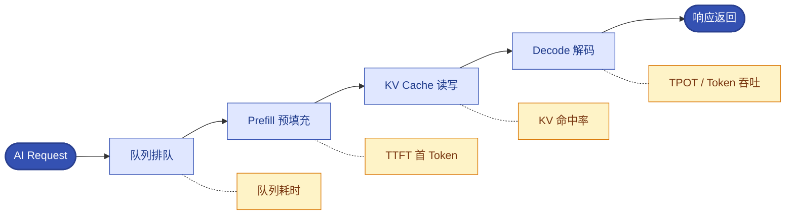

# 第18章 AI推理性能、KV Cache与智能自治运维
<!-- 第六篇 AI原生运维核心体系 ｜ ★理论核心·智能自治（全书第三层理论核心·终版模型） ｜ 状态：终审中 -->

> 本章定位：全书三层自治模型**第三层 · 智能自治**，全书差异化王牌终章。讲清 AI 推理性能与容量模型、KV Cache 治理，并以智能自治闭环（运行观测 → 推理分析 → 动态决策 → 自适应执行 → 结果校验 → 反馈迭代）收束全书。**本章分两个阅读单元：18.1–18.4 推理性能与容量模型；18.5–18.9 AI 负载可观测 / SLO / 智能自治。**

> **技术栈锁死（永久不变）**：AI 推理栈 = vLLM、SGLang。不新增任何其他推理引擎（不写 Triton / DeepSpeed / Ray Serve 等）。
> **去工具化**：本章讲的是"Continuous Batching + KV Cache + 推理性能/容量模型"的原理，vLLM/SGLang 只是参考实例，换 TensorRT-LLM/Triton 等推理引擎，这套模型照样适用（详见 CONVENTIONS 三）。
> **边界声明**：不拓展 Agent 框架 / RAG / MCP 等生态（仅 18.8 对比运维差异）；不写新兴 AI 框架与协议；不写 CUDA 硬件原理。以上归 V2。

---

## 18.1 推理框架锁死：仅聚焦vLLM、SGLang两大主流生产框架，不新增任何其他推理引擎
<!-- AI 推理栈锁死锚点 -->
<!-- 定位说明：本书锁死 vLLM/SGLang 是为"运维标准化举例"，不是判定其他框架不可用。TensorRT-LLM / Triton 等同样在生产广泛使用；本章的推理性能与容量模型（18.3）、KV Cache 治理（18.2）是**框架无关的方法论**，用其他框架的团队同样适用，只是框架专属调优不展开（归 V2）。 -->

### 生产问题

团队选推理框架时面临一堆选择（vLLM/SGLang/Triton/DeepSpeed/Ray Serve 等），调研对比耗时且无尽头，每个框架特性/指标暴露方式各异，运维无法标准化。**推理框架选择焦虑 + 多框架并存，让推理运维无法标准化**。

### 传统方案失效原因

- **多框架并存**：不同业务用不同推理框架，运维方式各异，无法统一。
- **指标不统一**：各框架性能指标暴露方式不同，可观测无法标准化。
- **选择瘫痪**：反复对比调研，迟迟不定。
- **运维重复**：每个框架一套运维，成本翻倍。

失效根因：**没有锁定少数主流推理框架，建立标准化运维**。

### 架构约束与权衡

本书推理框架锁死（永久不变）：

| 框架 | 定位 | 适用 |
|---|---|---|
| **vLLM** | 主流高吞吐推理框架（PagedAttention/KV 缓存高效） | 通用大模型推理主力 |
| **SGLang** | 高性能推理 + 结构化生成 | 结构化/复杂解码场景 |

权衡的核心：**本书永久锁死 vLLM + SGLang 两大主流生产框架，不新增其他推理引擎**（Triton/DeepSpeed/Ray Serve 等归 V2）。锁定少数框架，让推理运维（指标/弹性/性能模型）标准化，避免多框架并存的运维割裂。

### 最小可行方案

推理框架锁死最小实践：

1. **主力用 vLLM**：通用大模型推理主力。
2. **结构化场景用 SGLang**：复杂解码/结构化生成场景。
3. **不引入其他**：Triton/DeepSpeed/Ray Serve 等不进 V1.0。
4. **标准化运维**：两框架的指标暴露/弹性/性能模型统一治理。

### 生产落地实现

- vLLM：通用推理服务主力，暴露标准指标（吞吐/延迟/KV 命中率，18 章）。
- SGLang：结构化/复杂解码场景。
- 运维统一：两框架指标接入 VictoriaMetrics（12 章），弹性用 KEDA（16 章），性能模型统一（18.3）。

### 典型故障案例

某团队多框架并存（vLLM + 另两个），运维三套、指标各异、故障定位难。收敛到 vLLM + SGLang 后，运维标准化，定位效率大升。

点评：**框架收敛是推理运维标准化的前提**，锁死两主流框架换取统一治理。

### 根因定位

根因不在框架选错，而在**多框架并存导致运维无法标准化**。

### 长效治理方案

- 永久锁死 vLLM + SGLang。
- 不引入其他推理引擎（归 V2）。
- 两框架指标/弹性/性能模型统一治理。

### 自动化/自治闭环

推理框架锁死是 L3 智能自治的**标准化基础**：**L3 的性能模型/动态调度/弹性决策依赖统一的推理指标**。多框架指标各异，L3 无法建立统一决策模型；锁死两框架，L3 才能基于统一指标做智能自治。

### 生产检查清单

- [ ] 推理是否主力用 vLLM + SGLang？
- [ ] 是否避免引入其他推理引擎（归 V2）？
- [ ] 两框架指标是否统一接入可观测？
- [ ] 是否避免多框架并存的运维割裂？

---

## 18.2 Continuous Batching、KV Cache核心机制与运维痛点根治方案

### 生产问题

推理服务出现诡异波动：并发一上来延迟雪崩、长上下文请求拖慢全局、某些请求慢一个数量级。团队不懂 Continuous Batching 和 KV Cache 机制，无法定位这些波动的根因，更无法根治。**不懂核心推理机制，推理波动就是黑盒，无法治理**。

### 传统方案失效原因

- **不懂 Continuous Batching**：不知动态批处理如何影响吞吐/延迟，无法调优。
- **不懂 KV Cache**：不知缓存命中/驱逐如何造成延迟波动，无法治理。
- **波动当随机**：把推理波动当随机噪声，实际是机制性问题。
- **无根治方案**：靠加 GPU 硬扛，不解决机制根因。

失效根因：**没有掌握 Continuous Batching + KV Cache 机制及运维痛点根治方案**。本章纯运维视角讲机制（不展开算法）。

### 架构约束与权衡

两大核心机制（运维视角）：

| 机制 | 运维含义 | 痛点 |
|---|---|---|
| **Continuous Batching** | 动态组批提升吞吐 | 批内长请求拖慢全局 |
| **KV Cache** | 缓存上下文减少重算 | 缓存满驱逐 → 延迟波动 |

权衡的核心：**Continuous Batching 提吞吐但批内长尾影响全局；KV Cache 提速但缓存满了会驱逐导致波动**。运维要理解这两机制的性能影响，针对性根治。

### 最小可行方案

两大机制运维痛点根治最小集：

1. **Continuous Batching 调优**：合理配 max batch size/并发，避免长请求拖慢全局。
2. **KV Cache 治理**：监控命中率，配置合理缓存容量/驱逐策略，防满驱逐波动。
3. **长尾隔离**：长上下文请求分桶/独立实例组，避免拖慢短请求（3.3 节）。
4. **波动归因**：波动先查 KV 缓存命中率 + 批组合，而非当随机。

### 生产落地实现

- Batching：vLLM/SGLang 配 max_num_seqs/max batch，平衡吞吐与尾延迟。
- KV Cache：监控命中率（vLLM/SGLang 暴露，18 章），配置缓存容量；命中率低时调容量/驱逐策略。
- 长尾隔离：长上下文请求路由独立实例组（3.3 节分桶）。
- 归因：延迟波动 → 查 KV 命中率（低则缓存问题）+ 批组合（长请求拖慢）。

### 典型故障案例

某推理并发上来延迟雪崩，根因是 KV 缓存满了频繁驱逐（命中率低），导致大量重算。扩缓存容量 + 调驱逐策略后，命中率回升，延迟稳定。

点评：**推理延迟波动大概率是 KV 缓存问题**，不懂机制就会盲调。

### 根因定位

根因不在并发高，而在**不懂 Continuous Batching/KV Cache 机制，无法根治波动**。

### 长效治理方案

- Continuous Batching 参数调优（平衡吞吐/尾延迟）。
- KV Cache 命中率监控 + 容量/驱逐治理。
- 长尾请求隔离（分桶/独立实例组）。
- 波动归因查机制（缓存/批组合），非当随机。

### 自动化/自治闭环

两大机制理解是 L3 智能自治的**决策依据**：**L3 的动态调度/缓存治理决策，基于对 Continuous Batching/KV Cache 机制的理解**。不懂机制，L3 决策无依据；懂机制，L3 能精准治缓存/调度根治波动。

### 生产检查清单

- [ ] 是否理解 Continuous Batching 对吞吐/尾延迟的影响？
- [ ] KV Cache 命中率是否监控 + 治理（容量/驱逐）？
- [ ] 长尾请求是否隔离（分桶/独立实例组）？
- [ ] 延迟波动是否归因到机制（缓存/批组合）？
- [ ] 是否避免盲调（加 GPU 硬扛）？

---

## 18.3 全书独家AI推理性能与容量模型（终版定型）
<!-- 全书独家推理性能与容量模型锚点 -->
<!-- 完整推理链路：AI Request → 队列排队 → Prefill 预填充 → KV Cache 缓存读写 → Decode 解码 → 响应返回 -->
<!-- 核心指标关联体系：TTFT、TPOT、端到端延迟、Token 吞吐、并发量、KV 缓存命中率、GPU 利用率、队列耗时 -->

推理链路与各阶段指标对应（一图看懂"延迟卡在哪、指标挂在哪"）：



### 生产问题

团队运维推理服务，但缺乏统一的性能与容量模型：不知各指标如何关联、不知瓶颈在哪、容量规划靠拍脑袋。结果常出现"GPU 利用率高但性能劣化""QPS 稳定但延迟飙升"等无法解释的现象。**没有性能与容量模型，推理运维就是凭感觉，瓶颈不可定位、容量不可规划**。

### 传统方案失效原因

- **指标孤立**：TTFT/吞吐/利用率等各看各的，不知关联。
- **无链路视角**：不知请求经过"队列→prefill→KV→decode"各阶段的耗时分布。
- **无瓶颈定位**：不知哪个指标异常对应哪个阶段瓶颈。
- **容量拍脑袋**：不知指标如何关联到容量需求。

失效根因：**没有建立推理性能与容量的统一模型**。本节给出全书独家终版模型。

### 架构约束与权衡

全书独家推理性能与容量模型（终版定型）：

**完整推理链路**：
```text
AI Request → 队列排队 → Prefill 预填充 → KV Cache 缓存读写 → Decode 解码 → 响应返回
```

**核心指标关联体系**：

| 指标 | 含义 | 关联阶段 |
|---|---|---|
| **队列耗时** | 请求排队等待 | 队列排队 |
| **TTFT**（首 Token 延迟） | 首 Token 返回耗时 | Prefill |
| **TPOT**（每 Token 延迟） | 后续每 Token 耗时 | Decode |
| **端到端延迟** | TTFT + TPOT×Token 数 | 全链路 |
| **Token 吞吐** | 单位时间产出 Token | Decode |
| **并发量** | 同时处理请求数 | 全链路 |
| **KV 缓存命中率** | 缓存命中比例 | KV Cache |
| **GPU 利用率** | GPU 计算利用度 | Prefill/Decode |

权衡的核心：**这个模型把"链路阶段"与"指标"对应起来**——延迟飙升先定位是队列（队列耗时）/prefill（TTFT）/decode（TPOT）/缓存（命中率）哪一段，再针对性治理。容量规划基于指标关联（如并发量×TPOT 推算吞吐上限）。

### 最小可行方案

性能与容量模型最小应用：

1. **链路视角**：把推理请求看作"队列→prefill→KV→decode"链路，定位耗时分布。
2. **指标关联**：延迟异常先归因到对应阶段指标（TTFT/TPOT/命中率/队列耗时）。
3. **瓶颈定位**：哪个阶段指标异常 = 瓶颈在那（如 TTFT 高 = prefill 瓶颈）。
4. **容量规划**：基于指标关联推算（如目标并发 × TPOT → 所需吞吐 → GPU 数）。

### 生产落地实现

- 链路：vLLM/SGLang 暴露各阶段指标，Grafana 按链路展示（12 章）。
- 指标：TTFT/TPOT/吞吐/并发/命中率/利用率全采（VM，12 章）。
- 瓶颈定位：延迟异常 → 对照链路各阶段指标 → 定位瓶颈段。
- 容量：目标并发×TPOT 推吞吐 → 推 GPU 数；KV 命中率推缓存容量。

### 典型故障案例

某推理"GPU 利用率高但延迟飙升"，用模型归因：利用率高但 TPOT 也高 → decode 阶段瓶颈（批过大/缓存驱逐）；KV 命中率低 → 缓存问题。针对性治缓存后，延迟回落，利用率与性能一致。

点评：**这个模型把"GPU 高但性能差"这种悖论解释清楚**——利用率高 ≠ 性能好，要分阶段看指标。

### 根因定位

根因不在指标多，而在**无统一模型把链路/指标/瓶颈/容量关联**。模型缺失，运维只能凭感觉。

### 长效治理方案

- 统一推理性能与容量模型（链路 + 指标关联）。
- 延迟异常按模型归因到阶段瓶颈。
- 容量规划基于指标关联推算。
- 全指标接入可观测，按链路展示。

### 自动化/自治闭环

本模型是 L3 智能自治的**决策模型核心**：**L3 的动态决策（调度/缓存/弹性）基于这个性能与容量模型——观测各阶段指标 → 推理瓶颈 → 决策处置 → 校验指标改善**。没有统一模型，L3 决策无依据；有了模型，L3 能精准定位瓶颈、智能决策。这是全书独家差异化的核心。

### 生产检查清单

- [ ] 是否用统一性能与容量模型（链路 + 指标关联）？
- [ ] 延迟异常是否能归因到阶段瓶颈（TTFT/TPOT/命中率/队列）？
- [ ] 是否能解释"GPU 高但性能差"类悖论？
- [ ] 容量规划是否基于指标关联推算？
- [ ] 全指标是否按链路展示？

---

## 18.4 核心落地解答：AI推理场景下的容量规划方法论，解决「GPU高利用率但性能劣化、QPS稳定延迟飙升、缓存失效成本暴涨」等生产核心难题

### 生产问题

团队面对推理容量规划的核心难题束手无策：GPU 利用率高但性能反而劣化（不知为何）、QPS 稳定但延迟飙升（不知瓶颈）、缓存失效导致成本暴涨（不知怎么治）。**这些推理特有的容量悖论，传统容量方法（CPU/内存）解释不了也解不了**。

### 传统方案失效原因

- **用 CPU 容量方法**：按 CPU/内存规划推理容量，完全失准（瓶颈在 GPU/缓存）。
- **只看单指标**：只看 QPS 或利用率，不见延迟/缓存关联，陷入悖论。
- **悖论当异常**：把"高利用率低性能"当异常，实际是模型认知缺失（18.3）。
- **无方法论**：没有推理专属容量规划方法。

失效根因：**没有基于 18.3 性能与容量模型的推理容量规划方法论**。

### 架构约束与权衡

推理容量规划方法论（基于 18.3 模型）：

| 难题 | 模型归因 | 容量对策 |
|---|---|---|
| **GPU 高利用率但性能劣化** | 利用率高 ≠ 性能好，看 TPOT/缓存 | 降批/扩缓存/加 GPU |
| **QPS 稳定延迟飙升** | QPS 稳定但尾延迟升，看队列/缓存命中率 | 扩并发/治缓存 |
| **缓存失效成本暴涨** | KV 命中率低 → 重算多 → 成本高 | 扩缓存容量/调驱逐 |

权衡的核心：**容量规划基于"指标关联"而非"单指标"**——结合并发×延迟×缓存命中率×利用率综合判断容量需求与瓶颈。

### 最小可行方案

容量规划方法论最小集：

1. **基于模型**：用 18.3 模型，按链路 + 指标关联规划。
2. **解悖论**：高利用率低性能 → 查 TPOT/缓存；QPS 稳延迟升 → 查队列/命中率。
3. **容量推算**：目标并发 × TPOT → 吞吐需求 → GPU 数；命中率 → 缓存容量。
4. **迭代**：容量调整后校验指标改善（18.3 模型校验）。

### 生产落地实现

- 悖论诊断：GPU 高但性能差 → 查 TPOT（decode 瓶颈）+ 命中率（缓存问题）→ 降批/扩缓存/加 GPU。
- QPS 稳延迟升 → 查队列耗时（排队瓶颈）+ 命中率 → 扩并发/治缓存。
- 缓存失效成本暴涨 → 命中率低 → 扩缓存容量/调驱逐策略。
- 容量推算：目标 SLO（延迟/并发）→ 反推 GPU 数与缓存容量，留 headroom。

### 典型故障案例

某推理"QPS 稳定但 p99 延迟飙升"，模型归因：队列耗时飙升（并发超容量）+ KV 命中率下降（缓存满）。扩并发 + 扩缓存后，队列与命中率恢复，延迟回落。

点评：**容量悖论用模型都能解释**——关键是看指标关联，而非单指标。

### 根因定位

根因不在容量不够，而在**无推理容量规划方法论，用错方法（CPU 思维）**。

### 长效治理方案

- 容量规划基于 18.3 模型（链路 + 指标关联）。
- 悖论用模型归因（高利用率低性能/QPS 稳延迟升/缓存失效）。
- 容量推算基于目标 SLO 反推。
- 调整后用模型校验指标改善。

### 自动化/自治闭环

容量规划方法论是 L3 智能自治的**容量决策框架**：**L3 的弹性/调度决策，基于这套方法论判断"何时扩容、扩什么（GPU/缓存）、扩多少"**。没有方法论，L3 容量决策盲目（1.5 节跳级案例的成本爆炸）；有方法论，L3 容量决策精准且经济。

### 生产检查清单

- [ ] 容量规划是否基于 18.3 模型（非 CPU 思维）？
- [ ] 能否解释"GPU 高但性能差""QPS 稳延迟升"等悖论？
- [ ] 缓存失效成本问题是否能治（扩缓存/调驱逐）？
- [ ] 容量是否基于目标 SLO 反推？
- [ ] 容量调整后是否用模型校验？

---

## 18.5 AI负载专属可观测体系：GPU指标、推理性能指标、异常监测与瓶颈定位

### 生产问题

团队的可观测（12 章）覆盖了通用指标，但 AI 负载的专属指标（GPU 利用率/显存、TTFT/TPOT、KV 命中率）缺失。推理出问题时，看不到这些专属指标，无法定位是 GPU 问题还是推理性能问题。**通用可观测覆盖不到 AI 专属信号，AI 负载的瓶颈不可见**。

### 传统方案失效原因

- **无 GPU 指标**：GPU 利用率/显存未采集。
- **无推理性能指标**：TTFT/TPOT/吞吐/命中率未采集。
- **通用观测不够**：12 章通用栈不覆盖 AI 专属语义。
- **瓶颈不可定位**：无专属指标，瓶颈靠猜。

失效根因：**没有在 12 章统一可观测栈之上，叠加 AI 负载专属可观测层**。

### 架构约束与权衡

AI 负载专属可观测（基于 12 章统一栈）：

| 指标类 | 内容 | 来源 |
|---|---|---|
| **GPU 指标** | 利用率/显存/温度 | DCGM exporter |
| **推理性能指标** | TTFT/TPOT/吞吐/并发 | vLLM/SGLang |
| **缓存指标** | KV 命中率/驱逐 | vLLM/SGLang |
| **异常监测** | 性能劣化/瓶颈 | 18.3 模型归因 |

权衡的核心：**AI 专属可观测建立在 12 章统一栈之上（复用 VM/Grafana），叠加 AI 语义指标**，不另起炉灶。这与第 3 章"底座统一、治理分层"一致。

### 最小可行方案

AI 专属可观测最小集：

1. **GPU 指标**：DCGM exporter 采 GPU 利用率/显存进 VM。
2. **推理性能指标**：vLLM/SGLang 暴露 TTFT/TPOT/吞吐/并发进 VM。
3. **缓存指标**：KV 命中率/驱逐进 VM。
4. **瓶颈定位**：按 18.3 模型，用这些指标归因瓶颈。

### 生产落地实现

- GPU：DCGM exporter → VictoriaMetrics（12 章）。
- 推理性能：vLLM/SGLang metrics → VM。
- 缓存：KV 命中率/驱逐 → VM。
- 面板：Grafana AI 专属面板（GPU/性能/缓存），按 18.3 链路组织。
- 告警：性能劣化（TPOT 升/命中率降）告警（13 章）。

### 典型故障案例

某推理延迟波动，原无专属指标靠猜。接入 GPU + 推理性能 + 缓存指标后，一眼定位是 KV 命中率波动（缓存问题），针对性治缓存解决。

点评：**AI 负载可观测是 L3 自治的眼睛**，看不见专属指标就无法治理。

### 根因定位

根因在某指标缺失，而在**未在统一栈上叠加 AI 专属可观测层**。

### 长效治理方案

- GPU 指标（DCGM）+ 推理性能（vLLM/SGLang）+ 缓存指标全接入 VM。
- Grafana AI 专属面板（按 18.3 链路）。
- 性能劣化告警。
- 瓶颈用 18.3 模型归因。

### 自动化/自治闭环

AI 专属可观测是 L3 智能自治的**输入信号源**：**L3 决策依赖这些专属指标——GPU 利用率/TTFT/TPOT/命中率是 L3 推理决策的输入**。建立在 12 章统一栈上，让 AI 信号与其他负载信号协同（三支柱贯通）。无专属可观测，L3 就是瞎子。

### 生产检查清单

- [ ] GPU 指标（利用率/显存）是否采集（DCGM）？
- [ ] 推理性能指标（TTFT/TPOT/吞吐/并发）是否采集？
- [ ] KV 缓存命中率/驱逐是否采集？
- [ ] 是否有 AI 专属 Grafana 面板（按 18.3 链路）？
- [ ] 性能劣化是否告警 + 模型归因瓶颈？

---

## 18.6 AI负载SLO体系：推理可用性、延迟稳定性、服务容错生产规范
<!-- 通用 SLO/错误预算体系见第 13 章，本节只讲 AI 负载专属 SLO（分阶段百分位 + 推理容错） -->

### 生产问题

团队给推理服务定的 SLO 套用普通服务（成功率/平均延迟），但推理特性（TTFT/TPOT 分阶段、尾延迟敏感、缓存影响）没体现。结果 SLO 设了等于没设——劣化体现不到 SLO，或 SLO 误报。**AI 负载 SLO 用普通服务标准，失准且无用**。

### 传统方案失效原因

- **套用普通 SLO**：用成功率/平均延迟，不见推理特性。
- **不分阶段**：不区分 TTFT（prefill）/TPOT（decode），延迟劣化定位不准。
- **不看尾延迟**：用平均延迟，掩盖 p99 劣化（3.3 节）。
- **无容错规范**：推理特有的容错（降级/限流/重试）无规范。

失效根因：**没有基于推理特性建立专属 SLO 体系**。

### 架构约束与权衡

AI 负载 SLO 体系：

| 维度 | SLO | 要点 |
|---|---|---|
| **推理可用性** | 成功率/可用率 | 服务级 |
| **延迟稳定性** | TTFT p95/p99 + TPOT p95/p99 | 分阶段 + 百分位 |
| **服务容错** | 降级/限流/重试规范 | 推理特有 |

权衡的核心：**推理 SLO 分阶段（TTFT/TPOT）+ 百分位（p99）+ 容错规范**，而非平均/成功率一刀切。

### 最小可行方案

AI SLO 最小集：

1. **可用性**：推理成功率/可用率 SLO。
2. **延迟分阶段**：TTFT p99 + TPOT p99（非平均），分阶段设目标。
3. **百分位**：用 p95/p99（非平均，3.3 节）。
4. **容错**：推理降级（超时返兜底）/限流（防过载）/重试规范（防重试风暴，18.8）。

### 生产落地实现

- 可用性：成功率 SLO（13 章体系）。
- 延迟：TTFT p99 + TPOT p99 SLO（18.5 指标源），分阶段。
- 百分位：VictoriaMetrics 算 p95/p99（12 章）。
- 容错：超时降级（返兜底响应）、限流（KEDA/网关）、重试规范（退避 + 上限，18.8）。

### 典型故障案例

某推理用平均延迟 SLO，p99 劣化被平均掩盖，用户感知差但 SLO "达标"。改 TTFT/TPOT p99 SLO 后，尾延迟劣化即时反映。

点评：**推理 SLO 必须分阶段 + 百分位**，平均/成功率掩盖真实体验。

### 根因定位

根因不在 SLO 阈值，而在**SLO 未基于推理特性（分阶段/百分位/容错）**。

### 长效治理方案

- 推理 SLO：可用性 + TTFT/TPOT p99（分阶段百分位）。
- 容错规范：降级/限流/重试。
- SLO 纳入 13 章错误预算体系。
- 劣化即时反映（不掩盖）。

### 自动化/自治闭环

AI SLO 是 L3 智能自治的**目标标尺**：**L3 自治的目标是"守住推理 SLO"（TTFT/TPOT/可用性），SLO 消耗是 L3 决策触发与校验依据**。没有推理专属 SLO，L3 无目标；有了，L3 能基于 SLO 精准决策何时调度/弹性/降级。

### 生产检查清单

- [ ] 推理 SLO 是否分阶段（TTFT/TPOT）+ 百分位（p99）？
- [ ] 是否避免平均延迟掩盖尾延迟？
- [ ] 是否有推理容错规范（降级/限流/重试）？
- [ ] SLO 是否纳入错误预算体系？
- [ ] 劣化是否能即时反映到 SLO？

---

## 18.7 AI负载智能弹性、故障自愈、推理服务自治落地实战

### 生产问题

团队对 AI 负载的弹性/自愈仍用人工：负载涨手动扩 GPU、推理故障手动重启、性能劣化手动调。AI 负载的复杂动态（缓存/并发/性能）超出人实时判断，人工响应慢且不准。**AI 负载的弹性/自愈/自治不自动化，靠人撑不住复杂动态**。

### 传统方案失效原因

- **人工弹性**：负载涨靠人扩 GPU，慢且不准。
- **人工自愈**：推理故障靠人重启，慢。
- **人工调优**：性能劣化靠人调，复杂动态人判断不了。
- **无自治**：AI 负载未进入自治闭环。

失效根因：**AI 负载的弹性/自愈/自治未自动化闭环**。

### 架构约束与权衡

AI 负载自治（L2→L3 进化）：

| 维度 | 自动化 | 依据 |
|---|---|---|
| **智能弹性** | KEDA 接 Token 吞吐/队列驱动扩缩 | 推理信号（16 章） |
| **故障自愈** | 探针自愈 + 自动重启/重调度 | 5 章 + 推理特性 |
| **推理服务自治** | 性能反馈驱动的动态调度/缓存治理 | 18.3 模型 |

权衡的核心：**AI 负载自治从 L2（KEDA 弹性/探针自愈）进化到 L3（性能反馈驱动的动态调度）**，逐步把人工响应变自动闭环。

### 最小可行方案

AI 负载自治最小集：

1. **智能弹性**：KEDA 接推理队列/Token 吞吐驱动扩缩（16 章，HPA 不懂推理信号）。
2. **故障自愈**：推理探针 + 自动重启 + 重调度（5 章 + 推理 startup 探针）。
3. **推理自治**：性能反馈（18.5 指标）驱动动态调度/缓存治理（18.9 闭环）。

### 生产落地实现

- 弹性：KEDA ScaledObject 接推理队列/Token 吞吐（16.3），推理信号驱动扩缩。
- 自愈：startup/liveness 探针（加载保护 + 死活判定）+ 自动重启 + 故障节点重调度。
- 自治：性能反馈 → 动态调度（长尾隔离/负载均衡）+ 缓存治理（命中率驱动调缓存）→ 校验（18.9）。

### 典型故障案例

某推理负载涨，人工扩 GPU 耗时 20 分钟，期间延迟劣化。改 KEDA（Token 吞吐驱动）自动扩缩后，负载涨自动扩，延迟稳定。

点评：**AI 负载弹性必须用推理信号（KEDA），靠人/CPU 都撑不住**。

### 根因定位

根因不在响应慢，而在**AI 负载弹性/自愈/自治未自动化**。

### 长效治理方案

- 智能弹性（KEDA 推理信号驱动）。
- 故障自愈（探针 + 自动重启/重调度）。
- 推理自治（性能反馈驱动动态调度/缓存治理，18.9）。
- 逐步从 L2 进化到 L3。

### 自动化/自治闭环

本节是 L3 智能自治的**落地实战**：**智能弹性（KEDA）+ 故障自愈 + 推理自治，构成了 AI 负载从 L2 弹性/自愈向 L3 动态自治的进化路径**。每一项都基于 18.3 性能模型与 18.5 专属可观测，让 AI 负载的治理从人工走向自治。

### 生产检查清单

- [ ] AI 负载弹性是否用 KEDA 推理信号驱动（非 HPA/人工）？
- [ ] 故障是否自愈（探针 + 自动重启/重调度）？
- [ ] 性能劣化是否能触发动态调度/缓存治理？
- [ ] 自治是否从 L2 弹性/自愈向 L3 动态自治进化？
- [ ] 自治是否基于 18.3 模型 + 18.5 可观测？

---

## 18.8 Agent边界锁死：仅对比Agent与普通推理的运维差异（长生命周期、状态依赖、多工具调用、重试风暴），搭配单故障案例佐证，不拓展Agent框架、RAG、MCP等生态内容
<!-- 本节是"AI 负载边界场景对比"，不是第 18 章的核心；本章理论核心在 18.9 智能自治闭环。Agent 完整生态（框架/RAG/MCP）归 V2。 -->

### 生产问题

团队上线智能 Agent 服务后，遇到普通推理没有的问题：Agent 调用链长、状态依赖重、多工具调用放大故障、重试风暴把下游打挂。团队用普通推理方式运维 Agent，处处失配。**Agent 负载的运维特性与普通推理差异大，用错方式必失配**。

### 传统方案失效原因

- **Agent 当普通推理**：忽视长生命周期/状态依赖/多工具/重试特性。
- **无状态假设失效**：Agent 有会话/任务状态，Pod 随意重建丢状态。
- **重试无治理**：Agent 多步调用失败重试，放大成重试风暴打挂下游。
- **边界外扩**：想展开 Agent 框架/RAG/MCP 生态，偏离运维视角。

失效根因：**没有识别 Agent 与普通推理的运维差异并针对性治理**。本章边界锁死：仅对比运维差异 + 单故障案例，不拓展生态（归 V2）。

### 架构约束与权衡

Agent vs 普通推理运维差异（边界锁死）：

| 维度 | 普通推理 | Agent | 运维差异 |
|---|---|---|---|
| **生命周期** | 请求级（短） | 会话/任务级（长） | 长生命周期需保活/续跑 |
| **状态依赖** | 无状态 | 有会话/任务状态 | 状态外置，不随 Pod 丢 |
| **多工具调用** | 单次推理 | 多步多工具 | 调用链长，故障放大 |
| **重试** | 请求级 | 多步重试 | 重试风暴治理（退避+上限） |

权衡的核心：**Agent 运维聚焦"长生命周期/状态外置/重试治理"**，而非展开 Agent 框架/RAG/MCP 生态（归 V2）。配单故障案例佐证。

### 最小可行方案

Agent 运维差异最小治理：

1. **长生命周期**：会话/任务级保活 + 优雅终止 + 续跑（3.2 节）。
2. **状态外置**：会话/任务状态外置（Redis/存储），Pod 无状态化。
3. **重试治理**：多步调用重试加退避 + 上限，防重试风暴。
4. **单故障案例**：见下，佐证运维差异。

### 生产落地实现

- 生命周期：Agent 服务长优雅终止 + 任务检查点/续跑。
- 状态外置：会话状态进 Redis/向量库，Pod 重建不丢。
- 重试治理：工具调用重试退避（指数退避）+ 上限（max retry），防风暴（3.2 节）。
- 监控：Agent 调用链/重试次数监控（12 章）。

### 典型故障案例

某 Agent 服务某工具偶发失败，触发热重试（无退避无上限），重试风暴把下游工具服务打挂，级联故障。加重试退避 + 上限后，风暴消除。

点评：**Agent 的重试风暴是典型运维差异**——多步调用 × 无治理重试 = 风暴。这是 Agent 运维必须治理的点（也是附录 B.5 案例）。

### 根因定位

根因不在某次工具失败，而在**Agent 重试无治理 + 用普通推理方式运维**。

### 长效治理方案

- Agent 长生命周期保活 + 状态外置。
- 重试退避 + 上限（防风暴）。
- 调用链/重试监控。
- 边界锁死：仅对比运维差异，不展开 Agent 框架/RAG/MCP（归 V2）。

### 自动化/自治闭环

Agent 运维差异是 L3 智能自治的**特殊场景**：**Agent 的长生命周期/状态/重试特性，需要 L3 自治针对处理（重试风暴自愈、状态感知调度）**。本节锁死边界——只对比运维差异 + 单案例，把 Agent 完整生态（框架/RAG/MCP）留 V2，保持 V1.0 边界纯净。

### 生产检查清单

- [ ] Agent 是否识别长生命周期/状态依赖/多工具/重试差异？
- [ ] 会话状态是否外置（Pod 重建不丢）？
- [ ] 重试是否退避 + 上限（防风暴）？
- [ ] 是否有调用链/重试监控？
- [ ] 是否守住边界（不展开 Agent 框架/RAG/MCP）？

---

## 18.9 AI智能自治闭环终版模型：运行观测 → 场景推理分析 → 动态决策 → 自适应执行 → 结果校验 → 数据反馈迭代
<!-- 【智能自治】全书三层自治第三层·终版闭环，收束全书 -->

### 生产问题

AI 负载的复杂动态（缓存/并发/性能/算力波动），超出 L1（机械自愈）和 L2（SLO 处置）的能力。L2 能按 SLO 扩缩/回退，但不能基于推理场景动态优化（如缓存命中率下降时如何动态调缓存与调度）。**AI 负载需要比 L2 更智能的自治——基于推理场景分析做动态决策与自适应优化**，这就是 L3 智能自治。

### 传统方案失效原因

- **L2 不够**：L2 按 SLO 处置，但 AI 动态需场景推理（缓存/并发/性能关联）。
- **无智能决策**：AI 负载的复杂优化（调度/缓存/弹性联动）靠人，跟不上动态。
- **无反馈迭代**：决策不基于结果反馈迭代优化。
- **跳级风险**：L2 没建好上 L3，决策无校验（1.5 节案例）。

失效根因：**没有建立 L3 智能自治闭环（观测→推理→决策→执行→校验→反馈）**。

### 架构约束与权衡

L3 智能自治闭环终版模型：

```text
运行观测 → 场景推理分析 → 动态决策 → 自适应执行 → 结果校验 → 数据反馈迭代
```

| 环节 | 作用 | 实现 |
|---|---|---|
| **运行观测** | 采集 AI 运行信号 | 18.5 专属可观测 |
| **场景推理分析** | 基于 18.3 模型推理瓶颈/场景 | 性能模型归因 |
| **动态决策** | 决策调度/缓存/弹性联动 | 多维联动决策 |
| **自适应执行** | 执行决策（调度/缓存/扩缩） | KEDA/调度器/缓存治理 |
| **结果校验** | 校验性能/SLO 改善 | 18.6 SLO + 18.3 模型 |
| **数据反馈迭代** | 反馈优化决策模型 | 持续学习闭环 |

权衡的核心：**L3 是 L2（16.4 闭环）在 AI 复杂场景的进化版——多了"场景推理分析"和"数据反馈迭代"两环**，能处理 AI 的复杂动态。但 L3 必须建立在 L1/L2 可信基础之上（1.5 节递进原则），且每步有结果校验对冲风险。

### 最小可行方案

L3 智能自治闭环最小落地：

1. **运行观测**：18.5 专属可观测提供信号。
2. **场景推理**：基于 18.3 性能模型，推理瓶颈/场景（如缓存命中率降 → 缓存瓶颈场景）。
3. **动态决策**：联动决策（扩缓存 + 调度 + 弹性），非单一处置。
4. **自适应执行**：执行（调缓存/调度/KEDA 扩缩）。
5. **结果校验**：校验 SLO/性能改善（18.6/18.3）。
6. **反馈迭代**：决策有效则强化，无效则调整，持续优化。

### 生产落地实现

- 观测：18.5 指标（GPU/性能/缓存）进 VM。
- 推理：基于 18.3 模型归因场景（瓶颈定位）。
- 决策：联动决策（缓存 + 调度 + 弹性），而非单维。
- 执行：调缓存配置/调度（长尾隔离）/KEDA 扩缩。
- 校验：SLO（18.6）+ 性能模型（18.3）确认改善。
- 反馈：决策效果数据化，优化决策规则（持续迭代）。

### 典型故障案例

某推理 KV 命中率下降导致延迟劣化。L3 闭环：观测到命中率降 + 延迟升 → 推理为缓存瓶颈场景 → 决策扩缓存 + 长尾隔离 → 执行 → 校验命中率回升延迟恢复 → 反馈强化"命中率降→扩缓存"规则。全程自动，无需人工。

点评：**L3 让 AI 负载的复杂动态被自动治理**——这是 L1/L2 做不到的，也是全书差异化王牌的精髓。

### 根因定位

根因不在某次劣化，而在**未建立 L3 智能自治闭环，AI 复杂动态靠人治理**。

### 长效治理方案

- L3 六环节闭环（观测→推理→决策→执行→校验→反馈）。
- 建立在 L1/L2 可信基础上（不跳级）。
- 基于 18.3 模型做场景推理。
- 决策联动（多维），校验 + 反馈迭代。

### 自动化/自治闭环

本节是全书三层自治的**终章与收束**：**L1 机械自治（第 5 章）→ L2 运维自治（第 16 章）→ L3 智能自治（本节），三层递进完成**。L3 闭环（观测→推理→决策→执行→校验→反馈）是全书精神内核——"现代运维体系从人工操作演进为声明式、可观测、可治理、可自治的生产控制系统"——的终极形态。至此，全书核心业务闭环链路（不可变基础设施→…→AI 智能自治）走完最后一环，生产控制系统从"机械自愈"经"业务自治"抵达"智能自治"。

### 生产检查清单

- [ ] L3 是否六环节闭环（观测→推理→决策→执行→校验→反馈）？
- [ ] L3 是否建立在 L1/L2 可信基础上（不跳级）？
- [ ] 场景推理是否基于 18.3 性能模型？
- [ ] 决策是否联动多维（缓存/调度/弹性）？
- [ ] 是否有结果校验 + 反馈迭代（决策持续优化）？
- [ ] AI 负载复杂动态是否自动治理（不靠人）？
