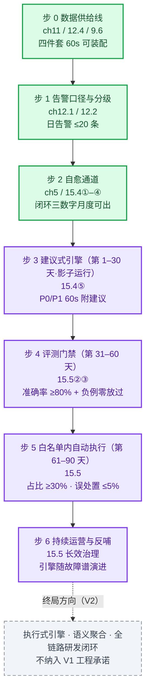

# AI 原生运维体系：以云原生为底座的生产控制系统

这是一本以 **AI 原生运维（AI-native Ops）为主旨**的书：现代生产运维体系从人工操作，演进为声明式、可观测、可治理、可自治的生产控制系统——这条演进的终点（L3 智能自治）就是主旨所在；云原生不是并列的另一个主范式，而是抵达终点的底座与技能基座。

> **三大差异化主张**：
> ① 国内首套以**三层自治控制论**为主线、完整打通云原生底座与 LLM 智能体（Agent）运维的生产运维工程书；
> ② 拒绝 Demo 式 AIOps 空谈——全套**可运行制品 + 双云生产对照（阿里云 ACK / AWS EKS）+ 量化指标 + 安全护栏体系**；
> ③ 划清 **V1 工程边界与 V2 演进路线**——智能化诉求与企业稳定性风控并重，不承诺"全自动无人运维"。

**全书以云为生态**：基础设施层 = 托管 K8s（阿里云 ACK 主参考、AWS EKS 全程对照）+ 云服务（RRSA/IRSA、SLB/NLB、云盘/NAS/OSS、ACR/ECR）；可观测/交付/智能引擎平台组件跑在托管底座上。每个小节按「落地三件套」写作：可运行制品 + 云服务映射 + 数字（见 CONVENTIONS）。

## 这本书写给谁

- 正在用大模型与智能体重构运维（AIOps 落地）的 SRE 与平台工程师——主旨人群
- 已具备 K8s 与生产运维基础、正在向 AI 原生运维演进的云原生工程师与团队技术负责人
- 想理解「为什么现代运维要演进为自治控制系统」的架构师与决策者

## 读前须知：为什么前 14 章都在讲云原生

扫目录看见第 1–14 章全是 K8s、GitOps、可观测、SRE？**这不是一本 K8s 书，AI 原生运维也不是最后一章的附加内容**——前 14 章搭建的是同一件事：第 15 章 AI 运维 Agent 引擎赖以运行的可信生产控制系统。目录里每章标题的【层级标签】标出它在主线中的位置，终点站在 **L3（15.4⑤/15.5）**。

市面上多数 AIOps 内容跳过底座空谈大模型：没有统一可观测，引擎是瞎子；没有声明式执行通道，建议落不了地；没有 SLO 口径与预算护栏，处置无标尺、误信号烧穿账单——于是止步于演示。本书反其道而行：**先搭建可信生产控制系统（声明式、可观测、可治理、可自治），再落地 AI Agent（15.4⑤/15.5）**，给出从制品供应链到智能引擎的完整工程链路。

**三层自治递进主线（全书唯一主线）**：**L1 机械自治（第 5 章）→ L2 运维自治（第 15 章）→ L3 智能自治（15.4⑤/15.5）**——控制权从「人 → 机械自愈 → 业务自治 → 智能自治」逐级转移；前序所有章节都是搭建 Agent 运行的控制系统，不是主线终点。赶时间的读者直接读 15.5（七步施工路线把全书串成 AIOps 落地路径），再按需回读各步锚定章节。

## 全书主旨：AI 原生运维为纲

**主旨在 AI 原生运维，不在"云原生 + AI 原生"双主范式**。全书要回答的问题是"如何用大模型与智能体重构 IT 运维本身"，终局是 L3 智能自治的生产控制系统；云原生是这条路的底座与技能基座——没有它，引擎无处可靠运行；但它是手段，不是主旨。

> **行业定义（全书总纲）**：AI 原生运维（AIOps / AI-Native Ops）是用大模型与智能体（AI Agent）作为核心引擎重构 IT 运维的新范式——将运维从"人驱动、规则执行"转变为"AI 驱动、人审核"的主动自治模式，实现从底层数据可观测到故障自愈的全链路智能化。六大支柱：**数据底座**（全域可观测：指标/日志/链路追踪）、**核心引擎**（LLM + Agent 意图理解与多步推理）、**分级自治**（参考 L0–L5 自智标准）、**智能告警**（聚合降噪、根因分析）、**故障自愈**（自动诊断与修复执行）、**交互升级**（自然语言查询）。

本书接受这个定义作为主旨总纲，并给出它的工程化交付——模式转变是真的，护栏纪律不降级：行业口径"AI 驱动、人审核"的工程化表述是**白名单内 AI 驱动（自动执行 + 结果校验），白名单外人审核（跨服务/不可逆永远人工审批），边界与护栏由人治理**（15.4）。六支柱逐项落到章节与制品：

| 支柱 | 书内交付（V1） | 章节 |
|---|---|---|
| 数据底座 | OTel 全域可观测（指标/日志/链路）——上下文装配器的供给线 | 11 章 / 15.5① |
| 核心引擎 | 运维 Agent = 闭环制品 + 建议式 LLM 分诊（15.4⑤）；执行式 LLM 引擎归 V2 | 15.4⑤ / 15.5 |
| 分级自治 | 三层自治 L1/L2/L3（治理分层轴）× 行业 L0–L5 自智等级（自治权限轴）对照 | 1.5 / 3.4 / 15.1 |
| 智能告警 | 口径治理：分级/收敛/降噪/静默（12.1）+ 根因五问（12.3）+ LLM 建议式分诊（15.4⑤）；语义聚合与自动 RCA 引 V2 | 12 章 |
| 故障自愈 | L1 探针自愈 → L2 白名单处置（校验窗 + 升级线）→ 高置信建议自动执行（15.5 步 5），护栏三件套兜底 | 5 / 15.4 / 15.5 |
| 交互升级 | V1 不自建；托管已产品化（STAROps 自然语言诊断，15.4 托管对照）+ 只读值班问答（15.5④）；自建归 V2 | V2 清单 |
| **落地路径** | **七步施工路线：现有章节按序读完 = AIOps 落地路线走完**（数据供给线 → 口径分级 → 自愈通道 → 建议式引擎 → 评测门禁 → 白名单自动执行 → L3），含 90 天节奏与评测门禁 | **15.5** |

同一本书，两种读法：

| 读法 | 视角 |
|---|---|
| 自底向上（按篇顺序） | 第二至四篇打地基（底座 → 交付 → 观测与稳定性），第五篇抵达终局（自治 + Agent 引擎） |
| 纲举目张（以主旨为纲） | 第一篇定纲（AI 原生运维为终局、云原生为必经底座），第二至四篇全是主旨的基座，第 3 章与第 15 章（15.4⑤/15.5）是主线的定义、落地与终局 |

控制权沿链路从"人 → 机械自愈 → 业务自治 → 智能自治"逐级转移——最后一级就是主旨。

它不是工具手册，也不是百科式科普。它讲的是一条**完整的生产控制闭环链路**：从不可变基础设施出发，逐层完成资源控制、交付控制、观测控制、稳定性控制、能力控制，最终抵达智能决策控制。

## 核心主线与三层自治

现代生产运维体系从人工操作演进为**声明式、可观测、可治理、可自治的生产控制系统**：资源控制 → 交付控制 → 观测控制 → 稳定性控制 → 能力控制 → 智能决策控制。理论支点是三层递进自治（全书独家差异化主线）：

| 层级 | 理论核心 | 闭环 | 目标 |
|---|---|---|---|
| **L1 机械自治** | 第 5 章 | 期望状态 → 调谐循环 → 实际状态 | 基础设施层稳态自愈 |
| **L2 运维自治** | 第 15 章 | 观测风险 → 决策处置 → 结果校验 | 业务稳定性自动化治理 |
| **L3 智能自治** | 15.4⑤/15.5 | 观测 → 推理 → 决策 → 执行 → 校验 → 反馈 | 复杂故障的"AI 驱动、人审核"自治 |

分层基座图（底座一切可查询处皆数据源 → 引擎取数手 → LLM/Agent，人的审核与执行闭环）见 [3.1](03-ainative-ops-paradigm.md)。

## 全书总图：业务闭环 × 三层自治

两条主线（业务闭环链路 × 三层自治）叠在一起，全书只有这一张图。**主线只有一条：L1 机械自治（第 5 章）→ L2 运维自治（第 15 章）→ L3 智能自治（15.4⑤/15.5）——前 14 章全部是 L3 的施工件，不是并列专题，更不是主线终点**：

| 业务闭环步骤 | 章节 | 自治层 | 这一步建立的控制能力 | 抽掉这一环，AIOps 断在哪 |
|---|---|---|---|---|
| 不可变基础设施 | 第 2 章 | 地基（控制前） | 制品可信、不可变、可复现 | Agent 制品（prompt/评测集）不可版本化回放——建议无法审计溯源 |
| Kubernetes 底座 | 第 4–7 章 | **L1 基座** | 资源调度、运行时、网络存储 | 引擎与负载失去统一运行场所，AIOps 旁路化 |
| 声明式架构 | 第 5 / 8 章 | **L1 机械自治** | 期望状态 → 调谐 → 实际状态 | 自愈没有控制论原型，Agent 的"执行 → 校验"无机制依托 |
| GitOps 交付 | 第 9 章 | L1 延伸 | 交付层声明式同步 | 变更事实断供——根因丢第一嫌疑；智能制品不走 PR，变更治理失守 |
| 灰度变更治理 | 第 10 章 | L1 → L2 过渡 | 变更风险护栏（观测决策雏形） | prompt/模型变更失去评测门禁的工程原型，只能裸切 |
| OTel 全域可观测 | 第 11 章 | L2 输入 | 全域信号采集（指标/日志/链路） | 引擎是瞎子——没有信号就没有推理 |
| SRE 稳定性治理 | 第 12 / 13 章 | **L2 运维自治** | SLO / 错误预算 / 应急 / 成本 | 口径乱则降噪无从做起；无 SLO 则处置无校验标尺；无预算护栏，一次误信号烧穿账单 |
| 平台工程能力封装 | 第 14 章 | L2 支撑 | 能力黄金路径、屏蔽复杂度 | Agent 制品散装交付，治理件没有标准分发面 |
| 运维自治 | 第 15 章 | **L2 核心** | 观测 → 处置 → 校验闭环 | 没有白名单与校验窗，引擎建议没有安全执行通道 |
| LLM 建议式分诊 | 15.4⑤ | **L3 智能自治** | 建议式核心引擎（AI 驱动、人审核） | 缺它，前 14 章只是一套优秀的第二代体系——终局本体 |
| 评测门禁与落地路径 | 15.5 | **L3 核心** | 建议 → 采纳 → 执行 → 反馈 | 引擎无准入、飞轮不转，上线即腐化 |

**读法**：横着看是"生产控制能力逐层建立"（业务闭环），"自治层"列标出每一步属于 L1/L2/L3 哪一层——两条线在此一图叠合。**末列回答"能不能跳读"：任何一环缺位，终局就不成立**——各章不是并列专题，而是同一个 AIOps 的不可拆件；控制权随链路从"人 → 机械自愈 → 业务自治 → 智能自治"逐级转移，正是全书主线。

全书架构图（业务闭环链路 × 三层自治 × 章节）：

## 统一术语

- **范式层级**：统一为「**AI 原生**」
- **运维主体**：统一为「**运维 Agent**」——大模型与智能体（LLM + Agent）作为核心引擎重构运维，即主旨本体（「AI 负载」不是全书运维对象）
- **行业词对照**：业界所称 **AIOps / 智能运维**，本书统一表述为「**AI 原生运维**」——AI 唯一作为运维主体（L3 智能自治 / 运维 Agent）出现；不与厂商 AIOps 平台品类混用（该品类归 V2）
- **分级自治对照（两把尺，正交）**：行业 **L0–L5 自智等级**量的是自治权限（人保留多少决策权），本书 **L1–L3 三层自治**分的是治理分层（基础设施稳态/业务稳定性/复杂故障推理）——速查表见 1.5 / 3.4 / 15.1，正文首次出现处挂此口径，不逐处重复

## V1/V2 边界：本书承诺什么、不承诺什么

**V1 只做可信的建议式智能**：LLM 分诊出「假设 + 动作 + 置信度」三字段建议、只读值班问答、白名单内高置信自动执行——**AI 驱动止于白名单，人审核落在采纳与抽检**（≈ 行业 L3 有条件自治）。**责任边界：V1 中引擎只出建议、执行者是人——最终责任主体是人，引擎是参谋不是责任人**（写入 15.5/12.3 值班制度）。**不做**全自动执行引擎、多 Agent 编排、全语义聚合、全场景 NL Copilot、多集群舰队、跨地域深度容灾（统一归 V2，见 3.5 总览表）；**行业 L5「无人值守」不作承诺**。每章提及 V2 处一律指向 3.5《V1 落地范围与 V2 演进路线总览》，与 CONVENTIONS V2 清单同源——审稿与企业采购按此表对齐预期，不会误读为"全自动无人运维"。

## 五篇结构

全书 15 章核心正文 + 2 个附录，分五篇，不再新增章节；编号 1–15 连续（AI 训练/推理负载运维与主旨无关，不在本书范围）。五篇即主线的五个施工段：**定纲（第一篇）→ L1 底座（第二篇）→ L1 延伸至交付面（第三篇）→ L2 输入与标尺（第四篇）→ L2 闭环 + L3 终局（第五篇）**——每篇首章文首带「🧭 本篇路标」导语。

## 目录（15 章 + 2 附录）

### 第一篇 现代运维范式：云原生与 AI 原生顶层架构（定纲）

- [第1章【三层自治总纲】云原生与AI原生运维架构演进](01-cloudnative-ai-evolution.md)
- [第2章【Agent 制品地基】不可变基础设施与容器软件供应链治理](02-immutable-infra-supply-chain.md)
- [第3章【主旨立论宪法】AI原生运维统一范式](03-ainative-ops-paradigm.md)

### 第二篇 Kubernetes 生产级核心底座（L1 底座施工·选读：已具备 K8s 生产基础可跳读）

- [第4章【L1 基座】Kubernetes分布式架构与生产治理](04-k8s-architecture-governance.md)
- [第5章【L1 机械自治基石】声明式API与控制循环核心机制](05-declarative-api-reconcile.md) — ★理论核心（必读）
- [第6章【L1 基座】Kubernetes资源与精细化调度治理](06-k8s-scheduling-resources.md)
- [第7章【L1 基座】Kubernetes网络、存储与服务治理](07-k8s-network-storage.md)

### 第三篇 全维度声明式交付体系（L1 延伸至交付面·底座·选读）

- [第8章【L1 机械自治】一切即代码：声明式治理全域架构](08-everything-as-code.md)
- [第9章【L1 延伸】ArgoCD声明式GitOps生产交付体系](09-argocd-gitops.md) — 治理制品变更纪律（15.4⑤ 依赖）
- [第10章【L1→L2 过渡】灰度发布与生产变更风险治理](10-canary-release-risk.md)

### 第四篇 全域可观测与 SRE 稳定性体系（L2 输入与标尺）

- [第11章【L2 输入】OpenTelemetry全域可观测体系](11-opentelemetry-observability.md) — 可观测参考栈·数据底座支柱
- [第12章【L2 运维自治】告警治理、SLO与故障应急体系](12-alerting-slo-incident.md) — 智能告警支柱
- [第13章【L2 运维自治·预算护栏】SRE稳定性与资源成本治理](13-sre-stability-cost.md)

### 第五篇 平台工程与运维自治闭环（L2 核心 → L3 终局·主线终点站）

- [第14章【L2 支撑】平台工程与开发者自助体系](14-platform-engineering.md)
- [第15章【L2 运维自治 + L3 智能自治终章】运维能力平台化与Agent自治闭环](15-ops-autonomy-loop.md) — ★理论核心·全书终章

### 附录

- [附录A 云原生与AI原生生产安全基线](appendix-a-security-baseline.md)
- [附录B 企业双原生架构综合实战与三大故障闭环案例](appendix-b-case-studies.md)

## 阅读路径（读者分层导航）

| 读者身份 | 推荐路径 | 可跳过 | 核心目标 |
|---|---|---|---|
| 新人 SRE / 无 K8s 生产基础 | 第 1→15 章顺序通读 | 无 | 完整掌握整套生产控制系统与 AI 原生终局 |
| 成熟云原生平台工程师 | 第 1、3 章 → 第 15 章（15.5 七步表），按需回读 4–14 | 第二篇（4–7 章·底座选读） | 快速落地 AIOps Agent 引擎 |
| 架构师 / 技术负责人 | 第 1、3 章 + 15.5 + 附录 B（三层接力推演） | 工程实现章节 | 顶层架构、落地路线、风险护栏 |
| AIOps 落地负责人 | 15.5 七步表先行 → 按步回读锚定章节（11/12/5/15.4） | — | 施工顺序、验收数字、90 天节奏 |

第一篇是立论地基（跳读会缺上下文）；第 5 / 15 章是两层理论核心；"只关心主旨"的最短路径 = 第 3 章 + 第 15 章——但主旨不悬空，底座是它的物理前提。

## 90 天落地路线

从 0 搭建 AI 原生运维的完整实施顺序（每步锚定章节、验收标志与完整表格见 **15.5**；本图与 3.5/15.5 同源）：

> 绿 = 既有 L1/L2 正文（**前 14 章的产出就是步 0–2**），紫 = L3 建设（90 天节奏），灰虚线 = V2 终局方向。

## 写作约定

所有写作规则、冻结约束、统一模板、参考技术栈清单与 V2 待迭代清单，集中见：

→ [CONVENTIONS.md（全书写作宪法）](CONVENTIONS.md)

全书参考文献与权威深读（论文 / 官方文档 / 经典书，按篇组织）：

→ [REFERENCES.md（参考文献与深读）](REFERENCES.md)

每章文首均带：状态标记、篇归属、理论核心标记、一句定位与**承上启下链条句**（承上一章、启下一章，强制链相邻章）；每篇首章（1/4/8/11/14）文首另带「🧭 本篇路标」导语，讲清本篇在三层自治主线中的位置与对 L3 终局的供给关系；每章文末带**「下一章预告」**（第 15 章为「全书收束」，六支柱终局对账）。

## 文档状态

- **状态**：正文已撰写完成并通过一轮自评，待终审定稿。
- **章节命名**：`NN-title.md`，`NN` 为章号（01–15，编号连续），按章号顺序阅读；附录为 `appendix-a.md` / `appendix-b.md`。
- **写作模板**：每小节强制套用 10 步工程化模板（详见 CONVENTIONS.md）。
