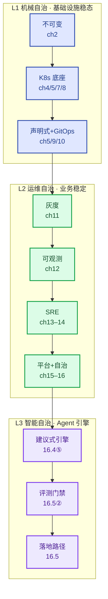

# AI 原生运维体系：以云原生为底座的生产控制系统

这是一本以 **AI 原生运维（AI-native Ops）为主旨**的书：现代生产运维体系从人工操作，演进为声明式、可观测、可治理、可自治的生产控制系统——这条演进的终点（L3 智能自治）就是主旨所在；云原生不是并列的另一个主范式，而是抵达终点的底座与技能基座。

**全书以云为生态**：基础设施层锁定托管 K8s（阿里云 ACK 主参考、AWS EKS 全程对照）+ 云服务（RRSA/IRSA、SLB/NLB、云盘/NAS/OSS、ACR/ECR），**不自建 K8s**；可观测/交付/智能引擎平台栈自建锁死。每个小节按「落地三件套」写作：可运行制品 + 云服务映射 + 数字（见 CONVENTIONS V1.1）。

## 全书主旨：AI 原生运维为纲

**主旨在 AI 原生运维，不在"云原生 + AI 原生"双主范式**。全书要回答的问题是"如何用大模型与智能体重构 IT 运维本身"，终局是 L3 智能自治的生产控制系统；云原生是这条路的底座与技能基座——没有它，引擎无处可靠运行；但它是手段，不是主旨。

> **行业定义（全书总纲 · V1.5）**：AI 原生运维（AIOps / AI-Native Ops）是用大模型与智能体（AI Agent）作为核心引擎重构 IT 运维的新范式——将运维从"人驱动、规则执行"转变为"AI 驱动、人审核"的主动自治模式，实现从底层数据可观测到故障自愈的全链路智能化。六大支柱：**数据底座**（全域可观测：指标/日志/链路追踪）、**核心引擎**（LLM + Agent 意图理解与多步推理）、**分级自治**（参考 L0–L5 自智标准）、**智能告警**（聚合降噪、根因分析）、**故障自愈**（自动诊断与修复执行）、**交互升级**（自然语言查询）。

本书接受这个定义作为主旨总纲，并给出它的工程化交付——模式转变是真的，护栏纪律不降级：行业口径"AI 驱动、人审核"的工程化表述是**白名单内 AI 驱动（自动执行 + 结果校验），白名单外人审核（跨服务/不可逆永远人工审批），边界与护栏由人治理**（16.4）。六支柱逐项落到章节与制品：

| 支柱 | 书内交付（V1） | 章节 |
|---|---|---|
| 数据底座 | OTel 全域可观测（指标/日志/链路）——上下文装配器的供给线 | 12 章 / 16.5① |
| 核心引擎 | 运维 Agent = 闭环制品 + 建议式 LLM 分诊（16.4⑤）；执行式 LLM 引擎归 V2 | 16.4⑤ / 16.5 |
| 分级自治 | 三层自治 L1/L2/L3（治理对象轴）× 行业 L0–L5（自治程度轴）对照 | 1.5 / 16.1 |
| 智能告警 | 口径治理：分级/收敛/降噪/静默（13.1）+ 根因五问（13.3）+ LLM 建议式分诊（16.4⑤）；语义聚合与自动 RCA 引 V2 | 13 章 |
| 故障自愈 | L1 探针自愈 → L2 白名单处置（校验窗 + 升级线）→ 高置信建议自动执行（16.5 步 5），护栏三件套兜底 | 5 / 16.4 / 16.5 |
| 交互升级 | V1 不自建；托管已产品化（STAROps 自然语言诊断，16.4 托管对照）+ 只读值班问答（16.5④）；自建归 V2 | V2 清单 |
| **落地路径** | **七步施工路线：现有章节按序读完 = AIOps 落地路线走完**（数据供给线 → 口径分级 → 自愈通道 → 建议式引擎 → 评测门禁 → 白名单自动执行 → L3），含 90 天节奏与评测门禁 | **16.5** |

同一本书，两种读法：

| 读法 | 视角 |
|---|---|
| 自底向上（按篇顺序） | 第二至四篇打地基（底座 → 交付 → 观测与稳定性），第五篇抵达终局（自治 + Agent 引擎） |
| 纲举目张（以主旨为纲） | 第一篇定纲（AI 原生运维为终局、云原生为必经底座），第二至四篇全是主旨的基座，第 3 章与第 16 章（16.4⑤/16.5）是主线的定义、落地与终局 |

控制权沿链路从"人 → 机械自愈 → 业务自治 → 智能自治"逐级转移——最后一级就是主旨。

它不是工具手册，也不是百科式科普。它讲的是一条**完整的生产控制闭环链路**：从不可变基础设施出发，逐层完成资源控制、交付控制、观测控制、稳定性控制、能力控制，最终抵达智能决策控制。

## 精神内核（全书唯一核心主线）

现代生产运维体系，从人工操作演进为**声明式、可观测、可治理、可自治的生产控制系统**，逐层完成：

> 资源控制 → 交付控制 → 观测控制 → 稳定性控制 → 能力控制 → 智能决策控制

## 三层递进自治模型（全书独家差异化主线）

全书理论支点由三层自治递进构成，分别锚定在三章理论核心：

| 层级 | 理论核心章 | 闭环 | 目标 |
|---|---|---|---|
| **机械自治（控制理论的"闭环控制"）** | 第 5 章 | K8s 声明式调谐闭环：期望状态 → 调谐循环 → 实际状态 | 基础设施层稳态自愈 |
| **运维自治（传统可观测性 + 自动化运维）** | 第 16 章 | SRE 观测驱动闭环：观测风险 → 决策处置 → 结果校验 | 业务稳定性自动化治理 |
| **智能自治（基于 AI Agent 的认知智能）** | 16.4⑤/16.5 | Agent 引擎闭环：观测 → 推理分析 → 智能决策 → 执行 → 校验 → 反馈迭代 | 复杂故障的"AI 驱动、人审核"自治 |

## 核心业务闭环链路（最终定稿）

```text
不可变基础设施
  → Kubernetes 底座
  → 声明式架构
  → GitOps 交付
  → 灰度变更治理
  → OTel 全域可观测
  → SRE 稳定性治理
  → 平台工程能力封装
  → 运维自治
  → LLM 建议式分诊（16.4⑤）
  → 评测门禁与采纳闭环（16.5）
  → AI 智能自治（Agent 引擎）
```

## 全书总图：业务闭环 × 三层自治

两条主线（业务闭环链路 × 三层自治模型）叠在一起，全书只有这一张图：

| 业务闭环步骤 | 章节 | 自治层 | 这一步建立的控制能力 |
|---|---|---|---|
| 不可变基础设施 | 第 2 章 | 地基（控制前） | 制品可信、不可变、可复现 |
| Kubernetes 底座 | 第 4–5、7–8 章 | **L1 基座** | 资源调度、运行时、网络存储 |
| 声明式架构 | 第 5 / 9 章 | **L1 机械自治** | 期望状态 → 调谐 → 实际状态 |
| GitOps 交付 | 第 10 章 | L1 延伸 | 交付层声明式同步 |
| 灰度变更治理 | 第 11 章 | L1 → L2 过渡 | 变更风险护栏（观测决策雏形） |
| OTel 全域可观测 | 第 12 章 | L2 输入 | 全域信号采集（指标/日志/链路） |
| SRE 稳定性治理 | 第 13 / 14 章 | **L2 运维自治** | SLO / 错误预算 / 应急 / 成本 |
| 平台工程能力封装 | 第 15 章 | L2 支撑 | 能力黄金路径、屏蔽复杂度 |
| 运维自治 | 第 16 章 | **L2 核心** | 观测 → 处置 → 校验闭环 |
| LLM 建议式分诊 | 16.4⑤ | **L3 智能自治** | 建议式核心引擎（AI 驱动、人审核） |
| 评测门禁与落地路径 | 16.5 | **L3 核心** | 建议 → 采纳 → 执行 → 反馈闭环 |

**读法**：横着看是"生产控制能力逐层建立"（业务闭环），"自治层"列标出每一步属于 L1/L2/L3 哪一层——两条线在此一图叠合。控制权随链路从"人 → 机械自愈 → 业务自治 → 智能自治"逐级转移，正是全书主线。

全书架构图（业务闭环链路 × 三层自治 × 章节）：



一句话：控制权沿这条链从人 → 机械自愈 → 业务自治 → 智能自治逐级转移，三层自治是它的纵轴。

## 统一术语

- **范式层级**：统一为「**AI 原生**」
- **运维主体**：统一为「**运维 Agent**」——大模型与智能体（LLM + Agent）作为核心引擎重构运维，即主旨本体（V1.11 起「AI 负载」不再是全书运维对象）
- **行业词对照**：业界所称 **AIOps / 智能运维**，本书统一表述为「**AI 原生运维**」——AI 唯一作为运维主体（L3 智能自治 / 运维 Agent）出现；不与厂商 AIOps 平台品类混用（该品类归 V2）
- **分级自治对照**：行业 L0–L5 自智等级量「自治程度」，本书 L1–L3 三层自治分「治理对象」——两把尺正交，粗略映射见 1.5 / 16.1

## 这本书写给谁

- 正在用大模型与智能体重构运维（AIOps 落地）的 SRE 与平台工程师——主旨人群
- 已具备 K8s 与生产运维基础、正在向 AI 原生运维演进的云原生工程师与团队技术负责人
- 想理解「为什么现代运维要演进为自治控制系统」的架构师与决策者

## 五篇结构

全书 15 章核心正文 + 2 个附录，分五篇，不再新增章节（**V1.9 主旨聚焦**：第 17/18 章"AI 负载运维"移出 V1——全书主旨聚焦"用大模型与智能体重构运维"，L3 智能自治承载于 16.4⑤/16.5 Agent 引擎，第 16 章升格全书终章；编号不重排，引用零破坏。**V1.11**：AI 训练/推理负载内容全书清除，不再以"范式认知/V2 预埋"保留。此前 V1.7 已删第 6 章）。

| 篇 | 章节 | 主题 |
|---|---|---|
| **第一篇** 现代运维范式 | 第 1–3 章 | AI 原生运维立论与云原生底座定位（核心立论·主旨） |
| **第二篇** Kubernetes 底座 | 第 4–5、7–8 章 | 生产级核心底座（去重、边界锁死；底座·选读） |
| **第三篇** 声明式交付体系 | 第 9–11 章 | 全维度声明式交付（分工清晰、无冗余） |
| **第四篇** 可观测与稳定性 | 第 12–14 章 | 全域可观测与 SRE 稳定性（技术栈冻结） |
| **第五篇** 平台工程与自治 | 第 15–16 章 | 平台工程、运维自治闭环与 Agent 引擎落地（理论闭环·全书终章） |
| **附录** | 附录 A / B | 安全基线 + 综合实战案例 |

## 目录（15 章 + 2 附录）

### 第一篇 现代运维范式：云原生与 AI 原生顶层架构

- [第1章 云原生与AI原生运维架构演进](01-cloudnative-ai-evolution.md)
- [第2章 不可变基础设施与容器软件供应链治理](02-immutable-infra-supply-chain.md)
- [第3章 AI原生运维统一范式](03-ainative-ops-paradigm.md) — 全书立论宪法

### 第二篇 Kubernetes 生产级核心底座（底座·选读：已具备 K8s 生产基础可跳读）

- [第4章 Kubernetes分布式架构与生产治理](04-k8s-architecture-governance.md)
- [第5章 声明式API与控制循环核心机制](05-declarative-api-reconcile.md) — ★理论核心·机械自治（必读）
- [第7章 Kubernetes资源与精细化调度治理](07-k8s-scheduling-resources.md)
- [第8章 Kubernetes网络、存储与服务治理](08-k8s-network-storage.md)

### 第三篇 全维度声明式交付体系（底座·选读）

- [第9章 一切即代码：声明式治理全域架构](09-everything-as-code.md)
- [第10章 ArgoCD声明式GitOps生产交付体系](10-argocd-gitops.md) — 治理制品变更纪律（16.4⑤ 依赖）
- [第11章 灰度发布与生产变更风险治理](11-canary-release-risk.md)

### 第四篇 全域可观测与 SRE 稳定性体系

- [第12章 OpenTelemetry全域可观测体系](12-opentelemetry-observability.md) — 技术栈永久锁死·数据底座支柱
- [第13章 告警治理、SLO与故障应急体系](13-alerting-slo-incident.md) — 智能告警支柱
- [第14章 SRE稳定性与资源成本治理](14-sre-stability-cost.md)

### 第五篇 平台工程与运维自治闭环

- [第15章 平台工程与开发者自助体系](15-platform-engineering.md)
- [第16章 运维能力平台化与自治闭环](16-ops-autonomy-loop.md) — ★理论核心·运维自治 + L3 Agent 引擎·全书终章

### 附录

- [附录A 云原生与AI原生生产安全基线](appendix-a-security-baseline.md)
- [附录B 企业双原生架构综合实战与五大故障闭环案例](appendix-b-case-studies.md)

## 阅读路径

- **想整体理解**：按章号顺序读。第一篇是立论地基，跳读会缺上下文。
- **想抓 AIOps 落地路线**：直接读 16.5——一张七步表把全书章节串成施工路线，再按需回读各步锚定章节。
- **想抓全书主线**：先读第 1 章（三层自治伏笔）→ 第 5 / 16 章（两层理论核心，L3 智能自治承载于 16.4⑤/16.5）→ 附录 B（案例闭环）。
- **只关心 AI 原生运维（主旨）**：第 3 章 + 第 16 章（16.4⑤/16.5）是主线的定义与落地，但假设已理解第二篇 K8s 底座与第四篇可观测体系——主旨不悬空，底座是它的物理前提。

## 写作约定

所有写作规则、冻结约束、统一模板、技术栈锁死清单与 V2 待迭代清单，集中见：

→ [CONVENTIONS.md（V1.1 规则：云生态主栈 + 落地三件套）](CONVENTIONS.md)

全书各小节「生产检查清单」的完整速查表，集中见：

→ [CHECKLIST.md（全书生产检查清单速查）](CHECKLIST.md)

全书参考文献与权威深读（论文 / 官方文档 / 经典书，按篇组织）：

→ [REFERENCES.md（参考文献与深读）](REFERENCES.md)

每章文首均带：状态标记、篇归属、理论核心标记、技术栈锁死声明、边界声明，以及**承上启下链条句**（承上一章、启下一章，V1.10 起强制链相邻章）；每章文末带**「下一章预告」**（第 16 章为「全书收束」，六支柱终局对账）。

## 文档状态

- **状态**：正文已撰写完成并通过一轮自评，待终审定稿。
- **章节命名**：`NN-title.md`，`NN` 为章号（01–16；06/17/18 已移出、编号不重排），按章号顺序阅读；附录为 `appendix-a.md` / `appendix-b.md`。
- **写作模板**：每小节强制套用 10 步工程化模板（详见 CONVENTIONS.md）。
